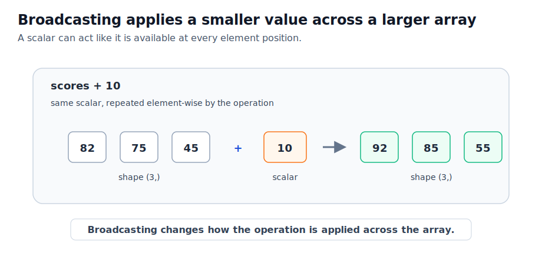
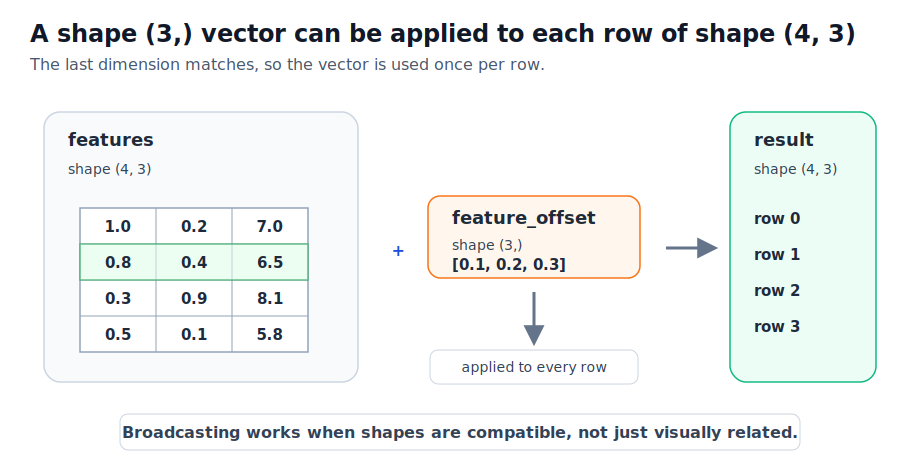

# P2-11.3 브로드캐스팅(broadcasting)과 벡터화(vectorization)

P2-11.1에서는 NumPy 배열(array)의 `shape`, `ndim`, `dtype`을 확인했습니다. P2-11.2에서는 인덱싱(indexing), 슬라이싱(slicing), 축(axis)을 사용해 배열의 어느 부분을 읽고 어느 방향으로 계산할지 봤습니다.

이제 한 단계 더 나아갑니다. NumPy 코드에서는 반복문(loop)을 직접 쓰지 않았는데도 배열 전체에 계산이 적용되는 경우가 자주 보입니다.

예를 들어 다음 코드는 숫자 하나를 배열 전체에 더합니다.

```python
import numpy as np

scores = np.array([82, 75, 45])
print(scores + 10)
```

출력은 다음과 같습니다.

```text
[92 85 55]
```

코드에는 `for`가 없습니다. 하지만 결과를 보면 각 값에 10이 더해졌습니다. 이런 계산을 이해하려면 브로드캐스팅(broadcasting)과 벡터화(vectorization)를 함께 봐야 합니다.

## 이 절의 범위

이 절은 NumPy에서 배열 전체에 계산을 적용하는 기본 방식을 다룹니다.

여기서는 다음 질문에 답합니다.

- 브로드캐스팅(broadcasting)은 무엇을 맞춰 주는가?
- 스칼라(scalar)는 배열과 어떻게 함께 계산되는가?
- `(4, 3)` 배열과 `(3,)` 배열은 왜 더할 수 있는가?
- `(4, 3)` 배열과 `(4,)` 배열은 왜 바로 더하기 어려운가?
- 벡터화(vectorization)는 반복문을 없애는 것인가, 반복을 다른 위치로 옮기는 것인가?
- AI 실습에서 정규화(normalization), 가중치 계산, 특징별 연산이 왜 배열 단위로 자주 쓰이는가?

이 절에서는 고급 브로드캐스팅, `np.newaxis`, `reshape`의 세부 활용, stride, 메모리 뷰(view), 성능 벤치마크, GPU 텐서 연산은 깊게 다루지 않습니다. 여기서는 “shape이 맞으면 반복 계산을 배열 단위로 읽을 수 있다”는 감각을 만드는 데 집중합니다.

## 이 절의 목표

- 브로드캐스팅을 작은 배열이 큰 배열의 shape에 맞춰 계산되는 규칙으로 설명할 수 있습니다.
- 스칼라와 배열의 계산을 위치별(element-wise) 계산으로 읽을 수 있습니다.
- `(n, m)` 데이터 행렬에 `(m,)` 벡터를 더하거나 빼는 예를 설명할 수 있습니다.
- shape이 맞지 않을 때 broadcasting 오류가 날 수 있음을 설명할 수 있습니다.
- 벡터화를 “반복이 사라진 것”이 아니라 “Python 반복문을 배열 연산으로 표현한 것”으로 설명할 수 있습니다.

## 브로드캐스팅은 shape을 맞춰 계산하게 해 준다

NumPy 공식 문서는 브로드캐스팅을 서로 다른 shape을 가진 배열을 산술 연산에서 어떻게 다루는지 설명하는 용어로 소개합니다. 작은 배열은 큰 배열과 호환되는 shape처럼 취급되어 계산됩니다.

입문 단계에서는 이렇게 이해하면 됩니다.

> 브로드캐스팅은 작은 값이나 작은 배열을 더 큰 배열의 모양에 맞춰 반복 적용하는 규칙입니다.

가장 쉬운 예는 스칼라와 배열의 계산입니다.

```python
scores = np.array([82, 75, 45])

print(scores + 10)
print(scores * 2)
```

출력은 다음과 같습니다.

```text
[92 85 55]
[164 150  90]
```

여기서 `10`과 `2`는 스칼라(scalar)입니다. NumPy는 이 스칼라를 배열의 각 위치에 적용합니다.

아래 도식은 스칼라가 배열 전체에 반복 적용되는 모습을 보여 줍니다. 실제로 같은 값을 물리적으로 여러 번 복사한다고 이해하기보다, 계산 규칙상 각 위치에 적용된다고 이해하는 편이 안전합니다.



## 배열끼리 계산할 때는 shape을 먼저 본다

브로드캐스팅은 아무 배열이나 억지로 맞춰 주는 기능이 아닙니다. shape이 맞아야 합니다.

예를 들어 다음 배열을 봅니다.

```python
features = np.array([
    [1.0, 0.2, 7.0],
    [0.8, 0.4, 6.5],
    [0.3, 0.9, 8.1],
    [0.5, 0.1, 5.8],
])

feature_offset = np.array([0.1, 0.2, 0.3])

print(features.shape)
print(feature_offset.shape)
print(features + feature_offset)
```

출력은 다음과 같습니다.

```text
(4, 3)
(3,)
[[1.1 0.4 7.3]
 [0.9 0.6 6.8]
 [0.4 1.1 8.4]
 [0.6 0.3 6.1]]
```

`features`의 shape은 `(4, 3)`입니다. 샘플 4개, 특징 3개로 읽을 수 있습니다.

`feature_offset`의 shape은 `(3,)`입니다. 특징 3개에 각각 더할 값으로 읽을 수 있습니다.

NumPy는 `(3,)` 배열을 각 행(row)에 적용할 수 있다고 판단합니다. 그래서 각 샘플의 세 특징에 같은 offset이 더해집니다.

아래 도식은 `(4, 3)` 데이터 행렬에 `(3,)` 벡터가 행마다 적용되는 모습을 보여 줍니다.



## 맞지 않는 shape은 오류를 만든다

브로드캐스팅은 편리하지만, shape이 맞지 않으면 오류가 납니다.

```python
bad_offset = np.array([10, 20, 30, 40])

print(features.shape)
print(bad_offset.shape)
print(features + bad_offset)
```

이 코드는 오류를 냅니다.

```text
ValueError: operands could not be broadcast together with shapes (4,3) (4,)
```

왜 그럴까요?

`features`는 `(4, 3)`입니다. 한 행에는 특징이 3개 있습니다. 그런데 `bad_offset`은 `(4,)`입니다. 이 값 4개는 행 개수와는 맞아 보이지만, 각 행의 열 개수 3개와는 맞지 않습니다.

입문 단계에서는 다음 기준만 기억해도 충분합니다.

| 계산 | 읽는 법 | 결과 |
| --- | --- | --- |
| `(4, 3) + scalar` | 모든 위치에 같은 값 적용 | 가능 |
| `(4, 3) + (3,)` | 각 행에 길이 3 벡터 적용 | 가능 |
| `(4, 3) + (4,)` | 각 행의 길이 3과 맞지 않음 | 오류 |

정확한 규칙은 더 복잡하지만, 지금은 “마지막 차원부터 맞는지 본다”는 감각이 중요합니다.

## 벡터화는 반복을 배열 연산으로 표현하는 일이다

벡터화(vectorization)는 코드에서 반복문을 직접 쓰지 않고 배열 연산으로 계산을 표현하는 방식입니다.

예를 들어 Python 반복문으로 각 점수에 10을 더하면 다음처럼 쓸 수 있습니다.

```python
scores = [82, 75, 45]

adjusted = []
for score in scores:
    adjusted.append(score + 10)

print(adjusted)
```

NumPy 배열에서는 다음처럼 쓸 수 있습니다.

```python
scores = np.array([82, 75, 45])
adjusted = scores + 10

print(adjusted)
```

둘 다 각 점수에 10을 더합니다. 차이는 표현 방식입니다.

| 방식 | 코드에서 보이는 구조 | 독자가 읽어야 할 관점 |
| --- | --- | --- |
| Python 반복문 | 값을 하나씩 꺼내 처리 | 절차를 직접 쓴다 |
| NumPy 벡터화 | 배열 전체에 연산 적용 | 같은 계산을 배열 단위로 표현한다 |

NumPy 공식 문서는 브로드캐스팅이 배열 연산을 벡터화하는 수단을 제공하며, Python 대신 C 수준에서 반복이 일어나도록 도와준다고 설명합니다. 따라서 벡터화를 “반복이 없어졌다”고 이해하면 곤란합니다.

더 안전한 표현은 다음입니다.

> 벡터화는 반복 계산을 Python 코드의 `for`가 아니라 배열 연산으로 표현하는 방식입니다.

아래 도식은 같은 계산을 반복문과 배열 연산으로 다르게 표현하는 모습을 보여 줍니다.

```d2
direction: right

loop: {
  label: "Python loop view\n\nadjusted = []\nfor score in scores:\n  adjusted.append(score + 10)"
  style.fill: "#f8fafc"
  style.stroke: "#cbd5e1"
  style.stroke-width: 2
}

bridge: {
  label: "same idea"
  shape: rectangle
  style.fill: "#ffffff"
  style.stroke: "#cbd5e1"
}

vectorized: {
  label: "NumPy vectorized view\n\nadjusted = scores + 10"
  style.fill: "#eff6ff"
  style.stroke: "#2563eb"
  style.stroke-width: 2
}

loop -> bridge
bridge -> vectorized
```

## 특징별 평균을 빼는 예

AI 데이터 처리에서 자주 만나는 예는 특징별 평균을 빼는 작업입니다. 평균을 0에 가깝게 맞추는 전처리(preprocessing)의 출발점으로 볼 수 있습니다.

먼저 데이터 행렬을 만듭니다.

```python
features = np.array([
    [1.0, 0.2, 7.0],
    [0.8, 0.4, 6.5],
    [0.3, 0.9, 8.1],
    [0.5, 0.1, 5.8],
])

column_mean = features.mean(axis=0)
centered = features - column_mean

print(column_mean)
print(centered)
```

출력은 다음과 비슷합니다.

```text
[0.65 0.4  6.85]
[[ 0.35 -0.2   0.15]
 [ 0.15  0.   -0.35]
 [-0.35  0.5   1.25]
 [-0.15 -0.3  -1.05]]
```

여기서 `features.mean(axis=0)`은 각 열(column)의 평균을 계산합니다. 결과 shape은 `(3,)`입니다. `features`의 shape은 `(4, 3)`입니다.

`features - column_mean`은 `(4, 3)`에서 `(3,)`을 빼는 계산입니다. NumPy는 `(3,)` 평균 벡터를 각 행에 적용합니다.

이 예제는 P2-11.2의 축(axis) 설명과 이어집니다.

| 코드 | shape | 의미 |
| --- | --- | --- |
| `features` | `(4, 3)` | 샘플 4개, 특징 3개 |
| `features.mean(axis=0)` | `(3,)` | 특징별 평균 |
| `features - column_mean` | `(4, 3)` | 각 샘플에서 특징별 평균을 뺀 결과 |

중요한 것은 “평균을 하나 구했다”가 아닙니다. 어떤 축으로 평균을 냈고, 그 결과가 어떤 shape이며, 원래 배열에 어떻게 적용되는지를 함께 읽어야 합니다.

## 브로드캐스팅은 편하지만 항상 좋은 것은 아니다

브로드캐스팅과 벡터화는 코드를 짧게 만들고, 많은 경우 읽기 쉽게 만듭니다. 하지만 항상 더 좋은 방법이라는 뜻은 아닙니다.

주의할 점은 세 가지입니다.

첫째, shape을 확인하지 않으면 의도와 다른 계산을 할 수 있습니다.

둘째, 복잡한 broadcasting은 초심자가 읽기 어려운 코드가 될 수 있습니다.

셋째, 어떤 경우에는 너무 큰 중간 배열이 만들어져 메모리를 많이 쓸 수 있습니다. NumPy 공식 문서도 broadcasting이 보통 효율적이지만, 특정 알고리즘에서는 메모리를 비효율적으로 쓸 수 있다고 경고합니다.

따라서 입문 단계의 좋은 습관은 다음입니다.

```python
print(features.shape)
print(column_mean.shape)
```

계산하기 전에 shape을 확인합니다.

## 예제 코드 파일

이 절의 예제 코드는 다음 파일로도 확인할 수 있습니다.

- [p2_11_3_broadcast_vectorization.py](../../../assets/part-02/chapter-11/p2_11_3_broadcast_vectorization.py)

로컬 PC에서는 레포지토리 루트에서 다음처럼 실행할 수 있습니다.

```bash
python docs/assets/part-02/chapter-11/p2_11_3_broadcast_vectorization.py
```

Colab에서는 파일 내용을 코드 셀에 붙여 넣어 실행할 수 있습니다.

출력에는 스칼라 broadcasting, 행 벡터 broadcasting, shape mismatch 오류 확인, 특징별 평균 제거 예제가 포함되어 있습니다.

## 이 절에서 기억할 관점

브로드캐스팅은 작은 값이나 작은 배열을 큰 배열의 shape에 맞춰 계산하게 해 주는 규칙입니다.

스칼라는 배열의 각 위치에 적용될 수 있습니다.

`(4, 3)` 배열과 `(3,)` 배열은 각 행의 길이 3에 맞아 계산될 수 있습니다.

`(4, 3)` 배열과 `(4,)` 배열은 겉으로는 행 개수와 맞아 보이지만, 마지막 차원 기준으로는 맞지 않아 오류가 날 수 있습니다.

벡터화는 반복 계산을 배열 연산으로 표현하는 방식입니다.

브로드캐스팅과 벡터화를 사용할 때는 계산 전후의 `shape`을 확인해야 합니다.

## 체크리스트

- 스칼라와 배열의 계산을 broadcasting으로 설명할 수 있다.
- `(4, 3) + (3,)`이 왜 가능한지 설명할 수 있다.
- `(4, 3) + (4,)`이 왜 바로 실패할 수 있는지 설명할 수 있다.
- Python 반복문과 NumPy 벡터화 표현의 차이를 설명할 수 있다.
- `features.mean(axis=0)`의 결과 shape을 설명할 수 있다.
- 특징별 평균을 빼는 계산에서 broadcasting이 어디서 일어나는지 설명할 수 있다.
- broadcasting이 항상 좋은 선택은 아니며, shape과 메모리 사용을 확인해야 함을 설명할 수 있다.

## 출처와 참고 자료

- NumPy Developers, [Broadcasting](https://numpy.org/doc/stable/user/basics.broadcasting.html){: target="_blank" rel="noopener noreferrer" }, 확인 날짜: 2026-06-25.
- NumPy Developers, [NumPy quickstart](https://numpy.org/doc/stable/user/quickstart.html){: target="_blank" rel="noopener noreferrer" }, 확인 날짜: 2026-06-25.
- NumPy Developers, [NumPy: the absolute basics for beginners](https://numpy.org/doc/stable/user/absolute_beginners.html){: target="_blank" rel="noopener noreferrer" }, 확인 날짜: 2026-06-25.
