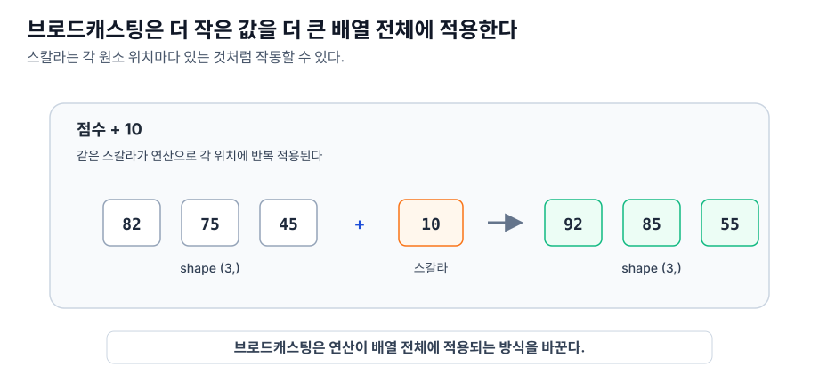
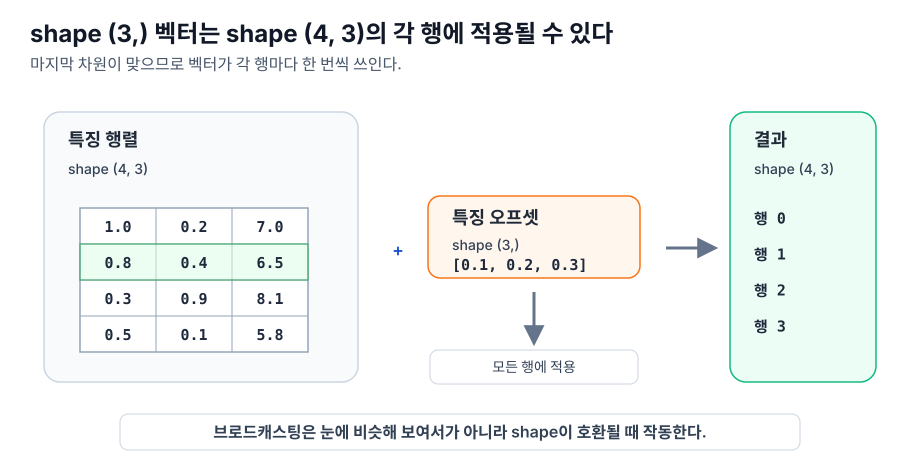

# P2-11.3 브로드캐스팅(broadcasting)과 벡터화(vectorization)

> Section ID: `P2-11.3`
> Version: `v2026.09.08`

## 스칼라와 배열의 계산

NumPy 공식 문서는 브로드캐스팅을 서로 다른 shape을 가진 배열을 산술 연산에서 어떻게 다루는지 설명하는 용어로 소개합니다. 작은 배열은 큰 배열과 호환되는 shape처럼 취급되어 계산됩니다.

브로드캐스팅은 `서로 다른 모양의 배열에 같은 계산 규칙을 적용하는 방법`입니다.

점수 `[82, 75, 45]`에 각각 10을 더하거나 2를 곱합니다. 첫 배열은 `[92, 85, 55]`, 둘째 배열은 `[164, 150, 90]`이 됩니다.

```python
import numpy as np

scores = np.array([82, 75, 45])

print(scores + 10)
print(scores * 2)
```

출력은 다음과 같습니다.

```text
[92 85 55]
[164 150  90]
```

여기서 `10`과 `2`는 스칼라(scalar)입니다. NumPy는 이 스칼라를 배열의 각 위치에 적용합니다.

아래 도식은 스칼라가 배열 전체에 반복 적용되는 모습을 보여 줍니다. 실제로 같은 값을 물리적으로 여러 번 복사한다고 이해하기보다, 계산 규칙상 각 위치에 적용된다고 이해하는 편이 안전합니다.



## 특징별 보정값 더하기

브로드캐스팅은 아무 배열이나 억지로 맞춰 주는 기능이 아닙니다. shape이 맞아야 합니다.

네 샘플의 특징 세 개를 행렬에 담고, 각 특징에 `[0.1, 0.2, 0.3]`을 더합니다. 첫 샘플 `[1.0, 0.2, 7.0]`은 `[1.1, 0.4, 7.3]`으로 바뀝니다.

```python
features = np.array([
    [1.0, 0.2, 7.0],
    [0.8, 0.4, 6.5],
    [0.3, 0.9, 8.1],
    [0.5, 0.1, 5.8],
])

feature_offset = np.array([0.1, 0.2, 0.3])

print(features.shape)
print(feature_offset.shape)
print(features + feature_offset)
```

출력은 다음과 같습니다.

```text
(4, 3)
(3,)
[[1.1 0.4 7.3]
 [0.9 0.6 6.8]
 [0.4 1.1 8.4]
 [0.6 0.3 6.1]]
```

이 예제는 행에 샘플, 열에 특징을 배치했으므로 `(4, 3)`은 샘플 4개와 특징 3개를 뜻합니다.

`feature_offset`의 shape은 `(3,)`입니다. 특징 3개에 각각 더할 값으로 읽을 수 있습니다.

NumPy는 `(3,)` 배열을 각 행(row)에 적용할 수 있다고 판단합니다. 그래서 각 샘플의 세 특징에 같은 offset이 더해집니다.

아래 도식은 `(4, 3)` 데이터 행렬에 `(3,)` 벡터가 행마다 적용되는 모습을 보여 줍니다.



## 모양 호환성

같은 행렬에 길이 4인 벡터를 더하면 `ValueError`가 발생합니다. 행 수가 4여도 마지막 차원인 열 수 3과 맞지 않기 때문입니다.

```python
bad_offset = np.array([10, 20, 30, 40])

print(features.shape)
print(bad_offset.shape)
print(features + bad_offset)
```

이 코드는 오류를 냅니다.

```text
ValueError: operands could not be broadcast together with shapes (4,3) (4,)
```

`features`는 `(4, 3)`입니다. 한 행에는 특징이 3개 있습니다. 그런데 `bad_offset`은 `(4,)`입니다. 이 값 4개는 행 개수와는 맞아 보이지만, 각 행의 열 개수 3개와는 맞지 않습니다.

| 계산 | 읽는 법 | 결과 |
| --- | --- | --- |
| `(4, 3) + scalar` | 모든 위치에 같은 값 적용 | 가능 |
| `(4, 3) + (3,)` | 각 행에 길이 3 벡터 적용 | 가능 |
| `(4, 3) + (4,)` | 각 행의 길이 3과 맞지 않음 | 오류 |

브로드캐스팅은 마지막 차원부터 비교합니다. 대응하는 크기가 같거나 둘 중 하나가 1이면 호환됩니다. 없는 앞쪽 차원은 1로 취급합니다. `(4, 3)`과 `(3,)`은 마지막 크기가 같지만, `(4, 3)`과 `(4,)`은 3과 4가 달라 호환되지 않습니다.

## 반복문과 배열 연산

벡터화(vectorization)는 코드에서 반복문을 직접 쓰지 않고 배열 연산으로 계산을 표현하는 방식입니다.

예를 들어 Python 반복문으로 각 점수에 10을 더하면 다음처럼 쓸 수 있습니다.

```python
scores = [82, 75, 45]

adjusted = []
for score in scores:
    adjusted.append(score + 10)

print(adjusted)
```

반복문은 `[92, 85, 55]`를 출력합니다. 같은 입력을 NumPy 배열로 바꾸면 `scores + 10`으로 같은 세 값을 계산합니다.

```python
scores = np.array([82, 75, 45])
adjusted = scores + 10

print(adjusted)
```

둘 다 각 점수에 10을 더합니다. 차이는 표현 방식입니다.

| 방식 | 코드에서 보이는 구조 | 독자가 읽어야 할 관점 |
| --- | --- | --- |
| Python 반복문 | 값을 하나씩 꺼내 처리 | 절차를 직접 쓴다 |
| NumPy 벡터화 | 배열 전체에 연산 적용 | 같은 계산을 배열 단위로 표현한다 |

NumPy 공식 문서는 브로드캐스팅이 배열 연산을 벡터화하는 수단을 제공하며, Python 대신 C 수준에서 반복이 일어나도록 도와준다고 설명합니다. 따라서 벡터화를 “반복이 없어졌다”고 이해하면 곤란합니다.

아래 도식은 같은 계산을 반복문과 배열 연산으로 다르게 표현하는 모습을 보여 줍니다.

```mermaid
--8<-- "assets/part-02/chapter-11/loop-to-vectorization-flow-ko.mmd"
```

## 특징별 평균을 빼는 예

AI 데이터 처리에서 자주 만나는 예는 특징별 평균을 빼는 작업입니다. 평균을 0에 가깝게 맞추는 전처리(preprocessing)의 출발점으로 볼 수 있습니다.

네 샘플의 열별 평균은 `[0.65, 0.4, 6.85]`입니다. 이를 각 행에서 빼면 첫 행은 `[0.35, -0.2, 0.15]`이 됩니다.

```python
features = np.array([
    [1.0, 0.2, 7.0],
    [0.8, 0.4, 6.5],
    [0.3, 0.9, 8.1],
    [0.5, 0.1, 5.8],
])

column_mean = features.mean(axis=0)
centered = features - column_mean

print(column_mean)
print(centered)
```

출력은 다음과 비슷합니다.

```text
[0.65 0.4  6.85]
[[ 0.35 -0.2   0.15]
 [ 0.15  0.   -0.35]
 [-0.35  0.5   1.25]
 [-0.15 -0.3  -1.05]]
```

여기서 `features.mean(axis=0)`은 각 열(column)의 평균을 계산합니다. 결과 shape은 `(3,)`입니다. `features`의 shape은 `(4, 3)`입니다.

`features - column_mean`은 `(4, 3)`에서 `(3,)`을 빼는 계산입니다. NumPy는 `(3,)` 평균 벡터를 각 행에 적용합니다.

| 코드 | shape | 의미 |
| --- | --- | --- |
| `features` | `(4, 3)` | 샘플 4개, 특징 3개 |
| `features.mean(axis=0)` | `(3,)` | 특징별 평균 |
| `features - column_mean` | `(4, 3)` | 각 샘플에서 특징별 평균을 뺀 결과 |

중심화한 배열의 각 열 평균은 부동소수점 계산 오차 범위에서 0입니다. `axis=1`로 바꾸면 행별 평균 네 개가 나와 `(4,)`가 되므로, 같은 뺄셈은 실패합니다.

## 중간 배열과 메모리

브로드캐스팅은 입력을 반복 복사하지 않고도 연산할 수 있지만, 연산 결과 배열에는 메모리가 필요합니다. 예를 들어 `(10000, 1)` 배열과 `(1, 10000)` 배열을 더하면 결과는 `(10000, 10000)`이 됩니다. 원소 1억 개를 `float64`로 저장하는 데만 약 800MB가 필요합니다. 입력 크기뿐 아니라 결과의 `shape`도 확인해야 합니다.

## 예제 코드 파일

이 절의 예제 코드는 다음 파일로도 확인할 수 있습니다.

- [p2_11_3_broadcast_vectorization.py](../../../assets/part-02/chapter-11/p2_11_3_broadcast_vectorization.py)

로컬 PC에서는 프로젝트 루트에서 다음처럼 실행할 수 있습니다.

```bash
python docs/assets/part-02/chapter-11/p2_11_3_broadcast_vectorization.py
```

Colab에서는 파일 내용을 코드 셀에 붙여 넣어 실행할 수 있습니다.

출력에는 스칼라 broadcasting, 행 벡터 broadcasting, shape mismatch 오류 확인, 특징별 평균 제거 예제가 포함되어 있습니다.

## 사례 1. 과목별 보정과 학생별 보정

두 학생의 국어·수학·영어 점수가 각각 `[80, 70, 90]`, `[60, 90, 75]`라고 합시다. 과목별로 국어 5점, 수학 10점, 영어 0점을 더하려면 길이 3인 벡터를 사용합니다. 결과는 `[85, 80, 90]`, `[65, 100, 75]`입니다.

```python
marks = np.array([[80, 70, 90], [60, 90, 75]])
subject_bonus = np.array([5, 10, 0])
student_bonus = np.array([[5], [10]])

print(marks + subject_bonus)
print(marks + student_bonus)
```

```text
[[ 85  80  90]
 [ 65 100  75]]
[[ 85  75  95]
 [ 70 100  85]]
```

학생별로 첫 학생에게 5점, 둘째 학생에게 10점을 더할 때는 `(2, 1)` 배열을 사용합니다. 각 행의 보정값 하나가 세 과목에 적용됩니다. 이를 `[5, 10]`으로 적으면 `(2,)`이 되어 마지막 차원 3과 맞지 않으므로 오류가 납니다.

`subject_bonus`의 두 번째 값을 10에서 0으로 바꾸면 첫 출력에서 수학 점수만 원래 값인 70과 90으로 돌아갑니다. `student_bonus`의 두 번째 값을 10에서 0으로 바꾸면 둘째 출력에서 두 번째 학생의 세 과목 점수가 모두 원래 값으로 돌아갑니다. 같은 덧셈이어도 보정값의 배치에 따라 적용 대상이 달라집니다.

## 체크리스트

- 스칼라와 배열의 계산을 broadcasting으로 설명할 수 있다.
- `(4, 3) + (3,)`이 왜 가능한지 설명할 수 있다.
- `(4, 3) + (4,)`이 왜 바로 실패할 수 있는지 설명할 수 있다.
- Python 반복문과 NumPy 벡터화 표현의 차이를 설명할 수 있다.
- `features.mean(axis=0)`의 결과 shape을 설명할 수 있다.
- 특징별 평균을 빼는 계산에서 broadcasting이 어디서 일어나는지 설명할 수 있다.
- broadcasting이 항상 좋은 선택은 아니며, shape과 메모리 사용을 확인해야 함을 설명할 수 있다.

## 출처와 참고 자료

- NumPy Developers, [Broadcasting](https://numpy.org/doc/stable/user/basics.broadcasting.html){: target="_blank" rel="noopener noreferrer" }, NumPy v2.5 Manual, 확인 날짜: 2026-09-08. broadcasting 규칙, 차원 비교, shape mismatch 오류 설명을 현재 절의 핵심 근거로 사용했다.
- NumPy Developers, [NumPy quickstart](https://numpy.org/doc/stable/user/quickstart.html){: target="_blank" rel="noopener noreferrer" }, NumPy v2.5 Manual, 확인 날짜: 2026-07-20. 배열 산술, universal functions, 기본 축 계산 예시 확인에 사용했다.
- NumPy Developers, [NumPy: the absolute basics for beginners](https://numpy.org/doc/stable/user/absolute_beginners.html){: target="_blank" rel="noopener noreferrer" }, NumPy v2.5 Manual, 확인 날짜: 2026-07-20. Python 반복 대신 배열 단위 계산으로 읽는 입문 설명과 shape 확인 흐름의 근거로 사용했다.
