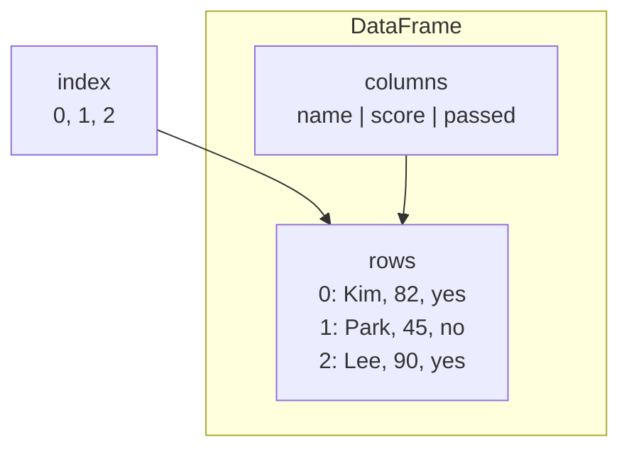

# P2-12.1 Pandas DataFrame은 무엇을 표현하는가

P2-11장에서는 NumPy 배열(array)로 벡터(vector), 행렬(matrix), 축(axis), 브로드캐스팅(broadcasting)을 다뤘습니다. 그 흐름은 수치 계산에는 강하지만, 표(table)처럼 생긴 데이터셋(dataset)을 읽을 때는 질문이 조금 바뀝니다.

현실의 데이터는 종종 이런 모양으로 옵니다.

| name | score | passed |
| --- | ---: | --- |
| Kim | 82 | yes |
| Park | 45 | no |
| Lee | 90 | yes |

이 표를 보면 우리는 위치(position)보다 `누가`, `어떤 열(column)`, `어떤 값(value)`인가를 먼저 읽습니다. Pandas의 DataFrame은 바로 이런 표 형식 데이터를 다루기 위한 중심 구조입니다.

## 이 절의 범위

이 절은 DataFrame을 깊게 조작하는 방법을 다루지 않습니다. `loc`, `iloc`, 필터링(filtering), 정렬(sort), 집계(aggregation), 결측치 처리(missing value handling)는 다음 절로 넘깁니다.

여기서는 다음 질문에 답합니다.

- DataFrame은 NumPy 배열과 무엇이 다른가?
- DataFrame의 행(row), 열(column), 인덱스(index)는 각각 무엇을 가리키는가?
- 왜 표 데이터는 배열보다 DataFrame으로 읽는 편이 자연스러운가?
- 학습용 데이터셋에서 한 행과 한 열을 어떻게 해석하면 좋은가?
- DataFrame을 처음 받으면 무엇부터 확인해야 하는가?

## 이 절의 목표

- DataFrame을 라벨(label)이 붙은 2차원 표 형식 데이터 구조로 설명할 수 있습니다.
- 행, 열, 인덱스가 각각 무엇을 식별하는지 설명할 수 있습니다.
- DataFrame이 같은 표 안에 숫자와 문자열 같은 서로 다른 타입(type)을 함께 담을 수 있음을 설명할 수 있습니다.
- 머신러닝 데이터셋에서 한 행은 하나의 사례(case) 또는 샘플(sample), 한 열은 하나의 변수(variable) 또는 특징(feature)으로 읽을 수 있음을 설명할 수 있습니다.
- DataFrame을 처음 받았을 때 `shape`, `columns`, `index`, `dtypes`, `head()`를 왜 먼저 확인하는지 설명할 수 있습니다.

## DataFrame은 라벨이 붙은 2차원 표다

Pandas 공식 문서는 `DataFrame`을 2차원(two-dimensional), 크기 변경 가능(size-mutable), 잠재적으로 서로 다른 타입을 함께 담을 수 있는(potentially heterogeneous) 표 형식(tabular) 데이터라고 설명합니다. 또한 행과 열에 라벨이 붙어 있고, 연산은 이 라벨을 기준으로 정렬(alignment)될 수 있다고 설명합니다.

입문 단계에서는 이렇게 이해하면 충분합니다.

> DataFrame은 행과 열 이름이 붙어 있는 표이며, 각 열이 서로 다른 의미와 타입을 가질 수 있는 데이터 구조입니다.

NumPy 배열이 위치 기반 계산에 강하다면, DataFrame은 `표의 의미`를 드러내는 데 강합니다.

| 구조 | 먼저 보는 것 | 잘 맞는 질문 |
| --- | --- | --- |
| NumPy array | 위치, shape, axis | 몇 번째 값인가, 어느 방향으로 계산하는가 |
| Pandas DataFrame | 행 이름, 열 이름, 열의 의미 | 어떤 사례인가, 어떤 변수인가, 어떤 열을 비교할 것인가 |

가장 단순한 생성 예는 `dict`로 열을 넣는 방식입니다.

```python
import pandas as pd

df = pd.DataFrame(
    {
        "name": ["Kim", "Park", "Lee"],
        "score": [82, 45, 90],
        "passed": ["yes", "no", "yes"],
    }
)

print(df)
```

하지만 현실의 원본 데이터는 종종 `행` 중심으로도 옵니다. 예를 들어 JSON 응답이나 로그 묶음은 다음처럼 `dict`의 리스트(list of dictionaries)로 들어올 수 있습니다.

```python
rows = [
    {"name": "Kim", "score": 82, "passed": "yes"},
    {"name": "Park", "score": 45, "passed": "no"},
    {"name": "Lee", "score": 90, "passed": "yes"},
]

df = pd.DataFrame(rows)
print(df)
```

두 방식 모두 같은 표를 만들 수 있습니다. 입문 단계에서는 이렇게 구분하면 충분합니다.

- 열 중심 입력: `각 열에 어떤 값 묶음이 들어가는가`를 먼저 생각한다.
- 행 중심 입력: `각 사례가 어떤 속성 묶음으로 들어오는가`를 먼저 생각한다.

## 행, 열, 인덱스를 따로 읽는다

DataFrame을 처음 보면 표 전체만 보이기 쉽지만, 실제로는 세 층을 함께 읽어야 합니다.

1. 행(row): 사례(case), 샘플(sample), 관측(observation)
2. 열(column): 변수(variable), 특징(feature), 속성(attribute)
3. 인덱스(index): 행을 식별하는 라벨(label)

아래 작은 예를 봅니다.

```python
import pandas as pd

df = pd.DataFrame(
    {
        "name": ["Kim", "Park", "Lee"],
        "score": [82, 45, 90],
        "passed": ["yes", "no", "yes"],
    }
)

print(df)
```

출력은 다음처럼 읽을 수 있습니다.

```text
   name  score passed
0   Kim     82    yes
1  Park     45     no
2   Lee     90    yes
```

여기서:

- 왼쪽의 `0, 1, 2`는 인덱스(index)입니다.
- `name`, `score`, `passed`는 열 이름(column labels)입니다.
- 각 가로줄은 한 사람에 대한 한 행(row)입니다.

도식으로 보면 더 분명합니다.



이 도식의 핵심은 인덱스가 데이터 값 자체가 아니라 `행을 가리키는 기준`이라는 점입니다.

## 인덱스는 단순 번호일 수도 있고, 의미 있는 라벨일 수도 있다

Pandas 공식 문서는 인덱스를 따로 주지 않으면 `RangeIndex`를 기본으로 쓴다고 설명합니다. 그래서 처음 만든 DataFrame에는 `0, 1, 2, ...` 같은 번호가 자주 보입니다.

하지만 인덱스는 꼭 번호일 필요가 없습니다.

```python
df = pd.DataFrame(
    {
        "score": [82, 45, 90],
        "passed": ["yes", "no", "yes"],
    },
    index=["Kim", "Park", "Lee"],
)

print(df)
```

출력은 다음처럼 바뀝니다.

```text
      score passed
Kim      82    yes
Park     45     no
Lee      90    yes
```

이제 `Kim`, `Park`, `Lee`가 행 라벨이 됩니다. 입문 단계에서는 이렇게 기억하면 됩니다.

- 번호 인덱스: 기본 순서를 가리킨다.
- 라벨 인덱스: 행의 이름이나 식별자를 가리킨다.

이 차이는 다음 절에서 선택(select)과 필터링(filtering)을 배울 때 중요해집니다.

작은 실험으로 보면 더 분명합니다.

```python
print(df.index)
```

번호 인덱스를 쓴 경우 출력은 다음처럼 읽힙니다.

```text
RangeIndex(start=0, stop=3, step=1)
```

반대로 식별자 라벨을 인덱스로 주면 다음처럼 읽힐 수 있습니다.

```text
Index(['Kim', 'Park', 'Lee'], dtype='object')
```

즉, 인덱스는 표 왼쪽에 보이는 장식이 아니라, 행을 가리키는 또 하나의 구조입니다.

## DataFrame은 서로 다른 타입의 열을 함께 담는다

NumPy 배열은 보통 같은 타입(dtype)의 숫자를 한꺼번에 계산하는 데 강합니다. 반면 표 데이터는 한 열은 숫자이고, 다른 열은 문자열일 수 있습니다.

위 예제에서도:

- `name` 열은 문자열(string)입니다.
- `score` 열은 숫자(number)입니다.
- `passed` 열은 범주(categorical)처럼 읽을 수 있는 문자열입니다.

그래서 DataFrame은 `열마다 의미가 다를 수 있다`는 현실 데이터를 더 자연스럽게 담습니다.

이 점은 머신러닝 데이터셋을 준비할 때 중요합니다. 실제 데이터는 숫자 열만 있지 않고, 날짜(date), 문자열(text), 범주(category), 결측치(missing value)가 섞여 있는 경우가 많기 때문입니다.

예를 들어 다음처럼 타입을 확인할 수 있습니다.

```python
print(df.dtypes)
```

출력은 대략 다음처럼 보일 수 있습니다.

```text
name      object
score      int64
passed    object
dtype: object
```

여기서 중요한 것은 `DataFrame 전체의 타입`이 아니라 `열마다 타입이 따로 보인다`는 점입니다.

- `score`는 수치 계산에 바로 쓰기 쉬운 열입니다.
- `name`, `passed`는 그대로는 수치 계산보다 식별과 구분에 더 가까운 열입니다.

이 감각이 있어야 나중에 `어떤 열을 모델 입력으로 쓸 것인가`, `어떤 열은 먼저 변환해야 하는가`를 판단할 수 있습니다.

## 한 행은 하나의 사례, 한 열은 하나의 변수로 읽는다

학습용 표 데이터를 처음 읽을 때 가장 중요한 습관은 다음입니다.

> 한 행은 하나의 사례, 한 열은 하나의 변수라고 먼저 가정해 본다.

예를 들어 고객 데이터가 있다면:

| customer_id | age | region | purchased |
| --- | ---: | --- | --- |
| C001 | 29 | Seoul | yes |
| C002 | 41 | Busan | no |
| C003 | 35 | Seoul | yes |

이 표는 이렇게 읽을 수 있습니다.

- 각 행(row): 한 명의 고객
- `age`, `region`: 입력 변수 또는 특징(feature)
- `purchased`: 예측하고 싶은 대상(target) 후보

아직 모델을 학습하지 않더라도, 이 읽기 방식이 잡혀 있어야 나중에 `feature`, `label`, `target`, `split` 같은 말이 헷갈리지 않습니다.

물론 모든 표가 반드시 이 구조를 따르는 것은 아닙니다. 어떤 표는 시간 순서 기록(log)일 수도 있고, 어떤 표는 요약 집계 결과일 수도 있습니다. 그래도 입문 단계에서는 `행은 사례, 열은 변수`라는 기본 가정을 먼저 두는 것이 도움이 됩니다.

## DataFrame은 배열과 경쟁하는 구조가 아니라 역할이 다르다

DataFrame과 NumPy 배열을 둘 중 하나만 써야 하는 경쟁 관계로 볼 필요는 없습니다.

두 구조는 자주 함께 씁니다.

| 작업 | 더 자연스러운 구조 |
| --- | --- |
| 표 데이터 읽기, 열 이름 보기, 데이터셋 정리 | DataFrame |
| 수치 배열 계산, 벡터화, 선형대수 계산 | NumPy array |
| 모델 입력 직전 숫자 배열로 바꾸기 | DataFrame에서 array로 이동 |

실무와 실습에서는 이런 흐름이 흔합니다.

1. CSV를 읽어 DataFrame으로 확인한다.
2. 필요한 열만 고른다.
3. 결측치와 타입을 정리한다.
4. 숫자 중심 계산이 필요하면 NumPy 배열이나 모델 입력 형태로 넘긴다.

즉, DataFrame은 데이터를 `설명 가능한 표`로 다루는 단계에 강하고, NumPy는 `배열 계산` 단계에 강합니다.

## DataFrame을 처음 받으면 무엇부터 확인하는가

처음 받은 DataFrame에서 바로 복잡한 조작부터 할 필요는 없습니다. 먼저 구조를 확인해야 합니다.

```python
print(df.shape)
print(df.columns)
print(df.index)
print(df.dtypes)
print(df.head())
```

각 항목은 다음 질문에 답합니다.

| 확인 항목 | 질문 |
| --- | --- |
| `shape` | 몇 행 몇 열인가 |
| `columns` | 어떤 열들이 있는가 |
| `index` | 행을 무엇으로 식별하는가 |
| `dtypes` | 각 열은 어떤 타입으로 읽히는가 |
| `head()` | 앞부분 몇 줄은 어떤 모양인가 |

이 다섯 가지는 DataFrame의 `첫 인상 점검표`라고 볼 수 있습니다.

특히 `dtypes`는 중요합니다. 눈으로 보기에는 숫자처럼 보여도 문자열로 들어와 있는 경우가 있기 때문입니다. 이 문제는 다음 절에서 필터링과 집계를 할 때 바로 영향을 줍니다.

작은 예로 한 번에 보면 이런 식입니다.

```python
print(df.shape)
print(df.columns)
print(df.index)
print(df.dtypes)
print(df.head(2))
```

출력은 대략 다음처럼 읽을 수 있습니다.

```text
(3, 3)
Index(['name', 'score', 'passed'], dtype='object')
RangeIndex(start=0, stop=3, step=1)
name      object
score      int64
passed    object
dtype: object
   name  score passed
0   Kim     82    yes
1  Park     45     no
```

이 다섯 줄은 DataFrame의 구조를 빠르게 훑는 기본 점검에 가깝습니다.

- `shape`: 표의 크기
- `columns`: 열 이름 목록
- `index`: 행 라벨 구조
- `dtypes`: 열 타입
- `head(2)`: 실제 앞부분 모습

아직 조작을 시작하지 않아도, 이 확인만으로도 “이 표가 어떤 종류의 데이터인가”를 훨씬 빨리 파악할 수 있습니다.

## 이 절에서 기억할 관점

- DataFrame은 라벨이 붙은 2차원 표 형식 데이터 구조입니다.
- 한 행은 사례, 한 열은 변수로 읽는 습관이 중요합니다.
- 인덱스는 단순 번호일 수도 있고 의미 있는 행 라벨일 수도 있습니다.
- DataFrame은 서로 다른 타입의 열을 함께 담을 수 있어 현실 데이터에 자연스럽습니다.
- 배열 계산은 NumPy가, 표 구조와 열 의미 확인은 DataFrame이 더 자연스러운 경우가 많습니다.

## 체크리스트

- DataFrame을 `행과 열 이름이 있는 표`로 설명할 수 있는가?
- 행, 열, 인덱스의 역할을 각각 말할 수 있는가?
- DataFrame이 숫자와 문자열 열을 함께 담을 수 있음을 설명할 수 있는가?
- 머신러닝 데이터셋에서 한 행과 한 열을 어떻게 읽는지 설명할 수 있는가?
- `shape`, `columns`, `index`, `dtypes`, `head()`를 왜 먼저 확인하는지 설명할 수 있는가?

## 출처와 참고 자료

- pandas Developers, `pandas.DataFrame`, pandas API reference, 확인 날짜: 2026-06-25. [https://pandas.pydata.org/docs/reference/api/pandas.DataFrame.html](https://pandas.pydata.org/docs/reference/api/pandas.DataFrame.html){: target="_blank" rel="noopener noreferrer" }
- pandas Developers, `Package overview`, pandas documentation, 확인 날짜: 2026-06-25. [https://pandas.pydata.org/docs/getting_started/overview.html](https://pandas.pydata.org/docs/getting_started/overview.html){: target="_blank" rel="noopener noreferrer" }
