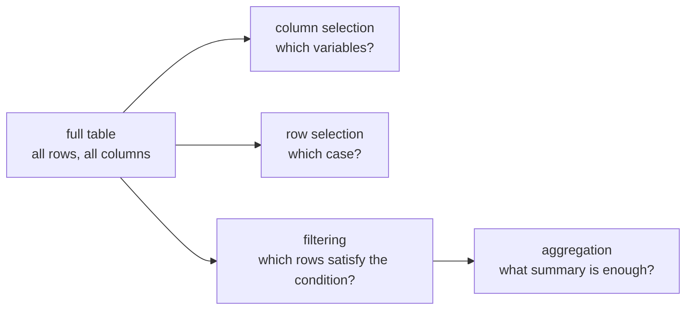
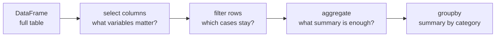

# P2-12.2 선택, 필터링, 집계

P2-12.1에서는 Pandas `DataFrame`을 행(row), 열(column), 인덱스(index)가 있는 표 형식 데이터 구조로 봤습니다. 이제 질문이 하나 더 생깁니다.

표를 받았다고 해서 필요한 정보가 바로 보이는 것은 아닙니다. 실제로는 다음과 같은 일을 계속 하게 됩니다.

- 특정 열만 고른다.
- 특정 행만 본다.
- 조건에 맞는 행만 남긴다.
- 숫자 열의 평균이나 개수를 확인한다.
- 범주별로 나누어 요약한다.

Pandas에서 선택(select), 필터링(filtering), 집계(aggregation)는 바로 이 흐름을 다룹니다.

## 이 절의 범위

이 절은 DataFrame을 본격적으로 정제(cleaning)하거나 결측치(missing value)를 처리하는 단계까지 들어가지 않습니다. `merge`, `join`, `pivot`, 시계열(time series), 다중 인덱스(MultiIndex)도 다루지 않습니다.

여기서는 다음 질문에 답합니다.

- 한 열(column)과 여러 열(columns)을 고른다는 것은 무엇이 다른가?
- `loc`와 `iloc`는 각각 어떤 기준으로 행과 열을 고르는가?
- 조건 필터는 어떤 행만 남기는가?
- 평균(mean), 개수(count), 합(sum) 같은 집계는 무엇을 요약하는가?
- `groupby`는 왜 자주 등장하는가?

## 이 절의 목표

- 한 열 선택과 여러 열 선택의 결과가 어떻게 다른지 설명할 수 있습니다.
- `loc`는 라벨(label), `iloc`는 위치(position)를 기준으로 읽는다고 설명할 수 있습니다.
- 불리언(Boolean) 조건으로 행을 거른다는 뜻을 설명할 수 있습니다.
- 집계는 원래 표 전체를 더 작은 요약값으로 바꾸는 과정이라고 설명할 수 있습니다.
- `groupby`를 같은 범주끼리 먼저 묶고 나서 요약하는 방식으로 설명할 수 있습니다.

## 예제 표를 먼저 고정한다

이 절에서는 다음 작은 표를 계속 사용합니다.

```python
import pandas as pd

df = pd.DataFrame(
    {
        "name": ["Kim", "Park", "Lee", "Choi"],
        "score": [82, 45, 90, 73],
        "passed": ["yes", "no", "yes", "yes"],
        "region": ["Seoul", "Busan", "Seoul", "Busan"],
    }
)

print(df)
```

출력은 다음처럼 읽을 수 있습니다.

```text
   name  score passed region
0   Kim     82    yes  Seoul
1  Park     45     no  Busan
2   Lee     90    yes  Seoul
3  Choi     73    yes  Busan
```

이 표를 보고 우리는 “전체를 다 보는 것”에서 시작하지만, 곧바로 “어느 열?”, “어느 행?”, “어떤 조건?”이라는 질문으로 이동합니다.

도식으로 보면 이 절의 흐름은 다음과 같습니다.



## 한 열을 고르면 Series가 된다

Pandas에서는 한 열을 고를 수 있습니다.

```python
print(df["score"])
```

출력은 대략 다음처럼 보입니다.

```text
0    82
1    45
2    90
3    73
Name: score, dtype: int64
```

여기서 중요한 점은 결과가 `DataFrame`이 아니라 `Series`라는 것입니다. `Series`는 한 줄짜리 표가 아니라, 인덱스가 붙은 1차원 값 열로 읽을 수 있습니다.

입문 단계에서는 이렇게 기억하면 충분합니다.

- `df["score"]`: 한 열을 꺼낸다. 결과는 보통 `Series`
- `df[["name", "score"]]`: 여러 열을 고른다. 결과는 `DataFrame`

예를 들어:

```python
print(df[["name", "score"]])
```

출력은 여전히 표 모양입니다.

```text
   name  score
0   Kim     82
1  Park     45
2   Lee     90
3  Choi     73
```

즉, 한 열을 고르면 값 열 하나를 읽는 느낌이 강해지고, 여러 열을 고르면 원래 표의 일부를 떼어 보는 느낌이 남습니다.

같은 차이를 표로 보면 더 분명합니다.

| 코드 | 결과 형태 | 읽는 질문 |
| --- | --- | --- |
| `df["score"]` | `Series` | 점수 열 값만 보고 싶은가 |
| `df[["name", "score"]]` | `DataFrame` | 이름과 점수를 함께 비교하고 싶은가 |

작은 점검 코드도 useful합니다.

```python
print(type(df["score"]).__name__)
print(type(df[["name", "score"]]).__name__)
```

출력은 대략 다음처럼 읽힙니다.

```text
Series
DataFrame
```

## `loc`는 라벨, `iloc`는 위치를 기준으로 읽는다

Pandas 공식 문서는 `.loc`를 라벨 기반(label-based) 선택으로, `.iloc`를 정수 위치 기반(integer position-based) 선택으로 설명합니다.

입문 단계에서는 다음처럼 읽으면 됩니다.

- `loc`: 이름표를 보고 고른다.
- `iloc`: 몇 번째 위치인지 보고 고른다.

예를 들어 현재 기본 인덱스가 `0, 1, 2, 3`일 때:

```python
print(df.loc[1])
print(df.iloc[1])
```

둘 다 두 번째 행을 가리키는 것처럼 보일 수 있습니다. 지금은 인덱스 라벨도 숫자이고 위치도 숫자이기 때문입니다.

하지만 인덱스를 이름으로 바꾸면 차이가 더 분명해집니다.

```python
named = df.set_index("name")

print(named.loc["Lee"])
print(named.iloc[2])
```

이때:

- `named.loc["Lee"]`는 `Lee`라는 라벨을 찾습니다.
- `named.iloc[2]`는 세 번째 위치의 행을 찾습니다.

이 구분은 매우 중요합니다. 표를 읽을 때 “이름으로 고르는가, 순서로 고르는가”가 다르기 때문입니다.

작은 표로 정리하면:

| 코드 | 기준 | 의미 |
| --- | --- | --- |
| `df.loc[1]` | 라벨 | 인덱스 라벨이 1인 행 |
| `df.iloc[1]` | 위치 | 두 번째 위치의 행 |
| `named.loc["Lee"]` | 라벨 | 이름이 `Lee`인 행 |
| `named.iloc[2]` | 위치 | 세 번째 위치의 행 |

## 조건 필터는 행을 남기거나 버린다

표를 읽을 때 가장 자주 하는 일 중 하나는 조건에 맞는 행만 남기는 것입니다.

```python
print(df[df["score"] >= 80])
```

출력은 대략 다음처럼 보입니다.

```text
  name  score passed region
0  Kim     82    yes  Seoul
2  Lee     90    yes  Seoul
```

이 코드는 두 단계로 읽을 수 있습니다.

1. `df["score"] >= 80`이 각 행마다 `True` 또는 `False`를 만든다.
2. `True`인 행만 남긴다.

중간 결과를 직접 보면 더 분명합니다.

```python
mask = df["score"] >= 80
print(mask)
```

```text
0     True
1    False
2     True
3    False
Name: score, dtype: bool
```

이런 불리언 결과를 종종 `mask`라고 부릅니다. 입문 단계에서는 이렇게 이해하면 됩니다.

> 필터링은 각 행에 질문을 던져서, `맞다(True)`고 대답한 행만 남기는 일입니다.

조건은 여러 개를 함께 쓸 수도 있습니다.

```python
print(df[(df["score"] >= 70) & (df["region"] == "Busan")])
```

이 코드는 점수가 70 이상이면서 지역이 Busan인 행만 남깁니다.

필터 전후를 표로 보면 다음처럼 읽을 수 있습니다.

| 단계 | 남는 행 |
| --- | --- |
| 원본 표 | Kim, Park, Lee, Choi |
| `df["score"] >= 80` | Kim, Lee |
| `(df["score"] >= 70) & (df["region"] == "Busan")` | Choi |

즉, 필터는 값을 바꾸기보다 `남길 행을 고르는 일`에 가깝습니다.

## 선택과 필터링은 질문 방식이 다르다

처음 배울 때는 선택과 필터링이 비슷해 보일 수 있습니다. 하지만 질문이 다릅니다.

| 작업 | 질문 |
| --- | --- |
| 열 선택 | 어떤 변수만 볼 것인가 |
| 행 선택 | 몇 번째 사례, 어떤 라벨의 사례를 볼 것인가 |
| 조건 필터 | 어떤 조건을 만족하는 사례만 남길 것인가 |

예를 들어:

```python
print(df[["name", "score"]])
print(df.loc[2])
print(df[df["passed"] == "yes"])
```

이 세 코드는 모두 표를 좁히지만, 좁히는 기준이 서로 다릅니다.

- 첫 번째는 열을 줄입니다.
- 두 번째는 한 행을 집어 봅니다.
- 세 번째는 조건에 맞는 여러 행을 남깁니다.

이 차이를 구분해야 나중에 코드가 길어져도 무엇을 하고 있는지 놓치지 않습니다.

하나의 질문을 세 방식으로 읽어 보면 더 분명합니다.

```python
print(df[["name", "score"]])
print(df.loc[2])
print(df[df["passed"] == "yes"][["name", "score"]])
```

이 세 줄은 각각 다음을 보여 줍니다.

- 열을 줄여서 본 표
- 한 사례만 떼어 본 행
- 조건에 맞는 사례만 남긴 뒤 필요한 열만 다시 본 표

## 집계는 표를 더 작은 요약으로 바꾼다

집계(aggregation)는 원래 표를 요약값으로 바꾸는 과정입니다.

예를 들어:

```python
print(df["score"].mean())
print(df["score"].max())
print(df["score"].count())
```

출력은 각각 다음 질문에 답합니다.

- 평균(mean): 점수의 중심은 어디쯤인가
- 최댓값(max): 가장 큰 값은 무엇인가
- 개수(count): 값이 몇 개 있는가

표 전체를 그대로 보는 대신, 숫자 몇 개로 요약하는 것이 집계의 핵심입니다.

이 절에서는 집계를 “통계를 계산한다”보다 더 넓게 봅니다.

> 집계는 많은 행을 더 작은 수의 결과로 압축하는 일입니다.

작은 예를 보면:

```python
print(df["score"].mean())
```

```text
72.5
```

이 숫자 하나는 표 전체를 대체하지는 못합니다. 하지만 빠르게 중심값을 보는 데는 유용합니다.

집계를 한 번에 묶어 보면 다음처럼 읽을 수도 있습니다.

```python
print(df["score"].agg(["mean", "max", "count"]))
```

출력은 대략 다음처럼 보일 수 있습니다.

```text
mean     72.5
max      90.0
count     4.0
dtype: float64
```

이 결과는 `score` 열 하나를 여러 방식으로 요약한 작은 표처럼 읽을 수 있습니다.

## `groupby`는 같은 범주끼리 묶고 나서 요약한다

Pandas 공식 문서는 `groupby`를 데이터를 어떤 기준으로 나눈 뒤, 각 그룹에 함수를 적용해 결합하는 흐름으로 설명합니다. 입문 단계에서는 다음처럼 이해하면 충분합니다.

> `groupby`는 같은 값을 가진 행들끼리 먼저 묶고, 그 묶음마다 집계를 하는 방식입니다.

예를 들어 지역별 평균 점수를 보고 싶다면:

```python
print(df.groupby("region")["score"].mean())
```

출력은 대략 다음처럼 보일 수 있습니다.

```text
region
Busan    59.0
Seoul    86.0
Name: score, dtype: float64
```

이 코드는 이렇게 읽습니다.

1. `region` 값이 같은 행끼리 묶는다.
2. 각 묶음에서 `score` 열만 본다.
3. 각 묶음의 평균을 계산한다.

즉, `groupby`는 단순 평균보다 “어떤 기준으로 나누어 본 평균인가”를 드러내는 도구입니다.

원래 표와 groupby 결과를 나란히 놓고 보면 변화가 더 잘 보입니다.

| 원래 표의 질문 | groupby 이후 질문 |
| --- | --- |
| 각 학생의 점수는 얼마인가 | 지역별 평균 점수는 얼마인가 |
| 행이 몇 개인가 | 범주가 몇 개인가 |
| 개별 사례를 본다 | 범주 요약을 본다 |

이 점이 중요합니다. `groupby`는 데이터를 정렬하는 기능이 아니라, `읽는 단위`를 개별 행에서 범주별 묶음으로 바꾸는 기능에 가깝습니다.

## 표를 읽는 흐름을 도식으로 보면

선택, 필터링, 집계는 대개 다음 흐름으로 이어집니다.



실제 작업에서는 이 순서가 항상 고정되지는 않습니다. 하지만 입문 단계에서는 “표를 그대로 들고 있기보다, 질문에 맞게 점점 좁히고 요약한다”는 흐름이 중요합니다.

## 이 절에서 기억할 관점

- 한 열 선택은 `Series`, 여러 열 선택은 `DataFrame`으로 읽는 경우가 많습니다.
- `loc`는 라벨 기준, `iloc`는 위치 기준 선택입니다.
- 조건 필터는 `True`인 행만 남기는 방식입니다.
- 집계는 많은 행을 작은 수의 요약 결과로 바꾸는 과정입니다.
- `groupby`는 같은 범주끼리 묶은 뒤 요약하는 방식입니다.

## 체크리스트

- 한 열 선택과 여러 열 선택의 차이를 설명할 수 있는가?
- `loc`와 `iloc`가 각각 무엇을 기준으로 고르는지 말할 수 있는가?
- 불리언 조건이 행을 남기거나 버리는 방식임을 설명할 수 있는가?
- 평균, 개수, 최댓값 같은 집계가 왜 필요한지 설명할 수 있는가?
- `groupby`를 “묶고 나서 요약한다”는 흐름으로 설명할 수 있는가?

## 출처와 참고 자료

- pandas Developers, `Indexing and selecting data`, pandas user guide, 확인 날짜: 2026-06-25. [https://pandas.pydata.org/docs/user_guide/indexing.html](https://pandas.pydata.org/docs/user_guide/indexing.html){: target="_blank" rel="noopener noreferrer" }
- pandas Developers, `Group by: split-apply-combine`, pandas user guide, 확인 날짜: 2026-06-25. [https://pandas.pydata.org/docs/user_guide/groupby.html](https://pandas.pydata.org/docs/user_guide/groupby.html){: target="_blank" rel="noopener noreferrer" }
- pandas Developers, `10 minutes to pandas`, pandas user guide, 확인 날짜: 2026-06-25. [https://pandas.pydata.org/docs/user_guide/10min.html](https://pandas.pydata.org/docs/user_guide/10min.html){: target="_blank" rel="noopener noreferrer" }
