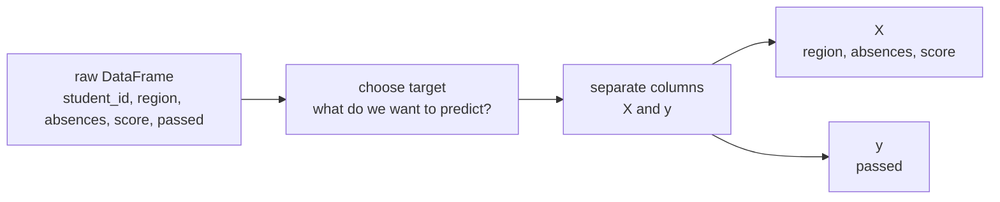
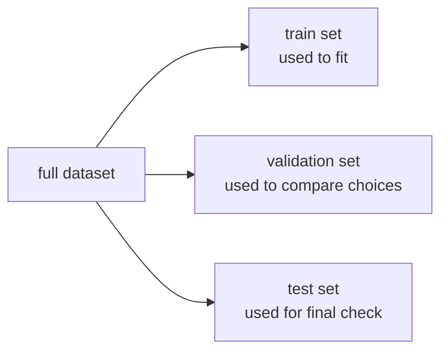

# P2-12.3 학습용 데이터셋(dataset) 준비의 직관

P2-12.1에서는 `DataFrame`을 표 형식 데이터 구조로 읽었습니다. P2-12.2에서는 그 표에서 필요한 열을 고르고, 조건으로 행을 걸러 내고, 요약값을 확인했습니다. 이제 질문은 한 단계 더 앞으로 갑니다.

> 이 표를 모델이 읽을 수 있는 학습용 데이터셋으로 바꾸려면 무엇을 준비해야 하는가?

여기서 중요한 점은 `Pandas를 잘 다루는 것`과 `학습용 데이터셋을 잘 준비하는 것`이 같지 않다는 점입니다. 전자는 표를 조작하는 기술이고, 후자는 모델이 어떤 입력을 받고 어떤 정답을 배우게 할지 결정하는 일입니다.

## 이 절의 범위

이 절은 데이터 전처리(preprocessing)의 모든 기법을 다루지 않습니다. 결측치(missing value) 처리의 세부 전략, 정규화(normalization), 스케일링(scaling), 인코딩(encoding) 비교, 파이프라인(pipeline) 구현, 교차검증(cross-validation) 세부 절차는 이후 Part에서 필요한 만큼 다시 다룹니다.

여기서는 다음 질문에 답합니다.

- 표 형식 데이터에서 무엇이 입력 `X`이고 무엇이 정답 `y`인가?
- 왜 어떤 열은 남기고 어떤 열은 빼야 하는가?
- 왜 학습(train), 검증(validation), 테스트(test)를 나누는가?
- 왜 전처리 순서를 잘못 잡으면 데이터 누수(data leakage)가 생기는가?
- Pandas는 이 준비 과정에서 어떤 역할을 하는가?

## 이 절의 목표

- 학습용 데이터셋 준비를 `원본 표를 모델 입력과 정답으로 재구성하는 일`로 설명할 수 있습니다.
- 한 행(row)은 한 샘플(sample), 한 열(column)은 하나의 특징(feature) 또는 타깃(target) 후보로 읽을 수 있습니다.
- 입력 `X`와 정답 `y`를 분리하는 이유를 설명할 수 있습니다.
- 학습, 검증, 테스트 분리를 왜 하는지 설명할 수 있습니다.
- 데이터 누수(data leakage)가 왜 평가를 왜곡하는지 설명할 수 있습니다.
- Pandas가 데이터 읽기, 선택, 필터링, 열 생성, 기초 점검에 쓰이고, 학습 분리는 별도 도구와 함께 다뤄질 수 있음을 설명할 수 있습니다.

## 표를 그대로 학습시키는 것이 아니라, 질문에 맞게 다시 구성한다

원본 표는 종종 사람이 읽기 좋게 정리되어 있지만, 모델이 바로 학습하기 좋은 모양은 아닙니다.

예를 들어 다음 표를 봅니다.

| student_id | name | region | absences | score | passed |
| --- | --- | --- | ---: | ---: | --- |
| S001 | Kim | Seoul | 1 | 82 | yes |
| S002 | Park | Busan | 5 | 45 | no |
| S003 | Lee | Seoul | 0 | 90 | yes |
| S004 | Choi | Busan | 2 | 73 | yes |

사람은 이 표를 보고 여러 질문을 할 수 있습니다.

- 점수(score)를 예측하고 싶은가?
- 합격 여부(passed)를 분류하고 싶은가?
- 지역(region)별 경향을 보고 싶은가?

같은 표라도 질문이 바뀌면 학습용 데이터셋의 구성도 바뀝니다.

| 질문 | `y` 후보 | `X` 후보 |
| --- | --- | --- |
| 합격 여부를 맞히는가 | `passed` | `region`, `absences`, `score` 등 |
| 점수를 예측하는가 | `score` | `region`, `absences`, `passed` 제외 여부 재검토 |
| 학생 식별을 하는가 | 별도 문제 정의 필요 | `student_id`, `name`은 보통 식별자 역할 |

즉, 데이터셋 준비는 “표를 정리한다”보다 더 정확히는 “질문에 맞게 입력과 정답의 경계를 다시 긋는다”에 가깝습니다.

## `X`와 `y`를 분리한다

scikit-learn 문서는 보통 `X`를 입력 특징(feature matrix), `y`를 타깃(target)으로 사용합니다. glossary에서는 특징(feature)을 샘플을 수치 또는 범주 값으로 나타내는 양으로 설명하고, 데이터 행렬에서는 특징이 열(columns)로 표현된다고 설명합니다. 또한 sample은 보통 하나의 feature vector로, target은 지도학습(supervised learning)에서의 종속 변수(dependent variable)로 설명합니다.

입문 단계에서는 이렇게 기억하면 충분합니다.

- `X`: 모델이 보고 판단에 사용할 입력 열 묶음
- `y`: 모델이 맞혀야 할 정답 열

작은 예를 보면:

```python
import pandas as pd

df = pd.DataFrame(
    {
        "student_id": ["S001", "S002", "S003", "S004"],
        "region": ["Seoul", "Busan", "Seoul", "Busan"],
        "absences": [1, 5, 0, 2],
        "score": [82, 45, 90, 73],
        "passed": ["yes", "no", "yes", "yes"],
    }
)

X = df[["region", "absences", "score"]]
y = df["passed"]
```

이 코드는 `passed`를 맞히는 분류(classification) 문제로 읽을 수 있습니다.

- 각 행은 한 학생 샘플(sample)입니다.
- `region`, `absences`, `score`는 입력 특징(feature)입니다.
- `passed`는 정답 타깃(target)입니다.

도식으로 보면 다음과 같습니다.



핵심은 `X`와 `y`가 원래부터 정해져 있지 않다는 점입니다. 문제 정의가 먼저이고, 그다음에 열을 나눕니다.

## 모든 열을 그대로 넣으면 안 된다

표에 있는 열이 모두 모델 입력으로 적합한 것은 아닙니다. 보통 다음 세 부류를 구분합니다.

1. 예측에 직접 사용할 수 있는 열
2. 변환이 필요한 열
3. 입력에서 빼야 하는 열

예를 들어:

| 열 | 바로 사용 여부 | 이유 |
| --- | --- | --- |
| `absences` | 비교적 바로 사용 가능 | 수치 열이기 때문 |
| `region` | 변환 필요 | 문자열 범주이기 때문 |
| `student_id` | 보통 제외 | 식별자이지 일반 패턴 자체는 아닐 수 있기 때문 |
| `passed` | 타깃이면 입력에서 제외 | 정답 열을 입력에 넣으면 누수 위험이 커지기 때문 |

여기서 `region` 같은 범주형(categorical) 열은 모델에 따라 숫자 형태로 바꾸는 단계가 필요할 수 있습니다. pandas의 `get_dummies()`는 범주형 변수를 더미/지시 변수(dummy/indicator variables)로 바꾸는 함수로 소개됩니다.

예를 들면:

```python
X = df[["region", "absences", "score"]]
X_encoded = pd.get_dummies(X, columns=["region"])

print(X_encoded)
```

이 단계의 핵심은 `인코딩 방법을 외우는 것`이 아닙니다. 더 중요한 질문은 다음입니다.

> 이 열은 숫자처럼 바로 읽히는가, 아니면 먼저 표현을 바꿔야 하는가?

## 식별자와 정답 열을 구분하지 않으면 쉽게 잘못 읽는다

초심자가 자주 겪는 혼동은 `눈에 보이는 모든 열이 특징(feature)인 것처럼 느껴지는 것`입니다. 하지만 식별자(identifier)와 정답(target)은 특징과 역할이 다릅니다.

예를 들어:

- `student_id`는 각 행을 구분하는 표식입니다.
- `name`은 사람에게 읽기 좋은 이름입니다.
- `passed`는 맞혀야 할 정답일 수 있습니다.

이들을 그대로 입력에 포함하면 두 가지 문제가 생길 수 있습니다.

1. 모델이 일반 패턴보다 우연한 식별 정보에 끌릴 수 있습니다.
2. 정답과 너무 가까운 정보를 입력에 넣어 평가가 부풀려질 수 있습니다.

이 감각은 앞으로 계속 중요합니다. 좋은 데이터셋은 열이 많다고 좋은 것이 아니라, `문제 정의에 맞는 열만 남아 있는 데이터셋`에 가깝습니다.

## 학습(train), 검증(validation), 테스트(test)를 나눈다

데이터셋 준비에서 다음으로 중요한 단계는 분리(split)입니다. scikit-learn의 `train_test_split` 문서는 배열이나 행렬을 무작위로 학습(train)과 테스트(test) 부분집합으로 나누는 도구로 설명합니다.

입문 단계에서는 이렇게 이해하면 충분합니다.

- train: 모델이 실제로 배우는 데이터
- validation: 설정을 점검하고 선택을 비교하는 데이터
- test: 마지막에 처음 보는 것처럼 확인하는 데이터

도식으로 보면:



왜 나누어야 할까요? 모델이 이미 본 데이터에서 잘하는 것은 충분하지 않기 때문입니다. 우리가 알고 싶은 것은 `처음 보는 데이터에서도 비슷하게 작동하는가`입니다.

이 관점은 Part 3의 과적합(overfitting), 일반화(generalization), 평가(metric)로 직접 이어집니다.

## 분리를 먼저 하고, 학습에서 배울 변환은 train에서만 배운다

scikit-learn의 common pitfalls 문서는 두 가지 실수를 강하게 경고합니다.

- inconsistent preprocessing: 학습 데이터와 테스트 데이터에 서로 다른 전처리를 적용하는 실수
- data leakage: 예측 시점에 알 수 없는 정보가 학습 과정에 섞여 들어가는 실수

특히 문서는 “test data should never be used to make choices about the model”이라고 설명하고, 일반 규칙으로 `fit` 또는 `fit_transform`을 테스트 데이터에 호출하지 말라고 안내합니다.

입문 단계에서는 다음 순서를 기억하면 좋습니다.

1. 전체 표에서 입력 후보와 정답 후보를 고른다.
2. train / validation / test로 먼저 나눈다.
3. 평균, 표준화, 인코딩, 특징 선택처럼 `배워야 하는 변환`은 train에서만 기준을 잡는다.
4. 같은 변환을 validation, test에는 적용만 한다.

이 순서를 어기면 모델이 미리 답을 훔쳐본 것과 비슷한 상황이 됩니다.

잘못된 흐름과 더 안전한 흐름을 나란히 보면:

| 흐름 | 문제 |
| --- | --- |
| 전체 데이터로 기준을 만든 뒤 나눈다 | test 정보가 미리 섞일 수 있음 |
| 먼저 나눈 뒤 train으로만 기준을 만든다 | 평가가 더 공정해짐 |

이 절에서는 구현 세부보다 이 판단 기준을 먼저 잡습니다.

## Pandas는 준비 과정의 앞부분을 담당한다

Pandas는 보통 데이터셋 준비의 앞부분에서 강합니다.

- CSV, Excel, JSON 같은 원본을 읽는다.
- 필요한 열만 고른다.
- 잘못된 값이나 이상한 형식을 점검한다.
- 범주형 열과 수치형 열을 구분한다.
- 기본적인 열 생성과 변환을 한다.

예를 들어:

```python
X = df[["region", "absences", "score"]]
y = df["passed"]

print(X.head())
print(y.head())
```

또는:

```python
print(df.isna().sum())
print(df.dtypes)
```

이런 코드는 “모델을 학습시킨다”기보다 “학습 전에 표를 점검한다”에 가깝습니다.

반면 실제 분리와 학습 파이프라인은 scikit-learn 같은 도구와 이어서 다루는 경우가 많습니다.

예를 들어:

```python
from sklearn.model_selection import train_test_split

X = df[["region", "absences", "score"]]
y = df["passed"]

X_train, X_test, y_train, y_test = train_test_split(
    X, y, test_size=0.25, random_state=42
)
```

여기서 중요한 것은 함수 사용법 전체를 외우는 것이 아니라, `표 조작`과 `학습 분리`가 서로 이어지는 다른 단계라는 점입니다.

## 학습용 데이터셋 준비를 한 문장으로 요약하면

이 절의 핵심을 한 문장으로 줄이면 다음과 같습니다.

> 학습용 데이터셋 준비는 원본 표에서 샘플(sample), 특징(feature), 타깃(target)의 역할을 다시 정하고, 평가가 왜곡되지 않도록 분리 순서를 지키는 일입니다.

이 관점이 없으면 Pandas 코드가 길어질수록 무엇을 위해 열을 고치고 나누는지 놓치기 쉽습니다. 반대로 이 관점이 잡히면, 아직 모든 전처리 기법을 몰라도 “지금 이 코드는 입력을 고르는가, 정답을 고르는가, 누수를 막는가”를 질문할 수 있습니다.

## 이 절에서 기억할 관점

- 데이터셋 준비는 표를 그대로 쓰는 일이 아니라, 문제 정의에 맞게 `X`와 `y`를 나누는 일입니다.
- 한 행은 보통 한 샘플(sample), 한 열은 특징(feature) 또는 타깃(target) 후보입니다.
- 식별자 열, 설명용 열, 정답 열은 입력 특징과 역할이 다를 수 있습니다.
- 범주형 열은 바로 쓰기보다 표현을 바꿔야 할 수 있습니다.
- train / validation / test 분리는 일반화 성능을 공정하게 보기 위한 장치입니다.
- 변환 기준을 전체 데이터로 먼저 만들면 데이터 누수(data leakage) 위험이 커집니다.

## 체크리스트

- 현재 표에서 무엇을 예측하려는지 한 문장으로 말할 수 있는가?
- 어떤 열이 `y`이고 어떤 열이 `X` 후보인지 구분할 수 있는가?
- 식별자 열과 정답 열을 입력에 그대로 넣으면 왜 위험한지 설명할 수 있는가?
- 왜 train / validation / test를 나누는지 설명할 수 있는가?
- 왜 전처리 기준은 train에서만 배워야 하는지 설명할 수 있는가?

## 출처와 참고 자료

- pandas Developers, `pandas.get_dummies`, pandas API reference, 확인 날짜: 2026-06-25. [https://pandas.pydata.org/docs/reference/api/pandas.get_dummies.html](https://pandas.pydata.org/docs/reference/api/pandas.get_dummies.html){: target="_blank" rel="noopener noreferrer" }
- scikit-learn Developers, `Glossary`, scikit-learn documentation, 확인 날짜: 2026-06-25. [https://scikit-learn.org/stable/glossary.html](https://scikit-learn.org/stable/glossary.html){: target="_blank" rel="noopener noreferrer" }
- scikit-learn Developers, `train_test_split`, scikit-learn API reference, 확인 날짜: 2026-06-25. [https://scikit-learn.org/stable/modules/generated/sklearn.model_selection.train_test_split.html](https://scikit-learn.org/stable/modules/generated/sklearn.model_selection.train_test_split.html){: target="_blank" rel="noopener noreferrer" }
- scikit-learn Developers, `Common pitfalls and recommended practices`, scikit-learn user guide, 확인 날짜: 2026-06-25. [https://scikit-learn.org/stable/common_pitfalls.html](https://scikit-learn.org/stable/common_pitfalls.html){: target="_blank" rel="noopener noreferrer" }
