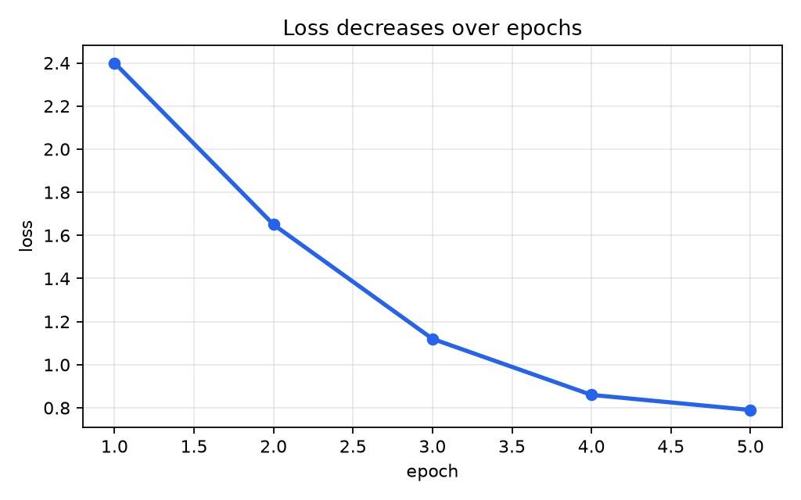
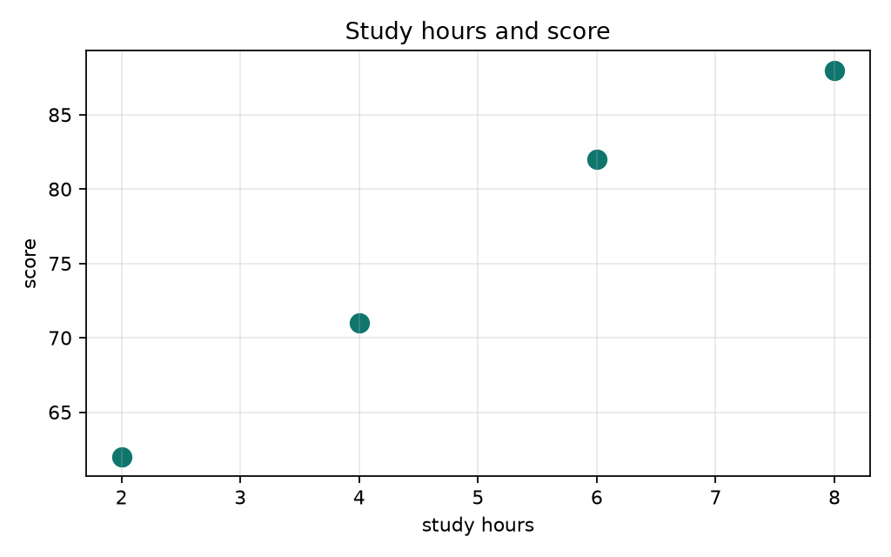
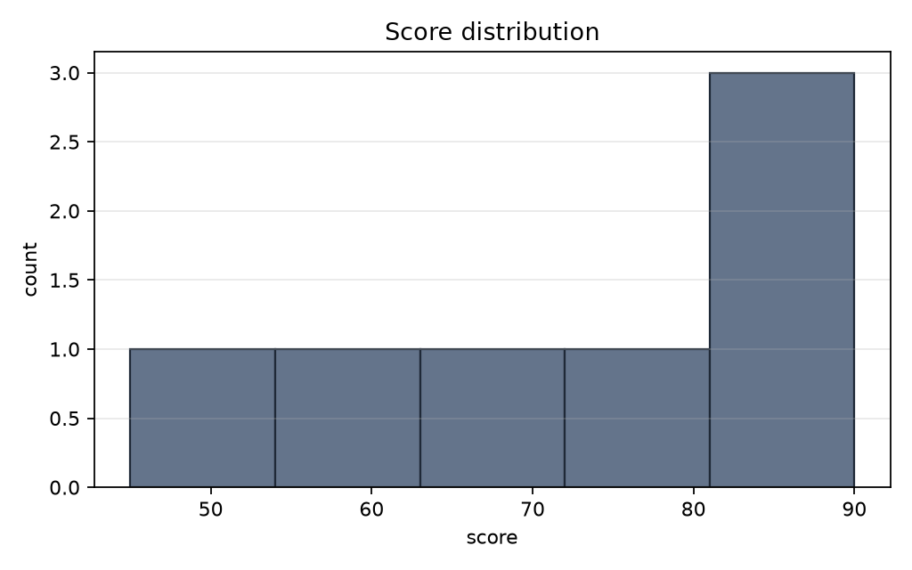

# P2-13.1 그래프(plot)는 무엇을 드러내는가

P2-11장에서는 NumPy 배열(array)로 계산을 확인했고, P2-12장에서는 Pandas `DataFrame`으로 표 형식 데이터를 읽었습니다. 이제 같은 숫자를 그림으로 확인합니다.

표는 정확한 값을 보기에 좋습니다. 하지만 숫자가 많아지면 표만 보고는 다음 질문에 답하기 어렵습니다.

- 값이 커지는가, 작아지는가?
- 어떤 값이 유난히 튀는가?
- 두 값이 함께 움직이는가?
- 데이터가 한쪽으로 몰려 있는가?
- 계산 결과가 내가 예상한 모양과 비슷한가?

그래프(plot)는 숫자를 예쁘게 꾸미는 장식이 아니라, 표에서 바로 보이지 않는 모양(shape), 변화(trend), 관계(relationship), 분포(distribution)를 확인하는 도구입니다.

## 이 절의 범위

이 절은 Matplotlib의 모든 기능을 설명하지 않습니다. 색상, 스타일, 레이아웃, 다중 축, 고급 시각화, 출판용 그래프 제작은 다루지 않습니다.

여기서는 다음 질문에 답합니다.

- 왜 숫자 표를 그래프로 바꾸는가?
- 그래프는 어떤 종류의 정보를 드러내는가?
- Matplotlib에서 `Figure`와 `Axes`는 대략 무엇인가?
- 어떤 질문에 어떤 형태의 그래프가 어울리는가?
- 그래프를 볼 때 무엇을 조심해야 하는가?

## 이 절의 목표

- 그래프를 데이터의 모양을 확인하는 도구로 설명할 수 있습니다.
- 표가 정확한 값에 강하고, 그래프가 패턴 확인에 강하다는 차이를 설명할 수 있습니다.
- 변화, 관계, 분포, 이상값(outlier)을 그래프로 확인할 수 있음을 설명할 수 있습니다.
- Matplotlib의 `Figure`와 `Axes`를 “그림 전체”와 “그림을 그리는 좌표 영역”으로 구분할 수 있습니다.
- 그래프가 보여 주는 인상이 항상 원인이나 결론을 뜻하지는 않음을 설명할 수 있습니다.

## 표는 값에 강하고, 그래프는 모양에 강하다

다음 표를 봅니다.

| epoch | loss |
| ---: | ---: |
| 1 | 2.40 |
| 2 | 1.65 |
| 3 | 1.12 |
| 4 | 0.86 |
| 5 | 0.79 |

표를 보면 각 값은 정확히 알 수 있습니다. 하지만 학습이 잘 진행되는지 빠르게 보려면 값 하나하나보다 전체 흐름이 더 중요할 때가 많습니다.

같은 데이터를 선 그래프(line plot)로 그리면 손실(loss)이 대체로 줄어드는 흐름을 더 빨리 볼 수 있습니다.

```python
import matplotlib.pyplot as plt

epochs = [1, 2, 3, 4, 5]
loss = [2.40, 1.65, 1.12, 0.86, 0.79]

fig, ax = plt.subplots()
ax.plot(epochs, loss, marker="o")
ax.set_xlabel("epoch")
ax.set_ylabel("loss")
ax.set_title("Loss decreases over epochs")
plt.show()
```

위 코드를 실행하면 다음처럼 epoch가 늘어날수록 loss가 내려가는 모양을 확인할 수 있습니다.



이 예제에서 중요한 것은 코드 문법보다 질문입니다.

> 손실값이 반복 학습을 거치며 줄어드는가?

표는 `정확한 값`을 알려 주고, 그래프는 `변화의 모양`을 보여 줍니다.

## 그래프가 드러내는 네 가지 질문

입문 단계에서는 그래프를 다음 네 가지 질문에 답하는 도구로 보면 좋습니다.

| 질문 | 그래프가 도와주는 것 | 예시 |
| --- | --- | --- |
| 변화(trend) | 시간이나 순서에 따라 값이 어떻게 움직이는지 본다 | 학습 epoch별 loss |
| 관계(relationship) | 두 값이 함께 움직이는지 본다 | 공부 시간과 점수 |
| 분포(distribution) | 값이 어디에 몰려 있는지 본다 | 점수 분포, 오차 분포 |
| 이상값(outlier) | 유난히 튀는 값이 있는지 본다 | 센서 오류, 입력 오류 |

이 네 질문은 앞으로 계속 반복됩니다.

- 머신러닝에서는 학습 과정의 loss와 평가 지표(metric)를 봅니다.
- 데이터 분석에서는 변수 사이의 관계와 분포를 봅니다.
- 딥러닝에서는 학습 곡선, 예측 오차, 임베딩 시각화 같은 것을 봅니다.

즉, 그래프는 “그림을 그릴 줄 안다”가 목표가 아니라, “숫자가 어떤 모양을 만들고 있는지 묻는다”가 목표입니다.

## 같은 숫자도 질문에 따라 다르게 보인다

예를 들어 학생 네 명의 데이터를 다시 봅니다.

| name | study_hours | score |
| --- | ---: | ---: |
| Kim | 2 | 62 |
| Park | 4 | 71 |
| Lee | 6 | 82 |
| Choi | 8 | 88 |

이 표에서 값 자체를 보려면 표가 충분합니다. 하지만 “공부 시간이 늘수록 점수도 함께 높아지는가?”를 보려면 산점도(scatter plot)가 더 자연스럽습니다.

```python
import matplotlib.pyplot as plt

study_hours = [2, 4, 6, 8]
scores = [62, 71, 82, 88]

fig, ax = plt.subplots()
ax.scatter(study_hours, scores)
ax.set_xlabel("study hours")
ax.set_ylabel("score")
ax.set_title("Study hours and score")
plt.show()
```

출력 결과는 네 개의 점으로 나타납니다. 점들이 오른쪽 위로 이어지는 모양은 두 값이 함께 커지는지 질문하게 만듭니다.



이 그래프는 원인을 증명하지 않습니다. 다만 두 값이 함께 움직이는 모양을 빠르게 확인하게 해 줍니다.

이 구분은 중요합니다.

- 그래프가 관계처럼 보이게 할 수 있습니다.
- 하지만 관계처럼 보인다고 해서 원인(cause)이 증명된 것은 아닙니다.
- 그래프는 판단의 시작점이지, 판단의 끝이 아닙니다.

## Matplotlib에서는 Figure와 Axes를 먼저 구분한다

Matplotlib 공식 문서는 데이터를 `Figure` 위에 그래프로 그린다고 설명합니다. `Figure`는 전체 그림이고, 그 안에는 하나 이상의 `Axes`가 들어갈 수 있습니다. `Axes`는 실제 데이터가 그려지는 좌표 영역입니다.

입문 단계에서는 다음처럼 이해하면 충분합니다.

| 용어 | 직관 |
| --- | --- |
| `Figure` | 그림 전체 종이 |
| `Axes` | 실제 좌표와 데이터가 그려지는 칸 |
| `plot`, `scatter`, `hist` | Axes 위에 데이터를 어떤 방식으로 그릴지 정하는 함수 |

그래서 이 책에서는 다음 형태를 기본 예제로 사용합니다.

```python
fig, ax = plt.subplots()
ax.plot([1, 2, 3], [2, 4, 3])
plt.show()
```

`plt.subplots()`는 `Figure`와 하나의 `Axes`를 함께 만듭니다. 그다음 `ax.plot(...)`처럼 `Axes`에 데이터를 그립니다.

처음에는 `plt.plot(...)`처럼 더 짧게 쓰는 예제도 많이 보입니다. 하지만 `fig, ax = plt.subplots()` 형태에 익숙해지면, 나중에 여러 그래프를 한 화면에 배치하거나 제목, 축 이름, 범례를 조정할 때 흐름을 이해하기 쉽습니다.

## 질문이 먼저이고 차트 종류는 나중이다

Matplotlib 공식 문서는 여러 plot type을 제공합니다. 선 그래프(`plot`), 산점도(`scatter`), 막대 그래프(`bar`), 히스토그램(`hist`) 같은 기본 형태가 대표적입니다.

하지만 처음부터 차트 종류를 외우는 방식은 좋지 않습니다. 먼저 질문을 정해야 합니다.

| 먼저 할 질문 | 자주 어울리는 그래프 |
| --- | --- |
| 순서에 따른 변화를 보고 싶은가 | 선 그래프(line plot) |
| 두 값의 관계를 보고 싶은가 | 산점도(scatter plot) |
| 범주별 크기를 비교하고 싶은가 | 막대 그래프(bar chart) |
| 값이 어디에 몰렸는지 보고 싶은가 | 히스토그램(histogram) |

이 표는 규칙이 아니라 출발점입니다. 실제 그래프 선택은 데이터의 모양, 독자의 질문, 전달하려는 메시지에 따라 달라질 수 있습니다.

## 그래프는 숫자를 압축해서 보여 준다

그래프는 많은 숫자를 한 화면에 압축합니다. 그래서 빠르게 패턴을 볼 수 있지만, 동시에 조심해야 합니다.

예를 들어:

- 축 범위(axis range)를 바꾸면 변화가 커 보이거나 작아 보일 수 있습니다.
- 점이 적은데 선으로 연결하면 실제보다 연속적인 변화처럼 보일 수 있습니다.
- 색상이나 면적을 과하게 쓰면 중요하지 않은 차이가 커 보일 수 있습니다.
- 평균만 그리면 분포나 이상값이 사라질 수 있습니다.

그래프를 볼 때는 항상 다음 질문을 같이 둡니다.

1. x축과 y축은 무엇인가?
2. 한 점 또는 한 선은 무엇을 의미하는가?
3. 빠진 값이나 숨겨진 범위가 있는가?
4. 그래프가 보여 주는 것은 관찰인가, 해석인가?

이 질문을 하지 않으면 그래프가 오히려 오해를 만들 수 있습니다.

## 작은 코드로 그래프를 확인하는 습관

그래프는 완성된 보고서에서만 쓰는 것이 아닙니다. 학습 중에는 “내 계산이 맞는 방향으로 가고 있는가?”를 빠르게 확인하는 도구입니다.

예를 들어 평균만 보면 데이터의 모양을 놓칠 수 있습니다.

```python
import matplotlib.pyplot as plt

scores = [45, 62, 71, 73, 82, 88, 90]

fig, ax = plt.subplots()
ax.hist(scores, bins=5)
ax.set_xlabel("score")
ax.set_ylabel("count")
ax.set_title("Score distribution")
plt.show()
```

출력 결과는 점수 값이 어느 구간에 몰려 있는지 보여 줍니다.



이 코드는 점수의 평균을 계산하지 않습니다. 대신 점수들이 어디에 몰려 있는지 확인합니다.

P2-13.2에서는 이런 기본 그래프를 조금 더 구체적으로 다룹니다. 이 절에서는 먼저 그래프를 `숫자의 모양을 확인하는 도구`로 받아들이면 충분합니다.

## 이 절에서 기억할 관점

- 그래프는 숫자 표에서 바로 보이지 않는 모양, 변화, 관계, 분포를 드러냅니다.
- 표는 정확한 값에 강하고, 그래프는 패턴 확인에 강합니다.
- Matplotlib에서 `Figure`는 그림 전체, `Axes`는 데이터가 그려지는 좌표 영역입니다.
- 차트 종류를 먼저 외우기보다, 데이터에 묻고 싶은 질문을 먼저 정합니다.
- 그래프는 판단의 시작점이며, 원인이나 결론을 자동으로 증명하지 않습니다.

## 체크리스트

- 표와 그래프가 각각 어떤 질문에 강한지 설명할 수 있는가?
- 변화, 관계, 분포, 이상값을 그래프로 확인할 수 있음을 설명할 수 있는가?
- `Figure`와 `Axes`의 차이를 직관적으로 말할 수 있는가?
- 선 그래프, 산점도, 막대 그래프, 히스토그램이 각각 어떤 질문에 자주 쓰이는지 말할 수 있는가?
- 그래프를 볼 때 축, 점의 의미, 숨겨진 범위, 해석 과잉을 점검할 수 있는가?

## 출처와 참고 자료

- Matplotlib Developers, `Quick start guide`, Matplotlib documentation, 확인 날짜: 2026-06-25. [https://matplotlib.org/stable/users/explain/quick_start.html](https://matplotlib.org/stable/users/explain/quick_start.html){: target="_blank" rel="noopener noreferrer" }
- Matplotlib Developers, `Plot types`, Matplotlib documentation, 확인 날짜: 2026-06-25. [https://matplotlib.org/stable/plot_types/index.html](https://matplotlib.org/stable/plot_types/index.html){: target="_blank" rel="noopener noreferrer" }
- Matplotlib Developers, `matplotlib.pyplot`, Matplotlib API reference, 확인 날짜: 2026-06-25. [https://matplotlib.org/stable/api/_as_gen/matplotlib.pyplot.html](https://matplotlib.org/stable/api/_as_gen/matplotlib.pyplot.html){: target="_blank" rel="noopener noreferrer" }
