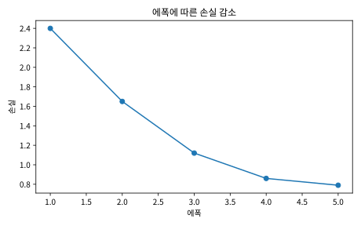
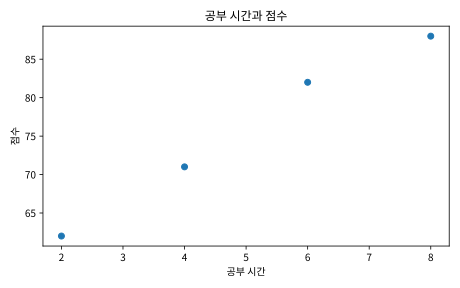
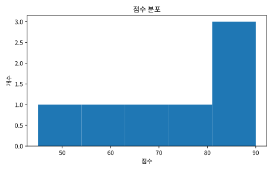

# P2-13.1 그래프(plot)는 무엇을 드러내는가

> Section ID: `P2-13.1`
> Version: `v2026.07.26`

Part 2 Chapter 11에서는 NumPy 배열(array)로 계산을 확인했고, Part 2 Chapter 12에서는 Pandas `DataFrame`으로 표 형식 데이터를 읽었습니다. 이제 같은 숫자를 그림으로 확인합니다.

표는 정확한 값을 보기에 좋습니다. 하지만 숫자가 많아지면 표만 보고는 다음 질문에 답하기 어렵습니다.

- 값이 커지는가, 작아지는가?
- 어떤 값이 유난히 튀는가?
- 두 값이 함께 움직이는가?
- 데이터가 한쪽으로 몰려 있는가?
- 계산 결과가 내가 예상한 모양과 비슷한가?

그래프(plot)는 숫자를 예쁘게 꾸미는 장식이 아니라, 표에서 바로 보이지 않는 모양(shape), 변화(trend), 관계(relationship), 분포(distribution)를 확인하는 도구입니다. 지금 이 도구를 먼저 잡아 두어야 Part 3에서 학습 곡선, 오류 분포, 변수 관계를 `숫자 목록`이 아니라 `해석 가능한 모양`으로 읽을 수 있습니다.

여기서는 `그래프(plot)`, `Figure`, `Axes`, `분포(distribution)`, `이상값(outlier)`의 기본 구분을 설명합니다. 앞 장의 Pandas가 그 숫자 묶음이 어떤 사례와 변수의 표로 읽혀야 하는가를 다뤘다면, 여기서는 그 표에서 바로 안 보이는 변화와 관계를 어떤 모양으로 확인할지 읽습니다. 그래프는 결과를 꾸미는 단계가 아니라, loss의 변화, 분포의 쏠림, 변수 사이 관계처럼 표에서 놓치기 쉬운 패턴을 먼저 확인하는 단계입니다. 다음 Chapter 14에서는 이 그래프를 보고 무엇을 바꾸었는지, 무엇이 예상과 달랐는지 기록으로 남깁니다. 이후 차트 선택과 저장으로 이어질 때는 P2-13.1의 그래프 설명도 함께 확인합니다.

## 핵심 기준: 그래프(plot)는 무엇을 드러내는가

- 그래프를 데이터의 모양을 확인하는 도구로 설명할 수 있습니다.
- 표가 정확한 값에 강하고, 그래프가 패턴 확인에 강하다는 차이를 설명할 수 있습니다.
- 변화, 관계, 분포, 이상값(outlier)을 그래프로 확인할 수 있음을 설명할 수 있습니다.
- Matplotlib의 `Figure`와 `Axes`를 “그림 전체”와 “그림을 그리는 좌표 영역”으로 구분할 수 있습니다.
- 그래프가 보여 주는 인상이 항상 원인이나 결론을 뜻하지는 않음을 설명할 수 있습니다.

## 세 가지 기준

| 기준 | 왜 중요한가 | 이 절에서 필요한 이해 수준 |
| --- | --- | --- |
| 왜 표만으로 충분하지 않은가 | 표와 그래프의 역할 차이를 분명하게 해 줍니다. | 숫자 목록만으로는 보이지 않는 모양과 경향이 있음을 이해합니다. |
| 그래프는 무엇을 잘 보여 주는가 | 이후 차트 선택을 값 나열이 아니라 질문 중심으로 읽게 해 줍니다. | 변화, 비교, 분포 같은 질문을 더 빨리 읽게 해 주는 도구로 이해합니다. |
| 무엇을 먼저 정해야 하나 | 차트 이름 암기보다 해석 질문을 먼저 세우게 해 줍니다. | 차트 종류보다 먼저 어떤 질문을 할지 정해야 함을 이해합니다. |

| 용어 | 이 절에서 먼저 잡을 뜻 |
| --- | --- |
| 그래프(plot) | 숫자 데이터의 모양, 변화, 관계를 시각적으로 확인하는 그림입니다. |
| Figure | 그래프 전체가 놓이는 큰 그림 영역입니다. |
| Axes | 실제 데이터가 그려지는 좌표 영역 한 칸입니다. |
| 분포(distribution) | 값이 어디에 몰리고 얼마나 퍼지는지 보여 주는 모양입니다. |
| 이상값(outlier) | 다른 값들에 비해 유난히 튀어 보이는 값입니다. |

## 표는 값에 강하고, 그래프는 모양에 강하다

다음 표를 봅니다.

| epoch | loss |
| ---: | ---: |
| 1 | 2.40 |
| 2 | 1.65 |
| 3 | 1.12 |
| 4 | 0.86 |
| 5 | 0.79 |

표를 보면 각 값은 정확히 알 수 있습니다. 하지만 학습이 잘 진행되는지 빠르게 보려면 값 하나하나보다 전체 흐름이 더 중요할 때가 많습니다.

같은 데이터를 선 그래프(line plot)로 그리면 손실(loss)이 대체로 줄어드는 흐름을 더 빨리 볼 수 있습니다.

문제 상황: 표의 숫자는 정확히 보이지만, 반복에 따라 값이 어떻게 변하는지는 한눈에 잡기 어렵습니다.
입력(input): epoch 번호 5개와 각 epoch의 loss 값 5개.
기대 출력(output): epoch가 늘수록 loss가 어떻게 변하는지 보여 주는 선 그래프.
확인할 개념: 표는 값 자체를, 그래프는 변화의 모양을 더 빨리 드러내며 학습 손실처럼 순서가 있는 값은 선 그래프로 읽는 것이 자연스럽습니다.

```python
# Matplotlib으로 loss, 분포, 관계를 그려 숫자 표에서 보이지 않는 패턴을 확인하는 예제입니다.
import matplotlib.pyplot as plt

epochs = [1, 2, 3, 4, 5]
loss = [2.40, 1.65, 1.12, 0.86, 0.79]

fig, ax = plt.subplots()
ax.plot(epochs, loss, marker="o")
ax.set_xlabel("epoch")
ax.set_ylabel("loss")
ax.set_title("Loss decreases over epochs")
plt.show()
```

위 코드를 실행하면 다음처럼 epoch가 늘어날수록 loss가 내려가는 모양을 확인할 수 있습니다.



이 책의 자산 폴더에는 같은 예제를 파일로 다시 만들 수 있는 저장형 스크립트도 함께 둡니다. 화면에서 바로 확인할 때는 위처럼 `plt.show()`를 쓰고, 문서에 넣을 PNG를 다시 만들 때는 [`p2_13_1_plot_questions.py`](../../../assets/part-02/chapter-13/p2_13_1_plot_questions.py)를 실행합니다.

이 예제에서 중요한 것은 코드 문법보다 `손실값이 반복 학습을 거치며 줄어드는가?`라는 질문입니다.

표는 `정확한 값`을 알려 주고, 그래프는 `변화의 모양`을 보여 줍니다.

여기서 한 걸음만 더 가 보면, 숫자 요약이 같아 보여도 그래프 모양은 다를 수 있습니다. 예를 들어 두 동작 1회 요약값의 평균이 모두 `1.5`여도, 한쪽은 초반부터 끝까지 거의 평평하고 다른 한쪽은 중간에 크게 올랐다가 다시 내려올 수 있습니다. 표의 평균만 보면 둘이 비슷해 보이지만, 선 그래프는 그 `비슷해 보임`이 실제로도 같은 패턴인지 다시 확인하게 만듭니다.

| 동작 기록 | 평균 | 그래프로 더 잘 보이는 점 |
| --- | ---: | --- |
| A | 1.5 | 거의 평평하게 유지되는가 |
| B | 1.5 | 중간에 크게 오르내리는가 |

즉, 그래프는 숫자를 예쁘게 다시 쓰는 도구가 아니라, 동작 1회 요약 행의 대표값 하나로는 놓치기 쉬운 움직임의 모양을 다시 확인하게 만드는 도구입니다.

같은 장면을 조금 더 표답게 적어 보면 다음과 같습니다.

| action_id | sensor_a_mean | sensor_a_std | early_segment_mean | late_segment_mean |
| --- | ---: | ---: | ---: | ---: |
| B-201 | 27.0 | 0.4 | 26.8 | 27.2 |
| B-202 | 27.0 | 1.6 | 25.5 | 28.5 |

이 표는 평균은 같지만 변동성과 구간 패턴은 다를 수 있음을 보여 줍니다. 따라서 표에서 이미 `같은 평균, 다른 구조일 수 있다`고 의심했다면, 그래프는 그 의심을 실제 모양으로 확인하는 다음 단계가 됩니다.

이때 중요한 점은 그래프가 `패턴 차이가 있는가`를 더 잘 보여 줄 수는 있어도, 그 차이의 원인을 자동으로 설명해 주지는 않는다는 것입니다.

문제 상황: 평균은 같지만 패턴이 다른 두 동작을 선 그래프로 직접 비교해 보고 싶습니다.
입력(input): 두 동작의 구간별 값 목록.
기대 출력(output): 평균은 같지만 모양은 다른 두 선 그래프.
확인할 개념: 평균 같은 요약값 하나로는 놓치는 차이를 선 그래프가 다시 드러낼 수 있습니다.

```python
# Matplotlib으로 loss, 분포, 관계를 그려 숫자 표에서 보이지 않는 패턴을 확인하는 예제입니다.
import matplotlib.pyplot as plt

steps = [1, 2, 3, 4]
action_a = [1.0, 2.0, 2.0, 1.0]
action_b = [1.5, 1.5, 1.5, 1.5]

fig, ax = plt.subplots()
ax.plot(steps, action_a, marker="o", label="action A")
ax.plot(steps, action_b, marker="o", label="action B")
ax.set_xlabel("segment")
ax.set_ylabel("signal level")
ax.set_title("Same mean, different pattern")
ax.legend()
plt.show()
```

이 그래프에서 독자가 먼저 봐야 할 것은 다음 셋입니다.

- 두 선의 평균이 비슷해 보여도 중간 구조는 다를 수 있다.
- 표는 `같아 보인다`는 의심을 만들고, 그래프는 그 의심이 실제 패턴 차이인지 확인하게 해 준다.
- 그래프는 표의 평균값 하나로는 놓치기 쉬운 패턴 차이를 보여 준다.
- 같은 평균이라도 패턴은 다를 수 있지만, 그래프가 그 원인까지 자동으로 말해 주지는 않는다.

## 그래프가 드러내는 네 가지 질문

여기서는 그래프를 다음 네 가지 질문에 답하는 도구로 봅니다.

| 질문 | 그래프가 도와주는 것 | 예시 |
| --- | --- | --- |
| 변화(trend) | 시간이나 순서에 따라 값이 어떻게 움직이는지 본다 | 학습 epoch별 loss |
| 관계(relationship) | 두 값이 함께 움직이는지 본다 | 공부 시간과 점수 |
| 분포(distribution) | 값이 어디에 몰려 있는지 본다 | 점수 분포, 오차 분포 |
| 이상값(outlier) | 유난히 튀는 값이 있는지 본다 | 센서 오류, 입력 오류 |

이 네 질문은 앞으로 계속 반복됩니다.

- 머신러닝에서는 학습 과정의 loss와 평가 지표(metric)를 봅니다.
- 데이터 분석에서는 변수 사이의 관계와 분포를 봅니다.
- 딥러닝에서는 학습 곡선, 예측 오차, 임베딩 시각화 같은 것을 봅니다.

즉, 그래프는 “그림을 그릴 줄 안다”가 목표가 아니라, “숫자가 어떤 모양을 만들고 있는지 묻는다”가 목표입니다.

## 같은 숫자도 질문에 따라 다르게 보인다

예를 들어 학생 네 명의 데이터를 다시 봅니다.

| name | study_hours | score |
| --- | ---: | ---: |
| Kim | 2 | 62 |
| Park | 4 | 71 |
| Lee | 6 | 82 |
| Choi | 8 | 88 |

이 표에서 값 자체를 보려면 표로 읽을 수 있습니다. 하지만 “공부 시간이 늘수록 점수도 함께 높아지는가?”를 보려면 산점도(scatter plot)가 더 자연스럽습니다.

문제 상황: 두 값이 함께 움직이는지 보려면 표보다 점 배치가 더 읽기 쉬울 수 있습니다.
입력(input): 공부 시간 목록 `study_hours`와 점수 목록 `scores`.
기대 출력(output): 각 학생을 하나의 점으로 표현한 산점도.
확인할 개념: 산점도는 두 변수의 관계 후보와 흩어짐을 한 번에 보여 줍니다.

```python
# Matplotlib으로 loss, 분포, 관계를 그려 숫자 표에서 보이지 않는 패턴을 확인하는 예제입니다.
import matplotlib.pyplot as plt

study_hours = [2, 4, 6, 8]
scores = [62, 71, 82, 88]

fig, ax = plt.subplots()
ax.scatter(study_hours, scores)
ax.set_xlabel("study hours")
ax.set_ylabel("score")
ax.set_title("Study hours and score")
plt.show()
```

출력 결과는 네 개의 점으로 나타납니다. 점들이 오른쪽 위로 이어지는 모양은 두 값이 함께 커지는지 질문하게 만듭니다.



이 그래프는 원인을 증명하지 않습니다. 다만 두 값이 함께 움직이는 모양을 빠르게 확인하게 해 줍니다.

이 구분은 중요합니다.

- 그래프가 관계처럼 보이게 할 수 있습니다.
- 하지만 관계처럼 보인다고 해서 원인(cause)이 증명된 것은 아닙니다.
- 그래프는 판단의 시작점이지, 판단의 끝이 아닙니다.

## Matplotlib에서는 Figure와 Axes를 먼저 구분한다

Matplotlib 공식 문서는 데이터를 `Figure` 위에 그래프로 그린다고 설명합니다. `Figure`는 전체 그림이고, 그 안에는 하나 이상의 `Axes`가 들어갈 수 있습니다. `Axes`는 실제 데이터가 그려지는 좌표 영역입니다.

여기서는 다음처럼 이해합니다.

| 용어 | 직관 |
| --- | --- |
| `Figure` | 그림 전체 종이 |
| `Axes` | 실제 좌표와 데이터가 그려지는 칸 |
| `plot`, `scatter`, `hist` | Axes 위에 데이터를 어떤 방식으로 그릴지 정하는 함수 |

그래서 여기서는 다음 형태를 기본 예제로 사용합니다.

문제 상황: Matplotlib에서 `Figure`와 `Axes`를 어떻게 함께 만드는지 가장 작은 코드로 먼저 보고 싶습니다.
입력(input): 짧은 x 값, y 값 목록과 `plt.subplots()` 호출.
기대 출력(output): 하나의 `Figure`와 하나의 `Axes` 위에 그려진 간단한 선 그래프.
확인할 개념: `plt.subplots()`는 전체 그림과 실제 그릴 좌표 영역을 함께 만들어 줍니다.

```python
# Matplotlib으로 loss, 분포, 관계를 그려 숫자 표에서 보이지 않는 패턴을 확인하는 예제입니다.
fig, ax = plt.subplots()
ax.plot([1, 2, 3], [2, 4, 3])
plt.show()
```

`plt.subplots()`는 `Figure`와 하나의 `Axes`를 함께 만듭니다. 그다음 `ax.plot(...)`처럼 `Axes`에 데이터를 그립니다.

`plt.plot(...)`처럼 더 짧게 쓰는 예제도 많이 보입니다. 하지만 `fig, ax = plt.subplots()` 형태에 익숙해지면, 나중에 여러 그래프를 한 화면에 배치하거나 제목, 축 이름, 범례를 조정할 때 흐름을 이해하기 쉽습니다.

## 질문이 먼저이고 차트 종류는 나중이다

Matplotlib 공식 문서는 여러 plot type을 제공합니다. 선 그래프(`plot`), 산점도(`scatter`), 막대 그래프(`bar`), 히스토그램(`hist`) 같은 기본 형태가 대표적입니다.

하지만 처음부터 차트 종류를 외우는 방식은 좋지 않습니다. 먼저 질문을 정해야 합니다.

| 먼저 할 질문 | 자주 어울리는 그래프 |
| --- | --- |
| 순서에 따른 변화를 보고 싶은가 | 선 그래프(line plot) |
| 두 값의 관계를 보고 싶은가 | 산점도(scatter plot) |
| 범주별 크기를 비교하고 싶은가 | 막대 그래프(bar chart) |
| 값이 어디에 몰렸는지 보고 싶은가 | 히스토그램(histogram) |

이 표는 규칙이 아니라 출발점입니다. 실제 그래프 선택은 데이터의 모양, 독자의 질문, 전달하려는 메시지에 따라 달라질 수 있습니다.

## 그래프는 숫자를 압축해서 보여 준다

그래프는 많은 숫자를 한 화면에 압축합니다. 그래서 빠르게 패턴을 볼 수 있지만, 동시에 조심해야 합니다.

예를 들어:

- 축 범위(axis range)를 바꾸면 변화가 커 보이거나 작아 보일 수 있습니다.
- 점이 적은데 선으로 연결하면 실제보다 연속적인 변화처럼 보일 수 있습니다.
- 색상이나 면적을 과하게 쓰면 중요하지 않은 차이가 커 보일 수 있습니다.
- 평균만 그리면 분포나 이상값이 사라질 수 있습니다.

그래프를 볼 때는 항상 다음 질문을 같이 둡니다.

1. x축과 y축은 무엇인가?
2. 한 점 또는 한 선은 무엇을 의미하는가?
3. 빠진 값이나 숨겨진 범위가 있는가?
4. 그래프가 보여 주는 것은 관찰인가, 해석인가?

이 질문을 하지 않으면 그래프가 오히려 오해를 만들 수 있습니다.

## 작은 코드로 그래프를 확인하는 습관

그래프는 완성된 보고서에서만 쓰는 것이 아닙니다. 학습 중에는 “내 계산이 맞는 방향으로 가고 있는가?”를 빠르게 확인하는 도구입니다.

예를 들어 평균만 보면 데이터의 모양을 놓칠 수 있습니다.

문제 상황: 평균값 하나로는 점수 분포의 몰림과 퍼짐을 알기 어려워 직접 분포를 보고 싶습니다.
입력(input): 여러 학생의 점수 목록 `scores`.
기대 출력(output): 점수 구간별 개수를 보여 주는 히스토그램.
확인할 개념: 분포를 보려면 평균 대신 값이 어느 구간에 몰렸는지를 시각화해야 합니다.

```python
# Matplotlib으로 loss, 분포, 관계를 그려 숫자 표에서 보이지 않는 패턴을 확인하는 예제입니다.
import matplotlib.pyplot as plt

scores = [45, 62, 71, 73, 82, 88, 90]

fig, ax = plt.subplots()
ax.hist(scores, bins=5)
ax.set_xlabel("score")
ax.set_ylabel("count")
ax.set_title("Score distribution")
plt.show()
```

출력 결과는 점수 값이 어느 구간에 몰려 있는지 보여 줍니다.



이 코드는 점수의 평균을 계산하지 않습니다. 대신 점수들이 어디에 몰려 있는지 확인합니다.

P2-13.2에서는 이런 기본 그래프를 조금 더 구체적으로 다룹니다. 이 절에서는 먼저 그래프를 `숫자의 모양을 확인하는 도구`로 받아들입니다.

이 절의 역할을 한 줄로 줄이면 아래와 같습니다.

| 바로 앞에서 가져온 것 | 지금 여기서 하는 일 | 바로 다음 장에서 이어질 일 |
| --- | --- | --- |
| NumPy 배열과 Pandas 표로 확인한 숫자 | 숫자의 모양과 변화, 관계를 그래프로 빠르게 읽는다 | 어떤 그래프를 보고 무엇을 바꿨는지 Git 기록과 재현성 기준으로 남긴다 |

## 사례 및 예시

### 사례 1. 손실 표는 있는데 학습이 잘되는지 감이 오지 않을 때

한 학습자가 epoch별 손실값을 표로 정리했다고 하겠습니다. 숫자는 모두 보이지만, 손실이 부드럽게 줄어드는지, 중간에 갑자기 튀는 구간이 있는지, 전체 흐름이 기대와 비슷한지는 표만 보고 빠르게 판단하기 어렵습니다.

사람이 먼저 쓰는 기준은 종종 `값이 적혀 있으니 충분하다`입니다. 하지만 값이 많아질수록 중요한 것은 개별 숫자보다 모양과 흐름입니다. 그래프는 바로 그 `숫자의 모양`을 보게 해 주는 도구입니다.

이 절이 그래프를 장식이 아니라 변화, 관계, 분포, 이상값을 묻는 도구로 설명하는 이유가 여기에 있습니다. 표는 정확한 값에 강하고, 그래프는 패턴 확인에 강합니다. 따라서 둘은 경쟁하는 것이 아니라 서로 다른 질문에 답합니다.

확인 가능한 결과는 같은 데이터를 선 그래프로 그렸을 때 더 분명해집니다. 손실이 대체로 내려가는지, 특정 epoch에서 흔들리는지, 값이 어디쯤 몰려 있는지가 표보다 빠르게 보인다면 그래프를 그릴 이유가 분명해집니다.

## 체크리스트

- 그래프는 숫자 표에서 바로 보이지 않는 모양, 변화, 관계, 분포를 드러내는 도구라고 설명할 수 있는가?
- 표는 정확한 값에 강하고, 그래프는 패턴 확인에 강하다는 차이를 말할 수 있는가?
- `Figure`는 그림 전체, `Axes`는 데이터가 그려지는 좌표 영역이라고 구분할 수 있는가?
- 차트 종류를 먼저 외우기보다 데이터에 어떤 질문을 던지는지 먼저 정해야 한다는 점을 설명할 수 있는가?
- 선 그래프, 산점도, 막대 그래프, 히스토그램이 각각 어떤 질문에 자주 쓰이는지 말할 수 있는가?
- 그래프를 볼 때 축, 점의 의미, 숨겨진 범위, 해석 과잉 여부를 함께 점검할 수 있는가?
- 표만으로는 변화, 관계, 분포, 이상값이 잘 보이지 않아 시각적으로 다시 확인해야 할 때 그래프 관점을 먼저 떠올릴 수 있는가?
- 그래프가 판단의 시작점이지 원인이나 결론을 자동으로 증명하지는 않는다는 점을 기억하고 있는가?

## 출처와 참고 자료

- Matplotlib Developers, `Quick start guide`, Matplotlib documentation, 확인 날짜: 2026-07-20. [https://matplotlib.org/stable/users/explain/quick_start.html](https://matplotlib.org/stable/users/explain/quick_start.html){: target="_blank" rel="noopener noreferrer" } `Figure`, `Axes`, `plt.subplots()`를 구분해 설명하는 기준으로 확인했습니다.
- Matplotlib Developers, `Plot types`, Matplotlib documentation, 확인 날짜: 2026-07-20. [https://matplotlib.org/stable/plot_types/index.html](https://matplotlib.org/stable/plot_types/index.html){: target="_blank" rel="noopener noreferrer" } 선 그래프, 산점도, 막대 그래프, 히스토그램을 질문별 기본 차트로 분류하는 부분의 참고 자료입니다.
- Matplotlib Developers, `matplotlib.pyplot`, Matplotlib API reference, 확인 날짜: 2026-07-20. [https://matplotlib.org/stable/api/_as_gen/matplotlib.pyplot.html](https://matplotlib.org/stable/api/_as_gen/matplotlib.pyplot.html){: target="_blank" rel="noopener noreferrer" } `pyplot` 기반 예제가 Matplotlib 입문 코드에서 어떻게 쓰이는지 확인하는 참고 자료입니다.
