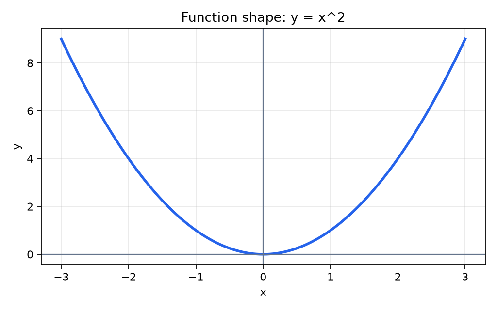
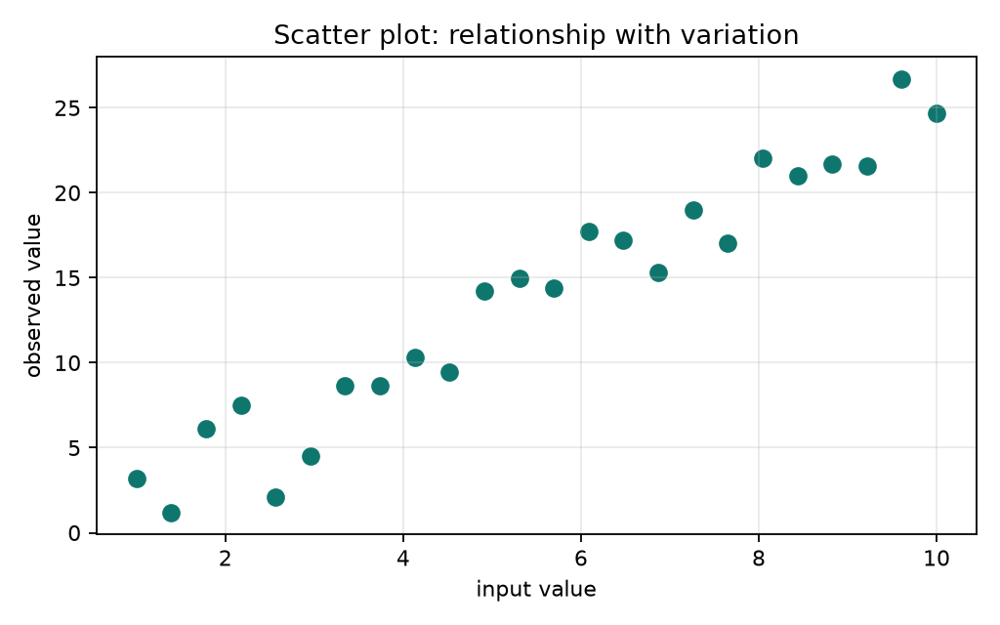
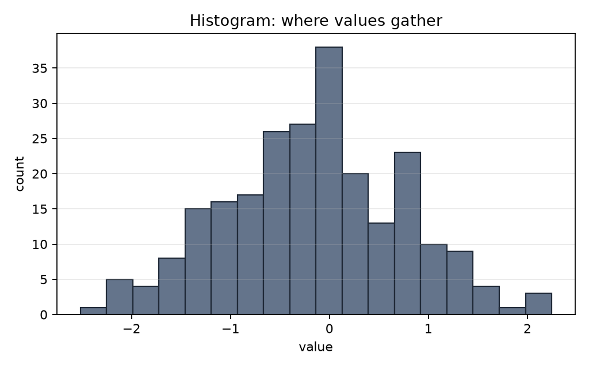
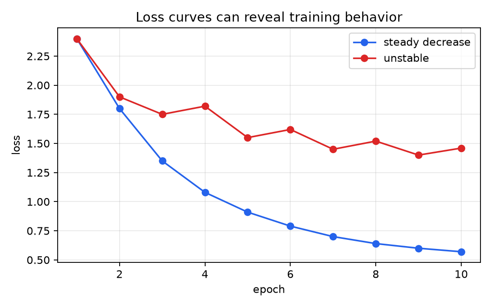

# P2-13.2 기본 차트와 수식의 모양 확인

P2-13.1에서는 그래프(plot)를 숫자의 모양을 확인하는 도구로 봤습니다. 이제 기본 차트를 몇 가지 직접 연결해 봅니다.

이 절의 핵심은 “Matplotlib 함수 이름을 외우는 것”이 아닙니다. 먼저 질문을 정하고, 그 질문에 맞는 차트를 고르는 감각을 만드는 것입니다.

## 이 절의 범위

이 절은 Matplotlib의 기본 차트를 입문 수준에서만 다룹니다. 스타일 꾸미기, 색상 체계, 여러 축을 가진 복잡한 Figure, 인터랙티브 시각화는 다루지 않습니다.

여기서는 다음 질문에 답합니다.

- 선 그래프(line plot)는 언제 쓰는가?
- 산점도(scatter plot)는 무엇을 보여 주는가?
- 히스토그램(histogram)은 평균만으로 보이지 않는 무엇을 보여 주는가?
- 수식이나 손실(loss)의 변화를 그래프로 확인한다는 것은 무슨 뜻인가?
- 그래프를 만들 때 축(axis), 제목(title), 라벨(label)을 왜 붙여야 하는가?

## 이 절의 목표

- 선 그래프, 산점도, 히스토그램의 기본 목적을 구분할 수 있습니다.
- 수식의 모양을 코드로 계산하고 그래프로 확인할 수 있습니다.
- 손실 곡선(loss curve)을 보고 학습 흐름을 질문할 수 있습니다.
- 그래프에 축 라벨과 제목을 붙여야 하는 이유를 설명할 수 있습니다.
- 그래프를 결론이 아니라 점검 도구로 사용하는 관점을 가질 수 있습니다.

## 선 그래프는 순서에 따른 변화를 본다

선 그래프(line plot)는 x축의 순서가 의미 있을 때 자주 씁니다. 시간, 반복 횟수, 학습 epoch, 입력값의 연속적 변화처럼 “왼쪽에서 오른쪽으로 읽는 흐름”이 있을 때 적합합니다.

수식의 모양을 확인할 때도 선 그래프가 기본입니다. 예를 들어 \(y = x^2\)는 숫자 표로도 만들 수 있지만, 그래프로 보면 U자 형태가 바로 보입니다.

```python
import matplotlib.pyplot as plt
import numpy as np

x = np.linspace(-3, 3, 121)
y = x**2

fig, ax = plt.subplots()
ax.plot(x, y)
ax.set_xlabel("x")
ax.set_ylabel("y")
ax.set_title("Function shape: y = x^2")
plt.show()
```

출력 결과는 다음처럼 보입니다.



이 그래프가 보여 주는 것은 정답 풀이가 아니라 모양입니다.

- \(x=0\) 근처에서 가장 낮습니다.
- \(x\)가 양쪽으로 멀어질수록 \(y\)가 커집니다.
- 기울기(slope)는 위치마다 달라집니다.

이런 확인은 P2-4장에서 다룬 미분(derivative), 그래디언트(gradient), 손실 함수(loss function)의 직관과 이어집니다.

## 산점도는 두 값의 관계를 본다

산점도(scatter plot)는 각 샘플(sample)을 하나의 점으로 찍습니다. x축과 y축에 서로 다른 값을 놓고, 두 값이 함께 움직이는지 확인할 때 유용합니다.

예를 들어 어떤 입력값이 커질수록 관측값도 대체로 커지는지 보고 싶다면 산점도를 사용할 수 있습니다.

```python
import matplotlib.pyplot as plt
import numpy as np

rng = np.random.default_rng(42)
x = np.linspace(1, 10, 24)
y = 2.5 * x + rng.normal(0, 2.2, size=x.shape)

fig, ax = plt.subplots()
ax.scatter(x, y)
ax.set_xlabel("input value")
ax.set_ylabel("observed value")
ax.set_title("Scatter plot: relationship with variation")
plt.show()
```

출력 결과는 다음처럼 보입니다.



이 그래프에서는 점들이 완벽한 직선 위에 있지 않습니다. 하지만 오른쪽으로 갈수록 대체로 위로 올라가는 흐름이 있습니다.

입문 단계에서는 이렇게 읽으면 됩니다.

- 점 하나는 하나의 샘플입니다.
- 점들의 방향은 관계의 후보를 보여 줍니다.
- 점들의 흩어짐은 변동(variation)이나 잡음(noise)을 보여 줍니다.
- 산점도만으로 원인(cause)을 단정하지 않습니다.

## 히스토그램은 값이 어디에 몰렸는지 본다

히스토그램(histogram)은 값들을 구간(bin)으로 나누고, 각 구간에 몇 개가 들어가는지 보여 줍니다. 평균(mean) 하나만 보면 데이터가 어디에 몰려 있는지 놓칠 수 있습니다.

```python
import matplotlib.pyplot as plt
import numpy as np

rng = np.random.default_rng(7)
values = rng.normal(loc=0, scale=1, size=240)

fig, ax = plt.subplots()
ax.hist(values, bins=18)
ax.set_xlabel("value")
ax.set_ylabel("count")
ax.set_title("Histogram: where values gather")
plt.show()
```

출력 결과는 다음처럼 보입니다.



히스토그램을 볼 때는 다음 질문을 합니다.

- 값이 어느 구간에 가장 많이 몰려 있는가?
- 한쪽으로 치우쳐 있는가?
- 양쪽 끝에 드문 값이 있는가?
- 평균만 보고 놓칠 만한 모양이 있는가?

이 질문은 P2-5장에서 다룬 분포(distribution), 평균(mean), 분산(variance)과 직접 연결됩니다.

## 손실 곡선은 학습 흐름을 점검한다

AI 학습에서는 손실(loss)이 반복 과정에서 어떻게 변하는지 자주 확인합니다. 이때 선 그래프는 단순히 수식을 예쁘게 그리는 것이 아니라, 학습이 기대한 방향으로 진행되는지 점검하는 도구가 됩니다.

```python
import matplotlib.pyplot as plt
import numpy as np

epochs = np.arange(1, 11)
decreasing_loss = [2.4, 1.8, 1.35, 1.08, 0.91, 0.79, 0.70, 0.64, 0.60, 0.57]
unstable_loss = [2.4, 1.9, 1.75, 1.82, 1.55, 1.62, 1.45, 1.52, 1.40, 1.46]

fig, ax = plt.subplots()
ax.plot(epochs, decreasing_loss, marker="o", label="steady decrease")
ax.plot(epochs, unstable_loss, marker="o", label="unstable")
ax.set_xlabel("epoch")
ax.set_ylabel("loss")
ax.set_title("Loss curves can reveal training behavior")
ax.legend()
plt.show()
```

출력 결과는 다음처럼 두 흐름을 비교하게 해 줍니다.



이 그래프를 보고 바로 “좋은 모델”이라고 결론 내리면 안 됩니다. 다만 다음 질문을 할 수 있습니다.

- 손실이 대체로 줄어드는가?
- 중간에 크게 흔들리는가?
- 어느 지점부터 줄어드는 속도가 느려지는가?
- train loss와 validation loss를 나누어 봐야 하는가?

마지막 질문은 Part 3의 과적합(overfitting), 검증(validation), 일반화(generalization)로 이어집니다.

## 축, 제목, 라벨은 해석의 일부다

그래프에서 축(axis), 제목(title), 라벨(label)은 부가 장식이 아닙니다. 독자가 무엇을 보고 있는지 판단하는 기준입니다.

나쁜 그래프는 숫자를 그렸지만 질문을 숨깁니다.

```python
ax.plot(x, y)
```

반면 다음처럼 축과 제목을 붙이면 그래프가 어떤 질문에 답하는지 더 분명해집니다.

```python
ax.plot(x, y)
ax.set_xlabel("x")
ax.set_ylabel("y")
ax.set_title("Function shape: y = x^2")
```

입문 단계에서는 최소한 다음 세 가지를 붙이는 습관을 들입니다.

| 요소 | 역할 |
| --- | --- |
| x축 라벨 | 가로 방향 값이 무엇인지 설명 |
| y축 라벨 | 세로 방향 값이 무엇인지 설명 |
| 제목 | 이 그래프가 답하려는 질문을 요약 |

## 기본 차트 선택을 한 문장으로 정리하면

기본 차트는 다음처럼 고를 수 있습니다.

| 보고 싶은 것 | 먼저 떠올릴 차트 |
| --- | --- |
| 순서에 따른 변화 | 선 그래프(line plot) |
| 두 값의 관계 | 산점도(scatter plot) |
| 값의 몰림과 퍼짐 | 히스토그램(histogram) |
| 학습 과정의 변화 | 손실 곡선(loss curve) |

이 표는 외워야 할 공식이 아닙니다. 데이터에 어떤 질문을 던지고 있는지 확인하기 위한 출발점입니다.

## 이 절에서 기억할 관점

- 선 그래프는 순서나 연속적 변화의 모양을 확인하는 데 적합합니다.
- 산점도는 두 값의 관계와 흩어짐을 보는 데 적합합니다.
- 히스토그램은 값이 어디에 몰려 있는지 보는 데 적합합니다.
- 손실 곡선은 학습이 어떤 방향으로 움직이는지 점검하는 데 쓰입니다.
- 축, 제목, 라벨은 그래프 해석의 일부입니다.

## 체크리스트

- 수식 \(y = x^2\)의 모양을 선 그래프로 확인할 수 있는가?
- 산점도에서 점 하나가 무엇을 의미하는지 설명할 수 있는가?
- 히스토그램이 평균과 다른 정보를 보여 준다는 점을 설명할 수 있는가?
- 손실 곡선을 보고 학습 흐름에 대한 질문을 만들 수 있는가?
- 그래프를 만들 때 x축, y축, 제목을 붙이는 이유를 설명할 수 있는가?

## 출처와 참고 자료

- Matplotlib Developers, `Quick start guide`, Matplotlib documentation, 확인 날짜: 2026-06-25. [https://matplotlib.org/stable/users/explain/quick_start.html](https://matplotlib.org/stable/users/explain/quick_start.html){: target="_blank" rel="noopener noreferrer" }
- Matplotlib Developers, `Plot types`, Matplotlib documentation, 확인 날짜: 2026-06-25. [https://matplotlib.org/stable/plot_types/index.html](https://matplotlib.org/stable/plot_types/index.html){: target="_blank" rel="noopener noreferrer" }
- Matplotlib Developers, `matplotlib.pyplot`, Matplotlib API reference, 확인 날짜: 2026-06-25. [https://matplotlib.org/stable/api/_as_gen/matplotlib.pyplot.html](https://matplotlib.org/stable/api/_as_gen/matplotlib.pyplot.html){: target="_blank" rel="noopener noreferrer" }
