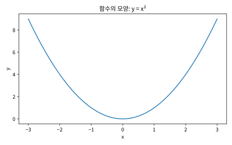
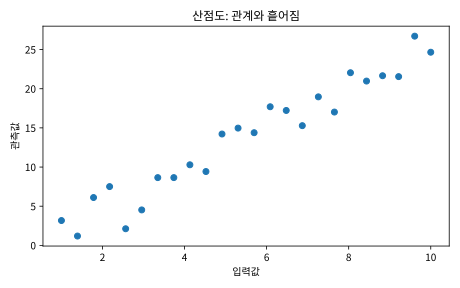
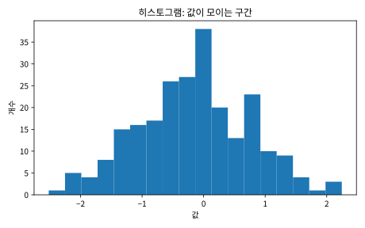
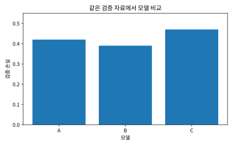
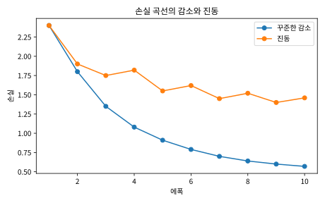

# P2-13.2 기본 차트와 수식의 모양 확인

> Section ID: `P2-13.2`
> Version: `v2026.09.15`

## 선 그래프: 함수의 모양

선 그래프(line plot)는 x축의 순서가 의미 있을 때 자주 씁니다. 시간, 반복 횟수, 학습 epoch, 입력값의 연속적 변화처럼 “왼쪽에서 오른쪽으로 읽는 흐름”이 있을 때 적합합니다.

\(y = x^2\)에서 x가 −3, 0, 3이면 y는 각각 9, 0, 9입니다. 다음 코드는 −3부터 3까지 121개 지점에서 값을 계산하고 연결해 U자 곡선을 그립니다.

```python
import matplotlib.pyplot as plt
import numpy as np

x = np.linspace(-3, 3, 121)
y = x**2

fig, ax = plt.subplots()
ax.plot(x, y)
ax.set_xlabel("x")
ax.set_ylabel("y")
ax.set_title("Function shape: y = x^2")
plt.show()
```

출력 결과는 다음처럼 보입니다.



다음 스크립트는 본문과 같은 입력 조건으로 세 언어의 SVG 그래프를 저장합니다.

[p2_13_2_basic_chart_shapes.py](../../../assets/part-02/chapter-13/p2_13_2_basic_chart_shapes.py)

```bash
python docs/assets/part-02/chapter-13/p2_13_2_basic_chart_shapes.py
```

곡선에서는 다음 특징이 보입니다.

- \(x=0\)에서 최솟값 0을 가집니다.
- \(x\)가 양쪽으로 멀어질수록 \(y\)가 커집니다.
- 기울기(slope)는 위치마다 달라집니다.

`y = x**2`를 `y = (x - 1)**2`로 바꾸면 가장 낮은 지점이 `(0, 0)`에서 `(1, 0)`으로 옮겨집니다. 수식의 변화가 곡선의 위치에 반영됩니다.

`np.linspace(-3, 3, 121)`은 양 끝을 포함해 간격 0.05인 입력값 121개를 만듭니다. 그래프는 함수의 모든 실수 입력을 그린 것이 아니라 계산한 점들을 선분으로 연결한 것입니다. 지점 수를 3으로 줄이면 `(-3, 9)`, `(0, 0)`, `(3, 9)`만 연결해 V자처럼 보입니다. 수식은 같아도 계산 지점이 적으면 곡선의 모양을 충분히 나타내지 못합니다.

## 산점도: 관계와 흩어짐

산점도(scatter plot)는 각 샘플(sample)을 하나의 점으로 찍습니다. x축과 y축에 서로 다른 값을 놓고, 두 값이 함께 움직이는지 확인할 때 유용합니다.

다음 예제는 입력값 24개에 대해 `2.5 * x`를 계산하고 평균 0, 표준편차 2.2인 정규분포의 난수를 더한 인공 데이터입니다. 점들은 직선 주변에 흩어집니다.

```python
import matplotlib.pyplot as plt
import numpy as np

rng = np.random.default_rng(42)
x = np.linspace(1, 10, 24)
y = 2.5 * x + rng.normal(0, 2.2, size=x.shape)

fig, ax = plt.subplots()
ax.scatter(x, y)
ax.set_xlabel("input value")
ax.set_ylabel("observed value")
ax.set_title("Scatter plot: relationship with variation")
plt.show()
```

출력 결과는 다음처럼 보입니다.



이 그래프에서는 점들이 완벽한 직선 위에 있지 않습니다. 하지만 오른쪽으로 갈수록 대체로 위로 올라가는 흐름이 있습니다.

이 인공 데이터에서는:

- 점 하나는 하나의 샘플입니다.
- 점들은 값이 커지는 방향으로 배치됩니다.
- 직선에서 벗어난 정도는 더한 잡음(noise)을 반영합니다.
- 산점도만으로 원인(cause)을 단정하지 않습니다.

## 히스토그램: 구간별 개수

히스토그램(histogram)은 값들을 구간(bin)으로 나누고, 각 구간에 몇 개가 들어가는지 보여 줍니다. 다음 예제는 평균 0, 표준편차 1인 정규분포에서 뽑은 값 240개를 18개 구간으로 나눕니다. 막대 높이는 각 구간에 들어간 값의 개수입니다.

```python
import matplotlib.pyplot as plt
import numpy as np

rng = np.random.default_rng(7)
values = rng.normal(loc=0, scale=1, size=240)

fig, ax = plt.subplots()
ax.hist(values, bins=18)
ax.set_xlabel("value")
ax.set_ylabel("count")
ax.set_title("Histogram: where values gather")
plt.show()
```

출력 결과는 다음처럼 보입니다.



히스토그램을 볼 때는 다음 질문을 합니다.

- 값이 어느 구간에 가장 많이 몰려 있는가?
- 한쪽으로 치우쳐 있는가?
- 양쪽 끝에 드문 값이 있는가?
- 평균만 보고 놓칠 만한 모양이 있는가?

`bins=18`을 `bins=6`으로 바꾸면 같은 240개 값을 더 넓은 구간에 묶습니다. 막대 수와 높이는 달라져도 모든 막대의 개수 합은 240으로 유지됩니다.

## 구간 경계와 빠지는 값

점수 `[45, 62, 71, 73, 82, 88, 90]`을 경계 `[40, 60, 80, 100]`으로 나누면 막대 세 개의 높이는 다음과 같습니다. 경계 목록은 구간 수보다 원소가 하나 더 많습니다.

| 구간 | 포함된 점수 | 개수 |
| --- | --- | ---: |
| 40 이상 60 미만 | 45 | 1 |
| 60 이상 80 미만 | 62, 71, 73 | 3 |
| 80 이상 100 이하 | 82, 88, 90 | 3 |

Matplotlib의 히스토그램은 마지막 구간을 제외하고 왼쪽 경계는 포함하고 오른쪽 경계는 제외합니다. 따라서 점수 80은 마지막 구간에 들어가고 마지막 경계인 100도 포함됩니다. `bins=3, range=(60, 100)`처럼 집계 범위를 제한하면 45가 제외되어 개수 합이 6이 됩니다. 단순히 보이는 축 범위를 바꾸는 것과, 집계에 포함할 값의 범위를 바꾸는 것은 다릅니다.

두 집단의 분포를 비교할 때는 같은 경계를 사용해야 합니다. `bins=5`를 각각 적용하면 집단별 최솟값·최댓값이 달라 경계도 달라질 수 있습니다. 여기서 y축은 개수이며, `density=True`를 쓰면 막대 높이가 확률 밀도로 바뀌어 높이의 합이 아니라 막대 면적의 합이 1이 됩니다.

## 막대 그래프: 범주별 비교

같은 검증 자료와 손실 함수로 평가한 가상 모델 A·B·C의 손실이 `[0.42, 0.39, 0.47]`이라고 합시다. 모델 이름은 수치 구간이 아니라 범주이므로 `bar`로 비교합니다.

```python
models = ["A", "B", "C"]
validation_loss = [0.42, 0.39, 0.47]
fig, ax = plt.subplots()
ax.bar(models, validation_loss)
ax.set_ylim(0, 0.55)
ax.set_xlabel("model")
ax.set_ylabel("validation loss")
ax.set_title("Model comparison on the same validation set")
plt.show()
```



이 기록에서는 B의 손실이 가장 낮고 A와의 차이는 0.03입니다. 막대 길이로 크기를 비교하므로 y축은 0부터 시작합니다. B의 값을 0.49로 바꾸면 가장 낮은 모델은 A가 됩니다. 막대 그래프는 이미 범주별로 주어진 값을 표시하고, 히스토그램은 원래 관측값을 수치 구간에 넣어 개수를 계산한다는 차이가 있습니다.

## 손실 곡선: 감소와 진동

두 가상 학습 기록의 손실을 비교합니다. 첫 기록은 2.4에서 0.57까지 매번 감소합니다. 둘째 기록은 2.4에서 1.46으로 내려가지만 4·6·8·10번째 반복에서 직전 값보다 상승합니다.

```python
import matplotlib.pyplot as plt
import numpy as np

epochs = np.arange(1, 11)
decreasing_loss = [2.4, 1.8, 1.35, 1.08, 0.91, 0.79, 0.70, 0.64, 0.60, 0.57]
unstable_loss = [2.4, 1.9, 1.75, 1.82, 1.55, 1.62, 1.45, 1.52, 1.40, 1.46]

fig, ax = plt.subplots()
ax.plot(epochs, decreasing_loss, marker="o", label="steady decrease")
ax.plot(epochs, unstable_loss, marker="o", label="unstable")
ax.set_xlabel("epoch")
ax.set_ylabel("loss")
ax.set_title("Loss curves can reveal training behavior")
ax.legend()
plt.show()
```

출력 결과는 다음처럼 두 흐름을 비교하게 해 줍니다.



이 그래프를 보고 바로 “좋은 모델”이라고 결론 내리면 안 됩니다. 다만 다음 질문을 할 수 있습니다.

- 손실이 대체로 줄어드는가?
- 중간에 크게 흔들리는가?
- 어느 지점부터 줄어드는 속도가 느려지는가?
- train loss와 validation loss를 나누어 봐야 하는가?

두 곡선은 서로 다른 가상 기록이며 학습·검증 손실의 쌍은 아닙니다. 학습 손실이 낮아져도 새 데이터에서 잘 예측하는지는 검증 데이터로 별도 확인해야 합니다.

## 축과 제목

첫 함수 그래프의 x축은 수식 입력값, y축은 계산한 함수값입니다. 손실 그래프의 x축은 반복 횟수, y축은 손실입니다. 선 모양만 비슷하더라도 축의 의미가 다르면 해석도 달라집니다. `set_xlabel`, `set_ylabel`, `set_title`로 변수와 그래프의 대상을 적고, 여러 선을 겹치면 `label`과 `legend()`로 구분합니다.

## 사례: 순서를 뒤집은 손실 기록

손실 `[2.4, 1.8, 1.2, 0.6]`과 역순인 `[0.6, 1.2, 1.8, 2.4]`를 비교합시다. 두 목록에 들어 있는 값과 평균 1.5는 같지만, 첫 기록은 감소하고 둘째 기록은 증가합니다.

같은 구간 경계로 히스토그램을 그리면 두 결과는 같습니다. 히스토그램은 각 값이 몇 번 등장했는지를 세며 순서는 나타내지 않기 때문입니다. 반면 반복 번호를 x축에 놓은 선 그래프는 서로 반대 방향으로 움직입니다.

손실값의 분포를 물으면 히스토그램이 답할 수 있지만, 학습 중 손실이 줄어들었는지를 물으면 순서를 보존한 선 그래프가 필요합니다. 차트를 고를 때는 필요한 정보가 그 표현에 남는지 확인해야 합니다.

## 체크리스트

- 변화, 관계, 분포 중 무엇을 보고 싶은지에 따라 차트를 고르는 기준을 설명할 수 있는가?
- 선 그래프는 순서나 연속적 변화의 모양을 확인하는 데 적합하다고 말할 수 있는가?
- 산점도에서 점 하나가 무엇을 의미하는지, 두 값의 관계와 흩어짐을 어떻게 읽는지 설명할 수 있는가?
- 히스토그램이 평균과 다른 분포 정보를 보여 주며 값이 어디에 몰려 있는지 확인하게 해 준다는 점을 설명할 수 있는가?
- 손실 곡선을 보고 학습 흐름에 대한 질문을 만들 수 있는가?
- 수식 \(y = x^2\)의 모양이나 분포의 생김새를 실제 그림으로 확인해야 할 때 어떤 차트를 먼저 떠올릴지 고를 수 있는가?
- 그래프를 만들 때 x축, y축, 제목, 라벨이 해석의 일부라는 점을 설명할 수 있는가?

## 출처와 참고 자료

- Matplotlib Developers, [Quick start guide](https://matplotlib.org/stable/users/explain/quick_start.html){: target="_blank" rel="noopener noreferrer" }, Matplotlib documentation, 확인 날짜: 2026-07-20. `Axes.plot`, `Axes.scatter`, 라벨·제목 설정을 포함한 기본 그래프 코드 흐름을 확인했습니다.
- Matplotlib Developers, [Plot types](https://matplotlib.org/stable/plot_types/index.html){: target="_blank" rel="noopener noreferrer" }, Matplotlib documentation, 확인 날짜: 2026-07-20. 선 그래프, 산점도, 히스토그램을 변화·관계·분포 질문에 대응시키는 근거입니다.
- Matplotlib Developers, [matplotlib.pyplot](https://matplotlib.org/stable/api/pyplot_summary.html){: target="_blank" rel="noopener noreferrer" }, Matplotlib documentation, 확인 날짜: 2026-07-20. `pyplot` 함수 기반 예제와 Matplotlib 입문 코드 스타일을 확인하는 참고 자료입니다.
- Matplotlib Developers, [Axes.hist](https://matplotlib.org/stable/api/_as_gen/matplotlib.axes.Axes.hist.html){: target="_blank" rel="noopener noreferrer" }, 확인 날짜: 2026-09-15. 구간 경계·range·density의 동작.
- NumPy Developers, [numpy.linspace](https://numpy.org/doc/stable/reference/generated/numpy.linspace.html){: target="_blank" rel="noopener noreferrer" }, 확인 날짜: 2026-09-15. 양 끝 포함과 계산 지점 수.
