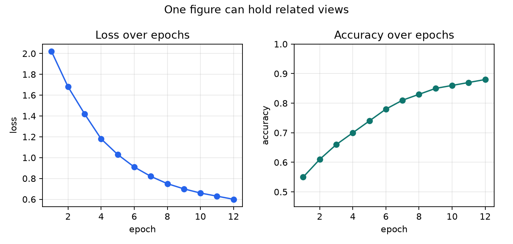
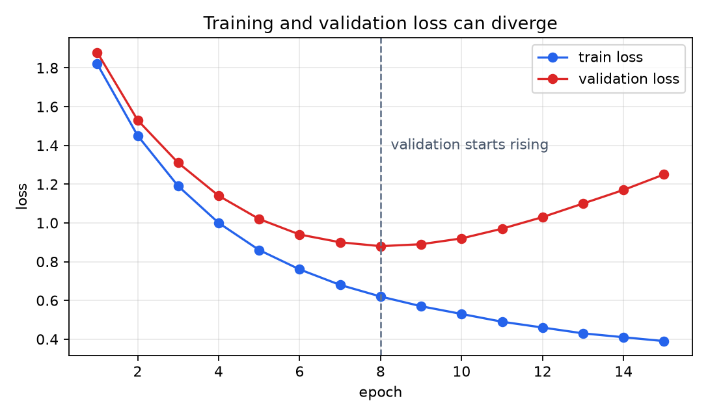

# P2-13.3 여러 그래프를 비교하고 저장하기

P2-13.2에서는 선 그래프(line plot), 산점도(scatter plot), 히스토그램(histogram)처럼 기본 차트를 어떤 질문에 쓰는지 봤습니다. 이제 한 걸음 더 나아가 여러 그래프를 함께 보고, 그 결과를 파일로 남기는 흐름을 정리합니다.

AI 학습에서는 그래프 하나만 보고 끝나는 일이 많지 않습니다. 손실(loss)과 정확도(accuracy)를 함께 보거나, 학습 데이터(train data)와 검증 데이터(validation data)의 흐름을 나란히 비교해야 합니다. 이때 Matplotlib의 `Figure`와 `Axes` 구조를 조금 더 의식하면 좋습니다.

## 이 절의 범위

이 절은 Matplotlib으로 여러 그래프를 배치하고 저장하는 입문 흐름만 다룹니다. 복잡한 대시보드, 인터랙티브 시각화, 논문용 스타일링, 색상 팔레트 설계는 다루지 않습니다.

여기서는 다음 질문에 답합니다.

- 여러 그래프를 한 화면에 놓는 이유는 무엇인가?
- `plt.subplots()`는 여러 `Axes`를 어떻게 만드는가?
- 학습 곡선을 비교할 때 무엇을 조심해야 하는가?
- `savefig()`로 그래프를 저장한다는 것은 어떤 의미인가?
- 그래프 파일을 학습 기록으로 남길 때 어떤 정보를 함께 남겨야 하는가?

## 이 절의 목표

- 하나의 `Figure` 안에 여러 `Axes`를 둘 수 있음을 설명할 수 있습니다.
- 손실(loss)과 정확도(accuracy)를 나란히 비교하는 그래프를 만들 수 있습니다.
- 학습 손실(train loss)과 검증 손실(validation loss)을 한 축에서 비교할 수 있습니다.
- 그래프를 `savefig()`로 저장해 문서나 학습 기록에 다시 사용할 수 있습니다.
- 저장된 그래프가 재현 가능한 기록이 되려면 코드와 데이터 조건도 함께 필요함을 설명할 수 있습니다.

## 여러 그래프는 비교 질문을 만든다

그래프를 여러 개 배치하는 이유는 화면을 채우기 위해서가 아닙니다. 서로 관련된 질문을 나란히 놓기 위해서입니다.

예를 들어 학습 과정에서 손실(loss)은 줄어들고, 정확도(accuracy)는 올라가는지 보고 싶을 수 있습니다. 두 값은 단위가 다르므로 같은 y축에 억지로 올리기보다, 두 개의 작은 그래프로 나누어 보는 편이 읽기 쉽습니다.

```python
import matplotlib.pyplot as plt
import numpy as np

epochs = np.arange(1, 13)
loss = [2.02, 1.68, 1.42, 1.18, 1.03, 0.91, 0.82, 0.75, 0.70, 0.66, 0.63, 0.60]
accuracy = [0.55, 0.61, 0.66, 0.70, 0.74, 0.78, 0.81, 0.83, 0.85, 0.86, 0.87, 0.88]

fig, axes = plt.subplots(1, 2)

axes[0].plot(epochs, loss, marker="o")
axes[0].set_title("Loss over epochs")
axes[0].set_xlabel("epoch")
axes[0].set_ylabel("loss")

axes[1].plot(epochs, accuracy, marker="o")
axes[1].set_title("Accuracy over epochs")
axes[1].set_xlabel("epoch")
axes[1].set_ylabel("accuracy")

fig.tight_layout()
plt.show()
```

출력 결과는 다음처럼 관련된 두 질문을 한 `Figure` 안에서 나누어 보여 줍니다.



이 그림은 두 가지를 동시에 묻습니다.

- 손실은 반복 학습이 진행될수록 대체로 줄어드는가?
- 정확도는 같은 기간에 대체로 올라가는가?

두 그래프를 나란히 놓으면 “하나는 좋아지는데 다른 하나는 정체되는가?” 같은 질문도 만들 수 있습니다.

## `Figure`와 `Axes`를 다시 읽기

P2-13.1에서는 `Figure`를 그림 전체, `Axes`를 데이터가 그려지는 좌표 영역으로 봤습니다. 여러 그래프를 그릴 때 이 구분이 더 중요해집니다.

```python
fig, axes = plt.subplots(1, 2)
```

이 코드는 하나의 `Figure` 안에 좌우로 두 개의 `Axes`를 만듭니다.

입문 단계에서는 다음처럼 읽으면 됩니다.

| 코드 | 직관 |
| --- | --- |
| `fig` | 전체 그림 |
| `axes[0]` | 왼쪽 그래프 칸 |
| `axes[1]` | 오른쪽 그래프 칸 |
| `plt.subplots(1, 2)` | 1행 2열로 그래프 칸을 만든다 |

즉, `Axes`가 여러 개가 되면 `ax.plot(...)` 하나만 쓰는 방식에서 `axes[0].plot(...)`, `axes[1].plot(...)`처럼 “어느 칸에 그릴지”를 지정하는 방식으로 바뀝니다.

## 같은 축에서 비교해야 할 때도 있다

항상 그래프를 나누는 것이 좋은 것은 아닙니다. 같은 단위의 값을 비교할 때는 같은 `Axes` 위에 두 선을 올리는 편이 더 직접적입니다.

대표적인 예가 학습 손실(train loss)과 검증 손실(validation loss)의 비교입니다. 두 값은 모두 손실(loss)이므로 같은 y축에서 비교할 수 있습니다.

```python
import matplotlib.pyplot as plt
import numpy as np

epochs = np.arange(1, 16)
train_loss = [1.82, 1.45, 1.19, 1.00, 0.86, 0.76, 0.68, 0.62, 0.57, 0.53, 0.49, 0.46, 0.43, 0.41, 0.39]
validation_loss = [1.88, 1.53, 1.31, 1.14, 1.02, 0.94, 0.90, 0.88, 0.89, 0.92, 0.97, 1.03, 1.10, 1.17, 1.25]

fig, ax = plt.subplots()
ax.plot(epochs, train_loss, marker="o", label="train loss")
ax.plot(epochs, validation_loss, marker="o", label="validation loss")
ax.axvline(8, color="gray", linestyle="--")
ax.text(8.25, 1.38, "validation starts rising")
ax.set_xlabel("epoch")
ax.set_ylabel("loss")
ax.set_title("Training and validation loss can diverge")
ax.legend()
plt.show()
```

출력 결과는 다음처럼 두 손실 곡선을 한 축에서 비교하게 해 줍니다.



이 예시는 Part 3에서 다시 만날 과적합(overfitting)의 직관과 연결됩니다. 학습 손실은 계속 내려가는데 검증 손실이 다시 올라간다면, 모델이 학습 데이터에는 더 잘 맞지만 새로운 데이터에는 덜 맞을 가능성을 의심할 수 있습니다.

다만 여기서 결론을 단정하지는 않습니다. 이 그래프는 “과적합이 확정되었다”가 아니라 “검증 데이터에서 성능 흐름을 더 확인해야 한다”는 질문을 만듭니다.

## 그래프를 저장한다는 것은 기록을 남기는 일이다

Colab이나 Jupyter Notebook에서는 `plt.show()`로 그래프를 바로 볼 수 있습니다. 하지만 책, 보고서, 실험 기록에 넣으려면 이미지 파일로 저장해야 합니다.

Matplotlib에서는 `savefig()`를 사용합니다.

```python
fig.savefig("train-validation-loss-diverge.png")
```

입문 단계에서는 다음처럼 이해하면 됩니다.

| 코드 | 의미 |
| --- | --- |
| `plt.show()` | 현재 실행 화면에서 그래프를 본다 |
| `fig.savefig(...)` | 그래프를 이미지 파일로 저장한다 |
| `fig.tight_layout()` | 제목, 축 라벨, 그래프 영역이 겹치지 않게 여백을 조정한다 |

이 책의 출력 이미지는 대부분 같은 방식으로 생성합니다. 코드를 실행해 이미지를 만들고, 그 이미지를 Markdown 문서에 링크합니다.

## 저장된 이미지만으로는 재현성이 부족하다

그래프 파일은 결과를 보여 주지만, 그 자체만으로는 재현 가능한 기록이 아닙니다. 같은 그래프를 다시 만들려면 다음 정보가 필요합니다.

- 그래프를 만든 코드
- 사용한 데이터 또는 데이터 생성 조건
- 사용한 라이브러리와 버전
- 랜덤 값이 들어간 경우 난수 시드(random seed)
- 그래프가 답하려는 질문

그래서 이 책에서는 이미지 파일만 만들지 않고, 가능하면 이미지를 생성한 Python 스크립트도 함께 둡니다. 예를 들어 이 절의 이미지는 다음 스크립트에서 생성합니다.

```text
docs/assets/part-02/chapter-13/p2_13_3_compare_and_save.py
```

이 방식은 “그림을 붙였다”보다 “그림을 다시 만들 수 있다”에 가깝습니다.

## 비교 그래프를 만들 때의 주의점

여러 그래프를 비교할 때는 다음을 조심합니다.

| 주의점 | 이유 |
| --- | --- |
| 서로 다른 단위를 같은 축에 억지로 올리지 않는다 | 변화가 왜곡되어 보일 수 있다 |
| 같은 단위의 값은 같은 축에서 비교할 수 있다 | train loss와 validation loss처럼 직접 비교가 가능하다 |
| 범례(legend)를 붙인다 | 선이 무엇을 뜻하는지 알 수 있어야 한다 |
| 축 범위를 확인한다 | 작은 차이가 과장되거나 큰 차이가 숨겨질 수 있다 |
| 저장 파일 이름을 설명적으로 짓는다 | 나중에 어떤 그래프인지 다시 알 수 있어야 한다 |

그래프는 결론을 대신하지 않습니다. 하지만 좋은 그래프는 다음 질문을 더 정확하게 만들게 도와줍니다.

## 이 절에서 기억할 관점

- 여러 그래프를 배치하는 이유는 관련된 질문을 비교하기 위해서입니다.
- 하나의 `Figure` 안에는 여러 `Axes`가 들어갈 수 있습니다.
- 단위가 다른 값은 나누어 보고, 같은 단위의 값은 같은 축에서 비교할 수 있습니다.
- `savefig()`는 그래프를 이미지 파일로 저장하는 방법입니다.
- 저장된 그래프가 재현 가능한 기록이 되려면 코드와 데이터 조건도 함께 남아야 합니다.

## 체크리스트

- `plt.subplots(1, 2)`가 하나의 Figure 안에 두 Axes를 만든다는 점을 설명할 수 있는가?
- 손실과 정확도를 나란히 비교해야 하는 이유를 설명할 수 있는가?
- train loss와 validation loss를 같은 축에서 비교할 수 있는 이유를 설명할 수 있는가?
- `plt.show()`와 `fig.savefig()`의 차이를 설명할 수 있는가?
- 그래프 파일만으로는 재현성이 부족하다는 점을 설명할 수 있는가?

## 출처와 참고 자료

- Matplotlib Developers, `Quick start guide`, Matplotlib documentation, 확인 날짜: 2026-06-25. [https://matplotlib.org/stable/users/explain/quick_start.html](https://matplotlib.org/stable/users/explain/quick_start.html){: target="_blank" rel="noopener noreferrer" }
- Matplotlib Developers, `Introduction to Axes (or Subplots)`, Matplotlib documentation, 확인 날짜: 2026-06-25. [https://matplotlib.org/stable/users/explain/axes/axes_intro.html](https://matplotlib.org/stable/users/explain/axes/axes_intro.html){: target="_blank" rel="noopener noreferrer" }
- Matplotlib Developers, `matplotlib.figure.Figure.savefig`, Matplotlib API reference, 확인 날짜: 2026-06-25. [https://matplotlib.org/stable/api/_as_gen/matplotlib.figure.Figure.savefig.html](https://matplotlib.org/stable/api/_as_gen/matplotlib.figure.Figure.savefig.html){: target="_blank" rel="noopener noreferrer" }
