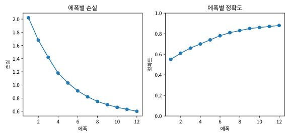
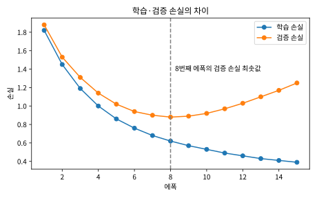

# P2-13.3 여러 그래프를 비교하고 저장하기

> Section ID: `P2-13.3`
> Version: `v2026.09.15`

## 손실과 정확도 나란히 보기

다음 가상 학습 기록에서 손실은 2.02에서 0.60으로 줄고 정확도는 0.55에서 0.88로 올라갑니다. 정확도는 전체 예측 중 맞춘 비율입니다. 손실과 정확도는 의미와 수치 범위가 다르므로 각각의 y축을 가진 두 그래프로 나누어 비교합니다.

```python
import matplotlib.pyplot as plt
import numpy as np

epochs = np.arange(1, 13)
loss = [2.02, 1.68, 1.42, 1.18, 1.03, 0.91, 0.82, 0.75, 0.70, 0.66, 0.63, 0.60]
accuracy = [0.55, 0.61, 0.66, 0.70, 0.74, 0.78, 0.81, 0.83, 0.85, 0.86, 0.87, 0.88]

fig, axes = plt.subplots(1, 2, figsize=(8, 3.8), sharex=True)

axes[0].plot(epochs, loss, marker="o")
axes[0].set_title("Loss over epochs")
axes[0].set_xlabel("epoch")
axes[0].set_ylabel("loss")

axes[1].plot(epochs, accuracy, marker="o")
axes[1].set_title("Accuracy over epochs")
axes[1].set_xlabel("epoch")
axes[1].set_ylabel("accuracy")
axes[1].set_ylim(0, 1)

fig.tight_layout()
plt.show()
```

출력 결과는 다음처럼 관련된 두 질문을 한 `Figure` 안에서 나누어 보여 줍니다.



`plt.subplots(1, 2)`는 전체 그림 `fig` 하나와 좌표 영역 두 개를 만듭니다. `axes[0]`은 왼쪽 손실 그래프, `axes[1]`은 오른쪽 정확도 그래프입니다. 두 그래프의 x축은 같은 12회 반복을 나타냅니다.

마지막 세 반복에서 손실은 `0.66 → 0.63 → 0.60`, 정확도는 `0.86 → 0.87 → 0.88`로 변합니다. 별도 축을 쓰면 각 지표의 변화 폭을 해당 눈금으로 읽을 수 있습니다.

## 학습·검증 손실 겹쳐 보기

항상 그래프를 나누는 것이 좋은 것은 아닙니다. 같은 단위의 값을 비교할 때는 같은 `Axes` 위에 두 선을 올리는 편이 더 직접적입니다.

학습 손실(train loss)과 검증 손실(validation loss)은 같은 손실 함수와 집계 기준으로 계산했다면 같은 y축에서 비교할 수 있습니다. 다음 가상 기록은 학습 손실이 계속 감소하지만 검증 손실은 8번째 반복의 0.88 이후 상승합니다.

```python
import matplotlib.pyplot as plt
import numpy as np

epochs = np.arange(1, 16)
train_loss = [1.82, 1.45, 1.19, 1.00, 0.86, 0.76, 0.68, 0.62, 0.57, 0.53, 0.49, 0.46, 0.43, 0.41, 0.39]
validation_loss = [1.88, 1.53, 1.31, 1.14, 1.02, 0.94, 0.90, 0.88, 0.89, 0.92, 0.97, 1.03, 1.10, 1.17, 1.25]

fig, ax = plt.subplots()
ax.plot(epochs, train_loss, marker="o", label="train loss")
ax.plot(epochs, validation_loss, marker="o", label="validation loss")
ax.axvline(8, color="gray", linestyle="--")
ax.text(8.25, 1.38, "minimum validation loss at epoch 8")
ax.set_xlabel("epoch")
ax.set_ylabel("loss")
ax.set_title("Training and validation loss can diverge")
ax.legend()
plt.show()
```

출력 결과는 다음처럼 두 손실 곡선을 한 축에서 비교하게 해 줍니다.



이 예시는 과적합(overfitting)을 의심할 수 있는 모양입니다. 학습 손실은 계속 내려가는데 검증 손실이 다시 올라간다면, 모델이 학습 데이터에는 더 잘 맞지만 새로운 데이터에는 덜 맞을 가능성을 의심할 수 있습니다.

8번째에서 15번째 반복까지 학습 손실은 0.62에서 0.39로 낮아지지만 검증 손실은 0.88에서 1.25로 높아집니다. 같은 기간에 두 지표가 반대 방향으로 움직입니다. 원인을 판단하려면 데이터 분할과 학습 조건도 확인해야 합니다.

## 이미지 파일 저장

Colab이나 Jupyter Notebook에서는 `plt.show()`로 그래프를 바로 볼 수 있습니다. 하지만 책, 보고서, 실험 기록에 넣으려면 이미지 파일로 저장해야 합니다.

Matplotlib에서는 `savefig()`를 사용합니다.

```python
from pathlib import Path

output_dir = Path(".tmp") / "chapter-13-plots"
output_dir.mkdir(parents=True, exist_ok=True)
fig.savefig(output_dir / "train-validation-loss-diverge.png", dpi=160)
fig.savefig(output_dir / "train-validation-loss-diverge.svg")
```

| 코드 | 의미 |
| --- | --- |
| `plt.show()` | 현재 실행 화면에서 그래프를 본다 |
| `fig.savefig(...)` | 그래프를 이미지 파일로 저장한다 |
| `fig.tight_layout()` | 제목, 축 라벨, 그래프 영역이 겹치지 않게 여백을 조정한다 |

상대 경로이므로 현재 작업 디렉터리 아래 `.tmp/chapter-13-plots/`에 파일이 생성됩니다. 위 저장 코드는 바로 앞에서 만든 학습·검증 손실의 `fig`를 사용합니다. 두 그래프가 나란히 있는 첫 그림을 저장하려면 첫 코드의 `plt.show()` 앞에 저장 호출을 넣습니다. 여러 그림을 만들면 변수 `fig`가 나중 그림으로 바뀔 수 있으므로 저장할 객체를 먼저 확인합니다.

PNG는 픽셀 이미지이며 그림 크기가 8×3.8인치이고 `dpi=160`이면 기본 캔버스는 1280×608픽셀입니다. SVG는 선과 글자를 벡터로 저장하므로 확대해도 윤곽을 유지합니다. `bbox_inches="tight"`를 지정하면 실제 저장 범위가 잘려 픽셀 크기가 달라질 수 있습니다.

일반적인 저장 순서는 그림 생성, 라벨·여백 조정, `fig.savefig`, `plt.show()`입니다. 블로킹 `show()`가 끝난 뒤 `plt.savefig()`를 호출하면 현재 그림이 닫혀 빈 새 그림을 저장할 수 있습니다. 위 코드는 보관한 Figure 객체의 `fig.savefig()`를 사용하지만, 저장을 `show()` 전에 두면 실행 환경에 따른 혼동을 줄일 수 있습니다. 파일만 만드는 반복 작업에서는 저장 뒤 `plt.close(fig)`로 그림을 닫습니다.

## 재현에 필요한 기록

그래프 파일은 결과를 보여 주지만, 그 자체만으로는 재현 가능한 기록이 아닙니다. 같은 그래프를 다시 만들려면 다음 정보가 필요합니다.

- 그래프를 만든 코드
- 사용한 데이터 또는 데이터 생성 조건
- 사용한 라이브러리와 버전
- 랜덤 값이 들어간 경우 난수 시드(random seed)
- 그래프가 답하려는 질문

그래서 문서 프로젝트에서는 이미지 파일만 만들지 않고, 가능하면 이미지를 생성한 Python 스크립트도 함께 둡니다. 예를 들어 한 장의 그래프를 여러 번 수정해야 한다면, 이미지와 가까운 위치에 생성 스크립트를 두는 편이 결과를 다시 만들기 쉽습니다.

다음 스크립트는 세 언어의 예시 SVG를 자산 폴더에 저장합니다. Matplotlib 캐시는 저장소의 `.tmp` 아래를 기본값으로 사용합니다.

[p2_13_3_compare_and_save.py](../../../assets/part-02/chapter-13/p2_13_3_compare_and_save.py)

```bash
python docs/assets/part-02/chapter-13/p2_13_3_compare_and_save.py
```

## 비교 조건

여러 그래프를 비교할 때는 다음을 조심합니다.

| 주의점 | 이유 |
| --- | --- |
| 서로 다른 단위를 같은 축에 억지로 올리지 않는다 | 변화가 왜곡되어 보일 수 있다 |
| 같은 단위의 값은 같은 축에서 비교할 수 있다 | train loss와 validation loss처럼 직접 비교가 가능하다 |
| 범례(legend)를 붙인다 | 선이 무엇을 뜻하는지 알 수 있어야 한다 |
| 축 범위를 확인한다 | 작은 차이가 과장되거나 큰 차이가 숨겨질 수 있다 |
| 저장 파일 이름을 설명적으로 짓는다 | 나중에 어떤 그래프인지 다시 알 수 있어야 한다 |

## 사례: 정확도 정체를 기록하기

첫 예제의 정확도 목록에서 마지막 세 값을 `[0.86, 0.86, 0.86]`으로 바꾸고 다시 실행해 봅니다. 손실 곡선은 그대로 내려가지만 정확도 곡선은 10번째 반복부터 수평이 됩니다. 손실이 줄어도 맞춘 비율은 늘지 않는 기록입니다.

첫 코드의 정확도 목록을 바꾼 뒤 `plt.show()` 앞에 `fig.savefig(output_dir / "loss-accuracy-plateau.png", dpi=160)`을 넣습니다. `output_dir`는 앞의 저장 예제에서 만든 폴더입니다. 수정한 그림을 만든 직후 저장해야 뒤에서 만든 다른 `fig`를 잘못 저장하지 않습니다.

정확도는 최종 정답 여부만 세지만 손실은 예측값이 정답에 얼마나 가까운지 더 세밀하게 반영할 수 있습니다. 예를 들어 정답이 양성이고 분류 기준이 0.5일 때 예측 확률이 0.6에서 0.8로 바뀌어도 둘 다 정답이지만, 이진 교차엔트로피 손실은 약 0.511에서 0.223으로 줄어듭니다. 따라서 정확도 정체와 손실 감소는 모순이 아닙니다.

이 파일을 기존 결과와 비교하려면 원래 정확도 목록과 수정한 목록을 각각 남겨야 합니다. 파일 이름이 다르다는 사실만으로 어떤 입력을 바꿨는지는 알 수 없습니다. `마지막 세 정확도를 0.86으로 고정, 손실 목록은 동일`이라는 변경 내용과 생성 코드를 함께 기록하면 두 그림의 차이를 설명할 수 있습니다.

## 체크리스트

- 여러 그래프를 배치하는 이유가 관련된 질문을 비교하기 위해서라는 점을 설명할 수 있는가?
- `plt.subplots(1, 2)`가 하나의 `Figure` 안에 두 `Axes`를 만든다는 점을 설명할 수 있는가?
- 손실과 정확도를 나란히 비교해야 하는 이유를 설명할 수 있는가?
- train loss와 validation loss처럼 같은 단위의 값은 같은 축에서 비교할 수 있고, 단위가 다른 값은 나누어 봐야 한다는 점을 설명할 수 있는가?
- `plt.show()`와 `fig.savefig()`의 차이를 설명할 수 있는가?
- `savefig()`가 그래프를 이미지 파일로 저장하는 방법이며, 저장된 그래프가 재현 가능한 기록이 되려면 코드와 데이터 조건도 함께 남아야 한다는 점을 설명할 수 있는가?

## 출처와 참고 자료

- Matplotlib Developers, [Quick start guide](https://matplotlib.org/stable/users/explain/quick_start.html){: target="_blank" rel="noopener noreferrer" }, Matplotlib documentation, 확인 날짜: 2026-07-20. 하나의 `Figure` 안에 여러 `Axes`를 둘 수 있다는 설명과 `plt.subplots()` 예제를 확인했습니다.
- Matplotlib Developers, [Introduction to Axes (or Subplots)](https://matplotlib.org/stable/users/explain/axes/axes_intro.html){: target="_blank" rel="noopener noreferrer" }, Matplotlib documentation, 확인 날짜: 2026-07-20. `Axes`가 데이터 좌표계와 라벨·제목·범례 설정의 중심 객체라는 설명의 근거입니다.
- Matplotlib Developers, [matplotlib.figure.Figure.savefig](https://matplotlib.org/stable/api/_as_gen/matplotlib.figure.Figure.savefig.html){: target="_blank" rel="noopener noreferrer" }, Matplotlib documentation, 확인 날짜: 2026-09-15. `Figure.savefig()`가 이미지나 벡터 그래픽 파일로 저장한다는 설명의 직접 참고 자료입니다.
- Matplotlib Developers, [pyplot.show](https://matplotlib.org/stable/api/_as_gen/matplotlib.pyplot.show.html){: target="_blank" rel="noopener noreferrer" }, 확인 날짜: 2026-09-15. show와 저장 순서, Figure 참조 유지.
- scikit-learn Developers, [log_loss](https://scikit-learn.org/stable/modules/generated/sklearn.metrics.log_loss.html){: target="_blank" rel="noopener noreferrer" }, 확인 날짜: 2026-09-15. 양성 표본의 이진 교차엔트로피 계산.
