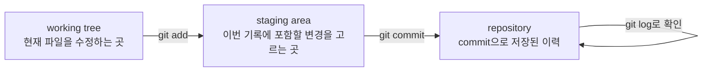

# P2-14.1 Git은 변경 이력을 관리하는 도구

P2-13장에서는 Matplotlib으로 그래프를 만들고, 그 출력 이미지를 문서에 연결했습니다. 여기서 바로 문제가 생깁니다. 문서, 코드, 이미지, 근거 메모가 함께 바뀌면 나중에 “무엇을 왜 바꿨는지”를 기억하기 어렵습니다.

Git은 이런 변경을 기록하기 위한 도구입니다. 단순히 코드를 저장하는 도구가 아니라, 학습 과정에서 만들어진 문서와 예제 코드의 변화 과정을 추적하는 장치로 볼 수 있습니다.

## 이 절의 범위

이 절은 Git의 깊은 내부 구조를 다루지 않습니다. 브랜치(branch), 원격 저장소(remote repository), 충돌 해결(merge conflict), GitHub Pages 배포는 P2-14.2에서 다룹니다.

여기서는 다음 질문에 답합니다.

- 버전 관리(version control)는 왜 필요한가?
- Git은 파일 저장과 무엇이 다른가?
- 변경 사항을 확인하고 묶어 기록한다는 것은 무슨 뜻인가?
- `status`, `add`, `commit`, `log`는 각각 어떤 역할을 하는가?
- 이 책의 작성 과정에서 Git을 왜 학습 기록 도구로 봐야 하는가?

## 이 절의 목표

- 버전 관리(version control)를 “시간이 지난 뒤 특정 상태를 다시 찾기 위한 기록”으로 설명할 수 있습니다.
- Git의 커밋(commit)을 파일 저장이 아니라 의미 있는 변경 묶음으로 이해할 수 있습니다.
- 작업 디렉터리(working tree), 스테이징 영역(staging area), 저장소(repository)의 차이를 직관적으로 설명할 수 있습니다.
- `git status`, `git add`, `git commit`, `git log`의 역할을 구분할 수 있습니다.
- 학습 문서와 예제 코드를 Git으로 관리해야 하는 이유를 설명할 수 있습니다.

## 파일을 저장하는 것과 변경 이력을 남기는 것은 다르다

파일을 저장하면 현재 상태가 남습니다. 하지만 이전 상태가 왜 바뀌었는지, 어떤 파일들이 함께 바뀌었는지는 자동으로 설명되지 않습니다.

예를 들어 다음 작업을 했다고 가정합니다.

- P2-13.3 원고를 작성했다.
- 그래프 생성 스크립트를 추가했다.
- 출력 이미지 두 개를 만들었다.
- `mkdocs.yml` 목차를 수정했다.

이 네 가지는 따로 떨어진 작업처럼 보이지만, 실제로는 “P2-13.3을 배포 문서에 연결한다”는 하나의 의미 있는 변경 묶음입니다.

Git은 이런 묶음을 커밋(commit)으로 기록합니다.

## 버전 관리는 되돌아가기보다 설명하기에 가깝다

Git을 처음 배울 때는 “실수하면 되돌릴 수 있는 도구”로 이해하기 쉽습니다. 그 설명도 맞습니다. 하지만 이 책에서는 조금 더 넓게 봅니다.

버전 관리(version control)는 시간이 지난 뒤 다음 질문에 답하기 위한 장치입니다.

- 어떤 파일이 바뀌었는가?
- 왜 바뀌었는가?
- 어떤 파일들이 함께 바뀌었는가?
- 특정 설명은 언제 들어왔는가?
- 문제가 생겼다면 어느 변경 이후에 생겼는가?

Git 공식 책은 버전 관리를 시간이 지나며 파일 변화 기록을 남기고, 나중에 특정 버전을 다시 불러올 수 있게 하는 시스템으로 설명합니다. 이 책에서는 그 관점을 문서 작성과 학습 기록에 적용합니다.

## Git의 기본 흐름

입문 단계에서는 Git의 흐름을 다음 세 공간으로 나누어 보면 됩니다.



이 흐름에서 중요한 점은 `저장`과 `커밋`이 다르다는 것입니다.

파일 저장은 편집기에서 현재 파일 내용을 디스크에 쓰는 일입니다. 커밋은 그중 의미 있는 변경 묶음을 저장소 이력에 기록하는 일입니다.

## `git status`는 현재 상태를 묻는 명령이다

Git 작업을 할 때 가장 먼저 확인하는 명령은 보통 `git status`입니다.

```bash
git status
```

이 명령은 다음 질문에 답합니다.

- 어떤 파일이 수정되었는가?
- 새로 생긴 파일이 있는가?
- 이번 커밋에 포함하기로 고른 파일이 있는가?
- 현재 브랜치(branch)는 무엇인가?

입문 단계에서는 `git status`를 “지금 작업장이 어떤 상태인지 묻는 명령”으로 이해하면 됩니다.

## `git add`는 파일을 고르는 일이다

`git add`는 파일을 즉시 영구 저장한다는 뜻이 아닙니다. 이번 커밋에 포함할 변경을 스테이징 영역(staging area)에 올리는 일입니다.

```bash
git add docs/parts/part-02/chapter-14/section-01.md
```

여기서 핵심은 “이번 기록에 넣을 변경을 고른다”입니다. 파일이 여러 개 바뀌었더라도 한 커밋에 모두 넣을 필요는 없습니다. 서로 다른 목적의 변경이면 나누어 커밋하는 편이 나중에 읽기 쉽습니다.

예를 들어 다음 두 작업은 가능하면 나누는 편이 좋습니다.

| 변경 | 커밋을 나누는 이유 |
| --- | --- |
| P2-14.1 원고 작성 | 책 본문 추가라는 목적 |
| CSS 레이아웃 수정 | 화면 표시 개선이라는 목적 |

두 변경을 한 커밋에 넣으면 나중에 “왜 이 CSS가 바뀌었는가?”를 추적하기 어려워집니다.

## `git commit`은 변경 묶음에 이름을 붙이는 일이다

`git commit`은 스테이징한 변경을 저장소 이력에 남깁니다.

```bash
git commit -m "docs(part2): add git version control introduction"
```

커밋 메시지는 단순 메모가 아닙니다. 나중에 변경 이력을 읽는 사람에게 “이 변경이 무엇인지” 알려 주는 제목입니다.

좋은 커밋 메시지는 보통 다음 조건을 만족합니다.

- 무엇을 바꿨는지 알 수 있다.
- 너무 넓은 표현을 피한다.
- 파일명보다 변경 목적을 드러낸다.
- 나중에 `git log`에서 읽어도 의미가 통한다.

나쁜 예시는 다음과 같습니다.

```bash
git commit -m "update"
```

이 메시지는 무엇을 업데이트했는지 알려 주지 않습니다.

## `git log`는 변경 이력을 읽는 명령이다

커밋이 쌓이면 `git log`로 이력을 확인할 수 있습니다.

```bash
git log --oneline
```

이 명령은 커밋 목록을 짧게 보여 줍니다. 입문 단계에서는 “이 프로젝트가 어떤 순서로 바뀌었는지 보는 목록”으로 이해하면 충분합니다.

학습 문서 프로젝트에서는 `git log`가 다음 질문에 도움을 줍니다.

- 이 절은 언제 추가되었는가?
- 어떤 커밋에서 목차가 바뀌었는가?
- 특정 그림 파일은 어떤 원고와 함께 추가되었는가?
- 배포 전에 어떤 변경이 들어갔는가?

## 이 책에서 Git이 중요한 이유

이 책은 단순한 완성 문서가 아니라 학습 과정의 결과입니다. 원고, 근거 메모, 예제 코드, 이미지, 배포 설정이 함께 바뀝니다.

Git을 사용하면 다음 관계를 남길 수 있습니다.

| 산출물 | Git으로 남길 수 있는 질문 |
| --- | --- |
| 원고 Markdown | 어떤 설명이 언제 추가되었는가 |
| 근거 메모 | 어떤 자료를 근거로 삼았는가 |
| 예제 코드 | 어떤 출력 이미지를 만들었는가 |
| 이미지 파일 | 어떤 코드나 절과 연결되는가 |
| `mkdocs.yml` | 어떤 문서가 배포 목차에 들어갔는가 |

이 관점에서 Git은 개발자만을 위한 도구가 아닙니다. 문서가 커지고, 근거가 많아지고, 실습 코드가 늘어날수록 “학습의 변경 이력”을 관리하는 도구가 됩니다.

## Git을 쓸 때의 최소 습관

처음부터 모든 Git 명령을 알 필요는 없습니다. 이 책의 작성과 실습에서는 다음 습관만으로도 큰 도움이 됩니다.

1. 작업 전후에 `git status`로 상태를 확인합니다.
2. 한 커밋에는 하나의 목적을 가진 변경을 넣습니다.
3. 커밋 메시지에는 변경 목적을 씁니다.
4. 생성 파일과 원본 파일의 관계를 함께 확인합니다.
5. 배포 설정을 바꾸는 작업과 원고 작성 작업을 구분합니다.

이 습관은 P2-14.2에서 브랜치(branch), `dev`, `main`, 배포 흐름을 이해할 때 다시 필요합니다.

## 이 절에서 기억할 관점

- Git은 파일 저장 도구가 아니라 변경 이력 관리 도구입니다.
- 커밋(commit)은 의미 있는 변경 묶음입니다.
- `git status`는 현재 상태를 확인하고, `git add`는 이번 기록에 넣을 변경을 고릅니다.
- `git commit`은 선택한 변경을 이력에 남기고, `git log`는 그 이력을 읽게 해 줍니다.
- 학습 문서 프로젝트에서 Git은 원고, 코드, 이미지, 근거 메모의 연결을 추적하게 해 줍니다.

## 체크리스트

- 파일 저장과 Git 커밋의 차이를 설명할 수 있는가?
- 작업 디렉터리, 스테이징 영역, 저장소를 구분할 수 있는가?
- `git status`, `git add`, `git commit`, `git log`의 역할을 말할 수 있는가?
- 한 커밋에 하나의 목적을 담아야 하는 이유를 설명할 수 있는가?
- 이 책에서 Git이 학습 기록 관리 도구로 필요한 이유를 설명할 수 있는가?

## 출처와 참고 자료

- Scott Chacon and Ben Straub, `Pro Git 2nd Edition: About Version Control`, Git documentation, 확인 날짜: 2026-06-25. [https://git-scm.com/book/en/v2/Getting-Started-About-Version-Control](https://git-scm.com/book/en/v2/Getting-Started-About-Version-Control){: target="_blank" rel="noopener noreferrer" }
- Git project, `git-status Documentation`, 확인 날짜: 2026-06-25. [https://git-scm.com/docs/git-status](https://git-scm.com/docs/git-status){: target="_blank" rel="noopener noreferrer" }
- Git project, `git-commit Documentation`, 확인 날짜: 2026-06-25. [https://git-scm.com/docs/git-commit](https://git-scm.com/docs/git-commit){: target="_blank" rel="noopener noreferrer" }
