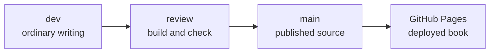

# P2-14.2 브랜치(branch), 커밋(commit), 문서 재현성

P2-14.1에서는 Git을 변경 이력 관리 도구로 봤습니다. 이제 이 책의 작성 흐름에 맞춰 브랜치(branch), 커밋(commit), 배포 문서의 재현성을 연결합니다.

이 절은 Git을 깊게 배우기 위한 절이 아닙니다. 학습 문서가 커질 때 왜 `dev`와 `main`을 나누고, 왜 커밋 단위를 조심해야 하는지 이해하는 것이 목표입니다.

## 이 절의 범위

이 절은 브랜치의 내부 구현, 복잡한 병합 전략, 충돌 해결, 리베이스(rebase)를 다루지 않습니다. GitHub Pages의 세부 설정도 깊게 다루지 않습니다.

여기서는 다음 질문에 답합니다.

- 브랜치(branch)는 왜 필요한가?
- `dev`와 `main`을 나누는 이유는 무엇인가?
- 커밋(commit)을 어떻게 나누어야 문서 재현성이 좋아지는가?
- 배포되는 문서와 작성 중 문서를 왜 구분해야 하는가?
- 원고, 코드, 이미지, 근거 메모를 함께 관리할 때 무엇을 확인해야 하는가?

## 이 절의 목표

- 브랜치를 “작업 흐름을 분리하는 이름 붙은 이력”으로 설명할 수 있습니다.
- 이 책에서 `dev`는 작성 브랜치, `main`은 배포 브랜치라는 운영 기준을 설명할 수 있습니다.
- 커밋 단위를 문서 재현성 관점에서 나눌 수 있습니다.
- 배포 전 확인해야 할 파일 관계를 설명할 수 있습니다.
- GitHub Pages 같은 정적 배포 흐름에서 `main` 반영이 갖는 의미를 설명할 수 있습니다.

## 브랜치는 작업 흐름을 분리한다

Git 공식 책은 브랜치를 커밋을 가리키는 가벼운 포인터로 설명합니다. 입문 단계에서는 이 내부 표현을 모두 외울 필요는 없습니다. 먼저 브랜치를 다음처럼 이해하면 충분합니다.

> 브랜치(branch)는 같은 프로젝트 안에서 작업 흐름을 분리해 진행하기 위한 이름 붙은 이력입니다.

문서 프로젝트에서는 다음 상황에서 브랜치가 필요합니다.

- 작성 중인 원고와 배포 중인 원고를 구분해야 한다.
- 실험적인 목차 변경을 배포본에 바로 반영하지 않아야 한다.
- 이미지, 코드, 문서 구조가 함께 바뀌는 동안 중간 상태가 공개되지 않아야 한다.
- 배포 실패가 생겼을 때 어느 변경이 원인인지 추적해야 한다.

브랜치는 단순히 개발자 편의를 위한 기능이 아니라, 독자에게 공개되는 문서의 안정성을 지키는 장치입니다.

## 이 책의 기본 흐름은 `dev`에서 쓰고 `main`에서 배포한다

이 저장소의 기본 운영 기준은 다음과 같습니다.

`dev`는 일반 작성과 편집을 위한 브랜치입니다. 원고를 추가하고, 예제 코드를 만들고, 차트를 수정하고, 근거 메모를 정리하는 작업은 기본적으로 `dev`에서 진행합니다.

`main`은 배포 브랜치입니다. 이 프로젝트에서는 `main`에 반영되는 일이 곧 배포 실행으로 이어질 수 있습니다. 따라서 `main`으로 옮기는 작업은 단순 저장이 아니라 공개 문서를 갱신하는 행위로 봅니다.

## 커밋은 배포 가능한 설명 단위가 되어야 한다

문서 프로젝트에서 좋은 커밋은 “파일이 바뀌었다”보다 “하나의 설명 단위가 완성되었다”에 가깝습니다.

예를 들어 P2-13.3을 작성한다면 다음 파일들이 함께 바뀔 수 있습니다.

| 파일 종류 | 예시 | 함께 봐야 하는 이유 |
| --- | --- | --- |
| 원고 | `section-03.md` | 독자가 읽는 본문 |
| 이미지 생성 코드 | `p2_13_3_compare_and_save.py` | 출력 이미지를 다시 만들 수 있는 원본 |
| 이미지 | `subplot-loss-accuracy.png` | 본문에 삽입되는 결과 |
| 근거 메모 | `section-p2-13-3-evidence-analysis.md` | 설명의 근거와 범위 판단 |
| 목차 | `mkdocs.yml` | 배포 문서에 노출되는 경로 |

이 파일들이 서로 연결되어 있다면 한 커밋에 묶는 것이 자연스럽습니다. 반대로 같은 시점에 CSS 레이아웃도 고쳤다면, 그것은 별도 커밋으로 나누는 편이 이력을 읽기 쉽습니다.

## 문서 재현성은 코드 재현성보다 넓다

소프트웨어에서 재현성(reproducibility)은 같은 코드와 환경에서 같은 결과를 다시 얻는 능력으로 자주 설명됩니다. 이 책에서는 문서 재현성을 조금 더 넓게 봅니다.

문서 재현성은 다음 질문에 답할 수 있어야 합니다.

- 이 설명은 어떤 근거를 바탕으로 작성되었는가?
- 본문에 들어간 차트는 어떤 코드로 만들었는가?
- 예제 코드는 어떤 패키지 버전을 전제로 하는가?
- 배포 목차에는 어떤 시점에 들어갔는가?
- 나중에 오류를 발견하면 어느 커밋에서 수정해야 하는가?

따라서 문서 재현성은 원고만의 문제가 아닙니다. 원고, 코드, 이미지, 근거, 배포 설정이 함께 맞아야 합니다.

## 배포 전에는 연결 관계를 확인한다

배포 전에 최소한 다음 연결을 확인합니다.

| 확인 대상 | 확인 질문 |
| --- | --- |
| Markdown 본문 | 이미지와 내부 링크가 실제 파일을 가리키는가 |
| `mkdocs.yml` | 새 문서가 nav에 연결되었는가 |
| 예제 코드 | 본문 코드와 생성 스크립트가 서로 어긋나지 않는가 |
| 이미지 | 잘림, 겹침, 오해가 없는가 |
| 근거 메모 | 본문 주장과 출처가 실제로 연결되는가 |
| 빌드 | `mkdocs build`가 통과하는가 |

이 확인을 하지 않으면 `main`에 반영된 뒤 배포 페이지에서 링크가 깨지거나, 이미지가 누락되거나, 설명과 예제가 서로 달라질 수 있습니다.

## `main` 반영은 별도 지시가 필요하다

이 저장소에서는 일반 작성 중에 `main`으로 바로 반영하지 않습니다. `main` 반영은 배포 실행으로 간주하기 때문입니다.

따라서 다음 표현이 있을 때만 `main` 반영을 진행합니다.

- `메인 배포`
- `main에 반영`
- `배포 페이지 갱신`
- `main으로 푸시`

반대로 `작성`, `패치`, `수정`, `커밋`만 요청된 경우에는 기본적으로 `dev`에서 작업합니다.

## 이 절에서 기억할 관점

- 브랜치는 작업 흐름을 분리하는 이름 붙은 이력입니다.
- 이 책에서는 `dev`가 작성 브랜치이고, `main`이 배포 브랜치입니다.
- 커밋은 파일 묶음이 아니라 의미 있는 변경 묶음이어야 합니다.
- 문서 재현성은 원고, 코드, 이미지, 근거 메모, 배포 목차가 함께 맞아야 생깁니다.
- `main` 반영은 공개 배포로 이어질 수 있으므로 별도 지시가 필요합니다.

## 체크리스트

- `dev`와 `main`의 역할 차이를 설명할 수 있는가?
- 브랜치를 작업 흐름 분리 장치로 설명할 수 있는가?
- 한 커밋에 들어갈 파일을 변경 목적 기준으로 고를 수 있는가?
- 문서 재현성이 원고만의 문제가 아니라는 점을 설명할 수 있는가?
- 배포 전 `mkdocs.yml`, 이미지, 근거 메모, 빌드를 함께 확인해야 하는 이유를 말할 수 있는가?

## 출처와 참고 자료

- Scott Chacon and Ben Straub, `Pro Git 2nd Edition: Branches in a Nutshell`, Git documentation, 확인 날짜: 2026-06-25. [https://git-scm.com/book/en/v2/Git-Branching-Branches-in-a-Nutshell](https://git-scm.com/book/en/v2/Git-Branching-Branches-in-a-Nutshell){: target="_blank" rel="noopener noreferrer" }
- Git project, `git-branch Documentation`, 확인 날짜: 2026-06-25. [https://git-scm.com/docs/git-branch](https://git-scm.com/docs/git-branch){: target="_blank" rel="noopener noreferrer" }
- GitHub Docs, `What is GitHub Pages?`, 확인 날짜: 2026-06-25. [https://docs.github.com/en/pages/getting-started-with-github-pages/what-is-github-pages](https://docs.github.com/en/pages/getting-started-with-github-pages/what-is-github-pages){: target="_blank" rel="noopener noreferrer" }
