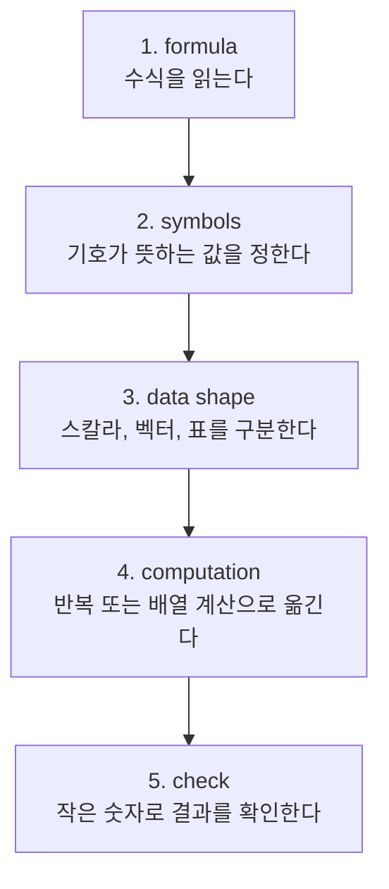

# P2-15.1 수식을 코드로 옮기는 작은 절차

Part 2에서는 수식, Python, NumPy, Pandas, Matplotlib을 따로 봤습니다. 이제 이 흐름을 하나로 묶습니다. 목표는 어려운 수식을 증명하는 것이 아니라, 간단한 수식을 코드로 옮기고 결과를 확인하는 절차를 갖는 것입니다.

머신러닝을 공부하면 손실 함수(loss function), 평균(mean), 분산(variance), 선형 결합(linear combination) 같은 수식이 계속 나옵니다. 이때 수식을 보자마자 막히지 않으려면 “기호를 계산 절차로 바꾸는 습관”이 필요합니다.

## 이 절의 범위

이 절은 수식 변환의 작은 절차를 다룹니다. 복잡한 증명, 최적화 알고리즘 구현, scikit-learn 모델 학습은 다루지 않습니다.

여기서는 다음 질문에 답합니다.

- 수식을 코드로 옮길 때 무엇을 먼저 확인해야 하는가?
- 변수, 데이터 묶음, 반복 계산을 어떻게 구분하는가?
- 시그마(sigma)는 코드에서 어떤 반복으로 바뀌는가?
- NumPy 배열(array)은 언제 도움이 되는가?
- 계산 결과를 표나 그래프로 확인하는 이유는 무엇인가?

## 이 절의 목표

- 수식의 변수와 데이터 묶음을 먼저 구분할 수 있습니다.
- 시그마 합산을 Python 반복문 또는 NumPy 계산으로 옮길 수 있습니다.
- 평균 제곱 오차(mean squared error)를 작은 코드로 계산할 수 있습니다.
- 코드 결과를 숫자, 표, 그래프로 확인하는 흐름을 설명할 수 있습니다.
- Part 3의 머신러닝 수식을 읽기 위한 최소 절차를 가질 수 있습니다.

## 수식을 코드로 옮기는 기본 순서

수식을 코드로 옮길 때는 바로 코드를 쓰기보다 다음 순서로 읽습니다.



핵심은 수식을 한 번에 코드로 바꾸지 않는 것입니다. 먼저 기호가 무엇을 가리키는지 정하고, 값이 하나인지 묶음인지 확인한 뒤 계산합니다.

## 예제로 평균 제곱 오차를 읽어 보기

평균 제곱 오차(mean squared error, MSE)는 예측값과 실제값의 차이를 제곱해 평균낸 값입니다.

\[
\mathrm{MSE} = \frac{1}{n}\sum_{i=1}^{n}(y_i - \hat{y}_i)^2
\]

처음 보면 복잡해 보이지만, 기호를 나누면 다음과 같습니다.

| 기호 | 의미 |
| --- | --- |
| \(n\) | 데이터 개수 |
| \(y_i\) | i번째 실제값 |
| \(\hat{y}_i\) | i번째 예측값 |
| \(y_i - \hat{y}_i\) | i번째 오차 |
| \((y_i - \hat{y}_i)^2\) | 오차를 제곱한 값 |
| \(\sum\) | 모든 데이터에 대해 더한다 |
| \(\frac{1}{n}\) | 더한 값을 데이터 개수로 나누어 평균낸다 |

이 수식은 “각 샘플의 오차를 계산하고, 제곱하고, 모두 더한 뒤, 개수로 나눈다”로 읽을 수 있습니다.

## 먼저 작은 Python 반복문으로 옮긴다

처음에는 NumPy로 바로 줄이지 말고, 반복문으로 계산 흐름을 확인하는 것이 좋습니다.

```python
actual = [3.0, 5.0, 7.0]
predicted = [2.5, 5.5, 8.0]

squared_errors = []

for y, y_hat in zip(actual, predicted):
    error = y - y_hat
    squared_errors.append(error ** 2)

mse = sum(squared_errors) / len(squared_errors)
print(mse)
```

이 코드는 수식의 각 부분을 거의 그대로 따라갑니다.

| 수식의 부분 | 코드의 부분 |
| --- | --- |
| \(y_i\), \(\hat{y}_i\) | `y`, `y_hat` |
| \(y_i - \hat{y}_i\) | `error = y - y_hat` |
| \((y_i - \hat{y}_i)^2\) | `error ** 2` |
| \(\sum\) | `sum(squared_errors)` |
| \(\frac{1}{n}\) | `/ len(squared_errors)` |

이 단계는 짧고 단순하지만 중요합니다. 수식이 어떤 계산 절차인지 손으로 확인하게 해 줍니다.

## 그다음 NumPy로 같은 계산을 줄인다

계산 흐름을 이해한 뒤에는 NumPy 배열(array)을 사용해 더 짧게 쓸 수 있습니다.

```python
import numpy as np

actual = np.array([3.0, 5.0, 7.0])
predicted = np.array([2.5, 5.5, 8.0])

errors = actual - predicted
squared_errors = errors ** 2
mse = np.mean(squared_errors)

print(mse)
```

NumPy에서는 배열끼리 빼면 같은 위치의 값끼리 계산됩니다. 이 방식은 P2-11장에서 본 벡터화(vectorization)와 연결됩니다.

다만 NumPy 코드가 짧다고 해서 처음부터 더 이해하기 쉬운 것은 아닙니다. 입문 단계에서는 “반복문으로 의미를 확인하고, NumPy로 표현을 줄인다”는 순서가 안전합니다.

## 결과를 숫자 하나로만 보지 않는다

MSE는 최종적으로 숫자 하나가 됩니다. 하지만 계산 과정을 확인할 때는 중간값도 함께 보는 것이 좋습니다.

```python
print(errors)
print(squared_errors)
print(mse)
```

출력이 다음과 비슷하다면, 각 단계의 의미를 확인할 수 있습니다.

```text
[ 0.5 -0.5 -1. ]
[0.25 0.25 1.  ]
0.5
```

오차(error)는 방향을 가집니다. 실제값보다 작게 예측했는지, 크게 예측했는지에 따라 부호가 달라집니다. 하지만 제곱 오차(squared error)는 음수가 되지 않습니다. 그래서 MSE는 오차의 크기를 평균적으로 보는 지표가 됩니다.

## 그래프로도 확인할 수 있다

숫자만 보면 어떤 샘플에서 오차가 큰지 바로 보이지 않을 수 있습니다. Matplotlib으로 실제값과 예측값을 나란히 그리면 오차가 어디에서 커지는지 더 쉽게 볼 수 있습니다.

```python
import matplotlib.pyplot as plt

index = np.arange(len(actual))

fig, ax = plt.subplots()
ax.plot(index, actual, marker="o", label="actual")
ax.plot(index, predicted, marker="o", label="predicted")
ax.set_xlabel("sample index")
ax.set_ylabel("value")
ax.set_title("Actual and predicted values")
ax.legend()
plt.show()
```

이 그래프는 MSE를 대신 계산하지 않습니다. 대신 숫자 하나로 압축되기 전의 차이를 눈으로 확인하게 도와줍니다.

## 이 절에서 기억할 관점

- 수식을 코드로 옮길 때는 기호, 데이터 모양, 계산 절차를 먼저 나눕니다.
- 시그마는 대개 반복 계산 또는 배열 계산으로 옮길 수 있습니다.
- 처음에는 반복문으로 의미를 확인하고, 그다음 NumPy로 줄이는 순서가 안전합니다.
- 최종 숫자뿐 아니라 중간값도 확인해야 계산을 이해할 수 있습니다.
- 그래프는 수식 결과를 해석하는 보조 도구입니다.

## 체크리스트

- MSE 수식에서 \(y_i\), \(\hat{y}_i\), \(n\), \(\sum\)이 무엇을 뜻하는지 설명할 수 있는가?
- 같은 계산을 Python 반복문과 NumPy 배열 계산으로 각각 쓸 수 있는가?
- `errors`, `squared_errors`, `mse`의 차이를 설명할 수 있는가?
- 최종 결과만 보지 않고 중간값을 확인해야 하는 이유를 설명할 수 있는가?
- 그래프가 계산을 대신하지 않고 해석을 돕는다는 점을 설명할 수 있는가?

## 출처와 참고 자료

- Python Software Foundation, `An Informal Introduction to Python`, Python documentation, 확인 날짜: 2026-06-25. [https://docs.python.org/3/tutorial/introduction.html](https://docs.python.org/3/tutorial/introduction.html){: target="_blank" rel="noopener noreferrer" }
- NumPy Developers, `NumPy: the absolute basics for beginners`, NumPy documentation, 확인 날짜: 2026-06-25. [https://numpy.org/doc/stable/user/absolute_beginners.html](https://numpy.org/doc/stable/user/absolute_beginners.html){: target="_blank" rel="noopener noreferrer" }
- Matplotlib Developers, `Quick start guide`, Matplotlib documentation, 확인 날짜: 2026-06-25. [https://matplotlib.org/stable/users/explain/quick_start.html](https://matplotlib.org/stable/users/explain/quick_start.html){: target="_blank" rel="noopener noreferrer" }
