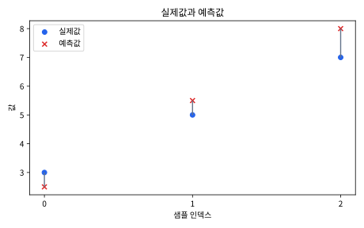

# P2-15.1 수식을 코드로 옮기는 작은 절차

> Section ID: `P2-15.1`
> Version: `v2026.09.15`

## 기호와 계산 순서

수식의 기호가 입력값 하나인지 여러 값의 묶음인지 구분하고, 각 값에 적용할 계산과 전체를 합칠 계산을 나눕니다.

예를 들어 예측값 세 개의 오차를 요약하려면 먼저 실제값과 예측값을 같은 샘플끼리 짝지어야 합니다. 그다음 차이·제곱은 샘플마다 계산하고, 합·평균은 샘플 전체에 걸쳐 계산합니다. 수식이 압축한 이 순서를 코드에서 다시 드러내면 잘못 연결된 값이나 빠진 계산을 찾을 수 있습니다.

```mermaid
--8<-- "assets/part-02/chapter-15/formula-to-code-flow-ko.mmd"
```

## 평균 제곱 오차

평균 제곱 오차(mean squared error, MSE)는 예측값과 실제값의 차이를 제곱해 평균낸 값입니다.

\[
\mathrm{MSE} = \frac{1}{n}\sum_{i=1}^{n}(y_i - \hat{y}_i)^2
\]

각 기호는 다음 값을 가리킵니다.

| 기호 | 의미 |
| --- | --- |
| \(n\) | 데이터 개수 |
| \(y_i\) | i번째 실제값 |
| \(\hat{y}_i\) | i번째 예측값 |
| \(y_i - \hat{y}_i\) | i번째 오차 |
| \((y_i - \hat{y}_i)^2\) | 오차를 제곱한 값 |
| \(\sum\) | 모든 데이터에 대해 더한다 |
| \(\frac{1}{n}\) | 더한 값을 데이터 개수로 나누어 평균낸다 |

이 수식은 “각 샘플의 오차를 계산하고, 제곱하고, 모두 더한 뒤, 개수로 나눈다”로 읽을 수 있습니다.

여기서는 샘플마다 실제값과 예측값이 하나씩 있고, 모든 샘플에 같은 비중을 줍니다. \(n\)은 특징 수가 아니라 비교하는 샘플 쌍의 수이며 0보다 커야 합니다. 수식의 첫 샘플 \(i=1\)은 Python에서 인덱스 0에 해당합니다. `y_hat`의 `hat`은 예측값 위의 모자 기호 \(\hat y\)를 이름으로 옮긴 것입니다.

## 반복문 계산

실제값 `[3.0, 5.0, 7.0]`과 예측값 `[2.5, 5.5, 8.0]`을 같은 위치끼리 짝짓습니다. 오차는 `[0.5, -0.5, -1.0]`, 제곱 오차는 `[0.25, 0.25, 1.0]`이고, 합 1.5를 3으로 나누면 MSE는 0.5입니다.

```python
actual = [3.0, 5.0, 7.0]
predicted = [2.5, 5.5, 8.0]

if len(actual) != len(predicted) or not actual:
    raise ValueError("Use equally sized, non-empty lists.")

squared_errors = []

for y, y_hat in zip(actual, predicted):
    error = y - y_hat
    squared_errors.append(error ** 2)

mse = sum(squared_errors) / len(squared_errors)
print(mse)
```

이 코드는 수식의 각 부분을 거의 그대로 따라갑니다.

| 수식의 부분 | 코드의 부분 |
| --- | --- |
| \(y_i\), \(\hat{y}_i\) | `y`, `y_hat` |
| \(y_i - \hat{y}_i\) | `error = y - y_hat` |
| \((y_i - \hat{y}_i)^2\) | `error ** 2` |
| \(\sum\) | `sum(squared_errors)` |
| \(\frac{1}{n}\) | `/ len(squared_errors)` |

두 목록은 같은 샘플 순서와 같은 길이를 가져야 하며 비어 있으면 안 됩니다. `zip`은 기본적으로 짧은 목록 길이까지만 짝짓기 때문에 길이가 다르면 일부 값이 계산에서 빠질 수 있습니다.

위 `if`는 길이 불일치나 빈 목록을 만나면 계산을 멈춥니다. 예측 목록에서 8.0을 지워 보면 `ValueError`가 발생합니다. 이 검사를 빼면 첫 두 쌍만으로 MSE 0.25가 나와, 누락 때문에 오히려 좋아진 결과처럼 보입니다. 이 실습의 입력은 유한한 실수 목록으로 가정합니다.

## NumPy 배열 계산

NumPy 배열에서도 같은 입력으로 오차·제곱·평균을 계산하면 0.5가 나옵니다.

```python
import numpy as np

actual = np.array([3.0, 5.0, 7.0])
predicted = np.array([2.5, 5.5, 8.0])

if actual.ndim != 1 or actual.shape != predicted.shape or actual.size == 0:
    raise ValueError("Use equally shaped, non-empty 1-D arrays.")
if not (np.isfinite(actual).all() and np.isfinite(predicted).all()):
    raise ValueError("Use finite values.")

errors = actual - predicted
squared_errors = errors ** 2
mse = np.mean(squared_errors)

print(mse)
```

두 배열이 모두 `(3,)`이므로 같은 위치의 값끼리 뺍니다. 같은 연산을 배열 전체에 적용하는 벡터화(vectorization) 표현입니다.

`ndim`은 축 수, `shape`는 각 축의 길이, `size`는 전체 원소 수입니다. `np.isfinite`는 각 값이 NaN이나 무한대가 아닌지 검사하고, `.all()`은 모든 원소가 조건을 만족하는지 확인합니다. 코드가 검사하지 못하는 샘플의 대응 순서는 입력을 만든 사람이 확인해야 합니다.

## 오차와 제곱 오차

MSE는 최종적으로 숫자 하나가 됩니다. 앞의 NumPy 블록을 실행한 같은 세션에서 중간값을 출력합니다.

```python
print(errors)
print(squared_errors)
print(mse)
```

출력은 다음과 같습니다.

```text
[ 0.5 -0.5 -1. ]
[0.25 0.25 1.  ]
0.5
```

오차(error)는 방향을 가집니다. 실제값보다 작게 예측했는지, 크게 예측했는지에 따라 부호가 달라집니다. 하지만 제곱 오차(squared error)는 음수가 되지 않습니다. 그래서 MSE는 오차의 크기를 평균적으로 보는 지표가 됩니다.

다만 MSE는 원래 오차가 아니라 **제곱 오차의 평균**입니다. 실제값의 단위가 점수라면 MSE의 단위는 점수²입니다. MSE에 제곱근을 취한 RMSE는 원래 단위로 돌아오며, 이 예에서는 \(\sqrt{0.5}\approx0.707\)입니다. 오차 크기가 두 배이면 제곱 오차는 네 배가 되므로 큰 오차의 영향이 커집니다.

`np.mean(errors ** 2)`와 `np.mean(errors) ** 2`도 다릅니다. 앞의 값은 0.5지만 뒤의 값은 약 0.111입니다. 뒤 식은 부호가 다른 오차를 먼저 상쇄한 뒤 제곱하므로 MSE가 아닙니다.

## 샘플별 차이

같은 샘플 위치에서 실제값과 예측값의 세로 간격을 비교합니다. 첫 두 샘플의 간격은 0.5이고 마지막 샘플은 1.0입니다. 샘플 사이가 연속적으로 변한다는 인상을 피하려고 점과 샘플별 세로선만 그립니다. 다음 코드는 앞의 NumPy 블록에서 만든 `actual`, `predicted`, `np`를 사용합니다.

```python
import matplotlib.pyplot as plt

index = np.arange(len(actual))

fig, ax = plt.subplots(figsize=(6.4, 4.0))
ax.scatter(index, actual, marker="o", color="#2563eb", label="actual")
ax.scatter(index, predicted, marker="x", color="#dc2626", label="predicted")
ax.vlines(index, predicted, actual, color="#64748b", linewidth=1.4)
ax.set_xticks(index)
ax.set_xlabel("sample index")
ax.set_ylabel("value")
ax.set_title("Actual and predicted values")
ax.legend()
fig.tight_layout()
plt.show()
```

출력 이미지는 다음처럼 실제값과 예측값의 간격을 샘플별로 보여 줍니다.



반복문 계산, NumPy 계산, 그래프 저장을 한 번에 실행할 수 있는 기준 소스입니다. 본문 코드의 영문 라벨은 배포 그림에서 각 언어로 바꾸며, 점의 위치와 계산값은 같습니다.

[MSE 계산과 그래프 생성 코드](../../../assets/part-02/chapter-15/p2_15_1_formula_to_code_mse.py)

NumPy와 Matplotlib이 설치된 Python 환경에서 저장소 루트를 기준으로 실행합니다. 배포 그림과 같은 글꼴을 쓰려면 `Noto Sans CJK JP`가 필요하며, 다른 글꼴은 `--font-family`로 지정할 수 있습니다.

```bash
python docs/assets/part-02/chapter-15/p2_15_1_formula_to_code_mse.py --output-dir .tmp/p2-15-mse
```

`loop mse`, `errors`, `squared errors`, `numpy mse`를 출력하고 세 언어 SVG를 지정한 폴더에 저장합니다. 기본 마지막 예측값은 8.0입니다. `--last-prediction 7` 또는 `--last-prediction 9`를 추가하면 다음 사례의 수치와 점의 변화를 재현합니다.

이 그래프는 MSE를 대신 계산하지 않습니다. 대신 숫자 하나로 압축되기 전의 차이를 눈으로 확인하게 도와줍니다.

## 사례 1. 마지막 예측값만 바꾸기

마지막 예측값을 8.0에서 실제값과 같은 7.0으로 바꾸면 제곱 오차가 `[0.25, 0.25, 0.0]`이 됩니다. MSE는 `0.5 / 3`, 약 0.167로 줄고 그래프의 마지막 두 점은 겹칩니다.

반대로 마지막 예측값을 9.0으로 바꾸면 마지막 오차는 −2, 제곱 오차는 4입니다. MSE는 `(0.25 + 0.25 + 4) / 3 = 1.5`가 됩니다. 오차 크기가 1에서 2로 두 배가 되면 해당 샘플의 제곱 오차는 1에서 4로 네 배가 됩니다.

반복문과 NumPy 코드의 입력을 각각 바꾸어 실행하면 같은 결과가 나와야 합니다. 결과가 다르면 입력 순서·길이·배열 모양과 평균을 낸 축을 확인합니다. 특히 `(3,)` 배열을 `(3, 1)`로 바꾸면 브로드캐스팅으로 모든 조합의 차이를 계산할 수 있으므로, 같은 샘플끼리 비교하는 원래 MSE와 달라집니다.

## 실행되지만 다른 계산인 경우

위 예제의 입력 검사 없이 `actual.reshape(3, 1) - predicted`를 계산하면 결과 모양은 `(3, 3)`입니다. 실제값 하나를 세 예측값 모두와 비교해 차이가 아홉 개 생깁니다. 첫 행은 `[0.5, -2.5, -5.0]`으로, 원래 비교 대상이 아닌 샘플의 예측값까지 섞입니다.

| 계산 | 평균내는 대상 | 결과 |
| --- | --- | ---: |
| 같은 위치의 세 쌍 | 제곱 오차 3개 | 0.5 |
| `(3, 1)`과 `(3,)`의 뺄셈 | 모든 조합의 제곱 오차 9개 | 약 7.833 |
| 예측 순서만 뒤집기 | 잘못 짝지은 세 쌍 | 약 15.167 |

모양 검사로 두 번째 오류는 막을 수 있지만, 같은 모양인 세 번째 오류는 막을 수 없습니다. 배열의 모양과 함께 학생 ID처럼 샘플을 식별하는 기준도 확인해야 합니다. `np.mean`은 축을 지정하지 않으면 모든 원소를 평균내므로 잘못 늘어난 배열도 숫자 하나로 압축합니다.

실제값과 예측값에 모두 10을 더했을 때 MSE가 바뀌는지 예상한 뒤 실행해 봅니다. 차이는 그대로여서 0.5가 유지됩니다. 두 배열을 모두 10배로 바꾸면 차이도 10배, 제곱 오차는 100배가 되어 MSE는 50입니다. 같은 단위·대상·계산 규칙으로 비교해야 값의 크기를 해석할 수 있습니다.

## 체크리스트

- 수식을 코드로 옮길 때 기호, 데이터 모양, 계산 절차를 먼저 나눠 읽을 수 있는가?
- MSE 수식에서 \(y_i\), \(\hat{y}_i\), \(n\), \(\sum\)이 무엇을 뜻하는지 설명할 수 있는가?
- 시그마를 반복 계산 또는 배열 계산으로 옮길 수 있다는 점을 설명할 수 있는가?
- 같은 계산을 Python 반복문과 NumPy 배열 계산으로 각각 쓸 수 있는가?
- 실제값과 예측값의 순서·길이·배열 모양을 맞춰야 하는 이유를 설명할 수 있는가?
- `errors`, `squared_errors`, `mse`의 차이를 설명할 수 있는가?
- 최종 숫자뿐 아니라 중간값도 확인해야 계산을 이해할 수 있다는 점을 설명할 수 있는가?
- 그래프가 계산을 대신하지 않고 수식 결과 해석을 돕는 보조 도구라는 점을 설명할 수 있는가?
- 제곱의 평균과 평균의 제곱, MSE와 RMSE의 단위를 구분할 수 있는가?
- 모양이 같아도 샘플 순서가 틀리면 다른 결과가 나온다는 점을 설명할 수 있는가?

## 출처와 참고 자료

- [Python Software Foundation, Built-in Functions: zip](https://docs.python.org/3/library/functions.html#zip){: target="_blank" rel="noopener noreferrer" } 확인 날짜: 2026-09-15. 짝짓기와 짧은 입력에서 멈추는 기본 동작.
- [NumPy Developers, numpy.mean](https://numpy.org/doc/stable/reference/generated/numpy.mean.html){: target="_blank" rel="noopener noreferrer" } 확인 날짜: 2026-09-15. 축 미지정 시 전체 원소 평균.
- [NumPy Developers, Broadcasting](https://numpy.org/doc/stable/user/basics.broadcasting.html){: target="_blank" rel="noopener noreferrer" } 확인 날짜: 2026-09-15. 모양이 다른 배열의 연산 규칙.
- [scikit-learn developers, Regression metrics](https://scikit-learn.org/stable/modules/model_evaluation.html#regression-metrics){: target="_blank" rel="noopener noreferrer" } 확인 날짜: 2026-09-15. MSE·RMSE·MAE의 정의와 해석.
- [Matplotlib Developers, Axes.scatter](https://matplotlib.org/stable/api/_as_gen/matplotlib.axes.Axes.scatter.html){: target="_blank" rel="noopener noreferrer" } 확인 날짜: 2026-09-15. 샘플별 실제값과 예측값 표시.
