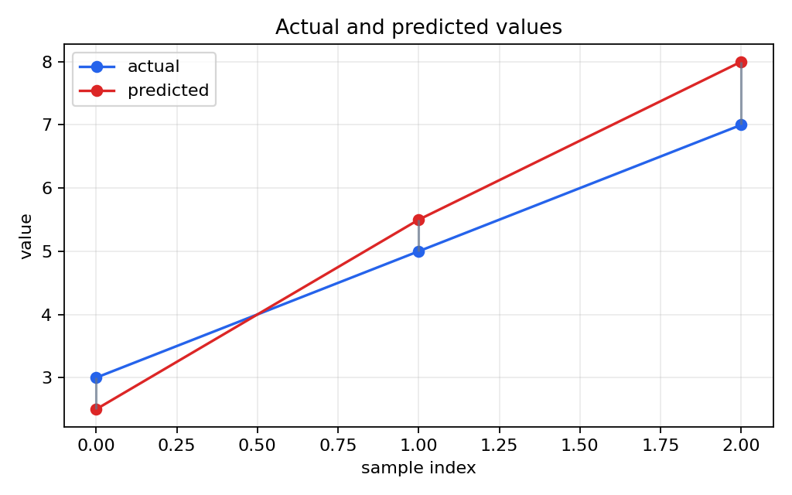

# P2-15.1 수식을 코드로 옮기는 작은 절차

> Section ID: `P2-15.1`
> Version: `v2026.07.31`

Part 2에서는 수식, Python, NumPy, Pandas, Matplotlib을 따로 봤습니다. 이제 이 흐름을 하나로 묶습니다. 목표는 어려운 수식을 증명하는 것이 아니라, 간단한 수식을 코드로 옮기고 결과를 확인하는 절차를 갖는 것입니다.

머신러닝을 공부하면 손실 함수(loss function), 평균(mean), 분산(variance), 선형 결합(linear combination) 같은 수식이 계속 나옵니다. 이때 수식을 보자마자 막히지 않으려면 “기호를 계산 절차로 바꾸는 습관”이 필요합니다.

## 앞 장 개념을 다시 묶는 자리

이 절은 Part 2에서 따로 배운 개념을 하나의 예제로 다시 묶는 자리입니다. 새 이론을 크게 추가하기보다, 앞 장에서 본 대표 개념이 실제로 함께 움직일 때 무엇을 확인해야 하는지 보여 줍니다.

| 앞 장에서 가져오는 개념 | 이 절에서 다시 쓰는 방식 |
| --- | --- |
| 변수(variable), 값(value), 타입(type) | 수식 기호가 코드 변수와 어떤 값으로 대응되는지 먼저 정합니다. |
| 리스트(list), 반복문(loop) | 시그마 합산을 샘플별 반복 계산으로 풀어 읽습니다. |
| NumPy 배열(array), 벡터화(vectorization) | 같은 계산을 더 짧은 배열 연산으로 다시 표현합니다. |
| 표와 그래프 | 최종 숫자 하나만 보지 않고 중간값과 경향을 함께 확인합니다. |
| Python 작업 흐름 | 입력, 계산, 출력, 점검의 순서로 코드를 읽고 확인합니다. |

따라서 이 절의 핵심은 `새 공식 암기`가 아니라 `이미 본 도구를 한 문제에 연결하는 절차`입니다.

## 핵심 기준: 수식을 코드로 옮기는 작은 절차

- 수식의 변수와 데이터 묶음을 먼저 구분할 수 있습니다.
- 시그마 합산을 Python 반복문 또는 NumPy 계산으로 옮길 수 있습니다.
- 평균 제곱 오차(mean squared error)를 작은 코드로 계산할 수 있습니다.
- 코드 결과를 숫자, 표, 그래프로 확인하는 흐름을 설명할 수 있습니다.
- Part 3의 머신러닝 수식을 읽기 위한 최소 절차를 가질 수 있습니다.

## 이번 절에서 먼저 붙잡을 연결

- 수식의 기호를 코드 변수로 바꾼다.
- 샘플별 반복 계산을 먼저 본다.
- 같은 계산을 NumPy 배열 표현으로 다시 읽는다.
- 최종 숫자, 중간값, 그래프를 함께 확인한다.

## 세 가지 기준

| 기준 | 왜 중요한가 | 이 절에서 필요한 이해 수준 |
| --- | --- | --- |
| 수식을 코드로 옮길 때 무엇부터 보나 | 기호를 바로 코드 문법으로 보지 않고 계산 절차로 나누게 해 줍니다. | 입력, 계산 순서, 출력이 무엇인지 먼저 나눈다고 이해합니다. |
| 왜 반복문과 NumPy 두 방식으로 보나 | 절차 이해와 축약 표현을 구분해 읽게 해 줍니다. | 같은 계산이 표현만 다르게 보일 수 있음을 이해합니다. |
| 결과를 왜 여러 방식으로 확인하나 | 최종 숫자 하나만으로 놓치는 중간 의미를 보완해 줍니다. | 숫자 하나만 보면 놓치는 중간 과정과 경향이 있기 때문이라고 이해합니다. |

## 수식을 코드로 옮기는 기본 순서

수식을 코드로 옮길 때는 바로 코드를 쓰기보다 다음 순서로 읽습니다.

```mermaid
--8<-- "assets/part-02/chapter-15/formula-to-code-flow-ko.mmd"
```

핵심은 수식을 한 번에 코드로 바꾸지 않는 것입니다. 먼저 기호가 무엇을 가리키는지 정하고, 값이 하나인지 묶음인지 확인한 뒤 계산합니다.

## 예제로 평균 제곱 오차를 읽어 보기

평균 제곱 오차(mean squared error, MSE)는 예측값과 실제값의 차이를 제곱해 평균낸 값입니다.

\[
\mathrm{MSE} = \frac{1}{n}\sum_{i=1}^{n}(y_i - \hat{y}_i)^2
\]

처음 보면 복잡해 보이지만, 기호를 나누면 다음과 같습니다.

| 기호 | 의미 |
| --- | --- |
| \(n\) | 데이터 개수 |
| \(y_i\) | i번째 실제값 |
| \(\hat{y}_i\) | i번째 예측값 |
| \(y_i - \hat{y}_i\) | i번째 오차 |
| \((y_i - \hat{y}_i)^2\) | 오차를 제곱한 값 |
| \(\sum\) | 모든 데이터에 대해 더한다 |
| \(\frac{1}{n}\) | 더한 값을 데이터 개수로 나누어 평균낸다 |

이 수식은 “각 샘플의 오차를 계산하고, 제곱하고, 모두 더한 뒤, 개수로 나눈다”로 읽을 수 있습니다.

## 먼저 작은 Python 반복문으로 옮긴다

여기서는 NumPy로 바로 줄이기보다, 반복문으로 계산 흐름을 먼저 확인합니다.

문제 상황:

- 수식을 읽어도 각 기호가 코드의 어떤 반복과 변수로 바뀌는지 바로 연결되지 않을 수 있다

입력(input):

- 실제값 목록 `actual`
- 예측값 목록 `predicted`

기대 출력(output):

- 샘플별 제곱 오차 목록
- 평균 제곱 오차(MSE) 값

확인할 개념:

- 시그마 합산은 반복문이나 배열 계산으로 옮길 수 있다
- 수식을 코드로 바꿀 때는 각 샘플 계산과 전체 평균 계산을 분리해 보는 편이 안전하다
- 반복문 버전은 NumPy 축약 표현보다 계산 의미를 먼저 드러낸다

```python
# 실제값과 예측값의 차이를 오차로 계산하고 손실을 수식에서 코드로 옮기는 예제입니다.
actual = [3.0, 5.0, 7.0]
predicted = [2.5, 5.5, 8.0]

squared_errors = []

for y, y_hat in zip(actual, predicted):
    error = y - y_hat
    squared_errors.append(error ** 2)

mse = sum(squared_errors) / len(squared_errors)
print(mse)
```

이 코드는 수식의 각 부분을 거의 그대로 따라갑니다.

| 수식의 부분 | 코드의 부분 |
| --- | --- |
| \(y_i\), \(\hat{y}_i\) | `y`, `y_hat` |
| \(y_i - \hat{y}_i\) | `error = y - y_hat` |
| \((y_i - \hat{y}_i)^2\) | `error ** 2` |
| \(\sum\) | `sum(squared_errors)` |
| \(\frac{1}{n}\) | `/ len(squared_errors)` |

이 단계는 짧고 단순하지만 중요합니다. 수식이 어떤 계산 절차인지 손으로 확인하게 해 줍니다.

## 그다음 NumPy로 같은 계산을 줄인다

계산 흐름을 이해한 뒤에는 NumPy 배열(array)을 사용해 더 짧게 쓸 수 있습니다.

문제 상황:

- 반복문으로 계산 의미를 이해한 뒤에는 같은 수식을 더 짧은 배열 계산으로 다시 표현할 수 있어야 한다

입력(input):

- 실제값 배열 `actual`
- 예측값 배열 `predicted`

기대 출력(output):

- 오차 배열 `errors`
- 제곱 오차 배열 `squared_errors`
- 평균 제곱 오차 `mse`

확인할 개념:

- NumPy 배열 연산은 시그마 계산을 벡터화된 표현으로 줄여 준다
- 짧은 코드가 되더라도 계산 단계는 반복문 버전과 같은 의미를 유지한다

```python
# 실제값과 예측값의 차이를 오차로 계산하고 손실을 수식에서 코드로 옮기는 예제입니다.
import numpy as np

actual = np.array([3.0, 5.0, 7.0])
predicted = np.array([2.5, 5.5, 8.0])

errors = actual - predicted
squared_errors = errors ** 2
mse = np.mean(squared_errors)

print(mse)
```

NumPy에서는 배열끼리 빼면 같은 위치의 값끼리 계산됩니다. 이 방식은 Part 2 Chapter 11에서 본 벡터화(vectorization)와 연결됩니다.

다만 NumPy 코드가 짧다고 해서 처음부터 더 이해하기 쉬운 것은 아닙니다. 이 절에서는 `반복문으로 의미를 확인하고, NumPy로 표현을 줄인다`는 순서로 수식과 코드를 연결합니다.

## 결과를 숫자 하나로만 보지 않는다

MSE는 최종적으로 숫자 하나가 됩니다. 하지만 계산 과정을 확인할 때는 중간값도 함께 보는 것이 좋습니다.

문제 상황:

- 최종 MSE 값만 보면 어떤 샘플에서 오차가 커졌는지 바로 읽기 어렵다

입력(input):

- 앞에서 계산한 `errors`
- `squared_errors`
- `mse`

출력(output):

- 중간 오차 배열과 최종 평균 제곱 오차 값

확인할 개념:

- 중간값을 같이 출력하면 수식의 각 단계가 실제로 어떤 숫자를 만드는지 확인할 수 있다
- 오차의 부호와 제곱 뒤 값의 차이를 직접 비교할 수 있다

```python
# 실제값과 예측값의 차이를 오차로 계산하고 손실을 수식에서 코드로 옮기는 예제입니다.
print(errors)
print(squared_errors)
print(mse)
```

출력이 다음과 비슷하다면, 각 단계의 의미를 확인할 수 있습니다.

```text
[ 0.5 -0.5 -1. ]
[0.25 0.25 1.  ]
0.5
```

오차(error)는 방향을 가집니다. 실제값보다 작게 예측했는지, 크게 예측했는지에 따라 부호가 달라집니다. 하지만 제곱 오차(squared error)는 음수가 되지 않습니다. 그래서 MSE는 오차의 크기를 평균적으로 보는 지표가 됩니다.

## 그래프로도 확인할 수 있다

숫자만 보면 어떤 샘플에서 오차가 큰지 바로 보이지 않을 수 있습니다. Matplotlib으로 실제값과 예측값을 나란히 그리면 오차가 어디에서 커지는지 더 쉽게 볼 수 있습니다.

문제 상황:

- 수치 출력만으로는 샘플별 차이의 위치와 크기를 한눈에 파악하기 어려울 수 있다

입력(input):

- 실제값 배열 `actual`
- 예측값 배열 `predicted`
- 샘플 인덱스 `index`

출력(output):

- 실제값과 예측값을 비교한 선 그래프

확인할 개념:

- 그래프는 손실 계산을 대신하지 않지만, 오차 분포를 해석하는 보조 도구가 된다
- 같은 숫자 결과라도 시각화하면 어떤 구간에서 차이가 컸는지 더 빨리 읽을 수 있다

```python
# 실제값과 예측값의 차이를 오차로 계산하고 손실을 수식에서 코드로 옮기는 예제입니다.
import matplotlib.pyplot as plt

index = np.arange(len(actual))

fig, ax = plt.subplots()
ax.plot(index, actual, marker="o", label="actual")
ax.plot(index, predicted, marker="o", label="predicted")
ax.set_xlabel("sample index")
ax.set_ylabel("value")
ax.set_title("Actual and predicted values")
ax.legend()
plt.show()
```

출력 이미지는 다음처럼 실제값과 예측값의 간격을 샘플별로 보여 줍니다.



이 절의 반복문 계산, NumPy 계산, 그래프 저장 흐름은 [`p2_15_1_formula_to_code_mse.py`](../../../assets/part-02/chapter-15/p2_15_1_formula_to_code_mse.py)로 한 번에 다시 실행할 수 있습니다. 이 스크립트는 `loop mse`, `errors`, `squared errors`, `numpy mse`를 출력하고, 같은 자산 폴더에 `actual-predicted-mse.png`를 저장합니다.

이 그래프는 MSE를 대신 계산하지 않습니다. 대신 숫자 하나로 압축되기 전의 차이를 눈으로 확인하게 도와줍니다.

## 수식을 코드로 옮기는 작은 절차: 확인할 판단 기준

### 사례 1. 손실 수식을 보고 바로 코드를 쓰지 못하는 이유

학습자가 평균 제곱 오차 수식을 처음 보고 `이걸 Python으로 어떻게 옮기지?`에서 막힌다고 해 보겠습니다. 사람은 식의 모양은 읽어도, `어느 값이 한 개의 숫자인지`, `어느 값이 여러 샘플의 묶음인지`, `시그마가 코드에서 어떤 반복으로 바뀌는지`가 바로 연결되지 않을 수 있습니다.

이때 바로 NumPy 한 줄 코드로 넘어가면 결과는 얻어도 절차는 놓치기 쉽습니다. 먼저 `actual`, `predicted`를 작은 리스트로 두고, 각 샘플 오차를 구하고, 제곱하고, 모두 더한 뒤, 개수로 나누는 과정을 반복문으로 확인하면 수식의 구조가 계산 절차로 바뀝니다.

그다음 NumPy 배열로 같은 계산을 줄이면 `짧은 표현`과 `계산 의미`를 분리해 읽을 수 있습니다. 즉 반복문은 수식을 해석하는 발판이고, NumPy는 그 계산을 더 간결하게 쓰는 표현입니다.

이 사례는 Part 3 이후의 수식 읽기에도 그대로 이어집니다. 중요한 것은 코드를 빨리 쓰는 것이 아니라, 기호를 입력, 반복, 출력의 절차로 바꾸는 감각을 먼저 갖는 일입니다.

## 체크리스트

- 수식을 코드로 옮길 때 기호, 데이터 모양, 계산 절차를 먼저 나눠 읽을 수 있는가?
- MSE 수식에서 \(y_i\), \(\hat{y}_i\), \(n\), \(\sum\)이 무엇을 뜻하는지 설명할 수 있는가?
- 시그마를 반복 계산 또는 배열 계산으로 옮길 수 있다는 점을 설명할 수 있는가?
- 같은 계산을 Python 반복문과 NumPy 배열 계산으로 각각 쓸 수 있는가?
- 반복문으로 의미를 확인하고, 그다음 NumPy로 표현을 줄이는 순서를 설명할 수 있는가?
- `errors`, `squared_errors`, `mse`의 차이를 설명할 수 있는가?
- 최종 숫자뿐 아니라 중간값도 확인해야 계산을 이해할 수 있다는 점을 설명할 수 있는가?
- 그래프가 계산을 대신하지 않고 수식 결과 해석을 돕는 보조 도구라는 점을 설명할 수 있는가?

## 출처와 참고 자료

- Python Software Foundation, `An Informal Introduction to Python`, Python documentation, 확인 날짜: 2026-07-20. [https://docs.python.org/3/tutorial/introduction.html](https://docs.python.org/3/tutorial/introduction.html){: target="_blank" rel="noopener noreferrer" } Python의 숫자, 리스트, 기본 계산 표현을 수식-코드 변환 예제의 기반으로 확인했습니다.
- NumPy Developers, `NumPy: the absolute basics for beginners`, NumPy documentation, 확인 날짜: 2026-07-20. [https://numpy.org/doc/stable/user/absolute_beginners.html](https://numpy.org/doc/stable/user/absolute_beginners.html){: target="_blank" rel="noopener noreferrer" } 배열 생성, 배열 연산, `np.mean`을 이용한 벡터화 계산 설명의 근거입니다.
- Matplotlib Developers, `Quick start guide`, Matplotlib documentation, 확인 날짜: 2026-07-20. [https://matplotlib.org/stable/users/explain/quick_start.html](https://matplotlib.org/stable/users/explain/quick_start.html){: target="_blank" rel="noopener noreferrer" } `Figure`, `Axes`, `plot`, 라벨, 범례를 이용해 계산 결과를 그래프로 확인하는 예제의 기준입니다.
