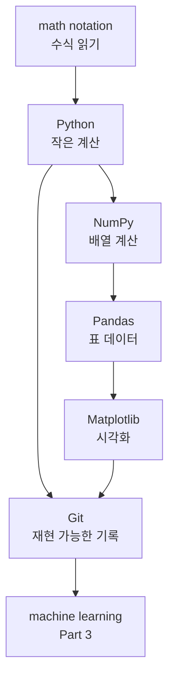

# P2-15.2 Part 3로 넘어가기 전 점검

Part 2는 기초 복구 구간입니다. 모든 수학과 Python을 완벽히 끝냈다는 뜻이 아닙니다. 머신러닝으로 넘어가도 되는 최소한의 읽기 능력과 실습 감각을 확인하는 구간입니다.

Part 3에서는 데이터로부터 규칙을 학습한다는 말을 다룹니다. 그때 필요한 것은 어려운 증명보다, 데이터가 어떤 모양으로 들어가고, 모델이 무엇을 계산하고, 결과를 어떻게 평가하는지 따라갈 수 있는 감각입니다.

## 이 절의 범위

이 절은 Part 2의 최종 점검입니다. 새로운 핵심 개념을 깊게 도입하지 않습니다. scikit-learn 사용법, 모델 학습 API, 평가 지표의 세부 계산은 Part 3에서 다룹니다.

여기서는 다음 질문에 답합니다.

- Part 3로 넘어가기 전에 무엇을 알고 있어야 하는가?
- 부족한 부분이 있어도 넘어가도 되는 기준은 무엇인가?
- 수학, Python, 데이터 도구, Git 중 어떤 부분을 다시 확인해야 하는가?
- 머신러닝 문서를 읽을 때 어떤 단어들이 다시 등장하는가?
- Part 3에서 가장 먼저 주의할 오해는 무엇인가?

## 이 절의 목표

- Part 2에서 복구한 개념을 머신러닝 학습 흐름과 연결할 수 있습니다.
- 수학, Python, NumPy, Pandas, Matplotlib, Git의 최소 역할을 구분할 수 있습니다.
- Part 3에서 만날 `X`, `y`, `fit`, `predict`, `train`, `test` 같은 표현을 낯설지 않게 볼 수 있습니다.
- 완벽히 이해하지 못한 항목과 반드시 다시 확인해야 할 항목을 구분할 수 있습니다.
- 머신러닝 학습을 “모델 이름 외우기”가 아니라 “데이터, 학습, 평가 흐름 읽기”로 시작할 수 있습니다.

## Part 2에서 잡아야 할 최소 지도

Part 2의 흐름은 다음처럼 정리할 수 있습니다.

이 지도에서 중요한 것은 도구 이름이 아닙니다. 각 도구가 어떤 질문에 답하는지입니다.

| 영역 | Part 3에서 필요한 질문 |
| --- | --- |
| 수식 | 이 계산은 무엇을 합치고, 평균내고, 줄이려 하는가 |
| Python | 작은 예제를 직접 실행해 볼 수 있는가 |
| NumPy | 입력과 출력의 배열 모양을 읽을 수 있는가 |
| Pandas | 데이터셋을 행과 열로 볼 수 있는가 |
| Matplotlib | 학습 결과와 데이터 분포를 눈으로 확인할 수 있는가 |
| Git | 원고, 코드, 결과를 다시 추적할 수 있는가 |

## 반드시 다시 확인할 개념

다음 항목은 Part 3에서 매우 자주 다시 나옵니다. 완벽한 증명은 필요 없지만, 용어를 봤을 때 어디로 돌아가야 하는지는 알아야 합니다.

| 개념 | Part 3에서 다시 등장하는 위치 |
| --- | --- |
| 변수(variable), 함수(function) | 모델이 입력을 출력으로 바꾸는 설명 |
| 벡터(vector), 행렬(matrix) | 입력 데이터 `X`, 가중치, 특징 묶음 |
| 평균(mean), 분산(variance) | 데이터 요약, 스케일, 분포 이해 |
| 손실 함수(loss function) | 모델이 무엇을 줄이려 하는지 설명 |
| 경사하강법(gradient descent) | 학습이 값을 조정하는 방식 |
| 표본(sample), 특징(feature), 라벨(label) | 지도학습 데이터 구조 |
| 축(axis), shape | NumPy와 Pandas 데이터 모양 |
| 그래프(plot) | 학습 곡선과 평가 결과 확인 |

이 중 하나가 흐릿해도 Part 3로 넘어갈 수 있습니다. 다만 해당 단어가 나오면 Part 2의 관련 절로 돌아와 다시 확인해야 합니다.

## Part 3에서 바로 만날 표현

scikit-learn 문서는 모델을 estimator라고 부르고, 일반적으로 `fit`으로 데이터를 학습시키고 `predict`로 새 데이터의 결과를 예측하는 흐름을 보여 줍니다. 또한 입력 데이터 `X`는 보통 샘플이 행(row), 특징이 열(column)인 형태로 설명됩니다.

입문 단계에서는 다음 표만 기억해도 충분합니다.

| 표현 | 먼저 읽는 방식 |
| --- | --- |
| `X` | 모델에 넣는 입력 데이터 묶음 |
| `y` | 지도학습에서 맞추려는 정답 또는 라벨 |
| sample | 데이터 한 건, 보통 한 행 |
| feature | 모델이 참고하는 입력 속성, 보통 한 열 |
| `fit` | 데이터로 모델을 학습시키는 동작 |
| `predict` | 학습된 모델로 새 입력의 출력을 계산하는 동작 |
| train data | 모델이 학습할 때 보는 데이터 |
| test data | 학습 이후 성능을 확인하는 데이터 |

여기서 중요한 것은 `fit`과 `predict`를 마법처럼 보지 않는 것입니다. Part 1에서 봤던 학습(learning)과 모델 실행(inference)이 코드 API 형태로 나타난 것입니다.

## 넘어가도 되는 것과 멈춰야 하는 것

Part 3로 넘어가기 전에 모든 내용을 완벽히 외울 필요는 없습니다. 다음처럼 구분합니다.

| 상태 | 판단 |
| --- | --- |
| 수식의 모든 증명을 못 한다 | 넘어가도 된다 |
| Python 문법을 모두 외우지 못한다 | 넘어가도 된다 |
| NumPy의 모든 함수가 낯설다 | 넘어가도 된다 |
| `X`와 `y`가 무엇인지 전혀 구분되지 않는다 | 잠시 멈추고 P2-11, P2-12를 복습한다 |
| 평균, 손실, 오차의 차이가 전혀 구분되지 않는다 | P2-5, P2-6, P2-15.1을 다시 본다 |
| 코드를 어디에서 실행해야 하는지 모른다 | P2-3.4, P2-7, P2-10을 다시 본다 |
| 결과 그래프를 보고 축이 무엇인지 모른다 | P2-13을 다시 본다 |

완벽하지 않아도 됩니다. 하지만 입력, 출력, 데이터 모양, 평가 결과를 전혀 구분할 수 없다면 Part 3가 모델 이름 암기로 흐를 가능성이 큽니다.

## Part 3를 읽는 기준

Part 3에서는 알고리즘 이름보다 다음 질문을 먼저 봅니다.

1. 이 문제는 무엇을 예측하거나 분류하려 하는가?
2. 입력 `X`는 어떤 모양인가?
3. 라벨 `y`는 있는가?
4. 학습 데이터와 평가 데이터는 나뉘어 있는가?
5. 모델은 어떤 손실이나 기준을 줄이려 하는가?
6. 평가 지표(metric)는 무엇을 보고 있는가?
7. 그래프나 표로 결과를 확인할 수 있는가?

이 질문을 유지하면 Part 3의 여러 알고리즘을 서로 다른 이름 목록으로만 보지 않게 됩니다.

## 이 절에서 기억할 관점

- Part 2의 목표는 완전한 수학·프로그래밍 학습이 아니라 머신러닝을 읽을 최소 기반 복구입니다.
- Part 3에서는 모델 이름보다 데이터 모양, 학습 흐름, 평가 기준을 먼저 봐야 합니다.
- `X`, `y`, `fit`, `predict`는 Part 2에서 배운 배열, 표, 함수 실행 흐름과 연결됩니다.
- 이해가 흐릿한 개념은 Part 2로 돌아와 다시 확인하면 됩니다.
- 머신러닝은 수식, 코드, 데이터, 평가가 함께 움직이는 학습 흐름으로 읽어야 합니다.

## 체크리스트

- `X`와 `y`의 차이를 설명할 수 있는가?
- sample과 feature를 행과 열 관점으로 설명할 수 있는가?
- `fit`과 `predict`를 학습과 모델 실행 관점으로 구분할 수 있는가?
- 손실, 오차, 평가 지표가 모두 같은 말이 아님을 설명할 수 있는가?
- Part 3를 읽을 때 모델 이름보다 데이터와 평가 흐름을 먼저 보겠다고 말할 수 있는가?

## 출처와 참고 자료

- scikit-learn developers, `Getting Started`, scikit-learn documentation, 확인 날짜: 2026-06-25. [https://scikit-learn.org/stable/getting_started.html](https://scikit-learn.org/stable/getting_started.html){: target="_blank" rel="noopener noreferrer" }
- scikit-learn developers, `Glossary of Common Terms and API Elements`, scikit-learn documentation, 확인 날짜: 2026-06-25. [https://scikit-learn.org/stable/glossary.html](https://scikit-learn.org/stable/glossary.html){: target="_blank" rel="noopener noreferrer" }
- NumPy Developers, `NumPy: the absolute basics for beginners`, NumPy documentation, 확인 날짜: 2026-06-25. [https://numpy.org/doc/stable/user/absolute_beginners.html](https://numpy.org/doc/stable/user/absolute_beginners.html){: target="_blank" rel="noopener noreferrer" }
