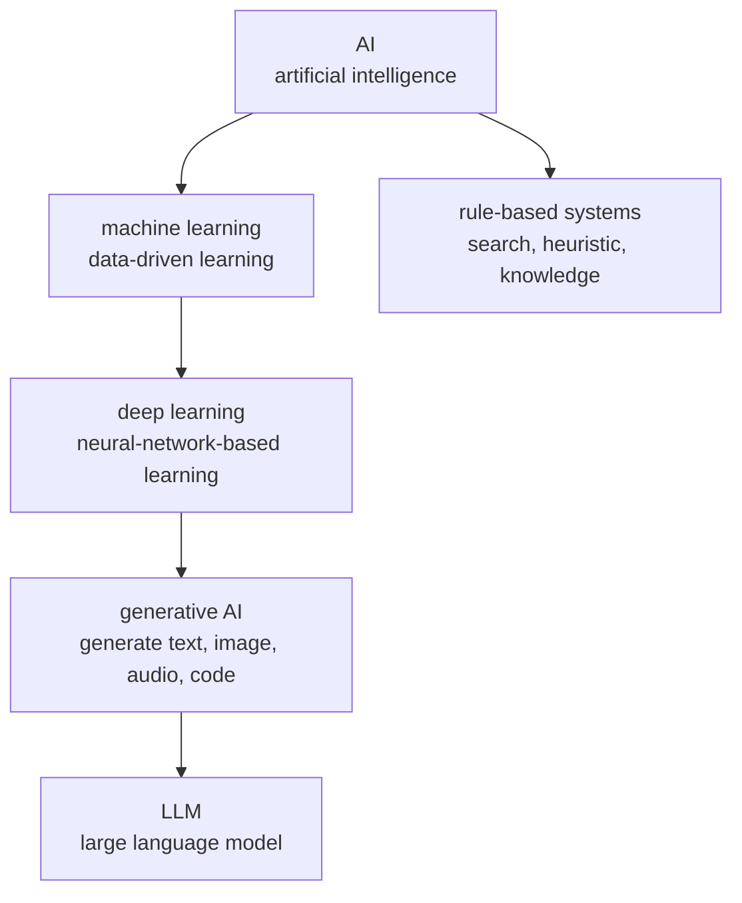
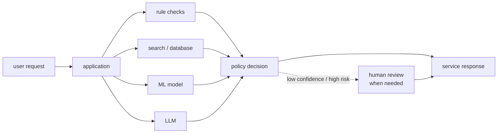

# P3-1.1 AI, 머신러닝, 딥러닝의 관계

Part 1에서는 AI라는 말의 넓은 범위를 봤습니다. Part 2에서는 수식, Python, 배열, 표, 그래프를 다시 읽었습니다. 이제 Part 3에서는 그 기반 위에서 머신러닝(machine learning)을 따로 떼어 봅니다.

이 절의 목적은 AI, 머신러닝, 딥러닝(deep learning), 생성형 AI(generative AI), LLM(large language model)을 한 줄로 암기하는 것이 아닙니다. 각 용어가 어느 범위의 말을 가리키는지 구분하고, Part 3에서 왜 전통적인 머신러닝부터 다시 보는지 이해하는 것입니다.

## 이 절의 범위

이 절은 용어의 위치를 잡는 도입입니다. 세부 알고리즘의 수식, scikit-learn 사용법, 신경망 구조, Transformer 구조는 여기서 깊게 다루지 않습니다.

여기서는 다음 질문에 답합니다.

- AI와 머신러닝은 같은 말인가?
- 머신러닝과 딥러닝은 어떻게 다른가?
- 생성형 AI와 LLM은 AI 전체를 대표하는 말인가?
- Part 3에서 왜 딥러닝보다 전통적인 머신러닝을 먼저 보는가?
- Part 2에서 배운 수식과 Python 도구는 여기서 어떻게 다시 등장하는가?

## 이 절의 목표

- AI, 머신러닝, 딥러닝, 생성형 AI, LLM의 포함 관계를 대략 설명할 수 있습니다.
- 머신러닝을 “데이터에서 패턴을 배워 예측이나 판단에 사용하는 접근”으로 이해할 수 있습니다.
- 딥러닝을 머신러닝의 중요한 흐름이지만 머신러닝 전체와 같은 말은 아니라고 설명할 수 있습니다.
- LLM을 현대 AI 경험의 강한 대표 사례로 보되, AI 전체와 같은 말로 보지 않을 수 있습니다.
- Part 3의 학습 주제가 데이터, 모델, 학습, 평가의 흐름이라는 점을 이해할 수 있습니다.

## 한 문장으로 먼저 구분하기

용어가 많아지면 포함 관계보다 먼저 각 말이 답하려는 질문을 잡는 편이 쉽습니다.

| 용어 | 한 문장 설명 | 중심 질문 |
| --- | --- | --- |
| AI(artificial intelligence) | 컴퓨터로 지능적 행동을 만들거나 흉내 내려는 넓은 분야입니다. | 기계가 지능적으로 보이는 일을 할 수 있는가? |
| 머신러닝(machine learning) | 데이터 경험에서 성능이 좋아지는 모델이나 알고리즘을 만드는 접근입니다. | 사람이 규칙을 다 쓰지 않아도 데이터에서 배울 수 있는가? |
| 딥러닝(deep learning) | 여러 층의 신경망으로 표현(representation)을 학습하는 머신러닝 흐름입니다. | 입력에서 필요한 표현을 모델이 더 직접 배울 수 있는가? |
| 생성형 AI(generative AI) | 텍스트, 이미지, 음성, 코드 같은 새 출력을 만드는 AI 모델과 서비스를 가리킵니다. | 모델이 분류나 예측을 넘어 새 결과물을 만들 수 있는가? |
| LLM(large language model) | 대규모 텍스트 학습을 바탕으로 언어 입력과 출력을 다루는 모델 계열입니다. | 언어 맥락을 바탕으로 다음 표현이나 응답을 생성할 수 있는가? |

이 구분은 시험용 정의가 아니라 독서용 지도입니다. 같은 단어라도 논문, 제품 문서, 언론 기사, 서비스 홍보 문구에서는 범위가 조금씩 다르게 쓰일 수 있습니다. 그래서 Part 3에서는 용어 자체보다 데이터, 모델, 학습, 평가라는 반복되는 구조를 중심에 둡니다.

## 큰 범위부터 보기

AI(artificial intelligence)는 가장 넓은 말입니다. 규칙 기반 시스템, 탐색(search), 휴리스틱(heuristic), 지식 표현(knowledge representation), 확률 추론(probabilistic inference), 머신러닝, 딥러닝, 생성형 AI, 에이전트(agent) 같은 여러 접근을 포함할 수 있습니다.

머신러닝(machine learning)은 그중 데이터에서 패턴을 배우는 접근입니다. 사람이 모든 규칙을 직접 쓰는 대신, 데이터에서 관계를 찾아 모델(model)을 만들고, 그 모델을 새 데이터에 사용합니다.

딥러닝(deep learning)은 머신러닝 안에서 신경망(neural network)을 깊게 쌓아 표현(representation)을 학습하는 강력한 흐름입니다. 이미지, 음성, 자연어, 생성 모델에서 큰 성과를 만들었지만, 모든 머신러닝이 딥러닝인 것은 아닙니다.

생성형 AI(generative AI)는 텍스트, 이미지, 음성, 코드처럼 새로운 출력을 생성하는 모델과 서비스를 가리키는 말입니다. 오늘날 많이 쓰이는 생성형 AI는 딥러닝과 강하게 연결되어 있지만, 생성형 AI라는 사용 경험이 곧 AI 전체를 뜻하지는 않습니다.

LLM(large language model)은 대규모 언어 모델입니다. 현재 많은 사람이 AI를 LLM 경험으로 처음 만나지만, LLM은 AI 전체가 아니라 언어를 중심으로 발전한 특정한 모델 계열입니다.

이 그림은 엄밀한 분류표라기보다 학습용 지도입니다. 실제 연구와 제품에서는 여러 기술이 섞입니다. 예를 들어 검색 시스템, 규칙 기반 필터, 머신러닝 모델, LLM이 하나의 서비스 안에서 함께 작동할 수 있습니다.

다음 도식은 포함 관계와 실제 서비스 조합이 다르다는 점을 분리해서 보여 줍니다. 위 도식이 “용어의 큰 위치”를 보여 준다면, 아래 도식은 “하나의 서비스 안에서 여러 접근이 함께 작동할 수 있음”을 보여 줍니다.

이 도식에서 LLM은 서비스의 전부가 아니라 여러 구성 요소 중 하나입니다. 모델 출력은 정책 판단과 결합될 수 있고, 위험이 크거나 확신이 낮은 경우에는 사람 검토로 넘어갈 수도 있습니다.

## 포함 관계만으로는 부족한 이유

입문 설명에서는 “AI 안에 머신러닝이 있고, 머신러닝 안에 딥러닝이 있다”는 그림이 유용합니다. 하지만 이 그림만 기억하면 실제 서비스를 볼 때 오해가 생깁니다.

예를 들어 추천 서비스는 사용자의 클릭 기록을 이용한 머신러닝 모델을 쓸 수 있습니다. 동시에 금지 상품을 제외하는 규칙 기반 필터를 둘 수 있고, 검색 인덱스나 데이터베이스 조회를 함께 사용할 수 있습니다. 고객 상담 서비스도 LLM만으로 만들어지지 않을 수 있습니다. 검색(search), 권한 확인(permission check), 정책 규칙(policy rule), 로그 기록(logging), 사람 검토(human review)가 함께 들어갈 수 있습니다.

따라서 Part 3에서 필요한 관점은 “어느 기술이 더 최신인가”가 아닙니다. 다음처럼 묻는 관점입니다.

- 이 문제에서 사람이 직접 규칙을 쓰는 부분은 무엇인가?
- 데이터에서 학습해야 하는 부분은 무엇인가?
- 모델이 내는 출력은 점수(score), 분류(class), 숫자 예측(prediction), 생성 결과(generation) 중 무엇인가?
- 서비스가 최종 결정을 내릴 때 모델 출력 외에 어떤 정책이나 제약을 함께 쓰는가?

이 질문은 Part 1에서 본 AI의 넓은 지도와 Part 2에서 본 데이터 표현을 Part 3의 머신러닝 학습으로 연결합니다.

## Part 3에서 머신러닝을 따로 보는 이유

Part 3은 딥러닝이나 LLM으로 바로 가지 않습니다. 먼저 머신러닝의 기본 흐름을 봅니다.

이유는 단순합니다. 딥러닝과 LLM을 이해할 때도 다음 질문은 계속 돌아오기 때문입니다.

- 어떤 데이터(data)를 사용하는가?
- 입력(input)과 라벨(label)은 무엇인가?
- 모델(model)은 무엇을 예측하거나 분류하는가?
- 학습(learning)은 어떤 값을 바꾸는가?
- 평가(evaluation)는 무엇을 기준으로 하는가?
- 보지 못한 데이터에서 잘 작동하는가?

전통적인 머신러닝은 이 질문들을 비교적 작은 예제로 보여 주기 좋습니다. 선형회귀(linear regression), 로지스틱 회귀(logistic regression), 결정트리(decision tree), k-NN 같은 모델은 딥러닝보다 구조가 단순합니다. 그래서 데이터 분리, 과적합(overfitting), 일반화(generalization), 평가 지표(metric)를 먼저 익히기에 적합합니다.

## Part 3의 최소 단위

머신러닝을 처음 다시 볼 때는 알고리즘 이름을 많이 외우는 것보다 반복되는 최소 단위를 잡는 편이 중요합니다.

| 최소 단위 | 질문 | 예시 |
| --- | --- | --- |
| 문제(problem) | 무엇을 예측하거나 구분하려는가? | 스팸 여부, 가격, 이탈 가능성 |
| 데이터(data) | 어떤 사례를 모았는가? | 과거 메일, 거래 기록, 센서 측정값 |
| 특징(feature) | 모델에 어떤 입력 표현을 줄 것인가? | 단어 수, 금액, 시간, 카테고리 |
| 라벨(label) 또는 목표값(target) | 무엇을 맞추려 하는가? | 스팸/정상, 실제 가격, 구매 여부 |
| 모델(model) | 입력을 출력으로 바꾸는 학습된 계산은 무엇인가? | 선형 모델, 트리, 최근접 이웃 |
| 학습(training) | 데이터로 어떤 값을 조정하는가? | 가중치, 분기 기준, 거리 기준 |
| 평가(evaluation) | 새 데이터에서 얼마나 쓸 만한가? | 정확도, 오차, 재현율, 비용 |

이 최소 단위는 이후 딥러닝과 LLM에서도 완전히 사라지지 않습니다. 구조가 커지고 입력 표현이 복잡해질 뿐, 데이터가 무엇이고 모델이 무엇을 학습하며 어떤 기준으로 평가하는지 묻는 습관은 계속 필요합니다.

## 같은 문제를 세 관점으로 보기

스팸 메일 분류를 예로 들면 구분이 더 쉬워집니다.

| 관점 | 질문 | 가능한 접근 |
| --- | --- | --- |
| 규칙 기반 접근 | 특정 단어가 있으면 스팸으로 볼 것인가 | 사람이 규칙을 작성합니다. |
| 머신러닝 접근 | 과거 메일과 라벨에서 스팸 패턴을 배울 수 있는가 | 특징(feature)과 라벨(label)로 모델을 학습합니다. |
| 딥러닝 접근 | 메일 문장의 표현을 모델이 더 직접 학습할 수 있는가 | 신경망이 표현과 분류 경계를 함께 학습합니다. |
| LLM 활용 | 메일의 의도와 맥락을 자연어로 해석하게 할 수 있는가 | 프롬프트, 분류 지시, 도구 연결을 함께 사용할 수 있습니다. |

이 네 관점은 서로 완전히 대체 관계가 아닙니다. 실제 서비스에서는 규칙 기반 필터와 머신러닝 모델, LLM 기반 검토가 함께 쓰일 수 있습니다. 따라서 “최신 방식이 이전 방식을 모두 없앤다”보다 “문제와 제약에 따라 여러 방식을 조합한다”가 더 안전한 이해입니다.

## Part 2의 언어가 다시 등장하는 자리

Part 2에서 배운 표현은 Part 3에서 곧바로 다시 나옵니다.

| Part 2에서 본 표현 | Part 3에서 다시 나타나는 방식 |
| --- | --- |
| 행(row), 열(column) | sample과 feature를 표현합니다. |
| 배열(array), shape | 입력 데이터 `X`의 모양을 설명합니다. |
| 라벨(label) | 지도학습에서 맞추려는 값 `y`로 나타납니다. |
| 함수(function) | 모델이 입력을 출력으로 바꾸는 계산으로 나타납니다. |
| 손실(loss), 오차(error) | 예측이 얼마나 틀렸는지 재는 기준이 됩니다. |
| 평균(mean), 분산(variance) | 데이터 분포와 평가 결과를 읽는 데 쓰입니다. |
| 그래프(plot) | 학습 결과, 오차, 분포, 결정 경계를 확인하는 데 쓰입니다. |

scikit-learn 문서에서도 입력 데이터 `X`는 보통 샘플을 행으로, 특징을 열로 둔 행렬 형태로 설명합니다. 지도학습에서는 목표값 `y`가 함께 쓰이고, 모델은 `fit`으로 학습한 뒤 `predict`로 새 입력의 결과를 계산합니다.

## 가장 먼저 피해야 할 오해

Part 3을 시작할 때 가장 조심할 오해는 다음입니다.

- AI를 머신러닝과 같은 말로 보지 않습니다.
- 머신러닝을 딥러닝과 같은 말로 보지 않습니다.
- 딥러닝을 LLM과 같은 말로 보지 않습니다.
- LLM 사용 경험을 AI 전체의 기준으로 삼지 않습니다.
- 모델 이름을 많이 아는 것을 머신러닝 이해와 같은 것으로 보지 않습니다.
- 학습 데이터를 잘 맞춘 것을 실제 문제를 잘 푸는 것과 같은 말로 보지 않습니다.

Part 3의 핵심은 모델 목록이 아니라 데이터, 학습, 평가의 흐름입니다. 알고리즘 이름은 이 흐름 안에서 이해해야 합니다.

## 이 절에서 기억할 관점

- AI는 가장 넓은 말이고, 머신러닝은 데이터에서 패턴을 배우는 접근입니다.
- 딥러닝은 머신러닝의 중요한 흐름이지만 머신러닝 전체는 아닙니다.
- LLM은 현대 AI 경험에서 매우 중요하지만 AI 전체와 같은 말은 아닙니다.
- Part 3에서는 모델 이름보다 데이터 구조, 학습 절차, 평가 기준을 먼저 봅니다.
- Part 2의 수식, Python, NumPy, Pandas, Matplotlib 감각은 Part 3에서 계속 다시 사용됩니다.
- 실제 AI 서비스는 한 가지 기술만으로 구성되지 않을 수 있으므로, 모델과 규칙, 검색, 정책, 사람 검토가 어떻게 조합되는지 함께 봅니다.

## 체크리스트

- AI, 머신러닝, 딥러닝, 생성형 AI, LLM을 같은 말로 쓰지 않을 수 있는가?
- 머신러닝을 데이터에서 패턴을 배우는 접근으로 설명할 수 있는가?
- 딥러닝이 왜 머신러닝 안의 중요한 흐름인지 말할 수 있는가?
- LLM이 AI 전체가 아니라 특정한 모델 계열임을 설명할 수 있는가?
- Part 3에서 데이터, 학습, 평가를 먼저 봐야 한다고 설명할 수 있는가?
- 실제 서비스에서 규칙, 검색, 모델, 정책이 함께 쓰일 수 있음을 설명할 수 있는가?

## 출처와 참고 자료

- scikit-learn developers, `Getting Started`, scikit-learn documentation, 확인 날짜: 2026-06-25. [https://scikit-learn.org/stable/getting_started.html](https://scikit-learn.org/stable/getting_started.html){: target="_blank" rel="noopener noreferrer" }
- Ian Goodfellow, Yoshua Bengio, Aaron Courville, `Deep Learning`, MIT Press, 2016, Chapter 1 Introduction, 확인 날짜: 2026-06-25. [https://www.deeplearningbook.org/contents/intro.html](https://www.deeplearningbook.org/contents/intro.html){: target="_blank" rel="noopener noreferrer" }
