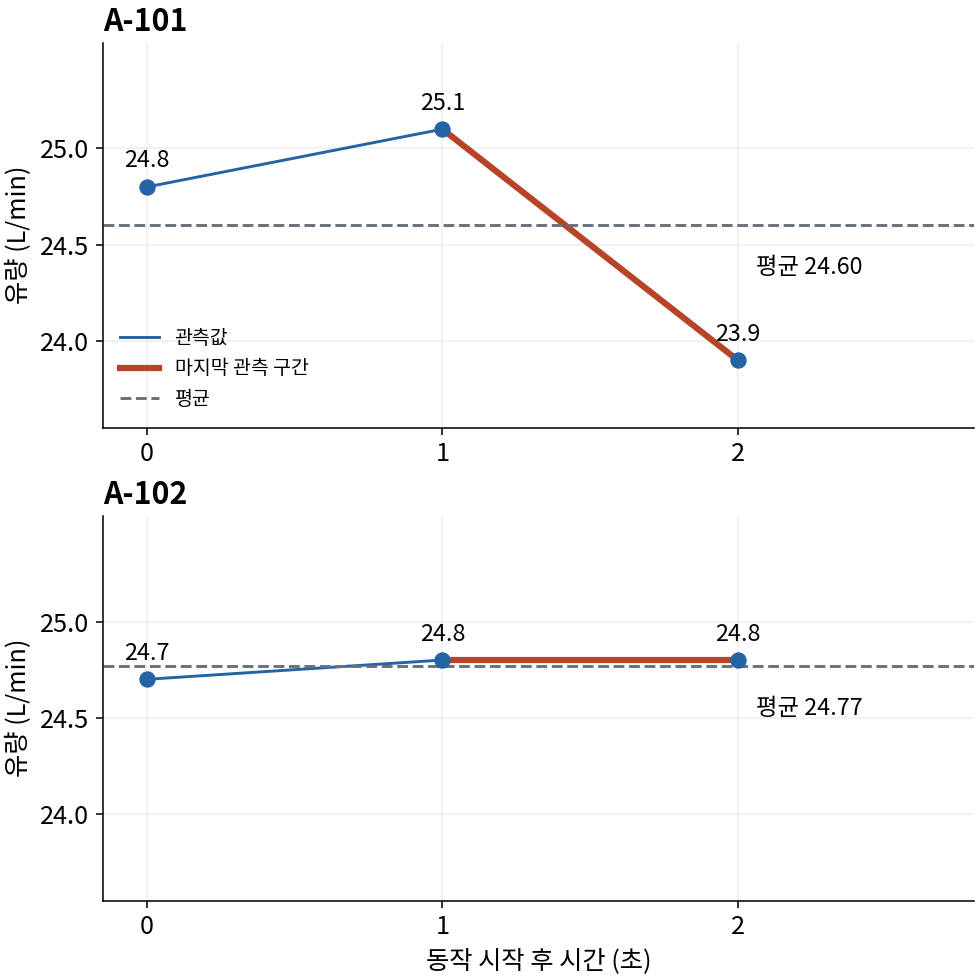

# P3-1.1 데이터 모델링은 무엇을 달성하려는가

> Section ID: `P3-1.1`
> Version: `v2026.09.19`

Part 3에 들어오면 독자는 곧바로 [샘플(sample)](../../../reference/concept-glossary-parts/07-siot.md#glossary-sample), [특징(feature)](../../../reference/concept-glossary-parts/12-tieut.md#glossary-feature), [기준선(baseline)](../../../reference/concept-glossary-parts/01-giyeok.md#glossary-baseline), [출력 구조(output structure)](../../../reference/concept-glossary-parts/05-mieum.md#output-structure), [타깃(target)](../../../reference/concept-glossary-parts/12-tieut.md#target) 같은 말을 만나게 됩니다. 이 용어들은 따로 놀지 않습니다. 무엇을 한 건으로 셀지, 어떤 값을 남길지, 무엇과 비교할지, 어떤 결과 형식으로 닫을지를 함께 정하는 바깥 판단이 [데이터 모델링(data modeling)](../../../reference/concept-glossary-parts/03-digeut.md#data-modeling)입니다.

데이터 모델링을 저장 구조 정리로만 이해하면, 이미 쌓여 있는 표를 보기 좋게 바꾸는 정도로 생각하기 쉽습니다. 이 책의 Part 3에서는 데이터 모델링을 질문에 맞는 샘플과 표현을 설계하는 넓은 의미로 사용합니다. 이는 이 책의 집필 범위이며, 데이터베이스 분야의 데이터 모델링 정의를 대체하는 표준 정의는 아닙니다. 데이터 모델링은 지금 있는 [원천데이터(source data)](../../../reference/concept-glossary-parts/08-ieung.md#glossary-source-data)로 어떤 질문에 답할 수 있게 만들 것인가를 정하는 일입니다.

처음 읽을 때 가장 흔한 혼동은 `DB를 어떻게 저장할까`와 `AI가 읽을 문제 구조를 어떻게 만들까`를 같은 일처럼 보는 것입니다. 둘은 연결되지만 목표가 다릅니다.

| 비교 지점 | 저장 구조를 먼저 보는 관점 | Part 3의 데이터 모델링 관점 |
| --- | --- | --- |
| 먼저 묻는 질문 | 어떤 기록을 빠짐없이 저장하고 다시 찾을 것인가 | 어떤 질문에 답할 수 있게 샘플과 비교 구조를 만들 것인가 |
| 대표 단위 | 로그 1행, 이벤트 1건, 센서 측정 1회 | 동작 1회, 최근 구간 1개, 개체 1개 같은 분석 샘플 |
| 주된 관심사 | 누락 없이 저장되는가, 연결이 맞는가, 추적 가능한가 | 무엇과 무엇을 비교할 수 있는가, 어떤 특징을 남길 것인가 |
| 바로 나오는 결과 | 원시 로그 테이블, 이벤트 테이블, 조인 가능한 저장 구조 | 요약 표, 특징 표, 기준선 비교표, 검토용 출력 구조 |
| 이 Part에서의 질문 | 아직 출발점일 수는 있지만 끝점은 아님 | Part 3 전체가 계속 다루는 중심 질문 |

즉 저장 구조가 `기록을 잃지 않기 위한 틀`이라면, 데이터 모델링은 `질문에 답하기 위한 비교 구조를 만드는 틀`에 더 가깝습니다. 저장된 자료가 현재 질문에 맞는 샘플 단위와 정보를 갖추었는지 확인하고, 필요한 경우 표현을 바꿉니다. 원시 기록도 데이터셋이며, 모든 분석에서 새 요약 표가 필요한 것은 아닙니다.

예를 들어 자동으로 실행되는 동작 기록이 있다고 하겠습니다. 원천데이터에는 시점별 센서 값, 제어 파라미터, 동작 시작과 종료 시각이 들어 있을 수 있습니다. 이 기록은 저장과 추적에는 충분할 수 있습니다. 하지만 그 상태만으로는 아직 `이번 동작이 평소와 달랐는가`, `최근 구간에서 반복성이 흔들리는가`, `사람이 먼저 검토해야 할 건은 무엇인가` 같은 질문에 바로 답하기 어렵습니다.

여기서 데이터 모델링이 달성하려는 것은 단순합니다. 질문과 기록 사이의 연결을 분명히 하여, 사람이 비교하고 모델이 활용할 수 있게 하는 것입니다. 이 절의 동작 비교 사례에서는 다음 네 가지를 정합니다.

1. 무엇을 한 건의 샘플로 볼지 정한다.
2. 그 샘플을 설명하는 특징을 만든다.
3. 최근 상태를 무엇과 비교할지 기준선을 세운다.
4. 최종적으로 사람 검토용 결과인지, 예측용 목표 후보인지 출력 구조를 정한다.

이 네 가지는 이 사례의 설계 질문이며 모든 데이터셋에 반드시 있어야 하는 네 종류의 열은 아닙니다. 원시 시계열이나 이미지·문서를 입력으로 쓸 수도 있고, 과거 기준선과 비교하지 않는 문제도 있습니다.

이 지점에서 데이터 모델링과 [데이터과학(data science)](../../../reference/concept-glossary-parts/03-digeut.md#glossary-data-science)의 관계도 함께 잡아 둘 필요가 있습니다. 데이터과학은 데이터 수집, 정제, 탐색, 요약, 비교, 해석, 예측, 의사결정 연결까지 포함하는 더 넓은 흐름입니다. 그 안에서 Part 3이 집중하는 데이터 모델링은 `원천데이터를 AI 학습과 분석에 들어갈 문제 구조로 바꾸는 앞단 판단`에 가깝습니다. 다시 말해 Part 3은 데이터과학 전체를 가르치는 Part가 아니라, AI 이해에 필요한 데이터 취급을 질문·표현·해석의 연결로 배우는 Part입니다.

이 점을 더 분명히 보기 위해, 데이터 모델링이 실제로 만들고자 하는 산출물을 나란히 놓고 봅니다.

| 달성하려는 것 | 왜 필요한가 | 뒤에서 연결되는 질문 |
| --- | --- | --- |
| 샘플 단위 | 무엇을 한 건으로 셀지 정해야 하기 때문 | 한 행은 무엇을 뜻하는가 |
| 특징 표 | 비교와 학습에 쓸 설명 값을 만들어야 하기 때문 | 어떤 값을 남겨야 하는가 |
| 기준선 비교 구조 | 최근 상태를 평소와 구분해 읽어야 하기 때문 | 무엇과 비교해야 하는가 |
| 출력 구조 | 사람 검토와 예측 문제를 섞지 않기 위해 | 무엇을 결과로 내보낼 것인가 |

이 표에서 중요한 점은 데이터 모델링이 아직 `모델 선택` 단계가 아니라는 사실입니다. 이 단계에서는 분류기 이름이나 딥러닝 구조보다 먼저, 어떤 표를 만들고 어떤 비교를 가능하게 할 것인지가 결정되어야 합니다. 그래야 뒤의 머신러닝 Part에서도 `X`, `y`, `평가`, `기준 모델`이 공중에 뜨지 않습니다.

이 절의 동작 비교 사례에서 선택할 흐름을 도식으로 나타내면 다음과 같습니다. 모든 데이터에 적용하는 필수 절차는 아닙니다.

```mermaid
--8<-- "assets/part-03/chapter-01/p3-1-1-mermaid-01-ko.mmd"
```

## 같은 동작의 수준·흩어짐·방향은 서로 다른 질문이다

다음은 설명을 위해 만든 가상 기록입니다. `action_id`는 동작 식별자, `t_sec`는 동작 시작 뒤 지난 시간(초), `flow_rate`는 유량(L/min), `pressure`는 압력(kPa)입니다. `valve_open`의 1은 밸브가 열려 있다는 뜻입니다. 각 동작에서 0초·1초·2초에 한 번씩 측정했다고 가정합니다.

| action_id | t_sec | flow_rate | pressure | valve_open |
| --- | ---: | ---: | ---: | ---: |
| A-101 | 0.0 | 24.8 | 101.2 | 1 |
| A-101 | 1.0 | 25.1 | 101.0 | 1 |
| A-101 | 2.0 | 23.9 | 102.4 | 1 |
| A-102 | 0.0 | 24.7 | 100.9 | 1 |
| A-102 | 1.0 | 24.8 | 101.1 | 1 |
| A-102 | 2.0 | 24.8 | 101.0 | 1 |

A-101의 유량은 조금 올라갔다가 마지막에 내려갑니다. A-102는 세 값이 서로 가깝고 마지막 두 값은 같습니다. 이 차이를 비교하려고 동작 1회를 샘플 1건으로 묶겠습니다. 여기서 여섯 행은 여섯 동작이 아니라 두 동작의 측정 기록입니다.

`어느 동작이 달랐는가`를 수치로 설명하려면 먼저 질문을 나눠야 합니다. 전체 유량 수준이 다른지, 측정값이 넓게 흩어져 있는지, 끝부분에서 내려가는지는 서로 다른 질문입니다. 이 질문에 따라 남길 숫자도 달라집니다.

### 평균: 측정값의 전체 수준은 얼마인가

**평균**은 값들을 모두 더한 뒤 값의 개수로 나눈 수입니다. 이 사례에서는 동작마다 측정한 유량 세 개의 평균을 `flow_mean`이라는 열에 남깁니다.

- A-101: `(24.8 + 25.1 + 23.9) / 3 = 24.60 L/min`
- A-102: `(24.7 + 24.8 + 24.8) / 3 ≈ 24.77 L/min`

A-101의 평균 유량이 조금 낮습니다. 그러나 평균만으로는 어느 시점에 내려갔는지 알 수 없습니다. 예를 들어 `23, 24, 25`와 `25, 24, 23`은 모두 평균이 24이지만, 하나는 올라가고 다른 하나는 내려갑니다. **수준을 요약하면 시간 순서는 사라집니다.**

아래 차트는 두 동작에 같은 축을 사용합니다. 점은 관측값, 점선은 평균, 굵은 선은 마지막 관측 구간입니다. 점 사이의 선은 측정 순서를 읽기 위한 연결이며, 관측 사이의 실제 변화 경로를 확인한 것은 아닙니다.

A-101은 평균 주변에 더 넓게 퍼져 있고 마지막 구간에서 내려갑니다. A-102는 평균 가까이에 머뭅니다. 수평인 평균선만으로는 이 모양을 전달할 수 없습니다. 아래에서 흩어짐과 방향을 나눠 읽겠습니다.

압력도 같은 방법으로 평균을 구해 `pressure_mean`에 남깁니다. A-101은 `(101.2 + 101.0 + 102.4) / 3 ≈ 101.53 kPa`, A-102는 `101.00 kPa`입니다. 이 값은 유량이 변할 때 압력의 전체 수준도 함께 비교하기 위한 정보이며, 그 자체가 고장 판정은 아닙니다.

### 표준편차: 평균 주변에 얼마나 흩어져 있는가

**표준편차**는 값들이 평균 주변에 얼마나 흩어져 있는지 나타냅니다. 세 값이 모두 같으면 0이고, 값들이 평균에서 더 멀리 퍼질수록 커집니다. 시간에 따라 올라가는지 내려가는지를 나타내는 값은 아닙니다.

이 사례의 `flow_std`는 **표본 표준편차** 계산식을 사용합니다. A-101의 평균 24.6에서 각 값이 얼마나 떨어져 있는지부터 계산해 봅시다.

1. 평균을 뺀 차이는 `24.8−24.6 = 0.2`, `25.1−24.6 = 0.5`, `23.9−24.6 = −0.7`입니다.
2. 차이를 그대로 더하면 양수와 음수가 상쇄되므로 각각 제곱합니다. 제곱한 값의 합은 `0.2² + 0.5² + (−0.7)² = 0.78`입니다.
3. 표본 표준편차는 이 합을 `값의 개수−1`로 나눕니다. 여기서는 `0.78 / (3−1) = 0.39`입니다.
4. 제곱을 되돌리는 제곱근을 취하면 `√0.39 ≈ 0.62 L/min`입니다. 표준편차의 단위는 원래 유량과 같습니다.

표본으로 더 큰 집단의 흩어짐을 추정할 때 사용하는 계산 규칙이므로 분모가 3이 아니라 2입니다. 여기서는 이 규칙으로 세 측정값을 요약하며, 두 동작만으로 장비 전체의 상태를 추정하지는 않습니다. A-102도 반올림 전 평균으로 같은 계산을 하면 약 `0.06 L/min`입니다. 따라서 이 기록에서는 A-101의 유량값이 평균 주변에 더 넓게 흩어져 있습니다.

앞의 `23, 24, 25`와 `25, 24, 23`은 표본 표준편차도 모두 1입니다. 순서만 바꾸면 평균에서 떨어진 정도는 그대로이기 때문입니다. 표준편차가 크다는 말과 끝부분 하강이 가파르다는 말은 구분해야 합니다.

### 마지막 구간의 기울기: 어느 방향으로 얼마나 빨리 변했는가

끝부분 하강을 보려면 **값의 변화량을 걸린 시간으로 나눈 기울기**를 사용합니다. 이 사례에서는 마지막 구간을 1초부터 2초까지로 정하고, 그 구간의 기울기를 `late_drop_rate`에 남깁니다. 열 이름에 `drop`이 들어 있지만 부호를 유지하므로 상승하면 양수도 나올 수 있습니다.

- A-101: `(23.9−25.1) / (2−1) = −1.2 L/min/s`
- A-102: `(24.8−24.8) / (2−1) = 0.0 L/min/s`

`L/min/s`는 유량의 단위인 L/min이 1초당 얼마나 바뀌었는지를 뜻합니다. 음수는 하강, 양수는 상승이고, 0은 두 시점의 값이 같다는 뜻입니다. 같은 시간 간격에서 −1.2는 −0.2보다 더 가파른 하강입니다. 두 측정점 사이에서 값이 계속 일정한 속도로 변했다고까지 알 수 있는 것은 아닙니다.

### 기준선 차이: 평소의 같은 구간과 얼마나 다른가

하강이 관찰됐다는 사실만으로 평소와 다른지는 알 수 없습니다. 이 가상 사례에서는 같은 조건에서 따로 정한 평소의 마지막 구간 기울기를 `0.0 L/min/s`로 가정합니다. 이 값이 비교의 기준선입니다. 앞의 여섯 행에서 추정한 값이 아닙니다.

`baseline_gap`은 `현재 동작의 기울기−기준선 기울기`로 계산합니다. A-101은 `−1.2−0.0 = −1.2 L/min/s`, A-102는 `0.0−0.0 = 0.0 L/min/s`입니다. 음수인 차이는 현재 기울기가 기준선보다 작다는 뜻입니다. 기준선 자체가 −1.0이었다면 A-101의 차이는 −0.2가 되므로, **현재 기울기와 기준선 차이는 같은 개념이 아닙니다.**

그다음 사람이 검토할 동작을 고르는 설명용 규칙을 정합니다. `baseline_gap < −0.5 L/min/s`이면 `review`, 그 밖에는 `no_flag`를 붙입니다. 정확히 −0.5인 경우는 `no_flag`입니다. 이 임계값은 지표를 검토 행동으로 연결하기 위해 가정한 규칙이며, 실제 장비에서 검증된 고장 기준이 아닙니다.

## 질문별로 고른 값을 동작 한 행으로 합치기

지금까지 계산한 값을 합치면 다음 요약 표가 됩니다. 평균과 표준편차는 소수 둘째 자리까지 표시하며, 계산 도중에는 반올림 전 값을 사용합니다.

| action_id | flow_mean (L/min) | flow_std (L/min) | pressure_mean (kPa) | late_drop_rate (L/min/s) | baseline_gap (L/min/s) | review_flag |
| --- | ---: | ---: | ---: | ---: | ---: | --- |
| A-101 | 24.60 | 0.62 | 101.53 | -1.2 | -1.2 | review |
| A-102 | 24.77 | 0.06 | 101.00 | 0.0 | 0.0 | no_flag |

이제 A-101 행을 다음처럼 읽을 수 있습니다. 측정된 평균 유량은 24.60 L/min이고, 세 유량값의 표준편차는 0.62 L/min입니다. 마지막 1초의 기울기는 −1.2 L/min/s이며, 가정한 기준선보다 1.2 L/min/s 작습니다. 그 차이가 설명용 검토 규칙에 걸려 `review`가 붙었습니다.

`review_flag`는 측정값이나 고장 확정 라벨이 아니라 **규칙을 적용한 검토 결과**입니다. `no_flag`도 이 규칙에 걸리지 않았다는 뜻이며 정상 확정이 아닙니다. 큰 표준편차나 음수 기울기만으로 고장을 확정할 수는 없습니다.

이 사례에서 데이터 모델링이 만든 것은 원시 기록과 질문을 잇는 구조입니다. `action_id`로 한 동작을 묶고, 질문에 맞는 요약값을 남기고, 별도로 정한 기준선과 비교한 다음, 사람이 읽을 검토 결과를 붙였습니다. 원시 기록은 세부 순서를 다시 확인할 근거로 남습니다.

```mermaid
--8<-- "assets/part-03/chapter-01/p3-1-1-mermaid-02-ko.mmd"
```

데이터 모델링이 잘 되었는지는 화려한 모델을 썼는지로 판단하지 않습니다. 오히려 다음 질문에 답할 수 있는지로 판단합니다.

- 지금 표의 한 행은 무엇을 뜻하는가
- 이 값은 왜 남겼는가
- 무엇과 비교하면 변화가 보이는가
- 이 결과는 자동 확정인가, 사람 검토 후보인가

각 열을 원시 기록이나 계산 규칙으로 되짚을 수 있어야 다른 사람이 같은 표를 다시 만들 수 있습니다. 탐색 중에 필요한 정보가 빠졌거나 다른 비교가 필요하다는 사실을 발견하면 샘플과 표현을 다시 정할 수 있습니다.

## 체크리스트

- A-101의 평균·표준편차·기울기가 각각 어떤 질문에 답하며, 어떤 질문에는 답하지 못하는지 설명할 수 있는가?
- A-101의 마지막 유량을 23.9에서 25.1로 바꿔 평균·표준편차·마지막 기울기·검토 결과를 다시 계산해 보자. 어느 값이 달라지는가?
- 기준선 기울기만 −1.0 L/min/s로 바꾸면 기존 A-101의 `baseline_gap`과 `review_flag`는 어떻게 바뀌는가?
- `review`와 고장 확정, `no_flag`와 정상 확정을 구분할 수 있는가?
- DB의 저장 구조 설계와 이 사례의 분석 입력 설계를 구분하고, 요약 표가 모든 데이터셋의 필수 형식은 아닌 이유를 말할 수 있는가?

값을 바꾼 계산을 확인하면, 마지막 유량이 25.1인 A-101의 평균은 25.00 L/min, 표본 표준편차는 약 0.17 L/min, 마지막 기울기는 0.0 L/min/s입니다. 기존 기준선 0.0에서는 `no_flag`가 됩니다. 원래 유량을 유지하고 기준선만 −1.0으로 바꾸면 차이는 −0.2 L/min/s이므로 역시 `no_flag`입니다. 두 경우 모두 고장이 없다고 확정한 것은 아닙니다.

## 출처와 참고 자료

- W3C, `PROV-Overview`. provenance framework가 identifying an object와 representing derivation을 지원해야 한다고 정리하므로, `무엇을 한 건으로 볼 것인가`, `어떤 과정을 거쳐 요약 표와 비교 구조가 만들어졌는가`를 설명 가능한 형태로 남겨야 한다는 일반 근거가 됩니다. [https://www.w3.org/TR/prov-overview/](https://www.w3.org/TR/prov-overview/){: target="_blank" rel="noopener noreferrer" } / 확인일: 2026-07-20
- Google for Developers, `Machine Learning Glossary`, `example`, `labeled example`. example는 라벨이 없을 수도 있고, labeled example은 특징과 라벨을 함께 포함합니다. 샘플·입력·결과의 역할을 나누는 용어 기준으로 참고했습니다. [Machine Learning Glossary](https://developers.google.com/machine-learning/glossary){: target="_blank" rel="noopener noreferrer" } / 확인일: 2026-09-15
- U.S. Bureau of Labor Statistics, `Base period`. 기준 시점이나 기간을 reference로 두는 일반 개념을 제공하므로, 데이터 모델링에서 최근 상태를 무엇과 비교할지 기준선을 먼저 세워야 한다는 설명을 뒷받침합니다. [https://www.bls.gov/bls/glossary.htm](https://www.bls.gov/bls/glossary.htm){: target="_blank" rel="noopener noreferrer" } / 확인일: 2026-07-20
- Usama M. Fayyad, Gregory Piatetsky-Shapiro, Padhraic Smyth, `From Data Mining to Knowledge Discovery in Databases`. 데이터 수집, 선택, 전처리, 변환, 해석을 포함한 더 넓은 지식 발견 흐름을 설명하므로, Part 3이 데이터과학 전체가 아니라 그중 문제 구조 설계와 표현 변환에 초점을 둔다는 경계 설명의 일반 배경이 됩니다. [https://www.kdnuggets.com/gpspubs/aimag-kdd-overview-1996-Fayyad.pdf](https://www.kdnuggets.com/gpspubs/aimag-kdd-overview-1996-Fayyad.pdf){: target="_blank" rel="noopener noreferrer" } / 확인일: 2026-07-20
- NIST/SEMATECH, *e-Handbook of Statistical Methods*, `Measures of Location`, `Measures of Scale`. 평균과 표본 표준편차의 정의·계산·단위를 확인했습니다. 동작 기록과 검토 임계값은 이 책의 가상 사례이며 이 자료가 검증한 장비 기준이 아닙니다. [Measures of Location](https://www.itl.nist.gov/div898/handbook/eda/section3/eda351.htm){: target="_blank" rel="noopener noreferrer" } / [Measures of Scale](https://www.itl.nist.gov/div898/handbook/eda/section3/eda356.htm){: target="_blank" rel="noopener noreferrer" } / 확인일: 2026-09-19
