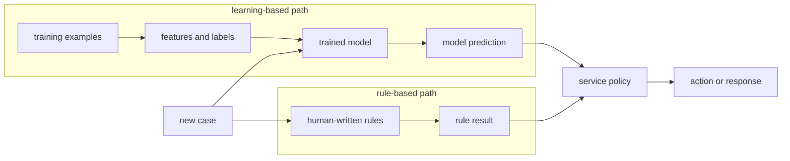
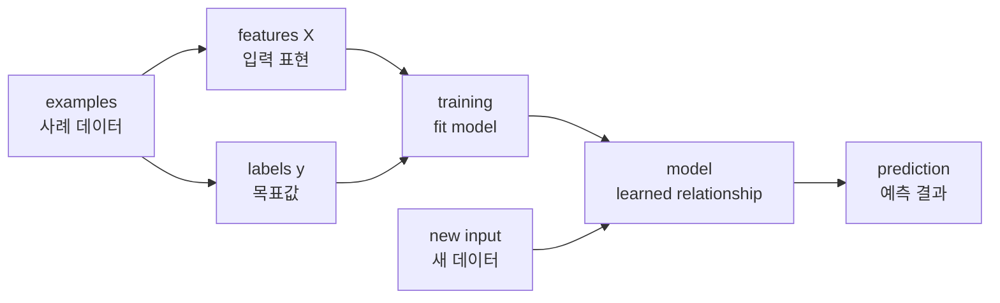

# P3-1.2 데이터에서 규칙을 배운다는 말

P3-1.1에서는 AI, 머신러닝(machine learning), 딥러닝(deep learning), 생성형 AI(generative AI), LLM(large language model)의 위치를 구분했습니다. 이제 머신러닝을 조금 더 가까이 봅니다.

머신러닝을 처음 설명할 때 자주 나오는 말은 “데이터에서 규칙을 배운다”입니다. 이 표현은 유용하지만 조심해서 써야 합니다. 모델이 사람이 읽을 수 있는 `if-then` 규칙을 그대로 찾아낸다는 뜻은 아닙니다. 더 안전하게 말하면, 머신러닝은 데이터의 사례에서 입력과 출력 사이의 관계를 추정하고, 그 관계를 새 데이터에 적용하려는 접근입니다.

## 이 절의 범위

이 절은 규칙 기반 접근(rule-based approach)과 학습 기반 접근(learning-based approach)의 차이를 설명합니다. 지도학습(supervised learning), 비지도학습(unsupervised learning), 강화학습(reinforcement learning)의 세부 구분은 다음 Chapter에서 다룹니다.

여기서는 다음 질문에 답합니다.

- 사람이 규칙을 쓴다는 것은 무엇인가?
- 데이터에서 규칙을 배운다는 말은 무엇을 뜻하는가?
- 모델은 정말 사람이 이해하는 규칙을 찾는가?
- 학습 데이터(training data), 특징(feature), 라벨(label), 모델(model)은 어떻게 연결되는가?
- 학습된 모델을 왜 반드시 평가해야 하는가?

## 이 절의 목표

- 규칙 기반 접근과 학습 기반 접근을 구분할 수 있습니다.
- “데이터에서 규칙을 배운다”를 “데이터에서 관계를 추정한다”는 안전한 표현으로 바꿔 설명할 수 있습니다.
- 학습 데이터, 특징, 라벨, 모델, 예측(prediction)의 흐름을 말할 수 있습니다.
- 머신러닝이 정답 규칙을 발견하는 과정이 아니라 성능 기준을 만족하는 모델을 만드는 과정임을 이해할 수 있습니다.
- 학습 데이터에 잘 맞는 것과 새 데이터에 잘 작동하는 것이 다르다는 점을 설명할 수 있습니다.

## 먼저 비교해 보기

규칙 기반 접근과 학습 기반 접근은 둘 다 입력을 받아 결과를 냅니다. 차이는 판단 기준을 누가, 어떤 방식으로 만드는가에 있습니다.

| 구분 | 규칙 기반 접근(rule-based approach) | 학습 기반 접근(learning-based approach) |
| --- | --- | --- |
| 기준을 만드는 방식 | 사람이 판단 기준을 직접 작성합니다. | 데이터에서 입력과 출력의 관계를 추정합니다. |
| 기준의 형태 | 조건문, 목록, 임계값, 정책 문서처럼 비교적 명시적입니다. | 가중치, 분기, 거리, 확률값, 내부 표현처럼 모델마다 다릅니다. |
| 장점 | 설명이 쉽고 통제하기 쉽습니다. | 사람이 다 쓰기 어려운 패턴을 데이터에서 찾을 수 있습니다. |
| 약점 | 예외가 늘면 규칙 관리가 어려워집니다. | 데이터 품질, 편향, 평가 방식에 크게 의존합니다. |
| 확인 질문 | “이 규칙을 사람이 이해하고 수정할 수 있는가?” | “보지 못한 데이터에서도 성능이 유지되는가?” |

이 표에서 중요한 점은 둘 중 하나만 정답이라는 뜻이 아니라는 점입니다. 실제 시스템은 명시적 규칙과 학습된 모델을 함께 사용하기도 합니다. 예를 들어 모델이 스팸 가능성을 계산하고, 서비스 정책이 그 점수를 기준으로 차단, 검토, 허용을 결정할 수 있습니다.

다음 도식은 두 접근의 차이를 흐름으로 보여 줍니다. 규칙 기반 접근은 사람이 기준을 먼저 쓰고, 학습 기반 접근은 데이터 사례로부터 모델을 만듭니다. 두 방식 모두 마지막에는 서비스의 판단이나 행동으로 이어질 수 있습니다.

여기서 중요한 지점은 `model prediction`이 곧 최종 행동은 아니라는 점입니다. 모델은 점수나 분류 결과를 낼 수 있지만, 실제 서비스는 비용, 위험, 정책, 사용자 경험을 고려해 최종 행동을 정할 수 있습니다.

## 사람이 규칙을 쓰는 방식

규칙 기반 접근에서는 사람이 판단 기준을 직접 씁니다.

예를 들어 스팸 메일을 거르는 간단한 시스템을 생각해 볼 수 있습니다.

- 제목에 특정 광고 문구가 있으면 스팸으로 표시합니다.
- 발신 주소가 차단 목록에 있으면 스팸으로 표시합니다.
- 본문에 의심스러운 링크가 너무 많으면 스팸으로 표시합니다.

이 방식은 이해하기 쉽습니다. 왜 스팸으로 판단했는지 설명하기도 비교적 쉽습니다. 하지만 예외가 많아지면 규칙이 빠르게 복잡해집니다. 새로운 표현, 우회 문구, 정상 메일과 스팸 메일의 경계가 섞이면 사람이 모든 경우를 직접 쓰기 어렵습니다.

규칙 기반 접근이 나쁘다는 뜻은 아닙니다. 실제 서비스에서는 여전히 유용합니다. 다만 모든 판단을 사람이 작성한 규칙만으로 유지하기 어렵기 때문에, 데이터에서 반복되는 패턴을 이용하는 접근이 필요해집니다.

## 데이터에서 관계를 추정하는 방식

머신러닝에서는 사람이 모든 규칙을 직접 쓰는 대신, 사례 데이터를 준비합니다.

스팸 분류를 다시 예로 들면 다음과 같은 데이터가 필요합니다.

| 메일 본문에서 뽑은 특징(feature) | 라벨(label) |
| --- | --- |
| 광고 단어 수, 링크 수, 발신자 정보, 문장 패턴 | 스팸 |
| 광고 단어 수, 링크 수, 발신자 정보, 문장 패턴 | 정상 |

모델은 이 데이터에서 특징과 라벨 사이의 관계를 학습합니다. 이후 새 메일이 들어오면 같은 방식으로 특징을 만들고, 학습된 모델은 스팸일 가능성이나 분류 결과를 냅니다.

이때 “규칙을 배운다”는 말은 사람이 읽는 문장 규칙을 만든다는 뜻이 아닙니다. 모델의 종류에 따라 내부 표현은 다릅니다. 선형 모델은 가중치(weight)를 학습하고, 트리 모델은 분기 기준을 만들고, k-NN은 가까운 사례를 찾는 방식으로 판단합니다. 딥러닝 모델은 더 복잡한 표현을 학습합니다.

따라서 이 책에서는 다음처럼 표현을 정리합니다.

> 사람이 직접 규칙을 쓴다.
> -> 규칙 기반 접근
>
> 데이터에서 입력과 출력의 관계를 추정한다.
> -> 학습 기반 접근
>
> 추정된 관계를 새 데이터에 적용한다.
> -> 모델 실행(inference) 또는 예측(prediction)

## 데이터에서 배운다는 말의 세 단계

“데이터에서 배운다”는 말은 한 번에 일어나는 마법 같은 동작이 아닙니다. 입문 단계에서는 다음 세 단계로 나누어 보는 것이 안전합니다.

1. 표현한다.
   현실의 사례를 모델이 다룰 수 있는 입력으로 바꿉니다. 메일 본문은 단어 수, 링크 수, 발신자 정보 같은 특징(feature)이 될 수 있습니다.

2. 맞춰 본다.
   모델은 학습 데이터(training data)에서 입력과 목표값(target) 사이의 관계를 맞추도록 내부 값을 조정합니다. 이 과정이 학습(training)입니다.

3. 확인한다.
   학습에 쓰지 않은 데이터에서 성능을 확인합니다. 이 단계가 없으면 모델이 실제로 관계를 배운 것인지, 학습 데이터를 외운 것인지 구분하기 어렵습니다.

이 세 단계는 Part 3 전체에서 반복됩니다. 표현이 바뀌면 모델이 볼 수 있는 문제가 바뀌고, 학습 기준이 바뀌면 모델이 좋아지는 방향도 바뀌며, 평가 데이터가 부실하면 실제 성능을 잘못 판단할 수 있습니다.

## 학습의 기본 흐름

입문 단계에서는 머신러닝 흐름을 다음 다섯 단계로 보면 충분합니다.

이 그림에서 `X`는 모델에 넣는 입력 데이터입니다. 보통 샘플(sample)이 행(row), 특징(feature)이 열(column)인 배열이나 표로 생각할 수 있습니다. `y`는 지도학습에서 모델이 맞추려는 목표값입니다. 분류 문제에서는 라벨일 수 있고, 회귀 문제에서는 숫자값일 수 있습니다.

scikit-learn의 기본 사용 흐름도 이 구조와 비슷합니다. 모델 객체를 만들고, `fit`으로 `X`와 `y`에서 학습한 뒤, `predict`로 새 입력의 출력을 계산합니다. 여기서 중요한 것은 API 이름을 외우는 것이 아니라, `fit`은 학습이고 `predict`는 학습된 모델을 사용하는 단계라는 점입니다.

## 모델마다 배운 결과는 다르게 보인다

“규칙을 배운다”는 말을 조심해야 하는 가장 큰 이유는 모델마다 학습 결과의 모양이 다르기 때문입니다.

| 모델의 예 | 학습 후 남는 것의 직관 | 사람이 읽는 규칙과의 관계 |
| --- | --- | --- |
| 선형 모델(linear model) | 특징마다 어느 정도 영향을 주는지 나타내는 가중치(weight) | 숫자 관계로 읽을 수 있지만 문장 규칙은 아닙니다. |
| 결정트리(decision tree) | 값을 기준으로 나누는 분기(split) | 비교적 규칙처럼 읽을 수 있습니다. |
| k-NN(k-nearest neighbors) | 새 입력과 가까운 사례를 찾는 거리 기준 | 별도의 규칙을 만들기보다 주변 사례를 이용합니다. |
| 확률 모델(probabilistic model) | 관측된 특징과 결과의 확률적 관계 | 가능성을 계산하지만 최종 결정 규칙은 별도로 둘 수 있습니다. |
| 신경망(neural network) | 여러 층의 가중치와 표현(representation) | 사람이 직접 읽기 어려운 내부 표현이 됩니다. |

따라서 학습된 모델을 “규칙 묶음”으로만 이해하면 모델의 차이를 놓치기 쉽습니다. 더 일반적인 표현은 “모델이 데이터를 바탕으로 입력을 출력으로 바꾸는 계산 방식을 조정했다”입니다.

## 규칙을 배운다는 표현의 한계

“데이터에서 규칙을 배운다”는 표현은 초반 이해에는 도움이 됩니다. 하지만 그대로 두면 몇 가지 오해가 생길 수 있습니다.

첫째, 모델이 사람이 읽을 수 있는 규칙을 항상 만든다고 오해할 수 있습니다. 결정트리(decision tree)는 비교적 규칙처럼 읽을 수 있지만, 선형 모델의 가중치나 신경망의 내부 표현은 사람이 만든 문장 규칙과 다릅니다.

둘째, 데이터에 숨어 있는 정답 규칙을 반드시 찾는다고 오해할 수 있습니다. 실제 데이터에는 잡음(noise), 누락, 편향(bias), 측정 오류가 있습니다. 모델은 완전한 진리를 찾는 것이 아니라, 주어진 데이터와 목표 기준에서 쓸 만한 관계를 추정합니다.

셋째, 학습 데이터에 잘 맞으면 실제 문제도 잘 푼다고 오해할 수 있습니다. 모델이 학습 데이터만 외우면 새 데이터에서는 성능이 떨어질 수 있습니다. 이것이 과적합(overfitting) 문제로 이어집니다.

그래서 Part 3에서는 “규칙을 배운다”보다 다음 표현을 더 자주 사용합니다.

- 데이터에서 패턴(pattern)을 찾는다.
- 입력과 출력의 관계(relationship)를 추정한다.
- 예측 성능을 높이는 모델을 학습한다.
- 보지 못한 데이터에 일반화(generalization)되는지 평가한다.

## 작은 예시: 시험 점수 예측

공부 시간으로 시험 점수를 예측하는 아주 단순한 문제를 생각해 봅니다.

| 공부 시간 | 시험 점수 |
| --- | --- |
| 1시간 | 50점 |
| 2시간 | 60점 |
| 3시간 | 65점 |
| 4시간 | 75점 |

사람이 규칙을 쓴다면 “공부 시간이 3시간 이상이면 합격 가능성이 높다”처럼 기준을 직접 만들 수 있습니다.

머신러닝 접근에서는 공부 시간과 점수의 관계를 데이터에서 추정합니다. 모델은 “공부 시간이 늘수록 점수가 어느 정도 증가하는 경향이 있다”는 관계를 숫자로 표현할 수 있습니다. 새 학생이 5시간 공부했다면, 모델은 기존 데이터에서 배운 관계를 이용해 점수를 예측합니다.

하지만 이것은 단순한 예측입니다. 공부 시간만으로 점수를 완전히 설명할 수는 없습니다. 기초 실력, 시험 난이도, 수면, 문제 유형 같은 다른 요인이 있습니다. 이 예시는 머신러닝이 현실을 완전히 설명하는 규칙을 찾는 것이 아니라, 제한된 데이터와 특징 안에서 유용한 관계를 추정한다는 점을 보여 줍니다.

## 작은 예시: 고객 문의 분류

업무에서 더 자주 만나는 예로 고객 문의 분류를 생각해 볼 수 있습니다.

사람이 규칙을 쓴다면 다음처럼 만들 수 있습니다.

- 제목에 “환불”이 있으면 환불 문의로 분류합니다.
- 본문에 “배송이 안 왔어요”가 있으면 배송 문의로 분류합니다.
- “로그인”, “비밀번호”가 있으면 계정 문의로 분류합니다.

하지만 실제 문의는 이렇게 깔끔하지 않습니다. “결제는 됐는데 물건이 안 왔고 취소하고 싶어요”처럼 여러 의도가 섞일 수 있습니다. 같은 뜻을 다른 표현으로 쓸 수도 있습니다. 규칙 기반 접근만 쓰면 예외 규칙이 계속 늘어납니다.

학습 기반 접근에서는 과거 문의와 사람이 붙인 분류 라벨을 모읍니다. 모델은 표현과 라벨 사이의 관계를 학습하고, 새 문의가 들어왔을 때 어떤 유형에 가까운지 예측합니다. 그래도 최종 업무 처리는 모델만으로 끝나지 않을 수 있습니다. 신뢰도가 낮으면 사람에게 넘기거나, 금전 환불처럼 위험이 큰 업무는 별도 승인 절차를 둘 수 있습니다.

이 예시는 머신러닝이 업무 판단을 자동으로 완전히 대체한다기보다, 반복되는 분류나 우선순위 판단을 돕는 방식으로 쓰일 수 있음을 보여 줍니다.

## 평가가 필요한 이유

모델이 학습 데이터를 잘 설명하는 것만으로는 부족합니다. 머신러닝에서 중요한 질문은 “새 데이터에도 잘 작동하는가”입니다.

그래서 Part 3에서는 곧 데이터를 나누는 방법을 다룹니다.

- 학습 데이터(training data): 모델이 관계를 배우는 데 사용합니다.
- 검증 데이터(validation data): 모델을 고르거나 설정을 조정하는 데 사용합니다.
- 테스트 데이터(test data): 마지막에 성능을 확인하는 데 사용합니다.

이 구분은 머신러닝의 핵심입니다. 데이터에서 관계를 추정하는 모델은 항상 학습 데이터에 너무 맞을 위험이 있습니다. 따라서 모델이 실제로 유용한지 보려면 학습에 쓰지 않은 데이터로 평가해야 합니다.

## 이 절에서 기억할 관점

- 규칙 기반 접근은 사람이 판단 기준을 직접 작성하는 방식입니다.
- 학습 기반 접근은 데이터에서 입력과 출력의 관계를 추정하는 방식입니다.
- “데이터에서 규칙을 배운다”는 말은 편리한 비유이지만, 항상 사람이 읽을 수 있는 규칙을 만든다는 뜻은 아닙니다.
- 모델은 완전한 진리를 찾는 것이 아니라 주어진 데이터와 목표 기준에서 쓸 만한 관계를 학습합니다.
- 머신러닝에서 중요한 것은 학습 데이터에 맞는 것보다 새 데이터에 일반화되는 것입니다.
- 학습은 표현, 학습, 평가의 세 단계로 나누어 보면 오해가 줄어듭니다.
- 실제 업무에서는 모델의 예측과 서비스 정책, 사람 검토가 함께 쓰일 수 있습니다.

## 체크리스트

- 규칙 기반 접근과 학습 기반 접근의 차이를 예로 설명할 수 있는가?
- 특징(feature)과 라벨(label)이 학습 데이터에서 어떤 역할을 하는지 말할 수 있는가?
- `fit`과 `predict`를 학습과 예측 흐름으로 구분할 수 있는가?
- “규칙을 배운다”는 표현이 왜 오해를 만들 수 있는지 설명할 수 있는가?
- 학습 데이터와 테스트 데이터를 나누는 이유를 말할 수 있는가?
- 모델마다 학습 결과가 가중치, 분기, 거리 기준, 확률 관계, 내부 표현처럼 다르게 나타날 수 있음을 설명할 수 있는가?

## 출처와 참고 자료

- Tom M. Mitchell, `Machine Learning`, McGraw Hill, 1997, 공식 저자 페이지, 확인 날짜: 2026-06-25. [https://www.cs.cmu.edu/~tom/mlbook.html](https://www.cs.cmu.edu/~tom/mlbook.html){: target="_blank" rel="noopener noreferrer" }
- scikit-learn developers, `Getting Started`, scikit-learn documentation, 확인 날짜: 2026-06-25. [https://scikit-learn.org/stable/getting_started.html](https://scikit-learn.org/stable/getting_started.html){: target="_blank" rel="noopener noreferrer" }
- scikit-learn developers, `Supervised learning`, scikit-learn User Guide, 확인 날짜: 2026-06-25. [https://scikit-learn.org/stable/supervised_learning.html](https://scikit-learn.org/stable/supervised_learning.html){: target="_blank" rel="noopener noreferrer" }
