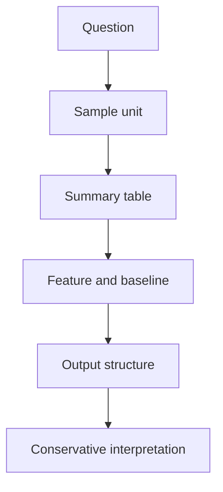

# P3-1.2 데이터 모델링은 어떤 순서로 진행하는가

> Section ID: `P3-1.2`
> Version: `v2026.07.07`

데이터 모델링이 무엇을 달성하려는지 이해했다면, 다음 질문은 곧바로 이어집니다. 실제로는 어떤 순서로 진행해야 하는가 하는 질문입니다.

이 질문은 순서의 문제로 이어집니다. 샘플 단위가 정해지기 전에 특징을 만들 수 없고, 비교 기준이 없으면 출력 구조도 흔들리기 때문입니다. 그래서 데이터 모델링은 뒤에서 필요한 구조를 앞단에서 차례로 고정하는 순서로 읽어야 합니다.

현실에서는 원천데이터를 받자마자 문제 구조보다 먼저 `분류(classification)`, `회귀(regression)`, `이상 탐지(anomaly detection)` 같은 모델 유형을 정하고 싶어지기 쉽습니다. 하지만 이 순서는 자주 문제를 만듭니다. 아직 `한 행의 뜻`, `샘플 단위`, `비교 기준`, `출력 구조`가 정해지지 않았기 때문입니다.

Part 3에서는 데이터 모델링을 다음 여섯 단계로 읽습니다.

1. 문제 질문을 정한다.
2. 샘플 단위를 정한다.
3. 원시 로그를 비교 가능한 표로 다시 묶는다.
4. 특징과 기준선을 설계한다.
5. 출력 구조와 목표 라벨 후보를 구분한다.
6. 해석 경계와 보수적 문장을 정한다.

이 여섯 단계는 데이터과학 전체 절차를 모두 압축한 목록이 아닙니다. Part 3에서는 이 가운데서도 `AI 학습 전에 문제 구조를 세우는 단계`만 떼어 다룹니다. 예를 들어 원천데이터를 수집하는 운영 절차, 본격적인 탐색적 데이터 분석(exploratory data analysis), 통계적 검정의 형식, 모델 학습과 평가 실험은 각각 필요한 순간에 다시 등장하지만, 이 절에서는 그보다 앞선 `샘플, 표, 특징, 비교, 출력 구조`를 고정하는 순서를 우선합니다.

이 여섯 단계를 한 줄 파이프라인으로 보면 다음과 같습니다.

```mermaid
flowchart TD
    A[Question] --> B[Sample unit]
    B --> C[Summary table]
    C --> D[Feature and baseline]
    D --> E[Output structure]
    E --> F[Conservative interpretation]
```

이 순서가 추상적으로만 보인다면, 실제로 자주 밟는 `잘못된 시작 순서`와 비교해 보는 편이 이해가 빠릅니다.

| 시작 방식 | 처음에는 왜 그럴듯해 보이는가 | 실제로 곧 생기는 문제 |
| --- | --- | --- |
| 문제 구조보다 모델 유형부터 정한다 | 분류, 회귀, 이상 탐지 같은 익숙한 말이 먼저 떠오르기 때문이다 | 아직 한 행이 한 시점인지 한 동작인지 정해지지 않아 `입력 X` 자체가 흔들린다 |
| 특징부터 급하게 뽑는다 | 평균, 최대값, 표준편차를 빨리 만들면 진도가 나가는 것처럼 보이기 때문이다 | 샘플 단위가 없어서 그 값이 `동작 전체`를 말하는지 `구간 일부`를 말하는지 모호해진다 |
| 임계값부터 정한다 | 현업에서는 경고 기준을 빨리 정하고 싶기 때문이다 | 비교 기준선이 없어 `이번 값이 큰 것인지 평소보다 달라진 것인지`를 구분하지 못한다 |
| 질문과 샘플부터 고정한다 | 처음에는 느려 보인다 | 뒤의 표, 특징, 기준선, 출력 구조가 같은 기준 위에 놓여 흔들림이 줄어든다 |

즉 Part 3의 순서는 `이론적으로 예쁜 절차`라서가 아니라, 뒤 단계가 앞 단계를 몰래 가정하고 있기 때문에 필요합니다. 가장 흔한 실패는 `모델을 먼저 고른 뒤 나중에 샘플 단위를 끼워 맞추는 경우`입니다. 이런 경우에는 나중에 표를 다시 만들고 특징을 다시 뽑고 출력 구조까지 다시 정의해야 해서, 앞에서 천천히 정한 것보다 오히려 더 많은 수정을 하게 됩니다.

각 단계가 하는 일은 다음처럼 읽을 수 있습니다.

| 단계 | 핵심 질문 | 대표 산출물 |
| --- | --- | --- |
| 문제 질문 정하기 | 무엇을 알고 싶은가 | 비교 질문 또는 예측 질문 |
| 샘플 단위 정하기 | 무엇을 한 건으로 볼 것인가 | 동작 단위, 구간 단위, 개체 단위 |
| 표 다시 묶기 | 원시 로그를 어떻게 다시 표현할 것인가 | 요약 표, 집계 표 |
| 특징과 기준선 설계 | 어떤 값을 남기고 무엇과 비교할 것인가 | 특징 열, 기준선 비교 열 |
| 출력 구조 구분 | 사람 검토와 예측 목표를 어떻게 나눌 것인가 | 경고, 검토 후보, 목표 라벨 후보 |
| 해석 경계 정하기 | 어디까지 말하고 어디서 멈출 것인가 | 보수적 문장, 검토 필요 표기 |

이 순서가 중요한 이유는 뒤 단계가 앞 단계를 전제로 하기 때문입니다. 샘플 단위가 정해지지 않으면 특징도 흔들립니다. 특징이 흔들리면 기준선 비교도 흔들립니다. 비교 구조가 흔들리면 `검토 필요`와 `목표 라벨`을 구분하기도 어려워집니다.

작은 예로 보면 더 분명합니다.

- 질문: 최근 동작이 평소보다 불안정해졌는가
- 샘플: 동작 1회
- 표: 동작별 평균, 기울기, 변동성 요약 표
- 특징: `mid_flow_mean`, `late_drop_rate`, `flow_std`
- 기준선: 최근 20건과 이전 200건 비교
- 출력: `검토 필요` 또는 `정상 범위`

이 예시에서 모델 이름은 아직 등장하지 않습니다. 그런데도 이미 중요한 데이터 모델링 결정이 거의 다 들어 있습니다. 무엇을 한 건으로 볼지, 어떤 값을 남길지, 무엇과 비교할지, 무엇을 결과로 낼지가 정해졌기 때문입니다.

같은 예시를 여섯 단계에 한 번 더 맞춰 보면, 각 단계가 실제로 무엇을 결정하는지 더 선명해집니다.

| 단계 | 이 예시에서 실제로 하는 결정 |
| --- | --- |
| 문제 질문 정하기 | 최근 동작이 평소보다 흔들렸는지 먼저 알고 싶다고 정한다 |
| 샘플 단위 정하기 | 센서 한 시점이 아니라 동작 1회를 한 행으로 잡는다 |
| 표 다시 묶기 | 시점별 로그를 동작별 평균, 기울기, 변동성 표로 바꾼다 |
| 특징과 기준선 설계 | `mid_flow_mean`, `late_drop_rate`, `flow_std`와 평소 구간 비교 열을 만든다 |
| 출력 구조 구분 | `review`, `normal` 같은 검토용 결과와 나중의 목표 라벨 후보를 구분한다 |
| 해석 경계 정하기 | `이상 확정` 대신 `검토 필요`처럼 보수적으로 말한다 |

이 표를 읽을 때 핵심은, 한 단계라도 건너뛰면 뒤 단계가 공중에 뜬다는 점입니다. 예를 들어 샘플 단위를 정하지 않은 채 특징을 만들면, 그 특징이 `한 시점의 흔들림`을 말하는지 `동작 전체의 흔들림`을 말하는지 모호해집니다.

Part 3의 각 장은 사실 이 여섯 단계를 더 자세히 펼친 것입니다.

- 다음 장들은 저장 구조와 문제 표현 구조의 차이를 먼저 확인합니다.
- 그 다음 데이터셋이 처음부터 주어진 것이 아니라는 점을 분명히 합니다.
- 이어서 샘플 단위, 요약 표, 특징, 기준선, 해석 경계를 차례로 세웁니다.
- 마지막에는 어떤 문제를 비교 리포트로 남기고 어떤 문제를 Part 4의 학습 문제로 넘길지 정리합니다.

따라서 여기서는 세부 설명을 대신하기보다, Part 3 전체를 읽는 지도를 먼저 제공합니다. 어느 장을 읽더라도 `지금 나는 여섯 단계 중 어디에 있는가`를 계속 확인할 수 있어야 합니다.

같은 이유로 Part 3은 `데이터과학을 배우는 중`이라는 감각보다 `학습 가능한 데이터 문제를 설계하는 중`이라는 감각으로 읽어야 합니다. 이 관점이 서면 뒤에서 나올 샘플 설계, 요약 표, 특징 설계, 기준선 비교도 흩어진 기법이 아니라 하나의 문제 설정 절차로 읽히기 시작합니다.

## 짧은 점검

- 질문을 정하기 전에 모델 이름부터 떠올리면 왜 문제가 되는가
- 샘플 단위와 요약 표가 서로 왜 붙어 다니는가
- 기준선 비교가 없는 특징 표는 어떤 한계를 가지는가
- 출력 구조와 목표 라벨 후보를 왜 같은 말로 쓰지 않는가

데이터 모델링은 질문, 샘플, 표, 특징, 비교, 출력 구조를 순서 있게 설계하는 과정이다. 다음 Chapter부터는 이 순서를 실제 장면과 표 구조로 하나씩 펼쳐서 봅니다.

## 언제 이 관점을 먼저 떠올려야 하는가

- 데이터 문제를 보자마자 모델 종류부터 고르는 대신, 질문과 샘플 단위부터 순서 있게 정해야 할 때 이 절의 진행 순서를 먼저 떠올립니다.
- 샘플, 표, 특징, 기준선, 출력 구조 가운데 어디에서 막혔는지 진단해야 할 때 여섯 단계 파이프라인으로 돌아옵니다.
- Part 3의 개별 장이 지금 전체 절차 중 어디에 놓이는지 다시 확인해야 할 때 이 절이 기준 지도가 됩니다.
