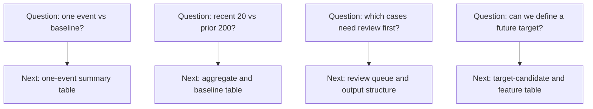

# P3-1.3 데이터 질문은 어떻게 써야 모델보다 먼저 문제 구조가 보이는가

> Section ID: `P3-1.3`
> Version: `v2026.07.10`

좋은 데이터 질문은 `무엇을 한 건으로 볼지`, `무엇을 무엇과 비교할지`, `최종적으로 무엇을 알고 싶은지`가 먼저 드러나야 합니다. 모델 이름이나 기술 이름보다 이런 질문 구조가 먼저 서 있어야, 뒤의 샘플 단위, 표 구조, 특징, 기준선, 출력 구조도 함께 정해집니다. 특히 사람이 먼저 볼 대상을 고르는 질문은 [검토 후보 큐(review queue)](../../../reference/concept-glossary.md#glossary-review-queue), 나중에 맞힐 결과를 세우는 질문은 [목표 라벨 후보(target candidate)](../../../reference/concept-glossary.md#glossary-target-candidate)로 이어진다는 점이 함께 보여야 합니다. 반대로 나쁜 질문은 모델 이름은 있는데 샘플 단위와 비교 기준이 비어 있습니다.

| 아직 너무 빠른 표현 | 더 나은 데이터 질문 |
| --- | --- |
| 이상 탐지 모델을 만들자 | 최근 동작 1회가 평소 동작보다 더 흔들렸는가 |
| 분류 문제로 만들자 | 어떤 동작 1회를 사람이 먼저 검토해야 하는가 |
| 시계열 딥러닝을 쓰자 | 원시 시계열을 동작 1회 입력으로 볼지, 최근 구간 묶음으로 볼지 정할 수 있는가 |
| 정확도를 높이자 | 지금 만들 수 있는 결과가 검토 후보인지 예측 라벨인지 구분되었는가 |

이 표가 중요한 이유는 `좋은 질문을 멋지게 쓰자`가 목적이 아니기 때문입니다. 질문 문장이 바뀌면 바로 뒤의 샘플, 표, 특징, 기준선, 출력 구조도 함께 달라지기 때문입니다.

## 질문 문장에 꼭 들어가야 하는 세 가지

Part 3 앞단에서는 데이터 질문을 아주 복잡하게 쓸 필요가 없습니다. 대신 아래 세 가지가 드러나는지만 먼저 보면 됩니다.

1. 무엇을 한 건으로 볼 것인가
2. 무엇을 알고 싶은가
3. 비교 기준이나 결과 형식이 무엇인가

이 세 가지를 표로 줄이면 다음과 같습니다.

| 질문 요소 | 왜 필요한가 |
| --- | --- |
| 샘플 단위 | 한 행이 무엇을 뜻할지 정해야 하기 때문 |
| 알고 싶은 것 | 특징과 비교 구조가 어떤 방향으로 설계될지 정해지기 때문 |
| 비교 기준 또는 결과 형식 | 기준선, 검토 후보, 목표 라벨 후보 중 무엇이 필요한지 갈리기 때문 |

예를 들어 `최근 동작이 이상한가`라는 문장은 아직 너무 넓습니다. `동작 1회를 한 건으로 보고, 최근 20건이 평소 200건보다 더 흔들렸는가`라고 쓰면 비로소 비교 단위와 기준선 구조가 함께 보이기 시작합니다.

## 질문을 더 나은 형태로 바꾸는 법

처음에는 완성된 질문을 한 번에 쓰기보다, 너무 넓은 문장을 한 단계씩 고쳐 쓰는 편이 더 쉽습니다.

| 처음 떠오르는 말 | 1차 수정 | 2차 수정 |
| --- | --- | --- |
| 이상을 잡고 싶다 | 어떤 동작을 먼저 봐야 하는지 알고 싶다 | 동작 1회 기준으로 최근 구간에서 사람이 먼저 검토할 사례를 고르고 싶다 |
| 결과를 예측하고 싶다 | 어떤 결과를 나중에 맞히고 싶은지 정하고 싶다 | 동작 1회 특징 표에서 `review_needed` 같은 결과 후보를 만들 수 있는지 보고 싶다 |
| 딥러닝을 써 보고 싶다 | 원시 시계열을 그대로 쓸지 정하고 싶다 | 동작 1회 요약 벡터와 최근 구간 시계열 묶음 중 어떤 입력 구조가 더 자연스러운지 먼저 정하고 싶다 |

즉 질문을 고친다는 것은 문장을 꾸미는 일이 아니라, 문제 구조를 한 단계씩 드러내는 일입니다.

## 좋은 질문과 아직 이른 질문

아래 비교는 Part 3에서 특히 자주 나오는 혼동을 바로 보여 줍니다.

| 질문 유형 | 왜 아직 이르거나, 왜 더 좋은가 |
| --- | --- |
| `정확도를 높이려면 어떤 모델이 좋을까` | 아직 라벨과 샘플 단위가 없으면 너무 이르다 |
| `이번 동작 1회는 평소 동작보다 후반 하강이 큰가` | 샘플 단위와 비교 기준이 드러나 있어 더 좋다 |
| `딥러닝이면 해결될까` | 입력 구조와 목표 구조가 비어 있어 너무 넓다 |
| `원시 시계열을 동작 1회 단위로 잘라 비교 가능한 입력으로 만들 수 있는가` | 샘플 단위와 입력 구조를 바로 정하게 해 준다 |

여기서 중요한 것은 `좋은 질문`이 항상 짧아야 한다는 뜻이 아니라, 뒤의 설계에 필요한 단서가 들어 있어야 한다는 점입니다.

## 작은 도식으로 보기

같은 장면도 질문을 어떻게 쓰느냐에 따라 완전히 다른 Part 3 흐름으로 이어집니다.

| 질문 문장 | 바로 이어지는 다음 단계 |
| --- | --- |
| 최근 동작 1회가 평소보다 더 흔들렸는가 | 샘플 단위를 동작 1회로 두고 요약 표를 만든다 |
| 최근 20건이 이전 200건보다 달라졌는가 | 집계 표와 기준선 비교 구조를 만든다 |
| 사람이 먼저 봐야 할 동작은 무엇인가 | 검토 후보 큐와 출력 구조를 만든다 |
| 나중에 맞힐 결과 후보를 만들 수 있는가 | 목표 라벨 후보와 입력 특징 표를 나눈다 |

즉 질문 하나가 곧바로 다음 Chapter의 방향을 정합니다.
이 예시에서 중요한 것은 코드 실행이 아니라 대응 관계입니다. 질문이 달라지면 바로 뒤의 표 구조도 달라지고, 그래서 같은 원천데이터라도 독자가 먼저 그려야 할 다음 표가 달라집니다.

질문 자체가 흐리면 `무슨 표를 다시 만들어야 하는가`도 계속 추상적으로 남습니다. 그래서 데이터 질문을 고쳐 쓰는 일은 부가적인 문장 다듬기가 아니라, 저장 구조를 어떤 샘플과 표 구조로 다시 읽을지 정하는 출발점입니다. 질문을 더 잘 쓰는 순간, 왜 샘플과 기준선이 먼저 필요한지도 훨씬 직접적으로 보이기 시작합니다. 더 넓게 보면 좋은 데이터 질문은 단순한 문장 표현이 아니라 `대상 단위`, `알고 싶은 결과`, `비교 또는 산출물 구조`를 한 번에 고정하는 문제 정의 장치입니다. 즉 좋은 데이터 질문은 `말을 예쁘게 쓰는 문장`이 아니라, 뒤의 표 구조와 비교 구조를 결정하는 최소 설계 문장입니다.

## 출처와 참고 자료

- Google for Developers, `Machine Learning Glossary`의 `labeled example`, `label`, `label leakage`. example와 label의 결합 단위를 먼저 정해야 한다고 설명하므로, 데이터 질문 안에 샘플 단위와 결과 구조가 함께 드러나야 한다는 이 절의 판단을 뒷받침합니다. [https://developers.google.com/machine-learning/glossary](https://developers.google.com/machine-learning/glossary){: target="_blank" rel="noopener noreferrer" } / 확인일: 2026-07-08
- U.S. Bureau of Labor Statistics, `Base period`. 비교를 위한 기준 기간(reference period)이라는 일반 개념을 제공하므로, 좋은 데이터 질문이 `무엇을 무엇과 비교할 것인가`를 함께 드러내야 한다는 설명을 보강합니다. [https://www.bls.gov/bls/glossary.htm](https://www.bls.gov/bls/glossary.htm){: target="_blank" rel="noopener noreferrer" } / 확인일: 2026-07-08
- Usama M. Fayyad, Gregory Piatetsky-Shapiro, Padhraic Smyth, `From Data Mining to Knowledge Discovery in Databases`. 문제 정의와 데이터 준비를 분리하지 않는 더 넓은 지식 발견 흐름을 설명하므로, 데이터 질문이 바로 뒤의 표 구조와 비교 구조를 여는 출발점이라는 일반 배경이 됩니다. [https://www.kdnuggets.com/gpspubs/aimag-kdd-overview-1996-Fayyad.pdf](https://www.kdnuggets.com/gpspubs/aimag-kdd-overview-1996-Fayyad.pdf){: target="_blank" rel="noopener noreferrer" } / 확인일: 2026-07-08
