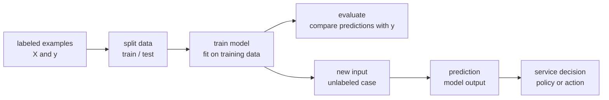

# P3-2.1 지도학습(supervised learning)

P3-1.2에서는 머신러닝을 “데이터에서 입력과 출력의 관계를 추정하는 접근”으로 보았습니다. 이제 그중 가장 먼저 만나는 형태인 지도학습(supervised learning)을 봅니다.

지도학습은 라벨(label) 또는 목표값(target)이 있는 사례로 모델을 학습하는 방식입니다. 여기서 라벨은 단순한 이름표가 아니라, 모델이 맞추려는 출력입니다. 입력이 주어졌을 때 어떤 결과를 내야 하는지 사례로 보여 주기 때문에 “지도”라는 표현이 붙습니다.

처음 읽을 때는 지도학습을 “문제집과 해설지를 함께 보고 연습한 뒤, 새 문제를 풀어 보는 방식”에 가깝게 생각해도 좋습니다. 다만 모델이 해설을 이해하는 것은 아닙니다. 모델은 많은 사례에서 입력과 출력의 관계를 맞추도록 내부 기준을 조정합니다.

## 이 절의 범위

이 절은 지도학습의 기본 구조를 설명합니다. 선형회귀(linear regression), 로지스틱 회귀(logistic regression), 결정트리(decision tree) 같은 개별 알고리즘은 뒤에서 따로 다룹니다. 구체적으로 선형회귀는 P3-10, 로지스틱 회귀는 P3-11, 결정트리는 P3-14에서 다시 다룹니다.

여기서는 다음 질문에 답합니다.

- 지도학습에서 입력과 라벨은 무엇인가?
- 분류(classification)와 회귀(regression)는 어떻게 다른가?
- 학습(training), 평가(evaluation), 예측(prediction)은 어떻게 이어지는가?
- 라벨이 있다고 해서 모델이 정답을 안다는 뜻인가?
- 지도학습에서 가장 먼저 조심해야 할 오해는 무엇인가?

## 이 절의 목표

- 지도학습을 라벨이 있는 사례에서 입력과 출력의 관계를 배우는 방식으로 설명할 수 있습니다.
- 입력 데이터 `X`와 라벨 또는 목표값 `y`의 역할을 구분할 수 있습니다.
- 분류와 회귀의 차이를 예시로 설명할 수 있습니다.
- 학습 데이터와 평가 데이터를 나누는 이유를 말할 수 있습니다.
- 모델의 예측과 서비스의 최종 결정을 구분할 수 있습니다.

## 먼저 한 장면으로 이해하기

고객 문의를 자동으로 분류하는 상황을 생각해 봅니다.

| 고객 문의 내용 | 사람이 붙인 라벨 |
| --- | --- |
| “결제했는데 물건이 아직 안 왔어요.” | 배송 문의 |
| “환불은 어디에서 신청하나요?” | 환불 문의 |
| “비밀번호를 잊어버렸습니다.” | 계정 문의 |

지도학습에서는 이런 사례를 모델에게 보여 줍니다. 문의 내용은 입력이고, 사람이 붙인 문의 유형은 라벨입니다. 모델은 새 문의가 들어왔을 때 어떤 라벨에 가까운지 예측하도록 학습됩니다.

이 예시에서 핵심은 “라벨이 있다”는 점입니다. 라벨이 없으면 모델은 무엇을 맞춰야 하는지 직접적으로 알 수 없습니다. 라벨이 있으므로 모델은 입력과 출력의 관계를 맞추는 방향으로 학습할 수 있습니다.

## 지도학습의 기본 모양

지도학습에서는 사례(example)가 입력과 출력의 쌍으로 준비됩니다.

| 사례 | 입력(feature) | 라벨 또는 목표값(label / target) |
| --- | --- | --- |
| 메일 1 | 제목, 본문 단어, 링크 수, 발신자 정보 | 스팸 |
| 메일 2 | 제목, 본문 단어, 링크 수, 발신자 정보 | 정상 |
| 주택 1 | 면적, 위치, 방 수, 건축 연도 | 가격 |
| 고객 1 | 방문 횟수, 구매 금액, 최근 접속일 | 이탈 여부 |

입력은 보통 `X`로 쓰고, 라벨이나 목표값은 `y`로 씁니다. Part 2에서 본 표 관점으로 보면 `X`는 여러 행과 열을 가진 데이터입니다. 행(row)은 하나의 사례이고, 열(column)은 특징(feature)입니다. `y`는 각 사례에 붙은 답 역할을 합니다.

처음에는 `X`와 `y`를 수학 기호로 외우기보다 다음처럼 읽으면 됩니다.

| 표기 | 먼저 떠올릴 말 | 예시 |
| --- | --- | --- |
| `X` | 모델에게 보여 주는 입력 묶음 | 메일 내용에서 뽑은 특징, 고객 기록, 상품 정보 |
| `y` | 모델이 맞추려는 출력 묶음 | 스팸/정상, 이탈/유지, 가격 |
| 한 행(row) | 하나의 사례 | 메일 하나, 고객 한 명, 주택 하나 |
| 한 열(column) | 하나의 특징 | 링크 수, 구매 금액, 방 수 |

이때 `답`이라는 표현은 조심해야 합니다. 라벨은 학습 데이터에서 모델이 맞추려는 값이지, 현실의 모든 경우에 대해 완전한 진리를 보장하는 값은 아닙니다. 사람이 붙인 라벨에는 오류가 있을 수 있고, 측정값에는 잡음(noise)이 있을 수 있습니다.

## 흐름으로 보기

지도학습의 흐름은 다음처럼 볼 수 있습니다.

이 도식에서 `train model`은 모델이 학습 데이터의 입력과 라벨 사이 관계를 맞추도록 내부 값을 조정하는 단계입니다. `evaluate`는 학습에 쓰지 않은 데이터에서 예측과 실제 라벨을 비교하는 단계입니다. `prediction`은 학습된 모델을 새 입력에 적용하는 단계입니다.

마지막의 `service decision`은 일부러 따로 두었습니다. 모델이 “스팸 가능성 0.92”를 냈다고 해서 서비스가 반드시 차단해야 하는 것은 아닙니다. 서비스는 정책, 비용, 위험, 사용자 경험을 함께 고려해 차단, 검토, 허용 같은 행동을 정할 수 있습니다.

## 학습, 평가, 예측을 구분하기

지도학습을 처음 볼 때 가장 자주 섞이는 말이 학습, 평가, 예측입니다.

| 단계 | 하는 일 | 쉬운 질문 |
| --- | --- | --- |
| 학습(training) | 라벨이 있는 데이터로 모델의 내부 기준을 맞춥니다. | 이 사례들을 보고 어떤 관계를 배울 수 있는가? |
| 평가(evaluation) | 학습에 쓰지 않은 데이터로 모델이 얼마나 맞는지 확인합니다. | 새 사례에서도 잘 맞는가? |
| 예측(prediction) | 학습된 모델을 실제 새 입력에 적용합니다. | 이 새 사례는 어떤 결과일 것인가? |

이 세 단계를 구분하면 “모델을 만들었다”는 말이 더 분명해집니다. 모델을 학습했다는 것과, 모델이 실제로 쓸 만하다는 것과, 모델을 서비스에서 실행한다는 것은 같은 말이 아닙니다.

## 분류와 회귀

지도학습은 크게 분류(classification)와 회귀(regression)로 나누어 설명하는 경우가 많습니다.

| 구분 | 모델이 맞추려는 출력 | 예시 |
| --- | --- | --- |
| 분류(classification) | 범주(category) 또는 클래스(class) | 스팸/정상, 불량/정상, 이탈/유지 |
| 회귀(regression) | 연속적인 숫자값(numeric value) | 주택 가격, 수요량, 온도, 매출 |

분류는 “어느 범주에 속하는가”를 묻습니다. 이메일이 스팸인지 정상인지, 상품 리뷰가 긍정인지 부정인지, 이미지가 고양이인지 개인지 같은 문제입니다.

회귀는 “얼마나 되는가”를 묻습니다. 주택 가격이 얼마인지, 내일 수요가 몇 개인지, 배송 시간이 몇 분 걸릴지 같은 문제입니다.

둘 다 입력과 출력의 관계를 학습한다는 점은 같습니다. 차이는 출력의 성격입니다. 출력이 범주이면 분류에 가깝고, 숫자 크기이면 회귀에 가깝습니다.

## 작은 예시: 공부 시간과 합격 여부

다음처럼 공부 시간과 모의고사 점수, 합격 여부가 있는 작은 데이터를 생각해 봅니다.

| 공부 시간 | 모의고사 점수 | 합격 여부 |
| --- | --- | --- |
| 1시간 | 45점 | 불합격 |
| 2시간 | 55점 | 불합격 |
| 4시간 | 72점 | 합격 |
| 5시간 | 80점 | 합격 |

합격 여부를 맞추려 하면 분류 문제입니다. 모델의 목표는 새 학생의 공부 시간과 모의고사 점수를 보고 `합격` 또는 `불합격`을 예측하는 것입니다.

반대로 실제 시험 점수를 예측하려 하면 회귀 문제입니다. 모델의 목표는 새 학생의 공부 시간과 모의고사 점수를 보고 `몇 점 정도`가 나올지 예측하는 것입니다.

같은 데이터라도 무엇을 `y`로 놓느냐에 따라 문제가 달라집니다. 이것이 지도학습에서 문제 정의가 중요한 이유입니다.

## 라벨은 어디에서 오는가

지도학습은 라벨이 필요합니다. 라벨은 여러 방식으로 만들어질 수 있습니다.

- 사람이 직접 분류합니다.
- 기존 업무 시스템의 결과를 사용합니다.
- 센서나 측정 장비의 기록을 사용합니다.
- 나중에 실제로 발생한 결과를 사용합니다.

예를 들어 고객 이탈 예측에서는 “30일 안에 서비스를 해지했는가” 같은 실제 결과가 라벨이 될 수 있습니다. 불량품 분류에서는 검사자가 붙인 판정이 라벨이 될 수 있습니다. 주택 가격 예측에서는 실제 거래 가격이 목표값이 될 수 있습니다.

라벨이 있다고 해서 항상 좋은 지도학습 문제가 되는 것은 아닙니다. 라벨이 부정확하거나, 라벨 기준이 중간에 바뀌었거나, 라벨이 특정 집단에 편향되어 있으면 모델도 그 문제를 배울 수 있습니다.

## 왜 데이터를 나누는가

모델이 학습 데이터(training data)에만 잘 맞는 것은 충분하지 않습니다. 우리가 원하는 것은 보지 못한 데이터에서도 쓸 만한 모델입니다.

그래서 지도학습에서는 데이터를 나누어 봅니다.

| 데이터 구분 | 역할 |
| --- | --- |
| 학습 데이터(training data) | 모델이 관계를 배우는 데 사용합니다. |
| 검증 데이터(validation data) | 모델 선택이나 설정 조정에 사용합니다. |
| 테스트 데이터(test data) | 마지막 성능 확인에 사용합니다. |

입문 단계에서는 학습 데이터와 테스트 데이터의 구분만 먼저 이해해도 좋습니다. 핵심은 “배운 문제를 다시 맞히는 것”과 “처음 보는 문제를 맞히는 것”이 다르다는 점입니다.

## 지도학습에서 처음 조심할 오해

지도학습을 처음 배울 때는 다음 오해를 피해야 합니다.

- 라벨이 있으면 문제가 쉬워진다고 보지 않습니다.
- 라벨을 현실의 완전한 정답으로 보지 않습니다.
- 학습 데이터 성능을 실제 서비스 성능으로 보지 않습니다.
- 모델 예측을 서비스의 최종 결정으로 보지 않습니다.
- 분류와 회귀를 알고리즘 이름으로 구분하지 않습니다. 먼저 출력의 성격을 봅니다.

지도학습은 “정답을 알려 주고 외우게 하는 방식”이 아닙니다. 더 정확히는 라벨이 있는 사례를 이용해 입력과 출력의 관계를 추정하고, 그 관계가 새 사례에도 일반화되는지 확인하는 방식입니다.

## 이 절에서 기억할 관점

- 지도학습은 입력 `X`와 라벨 또는 목표값 `y`가 있는 사례에서 관계를 배우는 방식입니다.
- 라벨은 모델이 맞추려는 출력이지만, 현실의 완전한 진리를 보장하지는 않습니다.
- 분류는 범주를 맞추고, 회귀는 숫자값을 예측합니다.
- 학습은 관계를 맞추는 단계이고, 평가는 보지 못한 데이터에서 확인하는 단계입니다.
- 모델의 예측과 서비스의 최종 결정은 분리해서 봐야 합니다.

## 체크리스트

- 지도학습을 라벨이 있는 사례에서 배우는 방식으로 설명할 수 있는가?
- `X`와 `y`의 역할을 말할 수 있는가?
- 분류와 회귀를 예시로 구분할 수 있는가?
- 라벨이 있어도 오류와 편향이 있을 수 있음을 설명할 수 있는가?
- 학습 데이터와 테스트 데이터를 나누는 이유를 말할 수 있는가?
- 모델 예측과 서비스 결정을 구분할 수 있는가?

## 출처와 참고 자료

- scikit-learn developers, `Supervised learning`, scikit-learn User Guide, 확인 날짜: 2026-06-25. [https://scikit-learn.org/stable/supervised_learning.html](https://scikit-learn.org/stable/supervised_learning.html){: target="_blank" rel="noopener noreferrer" }
- Google for Developers, `Supervised Learning`, Machine Learning, 확인 날짜: 2026-06-25. [https://developers.google.com/machine-learning/intro-to-ml/supervised](https://developers.google.com/machine-learning/intro-to-ml/supervised){: target="_blank" rel="noopener noreferrer" }
