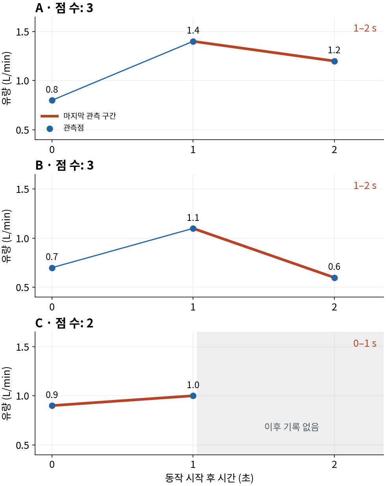
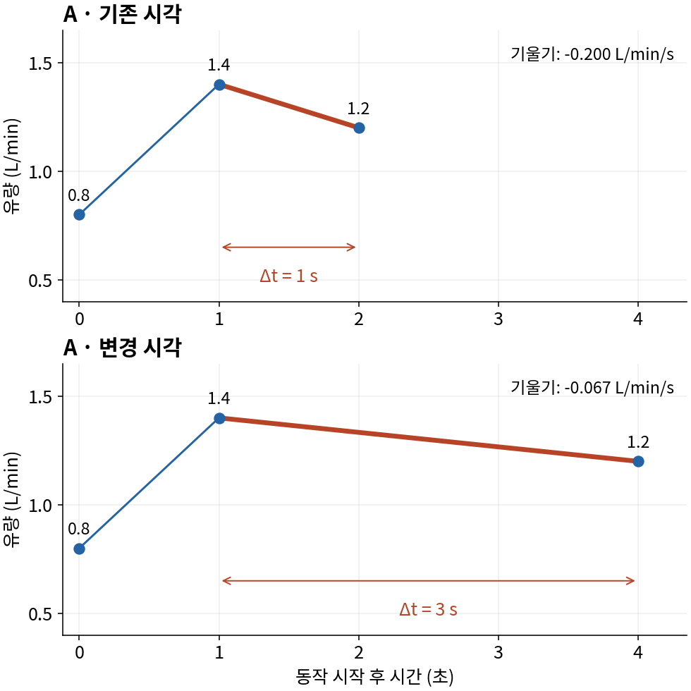

# P3-2.1 저장된 기록은 왜 분석 목적에 맞게 다시 구성해야 하는가

> Section ID: `P3-2.1`
> Version: `v2026.09.19`

데이터베이스의 데이터 모델링은 저장할 대상과 관계를 표현하는 일에 쓰입니다. 이 Part에서는 저장된 기록으로 어떤 질문에 답할지 정하고, 그에 맞게 샘플과 열을 구성하는 일에 초점을 둡니다. 저장 목적과 분석 목적이 다르면 같은 기록도 다르게 묶어야 합니다.

[데이터셋(dataset)](../../../reference/concept-glossary-parts/03-digeut.md#glossary-dataset)은 데이터를 모아 놓은 집합입니다. 원시 로그, 이미지 모음, 라벨 없는 기록도 데이터셋일 수 있습니다. 다만 데이터셋이 있다는 사실만으로 특정 분석이나 학습에 바로 쓸 준비가 끝났다는 뜻은 아닙니다. 이 절의 `데이터셋 후보`는 현재 질문에 맞는 샘플 단위와 열 구성을 검토 중인 자료를 뜻합니다.

저장 표의 한 행과 분석할 샘플은 같을 수도, 다를 수도 있습니다. 다음 측정값을 예측한다면 시점별 행이 출발점이 될 수 있고, 동작 전체를 비교한다면 여러 행을 동작 1회로 묶어야 합니다.

예를 들어 자동으로 실행되는 동작의 원천데이터가 있다고 하겠습니다. 시간 순서대로 쌓인 제어 파라미터와 센서 값은 저장용 테이블에 바로 담을 수 있습니다. 한 행마다 시점, 센서 이름, 측정값, 제어 설정값을 넣으면 됩니다. 이 구조는 기록을 보존하고, 문제가 생겼을 때 세부 흐름을 다시 보는 데 적합합니다.

하지만 이 표를 그대로 보고 `이번 동작은 평소보다 길었는가`, `후반 하강이 유난히 느렸는가`, `최근 20건은 기준선과 비교해 달라졌는가` 같은 질문에 바로 답하기는 어렵습니다. 왜냐하면 저장 구조의 한 행은 보통 `한 시점의 기록`이고, 지금 질문이 요구하는 비교 단위는 `동작 1회`나 `여러 동작을 묶은 최근 구간`이기 때문입니다. 즉 저장된 기록이 있어도 동작 단위 비교에 필요한 표가 준비된 것은 아닙니다.

이 차이를 분명히 보기 위해 저장 구조와 문제 표현 구조를 나란히 놓고 보겠습니다.

| 구분 | 한 행이 뜻하는 것 | 주된 목적 |
| --- | --- | --- |
| 저장 구조 | 한 시점의 기록, 센서 측정, 제어 설정 | 원천데이터 보존과 추적 |
| 문제 표현 구조 | 동작 1회 요약, 최근 구간 비교, 기준선 집계 | 비교, 해석, 학습 준비 |

이 구분을 실제 표에 적용하면, 먼저 아래 세 질문으로 행의 의미와 비교 가능성을 확인할 수 있습니다.

| 처음 표를 받았을 때 먼저 묻는 질문 | 이 질문이 필요한 이유 |
| --- | --- |
| 한 행은 한 시점 기록인가, 동작 1회 요약인가 | 행 의미가 다르면 바로 뒤의 샘플 단위도 달라지기 때문 |
| 지금 이 표로 바로 비교가 가능한가 | 저장 구조는 기록 보존에는 강하지만 비교에는 약할 수 있기 때문 |
| 이상해 보이는 값이 나오면 다시 어디로 돌아갈 것인가 | 문제 표현 구조만으로는 세부 원인을 다 설명하지 못하기 때문 |

이 세 질문은 `지금 손에 있는 데이터셋이 현재 질문에 바로 쓸 수 있는가, 재구성이 필요한가`를 빠르게 가르는 기준입니다. 첫 질문은 행의 뜻을 묻고, 둘째 질문은 비교 가능성을 묻고, 셋째 질문은 원시 로그를 언제 다시 열어야 하는지 묻습니다. 데이터 모델링은 이 세 질문에 답할 수 있게 저장된 기록을 다시 표현하는 일입니다.

저장 구조에서는 빠짐없이 남기는 것이 중요합니다. 반면 문제 표현 구조에서는 `무엇을 남길 것인가`와 `무엇을 버릴 것인가`를 판단해야 합니다. 예를 들어 동작 1회 전체를 샘플로 보겠다고 결정했다면, 원시 기록을 보존하면서 별도로 관측된 시간 범위, 평균 유량, 마지막 관측 구간의 기울기 같은 요약값을 새 열로 만들 수 있습니다. 이것은 저장 구조를 훼손하는 일이 아니라, 다른 질문에 답하기 위해 새로운 표현을 설계하는 일입니다.

아래 작은 표를 보면 같은 원천데이터도 목적에 따라 어떻게 다르게 읽히는지 바로 드러납니다.

| 구조 | 예시 열 | 한 행이 뜻하는 것 |
| --- | --- | --- |
| 저장 구조 | `timestamp`, `sensor_name`, `value` | 한 시점 기록 |
| 문제 표현 구조 | `event_id`, `mean_flow`, `last_interval_slope` | 동작 1회 요약 |

## 기록 보존에서 질문에 맞는 재구성으로 {#_1}

저장된 기록에 질문에 맞는 재구성이 필요할 수 있다는 점은, 아래처럼 `기록 보존`과 `질문에 맞는 재묶음`이 어디서 갈리는지로 읽으면 더 분명해집니다.

<div class="aibook-diagram-scroll" role="region" tabindex="0" aria-label="도식: 좌우로 스크롤하여 확인" markdown="1">
<div class="aibook-diagram-canvas" markdown="1">

```mermaid
--8<-- "assets/part-03/chapter-02/p3-2-1-mermaid-01-ko.mmd"
```

</div>
</div>

## 요약 한 행에서 원래 기록을 찾아가기

다음은 앞 Chapter의 A-101과는 별개인 가상 기록 A·B·C입니다. `event_id`는 동작 식별자, `second`는 동작 시작 뒤 경과 시간(초), `flow`는 유량(L/min)입니다. 먼저 A의 세 기록만 보겠습니다.

| event_id | second | flow (L/min) |
| --- | ---: | ---: |
| A | 0 | 0.8 |
| A | 1 | 1.4 |
| A | 2 | 1.2 |

A를 한 행으로 묶으면 기록 수는 3, 관측 시각의 범위는 `2−0 = 2초`, 평균 유량은 `(0.8+1.4+1.2)/3 ≈ 1.13 L/min`입니다. 마지막 관측 구간의 기울기는 `(1.2−1.4)/(2−1) = −0.2 L/min/s`입니다. 평균과 기울기의 계산 의미는 [P3-1.1](../chapter-01/section-01.md)과 같습니다.

| 요약 행에 남는 것 | 이 요약만으로 복원할 수 없는 것 | 다시 확인할 근거 |
| --- | --- | --- |
| 식별자 A, 점 수 3, 관측 범위 2초 | 각 시각의 측정값 전체 | 원시 표에서 `event_id=A`인 행 |
| 평균 1.13 L/min, 마지막 기울기 −0.2 L/min/s | 1초에 1.4까지 올라갔던 전체 변화 순서 | A의 시각과 유량을 순서대로 읽은 기록 |
| 저장된 점 수에 대한 조건 통과 여부 | 실제 종료까지 관측했는지, 중간 기록이 빠졌는지 | 동작 종료 기록과 측정 간격·누락 점검 |

식별자를 함께 남기면 요약에서 원시 기록으로 돌아갈 수 있습니다. 실제 자료에서 동작 ID가 장비마다 반복된다면 장비 ID도 함께 사용해야 합니다. 아래 예제에서는 A·B·C가 서로 다른 동작을 유일하게 가리킨다고 가정합니다.

## 점 수 조건을 바꾸어 후보가 달라지는지 확인하기

문제 상황: A·B는 3개, C는 2개의 관측점이 있습니다. 같은 집계 코드를 적용한 뒤 점 수 조건을 3에서 2로 바꿔 어느 동작이 조건을 통과하는지 확인합니다.

입력(input): `event_id`별 시점 기록과 최소 관측점 수 `min_points_per_event`.

기대 출력(output): 원시 표, 동작별 요약 표, 점 수 조건을 통과한 행. 통과 여부는 동작이 완전하다거나 서로 비교 가능하다는 최종 판정이 아닙니다.

확인할 개념: 계산할 값이 있다는 사실, 점 수 조건을 통과한다는 사실, 동작 전체를 관찰했다는 사실을 나눠 읽습니다. 두 점이면 마지막 관측 구간의 기울기는 계산할 수 있습니다. 기본값 3은 이 실험에서 정한 후보 선택 조건이며, 모든 지표의 수학적 최소 점 수가 아닙니다.

이 입력에는 결측값·중복 시각이 없고 관측 간격은 모두 1초입니다. 아래 코드의 기울기 계산은 이 고정 간격을 전제로 합니다. 시각을 바꾸려면 실제 시간 차로 나누도록 계산도 바꿔야 합니다. `observed_span_seconds`는 저장된 마지막 시각과 첫 시각의 차이로, 종료가 확인된 실제 동작 시간과 구분합니다.

```python
# 저장된 시점별 기록을 event 단위 데이터셋 후보로 다시 묶는 예제입니다.
import pandas as pd

pd.set_option("display.max_columns", None)
pd.set_option("display.width", 120)

min_points_per_event = 3  # 2로 낮춰 C의 통과 여부를 비교합니다. 종료 확인 조건은 아닙니다.

storage_table = pd.DataFrame(
    [
        {"event_id": "A", "second": 0, "flow": 0.8},
        {"event_id": "A", "second": 1, "flow": 1.4},
        {"event_id": "A", "second": 2, "flow": 1.2},
        {"event_id": "B", "second": 0, "flow": 0.7},
        {"event_id": "B", "second": 1, "flow": 1.1},
        {"event_id": "B", "second": 2, "flow": 0.6},
        {"event_id": "C", "second": 0, "flow": 0.9},
        {"event_id": "C", "second": 1, "flow": 1.0},
    ]
)

storage_table = storage_table.sort_values(["event_id", "second"])

dataset_candidate = (
    storage_table.groupby("event_id")
    .agg(
        point_count=("second", "count"),
        observed_span_seconds=("second", lambda values: values.max() - values.min()),
        mean_flow=("flow", "mean"),
        last_interval_slope=("flow", lambda values: values.iloc[-1] - values.iloc[-2] if len(values) >= 2 else float("nan")),
    )
    .reset_index()
)
dataset_candidate["passes_point_count"] = (
    dataset_candidate["point_count"] >= min_points_per_event
)
count_filtered_candidate = dataset_candidate[dataset_candidate["passes_point_count"]]

print("1) stored time-step records")
print(storage_table)
print()
print(f"2) event-level dataset candidate when min_points_per_event = {min_points_per_event}")
print(dataset_candidate.round(2))
print()
print("3) rows passing the point-count condition")
print(count_filtered_candidate.round(2))
```

예상 출력:

```text
1) stored time-step records
  event_id  second  flow
0        A       0   0.8
1        A       1   1.4
2        A       2   1.2
3        B       0   0.7
4        B       1   1.1
5        B       2   0.6
6        C       0   0.9
7        C       1   1.0

2) event-level dataset candidate when min_points_per_event = 3
  event_id  point_count  observed_span_seconds  mean_flow  last_interval_slope  passes_point_count
0        A            3                      2       1.13                 -0.2                True
1        B            3                      2       0.80                 -0.5                True
2        C            2                      1       0.95                  0.1               False

3) rows passing the point-count condition
  event_id  point_count  observed_span_seconds  mean_flow  last_interval_slope  passes_point_count
0        A            3                      2       1.13                 -0.2                True
1        B            3                      2       0.80                 -0.5                True
```

첫 표의 한 행은 한 시점 기록이고 둘째 표의 한 행은 동작 식별자 하나에 연결된 요약입니다. `passes_point_count`의 True는 **점 수 조건만 통과했다**는 뜻입니다. 기본값 3에서는 A·B만 통과합니다. 2로 낮추면 C도 통과하지만 C의 기울기 +0.1은 0~1초, A·B의 기울기는 1~2초를 요약합니다. 같은 이름의 열이 서로 다른 구간을 가리키므로 이 값만으로 끝부분의 차이를 비교하면 안 됩니다.

아래 차트는 세 동작을 같은 축으로 맞춘 것입니다. 점은 관측값이고 굵은 선은 각각의 마지막 관측 구간입니다. 점 사이의 연결은 측정 순서를 나타내며 관측 사이의 실제 변화 경로를 확인한 것은 아닙니다.

<div class="aibook-diagram-scroll" role="region" tabindex="0" aria-label="차트: 좌우로 스크롤하여 확인" markdown="1">
<div class="aibook-diagram-canvas" style="min-width: 700px" markdown="1">



</div>
</div>

C의 1초 이후 회색 영역은 이후 기록이 없다는 뜻입니다. 유량이 0이거나 동작이 끝났다는 뜻이 아니므로 그 영역으로 선을 연장하지 않았습니다.

특히 `observed_span_seconds=1`인 C를 보고 동작이 1초 만에 끝났다고 말할 수 없습니다. 1초에 실제 종료했을 수도 있고, 동작은 계속됐지만 이후 기록이 빠졌을 수도 있습니다. A·B도 점이 세 개라는 이유만으로 종료까지 관측했다고 확정할 수 없습니다. 이 입력에는 종료 확인 정보가 없습니다.

점 수와 측정 간격이 별개라는 점도 확인해 보세요. A의 시각만 0·1·4초로 바뀌었다면 점 수는 여전히 3이고 평균 유량도 같습니다. 하지만 관측 범위는 4초, 마지막 기울기는 `(1.2−1.4)/(4−1) ≈ −0.067 L/min/s`입니다. 1초 간격을 가정한 코드를 그대로 쓰면 −0.2가 나오므로 잘못된 해석이 됩니다. 이 비교는 **점을 충분히 셌다는 사실이 시간축 확인을 대신하지 못함**을 보여 줍니다.

아래 두 패널은 같은 축 범위와 같은 유량값을 사용합니다. 마지막 관측 시각만 2초에서 4초로 바꿨습니다.

<div class="aibook-diagram-scroll" role="region" tabindex="0" aria-label="차트: 좌우로 스크롤하여 확인" markdown="1">
<div class="aibook-diagram-canvas" style="min-width: 700px" markdown="1">



</div>
</div>

유량 차이는 모두 −0.2 L/min이지만 위에서는 1초, 아래에서는 3초에 걸친 차이입니다. 기울기가 완만해진 이유는 점 수나 유량 차이가 아니라 시간 분모가 달라졌기 때문입니다. 연결선은 구간 내내 일정한 속도로 변했다고 확인한 선이 아닙니다.

같은 데이터를 저장 구조 그대로 들고 가면 실제로 어디서 막히는지도 짧게 확인해 볼 수 있습니다.

| 바로 묻고 싶은 질문 | 저장 구조를 그대로 쓸 때 생기는 문제 |
| --- | --- |
| 이번 동작 1회는 평소보다 길었는가 | 시점별 기록만으로는 실제 종료를 확인할 수 없으며 시작·종료 기록도 필요하다 |
| 후반 하강이 느린 동작만 고를 수 있는가 | 후반 구간을 먼저 묶어 요약하지 않으면 비교 열이 없다 |
| 최근 20건과 이전 200건을 바로 비교할 수 있는가 | 동작 식별자가 있어도 최근·과거 묶음의 기간과 조건은 따로 정해야 한다 |

즉 저장 구조는 `무슨 일이 기록되었는가`를 잘 보여 주지만, `무엇을 한 건으로 비교할 것인가`를 자동으로 정해 주지는 않습니다. 데이터셋 후보를 다시 만든다는 말은 바로 이 빈칸을 채운다는 뜻입니다.

여기서 주의할 점이 있습니다. 문제 표현 구조가 저장 구조를 대체하는 것은 아닙니다. 요약 표를 만들었다고 해서 원시 로그가 필요 없어지는 것이 아닙니다. 오히려 요약 표에서 이상한 변화가 보이면 다시 저장 구조로 돌아가 세부 시점을 확인해야 합니다. 즉 저장 구조는 근거를 보존하고, 문제 표현 구조는 비교를 가능하게 만듭니다. 둘은 경쟁 관계가 아니라 역할이 다른 연결 구조입니다.

이 관계를 더 짧게 정리하면 다음과 같습니다.

| 질문 | 저장 구조가 강한가 | 문제 표현 구조가 강한가 |
| --- | --- | --- |
| 실제로 어떤 값이 기록되었는가 | 예 | 부분적으로만 |
| 이번 동작 1회는 어떤 구조였는가 | 어렵다 | 예 |
| 최근 구간이 평소와 달라졌는가 | 어렵다 | 예 |

이 표를 보면 저장 구조와 문제 표현 구조의 차이가 단지 `테이블 모양 차이`가 아니라 `답할 수 있는 질문의 차이`라는 점이 드러납니다. 표를 어떻게 저장했는지와, 표로 어떤 질문에 답할 수 있는지는 같은 문제가 아니기 때문입니다. 그래서 Part 3 앞단에서 먼저 해야 할 일은 기록을 보며 모델 이름을 떠올리는 것이 아니라, 이 기록이 어떤 데이터셋 후보로 다시 읽혀야 하는지 묻는 일입니다.

더 넓게 보면 이 절은 `원천 기록 보존`, `분석 단위 재설정`, `파생 표현 생성`이 서로 다른 층위의 일이라는 점을 구분해, 현재 질문에 어떤 재구성과 추가 확인이 필요한지 판단합니다.


따라서 먼저 확인할 것은 자료의 이름이 아니라, 현재 질문에 답할 단위와 파생 표현이 정해졌는가입니다.

## 체크리스트

- A의 요약 행에서 원래 세 기록을 찾아 평균과 마지막 구간 기울기를 재현할 수 있는가?
- 요약 표에 남는 정보와 원시 표를 다시 열어야 알 수 있는 정보를 각각 하나씩 적었는가?
- `min_points_per_event`를 2로 낮췄을 때 C가 통과하더라도 A·B와 같은 구간의 기울기라고 말할 수 없는 이유는 무엇인가?
- 세 점을 확보했어도 동작 전체를 관측했다고 단정하지 않으려면 어떤 종료 정보와 측정 간격을 확인해야 하는가?
- C가 점 수 조건에서 빠져도 원시 기록과 요약 후보 자체가 사라지지 않는지 출력에서 확인했는가?

## 출처와 참고 자료

- Google for Developers, `Machine Learning Glossary`의 `example`, `labeled example`, `feature`. example 단위와 feature 역할을 분리해 설명하므로, 저장된 행과 비교 가능한 샘플 행이 다를 수 있다는 이 절의 핵심을 뒷받침합니다. [https://developers.google.com/machine-learning/glossary](https://developers.google.com/machine-learning/glossary){: target="_blank" rel="noopener noreferrer" } / 확인일: 2026-07-20
- Oracle, `Introduction to Data Warehousing Concepts`. 데이터웨어하우스가 비즈니스 인텔리전스 활동, 질의와 분석, 기록 유지, 데이터 분석을 위해 설계된 구조라고 설명하므로, 저장된 구조 자체가 분석 목적으로 설계될 수도 있다는 배경 자료입니다. 저장 표가 언제나 분석에 부적합하다는 뜻은 아닙니다. [https://docs.oracle.com/en/database/oracle/oracle-database/26/dwhsg/introduction-data-warehouse-concepts.html](https://docs.oracle.com/en/database/oracle/oracle-database/26/dwhsg/introduction-data-warehouse-concepts.html){: target="_blank" rel="noopener noreferrer" } / 확인일: 2026-07-20
- W3C, `PROV-Overview`. provenance, derivation, traceability를 함께 다루므로, 저장 구조는 원시 근거를 남기고 문제 표현 구조는 다른 질문에 맞는 파생 표현을 만든다는 상위 프레임을 보강합니다. [https://www.w3.org/TR/prov-overview/](https://www.w3.org/TR/prov-overview/){: target="_blank" rel="noopener noreferrer" } / 확인일: 2026-07-20
- Hadley Wickham, `Tidy Data`, *Journal of Statistical Software* 59(10), 2014. 변수, 관측치, 표 구조의 관계를 정리하므로, 저장 구조의 한 행과 분석용 표의 한 행이 같은 뜻이 아닐 수 있다는 설명의 일반 원리를 제공합니다. [https://www.jstatsoft.org/article/view/v059i10](https://www.jstatsoft.org/article/view/v059i10){: target="_blank" rel="noopener noreferrer" } / 확인일: 2026-07-20

- [Google Machine Learning Glossary](https://developers.google.com/machine-learning/glossary){: target="_blank" rel="noopener noreferrer" }. dataset과 labeled/unlabeled example의 구분을 확인했다. 확인일: 2026-09-15.
