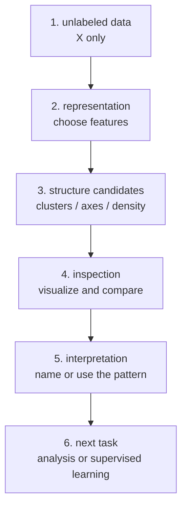

# P3-2.2 비지도학습(unsupervised learning)

P3-2.1에서는 라벨(label)이 있는 사례로 모델을 학습하는 지도학습(supervised learning)을 봤습니다. 이번에는 라벨이 없는 데이터에서 구조를 찾는 비지도학습(unsupervised learning)을 봅니다.

비지도학습은 “정답 없이 아무렇게나 학습한다”는 뜻이 아닙니다. 더 안전하게 말하면, 사람이 미리 붙인 라벨 없이 데이터 안의 비슷함, 묶음, 축, 밀도, 이상한 점을 찾아보는 접근입니다. 모델이 정답을 맞히는 것이 아니라, 사람이 데이터를 더 잘 이해하거나 다음 작업을 하기 위해 구조 후보를 만드는 경우가 많습니다.

## 이 절의 범위

이 절은 비지도학습의 기본 직관을 설명합니다. k-means, PCA, t-SNE, DBSCAN 같은 개별 알고리즘의 수식과 구현은 여기서 깊게 다루지 않습니다. k-means와 DBSCAN은 P3-17 클러스터링에서, PCA와 t-SNE는 P3-18 차원 축소에서 다시 다룹니다.

여기서는 다음 질문에 답합니다.

- 라벨이 없다는 것은 무엇인가?
- 비지도학습은 무엇을 배우는가?
- 군집화(clustering), 차원 축소(dimensionality reduction), 이상치 탐지(outlier detection)는 어떤 문제인가?
- 비지도학습 결과를 왜 조심해서 해석해야 하는가?
- 지도학습과 비지도학습은 실제 작업에서 어떻게 이어질 수 있는가?

## 이 절의 목표

- 비지도학습을 라벨 없는 데이터에서 구조를 찾는 접근으로 설명할 수 있습니다.
- 군집화, 차원 축소, 이상치 탐지의 차이를 예시로 구분할 수 있습니다.
- “비슷한 데이터끼리 묶인다”는 말이 자동으로 의미 있는 정답을 보장하지 않음을 설명할 수 있습니다.
- 비지도학습 결과를 사람이 해석하고 검토해야 한다는 점을 이해할 수 있습니다.
- 비지도학습이 이후 지도학습이나 데이터 분석의 준비 단계로 쓰일 수 있음을 말할 수 있습니다.

## 먼저 한 장면으로 이해하기

온라인 쇼핑몰의 고객 데이터를 생각해 봅니다. 다음과 같은 정보는 있지만, 아직 “고객 유형” 라벨은 없다고 해 보겠습니다.

| 고객 | 최근 30일 방문 횟수 | 구매 횟수 | 평균 구매 금액 | 쿠폰 사용 여부 |
| --- | ---: | ---: | ---: | --- |
| 고객 A | 20 | 8 | 높음 | 자주 사용 |
| 고객 B | 3 | 0 | 낮음 | 거의 사용 안 함 |
| 고객 C | 18 | 7 | 높음 | 자주 사용 |
| 고객 D | 5 | 1 | 중간 | 가끔 사용 |

지도학습이라면 각 고객에 `우수 고객`, `이탈 위험`, `일반 고객` 같은 라벨이 붙어 있을 수 있습니다. 하지만 비지도학습에서는 그런 라벨 없이 시작합니다. 대신 데이터가 자연스럽게 비슷한 고객끼리 묶이는지, 어떤 축으로 차이가 나는지, 유난히 다른 고객이 있는지를 살펴봅니다.

여기서 중요한 점은 모델이 고객 유형의 의미를 자동으로 이해하는 것이 아니라는 점입니다. 모델은 비슷한 패턴을 찾을 수 있습니다. 그러나 그 묶음이 “우수 고객”인지, “쿠폰 민감 고객”인지, “일시적 이벤트 참여자”인지는 사람이 데이터와 업무 맥락을 보고 해석해야 합니다.

## 지도학습과 비교하기

지도학습과 비지도학습은 데이터의 모양부터 다르게 보입니다.

| 구분 | 지도학습(supervised learning) | 비지도학습(unsupervised learning) |
| --- | --- | --- |
| 데이터 | 입력 `X`와 라벨 `y`가 함께 있습니다. | 입력 `X`만 있고 명시적 라벨 `y`가 없습니다. |
| 질문 | 이 입력의 정답 출력은 무엇인가? | 이 데이터 안에 어떤 구조가 있는가? |
| 대표 문제 | 분류, 회귀 | 군집화, 차원 축소, 이상치 탐지 |
| 결과 해석 | 실제 라벨과 비교해 성능을 평가하기 쉽습니다. | 결과의 의미를 사람이 해석하고 검증해야 합니다. |
| 예시 | 메일이 스팸인지 정상인지 예측합니다. | 비슷한 메일 유형을 묶어 봅니다. |

비지도학습에서는 라벨이 없기 때문에 “정답과 비교해 몇 퍼센트 맞았다”처럼 단순하게 말하기 어렵습니다. 대신 묶음이 업무적으로 의미 있는지, 시각화가 데이터 이해에 도움이 되는지, 이상치 후보가 실제로 점검할 가치가 있는지를 따져야 합니다.

## 흐름으로 보기

비지도학습의 기본 흐름은 다음처럼 볼 수 있습니다.

이 도식에서 핵심은 `human interpretation`입니다. 비지도학습 결과는 데이터 안의 구조 후보입니다. 모델이 만든 묶음이나 축은 사람이 이름을 붙이고, 업무적으로 쓸 수 있는지 확인해야 합니다.

## 비지도학습에서 자주 만나는 세 문제

비지도학습은 여러 방식으로 쓰입니다. 입문 단계에서는 다음 세 가지를 먼저 구분하면 충분합니다.

| 문제 | 질문 | 쉬운 예시 |
| --- | --- | --- |
| 군집화(clustering) | 비슷한 사례끼리 묶이는가? | 비슷한 구매 패턴의 고객을 묶습니다. |
| 차원 축소(dimensionality reduction) | 많은 특징을 더 적은 축으로 요약할 수 있는가? | 100개 특징을 2차원 그림으로 줄여 봅니다. |
| 이상치 탐지(outlier detection) | 다른 사례와 유난히 다른 점이 있는가? | 평소와 다른 결제 패턴을 점검 후보로 찾습니다. |

scikit-learn의 비지도학습 문서도 군집화, 다양체 학습(manifold learning), 행렬 분해(matrix factorization), 이상치 탐지, 밀도 추정(density estimation) 같은 여러 범주를 다룹니다. 이 절에서는 그중 초심자가 먼저 이해하기 쉬운 군집화, 차원 축소, 이상치 탐지를 중심으로 봅니다.

## 군집화: 비슷한 것끼리 묶기

군집화(clustering)는 라벨 없는 데이터를 비슷한 사례끼리 묶어 보는 접근입니다.

고객 데이터에서 방문 횟수와 구매 횟수를 기준으로 보면 다음과 같은 묶음이 보일 수 있습니다.

| 묶음 후보 | 데이터에서 보이는 패턴 | 사람이 붙일 수 있는 해석 |
| --- | --- | --- |
| 묶음 A | 방문도 많고 구매도 많음 | 활동적인 고객 |
| 묶음 B | 방문은 많지만 구매는 적음 | 탐색 고객 또는 가격 비교 고객 |
| 묶음 C | 방문도 구매도 적음 | 휴면 고객 후보 |

하지만 이 이름은 모델이 알려 준 것이 아닙니다. 사람이 데이터를 보고 붙인 해석입니다. 군집화 결과는 “이런 묶음이 보인다”는 출발점이지, 곧바로 “이 고객은 반드시 이런 사람이다”라는 결론은 아닙니다.

Google의 클러스터링 설명도 라벨 없는 예시를 유사도(similarity)에 따라 묶는 방식으로 설명합니다. 특히 실제 적용에서는 어떤 유사도 기준을 쓸지 명시해야 하며, 특징이 많아질수록 비교가 더 복잡해진다는 점을 강조합니다.

## 차원 축소: 많이 보이는 것을 적게 그려 보기

차원 축소(dimensionality reduction)는 많은 특징을 더 적은 수의 축으로 줄여 보는 접근입니다.

예를 들어 고객 한 명을 설명하는 특징이 50개라면 사람이 한눈에 보기 어렵습니다. 차원 축소는 이 정보를 2개나 3개의 축으로 줄여 시각화하거나, 중요한 변화 방향을 보기 쉽게 만들 수 있습니다.

차원 축소는 정보를 버리는 작업일 수 있습니다. 따라서 “2차원 그림에서 가까워 보인다”는 이유만으로 실제 데이터에서도 반드시 같은 의미라고 단정하면 안 됩니다. 어떤 정보가 보존되고 어떤 정보가 줄어들었는지 확인해야 합니다.

## 이상치 탐지: 다른 점을 점검 후보로 보기

이상치 탐지(outlier detection)는 대부분의 사례와 다르게 보이는 데이터를 찾는 접근입니다.

예를 들어 결제 서비스에서 평소와 다른 시간, 다른 금액, 다른 지역에서 결제가 발생하면 이상치 후보가 될 수 있습니다. 그러나 이상치가 곧 부정 거래라는 뜻은 아닙니다. 여행 중 결제일 수도 있고, 정상적인 고가 구매일 수도 있습니다.

그래서 비지도학습 결과는 보통 “점검 후보”로 읽는 것이 안전합니다. 모델이 이상하다고 표시한 이유를 살펴보고, 실제 업무 기준과 결합해 판단해야 합니다.

## 결과를 해석할 때 조심할 점

비지도학습은 라벨이 없기 때문에 결과 해석이 특히 중요합니다.

- 모델이 만든 묶음은 자동으로 의미 있는 집단이 아닙니다.
- 가까운 점들이 항상 같은 원인으로 가까운 것은 아닙니다.
- 차원 축소 그림은 원래 데이터의 모든 정보를 보존하지 않을 수 있습니다.
- 이상치 후보는 실제 오류, 위험, 부정행위와 다를 수 있습니다.
- 결과에 이름을 붙이는 순간 사람의 해석이 들어갑니다.

따라서 비지도학습은 “정답을 찾았다”보다 “데이터를 이해할 후보 구조를 찾았다”로 읽는 편이 안전합니다.

## 지도학습으로 이어질 수 있는 자리

비지도학습은 지도학습과 완전히 분리된 세계가 아닙니다. 실제 작업에서는 서로 이어질 수 있습니다.

예를 들어 고객을 군집화한 뒤, 각 군집의 행동을 분석해 마케팅 전략을 다르게 세울 수 있습니다. 또는 군집 ID를 새로운 특징(feature)으로 사용해 지도학습 모델에 넣을 수도 있습니다. 차원 축소로 데이터를 시각화한 뒤, 어떤 라벨 오류가 있는지 점검할 수도 있습니다.

이때도 주의할 점은 같습니다. 비지도학습 결과는 다음 작업의 재료가 될 수 있지만, 그 자체가 현실의 정답을 보장하지는 않습니다.

## 이 절에서 기억할 관점

- 비지도학습은 라벨 없는 데이터에서 구조 후보를 찾는 접근입니다.
- 군집화는 비슷한 사례를 묶고, 차원 축소는 많은 특징을 적은 축으로 줄여 보고, 이상치 탐지는 유난히 다른 사례를 점검 후보로 찾습니다.
- 비지도학습 결과에는 사람이 해석을 붙여야 합니다.
- 라벨이 없기 때문에 지도학습처럼 정답과 직접 비교해 평가하기 어렵습니다.
- 비지도학습은 데이터 이해, 시각화, 점검 후보 찾기, 다음 지도학습 준비에 쓰일 수 있습니다.

## 체크리스트

- 비지도학습을 라벨 없는 데이터에서 구조를 찾는 접근으로 설명할 수 있는가?
- 군집화, 차원 축소, 이상치 탐지를 예시로 구분할 수 있는가?
- 군집화 결과의 이름은 모델이 아니라 사람이 붙이는 해석임을 말할 수 있는가?
- 차원 축소 그림을 원래 데이터의 완전한 설명으로 보지 않을 수 있는가?
- 이상치 후보와 실제 위험을 구분할 수 있는가?
- 비지도학습 결과가 지도학습이나 데이터 분석의 준비 단계가 될 수 있음을 설명할 수 있는가?

## 출처와 참고 자료

- scikit-learn developers, `Unsupervised learning`, scikit-learn User Guide, 확인 날짜: 2026-06-25. [https://scikit-learn.org/stable/unsupervised_learning.html](https://scikit-learn.org/stable/unsupervised_learning.html){: target="_blank" rel="noopener noreferrer" }
- Google for Developers, `What is clustering?`, Machine Learning, 확인 날짜: 2026-06-25. [https://developers.google.com/machine-learning/clustering/overview](https://developers.google.com/machine-learning/clustering/overview){: target="_blank" rel="noopener noreferrer" }
