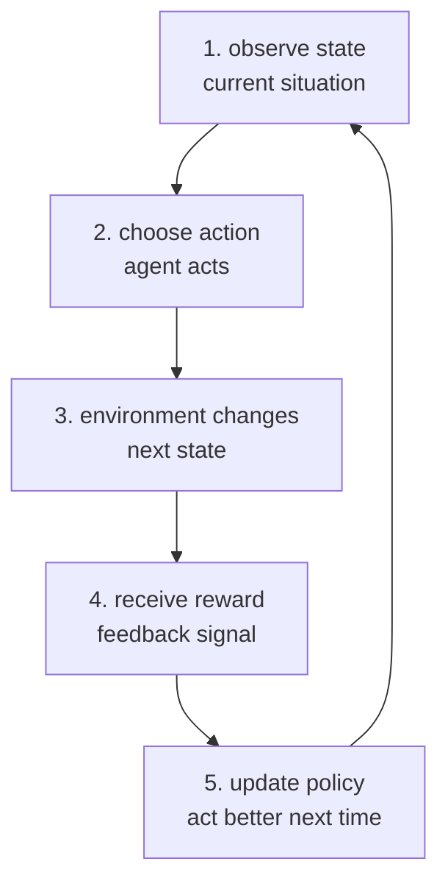

# P3-2.3 강화학습(reinforcement learning)

P3-2.1에서는 라벨(label)이 있는 데이터로 배우는 지도학습(supervised learning)을 봤고, P3-2.2에서는 라벨 없이 데이터 구조를 찾는 비지도학습(unsupervised learning)을 봤습니다. 이번에는 모델이 행동(action)을 하고, 그 결과로 보상(reward)을 받으며, 다음 행동 방식을 조정하는 강화학습(reinforcement learning)을 봅니다.

강화학습은 “정답 라벨을 보고 맞히는 학습”과 다릅니다. 어떤 행동이 즉시 좋은지 항상 알려 주는 것이 아니라, 행동을 해 본 뒤 돌아오는 보상과 다음 상태를 보고 더 나은 행동 방식을 찾아갑니다. 그래서 강화학습은 한 번의 입력과 출력보다, 시간에 따라 이어지는 선택의 흐름을 다루는 학습으로 이해하는 편이 좋습니다.

## 이 절의 범위

이 절은 강화학습의 기본 구조를 설명합니다. Q-learning, SARSA, policy gradient, actor-critic 같은 개별 알고리즘의 수식과 구현은 여기서 다루지 않습니다. Q-learning과 SARSA는 P3-19.1 가치 기반 강화학습에서, policy gradient와 actor-critic은 P3-19.2 정책 기반 강화학습에서 다시 다룹니다. 이 절에서는 먼저 에이전트(agent), 환경(environment), 상태(state), 행동(action), 보상(reward), 정책(policy)의 관계를 잡습니다.

여기서는 다음 질문에 답합니다.

- 강화학습은 지도학습, 비지도학습과 무엇이 다른가?
- 에이전트(agent)와 환경(environment)은 무엇인가?
- 상태(state), 행동(action), 보상(reward), 정책(policy)은 어떻게 이어지는가?
- 보상이 늦게 오는 문제는 왜 어려운가?
- 탐험(exploration)과 활용(exploitation)은 왜 함께 필요한가?

## 이 절의 목표

- 강화학습을 행동과 보상을 통해 정책을 배우는 접근으로 설명할 수 있습니다.
- 에이전트, 환경, 상태, 행동, 보상, 정책의 역할을 구분할 수 있습니다.
- 강화학습이 한 번의 예측보다 순차적 의사결정(sequential decision making)에 가깝다는 점을 이해할 수 있습니다.
- 즉시 보상과 장기 보상이 다를 수 있음을 설명할 수 있습니다.
- 탐험과 활용의 균형이 왜 필요한지 예시로 말할 수 있습니다.

## 먼저 한 장면으로 이해하기

작은 게임을 생각해 봅니다. 캐릭터가 격자판 위에서 움직이고, 목표 지점에 도착하면 점수를 얻습니다.

| 요소 | 쉬운 설명 | 게임 예시 |
| --- | --- | --- |
| 에이전트(agent) | 행동을 선택하는 주체 | 캐릭터 |
| 환경(environment) | 에이전트가 행동하는 세계 | 격자판과 규칙 |
| 상태(state) | 현재 상황을 나타내는 정보 | 캐릭터의 위치 |
| 행동(action) | 선택할 수 있는 움직임 | 위, 아래, 왼쪽, 오른쪽 |
| 보상(reward) | 행동 결과로 받는 숫자 신호 | 목표 도착 `+10`, 벽 충돌 `-1` |
| 정책(policy) | 어떤 상태에서 어떤 행동을 할지 정하는 방식 | “목표에 가까워지는 방향으로 이동” |

지도학습이라면 “이 위치에서는 오른쪽이 정답” 같은 라벨이 미리 있을 수 있습니다. 강화학습에서는 보통 에이전트가 행동을 해 보고, 그 결과로 받은 보상을 이용해 다음 행동 방식을 조정합니다.

## 강화학습의 기본 흐름

강화학습의 가장 기본적인 흐름은 에이전트와 환경의 반복적인 상호작용입니다.

이 도식에서 중요한 점은 순환입니다. 강화학습은 입력 하나를 보고 출력 하나를 맞히는 일회성 문제가 아닙니다. 에이전트가 행동하고, 환경이 바뀌고, 보상이 오고, 그 경험이 다음 행동 방식에 반영됩니다.

MIT Press의 Sutton과 Barto 교재 설명도 강화학습을 복잡하고 불확실한 환경과 상호작용하면서 에이전트가 받은 보상의 총량을 최대화하려는 계산적 접근으로 설명합니다. 이 절에서는 이 정의를 초심자가 읽을 수 있도록 “행동을 해 보고, 결과를 보며, 다음 선택 방식을 조정하는 학습”으로 풀어 씁니다.

## 지도학습, 비지도학습, 강화학습 비교

세 학습 유형은 모두 데이터와 경험에서 무언가를 배운다는 점에서는 연결됩니다. 하지만 질문의 형태가 다릅니다.

| 구분 | 시작점 | 핵심 질문 | 쉬운 예시 |
| --- | --- | --- | --- |
| 지도학습(supervised learning) | 입력과 라벨 | 이 입력의 정답 출력은 무엇인가? | 이 메일은 스팸인가? |
| 비지도학습(unsupervised learning) | 라벨 없는 입력 | 데이터 안에 어떤 구조가 있는가? | 고객들이 어떻게 묶이는가? |
| 강화학습(reinforcement learning) | 상태, 행동, 보상 | 어떤 행동 방식을 따르면 장기 보상이 커지는가? | 이 게임에서 어떻게 움직여야 점수가 높아지는가? |

강화학습은 라벨이 없는 학습처럼 보일 수 있지만, 비지도학습과도 다릅니다. 비지도학습은 데이터 안의 구조를 찾는 데 초점이 있고, 강화학습은 행동을 선택하고 그 결과로 받는 보상을 통해 행동 방식을 바꾸는 데 초점이 있습니다.

## 정책은 행동을 고르는 방식이다

정책(policy)은 강화학습에서 매우 중요한 말입니다. 정책은 어떤 상태에서 어떤 행동을 할지 정하는 방식입니다.

예를 들어 격자 게임에서 정책은 다음처럼 읽을 수 있습니다.

| 현재 상태 | 가능한 행동 | 정책이 고르는 행동 |
| --- | --- | --- |
| 목표가 오른쪽에 있음 | 위, 아래, 왼쪽, 오른쪽 | 오른쪽 |
| 바로 앞에 벽이 있음 | 위, 아래, 왼쪽, 오른쪽 | 아래쪽 |
| 목표와 멀리 떨어져 있음 | 여러 방향 | 아직 시도해 보지 않은 방향 |

정책은 처음부터 좋은 규칙일 필요가 없습니다. 강화학습에서는 에이전트가 여러 행동을 시도하면서 정책을 개선해 갑니다. 이때 정책은 사람이 직접 쓴 규칙일 수도 있고, 학습 과정에서 조정되는 함수일 수도 있습니다.

## 보상은 즉시 정답이 아니다

보상(reward)은 행동의 결과를 평가하는 숫자 신호입니다. 하지만 보상은 지도학습의 라벨처럼 “이 행동이 정답이다”를 매번 알려 주는 해설지가 아닙니다.

어떤 행동은 지금은 손해처럼 보여도 나중에 더 큰 보상으로 이어질 수 있습니다. 반대로 지금 점수를 조금 얻는 행동이 장기적으로는 나쁜 선택일 수도 있습니다.

예를 들어 게임에서 목표 지점으로 가려면 잠시 돌아가야 할 수 있습니다.

| 선택 | 즉시 결과 | 장기 결과 |
| --- | --- | --- |
| 가까운 점수 아이템을 먹음 | 바로 `+1` | 목표 도착이 늦어질 수 있음 |
| 점수 없이 우회함 | 당장은 `0` | 목표 도착으로 `+10`을 받을 수 있음 |

이런 이유로 강화학습은 “당장 좋은 행동”과 “나중에 좋은 결과를 만드는 행동”을 구분해야 합니다. 이 지점이 강화학습을 어렵고 흥미롭게 만드는 핵심입니다.

## 탐험과 활용

강화학습에서는 탐험(exploration)과 활용(exploitation)을 함께 생각해야 합니다.

탐험은 아직 잘 모르는 행동을 시도해 보는 것입니다. 활용은 지금까지 알게 된 좋은 행동을 선택하는 것입니다.

| 선택 방식 | 의미 | 장점 | 위험 |
| --- | --- | --- | --- |
| 탐험(exploration) | 새로운 행동을 시도합니다. | 더 좋은 경로를 발견할 수 있습니다. | 당장은 보상이 낮을 수 있습니다. |
| 활용(exploitation) | 이미 좋아 보이는 행동을 선택합니다. | 안정적으로 보상을 얻을 수 있습니다. | 더 좋은 선택을 못 찾을 수 있습니다. |

초심자에게는 식당 고르기 비유가 도움이 됩니다. 이미 좋아하는 식당에 가면 실패할 가능성은 낮습니다. 하지만 새로운 식당을 시도하지 않으면 더 좋은 선택지를 발견하기 어렵습니다. 강화학습도 비슷하게 이미 얻은 지식을 쓰면서도, 새로운 행동을 충분히 시도해야 합니다.

## 현실 문제에서 조심할 점

강화학습은 게임, 로봇, 자율주행 시뮬레이션처럼 행동과 결과가 이어지는 문제를 설명할 때 자주 등장합니다. 하지만 현실 문제에 바로 적용하기는 쉽지 않습니다.

- 보상을 잘못 설계하면 원하지 않는 행동을 배울 수 있습니다.
- 실제 환경에서 무작정 탐험하면 비용이나 위험이 커질 수 있습니다.
- 결과가 늦게 나타나면 어떤 행동이 좋은 결과를 만들었는지 알기 어렵습니다.
- 시뮬레이션에서 잘하던 정책이 현실에서도 그대로 잘 작동한다고 단정할 수 없습니다.
- 에이전트(agent)라는 말이 LLM 서비스의 에이전트와 같은 뜻으로 쓰이지 않을 수 있습니다.

여기서 마지막 항목이 중요합니다. 강화학습의 에이전트는 환경 안에서 상태를 보고 행동을 선택해 보상을 받는 학습 주체입니다. LLM 서비스에서 말하는 에이전트는 목표를 작업 흐름으로 나누고 도구를 호출하는 실행 구조를 가리키는 경우가 많습니다. 두 표현은 연결될 수 있지만 같은 말로 섞어 쓰면 혼란이 생깁니다.

## LLM과는 어디에서 다시 만나는가

강화학습은 나중에 LLM과 생성형 AI를 볼 때 다시 등장합니다. 특히 사람의 선호를 이용해 모델 출력을 조정하는 흐름은 Part 5의 지시 튜닝과 정렬에서 다시 다룹니다.

다만 이 절에서는 LLM 정렬이나 RLHF를 깊게 설명하지 않습니다. 지금 필요한 것은 강화학습을 “보상을 통해 행동 방식을 조정하는 학습”으로 구분하는 일입니다.

## 이 절에서 기억할 관점

- 강화학습은 에이전트가 환경과 상호작용하면서 보상을 바탕으로 정책을 개선하는 학습입니다.
- 상태, 행동, 보상, 정책은 강화학습을 읽는 기본 단어입니다.
- 강화학습은 한 번의 정답 맞히기보다 시간에 따라 이어지는 순차적 의사결정 문제에 가깝습니다.
- 보상은 즉시 정답이 아니라 행동 결과를 평가하는 숫자 신호입니다.
- 탐험과 활용의 균형이 없으면 더 좋은 행동을 찾거나 안정적으로 보상을 얻기 어렵습니다.
- 강화학습의 에이전트와 LLM 서비스의 에이전트는 문맥을 구분해서 읽어야 합니다.

## 체크리스트

- 강화학습을 행동과 보상으로 정책을 배우는 방식으로 설명할 수 있는가?
- 에이전트와 환경의 차이를 말할 수 있는가?
- 상태, 행동, 보상, 정책을 쉬운 예시로 구분할 수 있는가?
- 즉시 보상과 장기 보상이 다를 수 있음을 설명할 수 있는가?
- 탐험과 활용의 차이를 예시로 말할 수 있는가?
- 강화학습의 에이전트와 LLM 서비스의 에이전트를 같은 말처럼 섞지 않을 수 있는가?

## 출처와 참고 자료

- Richard S. Sutton and Andrew G. Barto, `Reinforcement Learning: An Introduction`, 2nd ed., The MIT Press, 2018, 확인 날짜: 2026-06-25. [https://mitpress.mit.edu/9780262039246/reinforcement-learning/](https://mitpress.mit.edu/9780262039246/reinforcement-learning/){: target="_blank" rel="noopener noreferrer" }
- Olivier Buffet, Olivier Pietquin, Paul Weng, `Reinforcement Learning`, arXiv, 2020, 확인 날짜: 2026-06-25. [https://arxiv.org/abs/2005.14419](https://arxiv.org/abs/2005.14419){: target="_blank" rel="noopener noreferrer" }
