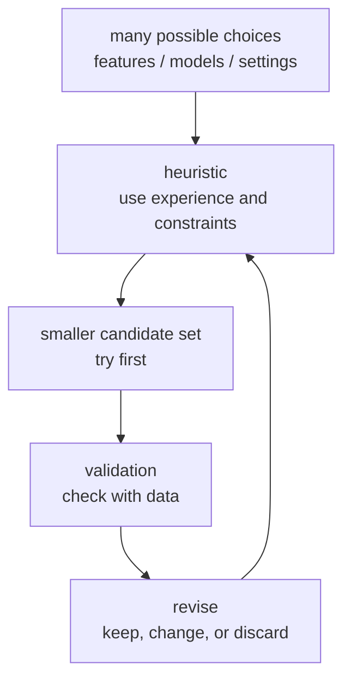

# P3-3.1 휴리스틱(heuristic)이 필요한 이유

P3-2장에서는 지도학습(supervised learning), 비지도학습(unsupervised learning), 강화학습(reinforcement learning)을 큰 학습 유형으로 나누어 봤습니다. 이제 질문이 하나 생깁니다. 실제 문제를 풀 때는 어떤 데이터부터 보고, 어떤 모델부터 시도하고, 어느 정도 결과가 나오면 다음 단계로 넘어가야 할까요?

이때 등장하는 말이 휴리스틱(heuristic)입니다. 휴리스틱은 완전한 증명이나 최적해를 보장하는 규칙이 아니라, 제한된 시간과 정보 안에서 그럴듯한 선택을 빠르게 하도록 돕는 판단 기준입니다.

처음에는 휴리스틱을 “대충 찍는 것”으로 오해하기 쉽습니다. 하지만 머신러닝 실무에서 휴리스틱은 무작위 추측이 아니라, 경험, 문제 구조, 계산 비용, 검증 결과를 바탕으로 후보를 줄이는 방법에 가깝습니다.

## 이 절의 범위

이 절은 휴리스틱이 왜 필요한지 설명합니다. 구체적인 모델 선택(model selection), 특징 선택(feature selection), 전처리(preprocessing), 하이퍼파라미터 튜닝(hyperparameter tuning)은 뒤에서 따로 다룹니다. 모델 선택 휴리스틱은 P3-8, 특징 선택과 전처리는 P3-7, 하이퍼파라미터 튜닝은 P3-9에서 다시 다룹니다.

여기서는 다음 질문에 답합니다.

- 휴리스틱은 무엇인가?
- 왜 모든 경우를 완전히 계산하지 못하는가?
- 휴리스틱은 알고리즘(algorithm)이나 최적화(optimization)와 어떻게 다른가?
- 머신러닝에서 휴리스틱은 어디에 쓰이는가?
- 휴리스틱을 쓸 때 왜 검증이 필요한가?

## 이 절의 목표

- 휴리스틱을 제한된 조건에서 후보를 줄이는 실용적 판단 기준으로 설명할 수 있습니다.
- 휴리스틱이 최적해를 보장하지 않음을 이해할 수 있습니다.
- 시간, 데이터, 계산량, 비용 때문에 휴리스틱이 필요해지는 상황을 예시로 말할 수 있습니다.
- 휴리스틱과 검증(validation)을 함께 사용해야 하는 이유를 설명할 수 있습니다.
- 휴리스틱을 개인 감각이 아니라 검증 가능한 작업 가설로 다루는 관점을 가질 수 있습니다.

## 먼저 한 장면으로 이해하기

새로운 고객 이탈 예측 모델을 만든다고 생각해 봅니다. 데이터는 아직 완벽하지 않고, 시간은 제한되어 있습니다.

| 선택해야 할 것 | 가능한 선택 | 모든 선택을 다 해 보기 어려운 이유 |
| --- | --- | --- |
| 사용할 특징(feature) | 방문 횟수, 구매 금액, 접속 간격, 문의 내역 | 특징 조합이 많아집니다. |
| 사용할 모델(model) | 로지스틱 회귀, 결정트리, 랜덤포레스트, 부스팅 | 모델마다 학습과 튜닝 시간이 듭니다. |
| 평가 기준(metric) | 정확도, 정밀도, 재현율, F1 | 업무 목적에 따라 중요도가 다릅니다. |
| 튜닝 범위 | 트리 깊이, 학습률, 반복 횟수 | 모든 조합을 시도하면 비용이 커집니다. |

이 상황에서 “가능한 모든 조합을 끝까지 다 시도한 뒤 가장 좋은 것을 고르자”는 말은 이상적으로는 그럴듯하지만 현실적으로는 어렵습니다. 그래서 먼저 간단한 기준 모델(baseline)을 만들고, 명백히 불필요한 특징을 제외하고, 업무 목적에 맞는 평가 지표를 고르는 식의 휴리스틱이 필요합니다.

## 휴리스틱은 후보를 줄이는 방법이다

휴리스틱은 문제를 푸는 데 필요한 후보를 줄입니다. 모든 길을 다 가 보는 대신, 먼저 가 볼 만한 길을 고릅니다.

이 도식에서 휴리스틱은 마지막 결론이 아닙니다. 휴리스틱은 먼저 시도할 후보를 고르는 방법입니다. 실제 데이터로 검증한 뒤 맞지 않으면 바꾸어야 합니다.

## 왜 모든 것을 계산하지 못하는가

초심자 입장에서는 “컴퓨터가 빠른데 왜 전부 계산하지 못할까?”라는 질문이 자연스럽습니다. 이유는 선택지가 생각보다 빠르게 커지기 때문입니다.

예를 들어 특징 20개 중 어떤 특징을 사용할지 고르는 문제를 생각해 봅니다. 각 특징을 쓸지 말지 두 가지로만 나누어도 가능한 조합은 매우 많아집니다. 여기에 모델 종류, 하이퍼파라미터, 데이터 분리 방식까지 더하면 실험 수가 더 커집니다.

| 늘어나는 요소 | 왜 어려워지는가 |
| --- | --- |
| 특징 수 | 조합 수가 빠르게 늘어납니다. |
| 모델 후보 | 각 모델마다 학습 시간이 필요합니다. |
| 하이퍼파라미터 | 설정 조합이 많아집니다. |
| 데이터 크기 | 한 번 학습하는 비용이 커집니다. |
| 평가 조건 | 여러 지표와 여러 검증 분할을 확인해야 합니다. |

따라서 실무에서는 모든 가능성을 완전히 탐색하기보다, 먼저 그럴듯한 후보를 좁히고 검증하면서 방향을 수정합니다.

## 휴리스틱과 알고리즘의 차이

알고리즘(algorithm)은 정해진 절차를 따라 문제를 푸는 방법입니다. 휴리스틱은 그 절차 안팎에서 어떤 후보를 먼저 볼지, 어디까지 계산할지, 어떤 선택을 우선할지 정하는 판단 기준입니다.

| 구분 | 먼저 떠올릴 말 | 예시 |
| --- | --- | --- |
| 알고리즘(algorithm) | 정해진 절차 | 주어진 데이터로 결정트리를 학습합니다. |
| 휴리스틱(heuristic) | 후보를 줄이는 판단 기준 | 처음에는 해석이 쉬운 모델부터 시도합니다. |
| 최적화(optimization) | 목적 함수를 좋게 만드는 값 찾기 | 손실(loss)을 줄이는 파라미터를 찾습니다. |
| 검증(validation) | 선택이 실제로 괜찮은지 확인 | 검증 데이터에서 성능을 확인합니다. |

휴리스틱은 알고리즘을 대체하지 않습니다. 오히려 어떤 알고리즘을 먼저 시도할지, 어떤 설정부터 볼지, 어느 수준이면 다음 단계로 넘어갈지를 정하는 데 쓰입니다.

## 제한된 합리성과 충분히 좋은 선택

휴리스틱을 이해할 때 Herbert A. Simon의 제한된 합리성(bounded rationality) 관점이 도움이 됩니다. Stanford Encyclopedia of Philosophy는 제한된 합리성을 완전한 합리성의 가정에서 벗어나, 정보 접근과 계산 능력의 제약을 가진 주체에게 맞는 합리성을 다루는 관점으로 설명합니다.

이 관점은 머신러닝 실무에도 잘 맞습니다. 우리는 완전한 정보, 무한한 계산 시간, 완벽한 평가 환경을 갖고 있지 않습니다. 그래서 “이론적으로 가능한 최적해”보다 “현재 조건에서 검증 가능한 충분히 좋은 선택”이 중요해질 때가 많습니다.

이것은 정확성을 포기한다는 뜻이 아닙니다. 오히려 제한을 인정하고, 그 안에서 더 나은 선택을 하기 위한 작업 방식입니다.

## 머신러닝에서 휴리스틱이 쓰이는 자리

머신러닝에서는 다음과 같은 곳에서 휴리스틱이 자주 쓰입니다.

| 자리 | 휴리스틱 예시 | 나중에 다시 다룰 곳 |
| --- | --- | --- |
| 특징 선택 | 너무 많은 특징보다 먼저 설명 가능한 특징부터 봅니다. | P3-7 |
| 전처리 | 결측치가 많은 열을 먼저 점검합니다. | P3-7 |
| 모델 선택 | 간단한 기준 모델을 먼저 세웁니다. | P3-8 |
| 튜닝 | 넓은 범위보다 작은 범위부터 실험합니다. | P3-9 |
| 평가 | 업무상 더 위험한 오류를 먼저 확인합니다. | P3-6 |

이 표에서 중요한 점은 휴리스틱이 “최종 답”이 아니라는 점입니다. 휴리스틱은 실험을 시작하기 위한 방향입니다. 검증 결과가 나쁘면 휴리스틱을 수정해야 합니다.

## 좋은 휴리스틱과 나쁜 휴리스틱

휴리스틱은 유용할 수 있지만 항상 맞지는 않습니다. 좋은 휴리스틱은 문제를 빠르게 좁히면서도 검증할 수 있어야 합니다.

| 휴리스틱 | 왜 쓸 수 있는가 | 검증해야 할 점 |
| --- | --- | --- |
| 먼저 간단한 모델을 만든다. | 비교 기준을 빨리 세울 수 있습니다. | 복잡한 모델이 실제로 더 나은지 비교합니다. |
| 결측치가 많은 특징을 먼저 의심한다. | 데이터 품질 문제를 빨리 발견할 수 있습니다. | 그 특징이 중요한 신호일 가능성도 확인합니다. |
| 해석 가능한 특징부터 사용한다. | 업무 담당자와 논의하기 쉽습니다. | 성능을 지나치게 희생하지 않는지 봅니다. |
| 계산 비용이 낮은 실험부터 한다. | 빠르게 방향을 잡을 수 있습니다. | 작은 실험 결과가 큰 데이터에도 유지되는지 확인합니다. |

나쁜 휴리스틱은 검증 없이 반복되는 습관입니다. 예를 들어 “항상 랜덤포레스트부터 쓰면 된다”거나 “결측치가 있으면 무조건 버린다” 같은 말은 상황에 따라 틀릴 수 있습니다. 휴리스틱은 상황과 함께 읽어야 합니다.

## 휴리스틱은 작업 가설이다

이 책에서는 휴리스틱을 작업 가설(working hypothesis)로 다룹니다. 즉, “일단 이렇게 해 보는 것이 합리적일 수 있다”는 출발점입니다.

작업 가설로 다루면 다음 흐름이 생깁니다.

1. 왜 이 선택이 그럴듯한지 말합니다.
2. 작은 데이터나 기준 모델로 확인합니다.
3. 검증 결과를 봅니다.
4. 틀렸으면 수정합니다.
5. 맞아 보이면 다음 단계로 확장합니다.

이 흐름은 사용자의 경험적 판단을 버리지 않으면서도, 검증 가능한 형태로 바꾸는 데 도움이 됩니다.

## 이 절에서 기억할 관점

- 휴리스틱은 제한된 시간과 정보 안에서 후보를 줄이는 실용적 판단 기준입니다.
- 휴리스틱은 최적해나 정답을 보장하지 않습니다.
- 머신러닝에서는 특징 선택, 전처리, 모델 선택, 튜닝, 평가 기준 선택에서 휴리스틱이 필요합니다.
- 휴리스틱은 알고리즘을 대체하지 않고, 알고리즘을 적용할 후보와 순서를 정하는 데 도움을 줍니다.
- 좋은 휴리스틱은 검증 가능해야 합니다.
- 휴리스틱은 개인 감각이 아니라 작업 가설로 다루어야 합니다.

## 체크리스트

- 휴리스틱을 “대충 찍기”가 아니라 후보를 줄이는 판단 기준으로 설명할 수 있는가?
- 모든 조합을 다 계산하기 어려운 이유를 예시로 말할 수 있는가?
- 휴리스틱과 알고리즘의 차이를 설명할 수 있는가?
- 휴리스틱이 머신러닝의 어느 단계에서 쓰이는지 말할 수 있는가?
- 휴리스틱을 검증 없이 반복하면 위험하다는 점을 설명할 수 있는가?
- 휴리스틱을 작업 가설로 다루는 흐름을 말할 수 있는가?

## 출처와 참고 자료

- Juliette R. V. Kenens, Matteo Colombo, and Stephan Hartmann, `Bounded Rationality`, Stanford Encyclopedia of Philosophy, substantive revision 2024-12-13, 확인 날짜: 2026-06-25. [https://plato.stanford.edu/entries/bounded-rationality/](https://plato.stanford.edu/entries/bounded-rationality/){: target="_blank" rel="noopener noreferrer" }
- Stuart Russell and Peter Norvig, `Artificial Intelligence: A Modern Approach`, 4th ed., Pearson, 2020, 확인 날짜: 2026-06-25. [https://aima.cs.berkeley.edu/](https://aima.cs.berkeley.edu/){: target="_blank" rel="noopener noreferrer" }
- Judea Pearl, `Heuristics: Intelligent Search Strategies for Computer Problem Solving`, Addison-Wesley, 1984.
