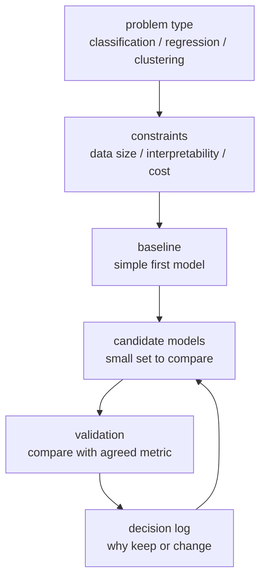

# P3-3.2 휴리스틱과 모델 선택

P3-3.1에서는 휴리스틱(heuristic)을 제한된 시간과 정보 안에서 후보를 줄이는 판단 기준으로 봤습니다. 이번 절에서는 그 관점을 모델 선택(model selection)에 적용합니다.

머신러닝을 처음 공부하면 “어떤 모델을 써야 하나?”라는 질문이 크게 느껴집니다. 하지만 모델 선택은 단순히 유명한 알고리즘 이름을 고르는 일이 아닙니다. 문제의 형태, 데이터의 상태, 설명 가능성, 계산 비용, 평가 기준을 함께 보고 먼저 시도할 후보를 좁히는 일입니다.

이때 휴리스틱은 최종 결론이 아니라 출발점입니다. “이 문제라면 이 모델부터 시도해 보자”라고 정하고, 그 선택이 실제 데이터에서 괜찮은지 검증(validation)해야 합니다.

## 이 절의 범위

이 절은 모델 선택에서 휴리스틱을 어떻게 쓰는지 설명합니다. 여기서는 각 모델의 수식, 구현, 성능 비교를 깊게 다루지 않습니다.

데이터 분리와 검증은 P3-4, 과적합(overfitting)과 일반화(generalization)는 P3-5, 평가 지표(metric)는 P3-6, 전처리(preprocessing)와 특징(feature)은 P3-7, 모델 선택 절차는 P3-8, 하이퍼파라미터 튜닝(hyperparameter tuning)은 P3-9에서 다시 다룹니다.

구체적인 모델은 뒤에서 따로 만납니다. 선형 회귀(linear regression)는 P3-10, 로지스틱 회귀(logistic regression)는 P3-11, k-최근접 이웃(k-nearest neighbors)은 P3-12, 서포트 벡터 머신(support vector machine)은 P3-13, 결정트리(decision tree)는 P3-14, 랜덤포레스트(random forest)는 P3-15, 그래디언트 부스팅(gradient boosting)은 P3-16에서 다룹니다. 군집화(clustering)와 차원 축소(dimensionality reduction)는 P3-17과 P3-18에서 다룹니다.

여기서는 다음 질문에 답합니다.

- 모델 선택에서 휴리스틱은 무엇을 줄이는가?
- 문제 유형은 모델 후보를 어떻게 좁히는가?
- 기준 모델(baseline)은 왜 필요한가?
- 성능, 설명 가능성, 비용은 어떻게 충돌하는가?
- 휴리스틱을 검증 가능한 기록으로 남기려면 무엇을 써야 하는가?

## 이 절의 목표

- 모델 선택을 모델 이름 고르기가 아니라 후보를 줄이고 검증하는 흐름으로 설명할 수 있습니다.
- 문제 유형에 따라 먼저 볼 모델 후보가 달라지는 이유를 말할 수 있습니다.
- 기준 모델이 복잡한 모델을 평가하기 위한 비교 기준임을 설명할 수 있습니다.
- 성능만이 아니라 설명 가능성, 계산 비용, 데이터 상태도 모델 선택에 영향을 준다는 점을 이해할 수 있습니다.
- 모델 선택 휴리스틱을 작업 가설로 기록하는 방법을 익힐 수 있습니다.

## 먼저 한 장면으로 이해하기

고객 이탈을 예측하는 작은 프로젝트를 생각해 봅니다. 데이터에는 고객의 최근 접속 횟수, 구매 금액, 문의 횟수, 가입 기간이 들어 있습니다. 목표는 다음 달에 이탈할 가능성이 높은 고객을 찾는 것입니다.

이때 가능한 모델은 많습니다. 하지만 처음부터 모든 모델을 다 시도하는 것은 좋은 출발점이 아닐 수 있습니다.

| 후보 | 먼저 떠올릴 이유 | 조심할 점 | 뒤에서 다룰 곳 |
| --- | --- | --- | --- |
| 로지스틱 회귀(logistic regression) | 이탈 여부처럼 두 범주를 예측할 때 간단한 기준 모델이 됩니다. | 선형적인 관계만으로 부족할 수 있습니다. | P3-11 |
| 결정트리(decision tree) | “어떤 조건에서 이탈이 늘어나는가”를 설명하기 쉽습니다. | 깊어지면 훈련 데이터에 과하게 맞을 수 있습니다. | P3-14 |
| 랜덤포레스트(random forest) | 여러 트리를 묶어 안정적인 성능을 기대할 수 있습니다. | 단일 트리보다 설명이 어려워질 수 있습니다. | P3-15 |
| 그래디언트 부스팅(gradient boosting) | 표 형식 데이터에서 강한 성능을 보일 때가 많습니다. | 튜닝과 검증을 더 신중히 해야 합니다. | P3-16 |

여기서 휴리스틱은 “로지스틱 회귀가 정답이다”라고 말하지 않습니다. 대신 “먼저 간단한 기준 모델을 세우고, 그다음 설명 가능성과 성능을 비교해 보자”라는 실험 순서를 만듭니다.

## 모델 선택은 후보를 줄이는 과정이다

모델 선택은 보통 다음 흐름으로 진행됩니다.

이 흐름에서 중요한 점은 한 번에 최종 모델을 맞히려 하지 않는다는 것입니다. 먼저 문제 유형을 보고, 제약 조건을 확인하고, 기준 모델을 세운 뒤, 작은 후보 집합을 비교합니다. 검증 결과가 나쁘면 다시 후보를 바꿉니다.

## 문제 유형으로 1차 후보를 줄인다

가장 먼저 볼 것은 문제 유형입니다. 예측하려는 값이 숫자인지, 범주인지, 라벨이 없는 구조인지에 따라 후보가 달라집니다.

| 질문 | 문제 유형 | 먼저 떠올릴 후보 | 뒤에서 다룰 곳 |
| --- | --- | --- | --- |
| 집값, 매출, 온도처럼 숫자를 예측하는가? | 회귀(regression) | 선형 회귀, 트리 기반 회귀 | P3-10, P3-14 |
| 합격/불합격, 이탈/유지처럼 범주를 예측하는가? | 분류(classification) | 로지스틱 회귀, 결정트리 | P3-11, P3-14 |
| 라벨 없이 비슷한 묶음을 찾는가? | 군집화(clustering) | k-means, DBSCAN | P3-17 |
| 많은 특징을 적은 축으로 줄여 보고 싶은가? | 차원 축소(dimensionality reduction) | PCA, t-SNE | P3-18 |
| 행동을 선택하고 보상을 받는가? | 강화학습(reinforcement learning) | Q-learning, policy gradient | P3-19 |

이 표는 정답표가 아닙니다. 초심자가 처음 방향을 잃지 않도록 후보를 좁히는 지도입니다. 실제 선택은 데이터와 평가 결과로 다시 확인해야 합니다.

## 기준 모델은 비교 기준이다

기준 모델(baseline)은 처음부터 최고의 성능을 내기 위한 모델이 아닙니다. 기준 모델은 “복잡한 모델을 쓸 가치가 있는가?”를 판단하기 위한 비교 기준입니다.

예를 들어 이탈 예측에서 아무 모델도 쓰지 않고 “대부분은 이탈하지 않는다”라고만 예측해도 정확도가 높게 나올 수 있습니다. 이 경우 복잡한 모델이 정확도만 조금 높아졌다고 해서 실제로 쓸 만하다고 말하기 어렵습니다. 정밀도(precision), 재현율(recall), 비용, 업무 목적을 함께 봐야 합니다.

기준 모델은 다음 질문에 답하게 해 줍니다.

- 아무 모델도 쓰지 않는 단순 규칙보다 나아졌는가?
- 간단한 모델보다 복잡한 모델이 실제로 충분히 좋아졌는가?
- 성능 향상이 설명 가능성이나 운영 비용을 희생할 만큼 가치가 있는가?
- 현재 데이터로는 모델보다 데이터 품질을 먼저 고쳐야 하는가?

기준 모델은 P3-8.2에서 더 자세히 다룹니다. 여기서는 모델 선택 휴리스틱의 첫 기준점으로만 기억하면 됩니다.

## 성능만으로 고르지 않는다

모델 선택에서는 성능이 중요합니다. 하지만 성능만으로 고르면 실무에서 문제가 생길 수 있습니다.

| 기준 | 질문 | 예시 |
| --- | --- | --- |
| 성능(performance) | 검증 데이터에서 목표 지표가 좋은가? | 재현율이 중요한 문제에서 정확도만 보지 않습니다. |
| 설명 가능성(interpretability) | 사람이 결과를 설명하고 점검할 수 있는가? | 업무 담당자가 규칙을 이해해야 하면 단순 모델이 유리할 수 있습니다. |
| 계산 비용(computational cost) | 학습과 예측에 드는 시간이 감당 가능한가? | 실시간 서비스에서는 예측 지연 시간이 중요합니다. |
| 데이터 요구(data requirement) | 현재 데이터 규모와 품질에 맞는가? | 데이터가 적으면 복잡한 모델이 불안정할 수 있습니다. |
| 운영성(operability) | 배포, 모니터링, 재학습이 가능한가? | 모델이 좋아도 운영하기 어렵다면 실패할 수 있습니다. |

이 기준들은 서로 충돌합니다. 설명이 쉬운 모델은 성능이 낮을 수 있고, 성능이 좋은 모델은 비용이 크거나 설명이 어려울 수 있습니다. 모델 선택 휴리스틱은 이런 충돌을 미리 드러내는 데 도움이 됩니다.

## 자주 쓰는 모델 선택 휴리스틱

다음은 초반 실험에서 자주 쓰는 휴리스틱입니다. 모두 검증이 필요합니다.

| 휴리스틱 | 쓸 수 있는 이유 | 반드시 확인할 점 |
| --- | --- | --- |
| 먼저 단순한 모델을 만든다. | 기준 성능을 빨리 세울 수 있습니다. | 단순 모델이 이미 충분한지, 복잡한 모델이 실제로 나은지 봅니다. |
| 문제 유형으로 후보를 나눈다. | 회귀, 분류, 군집화는 목표가 다릅니다. | 실제 목표가 잘 정의되었는지 다시 확인합니다. |
| 설명이 중요한 업무에서는 해석 가능한 모델부터 본다. | 결과를 사람에게 설명해야 할 수 있습니다. | 설명 가능성을 이유로 성능 위험을 무시하지 않습니다. |
| 데이터가 작으면 복잡한 모델을 서두르지 않는다. | 과적합 위험이 커질 수 있습니다. | 데이터 분리와 검증 결과를 확인합니다. |
| 특징 스케일에 민감한 모델은 전처리를 함께 본다. | k-NN, SVM 같은 모델은 거리나 간격의 영향을 받을 수 있습니다. | 전처리 조건을 모델 비교에 공정하게 반영합니다. |
| 기준 모델이 너무 약하면 데이터부터 의심한다. | 모델 문제가 아니라 라벨, 누락, 표본 문제일 수 있습니다. | 데이터 품질과 문제 정의를 다시 봅니다. |

이 휴리스틱들은 “항상 이렇게 하라”는 규칙이 아닙니다. 초반 탐색을 질서 있게 시작하기 위한 출발점입니다.

## 휴리스틱을 기록해야 한다

휴리스틱은 머릿속 감각으로만 남기면 검증하기 어렵습니다. 모델 선택 과정에서는 왜 그 모델을 먼저 봤는지, 무엇을 우려했는지, 어떤 기준으로 바꿀지 기록해야 합니다.

| 기록 항목 | 예시 |
| --- | --- |
| 선택한 후보 | 로지스틱 회귀와 결정트리를 먼저 비교한다. |
| 선택 이유 | 이탈 여부 분류 문제이고, 설명 가능성이 필요하다. |
| 예상 위험 | 선형 관계만으로 부족하거나 트리가 과적합될 수 있다. |
| 검증 방법 | P3-4에서 다룰 검증 데이터로 비교한다. |
| 평가 기준 | P3-6에서 다룰 재현율과 정밀도를 함께 본다. |
| 다음 행동 | 기준 모델보다 충분히 낫지 않으면 데이터와 특징을 다시 본다. |

이렇게 쓰면 휴리스틱은 “감으로 골랐다”가 아니라 “검증 가능한 작업 가설로 시작했다”가 됩니다.

## 이 절에서 조심할 오해

모델 선택에서 가장 흔한 오해는 유명한 모델일수록 항상 좋다고 생각하는 것입니다. 실제로는 데이터가 작거나, 라벨이 불안정하거나, 설명 가능성이 중요한 문제에서는 단순한 모델이 더 적합할 수 있습니다.

두 번째 오해는 검증 점수 하나만 보고 모델을 고르는 것입니다. 검증 데이터에 지나치게 맞추는 문제도 생길 수 있습니다. 이 문제는 P3-5의 과적합과 일반화에서 다시 다룹니다.

세 번째 오해는 모델 선택을 모델만의 문제로 보는 것입니다. 모델이 잘 안 나오면 모델을 더 복잡하게 바꾸기 전에 데이터, 라벨, 특징, 평가 기준이 문제에 맞는지 확인해야 합니다.

## 이 절에서 기억할 관점

- 모델 선택은 모델 이름을 맞히는 일이 아니라 후보를 줄이고 검증하는 과정입니다.
- 휴리스틱은 모델 선택의 출발점이지 결론이 아닙니다.
- 문제 유형은 모델 후보를 좁히는 첫 기준입니다.
- 기준 모델은 복잡한 모델을 비교하기 위한 최소 기준입니다.
- 성능, 설명 가능성, 계산 비용, 데이터 상태, 운영성을 함께 봐야 합니다.
- 모델 선택 휴리스틱은 이유, 위험, 검증 방법과 함께 기록해야 합니다.

## 체크리스트

- 모델 선택을 후보 축소와 검증 흐름으로 설명할 수 있는가?
- 회귀, 분류, 군집화, 차원 축소, 강화학습이 서로 다른 후보를 요구한다는 점을 말할 수 있는가?
- 기준 모델이 왜 필요한지 설명할 수 있는가?
- 성능만으로 모델을 고르면 어떤 위험이 있는지 말할 수 있는가?
- 모델 선택 휴리스틱을 작업 가설로 기록할 수 있는가?
- 이 절에서 깊게 다루지 않은 검증, 평가 지표, 튜닝을 뒤 절로 넘길 수 있는가?

## 출처와 참고 자료

- scikit-learn developers, `Choosing the right estimator`, scikit-learn User Guide, 확인 날짜: 2026-06-25. [https://scikit-learn.org/stable/machine_learning_map.html](https://scikit-learn.org/stable/machine_learning_map.html){: target="_blank" rel="noopener noreferrer" }
- scikit-learn developers, `Cross-validation: evaluating estimator performance`, scikit-learn User Guide, 확인 날짜: 2026-06-25. [https://scikit-learn.org/stable/modules/cross_validation.html](https://scikit-learn.org/stable/modules/cross_validation.html){: target="_blank" rel="noopener noreferrer" }
- Gareth James, Daniela Witten, Trevor Hastie, Robert Tibshirani, Jonathan Taylor, `An Introduction to Statistical Learning`, Springer, 공식 웹사이트 확인 날짜: 2026-06-25. [https://www.statlearning.com/](https://www.statlearning.com/){: target="_blank" rel="noopener noreferrer" }
