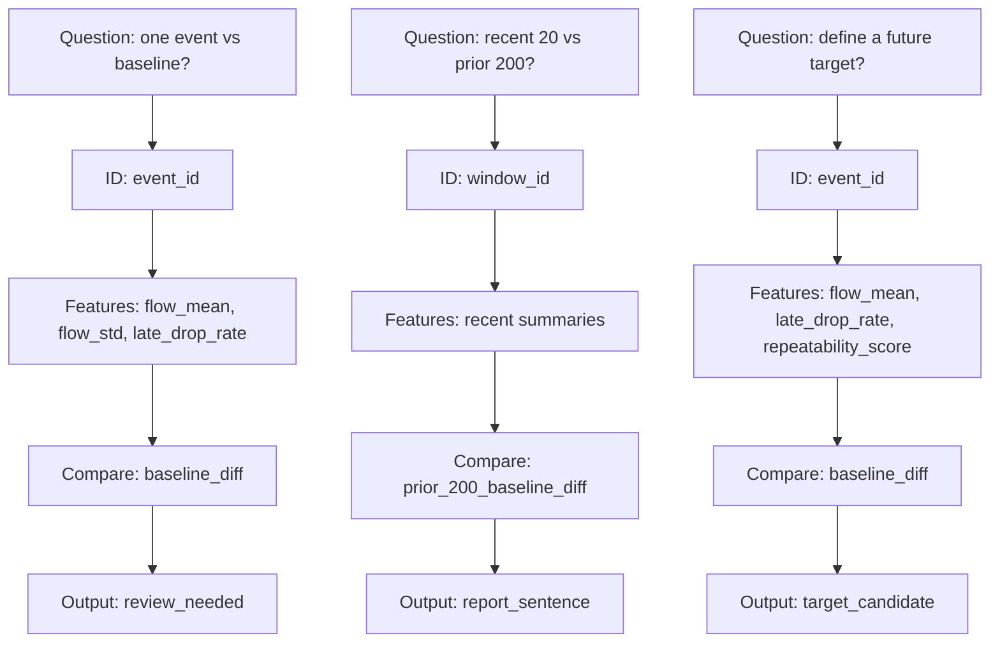

# P3-3.3 질문을 첫 표 초안으로 옮기려면 어떤 열부터 스케치해야 하는가

> Section ID: `P3-3.3`
> Version: `v2026.07.07`

Chapter 3 앞 절까지 읽으면 독자는 이제 두 가지는 이해합니다. 학습 문제의 틀을 너무 빨리 정하면 안 된다는 점, 그리고 데이터셋은 질문에 맞게 다시 설계한 구조라는 점입니다. 그런데 실제 손을 움직이려 하면 다시 막히는 지점이 있습니다. `그러면 질문을 정한 다음 첫 표 초안은 어떻게 그려야 하는가?` 이 다리가 없으면 질문은 추상적으로 남고, 다음 Chapter의 샘플/요약 표 설명도 갑자기 뛰어오른 것처럼 느껴질 수 있습니다.

첫 표 초안에서 중요한 것은 완성된 열 목록이 아니라 역할 구분입니다. 질문을 받은 뒤 어떤 열이 샘플을 식별하고, 어떤 열이 상태를 설명하며, 어떤 열이 비교와 결과를 맡는지 먼저 나누어야 저장된 기록을 문제 표현 구조로 옮기기 쉬워집니다.

처음 표 초안을 그릴 때는 모든 열을 다 적으려 하지 말고, 먼저 아래 네 묶음을 적는 편이 안전합니다.

1. 샘플을 식별하는 열
2. 샘플을 설명하는 특징 후보 열
3. 비교를 위해 필요한 기준선 또는 차이 열
4. 사람이 읽거나 나중에 맞히고 싶은 결과 열

이 네 묶음을 표로 줄이면 다음과 같습니다.

| 열 묶음 | 왜 먼저 필요한가 |
| --- | --- |
| 샘플 식별 열 | 무엇을 한 건으로 볼지 표에서 드러나야 하기 때문 |
| 특징 후보 열 | 샘플의 상태를 설명할 값이 필요하기 때문 |
| 비교 열 | 평소 대비 변화가 보이려면 차이 구조가 필요하기 때문 |
| 결과 열 | 검토 후보인지 목표 라벨 후보인지 방향이 보여야 하기 때문 |

즉 첫 표 초안은 `모든 원천 열을 옮겨 적는 일`이 아니라, `이 문제에 필요한 역할별 열 묶음을 먼저 배치하는 일`입니다.

## 질문에서 표 초안으로 가는 최소 변환

예를 들어 질문이 `최근 동작 1회가 평소보다 더 흔들렸는가`라면, 곧바로 표 초안은 아래처럼 스케치할 수 있습니다.

| 열 역할 | 초안 예시 |
| --- | --- |
| 샘플 식별 열 | `event_id` |
| 특징 후보 열 | `flow_mean`, `flow_std`, `late_drop_rate` |
| 비교 열 | `baseline_diff`, `repeatability_score` |
| 결과 열 | `review_needed` 또는 `report_sentence` |

질문이 바뀌면 초안도 함께 바뀝니다.

| 질문 문장 | 초안에서 가장 먼저 달라지는 것 |
| --- | --- |
| 최근 동작 1회가 평소보다 흔들렸는가 | 샘플이 `동작 1회`로 잡힌다 |
| 최근 20건이 이전 200건보다 달라졌는가 | 샘플보다 `구간 집계`와 비교 열이 더 앞에 온다 |
| 사람이 먼저 볼 동작은 무엇인가 | 결과 열이 `priority_score`, `review_needed` 쪽으로 바뀐다 |
| 나중에 맞힐 결과 후보를 만들 수 있는가 | 결과 열이 `target` 후보로 더 분명해진다 |

즉 질문은 문장으로 끝나지 않고, 곧바로 표의 열 구조를 밀어냅니다.

## 처음부터 완벽한 열 이름이 필요하지는 않다

여기서 자주 멈추는 이유는 `정확한 열 이름을 아직 모르는데 어떻게 표를 그리지?`라는 생각 때문입니다. 하지만 Part 3 단계에서는 열 이름을 완벽하게 확정할 필요가 없습니다. 먼저 `역할`부터 적으면 됩니다.

예를 들어 아래처럼 써도 충분합니다.

- 샘플 식별 열 1개
- 수준을 보여 주는 특징 1~2개
- 변화나 흔들림을 보여 주는 특징 1~2개
- 기준선 대비 차이 열 1개
- 사람 검토용 결과 열 1개

이 정도만 적어도 질문이 어떤 표 구조를 요구하는지 윤곽이 생깁니다.

## 작은 도식으로 보기

문제 상황: 질문이 바뀌면 첫 표 초안의 열 묶음도 함께 바뀐다는 점을 확인합니다.

입력(input): 서로 다른 질문 3개

기대 출력(output): 각 질문에 따라 `식별`, `특징`, `비교`, `결과` 열 초안이 다르게 스케치됩니다.

확인할 개념: 첫 표 초안은 완성된 열 이름 목록이 아니라, 질문이 요구하는 역할별 열 묶음을 먼저 드러내는 단계다

이 예시의 핵심은 열 이름 목록보다 `질문이 달라지면 어느 열 묶음이 먼저 달라지는가`를 보는 데 있습니다. 동작 1회 비교에서는 `event_id`와 `review_needed`가 먼저 보이고, 최근 20건 비교에서는 `window_id`와 `report_sentence`가 더 자연스럽습니다. 반대로 나중의 학습 후보를 생각하면 결과 열이 `target_candidate`로 바뀝니다. 즉 첫 표 초안은 정답 표를 한 번에 완성하는 과정이 아니라, 질문이 요구하는 샘플 단위와 결과 방향을 먼저 드러내는 스케치입니다.

## 왜 이 절이 Chapter 4 앞에 필요한가

Chapter 4부터는 본격적으로 `한 행`, `샘플 1건`, `최근 구간 1개`를 나눠 보고, 원시 로그를 요약 표로 바꾸기 시작합니다. 그런데 그 전에 질문을 표 초안으로 옮기는 습관이 없으면, 샘플과 특징 설명이 갑자기 세부 구현처럼 느껴질 수 있습니다. 그래서 Chapter 3 마지막에는 질문을 표 초안으로 바꾸는 짧은 브리지 절이 하나 있는 편이 자연스럽습니다.

즉 이 절은 `질문 문장`과 `샘플/요약 표 설계` 사이의 다리입니다. 질문을 어떻게 표 구조로 옮길지 보이면, 왜 다음 장에서 샘플과 요약 열을 먼저 만드는지도 더 직접적으로 읽힙니다.

