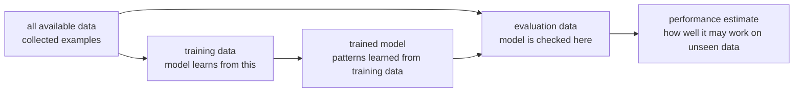

# P3-4.1 학습 데이터와 평가 데이터

P3-3장에서는 휴리스틱(heuristic)을 사용해 먼저 시도할 모델 후보를 좁히는 법을 봤습니다. 이제 중요한 질문이 생깁니다. 그 선택이 실제로 괜찮은지 어떻게 확인할 수 있을까요?

머신러닝에서는 모델이 이미 본 데이터에 잘 맞는 것만으로는 충분하지 않습니다. 우리가 원하는 것은 앞으로 들어올 새 데이터에서도 쓸 만한 판단을 하는 것입니다. 그래서 데이터를 모두 학습에만 쓰지 않고, 일부는 평가를 위해 따로 남겨 둡니다.

학습 데이터(training data)는 모델이 배우는 데 쓰는 데이터입니다. 평가 데이터(evaluation data)는 모델이 배운 결과를 확인하는 데 쓰는 데이터입니다. 초심자에게 가장 중요한 첫 관점은 간단합니다. “배운 문제지로만 시험을 보면 실력을 착각할 수 있다”는 것입니다.

## 이 절의 범위

이 절은 데이터를 왜 나누는지 설명합니다. 검증 데이터(validation data)와 테스트 데이터(test data)의 자세한 구분은 P3-4.2에서 다룹니다. 여기서는 먼저 학습에 쓰는 데이터와 평가에 남겨 두는 데이터의 차이를 잡습니다.

과적합(overfitting)과 일반화(generalization)는 P3-5에서 자세히 다룹니다. 정확도(accuracy), 정밀도(precision), 재현율(recall) 같은 평가 지표(metric)는 P3-6에서 다룹니다. 여기서는 “나누어 확인해야 한다”는 이유에 집중합니다.

이 절에서는 다음 질문에 답합니다.

- 왜 데이터를 전부 학습에 쓰면 안 되는가?
- 학습 데이터와 평가 데이터는 어떤 역할을 하는가?
- 모델이 이미 본 데이터에만 잘 맞는 상황은 왜 위험한가?
- 데이터 분리는 어떤 오해를 막아 주는가?
- 데이터가 적을 때는 어떤 점을 조심해야 하는가?

## 이 절의 목표

- 학습 데이터와 평가 데이터의 역할을 구분할 수 있습니다.
- 같은 데이터로 학습하고 평가하면 성능을 과대평가할 수 있음을 설명할 수 있습니다.
- 평가 데이터가 “새 데이터에서의 동작을 추정하기 위한 대리 장면”임을 이해할 수 있습니다.
- 데이터 분리가 모델 선택, 과적합, 일반화로 이어지는 이유를 말할 수 있습니다.
- 검증과 테스트의 세부 구분은 다음 절에서 다룬다는 경계를 잡을 수 있습니다.

## 먼저 한 장면으로 이해하기

학생이 수학 문제 100개를 외웠다고 생각해 봅니다. 그 학생에게 같은 100문제를 다시 주면 높은 점수를 받을 수 있습니다. 하지만 이것만으로 새로운 문제를 풀 수 있다고 말하기는 어렵습니다.

머신러닝 모델도 비슷합니다. 모델은 학습 데이터에서 패턴을 찾습니다. 그런데 평가도 같은 데이터로 하면, 모델이 패턴을 배운 것인지, 특정 예시를 외운 것인지 구분하기 어렵습니다.

| 상황 | 겉보기 결과 | 실제로 조심할 점 |
| --- | --- | --- |
| 학습한 데이터로 다시 평가 | 점수가 높게 나올 수 있습니다. | 모델이 외운 것일 수 있습니다. |
| 따로 남겨 둔 데이터로 평가 | 점수가 낮아질 수 있습니다. | 새 데이터에서의 현실적인 성능에 더 가깝습니다. |
| 새 데이터에서 실패 | 학습 점수만 믿으면 놓치기 쉽습니다. | 데이터 분리와 일반화 확인이 필요합니다. |

이 비유는 완전하지 않지만, 데이터 분리의 핵심을 보여 줍니다. 모델의 목적은 이미 본 예시를 다시 맞히는 것이 아니라, 아직 보지 못한 예시에 대응하는 것입니다.

## 데이터는 역할에 따라 나눈다

가장 기본적인 분리는 학습에 쓰는 부분과 평가에 쓰는 부분입니다.



이 도식에서 평가 데이터는 학습 과정에서 직접 쓰지 않는 데이터입니다. 학습 데이터로 모델을 만들고, 평가 데이터로 그 모델이 다른 예시에도 작동하는지 확인합니다.

여기서 “평가 데이터”라는 표현은 넓은 의미로 사용했습니다. 실제 프로젝트에서는 검증 데이터와 테스트 데이터를 더 구분합니다. 그 구분은 P3-4.2에서 다룹니다.

아주 작은 표로 보면 더 직관적입니다.

| 고객 ID | 최근 구매 횟수 | 문의 횟수 | 이탈 여부 | 어디에 쓰는가 |
| --- | --- | --- | --- | --- |
| C01 | 8 | 0 | 유지 | 학습 데이터 |
| C02 | 2 | 3 | 이탈 | 학습 데이터 |
| C03 | 6 | 1 | 유지 | 학습 데이터 |
| C04 | 1 | 4 | 이탈 | 평가 데이터 |
| C05 | 7 | 0 | 유지 | 평가 데이터 |

이 예시에서는 C01, C02, C03으로 먼저 규칙을 배우고, C04, C05에는 그 규칙이 통하는지 확인합니다. 만약 C04, C05까지 함께 학습에 써 버리면, 모델이 그 사례를 이미 본 상태라 평가 의미가 약해집니다.

같은 생각을 코드로 옮기면 다음처럼 볼 수 있습니다.

```python
from sklearn.model_selection import train_test_split

X = [
    [8, 0],  # recent purchases, support tickets
    [2, 3],
    [6, 1],
    [1, 4],
    [7, 0],
]
y = ["stay", "churn", "stay", "churn", "stay"]

X_train, X_eval, y_train, y_eval = train_test_split(
    X,
    y,
    test_size=0.4,
    random_state=42,
)

print("training inputs:", X_train)
print("evaluation inputs:", X_eval)
print("training labels:", y_train)
print("evaluation labels:", y_eval)
print("training sample count:", len(X_train))
print("evaluation sample count:", len(X_eval))
print("training churn ratio:", y_train.count("churn") / len(y_train))
print("evaluation churn ratio:", y_eval.count("churn") / len(y_eval))
```

실행 결과 예시는 다음처럼 읽을 수 있습니다.

```text
training inputs: [[6, 1], [8, 0], [1, 4]]
evaluation inputs: [[2, 3], [7, 0]]
training labels: ['stay', 'stay', 'churn']
evaluation labels: ['churn', 'stay']
training sample count: 3
evaluation sample count: 2
training churn ratio: 0.3333333333333333
evaluation churn ratio: 0.5
```

이 코드는 전체 데이터를 한 번에 모델에 넣지 않고, 학습용과 평가용으로 나누는 가장 기본적인 모습을 보여 줍니다. `X_train`, `y_train`은 모델이 배우는 데 쓰고, `X_eval`, `y_eval`은 그 결과를 확인하는 데 남겨 둡니다.

여기서 함께 출력한 값들은 아직 모델 성능 지표(metric)가 아닙니다. 대신 데이터를 나눈 뒤 바로 확인해야 하는 기본 점검 지표입니다.

- 학습 샘플 수와 평가 샘플 수가 어떻게 나뉘었는가
- 이탈(`churn`) 라벨 비율이 한쪽으로 심하게 쏠리지 않았는가

이런 출력만 봐도 “모델이 무엇을 배우기 시작할 환경인지”를 조금 더 구체적으로 이해할 수 있습니다.

조금 더 실무에 가까운 모습으로 쓰면 보통 `DataFrame`에서 입력 열과 정답 열을 나눈 뒤 분리합니다.

```python
from sklearn.model_selection import train_test_split

feature_columns = ["recent_purchases", "support_tickets", "days_since_login"]
target_column = "churned"

X = df[feature_columns]
y = df[target_column]

X_train, X_eval, y_train, y_eval = train_test_split(
    X,
    y,
    test_size=0.2,
    random_state=42,
)

print("X_train shape:", X_train.shape)
print("X_eval shape:", X_eval.shape)
print("training label ratio:")
print(y_train.value_counts(normalize=True))
print("evaluation label ratio:")
print(y_eval.value_counts(normalize=True))
```

실행 결과는 보통 다음처럼 보입니다.

```text
X_train shape: (4, 3)
X_eval shape: (1, 3)
training label ratio:
stay     0.75
churn    0.25
Name: churned, dtype: float64
evaluation label ratio:
stay    1.0
Name: churned, dtype: float64
```

여기서 중요한 것은 문법 자체보다 역할 구분입니다. 입력(input)인 `X`와 정답(label)인 `y`를 나누고, 그다음 다시 학습용과 평가용으로 나눈다는 순서를 읽을 수 있으면 됩니다. `shape`와 라벨 비율 출력은 분리 결과가 너무 치우치지 않았는지 확인하는 가장 빠른 점검입니다.

## 작은 Python 실습

이 절에서는 모델을 학습하지 않아도 됩니다. 지금 단계의 목표는 데이터를 나눈 뒤 어떤 값들을 먼저 확인해야 하는지 손으로 익히는 것입니다.

### 실습 1. `test_size`를 바꿔 본다

아래 코드는 같은 데이터를 두 가지 비율로 나누어 봅니다.

```python
from sklearn.model_selection import train_test_split

X = [
    [8, 0],
    [2, 3],
    [6, 1],
    [1, 4],
    [7, 0],
    [3, 2],
    [9, 0],
    [2, 5],
]
y = ["stay", "churn", "stay", "churn", "stay", "churn", "stay", "churn"]

for ratio in [0.25, 0.5]:
    X_train, X_eval, y_train, y_eval = train_test_split(
        X,
        y,
        test_size=ratio,
        random_state=42,
    )

    print("test_size =", ratio)
    print("training sample count:", len(X_train))
    print("evaluation sample count:", len(X_eval))
    print("training churn ratio:", y_train.count("churn") / len(y_train))
    print("evaluation churn ratio:", y_eval.count("churn") / len(y_eval))
    print("-" * 30)
```

실행 결과 예시는 다음처럼 나올 수 있습니다.

```text
test_size = 0.25
training sample count: 6
evaluation sample count: 2
training churn ratio: 0.5
evaluation churn ratio: 0.5
------------------------------
test_size = 0.5
training sample count: 4
evaluation sample count: 4
training churn ratio: 0.5
evaluation churn ratio: 0.5
------------------------------
```

이 실습에서 먼저 볼 것은 점수가 아니라 분리 결과입니다. `test_size`가 커질수록 평가 데이터는 늘어나고 학습 데이터는 줄어듭니다. 데이터가 아주 작을 때는 이 차이가 더 크게 느껴집니다.

### 실습 2. `random_state`를 바꿔 본다

같은 데이터라도 섞는 기준이 달라지면 분리 결과가 바뀔 수 있습니다.

```python
from sklearn.model_selection import train_test_split

X = [
    [8, 0],
    [2, 3],
    [6, 1],
    [1, 4],
    [7, 0],
    [3, 2],
    [9, 0],
    [2, 5],
]
y = ["stay", "churn", "stay", "churn", "stay", "churn", "stay", "churn"]

for seed in [0, 7, 42]:
    X_train, X_eval, y_train, y_eval = train_test_split(
        X,
        y,
        test_size=0.25,
        random_state=seed,
    )

    print("random_state =", seed)
    print("evaluation labels:", y_eval)
    print("evaluation churn ratio:", y_eval.count("churn") / len(y_eval))
    print("-" * 30)
```

실행 결과 예시는 다음처럼 달라질 수 있습니다.

```text
random_state = 0
evaluation labels: ['stay', 'stay']
evaluation churn ratio: 0.0
------------------------------
random_state = 7
evaluation labels: ['churn', 'stay']
evaluation churn ratio: 0.5
------------------------------
random_state = 42
evaluation labels: ['churn', 'churn']
evaluation churn ratio: 1.0
------------------------------
```

이 실습은 왜 `random_state`를 적어 두는지 보여 줍니다. 같은 코드를 다시 실행했을 때 같은 분리 결과를 재현하려면 기준값을 고정해야 합니다.

### 실습 3. 데이터가 치우치면 어떤 문제가 생기는지 본다

다음 예시는 `churn`이 적은 데이터에서 분리 결과가 얼마나 쉽게 흔들릴 수 있는지 보여 줍니다.

```python
from sklearn.model_selection import train_test_split

X = [[i] for i in range(10)]
y = ["stay", "stay", "stay", "stay", "stay", "stay", "stay", "stay", "stay", "churn"]

X_train, X_eval, y_train, y_eval = train_test_split(
    X,
    y,
    test_size=0.3,
    random_state=42,
)

print("training labels:", y_train)
print("evaluation labels:", y_eval)
print("training churn count:", y_train.count("churn"))
print("evaluation churn count:", y_eval.count("churn"))
```

실행 결과 예시는 다음처럼 볼 수 있습니다.

```text
training labels: ['stay', 'stay', 'stay', 'stay', 'stay', 'stay', 'stay']
evaluation labels: ['stay', 'stay', 'churn']
training churn count: 0
evaluation churn count: 1
```

이 실습에서는 한쪽에 `churn`이 거의 없거나 아예 없을 수도 있습니다. 그런 상태에서는 모델이 이탈 패턴을 배우거나 평가하기가 매우 어려워집니다. 이런 이유 때문에 뒤 절에서 비율을 맞춘 분리(stratified split)를 다시 다루게 됩니다.

## 데이터 분리도 문제에 맞게 해야 한다

데이터를 나눈다는 말이 항상 같은 방식으로 무작위 반반 분할을 뜻하는 것은 아닙니다. 문제의 성격에 따라 나누는 기준도 달라집니다.

| 상황 | 먼저 생각할 분리 방식 | 이유 |
| --- | --- | --- |
| 고객 이탈, 점수 예측처럼 표 형식 데이터 | 무작위 분리(random split) | 학습용과 평가용이 비슷한 분포를 갖게 하려는 경우가 많습니다. |
| 월별 매출, 센서 로그, 주가처럼 시간 순서가 중요한 데이터 | 시간 순 분리(time-based split) | 미래 정보를 과거 학습에 섞으면 실제 배포 상황을 왜곡할 수 있습니다. |
| 불량 탐지, 희귀 질병처럼 한 라벨이 매우 적은 데이터 | 비율을 맞춘 분리(stratified split) | 한쪽에만 희귀 라벨이 몰리면 평가가 불안정해질 수 있습니다. |

예를 들어 쇼핑몰 데이터를 1월부터 6월까지 모았다고 해 봅니다.

| 월 | 고객 수 | 이탈 고객 수 | 어디에 쓰는가 |
| --- | --- | --- | --- |
| 1월 | 100 | 8 | 학습 데이터 |
| 2월 | 110 | 9 | 학습 데이터 |
| 3월 | 120 | 11 | 학습 데이터 |
| 4월 | 115 | 12 | 학습 데이터 |
| 5월 | 125 | 15 | 평가 데이터 |
| 6월 | 130 | 18 | 평가 데이터 |

이 경우 1월부터 4월까지로 학습하고 5월, 6월로 평가하는 편이 실제 운영 흐름과 더 비슷합니다. 반대로 6월 데이터를 일부 잘라 2월, 3월 데이터와 무작위로 섞어 학습에 넣으면, 미래에만 보였던 패턴이 과거 학습에 새어 들어갈 수 있습니다.

## 잘못 나누면 어떤 오해가 생기는가

데이터를 나누기는 했지만, 방식이 문제와 맞지 않으면 오히려 잘못된 안심을 줄 수 있습니다.

| 분리 방식 | 겉보기에는 괜찮아 보이는 점 | 실제 위험 |
| --- | --- | --- |
| 전체 데이터를 무작위로 나눔 | 빠르고 간단합니다. | 시간 순서가 중요한 문제에서는 미래 정보가 섞일 수 있습니다. |
| 라벨 비율을 보지 않고 나눔 | 코드가 단순합니다. | 평가 데이터에 특정 라벨이 거의 없어 점수가 왜곡될 수 있습니다. |
| 같은 고객, 같은 기기, 같은 문서 조각이 양쪽에 함께 들어감 | 데이터 수가 많아 보입니다. | 사실상 비슷한 사례를 미리 본 상태가 되어 평가가 쉬워질 수 있습니다. |

아주 작은 이탈 예시로 보면 이런 문제가 더 선명합니다.

| 분리 결과 | 학습 데이터의 라벨 | 평가 데이터의 라벨 | 생길 수 있는 문제 |
| --- | --- | --- | --- |
| 좋은 예 | `stay, stay, churn, stay` | `stay, churn` | 두 쪽 모두 기본 패턴을 확인할 수 있습니다. |
| 나쁜 예 | `stay, stay, stay, stay` | `churn, churn` | 학습 쪽에는 이탈 사례가 없어 모델이 이탈을 배우기 어렵습니다. |

이런 경우 평가 점수가 낮아도 모델이 나쁜 것인지, 애초에 분리가 잘못된 것인지 구분하기 어려워집니다. 그래서 분리 후에는 샘플 수뿐 아니라 라벨 분포도 함께 확인해야 합니다.

## 같은 데이터로 배우고 평가하면 왜 위험한가

모델은 데이터에서 패턴을 찾습니다. 그런데 모델이 너무 유연하거나 데이터가 작으면, 일반적인 패턴이 아니라 학습 데이터의 우연한 흔적까지 따라갈 수 있습니다.

예를 들어 고객 이탈 예측에서 학습 데이터 안에 우연히 “특정 이벤트 기간에 가입한 고객”이 많이 이탈했다고 해 봅니다. 모델이 이 흔적을 지나치게 믿으면, 실제로는 이벤트와 관계없는 새 고객에게도 잘못된 판단을 할 수 있습니다.

같은 데이터로 평가하면 이런 문제가 가려집니다. 모델은 이미 본 데이터의 흔적을 맞히기 때문에 높은 점수를 받을 수 있습니다. 하지만 따로 남겨 둔 데이터로 평가하면, 그 판단이 다른 예시에도 통하는지 조금 더 현실적으로 확인할 수 있습니다.

## 학습 점수와 평가 점수는 다르게 읽는다

학습 데이터에서의 점수와 평가 데이터에서의 점수는 의미가 다릅니다.

| 점수 | 무엇을 보는가 | 높다고 바로 안심할 수 있는가 |
| --- | --- | --- |
| 학습 점수(training score) | 모델이 학습 데이터에 얼마나 잘 맞는가 | 아닙니다. 외웠을 가능성이 있습니다. |
| 평가 점수(evaluation score) | 남겨 둔 데이터에서도 얼마나 작동하는가 | 학습 점수보다 새 데이터 성능을 더 가깝게 추정합니다. |

학습 점수가 높고 평가 점수도 높으면 비교적 좋은 신호일 수 있습니다. 학습 점수는 높은데 평가 점수가 낮으면, 모델이 학습 데이터에만 지나치게 맞았을 수 있습니다. 이 문제를 과적합(overfitting)이라고 부르며 P3-5에서 자세히 봅니다.

반대로 학습 점수와 평가 점수가 모두 낮으면 모델이 충분히 배우지 못했을 수 있습니다. 이것은 과소적합(underfitting)과 연결됩니다. 이것도 P3-5에서 함께 다룹니다.

짧은 실무형 예시로 보면 다음처럼 읽을 수 있습니다.

| 모델 | 학습 점수 | 평가 점수 | 먼저 해석할 수 있는 신호 |
| --- | --- | --- | --- |
| A | 0.98 | 0.62 | 학습 데이터에 너무 맞았을 수 있습니다. |
| B | 0.81 | 0.79 | 새 데이터에서도 비교적 안정적일 수 있습니다. |
| C | 0.58 | 0.55 | 아직 충분히 배우지 못했을 수 있습니다. |

이 표는 특정 임계값을 뜻하지 않습니다. 숫자 자체보다 “학습 점수와 평가 점수의 간격을 어떻게 읽을 것인가”를 보여 주는 예시입니다.

## 평가 데이터는 미래의 완벽한 대체물이 아니다

평가 데이터는 아직 보지 못한 데이터를 흉내 내기 위한 장치입니다. 하지만 평가 데이터가 미래를 완벽하게 대표한다고 보장하지는 않습니다.

예를 들어 쇼핑몰 데이터를 1월부터 6월까지 모았고, 그중 일부를 평가 데이터로 남겨 두었다고 해 봅니다. 이 평가 데이터는 같은 기간의 고객 행동을 보여 줍니다. 하지만 11월 할인 시즌이나 다음 해의 고객 행동까지 완벽히 대표하지는 못할 수 있습니다.

그래서 데이터 분리는 필요한 출발점이지만 충분한 전부는 아닙니다. 시간 변화, 표본 편향(sampling bias), 데이터 수집 방식, 서비스 정책 변화도 함께 봐야 합니다. 표본과 편향의 기본 감각은 Part 2의 확률·통계에서 봤고, 머신러닝에서는 P3-5와 P3-6에서 다시 연결합니다.

## 작은 데이터에서는 더 조심한다

데이터가 충분히 많으면 일부를 평가용으로 남겨도 학습에 쓸 데이터가 비교적 충분합니다. 하지만 데이터가 작으면 나누는 것 자체가 어려워집니다.

데이터가 작을 때 생기는 문제는 다음과 같습니다.

- 학습 데이터가 너무 줄어 모델이 제대로 배우기 어렵습니다.
- 평가 데이터가 너무 작아 점수가 흔들릴 수 있습니다.
- 한 번의 분리 결과가 우연에 크게 영향을 받을 수 있습니다.
- 특정 범주나 드문 사례가 한쪽에만 몰릴 수 있습니다.

이런 문제 때문에 교차검증(cross-validation) 같은 방법을 사용하기도 합니다. 다만 이 절에서는 교차검증의 절차를 설명하지 않습니다. 지금은 “데이터가 작을수록 평가 점수도 불안정할 수 있다”는 점만 기억하면 됩니다. 교차검증은 P3-4.2와 P3-8에서 필요한 만큼 다시 만납니다.

## 데이터 분리가 막아 주는 오해

데이터 분리는 다음 오해를 줄여 줍니다.

| 오해 | 왜 생기는가 | 데이터 분리가 주는 도움 |
| --- | --- | --- |
| 모델이 높은 점수를 냈으니 잘 배웠다. | 학습 데이터 점수만 봤습니다. | 남겨 둔 데이터에서 다시 확인합니다. |
| 복잡한 모델이 항상 좋다. | 학습 데이터에는 더 잘 맞을 수 있습니다. | 평가 데이터에서 실제 개선인지 봅니다. |
| 한 번 좋은 점수가 나왔으니 충분하다. | 우연한 분리 결과일 수 있습니다. | 여러 분리나 교차검증 필요성을 생각하게 합니다. |
| 데이터만 많으면 된다. | 대표성이나 수집 편향을 놓칠 수 있습니다. | 평가 데이터의 구성도 확인하게 합니다. |

데이터 분리는 모델의 성능을 낮추기 위한 장치가 아닙니다. 성능을 더 정직하게 읽기 위한 장치입니다.

## 이 절에서 기억할 관점

- 학습 데이터(training data)는 모델이 배우는 데 쓰는 데이터입니다.
- 평가 데이터(evaluation data)는 모델이 배운 결과를 확인하기 위해 남겨 둔 데이터입니다.
- 같은 데이터로 학습하고 평가하면 성능을 과대평가할 수 있습니다.
- 평가 데이터는 새 데이터에서의 동작을 추정하기 위한 대리 장면입니다.
- 학습 점수와 평가 점수는 같은 의미가 아닙니다.
- 데이터가 작으면 평가 점수도 흔들릴 수 있으므로 더 조심해야 합니다.

## 체크리스트

- 학습 데이터와 평가 데이터의 차이를 설명할 수 있는가?
- 왜 같은 데이터로 학습하고 평가하면 위험한지 말할 수 있는가?
- 학습 점수가 높아도 새 데이터에서 실패할 수 있는 이유를 설명할 수 있는가?
- 평가 데이터가 미래 데이터를 완벽히 대표하지는 않는다는 점을 말할 수 있는가?
- 데이터가 작을 때 분리 결과가 흔들릴 수 있음을 이해했는가?
- 검증 데이터와 테스트 데이터의 세부 구분은 P3-4.2에서 다룰 내용임을 구분할 수 있는가?

## 출처와 참고 자료

- scikit-learn developers, `Cross-validation: evaluating estimator performance`, scikit-learn User Guide, 확인 날짜: 2026-06-25. [https://scikit-learn.org/stable/modules/cross_validation.html](https://scikit-learn.org/stable/modules/cross_validation.html){: target="_blank" rel="noopener noreferrer" }
- scikit-learn developers, `train_test_split`, scikit-learn API Reference, 확인 날짜: 2026-06-25. [https://scikit-learn.org/stable/modules/generated/sklearn.model_selection.train_test_split.html](https://scikit-learn.org/stable/modules/generated/sklearn.model_selection.train_test_split.html){: target="_blank" rel="noopener noreferrer" }
- Gareth James, Daniela Witten, Trevor Hastie, Robert Tibshirani, Jonathan Taylor, `An Introduction to Statistical Learning`, Springer, 공식 웹사이트 확인 날짜: 2026-06-25. [https://www.statlearning.com/](https://www.statlearning.com/){: target="_blank" rel="noopener noreferrer" }
