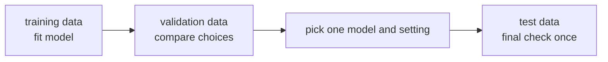

# P3-4.2 검증(validation)과 테스트(test)

P3-4.1에서는 데이터를 학습 데이터(training data)와 평가 데이터(evaluation data)로 나누는 이유를 봤습니다. 이제 한 단계 더 나아가야 합니다. 모델을 고르는 과정에서 쓰는 데이터와, 마지막에 한 번만 확인하는 데이터는 같은 역할이 아닙니다.

이 차이를 구분하지 않으면 모델을 고르는 동안 테스트 결과를 자꾸 들여다보게 되고, 그 순간 테스트 데이터는 더 이상 “처음 보는 데이터” 역할을 하지 못하게 됩니다. 그래서 실무에서는 평가 데이터를 다시 `검증 데이터(validation data)`와 `테스트 데이터(test data)`로 나누어 쓰는 경우가 많습니다.

## 이 절의 범위

이 절은 검증과 테스트의 역할 차이를 설명합니다. 여기서는 평가 지표(metric)의 계산 자체를 자세히 다루지 않습니다. 정확도, 정밀도, 재현율 같은 지표는 P3-6에서 다룹니다.

또한 이 절은 “어떤 모델을 고르는 동안 무엇을 봐야 하는가”라는 흐름을 설명하지만, 본격적인 모델 선택(model selection) 절차와 기준 모델(baseline) 논의는 P3-8에서 다시 다룹니다. 과적합(overfitting)과 일반화(generalization)의 개념은 P3-5에서 더 자세히 다룹니다.

이 절에서는 다음 질문에 답합니다.

- 검증 데이터와 테스트 데이터는 왜 따로 두는가?
- 두 데이터는 각각 언제 써야 하는가?
- 테스트 데이터를 중간에 자꾸 보면 왜 문제가 되는가?
- 데이터가 적을 때는 이 구분을 어떻게 조심해서 읽어야 하는가?
- 교차검증(cross-validation)은 이 구조와 어떻게 연결되는가?

## 이 절의 목표

- 검증(validation)과 테스트(test)의 역할 차이를 설명할 수 있습니다.
- 검증 데이터는 선택을 위한 데이터이고, 테스트 데이터는 마지막 확인용 데이터라는 점을 말할 수 있습니다.
- 테스트 데이터를 반복해서 보면 결과 해석이 왜 왜곡될 수 있는지 이해할 수 있습니다.
- 작은 데이터에서는 검증과 테스트 구분이 더 어려워질 수 있음을 설명할 수 있습니다.
- 교차검증은 테스트를 대체하는 마법이 아니라, 주어진 데이터 안에서 검증을 더 안정적으로 하려는 방법이라는 점을 이해할 수 있습니다.

## 먼저 한 장면으로 이해하기

학생이 모의고사를 풀고 대학 입시를 준비한다고 생각해 봅니다.

- 연습 문제: 배우는 과정에서 자주 풀어 본다.
- 모의고사: 어느 풀이 전략이 더 나은지 비교한다.
- 실제 시험: 마지막에 한 번 실력을 확인한다.

머신러닝에서도 비슷한 흐름이 있습니다.

| 데이터 | 하는 일 | 언제 보는가 |
| --- | --- | --- |
| 학습 데이터(training data) | 모델이 패턴을 배운다 | 학습 과정에서 계속 본다 |
| 검증 데이터(validation data) | 모델과 설정을 비교한다 | 실험 중간에 반복해서 본다 |
| 테스트 데이터(test data) | 마지막 결과를 확인한다 | 거의 마지막에 본다 |

검증 데이터와 테스트 데이터의 가장 큰 차이는 “얼마나 자주 의사결정에 쓰이는가”입니다.

## 검증 데이터는 선택을 돕는다

검증 데이터는 모델을 고르는 동안 사용합니다. 예를 들어 다음과 같은 선택에 쓰입니다.

- 로지스틱 회귀와 결정트리 중 무엇을 먼저 쓸지
- 트리 깊이를 3으로 할지 5로 할지
- 전처리를 바꿨을 때 결과가 나아졌는지
- 특징(feature)을 추가했을 때 도움이 되는지

즉, 검증 데이터는 실험 중간에 “이 선택이 이전보다 나은가?”를 비교하는 데 쓰입니다.

아주 단순한 예시로 보면 다음처럼 읽을 수 있습니다.

| 후보 | 바꾼 것 | 검증 정확도(validation accuracy) | 지금 판단 |
| --- | --- | --- | --- |
| 모델 A | 로지스틱 회귀 사용 | 0.78 | 기준점으로 둔다 |
| 모델 B | 결정트리 사용 | 0.74 | A보다 낮아 보류 |
| 모델 C | 로지스틱 회귀 + 특징 1개 추가 | 0.81 | 현재 후보 중 가장 나음 |

이 표에서 중요한 것은 숫자 자체보다 `무엇을 고르기 위해 이 숫자를 보는가`입니다. 여기서는 아직 최종 성능을 발표하는 것이 아닙니다. 지금 하는 일은 후보를 비교하고 하나를 추리는 일입니다.

업무 장면으로 바꾸어 보면 더 쉽습니다. 예를 들어 이메일 스팸 분류 서비스를 만든다고 해 봅시다.

- 후보 1: 단어 빈도만 사용
- 후보 2: 단어 빈도 + 발신자 특징 사용
- 후보 3: 후보 2에 제목 길이 특징 추가

이 세 후보 중 어떤 구성이 더 나은지 고를 때는 검증 데이터를 사용합니다. 아직 서비스에 배포할 최종 모델을 발표하는 단계가 아니기 때문입니다. 지금은 `더 나은 후보를 찾는 단계`입니다.



이 도식에서 검증 데이터는 모델을 확정하기 전 단계에 있습니다. 실험을 바꾸고 다시 보고, 다시 바꾸고 또 보는 식으로 반복적으로 등장합니다.

## 테스트 데이터는 마지막 확인용이다

테스트 데이터는 모델을 고른 뒤 마지막에 한 번 확인하는 용도에 가깝습니다.

예를 들어 다음과 같은 흐름을 생각해 볼 수 있습니다.

1. 학습 데이터로 여러 모델을 학습한다.
2. 검증 데이터로 비교해 가장 적절한 후보를 고른다.
3. 선택한 모델을 다시 정리한다.
4. 마지막에 테스트 데이터로 최종 성능을 확인한다.

테스트 데이터의 목적은 “우리가 이 실험 과정 전체를 거친 뒤에도 처음 보는 데이터에서 어느 정도 동작하는가?”를 보는 것입니다. 그래서 테스트 데이터는 가능한 한 늦게 보고, 자주 들여다보지 않는 편이 좋습니다.

같은 장면을 검증 점수와 테스트 점수로 나누어 보면 더 분명해집니다.

| 후보 | 검증 정확도(validation accuracy) | 테스트 정확도(test accuracy) | 어떻게 읽어야 하는가 |
| --- | --- | --- | --- |
| 모델 A | 0.78 | 아직 보지 않음 | 검증 단계이므로 테스트를 열지 않는다 |
| 모델 C | 0.81 | 아직 보지 않음 | 검증 기준으로 우선 선택한다 |
| 최종 선택: 모델 C | 0.81 | 0.76 | 마지막에 한 번 확인한다 |

여기서 `0.81`과 `0.76`의 차이는 이상한 일이 아닙니다. 검증 데이터에서 후보를 골랐고, 테스트 데이터는 그 선택을 처음 보는 데이터에서 다시 확인한 값이기 때문입니다.

이 차이는 초심자가 자주 오해하는 지점이기도 합니다. 검증 점수가 더 높았는데 테스트 점수가 조금 낮아졌다고 해서 바로 잘못되었다고 말할 수는 없습니다. 오히려 이것은 `선택용 데이터`와 `최종 확인용 데이터`가 다른 역할을 한다는 신호로 읽는 편이 맞습니다.

## 작은 표로 역할을 다시 구분해 보기

고객 이탈 예측 예시를 다시 써 보면 다음처럼 나눌 수 있습니다.

| 고객 ID | 최근 구매 횟수 | 문의 횟수 | 이탈 여부 | 어디에 쓰는가 |
| --- | --- | --- | --- | --- |
| C01 | 8 | 0 | 유지 | 학습 데이터 |
| C02 | 2 | 3 | 이탈 | 학습 데이터 |
| C03 | 6 | 1 | 유지 | 학습 데이터 |
| C04 | 3 | 2 | 이탈 | 검증 데이터 |
| C05 | 7 | 0 | 유지 | 검증 데이터 |
| C06 | 1 | 4 | 이탈 | 테스트 데이터 |
| C07 | 9 | 0 | 유지 | 테스트 데이터 |

이 경우 C04, C05는 실험 중간에 여러 번 보게 될 수 있습니다. 예를 들어 모델 A와 모델 B를 비교할 때 둘 다 C04, C05에서 더 좋은지 확인합니다. 하지만 C06, C07은 마지막에 한 번 보는 편이 좋습니다.

이 장면을 질문으로 바꾸면 더 분명합니다.

- `트리 깊이를 3으로 할까 5로 할까?` -> 검증 데이터에 묻는 질문
- `이 모델을 이제 발표해도 되는가?` -> 테스트 데이터에 묻는 질문

질문이 다르면 사용하는 데이터의 역할도 달라집니다.

## 왜 테스트를 자꾸 보면 안 되는가

테스트 데이터를 중간에 자꾸 보면, 사람도 모르게 그 결과에 맞추어 선택을 바꾸게 됩니다.

| 실험 순서 | 겉보기에는 합리적으로 보이는 행동 | 실제 문제 |
| --- | --- | --- |
| 모델 A 테스트 결과를 봄 | 점수가 아쉬워 다른 모델을 시도함 | 이미 테스트 결과가 선택에 영향을 줌 |
| 모델 B 테스트 결과도 봄 | 더 높은 점수를 선택함 | 테스트가 비교용 검증 데이터처럼 쓰임 |
| 설정을 더 바꿔 다시 테스트함 | 더 좋아질 때까지 반복함 | 테스트 데이터에 점점 맞춰지기 쉬움 |

이렇게 되면 테스트 데이터는 더 이상 “처음 보는 마지막 확인용 데이터”가 아닙니다. 실제로는 검증 데이터처럼 사용해 버린 것입니다.

초심자 관점에서는 이렇게 기억하면 됩니다.

- 검증 데이터는 실험 중간에 봐도 된다.
- 테스트 데이터는 마지막에 보는 편이 좋다.
- 테스트를 여러 번 보며 선택을 바꾸면 테스트도 검증처럼 오염된다.

다음과 같이 비교하면 더 쉽게 기억할 수 있습니다.

| 질문 | 검증 데이터에 해도 되는가? | 테스트 데이터에 해도 되는가? |
| --- | --- | --- |
| 이 모델과 저 모델 중 어느 쪽이 나은가? | 된다 | 보통 하지 않는다 |
| 전처리를 바꾸면 더 좋아지는가? | 된다 | 보통 하지 않는다 |
| 이 프로젝트의 최종 모델은 새 데이터에서 어느 정도인가? | 참고는 되지만 최종 확인은 아님 | 된다 |

반대로 `하면 안 되는 흐름`도 한 번 보는 것이 좋습니다.

| 단계 | 잘못된 습관 | 왜 문제인가 |
| --- | --- | --- |
| 1 | 테스트 점수를 먼저 본다 | 최종 확인용 숫자가 실험 출발점이 되어 버린다 |
| 2 | 점수가 낮아서 특징을 더 추가한다 | 이미 테스트에 맞추어 선택을 바꾸기 시작한다 |
| 3 | 다시 테스트 점수를 본다 | 테스트가 사실상 검증 데이터처럼 쓰인다 |
| 4 | 가장 높게 나온 조합을 채택한다 | 새 데이터에서의 성능 추정이 과장될 수 있다 |

## Python 예제로 분리 구조 보기

다음 코드는 한 번에 `학습`, `검증`, `테스트` 세 부분으로 나누는 가장 단순한 구조를 보여 줍니다.

```python
from sklearn.model_selection import train_test_split

X = [[i] for i in range(12)]
y = ["stay", "churn", "stay", "stay", "churn", "stay", "stay", "churn", "stay", "stay", "churn", "stay"]

X_train, X_temp, y_train, y_temp = train_test_split(
    X,
    y,
    test_size=0.4,
    random_state=42,
)

X_val, X_test, y_val, y_test = train_test_split(
    X_temp,
    y_temp,
    test_size=0.5,
    random_state=42,
)

print("train size:", len(X_train))
print("validation size:", len(X_val))
print("test size:", len(X_test))
print("validation labels:", y_val)
print("test labels:", y_test)
```

실행 결과 예시는 다음처럼 읽을 수 있습니다.

```text
train size: 7
validation size: 2
test size: 3
validation labels: ['stay', 'churn']
test labels: ['stay', 'stay', 'churn']
```

이 코드는 한 번에 세 덩어리를 직접 나누는 대신, 먼저 `학습`과 `임시 평가용 데이터`로 나누고, 그다음 임시 데이터를 다시 `검증`과 `테스트`로 나눕니다. 초심자에게는 이 두 단계 분리가 오히려 더 읽기 쉽습니다.

## Python 예제로 “선택”과 “최종 확인”을 따로 보기

이번에는 아주 작은 실험 기록을 코드 출력으로 읽어 봅니다. 아래 코드는 실제 모델을 학습하지 않고도, 검증 점수와 테스트 점수를 어떤 순서로 읽어야 하는지 보여 줍니다.

```python
candidates = [
    {"name": "model_A", "validation_score": 0.78},
    {"name": "model_B", "validation_score": 0.74},
    {"name": "model_C", "validation_score": 0.81},
]

best = max(candidates, key=lambda item: item["validation_score"])

print("candidate scores on validation:")
for item in candidates:
    print(item["name"], "->", item["validation_score"])

print("chosen by validation:", best["name"])

test_score = 0.76
print("final test score:", test_score)
```

실행 결과 예시는 다음처럼 읽습니다.

```text
candidate scores on validation:
model_A -> 0.78
model_B -> 0.74
model_C -> 0.81
chosen by validation: model_C
final test score: 0.76
```

이 출력에서 핵심은 순서입니다.

1. 먼저 검증 점수로 후보를 비교합니다.
2. 그다음 하나를 선택합니다.
3. 마지막에 테스트 점수를 확인합니다.

초심자 기준으로는 이 순서만 분명히 기억해도 충분합니다. `검증은 고르는 데 사용`, `테스트는 고른 뒤 확인`이라는 구조가 Python 출력에서도 그대로 보입니다.

## Python 예제로 잘못된 흐름도 같이 보기

다음 예제는 무엇이 문제인지 보여 주기 위한 기록입니다. 좋은 실험 절차가 아니라, `왜 테스트를 자주 보면 안 되는가`를 드러내는 예시입니다.

```python
test_scores_seen_too_early = {
    "model_A": 0.74,
    "model_B": 0.77,
}

print("looked at test too early:")
for name, score in test_scores_seen_too_early.items():
    print(name, "->", score)

print("decision changed after seeing test scores")
print("problem: test data has started to influence model choice")
```

실행 결과 예시는 다음처럼 읽습니다.

```text
looked at test too early:
model_A -> 0.74
model_B -> 0.77
decision changed after seeing test scores
problem: test data has started to influence model choice
```

이 코드는 계산을 보여 주기보다 해석을 보여 줍니다. `테스트 점수를 먼저 보고 그에 따라 선택을 바꾸는 순간`, 테스트 데이터는 이미 최종 확인용 역할에서 벗어나기 시작합니다.

## 검증과 테스트를 어떻게 읽어야 하는가

실험 결과를 읽을 때는 숫자 하나보다 역할을 먼저 구분해야 합니다.

| 값 | 먼저 물어볼 질문 |
| --- | --- |
| 검증 점수(validation score) | 여러 후보 중 무엇을 고를지 비교하는 값인가? |
| 테스트 점수(test score) | 최종 선택 이후 한 번 확인한 값인가? |
| 테스트 점수가 유난히 좋음 | 중간에 테스트를 여러 번 보지는 않았는가? |
| 검증과 테스트 차이가 큼 | 검증 과정에서 선택을 너무 많이 반복했는가? 데이터가 작아 흔들린 것인가? |

이 절에서는 아직 평가 지표의 종류를 자세히 다루지 않습니다. 지금은 같은 `0.82`라는 숫자라도 검증 점수인지 테스트 점수인지에 따라 의미가 달라진다는 점이 중요합니다.

그래서 실험 기록을 읽을 때는 다음처럼 문장을 완성해 보는 습관이 도움이 됩니다.

- 이 숫자는 `모델 선택을 위해 본 검증 점수`인가?
- 이 숫자는 `최종 선택 뒤 확인한 테스트 점수`인가?
- 이 숫자를 보고 `다시 모델을 바꾸었는가`?

세 번째 질문의 답이 `예`라면, 그 숫자는 이미 최종 확인용 숫자만은 아닐 가능성이 큽니다.

## 데이터가 적을 때는 더 신중해야 한다

데이터가 충분히 많지 않으면 학습, 검증, 테스트를 모두 따로 떼어 두기 어렵습니다.

| 문제 | 왜 생기는가 |
| --- | --- |
| 학습 데이터가 너무 줄어듦 | 세 조각으로 나누면 각 조각이 작아집니다. |
| 검증 점수가 흔들림 | 검증 데이터가 너무 작으면 우연의 영향이 커집니다. |
| 테스트 점수도 불안정함 | 마지막 확인 데이터가 너무 적을 수 있습니다. |

이럴 때 교차검증(cross-validation)을 쓰기도 합니다. 교차검증은 주어진 데이터 안에서 검증을 여러 번 반복해 비교를 더 안정적으로 하려는 방법입니다. 다만 교차검증을 쓴다고 해서 테스트 데이터가 필요 없어지는 것은 아닙니다. 실제 프로젝트에서는 데이터 크기와 목적에 따라 검증 구조를 조정해야 합니다.

예를 들어 고객 데이터가 30건뿐이라면 다음 같은 문제가 바로 생깁니다.

| 나누는 방식 | 생길 수 있는 느낌 |
| --- | --- |
| 학습 20 / 검증 5 / 테스트 5 | 검증과 테스트 숫자가 너무 작아 한두 건 차이로 점수가 크게 흔들릴 수 있다 |
| 학습 24 / 평가 6 | 일단은 단순하지만, 검증과 테스트를 따로 두기 어렵다 |
| 교차검증 사용 | 작은 데이터에서 검증을 여러 번 돌려 비교를 조금 더 안정적으로 읽으려는 선택이 된다 |

이 절에서 중요한 것은 “정답 비율이 몇 대 몇이어야 한다”가 아니라, 데이터가 작을수록 검증과 테스트의 해석이 더 조심스러워진다는 점입니다.

## 이 절에서 기억할 관점

- 검증 데이터(validation data)는 모델과 설정을 비교하는 데 쓰는 데이터입니다.
- 테스트 데이터(test data)는 최종 선택 뒤 마지막 확인에 쓰는 데이터입니다.
- 검증 데이터는 실험 중간에 반복해서 볼 수 있습니다.
- 테스트 데이터는 자주 들여다볼수록 마지막 확인용 역할이 약해집니다.
- 테스트 결과에 맞추어 선택을 계속 바꾸면 테스트도 사실상 검증 데이터처럼 오염됩니다.
- 데이터가 작을 때는 검증과 테스트를 모두 안정적으로 확보하기가 더 어려워집니다.

## 체크리스트

- 검증 데이터와 테스트 데이터의 역할 차이를 설명할 수 있는가?
- 검증 데이터가 왜 모델 선택 과정에서 필요한지 말할 수 있는가?
- 테스트 데이터를 중간에 자주 보면 왜 문제가 되는지 설명할 수 있는가?
- 같은 숫자라도 검증 점수와 테스트 점수는 의미가 다르다는 점을 이해했는가?
- 데이터가 작을 때 교차검증이 왜 등장하는지 직관적으로 설명할 수 있는가?
- 평가 지표의 계산은 P3-6, 모델 선택 절차는 P3-8에서 더 다룰 내용임을 구분할 수 있는가?

## 출처와 참고 자료

- scikit-learn developers, `Cross-validation: evaluating estimator performance`, scikit-learn User Guide, 확인 날짜: 2026-06-26. [https://scikit-learn.org/stable/modules/cross_validation.html](https://scikit-learn.org/stable/modules/cross_validation.html){: target="_blank" rel="noopener noreferrer" }
- scikit-learn developers, `train_test_split`, scikit-learn API Reference, 확인 날짜: 2026-06-26. [https://scikit-learn.org/stable/modules/generated/sklearn.model_selection.train_test_split.html](https://scikit-learn.org/stable/modules/generated/sklearn.model_selection.train_test_split.html){: target="_blank" rel="noopener noreferrer" }
- Gareth James, Daniela Witten, Trevor Hastie, Robert Tibshirani, Jonathan Taylor, `An Introduction to Statistical Learning`, Springer, 공식 웹사이트 확인 날짜: 2026-06-26. [https://www.statlearning.com/](https://www.statlearning.com/){: target="_blank" rel="noopener noreferrer" }
