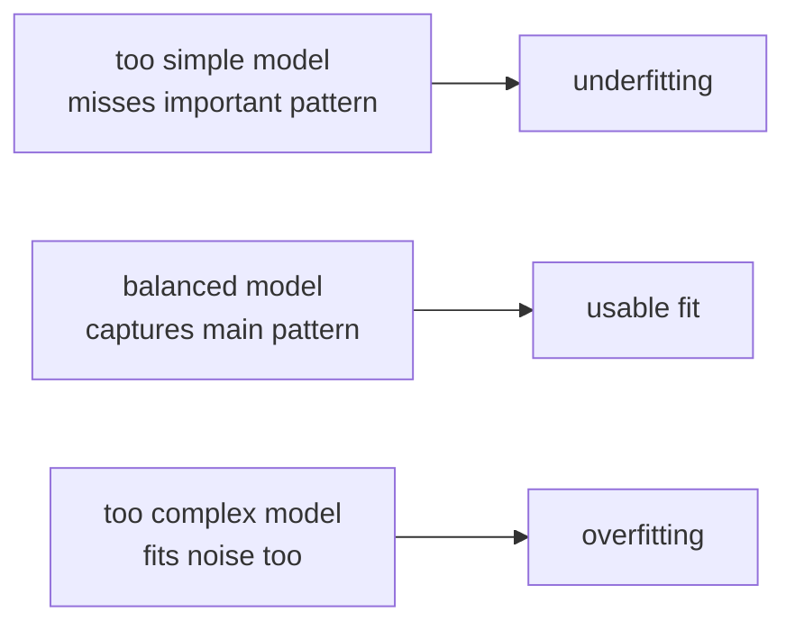

# P3-5.1 과적합(overfitting)과 과소적합(underfitting)

P3-4장에서는 데이터를 학습용, 검증용, 테스트용으로 나누는 이유를 봤습니다. 이제 다음 질문이 자연스럽게 이어집니다. 데이터를 나누어 확인했더니 왜 어떤 모델은 학습 데이터에서는 잘 맞는데 새 데이터에서는 약해질까요? 반대로 왜 어떤 모델은 학습 데이터조차 충분히 설명하지 못할까요?

이 절은 그 두 상태를 구분하는 데 목적이 있습니다. `과적합(overfitting)`은 학습 데이터에 너무 맞춘 상태이고, `과소적합(underfitting)`은 아직 중요한 패턴을 충분히 배우지 못한 상태입니다. 머신러닝에서는 이 둘 사이를 구분할 수 있어야 다음 선택이 가능합니다.

## 이 절의 범위

이 절은 과적합과 과소적합의 기본 구분을 설명합니다. 아직 정규화(regularization), 드롭아웃(dropout), 조기 종료(early stopping) 같은 구체적 완화 기법은 다루지 않습니다. 그런 대응 방법은 Part 4 딥러닝과 이후의 모델별 장에서 다시 다룹니다.

또한 이 절은 `왜 새 데이터에서 잘 작동하는가`라는 더 넓은 질문 전체를 끝내지 않습니다. 그 질문은 P3-5.2 `일반화(generalization)`에서 이어집니다. 여기서는 먼저 “너무 맞춘 상태”와 “충분히 못 배운 상태”를 눈으로 구분하는 데 집중합니다.

이 절에서는 다음 질문에 답합니다.

- 과적합과 과소적합은 각각 어떤 상태인가?
- 왜 학습 데이터 점수만으로는 모델을 믿기 어려운가?
- 학습 점수와 검증 점수를 같이 봐야 하는 이유는 무엇인가?
- 모델이 너무 단순하거나 너무 복잡할 때 어떤 일이 생기는가?
- 실무에서 어떤 장면으로 이 문제를 체감하게 되는가?

## 이 절의 목표

- 과적합과 과소적합의 차이를 설명할 수 있습니다.
- 학습 점수(training score)와 검증 점수(validation score)를 함께 읽어야 하는 이유를 말할 수 있습니다.
- 학습 데이터에만 너무 맞춘 상태가 왜 위험한지 설명할 수 있습니다.
- 단순한 모델이 왜 중요한 패턴을 놓칠 수 있는지 설명할 수 있습니다.
- 이후 P3-5.2의 일반화 논의로 자연스럽게 넘어갈 수 있습니다.

## 먼저 두 상태를 한 번에 잡기

초심자에게는 다음 표가 가장 빠릅니다.

| 상태 | 학습 데이터에서의 모습 | 새 데이터에서의 모습 | 해석 |
| --- | --- | --- | --- |
| 과소적합(underfitting) | 잘 못 맞춘다 | 역시 잘 못 맞춘다 | 모델이 아직 너무 단순하거나 덜 배웠다 |
| 적절한 상태 | 꽤 잘 맞춘다 | 새 데이터에서도 비슷하게 작동한다 | 중요한 패턴을 어느 정도 잡았다 |
| 과적합(overfitting) | 너무 잘 맞춘다 | 새 데이터에서는 성능이 떨어진다 | 학습 데이터의 우연한 흔들림까지 너무 따라갔다 |

이 절에서는 아직 `정확도 0.83가 좋으냐` 같은 수치 해석보다, `두 데이터에서의 차이`를 먼저 읽습니다.

여기서 용어를 아주 짧게 다시 잡아 두는 편이 좋습니다.

- `적합(fit)`은 모델이 데이터의 패턴을 얼마나 설명하고 따라가느냐를 뜻합니다.
- `과소적합(underfitting)`은 설명이 부족한 쪽으로 치우친 상태입니다.
- `과적합(overfitting)`은 설명이 지나치게 세밀한 쪽으로 치우친 상태입니다.

즉, 둘 다 `적합`의 문제이지만 방향이 다릅니다.

- 과소적합: 아직 충분히 설명하지 못한다
- 과적합: 너무 많이 설명하려다 불필요한 흔들림까지 따라간다

초심자에게는 이 차이를 `덜 배운 상태`와 `너무 외운 상태`로 기억해도 좋습니다.

## 과소적합은 아직 덜 배운 상태다

과소적합은 모델이 문제의 중요한 구조를 아직 충분히 잡지 못한 상태입니다. 너무 단순한 규칙을 쓰거나, 학습이 충분히 진행되지 않았거나, 필요한 특징(feature)을 거의 보지 못할 때 자주 생깁니다.

조금 더 엄밀하게 말하면, 과소적합은 `모델이 표현할 수 있는 설명의 폭이 너무 좁거나`, `그 폭을 아직 충분히 활용하지 못한 상태`입니다. 그래서 학습 데이터 안에서도 반복적으로 놓치는 부분이 생깁니다.

이 상태에서는 보통 다음 특징이 같이 보입니다.

| 관찰 장면 | 과소적합 쪽 해석 |
| --- | --- |
| 학습 점수가 낮다 | 이미 본 데이터도 충분히 설명하지 못한다 |
| 검증 점수도 낮다 | 새 데이터에서도 당연히 약하다 |
| 학습과 검증 차이가 작다 | 차이가 작아도 좋은 것이 아니라, 둘 다 낮아서 함께 약한 상태일 수 있다 |

이 때문에 초심자는 `차이가 작으니 괜찮다`고 오해할 수 있습니다. 하지만 둘 다 낮으면, 모델이 안정적인 것이 아니라 `아직 너무 약한 상태`일 수 있습니다.

예를 들어 고객 이탈 예측에서 `최근 구매 횟수만 본다`고 가정해 봅시다. 실제로는 문의 횟수, 최근 로그인, 결제 실패 여부도 중요한데 한 변수만 보고 판단하면, 모델은 처음부터 너무 단순한 출발을 하게 됩니다.

| 고객 ID | 최근 구매 횟수 | 문의 횟수 | 실제 이탈 여부 | 너무 단순한 규칙의 예 |
| --- | --- | --- | --- | --- |
| C01 | 8 | 0 | 유지 | 유지 |
| C02 | 2 | 3 | 이탈 | 이탈 |
| C03 | 6 | 4 | 이탈 | 유지 |
| C04 | 5 | 5 | 이탈 | 유지 |

위 표에서는 구매 횟수만 보면 C03, C04를 놓치기 쉽습니다. 이 경우는 모델이 복잡해져서 생긴 문제가 아니라, 아직 필요한 패턴을 충분히 설명하지 못해서 생긴 문제에 가깝습니다.

다른 장면으로 바꾸어도 같은 문제가 보입니다.

| 업무 | 너무 단순한 판단의 예 | 놓치기 쉬운 것 |
| --- | --- | --- |
| 스팸 분류 | 제목에 `무료`가 있으면 모두 스팸으로 본다 | 정상 광고 메일과 교묘한 스팸을 함께 구분하지 못한다 |
| 고객 추천 | 최근 구매 1개 품목만 보고 추천한다 | 오래된 취향 변화나 여러 관심사를 반영하지 못한다 |
| 가격 예측 | 방 개수만 보고 집값을 예측한다 | 위치, 연식, 교통, 수리 상태 같은 큰 요인을 놓친다 |

이 세 경우 모두 공통점은 같습니다. `설명이 너무 적어서 중요한 차이를 못 담는 상태`라는 점입니다.

즉, 과소적합은 보통 다음 질문으로 요약할 수 있습니다.

`이 모델은 문제를 풀기 위해 필요한 정도만큼도 아직 설명력을 갖추지 못했는가?`

## 과적합은 너무 많이 외운 상태다

과적합은 모델이 학습 데이터에 너무 밀착한 상태입니다. 중요한 패턴만 잡은 것이 아니라, 그 데이터 안에 우연히 들어 있던 흔들림이나 특이한 배치까지 함께 따라간 경우를 말합니다.

여기서 중요한 단어가 `우연한 흔들림`입니다. 모든 데이터에는 실제로 중요한 구조(signal)도 있고, 그때그때 섞여 들어간 우연한 변동(noise)도 있습니다. 과적합은 이 둘을 충분히 구분하지 못한 채, 잡음까지 `배워야 할 규칙`처럼 다루는 상태라고 볼 수 있습니다.

조금 더 엄밀하게 읽으면 과적합은 다음 질문으로 바꿀 수 있습니다.

`이 모델은 일반적인 패턴보다, 이번 학습 데이터에만 우연히 있던 모양까지 너무 따라간 것은 아닌가?`

이 상태에서는 보통 다음 특징이 같이 보입니다.

| 관찰 장면 | 과적합 쪽 해석 |
| --- | --- |
| 학습 점수가 매우 높다 | 이미 본 데이터에는 지나치게 잘 맞는다 |
| 검증 점수가 기대보다 낮다 | 새 데이터에서는 그만큼 잘 버티지 못한다 |
| 학습과 검증 차이가 크다 | 학습 데이터에만 강한 설명이 생겼을 가능성이 있다 |

업무 장면으로 바꾸면 이렇습니다.

- 학습 데이터에서는 거의 완벽하게 맞춘다.
- 검증 데이터에서는 생각보다 점수가 떨어진다.
- 그런데 팀은 학습 점수만 보고 “잘 됐다”고 착각할 수 있다.

예를 들어 스팸 분류 모델이 학습 이메일에서는 99%를 맞추지만, 새 이메일에서는 81%만 맞춘다고 해 봅시다. 이때 모델은 학습 데이터에 익숙해진 것이지, 일반적인 스팸 패턴을 충분히 배운 것은 아닐 수 있습니다.

추천 시스템에서도 비슷한 장면이 생깁니다.

- 학습 데이터에서는 특정 사용자들의 과거 클릭을 거의 완벽하게 설명한다.
- 그런데 새로 들어온 사용자나 최근 취향이 바뀐 사용자에게는 추천이 약해진다.

이때 모델은 “추천 원리”를 배운 것보다, `기존 기록을 너무 세게 기억한 상태`일 수 있습니다.

초심자에게는 다음 구분도 도움이 됩니다.

| 질문 | 과적합일 때의 답 |
| --- | --- |
| 이미 본 데이터에는 강한가? | 그렇다 |
| 처음 보는 데이터에도 같은 힘을 보이는가? | 꼭 그렇지 않다 |
| 문제는 데이터 부족인가, 외운 정도가 너무 큰 것인가? | 종종 후자일 수 있다 |

즉, 과적합은 “모델이 똑똑해졌다”기보다 “이번 문제지에 너무 익숙해졌다”에 더 가까운 경우가 많습니다.

## 점수는 항상 두 장면으로 읽는다

과적합과 과소적합은 대개 `학습 점수`와 `검증 점수`를 같이 보면서 읽습니다.

| 후보 | 학습 정확도(training accuracy) | 검증 정확도(validation accuracy) | 읽는 법 |
| --- | --- | --- | --- |
| 모델 A | 0.62 | 0.60 | 둘 다 낮다. 과소적합 가능성이 있다 |
| 모델 B | 0.84 | 0.82 | 둘이 비슷하고 둘 다 괜찮다 |
| 모델 C | 0.99 | 0.78 | 학습만 너무 높다. 과적합 가능성이 있다 |

여기서 핵심은 `검증 점수가 학습 점수보다 조금 낮은 것` 자체가 아니라, `차이가 왜 그렇게 생겼는가`입니다.

- 둘 다 낮다 -> 아직 중요한 구조를 잘 못 잡고 있을 수 있다
- 둘 다 높고 차이가 작다 -> 비교적 안정적일 수 있다
- 학습만 매우 높고 검증이 크게 떨어진다 -> 학습 데이터에 너무 맞췄을 수 있다

초심자는 특히 첫 번째와 세 번째를 자주 헷갈립니다.

| 흔한 오해 | 실제로는 |
| --- | --- |
| 검증 점수가 낮으니 무조건 과적합이다 | 학습 점수도 함께 낮으면 과소적합일 수 있다 |
| 학습 점수가 높으니 좋은 모델이다 | 검증 점수가 함께 봐야 한다 |
| 차이가 조금만 나도 문제다 | 약간의 차이는 자연스럽다. 문제는 `패턴`과 `크기`다 |

한 줄로 정리하면 이렇습니다.

- 과소적합은 모델이 아직 부족한 상태
- 과적합은 모델이 너무 과하게 맞춘 상태

## 실무 장면으로 다시 읽기

고객 이탈 예측 프로젝트를 예로 들면, 팀은 보통 다음 두 장면 중 하나를 보게 됩니다.

| 장면 | 겉으로 보이는 현상 | 실제로 의심할 것 |
| --- | --- | --- |
| 모델이 학습 데이터에서만 매우 좋다 | 내부 검토에서는 훌륭해 보임 | 과적합 가능성 |
| 모델이 학습 데이터에서도 별로다 | 어디서도 점수가 잘 안 나옴 | 과소적합 가능성 |

초심자에게 중요한 것은 “점수가 낮으면 무조건 나쁜 모델”처럼 읽지 않는 것입니다. 왜 낮은지, 어느 데이터에서 낮은지가 먼저입니다.

실제 회의 장면처럼 말하면 다음과 같습니다.

| 팀의 말 | 더 정확한 해석 |
| --- | --- |
| “학습 점수가 99%니까 거의 끝난 것 아닌가요?” | 검증 점수와의 차이를 먼저 봐야 한다 |
| “검증 점수가 60%면 모델이 쓸모없다는 뜻인가요?” | 학습 점수도 낮다면 아직 덜 배운 것일 수 있다 |
| “더 복잡하게 만들면 다 해결되지 않나요?” | 복잡도는 표현력을 늘리지만, 과적합 위험도 함께 키울 수 있다 |

따라서 실무에서 중요한 것은 단순히 `복잡한 모델 vs 단순한 모델`의 싸움이 아닙니다. 더 정확하게는 `현재 데이터와 문제에 비해 설명이 부족한가, 과한가`를 판단하는 일입니다.

## 도식으로 보면 더 빠르다



이 도식은 정확한 수학 설명이 아니라 방향 설명입니다. 왼쪽은 아직 부족한 상태, 가운데는 비교적 균형 잡힌 상태, 오른쪽은 지나치게 맞춘 상태를 뜻합니다.

이 도식을 문장으로 바꾸면 다음과 같습니다.

- 왼쪽: 아직 중요한 구조를 놓친다
- 가운데: 중요한 구조를 주로 잡는다
- 오른쪽: 중요한 구조뿐 아니라 우연한 흔들림까지 잡으려 든다

## Python 예제로 과소적합과 과적합 읽기

다음 코드는 실제 학습을 시키지 않고도, 점수 조합을 어떻게 읽는지 보여 줍니다.

```python
models = [
    {"name": "simple_rule", "train_score": 0.62, "validation_score": 0.60},
    {"name": "balanced_model", "train_score": 0.84, "validation_score": 0.82},
    {"name": "very_complex_model", "train_score": 0.99, "validation_score": 0.78},
]

for item in models:
    gap = round(item["train_score"] - item["validation_score"], 2)
    print(item["name"])
    print("  train score:", item["train_score"])
    print("  validation score:", item["validation_score"])
    print("  gap:", gap)
```

실행 결과 예시는 다음처럼 읽습니다.

```text
simple_rule
  train score: 0.62
  validation score: 0.6
  gap: 0.02
balanced_model
  train score: 0.84
  validation score: 0.82
  gap: 0.02
very_complex_model
  train score: 0.99
  validation score: 0.78
  gap: 0.21
```

이 출력에서 봐야 할 것은 `gap` 하나만이 아닙니다.

- `simple_rule`은 차이는 작지만 둘 다 낮습니다. 이것은 과소적합 해석에 더 가깝습니다.
- `balanced_model`은 둘 다 높고 차이도 작습니다. 비교적 안정적인 상태로 읽을 수 있습니다.
- `very_complex_model`은 학습 점수는 매우 높지만 검증 점수와 차이가 큽니다. 과적합 의심 장면입니다.

즉, 차이가 작다고 항상 좋은 것도 아니고, 학습 점수가 높다고 항상 좋은 것도 아닙니다.

이 문장을 더 정확히 바꾸면 다음과 같습니다.

- `낮음 + 낮음`은 부족해서 못 맞추는 상태일 수 있다
- `높음 + 비슷하게 높음`은 비교적 안정적인 상태일 수 있다
- `매우 높음 + 눈에 띄게 낮음`은 학습 데이터에 너무 맞춘 상태일 수 있다

같은 예제를 한 줄 판단으로 바꾸면 이렇게 정리할 수 있습니다.

```text
simple_rule -> 아직 너무 단순하다
balanced_model -> 현재 후보 중 가장 안정적이다
very_complex_model -> 학습 데이터에는 너무 세게 맞췄을 수 있다
```

## Python 예제로 업무 질문 붙이기

이번에는 같은 숫자에 업무 질문을 붙여 봅니다.

```python
cases = [
    {"name": "candidate_A", "train_score": 0.65, "validation_score": 0.61},
    {"name": "candidate_B", "train_score": 0.88, "validation_score": 0.85},
    {"name": "candidate_C", "train_score": 0.98, "validation_score": 0.76},
]

for item in cases:
    gap = round(item["train_score"] - item["validation_score"], 2)
    print(item["name"], "-> train:", item["train_score"], "validation:", item["validation_score"], "gap:", gap)

best = max(cases, key=lambda item: item["validation_score"])
print("choose by validation:", best["name"])
```

실행 결과 예시는 다음처럼 나올 수 있습니다.

```text
candidate_A -> train: 0.65 validation: 0.61 gap: 0.04
candidate_B -> train: 0.88 validation: 0.85 gap: 0.03
candidate_C -> train: 0.98 validation: 0.76 gap: 0.22
choose by validation: candidate_B
```

이 예제에서 `candidate_C`는 학습 점수만 보면 가장 좋아 보입니다. 하지만 실제 선택은 검증 점수를 기준으로 `candidate_B`가 됩니다. 이것이 과적합을 경계하는 가장 기본적인 읽기 방식입니다.

여기서 초심자가 기억할 핵심 문장은 하나입니다.

`모델 선택은 학습 점수 최고를 고르는 일이 아니라, 검증 기준에서 더 안정적인 후보를 고르는 일이다.`

그리고 그 안정성 판단의 중심에는 결국 이 질문이 있습니다.

`이 모델은 배워야 할 패턴을 잡은 것인가, 아니면 이번 데이터의 모양을 너무 많이 따라간 것인가?`

## 작은 도식으로 다시 보기

아래 표는 세 상태를 더 직관적으로 보여 줍니다.

| 모델 상태 | 학습 점수 | 검증 점수 | 읽는 느낌 |
| --- | --- | --- | --- |
| 너무 단순함 | 낮음 | 낮음 | 아직 덜 배웠다 |
| 적절함 | 높음 | 비슷하게 높음 | 새 데이터에서도 버틸 가능성이 있다 |
| 너무 복잡함 | 매우 높음 | 상대적으로 낮음 | 학습 데이터에 과하게 맞췄다 |

이 표는 정확한 수학 공식이 아니라, 실무에서 처음 상태를 읽는 출발점입니다.

그래서 과적합과 과소적합은 단지 시험 문제 용어가 아니라, 모델을 읽는 첫 번째 진단 언어라고 볼 수 있습니다.

## 왜 복잡한 모델이 항상 좋은 것은 아닌가

모델이 더 복잡해지면 더 많은 패턴을 표현할 수 있습니다. 이것 자체는 장점입니다. 하지만 데이터가 적거나, 특징이 불안정하거나, 우연한 흔들림이 많은 상황에서는 그 복잡함이 오히려 학습 데이터의 잡음(noise)까지 따라가게 만들 수 있습니다.

scikit-learn의 공식 예시도 이 점을 보여 줍니다. 단순한 함수는 학습 샘플을 충분히 설명하지 못해 과소적합이 되고, 반대로 너무 높은 차수의 다항식은 학습 데이터의 잡음까지 배우며 과적합될 수 있다고 설명합니다. 이 절에서는 그 수학적 형태 전체보다, `모델 복잡도와 새 데이터 성능이 항상 함께 좋아지지는 않는다`는 관점이 더 중요합니다.

그래서 다음처럼 읽는 습관이 중요합니다.

1. 지금 보는 점수는 학습 점수인가, 검증 점수인가?
2. 둘의 차이는 작은가, 큰가?
3. 둘 다 낮은가, 아니면 학습만 유난히 높은가?
4. 지금 문제는 `더 배워야 하는가` 아니면 `덜 외워야 하는가`?

네 번째 질문은 초심자에게 특히 유용합니다.

- 더 배워야 하는가 -> 과소적합 쪽 의심
- 덜 외워야 하는가 -> 과적합 쪽 의심

이 두 질문은 이후 장에서도 계속 쓸 수 있습니다.

- 선형회귀를 볼 때도
- 결정트리를 볼 때도
- 신경망을 볼 때도

먼저 묻는 질문은 비슷합니다. `지금 이 모델은 덜 배운 것인가, 너무 외운 것인가?`

## 이 절에서 기억할 관점

- 과소적합(underfitting)은 모델이 아직 중요한 패턴을 충분히 배우지 못한 상태입니다.
- 과적합(overfitting)은 모델이 학습 데이터에 너무 밀착한 상태입니다.
- 학습 점수만으로는 모델을 판단하기 어렵습니다.
- 검증 점수와 함께 봐야 새 데이터에서의 약점을 더 빨리 찾을 수 있습니다.
- 학습 점수가 매우 높아도 검증 점수가 낮아지면 과적합을 의심해야 합니다.
- 둘 다 낮으면 과소적합 가능성을 먼저 생각할 수 있습니다.

## 체크리스트

- 과적합과 과소적합을 각각 한 문장으로 설명할 수 있는가?
- 왜 학습 데이터 점수만 보면 착각할 수 있는지 설명할 수 있는가?
- `학습은 높고 검증은 낮은` 장면을 과적합 의심 상태로 읽을 수 있는가?
- `학습도 낮고 검증도 낮은` 장면을 과소적합 의심 상태로 읽을 수 있는가?
- 후보 선택은 검증 데이터 기준으로 해야 한다는 점을 설명할 수 있는가?
- 일반화(generalization)의 더 넓은 의미는 다음 절 P3-5.2에서 이어진다는 점을 알고 있는가?

## 출처와 참고 자료

- scikit-learn developers, `Underfitting vs. Overfitting`, scikit-learn Examples, 확인 날짜: 2026-06-26. [https://scikit-learn.org/stable/auto_examples/model_selection/plot_underfitting_overfitting.html](https://scikit-learn.org/stable/auto_examples/model_selection/plot_underfitting_overfitting.html){: target="_blank" rel="noopener noreferrer" }
- Google for Developers, `Machine Learning Glossary`, 확인 날짜: 2026-06-26. [https://developers.google.com/machine-learning/glossary](https://developers.google.com/machine-learning/glossary){: target="_blank" rel="noopener noreferrer" }
- Gareth James, Daniela Witten, Trevor Hastie, Robert Tibshirani, Jonathan Taylor, `An Introduction to Statistical Learning`, Springer, 공식 웹사이트 확인 날짜: 2026-06-26. [https://www.statlearning.com/](https://www.statlearning.com/){: target="_blank" rel="noopener noreferrer" }
