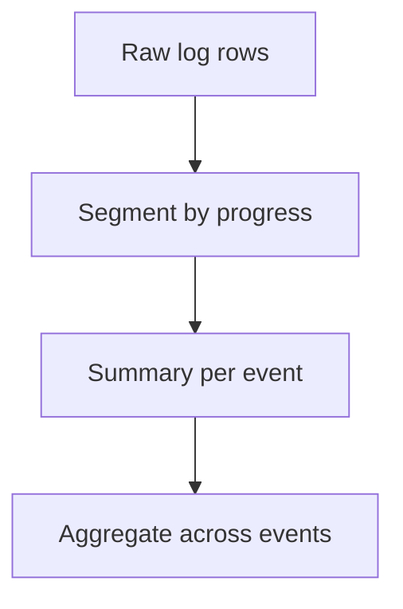

# P3-5.1 원시 로그를 비교 가능한 표로 어떻게 바꾸는가

> Section ID: `P3-5.1`
> Version: `v2026.07.06`

원시 로그를 처음 보면 데이터가 매우 풍부해 보입니다. 시간 순서대로 값이 많이 쌓여 있고, 센서도 여럿이고, 제어 파라미터도 함께 보일 수 있기 때문입니다. 하지만 이런 풍부함이 곧바로 비교 가능한 데이터셋을 뜻하지는 않습니다. 샘플 단위를 정한 뒤에는 원시 로그를 요약 표와 집계 표로 바꾸는 절차가 필요합니다. 원시 로그와 요약 표, 집계 표는 서로 다른 역할을 맡고 있으며, 한 행이 뜻하는 대상도 다릅니다.

이 절은 Part 3 안에서 `원시 로그 -> 요약 표 -> 집계 표` 변환 절차를 가장 먼저 고정하는 대표 설명 위치입니다. 뒤 절에서 요약 표가 어떤 패턴을 남겨야 하는지 더 자세히 다루더라도, 표 변환의 큰 흐름 자체는 여기와 [개념사전](../../../reference/concept-glossary.md)으로 다시 돌아오면 됩니다.

자동으로 실행되는 동작을 예로 들겠습니다. 원시 로그에서는 동작 중 매 시점마다 센서 값과 제어값이 한 줄씩 남습니다. 반면 요약 표에서는 자동으로 실행된 동작 1회가 한 행이 됩니다. 집계 표에서는 최근 20건 평균이나 평소 구간 평균처럼, 여러 동작을 다시 묶은 결과가 한 행이 될 수 있습니다.

| 표의 종류 | 한 행이 뜻하는 것 | 주로 답하는 질문 |
| --- | --- | --- |
| 원시 로그 | 동작 중 한 시점의 기록 | 지금 무엇이 측정되었는가 |
| 요약 표 | 동작 1회 전체를 요약한 샘플 | 이번 동작은 어떤 구조였는가 |
| 집계 표 | 여러 동작을 묶은 최근 또는 기준선 요약 | 최근 변화가 평소와 다른가 |

이 차이는 단지 표 이름이 다른 정도가 아닙니다. 원시 로그는 세부 흐름을 보존하는 데 강하지만, 동작 전체를 비교하기는 어렵습니다. 요약 표는 동작 간 비교를 쉽게 만들지만, 순간적인 세부 흔들림은 대부분 압축해서 잃습니다. 집계 표는 최근 상태를 빠르게 읽게 해 주지만, 개별 동작의 특수한 모양은 지워질 수 있습니다.

그래서 `요약`을 단순한 축소로 이해하면 곤란합니다. 동작 1회 요약 행은 원시 시계열 여러 행을 사람이 비교하고 모델이 다루기 쉬운 한 행으로 바꾼 결과입니다. 여기서 중요한 것은 샘플 단위를 다시 정의하는 일이 아니라, 이미 정한 샘플 단위 위에 비교 가능한 표를 만드는 절차라는 점입니다. 비교를 쉽게 만들어 주지만, 원시 시계열의 모든 맥락을 대체하지는 않습니다.

그래서 표를 볼 때는 먼저 `열이 무엇인가`보다 `행 하나가 무엇인가`를 물어야 합니다. 원시 로그의 한 행은 보통 아직 샘플 1건이 아닙니다. 요약 표의 한 행이 되어서야 비로소 동작 1회를 비교 가능한 샘플로 읽을 수 있습니다. 집계 표는 더 나아가 샘플 여러 개를 다시 묶어 비교 구조를 만든 것입니다.

원시 로그에서 요약 표로 넘어갈 때는 단지 행 수만 줄이는 것이 아닙니다. 이 단계에서는 `어느 구간을 나눌 것인가`, `어떤 변화율을 계산할 것인가`, `어떤 센서값을 대표값으로 남길 것인가`를 함께 정해야 합니다. 예를 들어 동작 1회 요약 표에는 총 동작 시간, 초반 평균 압력, 중반 평균 유량, 후반 하강률, 제어 추종 오차 같은 열이 들어갈 수 있습니다. 이 값들은 원시 로그에 원래 한 줄로 적혀 있던 값이 아니라, 여러 시점 값을 사람이 비교하기 좋은 형태로 다시 표현한 결과입니다.

아래 도식은 이 변환을 가장 짧게 압축해 보여 줍니다.


```mermaid
flowchart TD
    A[Raw log rows] --> B[Segment by progress]
    B --> C[Summary per event]
    C --> D[Aggregate across events]
```

`Segment by progress` 단계가 특히 중요합니다. 원시 로그를 그대로 평균 내는 것이 아니라, 동작 안에서 초반과 중반, 후반처럼 비교 가능한 구간을 먼저 나눈 뒤에야 요약값이 생기기 때문입니다. 그리고 `Aggregate across events`는 그 다음 단계입니다. 동작 1회 요약과 최근 구간 집계는 같은 일이 아니라, 한 번 더 묶는 일입니다.

여기서는 `세 표 중 어느 것이 지금 내 작업의 출발점인가`를 먼저 확인해야 표를 덜 섞어 읽게 됩니다.

| 지금 손에 든 표 | 먼저 해야 할 일 | 아직 이 표만으로는 어려운 일 |
| --- | --- | --- |
| 원시 로그 | 동작 경계와 구간 기준을 정한다 | 동작 간 직접 비교 |
| 요약 표 | 동작 1회끼리 비교한다 | 최근 반복 변화 읽기 |
| 집계 표 | 최근 상태와 기준선 차이를 본다 | 개별 동작의 세부 모양 확인 |

집계 표는 한 번 더 역할이 달라집니다. 여기서는 개별 동작의 모양보다 `최근 20건의 평균`, `최근 20건의 변동성`, `기준선 대비 차이`, `같은 방향 변화가 반복된 횟수`처럼 여러 동작을 묶은 흐름이 중심이 됩니다. 즉 요약 표가 `사례 읽기`라면, 집계 표는 `상태 읽기`에 더 가깝습니다.

다음 예시는 원시 로그가 어떻게 동작 단위 요약 표로 바뀌는지 보여 줍니다. 여기서는 세 개의 진행도 구간으로 나눠 구간 평균을 만든다고 가정하겠습니다.

```python
import pandas as pd

raw = pd.DataFrame(
    [
        {"event_id": "A", "progress_bin": "early", "flow": 0.8},
        {"event_id": "A", "progress_bin": "early", "flow": 1.0},
        {"event_id": "A", "progress_bin": "mid", "flow": 2.4},
        {"event_id": "A", "progress_bin": "mid", "flow": 2.5},
        {"event_id": "A", "progress_bin": "late", "flow": 1.9},
        {"event_id": "A", "progress_bin": "late", "flow": 1.6},
    ]
)

summary = (
    raw.pivot_table(
        index="event_id",
        columns="progress_bin",
        values="flow",
        aggfunc="mean",
    )
    .rename(
        columns={
            "early": "early_flow_mean",
            "mid": "mid_flow_mean",
            "late": "late_flow_mean",
        }
    )
    .reset_index()
)

print(raw)
print(summary)
```

예상 출력:

```text
  event_id progress_bin  flow
0        A        early   0.8
1        A        early   1.0
2        A          mid   2.4
3        A          mid   2.5
4        A         late   1.9
5        A         late   1.6
  event_id  early_flow_mean  late_flow_mean  mid_flow_mean
0        A              0.9            1.75           2.45
```

위 출력에서 원시 로그는 여섯 줄의 시점 기록이지만, 요약 표는 동작 1회를 나타내는 한 줄로 바뀝니다. 이때 중요한 것은 단순히 줄 수가 줄었다는 사실이 아니라, `초반`, `중반`, `후반`이라는 비교 단위가 열 구조 안으로 들어왔다는 점입니다.

이 예제를 본 뒤에는 아래 질문으로 지금 일어난 변화가 단순 축약인지 표현 전환인지 확인할 수 있습니다.

1. 지금 줄어든 것은 단순한 행 수인가, 아니면 샘플 단위의 재정의인가
2. `early`, `mid`, `late`는 원시 로그에 원래 있던 열인가, 비교를 위해 새로 만든 구간인가
3. 다음 단계에서 최근 20건 평균을 만들려면 지금 표와 원시 로그 중 어느 쪽이 더 직접적인 출발점인가

이 질문에 답할 수 있으면 `원시 로그 -> 요약 표 -> 집계 표`가 단순 축약 순서가 아니라, 서로 다른 판단 질문을 위한 표현 전환이라는 점이 더 분명해집니다.

또 하나 중요한 점은 세 표가 경쟁 관계가 아니라는 사실입니다. 요약 표를 만들었다고 해서 원시 로그가 필요 없어지는 것은 아닙니다. 집계 표를 만들었다고 해서 동작 단위 표가 쓸모없어지는 것도 아닙니다. 오히려 집계 표에서 이상한 변화가 보이면 다시 요약 표와 원시 로그로 내려가 확인해야 합니다. 비교를 위한 표현이 늘어날수록 원시 시계열을 다시 확인하는 절차도 함께 중요해집니다.

이 절에서 기억할 문장은 단순합니다. `원시 로그는 바로 비교되지 않으며, 비교 가능한 표는 다시 만들어야 한다.` 그 과정에서 한 행이 무엇을 뜻하는지와 어떤 구간값을 남길지 함께 정해야 뒤에서 특징도, 기준선도, 라벨도 안정적으로 읽을 수 있습니다. 다음 절에서는 바로 이 요약 표 위에서 `같은 평균인데 다른 패턴`이 어떻게 생기는지 다룹니다.
