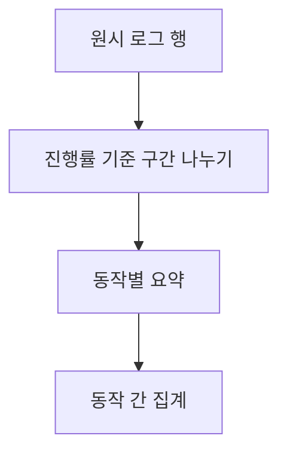

# P3-5.1 원시 로그를 비교 가능한 표로 어떻게 바꾸는가

> Section ID: `P3-5.1`
> Version: `v2026.07.10`

원시 로그를 처음 보면 데이터가 매우 풍부해 보입니다. 시간 순서대로 값이 많이 쌓여 있고, 센서도 여럿이고, 제어 파라미터도 함께 보일 수 있기 때문입니다. 하지만 이런 풍부함이 곧바로 비교 가능한 데이터셋을 뜻하지는 않습니다. [샘플(sample)](../../../reference/concept-glossary.md#glossary-sample) 단위를 정한 뒤에는 원시 로그를 요약 표와 집계 표로 바꾸는 절차가 필요합니다. 원시 로그와 요약 표, 집계 표는 서로 다른 역할을 맡고 있으며, 한 행이 뜻하는 대상도 다릅니다.

`원시 로그 -> 요약 표 -> 집계 표`는 같은 시계열을 서로 다른 질문에 맞는 표로 다시 표현하는 순서입니다. 이 순서가 보여야 [기준선(baseline)](../../../reference/concept-glossary.md#glossary-baseline) 비교와 [중간 표현(intermediate representation)](../../../reference/concept-glossary.md#glossary-intermediate-representation) 설계도 어느 층위에서 붙는지 분명해집니다.

자동으로 실행되는 동작을 예로 들겠습니다. 원시 로그에서는 동작 중 매 시점마다 센서 값과 제어값이 한 줄씩 남습니다. 반면 요약 표에서는 자동으로 실행된 동작 1회가 한 행이 됩니다. 집계 표에서는 최근 20건 평균이나 평소 구간 평균처럼, 여러 동작을 다시 묶은 결과가 한 행이 될 수 있습니다.

| 표의 종류 | 한 행이 뜻하는 것 | 주로 답하는 질문 |
| --- | --- | --- |
| 원시 로그 | 동작 중 한 시점의 기록 | 지금 무엇이 측정되었는가 |
| 요약 표 | 동작 1회 전체를 요약한 샘플 | 이번 동작은 어떤 구조였는가 |
| 집계 표 | 여러 동작을 묶은 최근 또는 기준선 요약 | 최근 변화가 평소와 다른가 |

이 차이는 단지 표 이름이 다른 정도가 아닙니다. 원시 로그는 세부 흐름을 보존하는 데 강하지만, 동작 전체를 비교하기는 어렵습니다. 요약 표는 동작 간 비교를 쉽게 만들지만, 순간적인 세부 흔들림은 대부분 압축해서 잃습니다. 집계 표는 최근 상태를 빠르게 읽게 해 주지만, 개별 동작의 특수한 모양은 지워질 수 있습니다.

그래서 이 절에서의 표 변환은 `표를 만든다`는 말보다 `수치형 값과 범주형 상태를 함께 탐색 가능한 구조로 바꾼다`는 쪽에 더 가깝습니다. 수치형 탐색(numerical exploration)은 요약 표에서 수준, 변화, 변동성을 비교할 수 있어야 시작되고, 범주형 탐색(categorical exploration)은 상태 구간, 결측 여부, 겹침 여부, 비교 불가 사유 같은 범주 정보를 함께 정리해야 시작됩니다.

| 탐색 관점 | 표에서 먼저 남겨야 하는 것 | 뒤 절에서 더 읽게 되는 것 |
| --- | --- | --- |
| 수치형 탐색 | 구간 평균, 변화율, 변동성 | 평균 밖 패턴, 최근 대 기준선 차이 |
| 범주형 탐색 | 상태 라벨, 결측 표시, 겹침/비교 불가 표시 | 샘플 붕괴 구분, 비교 가능 여부 판단 |

그래서 `요약`을 단순한 축소로 이해하면 곤란합니다. 동작 1회 요약 행은 원시 시계열 여러 행을 사람이 비교하고 모델이 다루기 쉬운 한 행으로 바꾼 결과입니다. 여기서 중요한 것은 샘플 단위를 다시 정의하는 일이 아니라, 이미 정한 샘플 단위 위에 비교 가능한 표를 만드는 절차라는 점입니다. 비교를 쉽게 만들어 주지만, 원시 시계열의 모든 맥락을 대체하지는 않습니다.

그래서 표를 볼 때는 먼저 `열이 무엇인가`보다 `행 하나가 무엇인가`를 물어야 합니다. 원시 로그의 한 행은 보통 아직 샘플 1건이 아닙니다. 요약 표의 한 행이 되어서야 비로소 동작 1회를 비교 가능한 샘플로 읽을 수 있습니다. 집계 표는 더 나아가 샘플 여러 개를 다시 묶어 비교 구조를 만든 것입니다.

원시 로그에서 요약 표로 넘어갈 때는 단지 행 수만 줄이는 것이 아닙니다. 이 단계에서는 `어느 구간을 나눌 것인가`, `어떤 변화율을 계산할 것인가`, `어떤 센서값을 대표값으로 남길 것인가`를 함께 정해야 합니다. 예를 들어 동작 1회 요약 표에는 총 동작 시간, 초반 평균 압력, 중반 평균 유량, 후반 하강률, 제어 추종 오차 같은 열이 들어갈 수 있습니다. 이 값들은 원시 로그에 원래 한 줄로 적혀 있던 값이 아니라, 여러 시점 값을 사람이 비교하기 좋은 형태로 다시 표현한 결과입니다.

아래 도식은 이 변환을 가장 짧게 압축해 보여 줍니다.


```mermaid
flowchart TD
    A[원시 로그 행] --> B[진행률 기준 구간 나누기]
    B --> C[동작별 요약]
    C --> D[동작 간 집계]
```

이 흐름에서는 `Segment by progress` 단계가 특히 중요합니다. 원시 로그를 그대로 평균 내는 것이 아니라, 동작 안에서 초반과 중반, 후반처럼 비교 가능한 구간을 먼저 나눈 뒤에야 요약값이 생기기 때문입니다. 그리고 `Aggregate across events`는 그 다음 단계입니다. 동작 1회 요약과 최근 구간 집계는 같은 일이 아니라, 한 번 더 묶는 일입니다.

여기서는 `세 표 중 어느 것이 지금 내 작업의 출발점인가`를 먼저 확인해야 표를 덜 섞어 읽게 됩니다.

| 지금 손에 든 표 | 먼저 해야 할 일 | 아직 이 표만으로는 어려운 일 |
| --- | --- | --- |
| 원시 로그 | 동작 경계와 구간 기준을 정한다 | 동작 간 직접 비교 |
| 요약 표 | 동작 1회끼리 비교한다 | 최근 반복 변화 읽기 |
| 집계 표 | 최근 상태와 기준선 차이를 본다 | 개별 동작의 세부 모양 확인 |

집계 표는 한 번 더 역할이 달라집니다. 여기서는 개별 동작의 모양보다 `최근 20건의 평균`, `최근 20건의 변동성`, `기준선 대비 차이`, `같은 방향 변화가 반복된 횟수`처럼 여러 동작을 묶은 흐름이 중심이 됩니다. 즉 요약 표가 `사례 읽기`에 가깝다면, 집계 표는 `상태 읽기`에 더 가깝습니다.

다음 예시는 원시 로그가 어떻게 동작 단위 요약 표를 거쳐 최근/기준선 집계 표로까지 이어지는지 보여 줍니다. 여기서는 세 개의 진행도 구간으로 나눠 구간 평균을 만든다고 가정하겠습니다.

문제 상황: 원시 로그가 `동작 1회 요약 표`를 거쳐 `최근/기준선 집계 표`로 바뀌는 과정을 한 번에 확인합니다.

입력(input): `event_id`, `progress_bin`, `flow`로 이루어진 원시 로그 표

기대 출력(output): `raw`, `summary`, `aggregate` 세 표가 서로 다른 행 의미와 비교 역할을 갖는 출력

확인할 개념: 원시 로그를 비교 가능한 표로 바꾼다는 말은 같은 기록을 요약 표와 집계 표로 단계적으로 다시 표현한다는 뜻이다

```python
import pandas as pd

raw = pd.DataFrame(
    [
        {"event_id": "A", "progress_bin": "early", "flow": 0.8},
        {"event_id": "A", "progress_bin": "early", "flow": 1.0},
        {"event_id": "A", "progress_bin": "mid", "flow": 2.4},
        {"event_id": "A", "progress_bin": "mid", "flow": 2.5},
        {"event_id": "A", "progress_bin": "late", "flow": 1.9},
        {"event_id": "A", "progress_bin": "late", "flow": 1.6},
        {"event_id": "B", "progress_bin": "early", "flow": 0.7},
        {"event_id": "B", "progress_bin": "early", "flow": 0.9},
        {"event_id": "B", "progress_bin": "mid", "flow": 2.1},
        {"event_id": "B", "progress_bin": "mid", "flow": 2.0},
        {"event_id": "B", "progress_bin": "late", "flow": 1.8},
        {"event_id": "B", "progress_bin": "late", "flow": 1.7},
        {"event_id": "C", "progress_bin": "early", "flow": 0.9},
        {"event_id": "C", "progress_bin": "early", "flow": 1.1},
        {"event_id": "C", "progress_bin": "mid", "flow": 2.6},
        {"event_id": "C", "progress_bin": "mid", "flow": 2.7},
        {"event_id": "C", "progress_bin": "late", "flow": 2.0},
        {"event_id": "C", "progress_bin": "late", "flow": 1.8},
    ]
)

summary = (
    raw.pivot_table(
        index="event_id",
        columns="progress_bin",
        values="flow",
        aggfunc="mean",
    )
    .rename(
        columns={
            "early": "early_flow_mean",
            "mid": "mid_flow_mean",
            "late": "late_flow_mean",
        }
    )
    .reset_index()
    .assign(window=lambda df: df["event_id"].map({"A": "recent", "B": "baseline", "C": "recent"}))
)

aggregate = (
    summary.groupby("window", as_index=False)
    .agg(
        event_count=("event_id", "count"),
        early_flow_mean=("early_flow_mean", "mean"),
        mid_flow_mean=("mid_flow_mean", "mean"),
        late_flow_mean=("late_flow_mean", "mean"),
    )
)

print("1) raw log rows before comparison")
print(raw.head(6))
print()
print("2) per-event summary table for direct comparison")
print(summary)
print()
print("3) recent-vs-baseline aggregate table built from event summaries")
print(aggregate)
```

예상 출력:

```text
1) raw log rows before comparison
  event_id progress_bin  flow
0        A        early   0.8
1        A        early   1.0
2        A          mid   2.4
3        A          mid   2.5
4        A         late   1.9
5        A         late   1.6

2) per-event summary table for direct comparison
  event_id  early_flow_mean  late_flow_mean  mid_flow_mean    window
0        A              0.9            1.75           2.45    recent
1        B              0.8            1.75           2.05  baseline
2        C              1.0            1.90           2.65    recent

3) recent-vs-baseline aggregate table built from event summaries
     window  event_count  early_flow_mean  mid_flow_mean  late_flow_mean
0  baseline            1             0.80           2.05           1.750
1    recent            2             0.95           2.55           1.825
```

위 출력에서 원시 로그는 시점 기록이고, 2단계에서야 동작 1회가 한 줄이 되며, 3단계에서는 그 샘플 여러 건이 다시 최근/기준선 집계로 올라갑니다. 이때 중요한 것은 단순히 줄 수가 줄었다는 사실이 아니라, `초반`, `중반`, `후반`이라는 비교 단위가 요약 표의 열 구조 안으로 들어오고, 그 요약 표가 다시 최근 상태 비교 표의 재료가 된다는 점입니다.

이 예제를 본 뒤에는 아래 질문으로 지금 일어난 변화가 단순 축약인지 표현 전환인지 확인할 수 있습니다.

1. 지금 줄어든 것은 단순한 행 수인가, 아니면 샘플 단위의 재정의인가
2. `early`, `mid`, `late`는 원시 로그에 원래 있던 열인가, 비교를 위해 새로 만든 구간인가
3. 다음 단계에서 최근 20건 평균을 만들려면 지금 표와 원시 로그 중 어느 쪽이 더 직접적인 출발점인가

이 질문에 답할 수 있으면 `원시 로그 -> 요약 표 -> 집계 표`가 단순 축약 순서가 아니라, 서로 다른 판단 질문을 위한 표현 전환이라는 점이 더 분명해집니다.

같은 흐름을 더 짧게 판별하면 다음처럼 볼 수 있습니다.

| 지금 필요한 판단 | 더 직접적인 출발점 |
| --- | --- |
| 개별 동작의 구조 비교 | 요약 표 |
| 최근 상태와 평소 상태 비교 | 집계 표 |
| 이상한 변화의 세부 시점 확인 | 원시 로그 |

이 표가 중요하다는 것은 `표를 하나만 잘 만들면 끝난다`는 뜻이 아니라, 질문마다 다시 내려가거나 올라갈 표가 다르다는 뜻입니다.

또 하나 중요한 점은 세 표가 경쟁 관계가 아니라는 사실입니다. 요약 표를 만들었다고 해서 원시 로그가 필요 없어지는 것은 아닙니다. 집계 표를 만들었다고 해서 동작 단위 표가 쓸모없어지는 것도 아닙니다. 오히려 집계 표에서 이상한 변화가 보이면 다시 요약 표와 원시 로그로 내려가 확인해야 합니다. 비교를 위한 표현이 늘어날수록 원시 시계열을 다시 확인하는 절차도 함께 중요해집니다.

따라서 `원시 로그 -> 요약 표 -> 집계 표`는 단순 축약 순서가 아니라, 같은 시계열을 기록 수준, 샘플 수준, 상태 수준으로 다시 표현하는 연속된 설계입니다. 핵심은 표가 하나씩 늘어난다는 사실보다, 어떤 질문에는 원시 기록이, 어떤 질문에는 샘플 요약이, 어떤 질문에는 상태 집계가 더 직접적인 근거가 된다는 점입니다.

## 출처와 참고 자료

- W3C, `PROV-Overview`. provenance framework가 representing processing steps, derivation, versioning을 지원해야 한다고 정리하므로, 원시 로그가 어떤 처리 단계를 거쳐 요약 표와 집계 표로 바뀌었는지 분리해 남겨야 한다는 일반 근거가 됩니다. [https://www.w3.org/TR/prov-overview/](https://www.w3.org/TR/prov-overview/){: target="_blank" rel="noopener noreferrer" } / 확인일: 2026-07-08
- Google for Developers, `Machine Learning Glossary`의 `labeled example`. example는 features와 label이 붙는 샘플 수준 구조를 전제로 하므로, raw row 수준과 event summary 수준을 구분해 sample-level table을 만들어야 한다는 점을 보강합니다. [https://developers.google.com/machine-learning/glossary](https://developers.google.com/machine-learning/glossary){: target="_blank" rel="noopener noreferrer" } / 확인일: 2026-07-08
- U.S. Bureau of Labor Statistics, `Base period`. 기준 시점은 다른 시점과 비교하기 위한 reference라고 설명하므로, aggregate table처럼 최근 상태와 기준선 상태를 비교하는 별도 표현 수준이 필요하다는 일반 근거가 됩니다. [https://www.bls.gov/bls/glossary.htm](https://www.bls.gov/bls/glossary.htm){: target="_blank" rel="noopener noreferrer" } / 확인일: 2026-07-08
