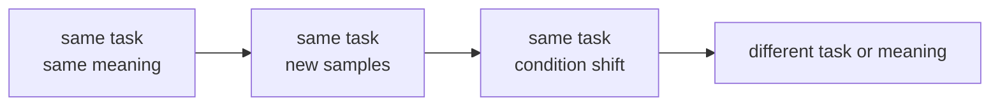
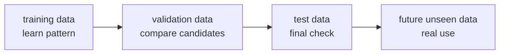

# P3-5.2 일반화(generalization)

P3-5.1에서는 과적합(overfitting)과 과소적합(underfitting)을 구분했습니다. 이제 한 단계 더 올라가야 합니다. 왜 우리는 그 구분을 중요하게 여길까요? 결국 머신러닝의 목적이 `학습 데이터 점수 높이기`가 아니라, `아직 보지 못한 데이터에서도 쓸 만하게 작동하기` 때문입니다. 이 질문을 정리하는 말이 `일반화(generalization)`입니다.

일반화는 어렵게 들릴 수 있지만, 출발점은 단순합니다. 모델이 이미 본 예시를 다시 맞히는 데서 멈추지 않고, 비슷한 구조를 가진 새 예시에도 적절히 반응하는가를 묻는 것입니다.

## 이 절의 범위

이 절은 일반화의 의미를 초심자 기준으로 설명합니다. 아직 일반화 오차(generalization error)의 수식이나 이론적 경계는 다루지 않습니다. 여기서는 `왜 새 데이터가 중요한가`, `왜 검증과 테스트가 필요한가`, `왜 학습 점수만으로는 부족한가`를 연결하는 데 집중합니다.

평가 지표(metric)의 자세한 계산은 P3-6에서 다루고, 교차검증(cross-validation)의 실무적 사용은 이후 모델 선택 장에서 다시 연결할 수 있습니다. 지금은 일반화를 하나의 수학 이론보다, 머신러닝 전체를 관통하는 목표 문장으로 이해하면 충분합니다.

이 절에서는 다음 질문에 답합니다.

- 일반화란 무엇인가?
- 왜 머신러닝의 목표를 학습 점수가 아니라 일반화로 말하는가?
- 과적합과 일반화는 어떤 관계인가?
- 새 데이터(unseen data)란 정확히 어떤 의미인가?
- 실무에서 일반화를 어떻게 체감하는가?

## 이 절의 목표

- 일반화(generalization)를 한 문장으로 설명할 수 있습니다.
- 학습 점수와 일반화는 같은 말이 아니라는 점을 설명할 수 있습니다.
- 과적합이 왜 일반화 약화로 이어질 수 있는지 말할 수 있습니다.
- 검증 데이터와 테스트 데이터가 결국 일반화 확인을 위한 장치라는 점을 이해할 수 있습니다.
- 이후 평가 지표와 모델 선택 장을 왜 배우는지 연결할 수 있습니다.

## 일반화는 무엇을 묻는 말인가

Google의 머신러닝 용어집은 일반화를 사실상 `훈련 세트(training set)에 없는 예시에서도 좋은 예측을 할 수 있는가`라는 질문으로 설명합니다. 이 절에서는 그 뜻을 초심자 기준으로 다음처럼 정리합니다.

`일반화(generalization)는 모델이 아직 보지 못한 데이터에서도 쓸 만한 판단을 하는 성질이다.`

여기서 중요한 것은 `똑같은 데이터가 아닌데도`라는 부분입니다.

왜 굳이 이런 말을 따로 쓰는지도 짚고 넘어가는 편이 좋습니다. 머신러닝은 데이터를 보고 규칙을 배우는 방식이기 때문에, 겉으로는 “점수가 높다”는 말만 남기 쉽습니다. 하지만 그 점수가 `본 데이터에서만 높은지`, `안 본 데이터에서도 유지되는지`는 전혀 다른 문제입니다. 이 둘을 구분하기 위해 `일반화`라는 말을 씁니다.

| 질문 | 일반화 관점에서의 의미 |
| --- | --- |
| 학습 데이터는 잘 맞추는가? | 출발점일 뿐이다 |
| 새 데이터도 비슷하게 맞추는가? | 일반화의 핵심 질문이다 |
| 특정 샘플을 외운 것은 아닌가? | 일반화를 해칠 수 있는 경고 신호다 |

즉, 일반화는 모델이 `이번 데이터셋에 적응했는가`보다 `문제의 구조를 어느 정도 배웠는가`를 더 묻는 말입니다.

이 문장을 더 쉽게 바꾸면 다음과 같습니다.

- 데이터셋의 모양을 외운 것인가?
- 문제의 구조를 배운 것인가?

일반화는 두 번째 쪽에 더 가깝습니다.

## 일반화라는 말이 중요해진 역사적 배경

일반화는 최근 생성형 AI에서 갑자기 등장한 말이 아닙니다. 통계학습이론(statistical learning theory)의 역사 속에서 오래 다루어진 질문입니다. Ulrike von Luxburg와 Bernhard Schoelkopf의 개요 논문은 통계학습이론이 1960년대 러시아에서 시작되어, 1990년대 서포트 벡터 머신(SVM)의 발전과 함께 널리 알려졌다고 설명합니다. 같은 글은 이 분야의 핵심 질문을 `경험적 데이터(empirical data)로부터 어떻게 타당한 결론을 이끌 수 있는가`로 제시합니다.

초심자 관점에서는 이 역사를 다음처럼 읽으면 충분합니다.

1. 통계와 학습 연구는 오래전부터 `본 데이터에서만 맞는 규칙`과 `새 데이터에도 통하는 규칙`을 구분하려 했다.
2. 그 질문이 통계학습이론 안에서 더 체계적으로 다루어졌다.
3. 이후 머신러닝 실무에서는 검증(validation), 테스트(test), 교차검증(cross-validation) 같은 절차가 일반화를 확인하는 기본 관행이 되었다.

즉, 일반화는 유행어가 아니라, `학습이 정말 학습이었는가`를 오래전부터 가르는 핵심 기준이었다고 볼 수 있습니다.

## 왜 일반화가 목표가 되는가

머신러닝은 거의 항상 `다음에 들어올 데이터`를 위해 모델을 만듭니다.

- 스팸 분류 모델은 내일 도착할 메일을 분류해야 합니다.
- 고객 이탈 예측 모델은 다음 달 고객을 예측해야 합니다.
- 가격 예측 모델은 아직 거래되지 않은 집값을 추정해야 합니다.

즉, 진짜 사용 장면은 항상 `아직 안 본 데이터` 쪽에 있습니다.

| 모델이 쓰이는 곳 | 학습 데이터는 무엇인가 | 실제 사용 시점에는 무엇이 들어오는가 |
| --- | --- | --- |
| 스팸 필터 | 과거 메일 기록 | 새로 도착한 메일 |
| 추천 시스템 | 과거 클릭과 구매 기록 | 지금 접속한 사용자의 다음 행동 |
| 수요 예측 | 지난 판매 데이터 | 아직 오지 않은 다음 주 수요 |

이 표를 보면 왜 학습 점수만으로는 부족한지 바로 드러납니다. 실제 서비스는 `과거 복습`이 아니라 `미래 대응`이기 때문입니다.

그래서 일반화는 단순한 보너스 성질이 아니라, 머신러닝을 쓰는 이유 자체와 연결됩니다. 새 데이터를 다룰 필요가 없다면, 굳이 머신러닝 모델이 아니라 규칙표나 조회표만으로도 충분한 경우가 많습니다.

## 새 데이터란 무엇인가

`새 데이터(unseen data)`라고 하면 완전히 낯선 세계의 데이터처럼 들릴 수 있습니다. 하지만 보통은 `같은 문제에서 아직 학습에 쓰지 않은 예시`를 뜻합니다.

이 점은 초심자가 특히 자주 오해합니다. 일반화는 보통 `아무 환경에서나 무조건 잘 된다`는 뜻이 아닙니다. 먼저는 `같은 문제 설정 안에서, 아직 보지 못한 예시에도 어느 정도 버틴다`는 뜻에 가깝습니다.

예를 들어 고객 이탈 예측이라면 다음과 같습니다.

| 구분 | 예시 |
| --- | --- |
| 학습 데이터 | 지난 3개월 고객 기록 중 일부 |
| 검증 데이터 | 같은 기간이지만 학습에 쓰지 않은 일부 |
| 테스트 데이터 | 마지막 확인용으로 따로 남겨 둔 일부 |
| 실제 서비스 입력 | 다음 달 새로 쌓이는 고객 기록 |

이 네 가지는 모두 같은 문제 도메인(domain)에 속하지만, 모델 입장에서는 `본 것`과 `아직 안 본 것`이 나뉩니다. 일반화는 바로 이 경계에서 생기는 이야기입니다.

이 경계를 더 분명히 하기 위해 다음처럼 구분할 수 있습니다.

| 경우 | 일반화 설명에 보통 포함되는가? | 이유 |
| --- | --- | --- |
| 같은 서비스의 다음 주 고객 데이터 | 포함된다 | 같은 문제의 미래 예시다 |
| 같은 분류 문제의 다른 샘플 | 포함된다 | 같은 구조의 미관측 예시다 |
| 전혀 다른 산업의 데이터 | 보통 바로 포함하지 않는다 | 문제 정의 자체가 달라질 수 있다 |
| 입력 형식과 의미가 크게 달라진 데이터 | 보통 별도 검토가 필요하다 | 같은 일반화라고 보기 어렵다 |

즉, 일반화는 `아무 데이터에나 통한다`는 선언이 아니라, `같은 문제의 보지 못한 예시에 대해 얼마나 버티는가`에 더 가깝습니다.

이 범위를 눈으로 보면 다음처럼 정리할 수 있습니다.



- `same task, same meaning`은 학습 데이터와 가장 가까운 구간입니다.
- `same task, new samples`은 일반화가 가장 먼저 시험되는 구간입니다.
- `same task, condition shift`는 여전히 같은 문제일 수 있지만 더 어려운 구간입니다.
- `different task or meaning`까지 가면 보통 같은 일반화 문제로 바로 묶기 어렵습니다.

## 과적합과 일반화의 관계

이제 왜 P3-5.1의 과적합(overfitting)과 과소적합(underfitting)을 다시 꺼내야 하는지도 자연스럽게 연결됩니다. 일반화는 결국 `새 데이터에서 버티는가`를 묻는 말이기 때문입니다.

P3-5.1에서 본 과적합은 일반화가 약해지는 대표 장면입니다.

| 상태 | 일반화 관점에서 읽으면 |
| --- | --- |
| 과소적합 | 아직 중요한 구조를 잘 못 배워서 새 데이터에서도 약할 수 있다 |
| 적절한 상태 | 학습 데이터와 새 데이터 사이에 비교적 안정적인 성능을 보일 수 있다 |
| 과적합 | 학습 데이터에는 강하지만 새 데이터에서는 성능이 떨어질 수 있다 |

즉, 과적합은 `일반화를 해치는 방향`으로 읽을 수 있습니다. 하지만 일반화는 과적합의 반대말 하나로 끝나는 개념은 아닙니다. 일반화는 더 넓게 `새 데이터에서 어느 정도 버티는가` 전체를 가리킵니다.

초심자에게는 이렇게 연결하면 충분합니다.

- 과적합은 일반화를 약하게 만들 수 있다
- 과소적합도 일반화를 약하게 만들 수 있다
- 일반화는 결국 `새 데이터에서 버티는 힘`을 묻는다

## 검증과 테스트는 결국 일반화를 보기 위한 장치다

P3-4.2에서 검증(validation)과 테스트(test)를 나눈 이유도 결국 일반화 때문입니다.

- 검증 데이터: 여러 후보 중 무엇이 새 데이터에서 더 잘 버틸지 비교하는 장치
- 테스트 데이터: 최종 선택이 정말 새 데이터에서도 버티는지 마지막으로 확인하는 장치



이 도식에서 검증과 테스트는 목적지가 아닙니다. 둘 다 `미래의 보지 못한 데이터`를 미리 가늠하기 위한 중간 장치입니다.

따라서 검증과 테스트는 점수를 매기는 절차이기 전에, 일반화를 간접적으로 관찰하는 절차라고 볼 수 있습니다.

이 절차를 표로 다시 읽으면 다음과 같습니다.

| 단계 | 지금 하는 일 | 결국 확인하려는 것 |
| --- | --- | --- |
| 학습(training) | 본 데이터에서 패턴을 익힌다 | 최소한의 출발점이 있는가 |
| 검증(validation) | 후보 모델이나 설정을 비교한다 | 새 데이터에서 더 잘 버틸 후보는 무엇인가 |
| 테스트(test) | 마지막으로 따로 확인한다 | 선택 결과가 과하게 낙관적이지 않은가 |
| 실제 사용(real use) | 미래 입력을 받는다 | 일반화가 실제로 유지되는가 |

## 예시로 일반화 읽기

앞에서 정의, 새 데이터, 과적합, 검증과 테스트의 관계를 정리했다면, 이제는 실제 장면으로 다시 읽어 보는 편이 이해에 도움이 됩니다. 아래 예시들은 모두 같은 질문으로 연결됩니다.

`이 모델은 지금 손에 든 표를 넘어서도 버틸 수 있는가?`

## Python 예제로 일반화 질문 읽기

다음 코드는 일반화 관점에서 점수를 어떻게 읽는지 보여 줍니다.

```python
results = [
    {"name": "model_A", "train_score": 0.81, "validation_score": 0.79},
    {"name": "model_B", "train_score": 0.99, "validation_score": 0.74},
    {"name": "model_C", "train_score": 0.63, "validation_score": 0.61},
]

for item in results:
    gap = round(item["train_score"] - item["validation_score"], 2)
    print(item["name"])
    print("  train:", item["train_score"])
    print("  validation:", item["validation_score"])
    print("  generalization gap:", gap)
```

실행 결과 예시는 다음처럼 읽습니다.

```text
model_A
  train: 0.81
  validation: 0.79
  generalization gap: 0.02
model_B
  train: 0.99
  validation: 0.74
  generalization gap: 0.25
model_C
  train: 0.63
  validation: 0.61
  generalization gap: 0.02
```

이 예제에서 `generalization gap`은 정식 이론 설명이 아니라, 초심자가 학습 점수와 검증 점수의 차이를 읽는 보조 표현입니다.

- `model_A`는 학습과 검증이 비교적 비슷합니다.
- `model_B`는 학습은 매우 높지만 검증이 크게 낮습니다.
- `model_C`는 차이는 작지만 둘 다 낮습니다.

즉, 일반화를 읽을 때는 `차이만` 보는 것도 부족하고, `수준만` 보는 것도 부족합니다. 둘 다 함께 봐야 합니다.

여기서 중요한 해석은 다음과 같습니다.

- 학습 점수는 “이미 본 데이터에서 어느 정도 맞는가”
- 검증 점수는 “아직 안 본 비슷한 데이터에서 어느 정도 버티는가”

일반화는 주로 두 번째 질문 쪽에 더 가깝습니다.

### 업무 장면으로 다시 보기

추천 시스템 예시로 바꾸어 보면 다음처럼 읽을 수 있습니다.

| 장면 | 일반화 관점의 해석 |
| --- | --- |
| 기존 사용자 기록에는 추천이 매우 잘 맞음 | 학습 데이터 적응은 잘 되었을 수 있다 |
| 새 사용자나 최근 취향 변화에는 약함 | 일반화가 충분하지 않을 수 있다 |
| 검증 실험에서 여러 사용자 묶음에 비슷하게 동작함 | 일반화 가능성이 상대적으로 높다 |

가격 예측도 비슷합니다.

| 장면 | 일반화 관점의 해석 |
| --- | --- |
| 과거 거래 기록에는 오차가 매우 작음 | 학습 데이터에는 잘 맞을 수 있다 |
| 새 지역, 새 시점 데이터에서 오차가 커짐 | 일반화가 약할 수 있다 |
| 다양한 시점과 지역에서도 비슷한 오차 범위 | 일반화가 비교적 안정적일 수 있다 |

### 사회현상 예시로 다시 보기

일반화는 꼭 기업 서비스 안에서만 필요한 개념이 아닙니다. 사회현상을 읽는 모델에서도 같은 질문이 생깁니다.

예를 들어 온라인 여론이나 게시글 흐름을 분류하는 모델을 생각해 볼 수 있습니다.

| 장면 | 일반화 관점의 해석 |
| --- | --- |
| 지난달 표현 방식에는 잘 반응함 | 과거 데이터의 말투와 패턴에는 적응했을 수 있다 |
| 새로운 유행어, 비꼼, 우회 표현이 나오면 흔들림 | 새 데이터에 대한 일반화가 약할 수 있다 |
| 시기가 바뀌어도 큰 방향은 비슷하게 읽음 | 일반화가 비교적 유지될 수 있다 |

교통 혼잡이나 민원 증가처럼 반복되는 사회 패턴을 다루는 경우도 비슷합니다.

| 장면 | 일반화 관점의 해석 |
| --- | --- |
| 평일 출근 시간 패턴은 잘 맞춤 | 자주 본 규칙에는 강할 수 있다 |
| 연휴, 행사, 폭우처럼 평소와 다른 조건에서 크게 틀림 | 일반화 범위가 좁을 수 있다 |
| 계절 변화나 약간의 조건 변화에도 예측이 완전히 무너지지 않음 | 일반화가 비교적 안정적일 수 있다 |

이런 예시가 주는 핵심은 같습니다. 모델이 과거 사례를 많이 봤다는 사실만으로는 충분하지 않습니다. 사회현상은 표현도 바뀌고, 조건도 바뀌고, 사람들이 반응하는 방식도 달라지기 때문입니다. 그래서 일반화는 `새로운 사회적 장면에서도 어느 정도 버티는가`를 묻는 질문으로도 읽을 수 있습니다.

사회현상 쪽 변화는 한 종류가 아니라는 점도 함께 보는 편이 좋습니다.

| 변화 유형 | 예시 | 일반화에 주는 부담 |
| --- | --- | --- |
| 표현 변화 | 새 유행어, 줄임말, 비꼼 | 같은 뜻도 다른 표면 문장으로 나타나서 흔들릴 수 있다 |
| 조건 변화 | 연휴, 행사, 폭우, 정책 변경 | 평소 패턴이 약해지고 예외 상황이 커질 수 있다 |
| 집단 변화 | 새 사용자층, 다른 지역, 다른 세대 | 과거에 본 분포와 다른 반응이 나타날 수 있다 |
| 시간 변화 | 계절 변화, 장기 추세 변화 | 예전 규칙이 서서히 덜 맞게 될 수 있다 |

### Python 예제로 사회현상 쪽 일반화 읽기

다음 예제는 온라인 게시글 분류 모델이 `평소 표현`에는 강하지만 `새로운 표현`이 들어오면 흔들릴 수 있다는 점을 단순화해 보여 줍니다.

```python
scenarios = [
    {"case": "지난달 게시글", "train_like_score": 0.93, "new_expression_score": 0.90},
    {"case": "새 유행어 등장", "train_like_score": 0.93, "new_expression_score": 0.68},
    {"case": "비꼼과 우회 표현 증가", "train_like_score": 0.93, "new_expression_score": 0.61},
]

for item in scenarios:
    gap = round(item["train_like_score"] - item["new_expression_score"], 2)
    print(item["case"])
    print("  familiar expression score:", item["train_like_score"])
    print("  new expression score:", item["new_expression_score"])
    print("  generalization gap:", gap)
```

실행 결과는 다음처럼 읽을 수 있습니다.

```text
지난달 게시글
  familiar expression score: 0.93
  new expression score: 0.9
  generalization gap: 0.03
새 유행어 등장
  familiar expression score: 0.93
  new expression score: 0.68
  generalization gap: 0.25
비꼼과 우회 표현 증가
  familiar expression score: 0.93
  new expression score: 0.61
  generalization gap: 0.32
```

이 예제는 실제 모델 학습 코드가 아니라, 일반화 해석을 연습하기 위한 읽기 예제입니다.

- `지난달 게시글`은 익숙한 표현과 새로운 표현의 차이가 작습니다.
- `새 유행어 등장`은 표현이 조금만 바뀌어도 점수가 크게 떨어질 수 있음을 보여 줍니다.
- `비꼼과 우회 표현 증가`는 표면 문장이 달라지면 모델이 더 크게 흔들릴 수 있음을 보여 줍니다.

즉, 사회현상에서도 일반화는 `과거에 잘 맞았다`보다 `새로운 표현과 조건 변화에도 얼마나 버티는가`를 묻는 질문으로 읽는 편이 더 정확합니다.

그리고 여기서 말하는 `버틴다`는 표현은 아주 중요합니다. 새 데이터가 들어오면 항상 약간의 차이와 흔들림이 생깁니다. 일반화는 그 흔들림 속에서도 모델이 완전히 무너지지 않고, 여전히 쓸 만한 수준을 유지하는가를 묻는 말입니다.

## 일반화는 완벽함이 아니라 버팀성이다

초심자는 일반화를 `새 데이터에서도 완벽해야 한다`로 오해할 수 있습니다. 하지만 일반화는 완벽 복제가 아닙니다. 보통은 `새 데이터에서도 일정 수준 이상으로 버티는가`를 묻습니다.

| 오해 | 더 정확한 표현 |
| --- | --- |
| 일반화는 새 데이터도 똑같이 맞추는 것이다 | 일반화는 새 데이터에서도 쓸 만한 성능을 유지하는 것이다 |
| 학습 점수와 검증 점수가 완전히 같아야 한다 | 약간의 차이는 자연스럽다 |
| 일반화가 되면 모든 경우를 다 맞힌다 | 일반화가 되어도 틀릴 수는 있다. 중요한 것은 전체적인 버팀성이다 |

그래서 일반화는 `완벽성`보다 `안정성`과 더 가깝습니다.

초심자에게는 다음 한 문장으로 기억해도 좋습니다.

`일반화는 외운 답을 반복하는 힘이 아니라, 처음 보는 비슷한 문제에도 버티는 힘이다.`

## 이 절에서 기억할 관점

- 일반화(generalization)는 모델이 아직 보지 못한 데이터에서도 쓸 만하게 작동하는 성질입니다.
- 머신러닝의 실제 목표는 학습 점수 자체가 아니라 일반화입니다.
- 과적합과 과소적합은 모두 일반화를 약하게 만들 수 있습니다.
- 검증과 테스트는 결국 일반화를 미리 가늠하기 위한 장치입니다.
- 일반화는 완벽한 일치보다 새 데이터에서의 안정적인 버팀성을 뜻합니다.

## 체크리스트

- 일반화를 한 문장으로 설명할 수 있는가?
- 왜 학습 점수와 일반화는 같은 말이 아닌지 설명할 수 있는가?
- 과적합과 일반화의 관계를 설명할 수 있는가?
- 검증 데이터와 테스트 데이터가 결국 일반화 확인을 위한 장치라는 점을 말할 수 있는가?
- `새 데이터에서도 완벽히 맞아야 한다`와 `새 데이터에서도 쓸 만하게 버텨야 한다`의 차이를 이해했는가?
- 평가 지표의 구체적 계산은 P3-6에서 이어질 내용임을 구분할 수 있는가?

## 출처와 참고 자료

- Google for Developers, `Machine Learning Glossary`, 확인 날짜: 2026-06-26. [https://developers.google.com/machine-learning/glossary](https://developers.google.com/machine-learning/glossary){: target="_blank" rel="noopener noreferrer" }
- scikit-learn developers, `Cross-validation: evaluating estimator performance`, scikit-learn User Guide, 확인 날짜: 2026-06-26. [https://scikit-learn.org/stable/modules/cross_validation.html](https://scikit-learn.org/stable/modules/cross_validation.html){: target="_blank" rel="noopener noreferrer" }
- Gareth James, Daniela Witten, Trevor Hastie, Robert Tibshirani, Jonathan Taylor, `An Introduction to Statistical Learning`, Springer, 공식 웹사이트 확인 날짜: 2026-06-26. [https://www.statlearning.com/](https://www.statlearning.com/){: target="_blank" rel="noopener noreferrer" }
- Ulrike von Luxburg, Bernhard Schoelkopf, `Statistical Learning Theory: Models, Concepts, and Results`, Max Planck Institute publication page, 확인 날짜: 2026-06-26. [https://is.mpg.de/publications/4179](https://is.mpg.de/publications/4179){: target="_blank" rel="noopener noreferrer" }
