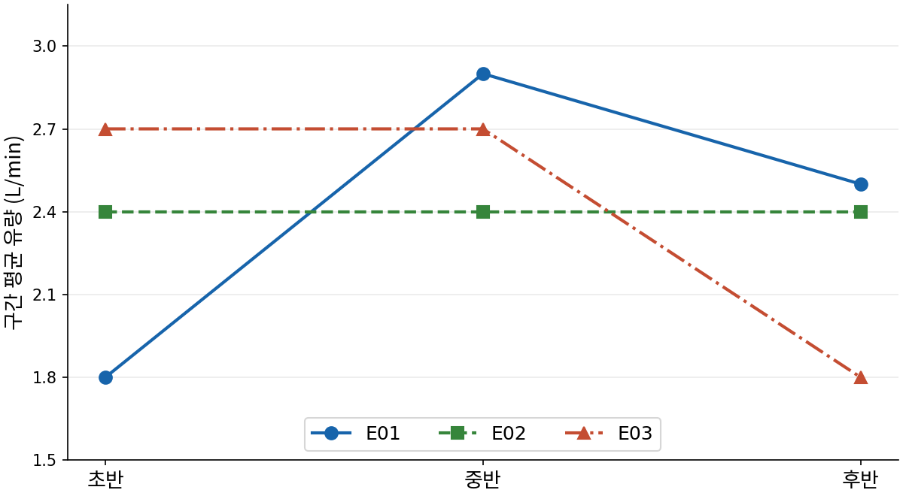

# P3-5.2 요약 표는 평균 밖의 패턴을 어떻게 남기는가

> Section ID: `P3-5.2`
> Version: `v2026.09.19`

[평균(mean)](../../../reference/concept-glossary-parts/13-pieup.md#glossary-mean)은 값의 수준을 요약하지만, 어느 구간이 높았는지와 어떤 순서로 바뀌었는지는 보존하지 않습니다. 앞 절의 요약 표에서 초반·중반·후반 평균을 따로 남긴 이유도 여기에 있습니다. 같은 평균인 사례를 구간별 수치로 비교하고, 그 수치로 말할 수 없는 것까지 구분해 보겠습니다.

## 같은 2.40을 만드는 서로 다른 세 구간

[가상 구간 요약 CSV](../../../assets/part-03/chapter-05/p3_5_2_segment_patterns.csv)는 36개 동작의 초반·중반·후반 평균 유량을 담습니다. 한 행은 동작 1회이고 단위는 L/min입니다. `pattern_family`는 자료를 만들 때 붙인 유형 이름이며 실제 고장 라벨이나 판정 정답이 아닙니다. 먼저 E01·E02·E03만 비교합니다.

| event_id | early_flow_mean | mid_flow_mean | late_flow_mean | 세 구간의 단순 평균 |
| --- | ---: | ---: | ---: | ---: |
| E01 | 1.80 | 2.90 | 2.50 | 2.40 |
| E02 | 2.40 | 2.40 | 2.40 | 2.40 |
| E03 | 2.70 | 2.70 | 1.80 | 2.40 |

E01은 `(1.80+2.90+2.50)/3 = 7.20/3 = 2.40`입니다. E02·E03도 합계가 7.20이므로 같은 값이 됩니다. **이 값은 세 구간을 같은 비중으로 평균한 값**입니다. 입력에는 구간 길이나 관측 수가 없으므로 이를 검증된 동작 전체 평균이라고 부르지 않습니다.

## 구간 평균의 위치를 그래프로 비교하기 {#_1}

세로축은 구간 평균 유량이고 가로축은 구간 순서입니다. 점 사이의 선은 비교를 위한 연결선으로, 실제 센서 궤적이나 같은 길이의 시간 간격을 뜻하지 않습니다. E01은 중반 평균이 가장 높고, E02는 세 평균이 같으며, E03은 후반 평균이 앞 두 구간보다 낮습니다.

E02의 선이 수평이라고 실제 유량이 계속 일정했다고 단정할 수는 없습니다. 예를 들어 한 구간의 두 관측이 1.40·3.40이어도 평균은 2.40입니다. 일정한 2.40·2.40과 구간 평균이 같아도 내부 흔들림은 다릅니다. 마찬가지로 E03처럼 평균이 한 방향으로 내려가는 모양 자체가 곧 불안정이나 고장을 뜻하지 않습니다.

## 구간 차이와 시간당 기울기는 단위부터 다르다

두 파생 열을 `mid_minus_early = 중반−초반`, `late_minus_mid = 후반−중반`으로 정의하겠습니다. 둘 다 평균 유량의 차이이므로 단위는 L/min입니다.

| event_id | mid_minus_early | late_minus_mid | 수치가 뒷받침하는 문장 |
| --- | ---: | ---: | --- |
| E01 | +1.10 | −0.40 | 중반 평균이 초반보다 높고, 후반은 중반보다 0.40 낮다 |
| E02 | 0.00 | 0.00 | 세 구간 평균이 같다 |
| E03 | 0.00 | −0.90 | 초반·중반 평균은 같고, 후반이 0.90 낮다 |

E01의 −0.40만으로 하강 속도를 알 수는 없습니다. 별도 가정으로 두 평균의 대표 시각이 10초 떨어져 있다면 차이를 시간으로 나눈 값은 `−0.40/10 = −0.04 L/min/s`입니다. 20초 떨어져 있다면 −0.02입니다. 이는 두 요약점 사이의 평균 변화율이며, 구간 안의 순간 기울기나 실제 하강 시작 시점은 원시 시각·관측으로 확인해야 합니다.

연습으로 후반 평균이 중반보다 `pattern_change_threshold` 이상 낮은 사건을 골라 보세요. 규칙은 `late_minus_mid <= −기준값`입니다. 위 세 사건에서 기준 0.30이면 E01·E03, 0.50이면 E03만 선택됩니다. 기준 0.90에서도 E03은 포함됩니다. 기준은 L/min 단위의 설명용 규칙이며 고장 임계값이 아닙니다. 선택 목록이 달라져도 관측값은 그대로입니다.

## 길이가 다른 구간을 전체 평균으로 합치려면

관측점 전체의 평균을 구하려면 각 구간의 관측 수로 가중합니다. 예를 들어 E01의 구간 평균이 각각 2·2·6개 관측에서 나왔다면 `(2×1.80+2×2.90+6×2.50)/10 = 2.44 L/min`입니다. 관측 수가 같을 때는 단순 평균 2.40과 일치하지만, 이 가정에서는 후반이 더 큰 비중을 받습니다.

시간 전체의 평균을 구하려면 각 구간 평균이 그 구간의 시간 평균이라는 전제 아래 구간 길이로 가중합니다. E01의 세 구간이 10·10·40초라면 `(10×1.80+10×2.90+40×2.50)/60 = 2.45 L/min`입니다. 세 구간이 전체 동작을 겹침·누락 없이 덮는다고 가정한 계산입니다. 불규칙한 측정점의 단순 평균을 시간 평균으로 간주해서는 안 됩니다.

위 관측 수와 시간은 CSV에 없는 별도의 연습 조건입니다. 요약 표를 전달할 때는 구간별 관측 수 또는 시간 길이, 평균 계산 방식도 함께 남겨야 목적에 맞는 전체 평균을 재계산할 수 있습니다.

## 극단값의 영향은 중앙값과 함께 읽는다

지금까지는 한 동작 안의 구간 순서를 보았습니다. 이번에는 서로 다른 다섯 동작의 평균 유량이 `2, 2, 2, 2, 12 L/min`이라고 해 보겠습니다. 이 다섯 값의 평균은 `20/5 = 4`이지만, 대부분은 2입니다.

**중앙값(median)**은 값을 작은 순서로 정렬했을 때 가운데 있는 값입니다. 다섯 값에서는 세 번째인 2이며, 개수가 짝수이면 가운데 두 값의 평균을 사용합니다. 위 사례에서 최대값 12를 22로 바꾸면 평균은 `30/5 = 6`, 중앙값은 여전히 2입니다. 평균과 중앙값을 함께 보면 큰 값 하나가 전체 수준 요약에 얼마나 영향을 주었는지 알 수 있습니다.

중앙값만 남겨 12나 22를 무시하는 것도 충분하지 않습니다. 큰 값이 실제 사건인지 기록 오류인지 원자료에서 확인하고, 건수와 최대값도 함께 남깁니다. 이 비교는 여러 동작의 값 분포를 보는 것이며, 한 동작의 시간 순서를 되살리는 방법은 아닙니다.

마지막으로 “E01과 E03은 평균 2.40이므로 같은 동작이다”를 고쳐 보세요. 답은 “세 구간의 단순 평균은 같지만 E01의 중반−초반 차이는 +1.10, E03은 0이며, 후반−중반 차이도 −0.40과 −0.90으로 다르다. 전체 시간 평균과 고장 여부는 추가 근거가 필요하다”입니다.

## 체크리스트

- E01·E02·E03이 모두 2.40이 되는 계산과 다른 구간 차이를 설명하는가?
- 수평인 구간 평균과 구간 내부의 일정한 관측값을 구별하는가?
- L/min 단위 구간 차이와 L/min/s 단위 변화율을 구별하는가?
- 구간별 관측 수와 시간 길이에 따라 2.44·2.45를 계산할 수 있는가?
- 다섯 동작의 평균 4와 중앙값 2가 서로 무엇을 보여 주는지 설명하는가?
- 패턴 규칙의 선택 결과를 불안정·고장 판정으로 단정하지 않는가?

## 출처와 참고 자료

- NIST/SEMATECH, [Measures of Location](https://www.itl.nist.gov/div898/handbook/eda/section3/eda351.htm){: target="_blank" rel="noopener noreferrer" }. 평균·중앙값의 정의와 극단값에 대한 반응 차이의 근거입니다. CSV, 그래프, 가중 평균 계산 및 임계값 연습은 자체 가상 사례입니다. / 확인일: 2026-09-19
