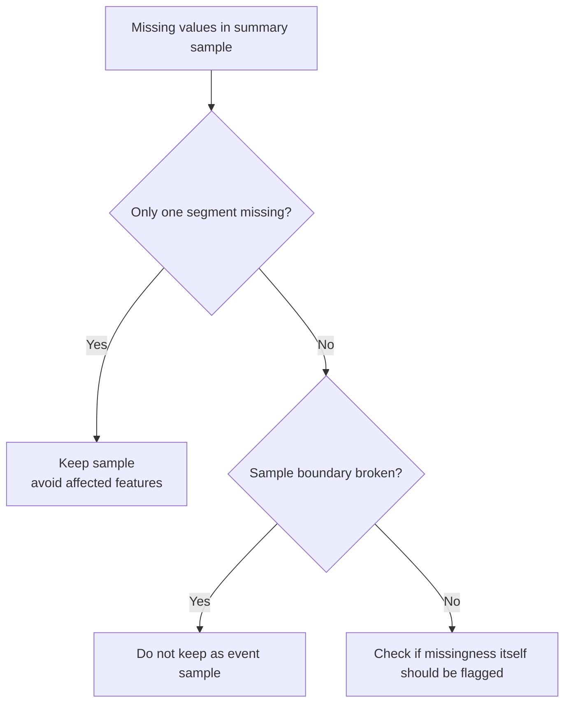

# P3-5.5 값이 빠지거나 구간이 비어 있는 샘플은 어떻게 다루는가

> Section ID: `P3-5.5`
> Version: `v2026.07.08`

원시 로그를 요약 표로 바꾸는 단계까지 오면, 현실 데이터에서 바로 부딪히는 문제가 하나 더 있습니다. `동작은 있었는데 일부 센서값이 비어 있으면 어떻게 해야 하는가?` `중간 구간 기록이 빠졌는데 이 샘플을 버려야 하는가, 일부만 써야 하는가?` Part 4에서 결측치 처리(preprocessing)를 배우기 전에, Part 3에서는 먼저 이것이 `샘플 구조 판단`이라는 점을 잡아 둘 필요가 있습니다.

값이 빠졌다는 사실은 단순한 청소 문제가 아니라, `이 샘플을 여전히 같은 종류의 사례로 볼 수 있는가`를 다시 묻게 하는 데이터 모델링 신호입니다.

## 왜 이 질문이 Part 3에 필요한가

값이 비어 있는 상황을 전부 나중의 전처리 문제로 미루면, 너무 빨리 `NaN을 채우면 되겠지`라고 생각하기 쉽습니다. 하지만 실제로는 아래처럼 훨씬 먼저 정해야 할 질문이 있습니다.

| 지금 보이는 현상 | Part 3에서 먼저 물어야 하는 질문 |
| --- | --- |
| 후반 센서 구간이 통째로 비었다 | 이 샘플은 아직 동작 1회 비교 단위로 쓸 수 있는가 |
| 일부 시점만 누락되었다 | 요약값을 만들어도 같은 구조 비교가 가능한가 |
| 특정 센서만 자주 비어 있다 | 빠짐 자체가 운영 상태 신호인가 |

즉 값이 빠진 샘플은 단순히 `채울 값이 있는 표`가 아니라, `샘플 경계와 특징 의미를 다시 확인해야 하는 사례`입니다.

## 먼저 구분해야 하는 세 가지

값이 비어 있을 때는 복잡한 기법보다 먼저 아래 세 가지를 구분하는 편이 좋습니다.

| 먼저 구분할 것 | 질문으로 바꾸면 |
| --- | --- |
| 일부 값만 비었는가 | 구간 평균이나 특정 센서 일부만 빠졌는가 |
| 한 구간이 통째로 비었는가 | 초반·중반·후반 중 한 덩어리가 없는가 |
| 샘플 의미 자체가 깨졌는가 | 동작 1회 전체를 같은 종류의 사례로 보기 어려운가 |

이 구분이 필요한 이유는 `무엇을 비어 있음으로 볼 것인가`에 따라 다음 판단이 완전히 달라지기 때문입니다.

## 같은 결측처럼 보여도 다른 문제다

예를 들어 아래 세 상황은 모두 `값이 없다`로 보이지만 실제 의미는 다릅니다.

| 보이는 문제 | 더 가까운 해석 |
| --- | --- |
| 시점 1~2개가 비었다 | 부분 측정 누락 |
| 후반 20% 구간이 통째로 비었다 | 구조 비교를 흔드는 구간 누락 |
| `event_end`가 없어 종료 시점 자체를 모른다 | 샘플 경계 붕괴 |

첫 번째는 여전히 같은 샘플 구조 안에서 일부 정보가 빠진 경우일 수 있습니다. 두 번째는 후반 하강률 같은 특징의 의미를 직접 흔듭니다. 세 번째는 아예 동작 1회의 시작과 끝이 닫히지 않아 샘플 자체를 다시 봐야 할 수 있습니다.

## 그래서 지금 단계에서 무엇을 먼저 결정해야 하는가

Part 3에서는 아직 복잡한 결측치 보정 기법보다, 아래 네 가지를 먼저 적는 편이 더 중요합니다.

| 먼저 적을 판단 | 왜 필요한가 |
| --- | --- |
| 이 샘플을 유지할 것인가 | 같은 종류의 사례로 비교 가능한지 보기 위해 |
| 어느 특징을 만들지 말아야 하는가 | 구간 누락 때문에 뜻이 깨지는 특징을 막기 위해 |
| 빠짐 자체를 표시 열로 남길 것인가 | 누락이 운영 신호일 수 있기 때문 |
| 원시 로그 재확인이 필요한가 | 단순 빈칸이 아니라 샘플 경계 문제일 수 있기 때문 |

즉 Part 3의 관심사는 `어떻게 채울까`보다 먼저 `이 샘플을 지금 어떤 상태로 분류할까`에 가깝습니다.

## 작은 도식으로 보기



이 도식은 `비어 있음`을 하나의 상태로 보지 않고, 누락 위치와 샘플 경계 상태에 따라 판단이 갈라진다는 점을 보여 줍니다. 즉 이 절의 예시는 값 자체보다 `유지`, `특징 제외`, `구조 붕괴`로 나뉘는 판단 구조를 먼저 드러내는 데 있습니다.

## 빠짐 자체를 왜 열로 남길 수 있는가

흔히 `빈칸은 없애야 한다`고만 생각하지만, 실제로는 빠짐 자체가 의미를 가질 수 있습니다.

| 빠짐 상태 | 왜 표시 열로 남길 수 있는가 |
| --- | --- |
| 특정 센서가 특정 조건에서만 자주 비어 있다 | 운영 모드나 통신 상태 신호일 수 있기 때문 |
| 종료 직전 구간이 자주 비어 있다 | 이벤트 종료 감지 실패와 연결될 수 있기 때문 |
| 특정 기간에만 비어 있다 | 시스템 변경이나 유지보수 상태와 연결될 수 있기 때문 |

따라서 Part 3에서는 `missing_sensor_flag`, `late_segment_missing` 같은 표시 열을 둘 가치가 있는지도 함께 볼 수 있습니다. 이것은 아직 모델 입력으로 확정한다는 뜻이 아니라, 빠짐을 그냥 지워 버리지 않고 구조 정보로 남겨 둘지 판단한다는 뜻입니다.

이 판단을 먼저 해 두어야 뒤에서 빈칸 처리나 시계열 입력을 다룰 때도 `채울 수 있는 값`과 `샘플 구조를 이미 무너뜨린 누락`을 섞지 않게 됩니다. 즉 처리 기법 예고가 아니라, 현재 샘플이 아직 같은 비교 단위인지와 빠짐 자체를 구조 정보로 남길지 먼저 구분하는 데 있습니다.

## 작은 코드 예시

```python
import pandas as pd

summary = pd.DataFrame(
    [
        {"event_id": "A", "early_flow_mean": 1.1, "mid_flow_mean": 2.4, "late_flow_mean": 1.8, "end_detected": 1},
        {"event_id": "B", "early_flow_mean": 1.0, "mid_flow_mean": 2.5, "late_flow_mean": None, "end_detected": 1},
        {"event_id": "C", "early_flow_mean": 1.2, "mid_flow_mean": None, "late_flow_mean": None, "end_detected": 0},
    ]
)

summary["late_segment_missing"] = summary["late_flow_mean"].isna().astype(int)
summary["sample_structure_broken"] = ((summary["end_detected"] == 0)).astype(int)
summary["keep_sample"] = summary["sample_structure_broken"].map({0: "yes", 1: "no"})
summary["avoid_features"] = summary.apply(
    lambda row: "late_drop features"
    if row["late_segment_missing"] == 1 and row["sample_structure_broken"] == 0
    else ("all event-level features" if row["sample_structure_broken"] == 1 else "none"),
    axis=1,
)

print("1) missingness flags")
print(summary[["event_id", "late_segment_missing", "sample_structure_broken"]])
print()
print("2) sample decision")
print(summary[["event_id", "keep_sample", "avoid_features"]])
```

예상 출력:

```text
1) missingness flags
  event_id  late_segment_missing  sample_structure_broken
0        A                     0                        0
1        B                     1                        0
2        C                     1                        1

2) sample decision
  event_id keep_sample           avoid_features
0        A         yes                     none
1        B         yes       late_drop features
2        C          no  all event-level features
```

이 예시의 핵심은 값을 채우는 코드가 아니라, `부분 구간 누락`과 `샘플 구조 붕괴`를 같은 빈칸으로 처리하지 않는다는 점입니다. 1단계에서 누락 위치를 구분하고, 2단계에서 그 차이가 바로 `샘플 유지 여부`와 `만들지 말아야 할 특징` 판단으로 이어집니다. 그래서 `B`는 샘플은 유지하되 후반 하강 특징은 보수적으로 빼야 하고, `C`는 샘플 경계 자체가 흔들려 동작 1회 비교 샘플로 바로 쓰기 어렵다는 점이 코드 결과에서 직접 드러납니다.

여기서 마지막으로 확인할 것은 세 가지입니다. 이 샘플이 아직 같은 비교 단위인지, 누락 때문에 만들면 안 되는 특징을 구분했는지, 빠짐 자체를 표시 열로 남길지 정했는지입니다. 이 세 조건이 함께 서야 빈칸은 단순 청소 대상이 아니라, 샘플 구조 판단이 섞인 데이터 모델링 항목으로 읽히게 됩니다.

값이 빠졌다는 사실은 단순 전처리 문제가 아니라, 이 샘플이 아직 같은 비교 단위인지와 빠짐 자체를 구조 정보로 남길지 다시 묻게 하는 데이터 모델링 신호입니다.
