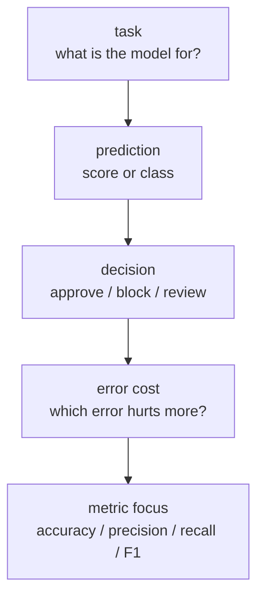
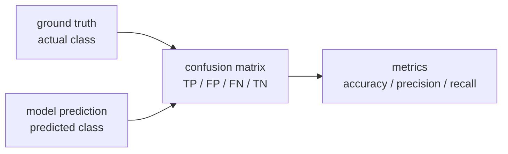
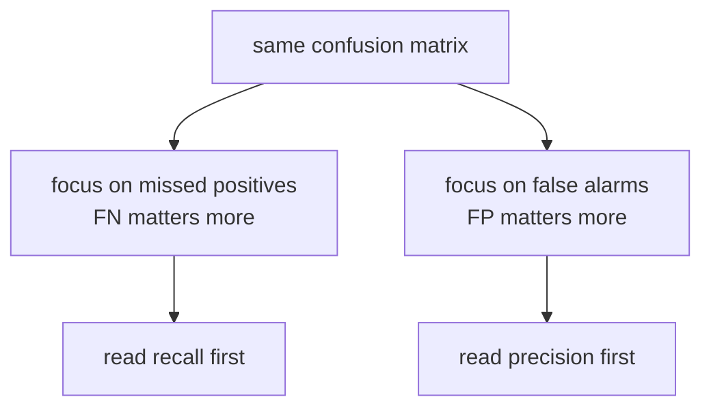

# P3-6.1 평가 지표(metric)의 역할

P3-5장에서는 과적합(overfitting)과 일반화(generalization)를 봤습니다. 이제 다음 질문이 이어집니다. `새 데이터에서도 버틴다`는 말을 실제로 무엇으로 확인할까요? 그때 등장하는 것이 `평가 지표(metric)`입니다.

평가 지표는 모델이 얼마나 잘 맞는지 숫자로 보여 주는 도구입니다. 하지만 초심자에게 더 중요한 점은, 지표가 단순히 점수판이 아니라 `무엇을 중요하게 보겠다는 약속`이라는 사실입니다. 같은 모델이라도 어떤 지표를 보느냐에 따라 좋아 보일 수도 있고, 위험해 보일 수도 있습니다.

## 이 절의 범위

이 절은 평가 지표의 역할을 설명하는 도입 절입니다. 여기서는 정확도(accuracy), 정밀도(precision), 재현율(recall), F1 점수(F1 score)를 처음 만나는 수준으로 연결합니다. 아직 ROC-AUC, PR-AUC, 로그 손실(log loss), 회귀 지표, 군집화 지표의 세부 계산은 다루지 않습니다.

P3-6.2에서는 문제 유형별로 어떤 평가 기준을 더 우선해야 하는지 이어서 다룹니다. 지금은 `지표는 왜 하나가 아니며`, `왜 같은 숫자라도 의미가 다를 수 있는가`, `왜 업무 목표와 오류 비용이 지표 선택에 들어와야 하는가`를 잡는 데 집중합니다.

이 절에서는 다음 질문에 답합니다.

- 평가 지표(metric)는 왜 필요한가?
- 정확도 하나만 보면 왜 오해가 생길 수 있는가?
- 정밀도와 재현율은 각각 어떤 질문에 답하는가?
- 지표는 모델 성능이 아니라 무엇을 중요하게 보는지까지 함께 드러내는가?
- 다음 절에서 문제 유형별 지표를 따로 볼 이유는 무엇인가?

## 이 절의 목표

- 평가 지표를 `모델 성능을 읽는 기준`으로 설명할 수 있습니다.
- 정확도(accuracy)가 모든 상황의 대표 지표는 아니라는 점을 이해할 수 있습니다.
- 정밀도(precision)와 재현율(recall)이 서로 다른 질문에 답한다는 점을 말할 수 있습니다.
- 업무 목표와 오류 비용이 지표 선택에 영향을 준다는 점을 설명할 수 있습니다.
- P3-6.2에서 문제 유형별 평가 기준으로 넘어갈 준비를 할 수 있습니다.

## 평가 지표는 무엇을 하는가

scikit-learn 문서는 평가 지표(metrics and scoring)를 `예측의 품질을 수치화하는 도구`로 다룹니다. 동시에 어떤 지표를 쓸지는 결국 `예측을 무엇에 쓰는가`와 연결된다고 설명합니다. 초심자 기준으로는 다음처럼 정리하면 충분합니다.

`평가 지표(metric)는 모델의 결과를 숫자로 요약하면서, 우리가 어떤 오류를 더 중요하게 보는지도 함께 드러내는 기준이다.`

즉, 지표는 단순히 “몇 점인가”만 말하지 않습니다.

- 무엇을 잘 맞추고 싶은가?
- 어떤 실수를 특히 줄이고 싶은가?
- 이 모델을 실제로 어떤 결정에 연결할 것인가?

이 질문들까지 함께 끌고 옵니다.



이 흐름에서 핵심은 `지표가 모델 바깥의 결정 맥락과 연결된다`는 점입니다. 모델은 예측을 만들지만, 지표는 그 예측이 실제 결정에서 어떤 의미를 가지는지까지 함께 읽게 만듭니다.

## 평가 지표의 역사적 배경

평가 지표는 최근 머신러닝에서 갑자기 생긴 도구가 아닙니다. 정보 검색(information retrieval) 연구에서는 오래전부터 `무엇을 좋은 결과라고 부를 것인가`가 핵심 문제였습니다. C. J. van Rijsbergen의 고전적인 정보 검색 교재는 평가(evaluation)를 별도 장으로 다루며, 왜 평가해야 하는가를 사회적(social) 질문과 경제적(economic) 질문으로 설명합니다. 같은 장은 Cyril Cleverdon이 정리한 측정 항목들 가운데 `재현율(recall)`과 `정밀도(precision)`이 검색 시스템의 효과성(effectiveness)을 설명하는 핵심 쌍으로 자리 잡았다고 소개합니다.

초심자 기준에서는 이 역사를 다음처럼 읽으면 충분합니다.

1. 컴퓨터 시스템은 일찍부터 `관련 있는 것`과 `관련 없는 것`을 구분해야 했다.
2. 그래서 단순히 많이 찾는 것이 아니라, `놓치지 않았는가`와 `쓸데없는 것을 너무 많이 내놓지 않았는가`를 따로 보게 되었다.
3. 이 생각이 정보 검색을 넘어 분류(classification), 탐지(detection), 머신러닝 평가로 넓게 이어졌다.

즉, 평가 지표는 숫자를 붙이기 위한 장식이 아니라, `이 시스템이 사용자에게 실제로 어떤 도움과 어떤 피해를 주는가`를 따지기 위해 발전한 언어라고 볼 수 있습니다.

## 왜 정확도 하나로 끝나지 않는가

Google의 머신러닝 용어집은 정확도(accuracy)를 `전체 예측 중 맞춘 비율`로 설명합니다. 이 정의 자체는 단순하고 유용합니다. 하지만 같은 용어집은 클래스 불균형(class imbalance) 데이터에서는 정확도가 매우 오해를 만들 수 있다고도 설명합니다.

예를 들어 스팸 메일이 거의 없는 데이터에서 모든 메일에 대해 `정상 메일`이라고만 예측해도 정확도는 높게 나올 수 있습니다. 하지만 그런 모델은 스팸을 실제로 걸러 주지 못합니다.

| 질문 | 정확도만 볼 때 생길 수 있는 오해 |
| --- | --- |
| 전체적으로 몇 개 맞췄는가? | 많이 맞춘 것처럼 보일 수 있다 |
| 중요한 양성 사례를 놓치지 않았는가? | 이 질문에는 충분히 답하지 못할 수 있다 |
| 잘못 경보를 너무 많이 내지 않았는가? | 이 질문에도 충분히 답하지 못할 수 있다 |

즉, 정확도는 출발점일 수는 있지만, 끝까지 책임지는 지표는 아닐 수 있습니다.

## 먼저 혼동 행렬(confusion matrix)로 읽는다

정밀도와 재현율을 이해하려면 먼저 `혼동 행렬(confusion matrix)`을 가볍게 보는 편이 좋습니다. Google 용어집은 혼동 행렬을 `모델이 맞춘 것과 틀린 것을 표로 요약한 표`로 설명합니다.



혼동 행렬에서 초심자가 먼저 잡아야 할 네 칸은 다음과 같습니다.

| 항목 | 뜻 |
| --- | --- |
| TP (true positive) | 실제 양성을 양성이라고 맞춤 |
| TN (true negative) | 실제 음성을 음성이라고 맞춤 |
| FP (false positive) | 실제 음성인데 양성이라고 잘못 예측 |
| FN (false negative) | 실제 양성인데 음성이라고 잘못 예측 |

여기서 중요한 점은 `틀림`도 두 종류라는 것입니다.

- FP는 “괜히 경보를 울린 실수”
- FN은 “있어야 할 경보를 놓친 실수”

이 둘의 비용이 같지 않기 때문에 지표도 하나로 끝나지 않습니다.

작은 예시로 보면 더 빠릅니다.

| 실제 / 예측 | 양성이라고 예측 | 음성이라고 예측 |
| --- | --- | --- |
| 실제 양성 10건 | 8건 -> TP | 2건 -> FN |
| 실제 음성 90건 | 6건 -> FP | 84건 -> TN |

이 표를 초심자 질문으로 다시 읽으면 다음과 같습니다.

- 실제 양성 10건 중 8건을 잡았다 -> 재현율(recall) 쪽 질문
- 양성이라고 말한 14건 중 8건만 실제 양성이다 -> 정밀도(precision) 쪽 질문

즉, 같은 표를 보더라도 `놓친 양성이 얼마나 되는가`를 물을 수도 있고, `괜히 양성이라고 한 것이 얼마나 되는가`를 물을 수도 있습니다.



같은 결과표라도 독자가 먼저 보는 질문은 하나가 아닙니다. 놓침이 더 아픈 장면이면 재현율을 먼저 읽고, 잘못 경보가 더 아픈 장면이면 정밀도를 먼저 읽습니다.

## 정밀도와 재현율은 서로 다른 질문에 답한다

Google 용어집은 재현율(recall)을 다음 질문으로 설명합니다.

> 실제 양성이었을 때, 모델은 그중 몇 퍼센트를 양성으로 제대로 잡았는가?

같은 관점으로 정밀도(precision)를 초심자 수준에서 정리하면 다음 질문이 됩니다.

> 모델이 양성이라고 말한 것들 중, 실제로 양성이었던 비율은 얼마인가?

이 둘을 표로 나누면 더 명확합니다.

| 지표 | 초심자 질문 | 특히 신경 쓰는 실수 |
| --- | --- | --- |
| 정확도(accuracy) | 전체적으로 몇 개 맞췄는가? | 전체 오답 |
| 정밀도(precision) | 양성이라고 한 것 중 얼마나 맞았는가? | FP를 줄이는 쪽 |
| 재현율(recall) | 실제 양성을 얼마나 놓치지 않았는가? | FN을 줄이는 쪽 |

이 표만 이해해도 다음 절로 넘어갈 준비가 됩니다.

## 업무 목표가 지표를 바꾼다

같은 분류 문제라도 업무 목표가 다르면 먼저 보는 지표가 달라집니다.

| 장면 | 더 먼저 보는 경향이 있는 지표 | 이유 |
| --- | --- | --- |
| 질병 선별 | 재현율(recall) | 놓치면 큰 문제가 될 수 있다 |
| 스팸 차단 | 정밀도(precision)와 재현율을 함께 봄 | 정상 메일 차단과 스팸 누락을 모두 조심해야 한다 |
| 광고 클릭 예측 | 정확도보다 정밀도, 재현율, 임계값 이후의 성과를 더 볼 수 있다 | 양성 비율과 비용 구조가 단순하지 않다 |
| 사기 탐지 | 재현율을 강하게 보되 FP 비용도 같이 본다 | 놓침도 위험하고 오탐도 운영 비용이 된다 |

즉, 지표는 수학 공식만의 문제가 아니라 `어떤 오류가 더 아픈가`의 문제이기도 합니다.

SW 엔지니어에게 익숙한 운영 장면으로 바꾸면 더 직관적일 수 있습니다.

| 운영 질문 | 머신러닝 지표 질문과 닮은 점 |
| --- | --- |
| 경보(alert)를 너무 많이 울리고 있는가? | FP를 너무 많이 만들고 있는가? |
| 실제 장애를 놓치고 있는가? | FN을 너무 많이 만들고 있는가? |
| 전체 요청 중 정상 처리 비율은 높은가? | 정확도(accuracy)처럼 전체 비율을 보는가? |

이 비유가 완전히 같은 뜻은 아닙니다. 하지만 `어떤 실패를 더 줄여야 하는가에 따라 보는 숫자가 달라진다`는 점에서는 매우 비슷합니다.

## 사회현상 예시로 다시 보기

이 문제는 기업 서비스 안에서만 생기지 않습니다. 사회현상을 다루는 분류와 탐지에서도 같은 질문이 나옵니다.

| 장면 | 더 먼저 따질 질문 | 지표를 다르게 읽어야 하는 이유 |
| --- | --- | --- |
| 재난 경보 알림 | 실제 위험을 얼마나 놓치지 않았는가? | 재현율이 낮으면 큰 사건을 놓칠 수 있다 |
| 복지 대상자 선별 | 필요한 사람을 얼마나 빠뜨리지 않았는가? | FN이 늘면 지원이 필요한 사람이 제외될 수 있다 |
| 채용 서류 자동 분류 | 잘못 탈락시키는 비율이 얼마나 되는가? | 높은 정확도만으로는 특정 집단 불이익을 못 볼 수 있다 |
| 온라인 혐오 표현 탐지 | 위험한 표현을 놓치지 않으면서 정상 표현을 과하게 막지 않는가? | 재현율과 정밀도를 함께 보지 않으면 사회적 비용이 커질 수 있다 |

이 표에서 중요한 것은, `좋은 지표`가 항상 하나로 정해지지 않는다는 점입니다. 사회현상에서는 오류가 누구에게 어떤 비용으로 돌아가는지가 다르기 때문입니다.

예를 들어 재난 경보에서는 `놓침(false negative)`이 특히 크고, 채용 자동 분류에서는 `잘못 탈락시킴(false positive 또는 false negative의 정의가 설정에 따라 달라짐)`이 큰 사회적 문제가 될 수 있습니다. 온라인 표현 탐지처럼 양쪽 비용이 모두 큰 경우에는 정밀도와 재현율을 함께 보아야 합니다.

복지 대상자 선별을 아주 단순하게 예시로 들면 다음처럼 읽을 수 있습니다.

| 장면 | 숫자가 뜻하는 바 |
| --- | --- |
| 재현율이 낮다 | 실제 지원이 필요한 사람을 많이 놓치고 있을 수 있다 |
| 정밀도가 낮다 | 지원이 덜 시급한 사례까지 많이 포함하고 있을 수 있다 |
| 정확도만 높다 | 전체 비율은 좋아 보여도 중요한 소수 집단을 놓쳤을 수 있다 |

이 예시가 중요한 이유는, 사회현상에서는 `전체적으로 얼마나 맞췄는가`보다 `누가 빠졌는가`, `누가 잘못 포함되었는가`가 더 중요한 경우가 많기 때문입니다.

## 같은 정확도라도 다른 모델일 수 있다

다음 표를 보면 같은 정확도라도 해석이 달라질 수 있음을 바로 볼 수 있습니다.

| 모델 | 정확도 | 정밀도 | 재현율 | 읽는 법 |
| --- | --- | --- | --- | --- |
| A | 0.95 | 0.91 | 0.42 | 양성이라고 한 것은 꽤 맞지만 실제 양성을 많이 놓친다 |
| B | 0.95 | 0.63 | 0.88 | 더 많이 잡아내지만 잘못 경보도 더 많을 수 있다 |

이 두 모델은 정확도만 보면 같아 보입니다. 하지만 어떤 실수를 더 줄이고 싶은지에 따라 선택이 달라질 수 있습니다.

초심자에게는 다음처럼 읽으면 충분합니다.

- 높은 정확도는 좋은 출발일 수 있다
- 하지만 양성을 놓치는 문제와 괜히 양성이라고 말하는 문제는 다르다
- 그래서 정밀도와 재현율을 같이 봐야 한다

## F1 점수는 둘을 함께 보려는 시도다

Google 용어집은 F1 점수를 정밀도와 재현율을 함께 쓰는 대표적인 요약 지표로 설명합니다. 초심자 기준으로는 다음 한 문장으로 이해하면 충분합니다.

`F1 score는 정밀도와 재현율을 한 숫자로 함께 보고 싶을 때 쓰는 절충 지표다.`

하지만 F1도 마법은 아닙니다.

| 장점 | 한계 |
| --- | --- |
| 정밀도와 재현율을 함께 볼 수 있다 | 두 지표 중 어느 쪽이 더 중요한지 숨길 수 있다 |
| 정확도보다 불균형 데이터에서 더 유용할 때가 많다 | 여전히 업무 비용 구조 전체를 대신하지는 못한다 |

따라서 F1은 `둘을 함께 보자`는 요약일 뿐, 항상 최종 결론은 아닙니다.

## Python 예제로 지표의 역할 읽기

다음 코드는 실제 학습이 아니라, 혼동 행렬 수치로부터 지표를 읽는 예제입니다.

```python
tp = 30
tn = 4999000
fp = 950
fn = 20

accuracy = (tp + tn) / (tp + tn + fp + fn)
precision = tp / (tp + fp)
recall = tp / (tp + fn)
f1 = 2 * precision * recall / (precision + recall)

print("accuracy:", round(accuracy, 4))
print("precision:", round(precision, 4))
print("recall:", round(recall, 4))
print("f1:", round(f1, 4))
```

실행 결과는 다음처럼 읽을 수 있습니다.

```text
accuracy: 0.9998
precision: 0.0306
recall: 0.6
f1: 0.0582
```

이 숫자는 초심자에게 아주 중요한 감각을 줍니다.

- 정확도는 거의 완벽해 보입니다.
- 하지만 정밀도는 매우 낮습니다.
- 재현율은 60% 수준입니다.

즉, `정확도만 보면 좋아 보이지만 실제로는 문제가 많은 모델`이 존재할 수 있다는 뜻입니다.

## Python 예제로 같은 정확도, 다른 해석 보기

이번에는 정확도는 같지만 정밀도와 재현율이 다를 수 있다는 점을 간단한 기록으로 읽어 봅니다.

```python
models = [
    {"name": "model_A", "accuracy": 0.95, "precision": 0.91, "recall": 0.42},
    {"name": "model_B", "accuracy": 0.95, "precision": 0.63, "recall": 0.88},
]

for item in models:
    print(item["name"])
    print("  accuracy :", item["accuracy"])
    print("  precision:", item["precision"])
    print("  recall   :", item["recall"])
```

실행 결과는 다음처럼 읽을 수 있습니다.

```text
model_A
  accuracy : 0.95
  precision: 0.91
  recall   : 0.42
model_B
  accuracy : 0.95
  precision: 0.63
  recall   : 0.88
```

이 예제에서 중요한 것은 `누가 더 낫다`를 기계적으로 고르는 일이 아닙니다. 중요한 것은 `무엇을 더 중요하게 보느냐에 따라 해석이 달라진다`는 점입니다.

## 이 절에서 기억할 관점

- 평가 지표(metric)는 모델 결과를 숫자로 요약하는 동시에, 어떤 오류를 더 중요하게 보는지도 드러냅니다.
- 정확도(accuracy)는 유용한 출발점이지만, 모든 상황의 대표 지표는 아닙니다.
- 정밀도(precision)는 `양성이라고 한 것 중 얼마나 맞았는가`를 묻습니다.
- 재현율(recall)는 `실제 양성을 얼마나 놓치지 않았는가`를 묻습니다.
- F1 점수는 정밀도와 재현율을 함께 보는 요약 지표입니다.
- 같은 정확도라도 정밀도와 재현율이 다르면 모델 해석과 선택이 달라질 수 있습니다.

## 체크리스트

- 평가 지표를 단순한 점수판이 아니라 선택 기준으로 설명할 수 있는가?
- 정확도 하나만 보면 왜 오해가 생길 수 있는지 말할 수 있는가?
- 정밀도와 재현율이 서로 다른 질문에 답한다는 점을 설명할 수 있는가?
- F1 점수가 무엇을 함께 보려는 지표인지 설명할 수 있는가?
- 같은 정확도라도 다른 모델일 수 있다는 점을 이해했는가?
- 다음 절에서 문제 유형별 평가 기준을 따로 봐야 하는 이유를 연결할 수 있는가?

## 출처와 참고 자료

- scikit-learn developers, `Metrics and scoring: quantifying the quality of predictions`, scikit-learn User Guide, 확인 날짜: 2026-06-26. [https://scikit-learn.org/stable/modules/model_evaluation.html](https://scikit-learn.org/stable/modules/model_evaluation.html){: target="_blank" rel="noopener noreferrer" }
- Google for Developers, `Machine Learning Glossary`, 확인 날짜: 2026-06-26. [https://developers.google.com/machine-learning/glossary/](https://developers.google.com/machine-learning/glossary/){: target="_blank" rel="noopener noreferrer" }
