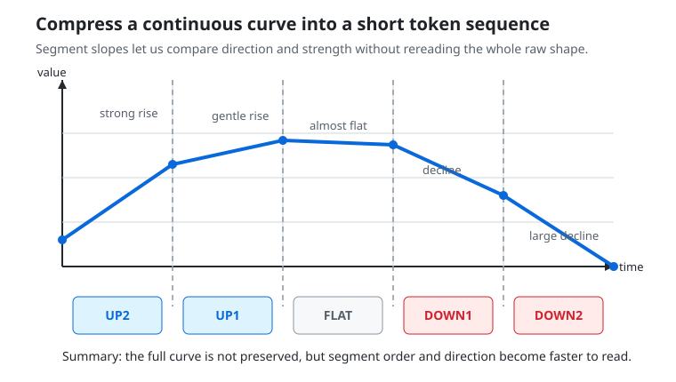

# P3-6.2 What Intermediate Representations Can We Add When Features Alone Are Not Enough

> Section ID: `P3-6.2`
> Version: `v2026.07.13`

Features such as averages, slopes, and variability are good starting points. But in some cases, a few numbers alone are not enough to describe the segment-level structure fully. Suppose there is a pattern that rises slowly in the early phase, stays flat in the middle phase, and then drops quickly in the late phase. If that structure is left as only two or three numbers, it can feel insufficient both when a person reads it again and when a model compares it. So in Part 3, [intermediate representation](../../../reference/concept-glossary.md#glossary-intermediate-representation) is read together as a human-led input re-expression that remains between raw logs and summary features so the structure can stay more visible.

This section does not repeat feature design itself again. Instead, it focuses on how far we can go in adding intermediate representations such as segment expressions and tokenization when numerical features from the previous section alone do not preserve enough structure.

This is where segment expressions and tokenized expressions appear. The core idea is simple. Instead of staring at the long raw curve as it is, we divide the whole thing into a few ranges and convert the direction and strength of each range into short symbols or short summary values.

| Segment | Numerical summary | Example of symbolic summary |
| --- | --- | --- |
| Early phase | Average rate of rise is positive | `UP` |
| Middle phase | Average change is almost zero | `FLAT` |
| Late phase | Rate of decline is large | `DOWN` |

If we divide the raw curve into segments as in the graph below, tokenization becomes visible not as simply naming things, but as `turning the curve's direction and strength into shorter reading units`.



Once this is done, a long curve shrinks into a short sequence such as `UP, FLAT, DOWN`. This expression is easy for people to read, and it also lets a model receive the structure of the curve as an input with more regular length. In other words, a segment expression is the act of converting a complex time series into `an intermediate representation that people and models can both look at`.

This representation can also be read in three levels. At the simplest level, it leaves only direction, such as `UP`, `DOWN`, `FLAT`. At a slightly finer level, it also leaves intensity, such as `UP1`, `UP2`, `DOWN3`. Going further, we can also inspect how many times each symbol repeated and in which ranges it stayed for long. Seen this way, tokenization is not a simple substitution. It is a way of rewriting the same raw curve at several resolutions.

| Representation level | What remains | What is easy to lose | When it is useful |
| --- | --- | --- | --- |
| Keep only direction | Rise, fall, flatness | Differences in the magnitude of change | When a very fast comparison is needed |
| Direction + intensity | Strength of rise or fall | Fine-grained fluctuation shape | When we want more explainable features |
| Include repetition length | Duration of the same pattern | Fine changes in the original time spacing | When we want to inspect repetition and state shifts |

This table shows that tokenization becomes easier to read the more strongly it compresses, but at the same time it also loses more. So which level to use is not a matter of technical taste. It is part of the problem definition. The level of representation that should remain can differ depending on whether we want a report that an operator can scan quickly or a structure that may later be reused as model input.

If we split once more the question `why do we need this representation`, the role of segment expressions between the summary table and the raw log becomes clearer.

| What we already have | Why we convert more | What becomes visible right after conversion |
| --- | --- | --- |
| A few segment averages | We want to see order and direction in a shorter way | A pattern like `UP, FLAT, DOWN` |
| One overall average | We want to reveal structural differences that the average hides | Same average, different shape |
| The full raw log | We need an intermediate representation a person can compare quickly | The outline of repeating structures |

The code below is an example that turns segment slopes into tokens using a very simple rule.

Problem situation: check what becomes easier to see when continuous numerical slopes are converted into a short symbol sequence.

Input: a list of slope values by segment

Expected output: output where the same slope list is turned into a token sequence such as `UP2`, `UP1`, `FLAT`, `DOWN1`, `DOWN2`

Concept to check: tokenization is the act of turning raw structure into an intermediate representation where order and direction are easier to read, rather than leaving it as-is

```python
def slope_to_token(slope: float) -> str:
    if slope >= 0.8:
        return "UP2"
    if slope >= 0.2:
        return "UP1"
    if slope <= -0.8:
        return "DOWN2"
    if slope <= -0.2:
        return "DOWN1"
    return "FLAT"


slopes = [0.9, 0.3, 0.05, -0.4, -1.0]
tokens = [slope_to_token(value) for value in slopes]

print("1) segment slopes before tokenization:", slopes)
print("2) tokens after tokenization:", tokens)
```

Expected output:

```text
1) segment slopes before tokenization: [0.9, 0.3, 0.05, -0.4, -1.0]
2) tokens after tokenization: ['UP2', 'UP1', 'FLAT', 'DOWN1', 'DOWN2']
```

The key point to watch in this output is the moment when continuous numbers turn into a short symbol sequence. A person can now read the structure much more quickly as `rise, gentle rise, almost flat, decline, large decline`. At the same time, because it also reveals what thresholds were used to create the tokens, the rule itself can be checked again.

If this example is checked in the following order, the role of tokenization becomes clearer.

1. Check into which token each slope was converted.
2. Think about whether the token boundaries are too coarse or too dense.
3. Write how a person would read this token sequence in one sentence.

For example, `['UP2', 'UP1', 'FLAT', 'DOWN1', 'DOWN2']` can be summarized as `the early rise is strong, the middle flattens for a while, and the late decline becomes larger`.

It is also important that the token sequence can differ even when the average is the same. For example, even if the average flow of two actions is 2.5 in both cases, one may be `UP, FLAT, DOWN` while the other is `FLAT, FLAT, FLAT`. They look similar if we inspect only the average, but the token sequence reveals that one had structural change while the other remained stable. Because of this, tokenization is not mere decoration. It is a representation that complements structure missed by average-based summaries.

This matters because segment tokens are still human-defined expressions, yet they already have the property of being `a sequence with order`. So they can preserve structure more directly when numerical features alone might miss it, and they also let us carry the same input structure forward naturally when sequential data or representation learning is explained later.

But this clearly has limits too. The moment we convert a curve into symbols, information loss appears, and the choice of where to place the boundaries for `UP`, `DOWN`, and `FLAT` also reflects the designer's judgment. In other words, tokenization is not universal. It is a compression that gains explainability while throwing away some detail.

So it is safer to understand this expression not as something that replaces the raw log, but as an `intermediate representation` placed between the raw log and the summary table. The raw log has the most information, the summary table is advantageous for comparison, and the tokenized expression makes structure more visible in the middle. Once we understand this relationship, it also becomes clearer `why some problems need more than an average` and `why some problems do not require us to inspect the entire raw log every time`.

So when reading a tokenized representation, we should always carry two questions together. `What becomes easier to see because of this representation?` and `What was lost by turning it into this representation?` Only with this sense of balance do we stop seeing a token sequence as a mysterious code and start reading it as an intermediate representation built for a purpose.

The same judgment can be summarized more briefly like this.

| What we need right now | The more direct representation |
| --- | --- |
| Numerical comparison and simple model input | Numerical features |
| Fast reading of segment order and direction | Segment expressions |
| Comparing structure as a short symbol sequence | Tokenized expressions |

So numerical features and intermediate representations are not in competition. They are tools separated according to what we want to make more visible.

This section can be read not as an introduction to one particular token rule, but as the problem of `what intermediate representation should be placed between raw structure and summarized features`.


So tokenization is more accurately read not as an isolated technique, but as a choice about `at what resolution the structure should remain` between leaving the raw log as it is and summarizing it too strongly.

## Sources and Further Reading

- TensorFlow, `Subword tokenizers`. Because it explains subword tokenizers as a representation between word-based tokenization and character-based tokenization, it can help explain the generalized view that Part 3's segment tokens also sit as an intermediate representation between raw logs and strong summaries. The part that connects this directly to time-series tokenization is an analogical application based on the official explanation. [https://www.tensorflow.org/text/guide/subwords_tokenizer](https://www.tensorflow.org/text/guide/subwords_tokenizer){: target="_blank" rel="noopener noreferrer" } / Accessed: 2026-07-08
- Google for Developers, `Machine Learning Glossary`: `feature engineering`. Because it explains feature engineering as the process of deciding transformations helpful for model training, it supports the point that intermediate representations are also transformations that do not leave raw values untouched but convert them into forms helpful for comparison and learning. [https://developers.google.com/machine-learning/glossary](https://developers.google.com/machine-learning/glossary){: target="_blank" rel="noopener noreferrer" } / Accessed: 2026-07-08
