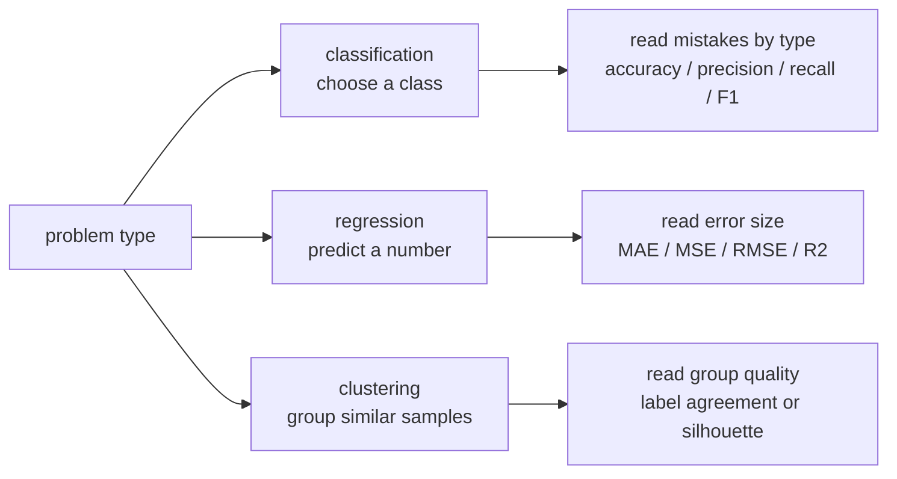
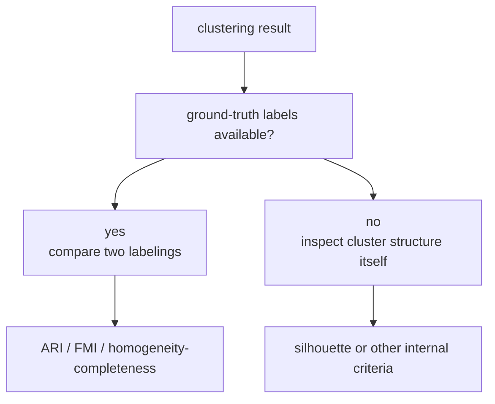

# P3-6.2 문제 유형별 평가 기준

P3-6.1에서는 평가 지표(metric)가 단순 점수판이 아니라, 무엇을 중요하게 보는지 드러내는 기준이라는 점을 봤습니다. 이제 다음 질문으로 넘어갑니다. `문제가 달라지면 왜 보는 지표도 달라질까요?`

답은 단순합니다. 모델이 내놓는 출력(output)이 다르고, 그 출력이 연결되는 판단도 다르기 때문입니다. 분류(classification)는 범주를 고르는 문제이고, 회귀(regression)는 숫자를 맞추는 문제이며, 군집화(clustering)는 비슷한 것끼리 묶는 문제입니다. 따라서 `잘했다`는 뜻도 같을 수 없습니다.

## 이 절의 범위

이 절은 분류, 회귀, 군집화에서 평가 기준이 왜 달라지는지 초심자 기준으로 정리하는 도입 절입니다. 여기서는 문제 유형마다 먼저 떠올려야 할 질문과 대표 지표를 연결합니다. 아직 ROC 곡선(ROC curve), PR 곡선(PR curve), 로그 손실(log loss), 캘리브레이션(calibration), 실루엣 계수(silhouette coefficient)의 세부 계산은 깊게 다루지 않습니다.

이 절은 다음 질문에 답합니다.

- 분류, 회귀, 군집화는 평가에서 무엇이 다른가?
- 분류에서는 왜 정확도 하나로 끝나지 않는가?
- 회귀에서는 왜 `맞았다/틀렸다`보다 `얼마나 벗어났는가`를 보게 되는가?
- 군집화에서는 왜 정답이 없을 수도 있다는 점이 중요해지는가?
- 문제 유형을 먼저 구분하면 이후 알고리즘 장을 읽기가 왜 쉬워지는가?

## 이 절의 목표

- 문제 유형에 따라 평가 질문이 달라진다는 점을 설명할 수 있습니다.
- 분류(classification)의 대표 지표와 회귀(regression)의 대표 지표가 왜 다른지 말할 수 있습니다.
- 군집화(clustering)는 정답 라벨(label)이 없는 경우가 많아서 평가가 더 조심스러워진다는 점을 설명할 수 있습니다.
- 이후 장에서 선형회귀, 로지스틱 회귀, k-NN, 결정트리 같은 알고리즘을 배울 때 어떤 평가 질문이 따라붙는지 준비할 수 있습니다.

## 먼저 문제 유형부터 구분한다

scikit-learn 문서는 평가 함수를 문제 목적별로 나누어 설명합니다. 분류 지표(classification metrics), 회귀 지표(regression metrics), 군집화 지표(clustering metrics)가 따로 있다는 점 자체가 중요한 힌트입니다. 같은 `성능`이라는 말 아래에 서로 다른 질문이 숨어 있다는 뜻입니다.



초심자 기준으로는 다음 표로 먼저 잡아두면 충분합니다.

| 문제 유형 | 모델 출력 | 먼저 던질 질문 | 자주 보는 대표 지표 |
| --- | --- | --- | --- |
| 분류(classification) | 클래스 또는 클래스 확률 | 어떤 종류의 실수를 더 줄여야 하는가? | accuracy, precision, recall, F1 |
| 회귀(regression) | 연속적인 숫자 | 예측값이 실제값에서 얼마나 벗어났는가? | MAE, MSE, RMSE, R² |
| 군집화(clustering) | 묶음 구조, 클러스터 ID | 정말 비슷한 것끼리 묶였는가? | ARI/FMI 같은 비교 지표, silhouette |

여기서 초심자가 가장 많이 헷갈리는 부분은 `출력의 형태가 다르면 좋은 결과의 뜻도 달라진다`는 점입니다.

| 문제 유형 | 입력 예시 | 출력 예시 | 잘했다는 뜻 |
| --- | --- | --- | --- |
| 분류 | 메일 내용, 고객 정보, 이미지 픽셀 | 스팸/정상, 이탈/유지, 고양이/개 | 맞는 범주를 골랐다 |
| 회귀 | 면적, 위치, 과거 가격 | 5억 2천만 원, 37분, 21.3도 | 숫자 차이를 작게 만들었다 |
| 군집화 | 구매 기록, 클릭 패턴, 센서 데이터 | 1번 군집, 2번 군집, 3번 군집 | 비슷한 것끼리 묶었다 |

즉, 분류는 `이름표를 붙이는 문제`에 가깝고, 회귀는 `숫자 눈금을 맞추는 문제`에 가깝고, 군집화는 `사람이 미리 이름을 주지 않은 묶음을 찾는 문제`에 가깝습니다.

## 분류에서는 오류의 종류를 먼저 본다

분류에서는 예측 결과를 `맞았다/틀렸다`로만 보면 부족한 경우가 많습니다. 이미 P3-6.1에서 본 것처럼, 실제 양성을 놓치는 실수(false negative)와 괜히 양성이라고 말하는 실수(false positive)는 비용이 다를 수 있습니다.

scikit-learn 문서도 분류 지표를 설명할 때 정확도(accuracy), F1, 혼동 행렬(confusion matrix), ROC AUC, precision-recall curve 같은 지표를 나누어 둡니다. 이것은 분류 성능이 한 숫자로 끝나지 않는다는 뜻입니다.

분류 문제를 처음 읽을 때는 다음 순서를 추천할 수 있습니다.

1. 무엇이 양성(positive)이고 무엇이 음성(negative)인가?
2. 놓치면 아픈가, 괜히 경보를 울리면 아픈가?
3. 그래서 먼저 볼 지표가 재현율(recall)인가, 정밀도(precision)인가?
4. 전체적인 균형을 보기 위해 F1 점수(F1 score)나 다른 지표를 함께 볼 필요가 있는가?

예를 들어 같은 분류 문제라도 다음처럼 질문이 달라집니다.

| 장면 | 먼저 묻는 질문 | 먼저 보기 쉬운 지표 |
| --- | --- | --- |
| 질병 선별 | 실제 위험 사례를 놓치지 않았는가? | recall |
| 스팸 차단 | 정상 메일을 너무 많이 막고 있지 않은가? | precision, recall 함께 |
| 사기 탐지 | 놓침과 오탐 중 무엇이 더 큰 비용인가? | recall 중심, precision 함께 |
| 추천 클릭 예측 | 점수 순서와 임계값 이후 성과가 어떤가? | accuracy만으로 부족할 수 있음 |

즉, 분류에서는 `오류의 종류`를 먼저 읽습니다.

### 분류를 더 구체적으로 읽기

분류는 겉으로 보면 단순합니다. 보기 중 하나를 고르면 되기 때문입니다. 하지만 실제로는 두 단계가 섞여 있습니다.

1. 모델이 어떤 클래스(class)를 더 가능성 높게 보는가?
2. 그 가능성을 실제 서비스에서 어떤 결정으로 바꿀 것인가?

예를 들어 메일 필터는 `스팸 확률 0.82` 같은 내부 점수를 만들 수 있습니다. 하지만 사용자는 확률을 보는 것이 아니라 `스팸함으로 이동`, `검토`, `받은편지함 유지` 같은 결정을 경험합니다. 그래서 분류 평가는 단순 분류표를 넘어서, 그 결정이 만든 오류 구조까지 함께 보게 됩니다.

초심자에게는 다음 구분이 특히 중요합니다.

| 구분 | 질문 | 왜 중요한가 |
| --- | --- | --- |
| 클래스 자체 | 어떤 범주를 예측하는가? | 문제 정의가 달라진다 |
| 양성과 음성 | 무엇을 `잡아야 하는 대상`으로 둘 것인가? | precision, recall 해석이 달라진다 |
| 임계값(threshold) | 몇 점수부터 양성으로 볼 것인가? | 같은 모델도 결과가 달라진다 |
| 오류 비용 | FP와 FN 중 무엇이 더 아픈가? | 먼저 볼 지표가 달라진다 |

예를 들어 의료 선별에서는 `양성으로 너무 많이 분류하는 것`보다 `실제 환자를 놓치는 것`이 더 큰 문제가 될 수 있습니다. 반대로 자동 승인 시스템에서는 `위험한 대상을 잘못 통과시키는 것`이 더 큰 문제가 될 수 있습니다. 그래서 분류는 `범주를 맞히는 일`이면서 동시에 `오류의 종류를 관리하는 일`이라고 설명하는 편이 안전합니다.

### 분류의 사회현상과 업무 예시

분류는 현실에서 가장 넓게 쓰이는 문제 유형 중 하나입니다. 이유는 많은 제도와 서비스가 결국 `통과/보류`, `정상/이상`, `허용/차단`, `승인/거절` 같은 범주 판단으로 움직이기 때문입니다.

| 장면 | 입력 예시 | 출력 예시 | 왜 평가가 민감한가 |
| --- | --- | --- | --- |
| 복지 대상자 1차 선별 | 소득, 가구 정보, 신청 이력 | 지원 우선/후순위 | 필요한 사람을 빠뜨리면 사회적 손실이 생긴다 |
| 채용 서류 자동 분류 | 이력서, 경력, 자격 | 다음 단계 진행/보류 | 잘못 탈락시키면 공정성 문제가 생긴다 |
| 금융 이상거래 탐지 | 결제 시간, 금액, 위치 | 정상/의심 거래 | 놓치면 금전 피해, 과도한 차단은 사용자 불편 |
| 콘텐츠 신고 분류 | 게시물 텍스트, 이미지 | 정상/검토/삭제 후보 | 위험 표현 누락과 과잉 차단을 함께 조심해야 한다 |

업무 시스템에서도 분류는 매우 흔합니다.

| 업무 장면 | 실제 판단 | 먼저 보는 지표 감각 |
| --- | --- | --- |
| 운영 알림(alert) 분류 | 경보를 올릴지 말지 | false alarm과 missed alert 균형 |
| 고객 이탈 예측 | 이탈 위험 고객을 추릴지 | recall이 낮으면 놓침이 커질 수 있음 |
| 불량품 검수 | 통과/재검사/폐기 | 불량 놓침과 과잉 재검사의 비용 비교 |
| 스팸·피싱 차단 | 차단/허용/검토 | precision과 recall을 함께 봐야 함 |

이런 예시를 보면 분류는 단순히 라벨을 붙이는 기술이 아니라, `분류 결과가 사람과 조직의 다음 행동을 바꾸는 기술`이라고 이해하는 편이 더 정확합니다.

## 회귀에서는 오차의 크기를 먼저 본다

회귀는 숫자를 예측하는 문제입니다. 집값, 배송 시간, 전력 사용량, 매출, 온도 같은 연속값을 맞추는 상황을 떠올리면 됩니다. 여기서는 `틀렸다`보다 `얼마나 틀렸는가`가 더 중요해집니다.

scikit-learn 문서는 회귀 지표(regression metrics)로 mean absolute error, mean squared error, R² score 등을 따로 설명합니다. 이 구성 자체가 회귀에서는 오차의 크기와 오차의 해석 방식이 핵심이라는 뜻입니다.

초심자 기준으로는 다음처럼 구분하면 좋습니다.

| 지표 | 초심자 질문 | 특징 |
| --- | --- | --- |
| MAE (mean absolute error) | 평균적으로 얼마만큼 빗나갔는가? | 직관적이다 |
| MSE (mean squared error) | 큰 오차를 더 강하게 벌주고 싶은가? | 큰 실수에 더 민감하다 |
| RMSE (root mean squared error) | MSE를 원래 단위로 다시 보고 싶은가? | 해석이 조금 더 쉽다 |
| R² (coefficient of determination) | 기준선보다 얼마나 잘 설명하는가? | 설명력처럼 읽히지만 오해도 쉽다 |

여기서 중요한 것은 회귀 지표가 `숫자 차이의 해석`과 연결된다는 점입니다.

- 배송 시간 예측에서 1분 오차와 30분 오차는 같은 실수가 아니다.
- 전력 수요 예측에서 큰 오차는 운영 계획 전체를 흔들 수 있다.
- 집값 예측에서는 평균적으로 얼마 차이 나는지가 더 직관적일 수 있다.

즉, 회귀에서는 `오차의 존재`보다 `오차의 크기와 비용`이 핵심입니다.

### 회귀를 더 구체적으로 읽기

회귀는 숫자를 다루기 때문에 많은 초심자가 `정확한 정답 하나를 맞히는 문제`처럼 오해하기 쉽습니다. 하지만 실제로는 `얼마나 가까운 숫자를 주는가`가 핵심입니다.

예를 들어 집값을 5억 원으로 예측해야 하는 상황에서 5억 100만 원과 7억 원은 둘 다 오답이지만, 같은 오답이 아닙니다. 회귀 지표는 바로 이 차이를 읽게 해 줍니다.

회귀를 읽을 때는 다음 질문이 붙습니다.

| 질문 | 왜 필요한가 | 연결되는 지표 |
| --- | --- | --- |
| 평균적으로 얼마나 벗어났는가? | 일상적인 오차 감각을 본다 | MAE |
| 큰 오차를 더 강하게 벌주고 싶은가? | 큰 실패가 치명적인 장면을 반영한다 | MSE, RMSE |
| 기준선보다 실제로 도움이 되는가? | 단순 평균 예측보다 나은지 본다 | R² |

여기서 기준선(baseline) 감각도 중요합니다. 회귀에서 좋은 모델이란 무조건 `값을 맞힌 모델`이 아니라, 적어도 `아무 생각 없이 평균만 말하는 모델`보다 낫다고 말할 수 있어야 합니다. R²는 이런 비교 관점을 도와주지만, 숫자가 높다고 해서 언제나 실무적으로 충분하다는 뜻은 아닙니다.

또 회귀는 단위(unit)에 민감합니다.

- 집값 예측의 MAE 100만 원
- 배송 시간 예측의 MAE 100만 원

이 둘은 숫자만 같아도 뜻이 완전히 다릅니다. 그래서 회귀에서는 `수치 자체`와 함께 `무슨 단위에서의 오차인가`를 같이 읽어야 합니다.

### 회귀의 사회현상과 업무 예시

회귀는 많은 사람이 처음에는 덜 친숙하게 느끼지만, 실제 업무에서는 매우 자주 등장합니다. 이유는 조직이 의사결정을 할 때 범주뿐 아니라 `얼마나`, `언제까지`, `몇 개`, `얼마의 비용` 같은 숫자를 계속 다루기 때문입니다.

| 장면 | 입력 예시 | 출력 예시 | 왜 평가가 민감한가 |
| --- | --- | --- | --- |
| 주택 가격 추정 | 면적, 지역, 거래 이력 | 예상 가격 | 큰 오차는 거래 판단을 왜곡할 수 있다 |
| 배송 시간 예측 | 출발지, 물류량, 교통 상황 | 도착 예상 시간 | 작은 오차는 허용돼도 큰 지연은 서비스 신뢰를 깬다 |
| 전력 수요 예측 | 기온, 시간대, 과거 사용량 | 다음 시간 수요 | 큰 오차는 공급 계획과 비용에 직접 영향 |
| 병원 대기 시간 예측 | 예약 수, 의료진 수, 환자 상태 | 예상 대기 시간 | 실제 운영 경험과 자원 배치에 영향 |

업무 분석 관점에서도 회귀는 자주 쓰입니다.

| 업무 장면 | 예측하려는 숫자 | 평가에서 보는 감각 |
| --- | --- | --- |
| 매출 계획 | 다음 주 매출 | 평균적으로 얼마나 빗나가는가 |
| 광고 운영 | 클릭 수, 전환 수, 비용 | 큰 오차가 예산 집행을 흔드는가 |
| 제조 운영 | 다음 배치 생산량 | 수요 과소·과대 예측 비용이 얼마나 다른가 |
| 인프라 운영 | CPU 사용량, 요청 수 | 급격한 피크를 놓치면 운영 장애로 이어지는가 |

회귀 예시를 읽을 때는 `숫자를 맞히는 일`보다 `숫자의 오차가 계획과 운영을 얼마나 흔드는가`를 같이 보는 편이 좋습니다. 회귀의 평가는 수학적 오차이면서 동시에 운영 오차이기도 합니다.

## 군집화에서는 정답이 없을 수도 있다

군집화는 분류나 회귀보다 초심자에게 더 낯설 수 있습니다. 이유는 간단합니다. 군집화는 대개 `정답 라벨이 없는 상태`에서 시작하기 때문입니다.

scikit-learn 문서는 군집화 성능 평가를 설명하면서, 이것이 지도학습(supervised learning)의 정밀도·재현율처럼 단순하지 않다고 말합니다. 또, 정답 라벨을 알고 있을 때와 모를 때를 나누어 설명합니다.

이 차이가 매우 중요합니다.



초심자 기준에서는 이렇게 정리하면 충분합니다.

| 상황 | 먼저 던질 질문 | 대표적인 읽는 법 |
| --- | --- | --- |
| 정답 라벨이 있다 | 사람이 알고 있는 구분과 비슷하게 묶였는가? | ARI, FMI 같은 비교 지표 |
| 정답 라벨이 없다 | 같은 군집 안은 가깝고, 다른 군집과는 떨어져 있는가? | silhouette 같은 내부 기준 |

즉, 군집화에서는 `정답이 없는 평가`라는 점 자체가 핵심 학습 포인트입니다.

### 군집화를 더 구체적으로 읽기

군집화는 초심자에게 가장 추상적으로 느껴질 수 있습니다. 분류는 정답 범주가 있고, 회귀는 맞춰야 할 숫자가 있지만, 군집화는 처음부터 `어떤 묶음이 좋은 묶음인가`를 사람이 다시 해석해야 하기 때문입니다.

따라서 군집화에서는 모델이 무엇을 했는지를 두 층으로 나누어 읽는 편이 좋습니다.

1. 데이터 안에서 어떤 묶음 구조를 만들었는가?
2. 그 묶음이 사람이 이해하는 구분과도 맞는가?

예를 들어 고객 데이터를 군집화했을 때 모델은 `1번 군집`, `2번 군집`, `3번 군집` 같은 ID만 내놓을 수 있습니다. 하지만 이 숫자 자체는 `우수 고객`, `이탈 위험 고객`, `가끔 방문 고객` 같은 의미를 자동으로 주지 않습니다. 그 의미는 사람이 다시 읽고 해석해야 합니다.

초심자 기준에서는 다음 구분이 중요합니다.

| 구분 | 질문 | 왜 중요한가 |
| --- | --- | --- |
| 라벨 없는 평가 | 군집 안은 조밀하고 군집 사이는 떨어져 있는가? | 사람이 정답을 모를 때 쓰는 관점 |
| 라벨 있는 평가 | 사람이 알고 있던 구분과 비슷한가? | 비교 가능한 기준이 있을 때 쓰는 관점 |
| 군집 수의 해석 | 군집이 너무 많거나 너무 적지 않은가? | 결과 해석 가능성이 달라진다 |
| 군집 의미 부여 | 군집 ID가 실제 업무 집단과 연결되는가? | 분석 결과를 행동으로 바꿀 수 있어야 한다 |

즉, 군집화 평가는 `모양이 좋아 보이는가`와 `해석 가능한가`를 함께 생각해야 합니다. 이 점에서 군집화는 단순 점수보다 `구조를 보고, 비교하고, 이름 붙이는 해석 작업`이 더 크게 들어갑니다.

### 군집화의 사회현상과 업무 예시

군집화는 정답을 맞히는 문제보다 `숨은 구조를 찾는 문제`에 가깝습니다. 그래서 분석, 정책 기획, 서비스 운영 초기에 자주 등장합니다.

| 장면 | 입력 예시 | 출력 예시 | 왜 평가가 민감한가 |
| --- | --- | --- | --- |
| 고객 세분화 | 구매 주기, 객단가, 방문 빈도 | 고객군 A/B/C | 군집이 나와도 사람이 해석하지 못하면 쓸모가 약하다 |
| 지역 정책 분석 | 인구, 소득, 교통, 의료 접근성 | 비슷한 지역 묶음 | 군집이 행정 판단을 돕지만 낙인 효과를 조심해야 한다 |
| 뉴스·게시물 주제 탐색 | 단어 분포, 임베딩 | 비슷한 문서 묶음 | 군집 수와 해석 방식에 따라 전혀 다른 결론이 나온다 |
| 장비 이상 패턴 탐색 | 진동, 온도, 압력 변화 | 비슷한 동작 그룹 | 나중에 이상 군집으로 해석할 근거가 필요하다 |

업무 현장에서는 군집화가 보통 다음 질문으로 이어집니다.

| 업무 질문 | 군집화가 하는 일 | 이후 사람의 일 |
| --- | --- | --- |
| 고객은 어떤 유형으로 나뉘는가? | 비슷한 구매 패턴을 묶는다 | 각 군집의 특징을 읽고 이름 붙인다 |
| 이상 사례는 어디에 몰려 있는가? | 일반 패턴과 다른 묶음을 찾는다 | 그 묶음이 실제 위험인지 확인한다 |
| 운영 로그에 숨은 패턴이 있는가? | 유사한 시퀀스를 묶는다 | 장애, 배포, 사용자 행동과 연결한다 |
| 문서 집합이 어떤 주제로 갈라지는가? | 유사한 문서를 묶는다 | 군집을 주제나 업무 분류로 해석한다 |

즉, 군집화는 `모델이 끝까지 답을 내는 문제`라기보다 `사람이 추가 해석을 하기 위한 구조를 먼저 드러내는 문제`로 이해하는 편이 안전합니다.

## 문제 유형별로 같은 숫자를 기대하면 오해가 생긴다

초심자는 종종 이렇게 생각할 수 있습니다.

- 분류도 점수
- 회귀도 점수
- 군집화도 점수
- 그러니 결국 큰 숫자가 좋다는 뜻 아닌가?

이렇게 읽으면 중요한 차이를 놓칩니다.

| 문제 유형 | 숫자가 말하는 것 | 오해하기 쉬운 지점 |
| --- | --- | --- |
| 분류 | 어떤 종류의 예측 실수를 얼마나 만들었는가 | 높은 정확도만 좋다고 생각하기 쉽다 |
| 회귀 | 숫자 오차가 평균적으로 얼마나 큰가 | 단위와 비용 차이를 무시하기 쉽다 |
| 군집화 | 묶음 구조가 얼마나 그럴듯한가 | 정답이 있다고 가정하기 쉽다 |

따라서 지표를 보기 전에 먼저 `이 모델은 무엇을 예측하고 있는가`를 확인해야 합니다.

## Python 예제로 분류를 실험해 보기

분류는 임계값(threshold)을 조금만 바꿔도 정밀도와 재현율이 달라질 수 있습니다. 다음 예제는 같은 점수(score)라도 `몇 점부터 양성으로 볼 것인가`에 따라 결과가 달라진다는 점을 보여 줍니다.

```python
y_true = [1, 1, 1, 0, 0, 0, 1, 0]
scores = [0.95, 0.80, 0.55, 0.70, 0.40, 0.20, 0.45, 0.60]

def classification_metrics(y_true, scores, threshold):
    y_pred = [1 if s >= threshold else 0 for s in scores]

    tp = sum(1 for yt, yp in zip(y_true, y_pred) if yt == 1 and yp == 1)
    tn = sum(1 for yt, yp in zip(y_true, y_pred) if yt == 0 and yp == 0)
    fp = sum(1 for yt, yp in zip(y_true, y_pred) if yt == 0 and yp == 1)
    fn = sum(1 for yt, yp in zip(y_true, y_pred) if yt == 1 and yp == 0)

    accuracy = (tp + tn) / len(y_true)
    precision = tp / (tp + fp) if (tp + fp) else 0
    recall = tp / (tp + fn) if (tp + fn) else 0

    return {
        "threshold": threshold,
        "pred": y_pred,
        "tp": tp,
        "tn": tn,
        "fp": fp,
        "fn": fn,
        "accuracy": round(accuracy, 3),
        "precision": round(precision, 3),
        "recall": round(recall, 3),
    }

for threshold in [0.4, 0.6, 0.8]:
    result = classification_metrics(y_true, scores, threshold)
    print("threshold =", result["threshold"])
    print("  pred      =", result["pred"])
    print("  TP TN FP FN =", result["tp"], result["tn"], result["fp"], result["fn"])
    print("  accuracy  =", result["accuracy"])
    print("  precision =", result["precision"])
    print("  recall    =", result["recall"])
```

실행 결과는 다음과 같습니다.

```text
threshold = 0.4
  pred      = [1, 1, 1, 1, 1, 0, 1, 1]
  TP TN FP FN = 4 1 3 0
  accuracy  = 0.625
  precision = 0.571
  recall    = 1.0
threshold = 0.6
  pred      = [1, 1, 0, 1, 0, 0, 0, 1]
  TP TN FP FN = 2 2 2 2
  accuracy  = 0.5
  precision = 0.5
  recall    = 0.5
threshold = 0.8
  pred      = [1, 1, 0, 0, 0, 0, 0, 0]
  TP TN FP FN = 2 4 0 2
  accuracy  = 0.75
  precision = 1.0
  recall    = 0.5
```

이 예제는 다음처럼 실험해 볼 수 있습니다.

- 임계값을 `0.5`, `0.7`, `0.9`로 바꿔 본다.
- 점수 하나를 조금만 올리거나 내려 본다.
- 어떤 경우에 recall이 오르고 precision이 내려가는지 확인한다.

즉, 분류는 `모델 점수 -> 임계값 -> 최종 판단`의 흐름으로 읽는 것이 중요합니다.

## 아주 짧은 장면 비교로 다시 읽기

같은 데이터 과제라도 문제 유형이 바뀌면 독자의 질문이 완전히 달라집니다.

| 같은 업무 장면 | 분류로 볼 때 | 회귀로 볼 때 | 군집화로 볼 때 |
| --- | --- | --- | --- |
| 고객 데이터 | 이탈/유지로 나눌 수 있는가? | 다음 달 구매액을 예측할 수 있는가? | 비슷한 고객군으로 묶을 수 있는가? |
| 메일 데이터 | 스팸/정상으로 구분하는가? | 스팸 점수를 얼마나 높게 주는가? | 비슷한 메일 유형이 모이는가? |
| 센서 데이터 | 고장/정상으로 분류하는가? | 온도나 진동 값을 얼마나 정확히 예측하는가? | 비슷한 동작 패턴이 모이는가? |

이 표는 `알고리즘보다 먼저 문제 문장을 바꿔 읽어야 한다`는 점을 보여 줍니다. 같은 데이터셋도 질문이 바뀌면 문제 유형이 바뀌고, 그러면 평가 기준도 함께 바뀝니다.

## Python 예제로 회귀를 실험해 보기

회귀에서는 오차가 얼마나 큰지를 수치로 읽는 감각이 중요합니다. 특히 `큰 오차 하나`가 지표를 얼마나 흔드는지를 직접 보는 것이 도움이 됩니다.

```python
y_true = [10, 12, 9, 15]
y_pred = [11, 10, 8, 18]

absolute_errors = [abs(a - b) for a, b in zip(y_true, y_pred)]
squared_errors = [(a - b) ** 2 for a, b in zip(y_true, y_pred)]

mae = sum(absolute_errors) / len(absolute_errors)
mse = sum(squared_errors) / len(squared_errors)
rmse = mse ** 0.5

print("absolute_errors:", absolute_errors)
print("squared_errors :", squared_errors)
print("mae            :", round(mae, 2))
print("mse            :", round(mse, 2))
print("rmse           :", round(rmse, 2))
```

실행 결과는 다음과 같습니다.

```text
absolute_errors: [1, 2, 1, 3]
squared_errors : [1, 4, 1, 9]
mae            : 1.75
mse            : 3.75
rmse           : 1.94
```

이 숫자는 다음처럼 읽을 수 있습니다.

- MAE는 평균적으로 1.75만큼 빗나갔다고 읽을 수 있습니다.
- MSE는 큰 오차를 더 강하게 반영합니다.
- RMSE는 MSE를 원래 단위 감각으로 다시 읽게 도와줍니다.

즉, 회귀에서는 `얼마나 많이 틀렸는가`가 지표의 중심입니다.

이번에는 큰 오차 하나를 넣어 보겠습니다.

```python
y_true = [10, 12, 9, 15]
y_pred_small_error = [11, 10, 8, 18]
y_pred_big_error = [11, 10, 8, 30]

def regression_metrics(y_true, y_pred):
    absolute_errors = [abs(a - b) for a, b in zip(y_true, y_pred)]
    squared_errors = [(a - b) ** 2 for a, b in zip(y_true, y_pred)]
    mae = sum(absolute_errors) / len(absolute_errors)
    mse = sum(squared_errors) / len(squared_errors)
    rmse = mse ** 0.5
    return absolute_errors, squared_errors, round(mae, 2), round(mse, 2), round(rmse, 2)

for name, pred in [
    ("small_error_case", y_pred_small_error),
    ("big_error_case", y_pred_big_error),
]:
    absolute_errors, squared_errors, mae, mse, rmse = regression_metrics(y_true, pred)
    print(name)
    print("  pred           =", pred)
    print("  absolute_error =", absolute_errors)
    print("  squared_error  =", squared_errors)
    print("  mae            =", mae)
    print("  mse            =", mse)
    print("  rmse           =", rmse)
```

실행 결과는 다음과 같습니다.

```text
small_error_case
  pred           = [11, 10, 8, 18]
  absolute_error = [1, 2, 1, 3]
  squared_error  = [1, 4, 1, 9]
  mae            = 1.75
  mse            = 3.75
  rmse           = 1.94
big_error_case
  pred           = [11, 10, 8, 30]
  absolute_error = [1, 2, 1, 15]
  squared_error  = [1, 4, 1, 225]
  mae            = 4.75
  mse            = 57.75
  rmse           = 7.6
```

이 예제는 다음 질문을 직접 던지게 해 줍니다.

- 큰 오차 하나가 들어오면 어떤 지표가 더 많이 흔들리는가?
- 평균적인 오차를 보고 싶은가, 큰 실패를 더 강하게 벌주고 싶은가?

즉, 회귀 지표는 `숫자를 얼마나 틀렸는가`뿐 아니라 `어떤 종류의 틀림을 더 무겁게 볼 것인가`를 선택하는 도구이기도 합니다.

## Python 예제로 군집화를 실험해 보기

군집화는 초심자가 직접 손으로 해보면 더 빨리 이해됩니다. 다음 예제는 1차원 값들을 `거리 기준`으로 묶어 보는 아주 단순한 실험입니다.

```python
points = [1.0, 1.2, 1.4, 4.8, 5.0, 8.5]

def cluster_by_gap(points, gap):
    clusters = [[points[0]]]

    for value in points[1:]:
        if value - clusters[-1][-1] <= gap:
            clusters[-1].append(value)
        else:
            clusters.append([value])

    return clusters

for gap in [0.3, 0.6, 1.5]:
    print("gap =", gap)
    print("  clusters =", cluster_by_gap(points, gap))
```

실행 결과는 다음과 같습니다.

```text
gap = 0.3
  clusters = [[1.0, 1.2, 1.4], [4.8, 5.0], [8.5]]
gap = 0.6
  clusters = [[1.0, 1.2, 1.4], [4.8, 5.0], [8.5]]
gap = 1.5
  clusters = [[1.0, 1.2, 1.4], [4.8, 5.0], [8.5]]
```

이번에는 값을 조금 바꿔 보면 좋습니다.

- `points`에 `6.1`을 추가해 본다.
- `gap`을 `2.0`으로 바꿔 본다.
- 어떤 순간에 군집 수가 갑자기 줄어드는지 본다.

예를 들어 `6.1`을 추가하고 `gap = 1.5`로 두면 `[4.8, 5.0, 6.1]`이 하나의 군집으로 읽힐 수 있습니다. 즉, 군집화는 `정답을 맞히는 계산`이라기보다 `비슷함의 기준을 어디에 둘 것인가`를 실험하는 과정에 가깝습니다.

## 이후 장과의 연결

이 절은 평가 지표를 문제 유형별로 나누어 보는 입문 정리입니다. 이후 알고리즘 장에서는 같은 질문이 더 구체적으로 다시 나타납니다.

- P3-7.1 특징 선택(feature selection)과 P3-7.2 전처리(preprocessing)에서는 `무엇을 입력으로 줄 것인가`가 다시 중요해집니다. 평가 지표는 같아 보여도, 입력 특징과 전처리가 바뀌면 성능 해석도 달라질 수 있다는 점을 연결해서 보게 됩니다.
- P3-8.1 모델 선택(model selection)과 P3-8.2 기준 모델(baseline)에서는 `어떤 모델을 먼저 비교할 것인가`라는 질문이 이어집니다. 이때 지금 절에서 정리한 문제 유형별 평가 기준이 모델 비교의 기준선이 됩니다.
- P3-9.1 하이퍼파라미터(hyperparameter)와 P3-9.2 튜닝(tuning)과 검증 비용에서는 `성능을 조금 더 올리는 시도`가 실제로 어떤 지표 개선으로 이어졌는지 읽는 일이 중요해집니다. 즉, 튜닝은 숫자를 바꾸는 작업이 아니라 평가 기준을 따라 움직이는 작업으로 다시 보게 됩니다.

- P3-10.1 선형회귀(linear regression)의 직관과 P3-10.2 선형회귀의 평가와 한계에서는 회귀(regression) 문제를 실제 알고리즘으로 처음 만나게 됩니다. 이때 MAE, MSE, RMSE, R² 같은 회귀 지표가 왜 필요한지 다시 구체적으로 연결됩니다.
- P3-11.1 로지스틱 회귀(logistic regression)의 직관과 P3-11.2 결정 경계(decision boundary)에서는 분류(classification)의 대표적인 형태를 보게 됩니다. 여기서 정확도, 정밀도, 재현율, F1이 다시 등장하고, 임계값(threshold)과 확률 해석도 더 중요해집니다.
- P3-12.1 k-NN의 직관과 P3-12.2 거리(distance)와 스케일(scale)에서는 같은 분류라도 `가까움`의 정의가 결과를 바꾼다는 점을 보게 됩니다. 즉, 같은 분류 지표라도 거리 정의와 스케일 처리에 따라 해석이 달라질 수 있음을 예상할 수 있습니다.
- P3-13.1 SVM의 직관과 P3-13.2 커널(kernel)의 입문적 의미에서는 분류 경계(boundary)를 더 직접적으로 다루게 됩니다. 따라서 분류 성능을 읽을 때도 단순 정확도보다 경계가 어떤 실수를 만들고 있는지를 다시 떠올리게 됩니다.
- P3-14.1 결정트리(decision tree), P3-14.2 트리의 과적합, P3-15.1 랜덤포레스트(random forest), P3-15.2 특징 중요도(feature importance), P3-16.1 그래디언트 부스팅(gradient boosting), P3-16.2 부스팅의 성능과 위험에서는 분류와 회귀가 모두 다시 등장할 수 있습니다. 즉, 알고리즘 이름이 바뀌어도 `이 문제가 분류인가 회귀인가`를 먼저 확인해야 평가 지표를 올바르게 고를 수 있다는 점을 다시 확인하게 됩니다.

- P3-17.1 클러스터링(clustering)의 직관과 P3-17.2 군집 결과를 해석할 때의 주의점에서는 이 절의 군집화(clustering) 설명이 직접 이어집니다. 특히 `군집 ID는 정답 이름이 아니다`, `군집 결과는 사람이 다시 해석해야 한다`는 관점이 여기서 본격적으로 중요해집니다.
- P3-18.1 차원 축소(dimensionality reduction)와 P3-18.2 시각화와 정보 손실에서는 군집화와 비슷하게 `정답을 맞히는 것`보다 `구조를 어떻게 읽고 해석할 것인가`가 중요해집니다. 따라서 군집화 평가처럼 시각적 구조와 해석의 차이를 조심해서 읽는 감각이 이어집니다.

- P3-19.1 가치 기반 강화학습(value-based reinforcement learning), P3-19.2 정책 기반 강화학습(policy-based reinforcement learning), P3-19.3 강화학습 적용의 주의점으로 가면 또 다른 평가 관점이 열립니다. 강화학습은 분류·회귀·군집화처럼 한 번의 예측 오차만으로 읽기 어렵고, 보상(reward), 누적 성과, 탐험 비용을 함께 봐야 합니다. 따라서 이 절은 `모든 문제를 하나의 점수로 읽을 수는 없다`는 감각을 미리 준비하는 역할도 합니다.

## 이 절에서 기억할 관점

- 문제 유형이 달라지면 `좋은 성능`의 뜻도 달라집니다.
- 분류(classification)에서는 오류의 종류를 먼저 읽습니다.
- 회귀(regression)에서는 오차의 크기와 비용을 먼저 읽습니다.
- 군집화(clustering)에서는 정답 라벨이 없을 수 있다는 점이 평가를 더 어렵게 만듭니다.
- 지표를 고르기 전에 먼저 모델의 출력과 사용 장면을 확인해야 합니다.

## 체크리스트

- 분류, 회귀, 군집화가 서로 다른 평가 질문을 가진다는 점을 설명할 수 있는가?
- 분류에서 precision과 recall이 왜 중요한지 다시 연결할 수 있는가?
- 회귀에서 MAE, MSE, RMSE가 왜 필요한지 말할 수 있는가?
- 군집화에서 정답 라벨이 없을 수 있다는 점이 왜 중요한지 설명할 수 있는가?
- 이후 알고리즘 장에서 어떤 평가 질문이 따라붙는지 예고할 수 있는가?

## 출처와 참고 자료

- scikit-learn developers, `Metrics and scoring: quantifying the quality of predictions`, scikit-learn User Guide, 확인 날짜: 2026-06-26. [https://scikit-learn.org/stable/modules/model_evaluation.html](https://scikit-learn.org/stable/modules/model_evaluation.html){: target="_blank" rel="noopener noreferrer" }
- scikit-learn developers, `Clustering performance evaluation`, scikit-learn User Guide, 확인 날짜: 2026-06-26. [https://scikit-learn.org/stable/modules/clustering.html#clustering-performance-evaluation](https://scikit-learn.org/stable/modules/clustering.html#clustering-performance-evaluation){: target="_blank" rel="noopener noreferrer" }
