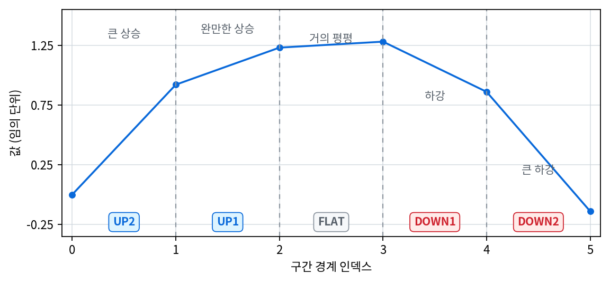

# P3-6.2 특징만으로 부족할 때 어떤 중간 표현을 더 둘 수 있는가

> Section ID: `P3-6.2`
> Version: `v2026.07.25`

평균, 기울기, 변동성 같은 특징은 좋은 출발점이 됩니다. 하지만 어떤 경우에는 숫자 몇 개만으로는 구간별 구조를 충분히 설명하기 어렵습니다. 예를 들어 초반에는 천천히 오르고, 중반에는 평평하게 유지되다가, 후반에는 빠르게 떨어지는 패턴이 있다고 하겠습니다. 이런 구조를 숫자 두세 개로만 남기면 사람이 다시 읽을 때도 아쉽고, 모델이 비교할 때도 중요한 모양 차이를 놓칠 수 있습니다. 그래서 Part 3에서는 [중간 표현(intermediate representation)](../../../reference/concept-glossary-parts/09-jieut.md#glossary-intermediate-representation)을 원시 로그와 요약 특징 사이에서 구조를 더 또렷하게 남기기 위해 두는 사람 주도 입력 재표현으로 함께 봅니다.

여기서는 특징 설계 자체를 다시 반복하지 않습니다. 대신 앞 절에서 만든 숫자 특징만으로 구조가 충분히 남지 않을 때, 세그먼트 표현과 토큰화 같은 중간 표현을 어디까지 더 둘 수 있는지에 집중합니다.

그래서 등장하는 것이 세그먼트 표현과 [토큰화(tokenization)](../../../reference/concept-glossary-parts/12-tieut.md#glossary-tokenization)된 표현입니다. 핵심 생각은 단순합니다. 긴 원시 곡선을 그대로 들여다보는 대신, 전체를 몇 개 구간으로 나누고 각 구간의 방향과 강도를 짧은 기호나 짧은 요약값으로 바꾸는 것입니다.

| 구간 | 수치 요약 | 기호 요약 예시 |
| --- | --- | --- |
| 초반 | 평균 상승률이 양수 | `UP` |
| 중반 | 평균 변화가 거의 없음 | `FLAT` |
| 후반 | 하강률이 큼 | `DOWN` |

아래 그래프처럼 원시 곡선을 구간으로 나누어 보면, 토큰화가 단순히 이름을 붙이는 일이 아니라 `곡선의 방향과 강도를 더 짧은 읽기 단위로 바꾸는 일`이라는 점이 보입니다.



이렇게 바꾸면 긴 곡선이 `UP, FLAT, DOWN` 같은 짧은 시퀀스로 줄어듭니다. 이 표현은 사람이 읽기 쉽고, 모델도 곡선의 구조를 더 일정한 길이의 입력으로 받아들일 수 있습니다. 즉 세그먼트 표현은 복잡한 시계열을 `사람과 모델이 같이 볼 수 있는 중간 표현`으로 바꾸는 일입니다.

이 표현은 세 가지 층위로 읽을 수도 있습니다. 가장 단순한 층위에서는 `UP`, `DOWN`, `FLAT`처럼 방향만 남깁니다. 조금 더 세밀한 층위에서는 `UP1`, `UP2`, `DOWN3`처럼 강도까지 함께 남깁니다. 더 나아가면 각 기호가 몇 번 반복되었는지, 어느 구간에서 길게 유지되었는지도 함께 볼 수 있습니다. 이렇게 보면 토큰화는 단순 치환이 아니라, 같은 원시 곡선을 여러 해상도로 다시 표현하는 방식입니다.

| 표현 층위 | 남기는 정보 | 잃기 쉬운 정보 | 언제 유용한가 |
| --- | --- | --- | --- |
| 방향만 남기기 | 상승, 하강, 정체 | 변화의 크기 차이 | 아주 빠른 비교가 필요할 때 |
| 방향 + 강도 | 상승/하강의 세기 | 세부 흔들림의 모양 | 설명 가능한 특징을 늘리고 싶을 때 |
| 반복 길이까지 보기 | 같은 패턴의 지속 시간 | 원래 시점 간격의 세밀한 변화 | 반복성과 상태 변화를 보고 싶을 때 |

이 표를 보면 토큰화가 `더 많이 줄일수록 더 읽기 쉬워지지만, 동시에 더 많이 잃는다`는 사실이 보입니다. 따라서 어떤 층위를 쓸지는 기술 취향이 아니라 문제 설정의 일부입니다. 운영자가 빠르게 훑어볼 리포트를 만들고 싶은지, 아니면 나중에 모델 입력으로도 재사용하고 싶은지에 따라 남길 표현 층위가 달라질 수 있습니다.

여기서는 `이 표현이 왜 필요한가`를 한 번 더 나눠 보면, 세그먼트 표현이 요약 표와 원시 로그 사이에서 맡는 역할이 분명해집니다.

| 이미 있는 것 | 추가로 바꾸는 이유 | 바꾼 뒤 바로 보이는 것 |
| --- | --- | --- |
| 구간 평균 몇 개 | 구간의 순서와 방향을 더 짧게 보고 싶음 | `UP, FLAT, DOWN` 같은 패턴 |
| 전체 평균 하나 | 평균이 가린 구조 차이를 드러내고 싶음 | 같은 평균, 다른 모양 |
| 원시 로그 전체 | 사람이 빠르게 비교할 중간 표현이 필요함 | 반복되는 구조의 윤곽 |

아래 코드는 세그먼트 기울기 CSV를 읽고, 토큰 경계값을 두 가지 설정으로 바꾸어 같은 원시 기울기가 어떻게 다른 토큰 시퀀스로 바뀌는지 확인하는 예시입니다.

문제 상황: 연속 수치 기울기를 짧은 기호열로 바꾸면 무엇이 더 잘 보이는지 확인합니다.

입력(input): 동작별 구간 기울기 CSV [p3_6_2_segment_slopes.csv](../../../assets/part-03/chapter-06/p3_6_2_segment_slopes.csv), 토큰 경계 후보 `token_settings`

기대 출력(output): 동작별 기울기 목록이 `UP2`, `UP1`, `FLAT`, `DOWN1`, `DOWN2` 같은 토큰 시퀀스로 바뀐 출력. 경계값을 바꾸면 `FLAT`으로 남는 구간 수, 강한 상승/하강 토큰 수, 바뀐 동작 목록이 달라진다.

확인할 개념: 토큰화는 원시 구조를 그대로 두지 않고 순서와 방향을 읽기 쉬운 중간 표현으로 바꾸는 작업이다. 토큰 경계는 고정 정답이 아니라 문제에 맞게 점검할 설계값이다.

```python
# 원시 로그와 최종 특징 사이에 중간 표현을 두어 계산 근거를 추적하는 예제입니다.
import csv
from collections import defaultdict
from pathlib import Path

data_path = Path("docs/assets/part-03/chapter-06/p3_6_2_segment_slopes.csv")
token_settings = {
    "sensitive": {"strong_threshold": 0.80, "weak_threshold": 0.20},
    "conservative": {"strong_threshold": 0.90, "weak_threshold": 0.30},
}


def slope_to_token(slope: float, strong_threshold: float, weak_threshold: float) -> str:
    if slope >= strong_threshold:
        return "UP2"
    if slope >= weak_threshold:
        return "UP1"
    if slope <= -strong_threshold:
        return "DOWN2"
    if slope <= -weak_threshold:
        return "DOWN1"
    return "FLAT"


rows = list(csv.DictReader(data_path.open(encoding="utf-8")))
for row in rows:
    row["segment_order"] = int(row["segment_order"])
    row["slope"] = float(row["slope"])

events = defaultdict(list)
for row in rows:
    events[row["event_id"]].append(row)

reports = {}
for setting_name, thresholds in token_settings.items():
    event_reports = []
    token_counts = defaultdict(int)
    for event_id, event_rows in sorted(events.items()):
        ordered_rows = sorted(event_rows, key=lambda row: row["segment_order"])
        slopes = [row["slope"] for row in ordered_rows]
        tokens = [
            slope_to_token(
                slope,
                thresholds["strong_threshold"],
                thresholds["weak_threshold"],
            )
            for slope in slopes
        ]
        for token in tokens:
            token_counts[token] += 1
        event_reports.append(
            {
                "event_id": event_id,
                "slopes": slopes,
                "tokens": tokens,
            }
        )
    reports[setting_name] = {
        "thresholds": thresholds,
        "events": event_reports,
        "token_counts": dict(sorted(token_counts.items())),
    }

sensitive_tokens = {
    report["event_id"]: report["tokens"]
    for report in reports["sensitive"]["events"]
}
changed_events = []
for report in reports["conservative"]["events"]:
    event_id = report["event_id"]
    if report["tokens"] != sensitive_tokens[event_id]:
        changed_events.append(event_id)

print("1) input rows:", len(rows))
print("2) event count:", len(events))
for setting_name, report in reports.items():
    print(f"[{setting_name}] thresholds =", report["thresholds"])
    print("token_counts =", report["token_counts"])
    for event in report["events"][:3]:
        print(event)
    print()
print("3) events changed when thresholds become conservative:", changed_events)
```

예상 출력:

```text
1) input rows: 40
2) event count: 8
[sensitive] thresholds = {'strong_threshold': 0.8, 'weak_threshold': 0.2}
token_counts = {'DOWN1': 9, 'DOWN2': 3, 'FLAT': 15, 'UP1': 9, 'UP2': 4}
{'event_id': 'A', 'slopes': [0.92, 0.31, 0.05, -0.42, -1.0], 'tokens': ['UP2', 'UP1', 'FLAT', 'DOWN1', 'DOWN2']}
{'event_id': 'B', 'slopes': [0.62, 0.24, 0.01, -0.22, -0.74], 'tokens': ['UP1', 'UP1', 'FLAT', 'DOWN1', 'DOWN1']}
{'event_id': 'C', 'slopes': [0.18, 0.12, 0.04, -0.1, -0.18], 'tokens': ['FLAT', 'FLAT', 'FLAT', 'FLAT', 'FLAT']}

[conservative] thresholds = {'strong_threshold': 0.9, 'weak_threshold': 0.3}
token_counts = {'DOWN1': 7, 'DOWN2': 1, 'FLAT': 23, 'UP1': 7, 'UP2': 2}
{'event_id': 'A', 'slopes': [0.92, 0.31, 0.05, -0.42, -1.0], 'tokens': ['UP2', 'UP1', 'FLAT', 'DOWN1', 'DOWN2']}
{'event_id': 'B', 'slopes': [0.62, 0.24, 0.01, -0.22, -0.74], 'tokens': ['UP1', 'FLAT', 'FLAT', 'FLAT', 'DOWN1']}
{'event_id': 'C', 'slopes': [0.18, 0.12, 0.04, -0.1, -0.18], 'tokens': ['FLAT', 'FLAT', 'FLAT', 'FLAT', 'FLAT']}

3) events changed when thresholds become conservative: ['B', 'D', 'E', 'F', 'H']
```

이 출력에서 봐야 할 핵심은 연속 수치가 짧은 기호열로 바뀌는 순간뿐 아니라, 경계값을 바꿀 때 어떤 동작의 해석이 실제로 달라지는가입니다. 여기서 조작할 값은 `token_settings` 안의 `strong_threshold`와 `weak_threshold`입니다. 보수적 설정에서는 작은 변화가 더 많이 `FLAT`으로 남고, `B`, `D`, `E`, `F`, `H`처럼 경계 근처 값을 가진 동작의 토큰 시퀀스가 바뀝니다. 반대로 `A`처럼 강한 상승과 강한 하강이 뚜렷한 동작은 설정을 바꿔도 주요 구조가 유지됩니다.

이렇게 여러 동작을 함께 보면 토큰 규칙이 단순한 이름표가 아니라 설계 판단이라는 점이 더 분명해집니다. 이제 사람은 `상승, 완만한 상승, 거의 평평, 하강, 큰 하강`처럼 구조를 빠르게 읽을 수 있지만, 동시에 어떤 [임계값(threshold)](../../../reference/concept-glossary-parts/08-ieung.md#glossary-threshold) 때문에 어떤 구간이 `FLAT`으로 접혔는지도 다시 점검할 수 있습니다.

이 예제는 다음 순서로 확인하면 토큰화가 맡는 역할이 더 분명해집니다.

1. 각 기울기가 어느 토큰으로 바뀌었는지 본다.
2. 토큰 경계가 너무 거칠거나 너무 촘촘하지 않은지 생각해 본다.
3. 이 토큰 시퀀스를 사람이 한 문장으로 어떻게 읽을지 적어 본다.

예를 들어 `['UP2', 'UP1', 'FLAT', 'DOWN1', 'DOWN2']`는 `초반 상승이 강하고, 중간에는 잠시 평평해지며, 후반에는 하강이 커지는 구조`라고 요약할 수 있습니다.

같은 평균이라도 토큰 시퀀스가 다를 수 있다는 점도 중요합니다. 예를 들어 두 동작 1회의 평균 유량이 둘 다 2.5라고 해도, 하나는 `UP, FLAT, DOWN`이고 다른 하나는 `FLAT, FLAT, FLAT`일 수 있습니다. 평균만 보면 비슷하지만, 토큰 시퀀스를 보면 하나는 구조 변화가 있었고 다른 하나는 안정적이었다는 차이가 드러납니다. 이 점 때문에 토큰화는 단순 장식이 아니라, 평균 요약이 놓치는 구조를 보완하는 표현이 됩니다.

이 차이는 간단한 [벡터화(vectorization)](../../../reference/concept-glossary-parts/06-bieup.md#glossary-vectorization) 예제로도 확인할 수 있습니다. 아래 코드는 같은 평균을 가진 후보를 숫자 평균만으로 정렬한 결과와, 토큰 시퀀스를 `TfidfVectorizer`로 벡터화해 쿼리와의 유사도로 정렬한 결과를 비교합니다.

```python
import pandas as pd
from sklearn.feature_extraction.text import TfidfVectorizer
from sklearn.metrics.pairwise import cosine_similarity

patterns = pd.DataFrame(
    [
        {"event_id": "A", "overall_mean": 2.5, "token_sequence": "UP2 UP1 FLAT DOWN1 DOWN2"},
        {"event_id": "B", "overall_mean": 2.5, "token_sequence": "FLAT FLAT FLAT FLAT FLAT"},
        {"event_id": "C", "overall_mean": 2.4, "token_sequence": "UP1 UP1 FLAT DOWN1 DOWN1"},
        {"event_id": "D", "overall_mean": 2.8, "token_sequence": "DOWN2 DOWN1 FLAT UP1 UP2"},
    ]
)

query_mean = 2.5
query_text = "UP2 UP1 FLAT DOWN1 DOWN2"

patterns["mean_distance"] = (patterns["overall_mean"] - query_mean).abs()
mean_rank = patterns.sort_values(["mean_distance", "event_id"])[
    ["event_id", "overall_mean", "mean_distance"]
]

vectorizer = TfidfVectorizer(ngram_range=(1, 2))
matrix = vectorizer.fit_transform(patterns["token_sequence"])
query_vector = vectorizer.transform([query_text])
patterns["token_similarity"] = cosine_similarity(query_vector, matrix)[0]
token_rank = patterns.sort_values(["token_similarity", "event_id"], ascending=[False, True])[
    ["event_id", "token_sequence", "token_similarity"]
]

print("rank by numeric mean")
print(mean_rank.to_string(index=False))
print()
print("rank by token sequence")
print(token_rank.to_string(index=False))
```

출력은 다음처럼 나옵니다.

```text
rank by numeric mean
event_id  overall_mean  mean_distance
       A           2.5            0.0
       B           2.5            0.0
       C           2.4            0.1
       D           2.8            0.3

rank by token sequence
event_id           token_sequence  token_similarity
       A UP2 UP1 FLAT DOWN1 DOWN2          1.000000
       C UP1 UP1 FLAT DOWN1 DOWN1          0.511833
       D DOWN2 DOWN1 FLAT UP1 UP2          0.392319
       B FLAT FLAT FLAT FLAT FLAT          0.120765
```

숫자 평균만 보면 `A`와 `B`는 똑같이 가까운 후보입니다. 하지만 `B`는 실제로는 모든 구간이 평평한 패턴이고, 쿼리와 같은 상승-평탄-하강 구조를 갖지 않습니다. 반대로 토큰 시퀀스를 벡터화하면 `A`가 가장 가깝고, 일부 상승과 하강 구조를 공유하는 `C`가 그다음으로 올라옵니다. 여기서 중요한 점은 `TfidfVectorizer`가 정답이라는 뜻이 아닙니다. 이미 사람이 만든 세그먼트 토큰을 실제 라이브러리 입력으로 바꾸면, 평균 요약이 지워 버린 순서와 방향 차이를 다시 비교할 수 있다는 점입니다.

이 점이 중요한 이유는 세그먼트 토큰이 아직 사람이 규칙을 정한 표현이면서도, 이미 `순서를 가진 시퀀스`라는 성질을 갖고 있기 때문입니다. 그래서 숫자 특징만으로는 놓치기 쉬운 구조를 더 직접 남길 수 있고, 뒤에서 순차 데이터나 표현 학습을 설명할 때도 같은 입력 구조를 자연스럽게 이어서 볼 수 있습니다.

하지만 여기에는 분명한 한계도 있습니다. 곡선을 기호로 바꾸는 순간 정보 손실이 생기고, `UP`, `DOWN`, `FLAT`의 경계를 어디에 둘지도 설계자의 판단이 들어갑니다. 즉 토큰화는 만능이 아니라, 설명 가능성을 얻는 대신 일부 세부를 버리는 압축입니다.

그래서 이 표현은 원시 로그를 대체하기보다, 원시 로그와 요약 표 사이에 놓이는 `중간 표현`으로 이해하는 쪽이 안전합니다. 원시 로그는 가장 많은 정보를 갖고 있고, 요약 표는 비교에 유리하며, 토큰화된 표현은 그 중간에서 구조를 더 눈에 띄게 드러냅니다. 이 관계를 이해하면 `왜 어떤 문제는 평균만으로 부족하고, 왜 어떤 문제는 원시 로그 전체를 매번 볼 필요가 없는가`도 더 분명해집니다.

따라서 토큰화된 표현을 읽을 때는 항상 두 질문을 함께 가져가야 합니다. `이 표현 덕분에 무엇이 더 잘 보이는가`, `이 표현으로 바꾸면서 무엇을 잃었는가`. 이 균형 감각이 있어야 토큰 시퀀스를 신비한 코드처럼 보지 않고, 목적에 따라 만든 중간 표현으로 읽을 수 있습니다.

같은 판단을 더 짧게 정리하면 다음과 같습니다.

| 지금 필요한 것 | 더 직접적인 표현 |
| --- | --- |
| 수치 비교와 간단한 모델 입력 | 숫자 특징 |
| 구간의 순서와 방향을 빠르게 읽기 | 세그먼트 표현 |
| 구조를 짧은 기호열로 비교하기 | 토큰화된 표현 |

즉 숫자 특징과 중간 표현은 경쟁 관계가 아니라, 무엇을 더 잘 보이게 할지에 따라 나누어 쓰는 도구입니다.

이 절은 특정 토큰 규칙 소개가 아니라, `원시 구조와 요약 특징 사이에 어떤 중간 표현을 둘 것인가(intermediate representation between raw structure and summarized features)`의 문제로 다시 볼 수 있습니다.

## 작은 도식으로 보기

이 절의 핵심은 원시 곡선을 바로 버리거나 바로 숫자 몇 개로 닫지 않는 데 있습니다. 곡선을 구간으로 나누고, 수치 요약을 거쳐 토큰 시퀀스로 바꾸면 `중간 표현`이라는 한 층위가 생깁니다.

--8<-- "assets/part-03/chapter-06/p3-6-2-mermaid-01-ko.mmd"


따라서 토큰화는 독립 기법처럼 보이기보다, 원시 로그를 그대로 둘지 너무 강하게 요약할지 사이에서 `구조를 어느 해상도로 남길지` 정하는 선택으로 읽는 편이 더 정확합니다.

## 출처와 참고 자료

- TensorFlow, `Subword tokenizers`. subword tokenizer를 word-based tokenization과 character-based tokenization 사이를 잇는 표현으로 설명하므로, Part 3의 세그먼트 토큰도 원시 로그와 강한 요약 사이에 놓이는 중간 표현이라는 일반화된 관점을 설명하는 데 참고할 수 있습니다. 여기서 시계열 토큰화와 직접 동일시하는 부분은 이 공식 설명을 바탕으로 한 유비적 적용입니다. [https://www.tensorflow.org/text/guide/subwords_tokenizer](https://www.tensorflow.org/text/guide/subwords_tokenizer){: target="_blank" rel="noopener noreferrer" } / 확인일: 2026-07-20
- Google for Developers, `Machine Learning Glossary`의 `feature engineering`. feature engineering을 model training에 helpful한 transformations를 결정하는 과정으로 설명하므로, 중간 표현도 원시 값을 그대로 두지 않고 비교와 학습에 도움이 되는 형태로 바꾸는 변환이라는 점을 뒷받침합니다. [https://developers.google.com/machine-learning/glossary](https://developers.google.com/machine-learning/glossary){: target="_blank" rel="noopener noreferrer" } / 확인일: 2026-07-20
