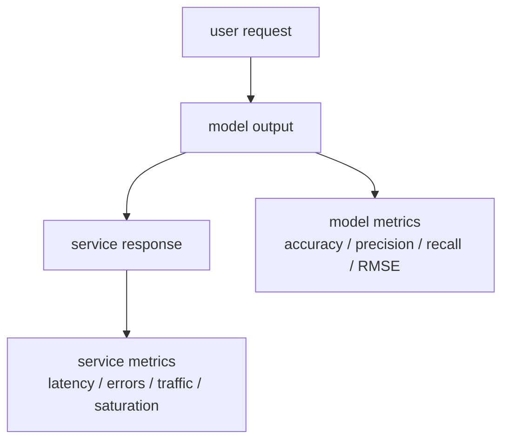
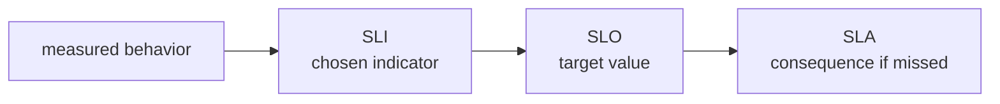
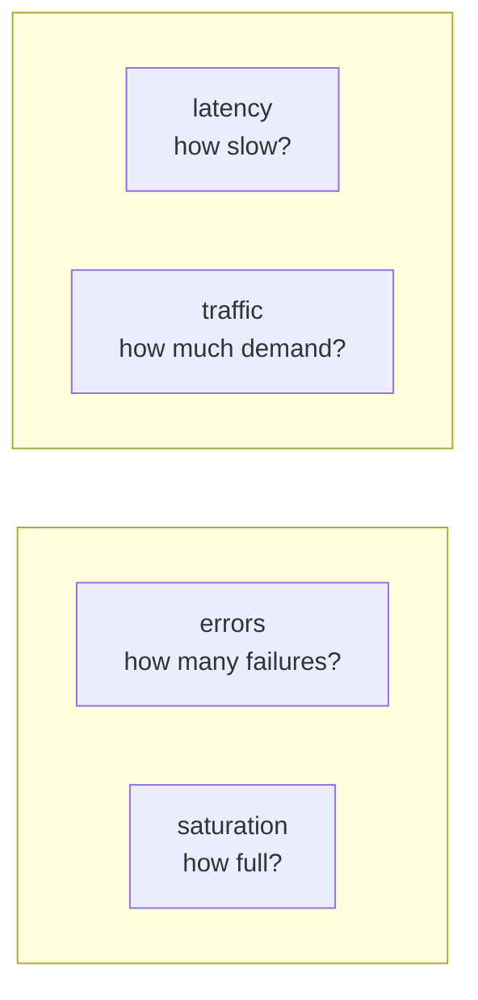

# P3-6.3 보충학습: 사이트 신뢰성 엔지니어링에서 매트릭스(metrics)를 읽는 법

P3-6.1과 P3-6.2에서는 모델 평가 지표(metric)를 봤습니다. 이제 시선을 조금 바깥으로 돌립니다. 모델이 잘 맞는 것과 서비스가 잘 운영되는 것은 같은 말이 아닙니다. 이 차이를 이해하려면 SRE(site reliability engineering)에서 `metric`이라는 말을 어떻게 쓰는지 보는 것이 도움이 됩니다.

이 절은 SRE 입문서를 대신하지 않습니다. 목적은 하나입니다. `모델의 품질을 읽는 숫자`와 `서비스의 상태를 읽는 숫자`가 어디서 닮고 어디서 갈라지는지 보충학습으로 정리하는 것입니다.

## 이 절의 범위

이 절은 머신러닝 평가 지표와 운영 지표를 구분하는 보충학습 절입니다. 여기서는 SLI(service level indicator), SLO(service level objective), SLA(service level agreement), 에러 버짓(error budget), 그리고 운영에서 자주 보는 지연 시간(latency), 트래픽(traffic), 오류(errors), 포화도(saturation)를 초심자 수준으로 연결합니다.

이 절은 다음 질문에 답합니다.

- 좋은 모델과 좋은 서비스는 왜 같은 말이 아닌가?
- 머신러닝 metric과 SRE metric은 무엇이 다른가?
- SLI, SLO, SLA는 어떤 관계인가?
- 운영에서는 왜 평균(mean) 하나보다 분포(distribution), 백분위수(percentile), 오류율(error rate)을 함께 보는가?
- AI 서비스에서는 왜 모델 평가와 서비스 운영 평가가 동시에 필요한가?

## 이 절의 목표

- 모델 metric과 운영 metric이 서로 다른 층위(level)의 숫자라는 점을 설명할 수 있습니다.
- SLI, SLO, SLA의 차이를 입문 수준에서 구분할 수 있습니다.
- latency, traffic, errors, saturation이 왜 운영의 기본 신호인지 설명할 수 있습니다.
- AI 서비스에서 `답의 품질`과 `서비스의 신뢰성`을 따로 봐야 한다는 점을 말할 수 있습니다.

## 모델 metric과 운영 metric은 무엇이 다른가

머신러닝에서 metric은 주로 예측 결과를 읽기 위한 숫자입니다. 예를 들어 accuracy, precision, recall, MAE, RMSE 같은 값은 모델이 얼마나 잘 맞는지, 어떤 오차를 만들고 있는지 보여 줍니다.

SRE에서 metric은 주로 서비스가 실제로 어떻게 동작하는지를 읽기 위한 숫자입니다. 예를 들어 latency, error rate, throughput, availability 같은 값은 사용자가 지금 어떤 서비스를 경험하고 있는지 보여 줍니다.

둘 다 `무엇을 중요하게 측정할 것인가`를 정한다는 점에서는 닮았습니다. 그러나 대상이 다릅니다.

| 구분 | 주로 묻는 질문 | 대표 예시 |
| --- | --- | --- |
| 모델 metric | 예측이 얼마나 맞는가? 어떤 오차가 중요한가? | accuracy, precision, recall, F1, MAE, RMSE |
| 운영 metric | 서비스가 얼마나 빠르고 안정적으로 동작하는가? | latency, error rate, throughput, availability |

초심자 기준으로는 이렇게 기억하면 충분합니다.

`모델 metric은 답의 품질에 가깝고, 운영 metric은 서비스의 상태에 가깝다.`



이 도식의 핵심은, 하나의 AI 서비스 안에서도 두 종류의 metric이 함께 존재한다는 점입니다.

## 좋은 모델이 곧 좋은 서비스는 아니다

이 구분은 AI 서비스에서 특히 중요합니다.

예를 들어 챗봇 서비스는 다음 두 질문을 동시에 받습니다.

1. 답변이 적절한가?
2. 답변이 제때 도착하는가?

첫 번째는 모델 품질 질문이고, 두 번째는 서비스 운영 질문입니다.

| 상황 | 모델 관점 질문 | 운영 관점 질문 |
| --- | --- | --- |
| 챗봇 | 답변이 사실에 가깝고 유용한가? | 응답 시간이 너무 길지 않은가? |
| 스팸 분류 API | 스팸을 제대로 잡는가? | 실패율과 처리 시간이 안정적인가? |
| 추천 서비스 | 추천 결과가 사용자 행동과 맞는가? | 트래픽이 몰려도 지연 없이 응답하는가? |
| 검색 서비스 | 관련 있는 결과를 보여 주는가? | 장애 없이 계속 검색 가능한가? |

즉, 모델 성능이 좋아도 지연 시간이 길거나 실패율이 높으면 서비스 품질은 낮을 수 있습니다. 반대로 서비스는 빠르고 안정적이어도 예측이 자꾸 틀리면 제품 목표를 달성하지 못합니다.

### 같은 서비스를 두 층위로 읽는 예시

초심자에게는 `같은 서비스인데 질문이 둘로 나뉜다`는 점이 가장 중요합니다. 챗봇 하나만 놓고 봐도 이렇게 읽을 수 있습니다.

| 같은 챗봇 서비스 | 모델 팀이 먼저 보는 질문 | 운영 팀이 먼저 보는 질문 |
| --- | --- | --- |
| 일반 상담 답변 | 답변이 문맥에 맞고 유용한가? | 응답 시간이 몰릴 때도 안정적인가? |
| 위험 질문 대응 | 위험 답변을 얼마나 잘 막는가? | 안전 필터가 붙어도 timeout이 늘지 않는가? |
| 다국어 지원 | 언어별 품질 차이가 큰가? | 특정 지역 트래픽 급증에도 장애가 없는가? |
| 도구 호출(agent/tool use) | 적절한 도구를 골랐는가? | 외부 API 실패가 전체 응답 실패로 번지지 않는가? |

즉, 같은 제품을 보더라도 `무엇을 잘 답했는가`와 `사용자가 실제로 버틸 만한 경험을 하는가`는 다른 평가 문제입니다.

다음처럼 두 상황을 대비해서 읽으면 더 직관적입니다.

| 상황 | 모델 metric 모습 | 운영 metric 모습 | 해석 |
| --- | --- | --- | --- |
| A | 답변 품질 높음 | latency 높음, timeout 증가 | 좋은 모델이지만 나쁜 서비스가 될 수 있다 |
| B | 답변 품질 낮음 | latency 낮음, availability 높음 | 안정적인 서비스지만 제품 목표를 못 이룰 수 있다 |

이 대비는 `AI 서비스 품질 = 모델 품질 + 운영 품질`이라는 감각을 줍니다.

## SLI, SLO, SLA는 어떻게 다른가

Google SRE Book은 SLI, SLO, SLA를 구분해서 정의합니다. 이 구분은 초심자에게도 중요합니다. 세 용어는 비슷해 보이지만 질문이 다릅니다.

- SLI(service level indicator): 무엇을 측정할 것인가?
- SLO(service level objective): 그 측정값을 어느 수준으로 유지하고 싶은가?
- SLA(service level agreement): 그 약속이 깨졌을 때 어떤 결과가 따르는가?

같은 서비스를 예로 들면 다음처럼 읽을 수 있습니다.

| 용어 | 초심자 질문 | 예시 |
| --- | --- | --- |
| SLI | 어떤 숫자를 볼 것인가? | 요청 지연 시간, 오류율, 가용성 |
| SLO | 그 숫자를 어느 수준으로 맞출 것인가? | p95 latency 300ms 이하, 성공률 99.9% 이상 |
| SLA | 못 지키면 무슨 일이 생기는가? | 환불, 크레딧, 계약상 보상 |



이 흐름을 보면, 운영에서 숫자를 읽는 일은 단순 관측이 아니라 `무엇을 약속하고 어떻게 반응할 것인가`까지 이어지는 구조라는 점을 알 수 있습니다.

## 에러 버짓(error budget)은 무엇을 더해 주는가

SLO를 정하면 자연스럽게 에러 버짓(error budget)이라는 개념이 따라옵니다. 아주 단순하게 말하면, `완벽하지 않아도 되는 범위`를 숫자로 잡아두는 생각입니다.

예를 들어 가용성 목표가 99.9%라면, 나머지 0.1%는 허용 가능한 실패 범위로 볼 수 있습니다. 이 개념은 두 가지를 동시에 가능하게 합니다.

1. 현실적으로 100% 완벽을 강요하지 않는다.
2. 그렇다고 실패를 무시하지도 않는다.

초심자 기준에서는 다음처럼 이해하면 충분합니다.

| 질문 | 에러 버짓이 하는 일 |
| --- | --- |
| 얼마나 실패해도 되는가? | 허용 범위를 숫자로 보여 준다 |
| 지금 너무 위험하게 운영하고 있는가? | 남은 실패 여유를 보게 한다 |
| 배포를 더 공격적으로 해도 되는가? | 서비스 신뢰성과 개발 속도의 균형을 잡게 한다 |

즉, 에러 버짓은 `실패를 허용하는 개념`이 아니라 `실패를 관리 가능한 범위 안에 두는 개념`이라고 설명하는 편이 정확합니다.

### 에러 버짓을 업무 감각으로 읽기

에러 버짓은 초심자에게 추상적으로 들리기 쉽습니다. 하지만 실제로는 `지금 공격적으로 바꿔도 되는가, 잠시 안정화에 집중해야 하는가`를 판단하는 기준으로 읽을 수 있습니다.

| 상황 | 에러 버짓이 넉넉할 때 | 에러 버짓이 거의 없을 때 |
| --- | --- | --- |
| 새 기능 배포 | 실험과 배포를 더 시도할 수 있다 | 보수적으로 운영해야 한다 |
| 모델 교체 | 새 모델 실험 여지가 있다 | 품질 개선보다 안정화가 우선일 수 있다 |
| 인프라 변경 | 구조 개선 작업을 진행할 수 있다 | 장애 가능성이 큰 변경을 미룰 수 있다 |

즉, 에러 버짓은 운영팀만의 숫자가 아니라, 제품 팀과 개발 팀이 함께 읽는 `변경 속도의 신호`이기도 합니다.

## 운영에서는 왜 평균보다 분포와 백분위수를 더 보게 되는가

Google SRE Book은 운영에서 단순 평균(mean)이 중요한 사실을 가릴 수 있다고 설명합니다. 특히 지연 시간(latency)은 평균만 보면 긴 꼬리 구간(tail)이 숨겨질 수 있습니다.

예를 들어 평균 응답 시간이 100ms여도, 일부 요청이 5초씩 걸리면 사용자는 서비스를 느리다고 느낄 수 있습니다. 그래서 운영에서는 p95, p99 같은 백분위수(percentile)를 자주 봅니다.

초심자 기준에서는 다음처럼 정리하면 됩니다.

| 숫자 읽기 방식 | 무엇을 보여 주는가 | 왜 중요한가 |
| --- | --- | --- |
| 평균(mean) | 전체적인 중심 감각 | 한눈에 단순 요약 가능 |
| 중앙값(median, p50) | 보통 사용자의 경험 | 극단값 영향이 적다 |
| p95, p99 | 느린 꼬리 구간 | 일부 사용자의 나쁜 경험을 드러낸다 |

즉, 운영에서 숫자를 읽는 일은 `평균적으로 괜찮은가`만 묻는 것이 아니라, `가장 불편한 구간이 얼마나 심한가`도 함께 묻는 일입니다.

## SRE의 네 가지 기본 신호

Google SRE Book은 사용자 대상 시스템에서 특히 중요한 네 가지 기본 신호로 latency, traffic, errors, saturation을 제시합니다.

| 신호 | 초심자 질문 | 직관 |
| --- | --- | --- |
| latency | 응답이 얼마나 걸리는가? | 느리면 사용자는 바로 체감한다 |
| traffic | 얼마나 많은 요청이 들어오는가? | 수요가 얼마나 큰지 본다 |
| errors | 얼마나 실패하고 있는가? | 서비스가 틀리거나 멈춘 정도를 본다 |
| saturation | 시스템이 얼마나 꽉 차 있는가? | 곧 한계에 닿는지 본다 |

이 네 가지는 운영 관점의 기본 좌표처럼 쓸 수 있습니다.



이 네 신호는 머신러닝 지표를 대체하지 않습니다. 대신 `좋은 모델이 실제 사용자에게 좋은 경험으로 전달되고 있는가`를 확인하게 해 줍니다.

### 네 가지 신호를 AI 서비스 장면에 대입해 보기

네 가지 신호는 추상 개념으로 외우기보다 장면에 대입할 때 더 잘 남습니다.

| 신호 | 챗봇 서비스에서 읽는 예 | 분류 API에서 읽는 예 |
| --- | --- | --- |
| latency | 답변이 1초 안에 오는가, 8초씩 걸리는가 | 분류 결과가 실시간 요청 안에 돌아오는가 |
| traffic | 지금 몇 명이 동시에 질문하는가 | 초당 몇 건의 분류 요청이 들어오는가 |
| errors | timeout, 5xx, 도구 호출 실패가 늘었는가 | 요청 실패, 잘못된 응답 형식이 늘었는가 |
| saturation | GPU, CPU, 메모리, 연결 풀이 꽉 차는가 | 워커 수, 큐 길이, 네트워크가 한계에 가까운가 |

이 표를 보면 운영 metric은 `시스템이 버티는가`를 읽고 있다는 점이 더 분명해집니다.

## 사회현상과 업무 예시로 다시 보기

SRE 관점의 metric은 단순한 서버 숫자가 아니라, 실제 서비스 경험과 연결됩니다.

| 장면 | 모델 metric이 주로 묻는 것 | 운영 metric이 주로 묻는 것 |
| --- | --- | --- |
| 의료 상담 챗봇 | 답변이 적절한가? 위험 증상을 놓치지 않는가? | 응답 지연이 너무 길지 않은가? 장애가 잦지 않은가? |
| 복지 상담 시스템 | 분류와 추천이 적절한가? | 신청 몰림 시간대에도 버티는가? |
| 금융 사기 탐지 API | 사기를 얼마나 놓치지 않는가? | 실시간 거래 흐름을 지연 없이 처리하는가? |
| 공공 민원 분류 서비스 | 민원을 올바른 담당 부서로 보내는가? | 접수 폭주 시에도 실패율이 치솟지 않는가? |

업무 현장에서는 이런 식으로 읽을 수 있습니다.

| 업무 질문 | 모델 metric으로 보는 것 | 운영 metric으로 보는 것 |
| --- | --- | --- |
| 결과가 맞는가? | precision, recall, F1, RMSE | 직접 답하지 못함 |
| 사용자가 기다리지 않는가? | 직접 답하지 못함 | latency, timeout rate |
| 장애가 자주 나는가? | 직접 답하지 못함 | error rate, availability |
| 트래픽 급증을 버티는가? | 직접 답하지 못함 | traffic, saturation |

이 표가 보여 주는 핵심은 간단합니다.

`모델 metric과 운영 metric은 경쟁 관계가 아니라, 서로 다른 질문에 답하는 보완 관계다.`

### 사회현상 예시를 조금 더 구체적으로 읽기

사회적 영향이 있는 서비스일수록 두 층위의 metric을 함께 읽어야 할 이유가 더 분명해집니다.

| 장면 | 모델 품질만 보면 놓치기 쉬운 점 | 운영 품질만 보면 놓치기 쉬운 점 |
| --- | --- | --- |
| 의료 상담 챗봇 | 위험 증상 답변이 부정확할 수 있다 | 서비스는 빨라도 잘못된 안내를 줄 수 있다 |
| 복지 상담 시스템 | 필요한 대상자를 잘못 분류할 수 있다 | 서비스가 안정적이어도 잘못된 안내가 반복될 수 있다 |
| 금융 사기 탐지 | 사기를 놓치거나 정상 거래를 과잉 차단할 수 있다 | 실시간 API가 느리면 거래 전체가 지연될 수 있다 |
| 공공 민원 분류 | 민원이 잘못 전달되어 행정 지연이 생길 수 있다 | 분류는 맞아도 접수 폭주 때 장애가 나면 시민 경험이 나빠진다 |

즉, 사회현상과 연결되는 시스템에서는 `맞는 판단`과 `버티는 운영`이 함께 있어야 합니다.

### 업무 현장에서 바로 떠올릴 수 있는 예시

조금 더 기술 현장에 가까운 예시로 바꾸면 다음처럼 읽을 수 있습니다.

| 시스템 | 모델 metric 예 | 운영 metric 예 | 실제 판단 |
| --- | --- | --- | --- |
| 스팸 분류 API | precision, recall, F1 | p95 latency, error rate | 잘 잡더라도 너무 느리면 메일 흐름을 방해한다 |
| 추천 시스템 | 클릭률, 전환율 관련 오프라인 성능 | throughput, availability | 추천 품질이 좋아도 피크 시간 장애가 나면 의미가 약하다 |
| 검색 랭킹 서비스 | relevance, NDCG 같은 품질 지표 | tail latency, saturation | 결과 품질과 응답 속도를 함께 봐야 한다 |
| 이상 탐지 시스템 | false negative 감소 여부 | alert noise, queue delay | 잘 탐지해도 경보가 너무 늦거나 많으면 운영팀이 버티기 어렵다 |

## Python 예제로 p95 latency를 읽어 보기

운영에서 평균(mean)만 보면 놓치는 것이 무엇인지 직접 보는 것이 도움이 됩니다. 다음 예제는 몇 개의 요청이 매우 느릴 때 평균과 p95가 다르게 읽힌다는 점을 보여 줍니다.

```python
latencies_ms = [95, 100, 98, 102, 97, 105, 99, 101, 96, 110, 480, 520]

sorted_latencies = sorted(latencies_ms)
mean_latency = sum(sorted_latencies) / len(sorted_latencies)

index_95 = int(len(sorted_latencies) * 0.95) - 1
index_95 = max(0, min(index_95, len(sorted_latencies) - 1))
p95_latency = sorted_latencies[index_95]

print("sorted latencies:", sorted_latencies)
print("mean latency    :", round(mean_latency, 2), "ms")
print("p95 latency     :", p95_latency, "ms")
```

실행 결과는 다음과 같습니다.

```text
sorted latencies: [95, 96, 97, 98, 99, 100, 101, 102, 105, 110, 480, 520]
mean latency    : 158.58 ms
p95 latency     : 480 ms
```

이 예제는 다음 질문을 던지게 해 줍니다.

- 평균은 158ms 정도인데, 왜 사용자는 훨씬 느리다고 느낄 수 있는가?
- 일부 느린 요청이 사용자 경험을 얼마나 크게 흔드는가?

직접 실험해 볼 수 있는 방법:

- `480`, `520`을 `180`, `220`으로 바꿔 본다.
- 느린 요청을 하나 더 추가해 본다.
- 평균과 p95 중 어느 값이 먼저 크게 흔들리는지 본다.

즉, 운영에서 백분위수(percentile)를 보는 이유는 `대부분 괜찮아 보이는 평균` 뒤에 숨어 있는 느린 꼬리 구간(tail)을 드러내기 위해서입니다.

## Python 예제로 error budget을 읽어 보기

에러 버짓(error budget)은 개념으로만 들으면 추상적입니다. 다음 예제는 아주 단순한 성공/실패 기록으로 SLO와 남은 버짓을 계산해 보는 연습입니다.

```python
requests = [
    "ok", "ok", "ok", "ok", "ok",
    "ok", "ok", "fail", "ok", "ok",
    "ok", "fail", "ok", "ok", "ok",
    "ok", "ok", "ok", "ok", "ok",
]

slo_target = 0.95

total_requests = len(requests)
successful_requests = sum(1 for item in requests if item == "ok")
availability = successful_requests / total_requests
error_budget = 1 - slo_target
actual_failure_rate = 1 - availability
remaining_budget = error_budget - actual_failure_rate

print("total requests      :", total_requests)
print("successful requests :", successful_requests)
print("availability        :", round(availability, 3))
print("slo target          :", slo_target)
print("allowed failure rate:", round(error_budget, 3))
print("actual failure rate :", round(actual_failure_rate, 3))
print("remaining budget    :", round(remaining_budget, 3))
```

실행 결과는 다음과 같습니다.

```text
total requests      : 20
successful requests : 18
availability        : 0.9
slo target          : 0.95
allowed failure rate: 0.05
actual failure rate : 0.1
remaining budget    : -0.05
```

이 결과는 `현재 실패율이 이미 허용 범위를 넘어섰다`는 뜻으로 읽을 수 있습니다.

직접 실험해 볼 수 있는 방법:

- `"fail"`을 하나 줄여 본다.
- `slo_target`을 `0.99`로 바꿔 본다.
- 요청 수는 같고 실패 수만 조금 바뀔 때 remaining budget이 어떻게 달라지는지 본다.

즉, 에러 버짓은 막연한 불안이 아니라 `허용 범위를 아직 남겨 두고 있는가`를 숫자로 읽게 해 줍니다.

## Python 예제로 모델 품질과 운영 품질을 함께 읽어 보기

이제 같은 서비스에서 두 종류의 숫자를 같이 놓고 읽어 봅니다.

```python
service_cases = [
    {
        "name": "case_A",
        "precision": 0.91,
        "recall": 0.88,
        "p95_latency_ms": 420,
        "error_rate": 0.06,
    },
    {
        "name": "case_B",
        "precision": 0.72,
        "recall": 0.68,
        "p95_latency_ms": 180,
        "error_rate": 0.01,
    },
]

for case in service_cases:
    print(case["name"])
    print("  model quality : precision =", case["precision"], ", recall =", case["recall"])
    print("  service state : p95 latency =", case["p95_latency_ms"], "ms, error rate =", case["error_rate"])
```

실행 결과는 다음과 같습니다.

```text
case_A
  model quality : precision = 0.91 , recall = 0.88
  service state : p95 latency = 420 ms, error rate = 0.06
case_B
  model quality : precision = 0.72 , recall = 0.68
  service state : p95 latency = 180 ms, error rate = 0.01
```

이 숫자는 `A가 무조건 더 좋다` 또는 `B가 무조건 더 좋다`고 말하지 않습니다. 대신 이런 질문을 가능하게 합니다.

- 지금 가장 먼저 해결해야 할 문제는 모델 품질인가, 운영 안정성인가?
- 제품 목적이 더 중요한가, 응답 안정성이 더 중요한가?
- 어떤 상황에서는 A를, 어떤 상황에서는 B를 택할 수 있는가?

즉, AI 서비스 운영에서는 모델 숫자와 운영 숫자를 따로 읽고, 마지막에는 함께 판단해야 합니다.

## SRE metric을 알면 머신러닝 metric도 더 덜 낯설다

SW 엔지니어가 SRE metric에 익숙하다면, 머신러닝 metric도 조금 다른 종류의 판단 숫자로 받아들이기 쉬워집니다.

- latency를 보면 `무엇이 느린가`를 묻는다.
- error rate를 보면 `무엇이 자주 실패하는가`를 묻는다.
- precision과 recall을 보면 `어떤 종류의 예측 실수가 더 문제인가`를 묻는다.

즉, 두 세계 모두 결국 `무엇을 측정하고, 어떤 실패를 줄이며, 어떤 기준으로 반응할 것인가`를 정하는 일입니다. 차이는 대상이 모델이냐 서비스냐에 있습니다.

## 이후 장과의 연결

- P3-7.1 특징 선택(feature selection), P3-7.2 전처리(preprocessing)로 가면 모델 metric을 바꾸는 입력 설계가 다시 중요해집니다. 이 절은 그와 별도로 운영 metric은 또 다른 층위에 있다는 점을 붙잡아 둡니다.
- P3-8.1 모델 선택(model selection), P3-8.2 기준 모델(baseline), P3-9.1 하이퍼파라미터(hyperparameter), P3-9.2 튜닝(tuning)과 검증 비용에서는 모델 성능 수치를 어떻게 비교할지 보게 됩니다. 이때도 서비스 운영의 latency, availability 문제와는 다른 숫자라는 구분이 도움이 됩니다.
- P3-10장부터 P3-18장까지 알고리즘을 배우면서 분류·회귀·군집화 지표가 계속 다시 등장합니다. 이 절은 그 알고리즘들이 실제 서비스에 올라가면 운영 metric이 별도로 필요하다는 사실을 미리 연결합니다.
- P3-19 강화학습 알고리즘으로 가면 보상(reward), 누적 성과처럼 또 다른 평가 관점이 열립니다. 따라서 이 절은 `문제마다 읽는 숫자가 달라진다`는 감각을 더 넓게 준비하는 역할도 합니다.

## 이 절에서 기억할 관점

- 모델 metric은 예측 품질을 읽고, 운영 metric은 서비스 상태를 읽습니다.
- 좋은 모델이 곧 좋은 서비스는 아니고, 좋은 서비스가 곧 좋은 모델도 아닙니다.
- SLI는 측정값, SLO는 목표값, SLA는 약속과 결과입니다.
- 운영에서는 평균 하나보다 백분위수, 오류율, 가용성, 포화도 같은 여러 신호를 함께 봅니다.
- AI 서비스는 모델 품질과 서비스 신뢰성을 동시에 관리해야 합니다.

## 체크리스트

- 모델 metric과 운영 metric의 차이를 설명할 수 있는가?
- SLI, SLO, SLA를 각각 어떤 질문으로 이해할 수 있는가?
- 에러 버짓이 왜 운영과 개발 속도의 균형과 연결되는지 말할 수 있는가?
- latency, traffic, errors, saturation이 왜 기본 운영 신호인지 설명할 수 있는가?
- AI 서비스에서 모델 평가와 운영 평가를 함께 봐야 하는 이유를 설명할 수 있는가?

## 출처와 참고 자료

- Google SRE, `Service Level Objectives`, Site Reliability Engineering Book, 확인 날짜: 2026-06-26. [https://sre.google/sre-book/service-level-objectives/](https://sre.google/sre-book/service-level-objectives/){: target="_blank" rel="noopener noreferrer" }
- Google SRE, `Monitoring Distributed Systems`, Site Reliability Engineering Book, 확인 날짜: 2026-06-26. [https://sre.google/sre-book/monitoring-distributed-systems/](https://sre.google/sre-book/monitoring-distributed-systems/){: target="_blank" rel="noopener noreferrer" }
