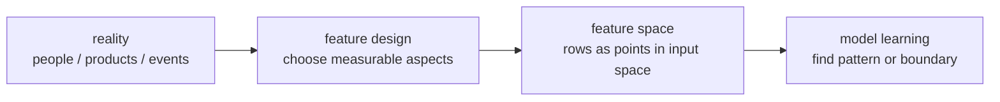
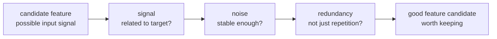
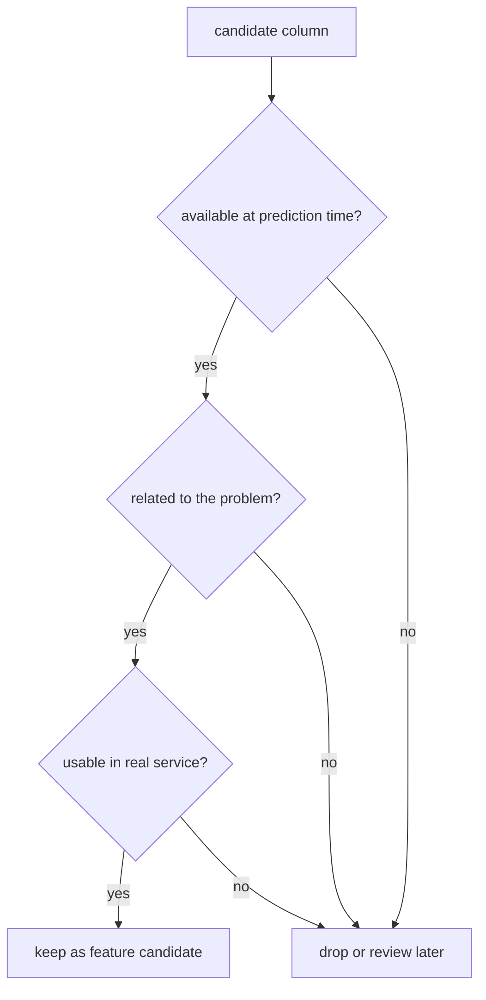
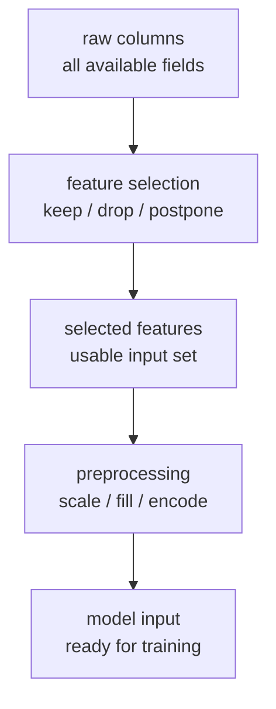

# P3-7.1 특징 선택(feature selection)

P3-6에서는 `무엇을 기준으로 평가할 것인가`를 봤습니다. 이제 질문을 한 단계 앞으로 옮깁니다. 평가 지표를 바꾸기 전에, 애초에 모델에게 어떤 입력을 줄지부터 점검해야 합니다. 특징 선택(feature selection)은 이 입력 설계의 시작점입니다.

이 절은 초심자 기준에서 `좋은 특징을 어떻게 고를 것인가`를 다룹니다. 복잡한 선택 알고리즘을 깊게 설명하기보다, 실제 업무에서 먼저 확인해야 하는 판단 기준을 잡는 데 목적이 있습니다.

## 이 절의 범위

이 절은 다음 질문에 답합니다.

- 특징(feature)은 무엇이며, 왜 입력 설계가 중요한가?
- 사용할 수 있는 데이터가 많다고 해서 모두 넣으면 안 되는 이유는 무엇인가?
- 초심자가 먼저 확인해야 할 특징 선택 기준은 무엇인가?
- 특징 선택과 전처리(preprocessing)는 어떻게 다른가?

이 절은 다음 내용은 깊게 다루지 않습니다.

- 통계 검정 기반 특징 선택 알고리즘의 수식
- 재귀적 특징 제거(recursive feature elimination)의 세부 절차
- 차원 축소(dimensionality reduction) 알고리즘의 내부 계산

그 내용은 뒤 장의 모델 선택, 튜닝, 알고리즘 절을 읽을 때 다시 연결해서 볼 수 있습니다.

## 이 절의 목표

- 특징(feature)을 `현실의 정보가 모델 입력으로 바뀐 형태`로 설명할 수 있습니다.
- 특징 선택이 성능 숫자만의 문제가 아니라, 누수(leakage), 비용, 안정성, 해석 가능성과 연결된다는 점을 말할 수 있습니다.
- 초심자 기준에서 먼저 버릴 특징과 먼저 남길 특징을 구분하는 기본 질문을 사용할 수 있습니다.
- 전처리(preprocessing)가 `선택된 특징을 다듬는 일`이라면, 특징 선택은 `어떤 특징을 애초에 채택할지 정하는 일`이라는 차이를 설명할 수 있습니다.

## 특징은 무엇인가

머신러닝에서 특징(feature)은 현실의 대상을 모델이 읽을 수 있는 입력 칸으로 바꾼 것입니다.

예를 들어 고객 이탈(churn) 예측 문제를 생각해 보면 다음처럼 볼 수 있습니다.

| 현실의 정보 | 특징으로 바꾼 예 |
| --- | --- |
| 최근 한 달 방문 횟수 | `visits_30d` |
| 최근 한 달 결제 금액 | `spend_30d` |
| 최근 일주일 문의 수 | `support_tickets_7d` |
| 회원 등급 | `membership_tier` |

즉, 특징은 원래 세상에 있던 사실을 그대로 복사한 것이 아니라, `문제를 풀기 좋게 잘라서 만든 입력 표현`입니다.

그래서 같은 데이터라도 어떤 칸을 특징으로 삼느냐에 따라 전혀 다른 모델이 됩니다.

조금 더 이론적으로 말하면, 특징은 `입력 변수(input variable)`의 단위입니다. 모델은 보통 하나의 큰 정답을 바로 이해하지 못합니다. 대신 여러 입력 변수를 함께 보고, 그 조합에서 반복되는 패턴을 찾습니다. 이때 각각의 입력 변수가 특징입니다.

예를 들어 집값 예측 문제에서는 `면적`, `방 수`, `역과의 거리`가 특징이 될 수 있습니다. 스팸 분류 문제에서는 `특정 단어의 출현`, `첨부파일 유무`, `발신 도메인 패턴`이 특징이 될 수 있습니다. 즉, 특징은 문제에 따라 바뀌며, 같은 현실도 어떤 질문을 하느냐에 따라 다른 특징 집합으로 표현됩니다.

## 학술적 문맥에서의 의미 정리

입문서에서는 `변수(variable)`와 `특징(feature)`를 거의 같은 말처럼 쓰는 경우가 많습니다. 하지만 학술 문맥에서는 둘을 약간 구분하기도 합니다.

Guyon과 Elisseeff의 고전적인 정리 논문은 `raw input variables`와 `constructed features`를 구분합니다. 이 차이를 초심자 수준에서 옮기면 다음과 같습니다.

| 표현 | 초심자용 이해 |
| --- | --- |
| 변수(variable) | 원래 주어진 입력 칼럼 또는 측정값 |
| 특징(feature) | 그 변수를 그대로 쓰거나, 가공해서 모델 입력으로 만든 표현 |

예를 들어 다음처럼 볼 수 있습니다.

| 원래 값 | 학술적으로 보면 | 모델 입력에서의 역할 |
| --- | --- | --- |
| `year_of_birth`, `current_year` | raw variable | 아직 계산 전 |
| `age = current_year - year_of_birth` | constructed feature | 모델이 바로 읽는 특징 |

즉, 특징은 단순 칼럼 이름이 아니라, `학습에 투입되는 입력 표현` 전체를 가리키는 말로 이해하는 편이 더 정확합니다. 그래서 특징 선택(feature selection)은 때로 `원래 변수 중 무엇을 남길 것인가`와 `가공된 특징 중 무엇을 채택할 것인가`를 모두 포함하는 넓은 말로 쓰입니다.

학술적으로 특징 선택의 목적도 조금 더 분명하게 정리됩니다. Guyon과 Elisseeff는 그 목적을 다음처럼 설명합니다.

1. 예측 성능(prediction performance)을 높이기
2. 더 빠르고 비용이 적은 예측기(predictor)를 만들기
3. 데이터를 만든 과정에 대한 이해(understanding)를 돕기

이 세 목적은 실무에서도 그대로 이어집니다.

| 학술적 목적 | 실무에서 보이는 형태 |
| --- | --- |
| 예측 성능 개선 | 잡음을 줄여 성능을 안정화한다 |
| 계산 비용 절감 | 학습 시간과 추론 시간을 줄인다 |
| 이해 가능성 향상 | 어떤 정보가 판단에 쓰였는지 설명하기 쉬워진다 |

또 하나 중요한 것은 `관련성(relevance)`과 `유용성(usefulness)`이 항상 같은 말이 아니라는 점입니다.

| 표현 | 뜻 |
| --- | --- |
| 관련성(relevance) | 그 특징이 정답과 어떤 연결을 가지고 있는가 |
| 유용성(usefulness) | 그 특징이 현재 모델과 현재 특징 집합 안에서 실제로 도움이 되는가 |

예를 들어 두 칼럼이 거의 같은 정보를 담고 있다면, 둘 다 관련성은 있을 수 있습니다. 하지만 예측기를 만들 때는 둘 중 하나만 있어도 충분할 수 있습니다. 이때 나머지는 `관련은 있지만 추가로는 덜 유용한` 특징이 될 수 있습니다.

이 구분은 특징 선택이 `가장 관련 있는 칼럼을 전부 남기는 작업`이 아니라, `중복이 적고 함께 쓸 때 유용한 부분집합(subset)을 찾는 문제`라는 점을 보여 줍니다.

## 왜 특징 선택이 먼저 중요한가

특징 선택은 단순히 칸 수를 줄이는 작업이 아닙니다. `어떤 정보를 모델 판단에 참여시킬 것인가`를 정하는 일입니다.

scikit-learn 문서는 특징 선택 모듈이 불필요하거나 잡음이 큰 특징을 줄여 성능과 계산 효율을 개선하는 데 쓰일 수 있다고 설명합니다. 특히 차원이 큰 데이터에서는 이 판단이 더 중요해집니다.

초심자 기준에서는 다음 네 가지 이유를 먼저 붙잡으면 됩니다.

1. 관련 없는 입력이 많으면 모델이 잡음을 배울 수 있습니다.
2. 너무 많은 입력은 학습과 추론 비용을 키울 수 있습니다.
3. 설명하기 어려운 입력이 많을수록 결과 해석이 어려워질 수 있습니다.
4. 미래 예측 시점에 사용할 수 없는 입력을 넣으면 데이터 누수(leakage)가 생길 수 있습니다.

즉, 특징 선택은 `좋은 신호는 남기고, 위험한 신호와 불필요한 신호는 줄이는 일`입니다.

이론적으로 다시 말하면, 특징 선택은 다음 네 가지를 동시에 조정하는 과정으로 볼 수 있습니다.

| 관점 | 특징 선택이 바꾸는 것 |
| --- | --- |
| 표현 관점 | 모델이 바라보는 입력 공간의 모양 |
| 학습 관점 | 모델이 배워야 할 패턴의 난이도 |
| 통계 관점 | 신호와 잡음의 비율 |
| 운영 관점 | 실제 서비스에서 입력을 재현할 수 있는가 |

이 표를 기준으로 보면, 특징 선택은 단순한 데이터 정리 작업이 아니라 `학습 문제를 다시 정의하는 일`에 가깝습니다.

## 특징 공간(feature space)과 표현(representation)

특징을 하나씩 보는 것도 중요하지만, 머신러닝은 보통 특징 하나만으로 판단하지 않습니다. 여러 특징이 함께 만들어 내는 입력 공간을 봅니다. 이를 초심자 수준에서는 `특징 공간(feature space)`이라고 이해하면 충분합니다.

예를 들어 두 개의 특징만 있다고 해 보겠습니다.

- `visits_30d`
- `support_tickets_30d`

이 경우 한 고객은 `(방문 횟수, 문의 횟수)`라는 한 점으로 표현될 수 있습니다. 고객이 수천 명이면, 그 점들이 모여 하나의 공간을 만듭니다. 모델은 그 공간 안에서 `이탈하는 점들의 경향`, `비슷한 점들끼리의 묶임`, `경계의 모양`을 배우게 됩니다.

즉, 특징 선택은 단순히 칼럼 개수를 줄이는 작업이 아니라, `모델이 보게 될 입력 공간 자체를 설계하는 일`이기도 합니다.



이 도식의 핵심은, 특징이 많고 적음보다 먼저 `어떤 관점으로 현실을 잘라 입력 공간을 만들었는가`가 중요하다는 점입니다.

같은 사실도 어떤 표현으로 바꾸느냐에 따라 모델이 배우기 쉬워질 수도, 어려워질 수도 있습니다.

예를 들어 고객 활동을 표현한다고 해 보겠습니다.

| 같은 현실 | 표현 1 | 표현 2 |
| --- | --- | --- |
| 최근 활동 | 최근 30일 총 방문 수 | 최근 7일, 30일, 90일 방문 수 |
| 구매 규모 | 최근 1회 구매 금액 | 최근 30일 평균 구매 금액 |
| 문의 행동 | 총 문의 수 | 환불 문의 수, 배송 문의 수 |

이 표가 보여 주는 핵심은, 특징 선택이 단지 `원본 칼럼을 고르기`만이 아니라 `어떤 표현 단위로 입력을 만들 것인가`와도 이어진다는 점입니다.

따라서 특징 선택은 다음 두 질문을 함께 품습니다.

1. 어떤 정보를 남길 것인가?
2. 그 정보를 어떤 형태의 입력 표현으로 만들 것인가?

두 번째 질문은 전처리와도 이어지지만, 출발점은 여전히 특징 설계입니다.

## 좋은 특징은 무엇을 가져야 하는가

초심자는 종종 `좋은 특징 = 숫자로 된 특징`이라고 오해합니다. 하지만 중요한 것은 자료형이 아니라, 그 특징이 문제와 어떤 관계를 맺는가입니다.

이론적으로는 다음 세 가지 관점이 중요합니다.

### 1. 신호(signal)가 있는가

그 특징이 정답(label)과 어느 정도 관련된 패턴을 담고 있어야 합니다.

예를 들어 고객 이탈 문제에서 최근 방문 횟수는 이탈과 관련 있을 가능성이 있습니다. 반면 완전히 임의로 붙인 내부 일련번호는 보통 문제의 원인이나 경향을 설명하지 못합니다.

즉, 좋은 특징은 `정답을 예측하는 데 도움이 되는 신호`를 어느 정도 담고 있어야 합니다.

### 2. 잡음(noise)이 너무 크지 않은가

값이 있어 보인다고 해서 항상 좋은 특징은 아닙니다.

- 측정 자체가 부정확한가?
- 사람이 임의로 입력해서 흔들림이 큰가?
- 상황마다 의미가 자주 바뀌는가?

이런 특징은 신호보다 잡음이 더 커질 수 있습니다. 그러면 모델은 안정적인 규칙보다 우연한 흔들림을 배우기 쉬워집니다.

### 3. 중복(redundancy)이 과도하지 않은가

비슷한 뜻의 특징을 너무 많이 넣으면, 정보가 풍부해지기보다 설명이 반복될 수 있습니다.

예를 들어 다음 칼럼이 동시에 있다면 어느 정도 중복을 의심할 수 있습니다.

- `monthly_spend`
- `quarterly_spend`
- `yearly_spend`

물론 모두가 항상 불필요한 것은 아닙니다. 다만 초심자는 `비슷한 뜻을 다른 단위로 반복하고 있지 않은가`를 먼저 확인하는 편이 좋습니다.

즉, 좋은 특징은 대체로 다음 조건을 향합니다.

`문제와 관련된 신호는 담고, 잡음은 과도하지 않으며, 다른 특징과의 중복은 관리 가능한 수준이어야 한다.`

이 세 조건을 한 번에 묶어 보면 다음처럼 정리할 수 있습니다.



이 도식은 `좋은 특징`을 하나의 신비한 속성처럼 보지 말고, 관련성, 안정성, 중복 관리라는 세 질문으로 나누어 읽으라는 뜻입니다.

## 사용할 수 있다고 다 넣으면 안 되는 이유

실무에서는 데이터베이스에 칼럼이 많을수록 오히려 위험할 때가 많습니다.

예를 들어 대출 심사 모델에 다음과 같은 칼럼이 있다고 가정해 보겠습니다.

| 칼럼 | 바로 넣으면 생길 수 있는 문제 |
| --- | --- |
| `customer_id` | 사람을 구분하는 번호일 뿐, 일반화된 패턴을 설명하지 못할 수 있습니다. |
| `loan_approved_at` | 이미 심사 결과가 난 뒤에 생긴 값이라 예측 시점에는 쓸 수 없습니다. |
| `default_next_90d` | 정답(label) 자체이므로 입력에 넣으면 누수입니다. |
| `branch_note_text` | 실제 운영에서는 늦게 입력되거나 형식이 들쑥날쑥할 수 있습니다. |
| `monthly_income` | 문제와 관련 있는 신호일 수 있어 후보로 볼 수 있습니다. |

이 표가 보여 주는 핵심은 간단합니다.

`특징 선택은 많이 넣는 경쟁이 아니라, 예측 시점에 정당하게 쓸 수 있는 정보를 고르는 일이다.`

## 초심자가 먼저 쓰면 좋은 세 가지 질문

특징 선택을 시작할 때는 복잡한 알고리즘보다 질문 순서가 더 중요합니다.

### 1. 이 정보는 예측 시점에 정말 사용할 수 있는가

가장 먼저 확인해야 할 것은 시점입니다.

- 결과가 나온 뒤에만 생기는 값인가?
- 사람이 사후적으로 붙인 판정인가?
- 테스트 데이터 전체를 보고 나서 만든 값인가?

scikit-learn의 common pitfalls 문서는 특징 선택을 포함한 전처리 단계가 훈련 데이터(train data)만 사용해야 하며, 테스트 데이터를 끌어오면 성능이 낙관적으로 부풀려진다고 설명합니다.

초심자 기준에서는 이렇게 기억하면 됩니다.

`예측 순간에 모를 정보를 입력에 넣으면, 잘 맞는 모델이 아니라 미리 답을 훔쳐본 모델이 된다.`

### 2. 이 정보는 문제와 관련된 신호인가

두 번째 질문은 관련성입니다.

모든 칼럼이 다 같은 무게를 갖지 않습니다.

- 문제와 직접 연결되는 행동 기록인가?
- 사람이나 사물을 구분만 하는 번호인가?
- 거의 항상 같은 값이라 정보량이 적은가?
- 다른 칼럼과 거의 같은 뜻을 반복하는가?

scikit-learn 문서는 분산이 거의 없는 특징(low variance), 단변량 통계로 점수를 매길 수 있는 특징(univariate selection), 모델이 중요도를 줄 수 있는 특징(model-based selection) 등을 줄이는 접근을 제공합니다. 다만 이 절에서는 알고리즘보다 먼저, `왜 줄일 수 있는가`를 이해하는 데 집중합니다.

### 3. 이 정보는 운영에서 안정적으로 구할 수 있는가

세 번째 질문은 현장성입니다.

훈련 데이터셋 안에서는 있어 보여도, 실제 서비스에서는 매번 안정적으로 구하기 어려운 특징이 있습니다.

- 수집 지연이 자주 생기는가?
- 사람이 손으로 입력해야 해서 품질이 흔들리는가?
- 개인정보나 비용 문제 때문에 운영에서 쓰기 어려운가?
- 모델 추론마다 불러오면 지연 시간(latency)이 커지는가?

즉, 특징 선택은 데이터 과학만의 문제가 아니라 서비스 설계 문제이기도 합니다.

초심자 기준에서는 이 판단 흐름을 다음처럼 더 단순하게 써도 됩니다.



이 도식은 알고리즘이 아니라 점검 순서를 보여 줍니다. 특히 `예측 시점에 쓸 수 있는가`를 먼저 묻는 구조가 중요합니다.

## 특징 선택과 전처리는 어떻게 다른가

초심자는 이 둘을 자주 섞어 생각합니다. 하지만 질문이 다릅니다.

| 구분 | 먼저 묻는 질문 | 예시 |
| --- | --- | --- |
| 특징 선택(feature selection) | 어떤 칼럼을 채택할 것인가? | ID 제거, 사후 정보 제거, 너무 약한 특징 제외 |
| 전처리(preprocessing) | 채택한 칼럼을 어떤 형태로 바꿀 것인가? | 결측치 처리, 스케일 조정, 범주형 인코딩 |

즉, 특징 선택은 `입구를 정하는 일`이고, 전처리는 `선택한 입력을 모델이 읽기 좋게 다듬는 일`입니다.

이 차이를 간단히 그리면 다음과 같습니다.



## 실무 휴리스틱으로 먼저 버릴 후보들

복잡한 계산을 하기 전에, 다음 특징들은 먼저 점검할 가치가 큽니다.

| 먼저 점검할 특징 | 왜 주의해야 하는가 |
| --- | --- |
| ID, 주문번호, 고객번호 | 개체 식별은 되지만 일반화된 패턴과 거리가 멀 수 있습니다. |
| 결과 이후에 생긴 칼럼 | 누수(leakage)를 만들 수 있습니다. |
| 거의 항상 같은 칼럼 | 정보량이 너무 적을 수 있습니다. |
| 중복 의미 칼럼 | 설명은 늘고 실익은 적을 수 있습니다. |
| 실제 운영에서 수집이 불안정한 칼럼 | 서비스 단계에서 재현이 어려울 수 있습니다. |

이 목록은 수학 공식이 아니라, 초심자가 데이터를 처음 펼쳤을 때 바로 써먹을 수 있는 점검표입니다.

## 작은 예시로 특징 후보를 골라 보기

다음은 고객 이탈 예측 문제를 가정한 아주 작은 예시입니다.

| 칼럼 | 포함 판단 | 이유 |
| --- | --- | --- |
| `customer_id` | 제외 | 식별자 |
| `visits_30d` | 포함 | 최근 활동 신호 |
| `support_tickets_30d` | 포함 | 불만 또는 이탈 징후 신호 |
| `contract_cancelled_at` | 제외 | 이미 결과가 일어난 뒤 값 |
| `promo_code_used_30d` | 보류 | 상황에 따라 의미가 달라 추가 검토 필요 |
| `churn_next_month` | 제외 | 정답(label) |

이 예시에서 중요한 것은 `포함` 자체보다 `왜 포함하거나 제외했는가`를 설명할 수 있는가입니다.

## Python 예제로 특징 후보를 1차 점검해 보기

아래 예제는 실무에서 흔히 하는 아주 단순한 1차 점검을 흉내 낸 것입니다. 식별자, 정답 칼럼, 결과 이후에 생긴 칼럼, 상수 칼럼을 먼저 골라냅니다.

```python
rows = [
    {
        "customer_id": "C001",
        "visits_30d": 12,
        "support_tickets_30d": 0,
        "contract_cancelled_at": "",
        "membership_tier": "gold",
        "country": "KR",
        "churn_next_month": 0,
    },
    {
        "customer_id": "C002",
        "visits_30d": 3,
        "support_tickets_30d": 2,
        "contract_cancelled_at": "2026-05-14",
        "membership_tier": "gold",
        "country": "KR",
        "churn_next_month": 1,
    },
    {
        "customer_id": "C003",
        "visits_30d": 7,
        "support_tickets_30d": 1,
        "contract_cancelled_at": "",
        "membership_tier": "gold",
        "country": "KR",
        "churn_next_month": 0,
    },
]

target = "churn_next_month"
columns = list(rows[0].keys())

selected = []
rejected = []

for column in columns:
    values = [row[column] for row in rows]
    unique_count = len(set(values))

    if column == target:
        rejected.append((column, "label"))
    elif column.endswith("_id"):
        rejected.append((column, "identifier"))
    elif column.endswith("_at"):
        rejected.append((column, "post-outcome timestamp"))
    elif unique_count == 1:
        rejected.append((column, "constant value"))
    else:
        selected.append((column, "keep as candidate"))

print("selected candidates:")
for name, reason in selected:
    print("-", name, "->", reason)

print()
print("rejected candidates:")
for name, reason in rejected:
    print("-", name, "->", reason)
```

실행 결과는 다음과 같습니다.

```text
selected candidates:
- visits_30d -> keep as candidate
- support_tickets_30d -> keep as candidate

rejected candidates:
- customer_id -> identifier
- contract_cancelled_at -> post-outcome timestamp
- membership_tier -> constant value
- country -> constant value
- churn_next_month -> label
```

이 출력은 `좋은 특징을 완전히 결정했다`는 뜻이 아닙니다. 다만 초심자가 데이터 테이블을 처음 펼쳤을 때, 무엇부터 의심해야 하는지 보여 줍니다.

## scikit-learn에서 흔히 보는 특징 선택 방식은 무엇인가

실무에서는 다음 같은 방식이 자주 나옵니다.

| 방식 | 아주 짧은 설명 | 이 절에서의 위치 |
| --- | --- | --- |
| low variance 제거 | 거의 변하지 않는 칼럼을 줄인다 | 직관 소개만 |
| univariate selection | 칼럼별로 점수를 매겨 일부를 고른다 | 직관 소개만 |
| model-based selection | 모델이 준 중요도를 바탕으로 줄인다 | 직관 소개만 |
| recursive feature elimination | 중요도가 낮은 칼럼을 반복적으로 줄인다 | 이름만 소개 |

이 절의 목표는 이 알고리즘들을 외우는 것이 아닙니다. 먼저 `선택의 이유를 설명할 수 있는가`를 잡는 것입니다. 알고리즘은 그 다음 단계에서 도와주는 도구입니다.

## 이 절에서 기억할 관점

- 특징(feature)은 현실 정보를 모델 입력으로 바꾼 표현이다.
- 특징 선택은 `많이 넣기`보다 `정당하게 쓸 수 있는 입력을 고르기`에 가깝다.
- 가장 먼저 확인할 것은 누수(leakage), 관련성, 운영 가능성이다.
- 특징 선택은 입력을 고르는 일이고, 전처리는 고른 입력을 다듬는 일이다.

## 체크리스트

- 예측 시점에 알 수 없는 칼럼을 빼고 있는가?
- 정답(label)이나 정답 이후 정보가 섞이지 않았는가?
- 식별자와 상수 칼럼을 먼저 점검했는가?
- 실제 서비스에서 안정적으로 구할 수 있는 특징만 남기고 있는가?
- 특징 선택과 전처리를 같은 일로 섞어 생각하지 않는가?

## 다음 절과의 연결

이 절에서 `무엇을 남길 것인가`를 정했다면, 다음 절 P3-7.2 전처리(preprocessing)에서는 `남긴 특징을 어떤 형태로 바꿀 것인가`를 보게 됩니다. 결측치, 스케일(scale), 범주형 인코딩(encoding)은 바로 그 다음 단계의 문제입니다.

## 출처와 참고 자료

- scikit-learn, `1.13. Feature selection`, scikit-learn User Guide, 확인 날짜: 2026-06-26. [https://scikit-learn.org/stable/modules/feature_selection.html](https://scikit-learn.org/stable/modules/feature_selection.html){: target="_blank" rel="noopener noreferrer" }
- scikit-learn, `12.2. Data leakage during pre-processing`, scikit-learn User Guide, 확인 날짜: 2026-06-26. [https://scikit-learn.org/stable/common_pitfalls.html](https://scikit-learn.org/stable/common_pitfalls.html){: target="_blank" rel="noopener noreferrer" }
