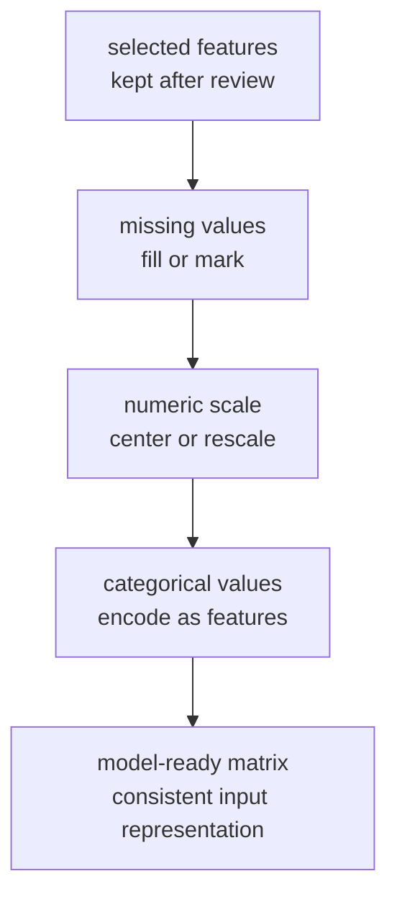
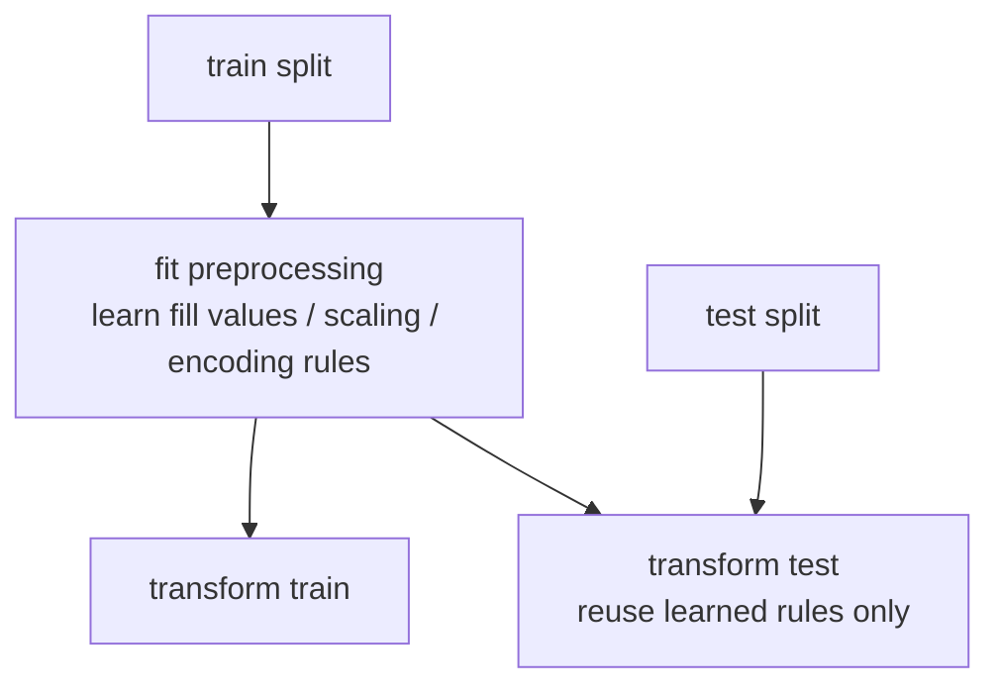

# P3-7.2 전처리(preprocessing)

P3-7.1에서는 `어떤 입력을 남길 것인가`를 봤습니다. 이제 남긴 입력을 그대로 모델에 던지지 않고, 모델이 읽기 좋은 형태로 정리하는 단계로 넘어갑니다. 이 단계가 전처리(preprocessing)입니다.

이 절의 핵심은 복잡한 라이브러리 문법이 아닙니다. 전처리를 `데이터 청소` 정도로만 이해하지 않고, `입력 표현을 모델이 다룰 수 있는 형태로 바꾸는 일`로 이해하는 데 있습니다.

또 한 가지 중요한 이유가 있습니다. 초심자는 종종 알고리즘을 먼저 배우고, 전처리는 나중에 붙는 보조 작업이라고 생각합니다. 하지만 실제로는 반대에 가깝습니다. 입력 표현이 정리되지 않으면, 뒤에서 배우는 선형회귀(linear regression), 로지스틱 회귀(logistic regression), k-NN, SVM 같은 알고리즘의 성격도 제대로 읽기 어렵습니다.

즉, 이 절은 특정 알고리즘의 부록이 아니라, `알고리즘이 무엇을 입력으로 받는가`를 정리하는 공통 기초 절입니다.

## 이 절의 범위

이 절은 다음 질문에 답합니다.

- 전처리(preprocessing)는 무엇을 바꾸는 단계인가?
- 왜 결측치, 스케일, 범주형 값이 그대로는 문제가 될 수 있는가?
- 어떤 모델은 스케일(scale)에 민감하고, 어떤 모델은 덜 민감한가?
- 훈련 데이터(train data)와 테스트 데이터(test data)에서 전처리를 어떻게 나눠야 하는가?

이 절은 다음 내용은 깊게 다루지 않습니다.

- 개별 인코더와 스케일러의 모든 하이퍼파라미터
- 희소 행렬(sparse matrix) 최적화 세부 구현
- 고급 비선형 변환과 차원 축소의 수학

그 내용은 뒤 장의 모델 선택, 알고리즘, 튜닝 절과 연결해서 다시 볼 수 있습니다.

## 이 절의 목표

- 전처리를 `원시 입력을 더 적합한 표현으로 바꾸는 단계`로 설명할 수 있습니다.
- 결측치 보정, 스케일 조정, 범주형 인코딩이 왜 필요한지 말할 수 있습니다.
- 전처리의 `fit`과 `transform`을 구분하고, 테스트 데이터에 `fit`하면 안 되는 이유를 설명할 수 있습니다.
- 파이프라인(pipeline)과 컬럼 변환기(ColumnTransformer)가 왜 실무에서 자주 쓰이는지 입문 수준에서 이해할 수 있습니다.

## 이 절이 커리큘럼에서 필요한 이유

Part 3의 앞 절들은 다음 흐름으로 이어졌습니다.

- P3-4: 데이터를 어떻게 나눌 것인가
- P3-5: 일반화(generalization)가 왜 어려운가
- P3-6: 무엇을 기준으로 평가할 것인가
- P3-7.1: 어떤 입력을 남길 것인가

여기까지 오면 자연스럽게 다음 질문이 생깁니다.

`남긴 입력을 어떤 형태로 모델에 전달할 것인가?`

이 질문이 바로 전처리 절의 자리입니다. 따라서 이 절은 커리큘럼상 다음 역할을 맡습니다.

| 커리큘럼 위치 | 전처리 절의 역할 |
| --- | --- |
| 특징 선택 뒤 | 남긴 입력을 어떤 표현으로 바꿀지 정리 |
| 모델 선택 전 | 어떤 모델이 어떤 입력 표현을 더 선호하는지 이해할 준비 |
| 알고리즘 입문 전 | 거리, 경계, 최적화가 왜 입력 표현에 민감한지 연결 |

즉, 전처리는 `입력 설계`와 `모델 이해` 사이를 이어 주는 절입니다.

## 전처리는 무엇을 하는가

scikit-learn 전처리 문서는 `raw feature vectors`를 다운스트림 추정기(downstream estimator)에 더 적합한 표현으로 바꾸는 여러 함수와 변환기(transformer)를 제공한다고 설명합니다. 이 문장을 초심자 수준으로 옮기면 다음과 같습니다.

`전처리는 원시 입력을 모델이 더 잘 다룰 수 있는 입력 표현으로 바꾸는 단계다.`

즉, 전처리는 정답(label)을 바꾸는 작업이 아니라 입력 표현을 바꾸는 작업입니다.

예를 들어 다음과 같은 문제가 있을 수 있습니다.

| 원래 입력 상태 | 모델이 곤란해지는 이유 | 전처리의 역할 |
| --- | --- | --- |
| 값이 비어 있다 | 계산을 바로 할 수 없다 | 결측치 보정 |
| 숫자 크기 차이가 너무 크다 | 어떤 특징이 과도하게 영향력을 가질 수 있다 | 스케일 조정 |
| 도시 이름처럼 문자열이다 | 많은 모델이 바로 계산할 수 없다 | 범주형 인코딩 |
| 훈련과 테스트에 다른 규칙을 쓴다 | 평가가 왜곡된다 | 같은 변환 규칙 유지 |

따라서 전처리는 `정리`이면서 동시에 `표현 설계`입니다.

이론적으로는 전처리를 다음 두 관점으로 동시에 볼 수 있습니다.

1. 표현 변환(representation transformation)  
   같은 사실을 다른 수치 표현으로 옮기는 일
2. 가정 맞춤(assumption matching)  
   모델이나 학습 절차가 기대하는 입력 조건에 더 가깝게 맞추는 일

예를 들어 표준화(standardization)는 단순히 숫자를 줄 세우는 작업이 아니라, 어떤 알고리즘이 더 잘 작동하도록 입력의 중심과 분산을 맞추는 시도입니다. 원-핫 인코딩(one-hot encoding)도 문자열을 숫자로 억지 변환하는 것이 아니라, 계산 가능한 특징 표현으로 바꾸는 작업입니다.

즉, 학술적으로 전처리는 `모델 앞에 놓인 입력 표현을 변환해, 학습과 추론이 가능한 공간으로 옮기는 단계`라고 이해할 수 있습니다.

## 특징 선택과 전처리는 어떻게 이어지는가

P3-7.1에서 특징 선택이 `무엇을 남길 것인가`를 정하는 일이었다면, 전처리는 `남긴 것을 어떻게 표현할 것인가`를 정하는 일입니다.



이 도식은 실제 구현 순서 하나를 강제하는 것은 아닙니다. 핵심은 `선택` 이후에도 입력 표현을 더 다뤄야 한다는 점입니다.

## 학술적 문맥에서의 전처리 의미

학술 문맥에서 전처리는 보통 변환(transformation) 계열 작업으로 설명됩니다. 즉, 같은 대상을 다른 좌표계나 다른 수치 표현으로 옮기는 일에 가깝습니다.

이 절에서는 전처리를 크게 세 가지로 봅니다.

1. 결측치 처리(imputation)
2. 수치 변환과 스케일링(scaling / normalization)
3. 범주형 표현 변환(encoding)

이 세 가지는 모두 `입력 표현을 바꾼다`는 공통점을 가집니다. 단, 무엇을 바꾸는지는 다릅니다.

| 전처리 종류 | 무엇을 바꾸는가 | 왜 바꾸는가 |
| --- | --- | --- |
| 결측치 처리 | 비어 있는 값을 채우는 규칙 | 계산 가능하게 만들기 위해 |
| 스케일 조정 | 숫자의 크기와 기준 | 비교와 최적화를 안정화하기 위해 |
| 인코딩 | 범주형 값을 수치 표현으로 바꾸기 | 모델 입력 형태를 맞추기 위해 |

즉, 전처리는 하나의 기술이 아니라 `입력 표현을 조정하는 여러 변환의 묶음`으로 보는 편이 정확합니다.

조금 더 이론적으로 붙이면, 전처리는 종종 다음 질문들과 연결됩니다.

- 이 값은 계산 가능한가?
- 이 값의 크기 차이가 학습을 왜곡하는가?
- 이 표현은 거리(distance), 경계(boundary), 최적화(optimization)에 어떤 영향을 주는가?
- 훈련 때 배운 변환 규칙을 추론 시점에도 그대로 재현할 수 있는가?

이 질문들이 중요한 이유는, 뒤에서 만날 알고리즘들이 입력 표현에 서로 다른 방식으로 민감하기 때문입니다.

## 결측치(missing value)는 왜 먼저 다뤄야 하는가

현실 데이터는 자주 비어 있습니다.

- 사용자가 답하지 않은 값
- 센서가 읽지 못한 값
- 나중에만 기록되는 값
- 수집 실패로 빠진 값

이 값들을 그대로 두면 많은 모델과 연산이 바로 진행되지 않습니다. 그래서 전처리 첫 단계에서 `빈 값을 어떻게 다룰지`를 정하게 됩니다.

scikit-learn의 `SimpleImputer` 문서는 평균(mean), 최빈값(most frequent), 상수(constant) 같은 전략으로 결측치를 채우는 예를 제공합니다.

초심자 기준에서는 다음처럼 이해하면 충분합니다.

| 상황 | 자주 쓰는 입문 전략 |
| --- | --- |
| 숫자형 칼럼 | 평균, 중앙값(median) |
| 범주형 칼럼 | 최빈값, `"unknown"` 같은 상수 |
| 결측 자체가 의미 있을 수 있음 | 결측 여부를 별도 신호로 남기기 |

여기서 중요한 것은 `무조건 채운다`가 아닙니다. `왜 그 규칙으로 채우는가`입니다.

예를 들어 소득(income) 칼럼은 극단값이 많을 수 있어 평균보다 중앙값이 더 나을 수 있습니다. 반대로 시험 점수처럼 분포가 비교적 고르면 평균이 더 직관적일 수도 있습니다.

업무 장면으로 바꾸면 더 쉽게 읽을 수 있습니다.

| 장면 | 결측치가 의미하는 것 | 입문적 판단 예 |
| --- | --- | --- |
| 병원 예약 데이터 | 예약 경로가 기록되지 않음 | `"unknown"` 같은 별도 범주로 남길 수 있음 |
| 쇼핑몰 고객 데이터 | 소득 정보 미입력 | 중앙값 보정 또는 별도 결측 신호 추가 검토 |
| 센서 데이터 | 측정 실패 | 단순 보정보다 수집 장애 신호로 볼 수 있음 |

즉, 결측치는 단순한 빈칸이 아니라 `왜 비었는가`를 함께 읽어야 하는 입력 상태입니다.

## 스케일(scale)은 왜 문제를 만들 수 있는가

모든 숫자형 특징이 같은 단위로 움직이지는 않습니다.

예를 들어 다음 두 칼럼을 생각해 볼 수 있습니다.

- 나이(age): 20, 35, 41
- 월소득(monthly_income): 2,000,000 / 4,500,000 / 8,000,000

둘 다 숫자지만 크기 범위가 크게 다릅니다. 어떤 알고리즘은 이런 차이를 그대로 받으면 큰 숫자 축을 더 중요하게 여기기 쉽습니다.

scikit-learn 전처리 문서는 선형 모델(linear models) 같은 여러 학습 알고리즘이 표준화(standardization)의 이점을 보며, 특징 분산이 크게 다르면 목적 함수(objective function)에서 특정 특징이 과도하게 지배할 수 있다고 설명합니다.

초심자 기준에서는 이렇게 기억하면 됩니다.

`스케일 조정은 숫자를 예쁘게 맞추는 일이 아니라, 특징들 사이의 영향력 균형을 다시 맞추는 일이다.`

이 설명은 뒤 이론과도 직접 연결됩니다.

- k-NN에서는 거리 계산이 달라집니다.
- SVM에서는 경계가 달라질 수 있습니다.
- 선형 모델과 로지스틱 회귀에서는 최적화가 더 안정적일 수 있습니다.

즉, 스케일 조정은 단순 전처리 요령이 아니라, 뒤 알고리즘 절을 이해하는 준비 단계이기도 합니다.

실무 장면에서는 이렇게 읽을 수 있습니다.

| 장면 | 스케일 조정을 안 하면 생길 수 있는 일 |
| --- | --- |
| 대출 심사 | 소득 같은 큰 숫자 축이 다른 특징을 압도할 수 있음 |
| 사용자 군집화 | 거리 계산이 특정 큰 단위의 칼럼에 끌려갈 수 있음 |
| 이상 탐지 | 작은 변화가 중요한 칼럼이 묻힐 수 있음 |

### 어떤 모델이 스케일에 더 민감한가

모든 모델이 같은 정도로 스케일에 민감한 것은 아닙니다.

| 모델 계열 | 스케일 영향 |
| --- | --- |
| k-NN, SVM, 거리 기반 방법 | 대체로 민감함 |
| 선형 모델, 로지스틱 회귀, 경사하강법 기반 방법 | 자주 민감함 |
| 결정트리, 랜덤포레스트 같은 트리 계열 | 상대적으로 덜 민감함 |

이 차이는 뒤 장에서 더 분명해집니다.

- P3-10 선형회귀(linear regression)
- P3-11 로지스틱 회귀(logistic regression)
- P3-12 k-NN
- P3-13 SVM
- P3-14, P3-15 트리와 앙상블

즉, 전처리는 모든 모델에서 똑같이 중요하게 작동하는 것이 아니라, 모델 종류에 따라 더 중요해지기도 합니다.

## 범주형(categorical) 값은 왜 그대로 넣기 어려운가

도시 이름, 회원 등급, 상품 카테고리처럼 범주형 값은 현실에서는 자연스럽지만, 많은 모델은 문자열 자체를 직접 계산하지 못합니다.

그래서 범주형 값은 보통 인코딩(encoding)을 거쳐 수치 표현으로 바꿉니다.

가장 입문적으로는 다음처럼 이해하면 됩니다.

| 원래 값 | 인코딩 후 예시 |
| --- | --- |
| `city = Seoul` | `[1, 0, 0]` |
| `city = Busan` | `[0, 1, 0]` |
| `city = Incheon` | `[0, 0, 1]` |

이런 방식은 보통 원-핫 인코딩(one-hot encoding)이라고 부릅니다.

중요한 점은 `문자열을 숫자로 번역했다`가 아니라, `모델이 계산 가능한 형태로 표현을 바꿨다`는 점입니다.

업무 장면으로 보면 다음과 같습니다.

| 원래 값 | 그대로 두기 어려운 이유 | 바꾼 뒤 얻는 것 |
| --- | --- | --- |
| 회원 등급 `gold/silver/bronze` | 문자열 그대로는 많은 모델이 계산하지 못함 | 등급별 특징 칼럼으로 바뀜 |
| 배송 지역 `Seoul/Busan/Incheon` | 지역 이름 자체로는 수치 연산이 어렵다 | 지역별 패턴을 따로 읽을 수 있음 |
| 기기 종류 `ios/android/web` | 범주 차이는 있지만 크기 비교 개념이 없음 | 범주 구분 신호를 계산 가능한 벡터로 표현 |

## 훈련 데이터와 테스트 데이터에서 왜 같은 규칙을 써야 하는가

전처리에서 가장 자주 생기는 실수 중 하나는 훈련 데이터와 테스트 데이터를 섞는 것입니다.

scikit-learn의 common pitfalls 문서는 다음을 강하게 권고합니다.

- 데이터를 먼저 훈련/테스트로 나눈다.
- `fit`과 `fit_transform`은 훈련 데이터에서만 한다.
- 테스트 데이터에는 같은 규칙으로 `transform`만 한다.
- 파이프라인(pipeline)을 쓰면 이 경계를 지키기 쉽다.

초심자 기준에서는 다음 한 문장이 핵심입니다.

`테스트 데이터는 평가를 위한 데이터이지, 전처리 규칙을 배우는 데 쓰는 데이터가 아니다.`

이를 단순화하면 다음과 같습니다.



이 도식의 핵심은 `fit`이 한 번만 훈련 데이터에서 일어난다는 점입니다.

이 차이는 실제로 성능 착시를 만들 수 있습니다.

| 잘못된 흐름 | 왜 문제인가 |
| --- | --- |
| 전체 데이터를 보고 평균을 계산한 뒤 train/test를 나눔 | 테스트 정보가 훈련 규칙에 섞인다 |
| 전체 데이터를 보고 인코딩 범주를 정리한 뒤 평가함 | 실제 배포 전 상황보다 낙관적일 수 있다 |
| 테스트 데이터까지 같이 스케일링 기준을 맞춤 | 평가가 더 좋아 보일 수 있다 |

즉, 전처리의 누수(leakage)는 모델 구조를 안 바꿔도 평가 숫자를 왜곡할 수 있습니다.

## 파이프라인(pipeline)과 컬럼 변환기(ColumnTransformer)는 왜 자주 나오는가

실무에서는 숫자형과 범주형 칼럼을 다르게 처리해야 하는 경우가 많습니다.

- 숫자형 칼럼: 결측치 보정 + 스케일 조정
- 범주형 칼럼: 결측치 보정 + 원-핫 인코딩

scikit-learn의 `Pipeline` 문서는 `fit`과 `transform` 단계를 연결해 주고, `ColumnTransformer` 문서는 서로 다른 칼럼 묶음에 서로 다른 변환을 적용하는 예를 보여 줍니다.

초심자 기준에서는 이렇게 이해하면 충분합니다.

| 도구 | 입문적 의미 |
| --- | --- |
| Pipeline | 변환 단계와 모델 학습 단계를 한 줄로 묶는다 |
| ColumnTransformer | 칼럼 종류별로 다른 전처리 규칙을 나눠 적용한다 |

즉, 전처리는 개별 기술만 아는 것으로 끝나지 않고, `같은 규칙을 반복 가능하게 적용하는 구조`까지 함께 가야 합니다.

커리큘럼 관점에서도 이 구조는 중요합니다. 뒤 절에서 모델 선택(model selection)과 튜닝(tuning)을 배울 때, 실제로는 `모델만 바꾸는 것`이 아니라 `전처리 + 모델` 묶음을 함께 비교하게 되는 경우가 많기 때문입니다.

## 작은 예시로 전처리 장면을 읽어 보기

다음 데이터를 생각해 보겠습니다.

| age | income | city | label |
| --- | --- | --- | --- |
| 29 | 3200 | Seoul | 0 |
| 41 | 6100 | Busan | 1 |
| 없음 | 5800 | Seoul | 0 |
| 35 | 없음 | Incheon | 1 |

여기서 초심자가 먼저 보게 되는 질문은 다음과 같습니다.

1. 비어 있는 값은 어떻게 할 것인가?
2. `age`와 `income`은 크기 차이가 큰데 조정이 필요한가?
3. `city`는 문자열인데 어떻게 표현할 것인가?

가능한 입문적 판단은 다음과 같습니다.

| 칼럼 | 전처리 판단 |
| --- | --- |
| `age` | 중앙값으로 결측 보정 가능 |
| `income` | 중앙값으로 결측 보정 후 스케일 조정 검토 |
| `city` | 최빈값 보정 또는 그대로 둔 뒤 원-핫 인코딩 |

이 예시는 실제 정답 하나를 강요하지는 않습니다. 중요한 것은 `칼럼별로 다른 질문을 던진다`는 점입니다.

같은 데이터를 다른 모델에 넣는다고 상상하면 판단이 더 분명해집니다.

| 모델 후보 | 전처리에서 먼저 신경 쓸 점 |
| --- | --- |
| 로지스틱 회귀 | 숫자형 스케일과 범주형 인코딩 |
| k-NN | 거리 계산 전 스케일 균형 |
| 결정트리 | 인코딩은 필요하지만 스케일은 상대적으로 덜 민감 |

따라서 전처리는 `데이터만 보고 끝나는 절`이 아니라 `모델 후보와 함께 다시 읽는 절`이기도 합니다.

## Python 예제로 결측치, 스케일, 인코딩을 순서대로 보기

아래 예제는 개념을 보여 주기 위해 순수 Python으로 단순화한 전처리 흐름입니다.

```python
rows = [
    {"age": 29, "income": 3200, "city": "Seoul"},
    {"age": 41, "income": 6100, "city": "Busan"},
    {"age": None, "income": 5800, "city": "Seoul"},
    {"age": 35, "income": None, "city": "Incheon"},
]

def median(values):
    sorted_values = sorted(values)
    n = len(sorted_values)
    mid = n // 2
    if n % 2 == 0:
        return (sorted_values[mid - 1] + sorted_values[mid]) / 2
    return sorted_values[mid]

age_fill = median([row["age"] for row in rows if row["age"] is not None])
income_fill = median([row["income"] for row in rows if row["income"] is not None])

filled_rows = []
for row in rows:
    filled_rows.append({
        "age": row["age"] if row["age"] is not None else age_fill,
        "income": row["income"] if row["income"] is not None else income_fill,
        "city": row["city"],
    })

ages = [row["age"] for row in filled_rows]
incomes = [row["income"] for row in filled_rows]

age_mean = sum(ages) / len(ages)
income_mean = sum(incomes) / len(incomes)

age_std = (sum((x - age_mean) ** 2 for x in ages) / len(ages)) ** 0.5
income_std = (sum((x - income_mean) ** 2 for x in incomes) / len(incomes)) ** 0.5

cities = sorted({row["city"] for row in filled_rows})

processed_rows = []
for row in filled_rows:
    city_vector = [1 if row["city"] == city else 0 for city in cities]
    processed_rows.append({
        "age_z": round((row["age"] - age_mean) / age_std, 2),
        "income_z": round((row["income"] - income_mean) / income_std, 2),
        "city_onehot": city_vector,
    })

print("age_fill   :", age_fill)
print("income_fill:", income_fill)
print("cities     :", cities)
print()
print("processed rows:")
for row in processed_rows:
    print(row)
```

실행 결과는 다음과 같습니다.

```text
age_fill   : 35
income_fill: 5800
cities     : ['Busan', 'Incheon', 'Seoul']

processed rows:
{'age_z': -1.43, 'income_z': -1.61, 'city_onehot': [0, 0, 1]}
{'age_z': 1.39, 'income_z': 1.03, 'city_onehot': [1, 0, 0]}
{'age_z': 0.0, 'income_z': 0.76, 'city_onehot': [0, 0, 1]}
{'age_z': 0.0, 'income_z': -0.18, 'city_onehot': [0, 1, 0]}
```

이 예제는 세 가지를 한 번에 보여 줍니다.

- 결측치는 채웠다.
- 숫자형 값은 비교 가능한 스케일로 옮겼다.
- 범주형 값은 계산 가능한 벡터로 바꿨다.

즉, 전처리는 데이터를 더 예쁘게 만드는 작업이 아니라 `계산 가능한 입력 행렬(matrix)`로 바꾸는 과정입니다.

## Python 예제로 스케일이 거리 계산을 어떻게 바꾸는지 보기

스케일 조정이 왜 중요한지는 거리(distance)를 계산해 보면 더 직관적입니다.

```python
point_a = {"age": 20, "income": 2000}
point_b = {"age": 40, "income": 2200}
point_c = {"age": 21, "income": 8000}

def distance(p, q):
    return ((p["age"] - q["age"]) ** 2 + (p["income"] - q["income"]) ** 2) ** 0.5

raw_ab = round(distance(point_a, point_b), 2)
raw_ac = round(distance(point_a, point_c), 2)

scaled_a = {"age": 0.0, "income": 0.0}
scaled_b = {"age": 1.0, "income": 0.03}
scaled_c = {"age": 0.05, "income": 1.0}

scaled_ab = round(distance(scaled_a, scaled_b), 2)
scaled_ac = round(distance(scaled_a, scaled_c), 2)

print("raw distance A-B   :", raw_ab)
print("raw distance A-C   :", raw_ac)
print("scaled distance A-B:", scaled_ab)
print("scaled distance A-C:", scaled_ac)
```

실행 결과는 다음과 같습니다.

```text
raw distance A-B   : 201.0
raw distance A-C   : 6000.0
scaled distance A-B: 1.0
scaled distance A-C: 1.0
```

이 예시는 원래 거리 계산에서 소득(income) 축이 거의 전부를 지배하다가, 스케일 조정 후에는 나이(age)와 소득이 더 비슷한 비중으로 읽힐 수 있음을 보여 줍니다.

이 때문에 k-NN, SVM, 선형 모델 같은 절에서는 전처리 설명이 다시 중요해집니다.

## scikit-learn에서 자주 보는 전처리 도구 이름

입문 단계에서는 이름을 전부 외울 필요는 없습니다. 다만 어떤 범주가 있는지는 알아 두는 편이 좋습니다.

| 범주 | 자주 보이는 이름 |
| --- | --- |
| 결측치 처리 | `SimpleImputer` |
| 표준화 | `StandardScaler` |
| 범위 스케일링 | `MinMaxScaler`, `MaxAbsScaler` |
| 이상치에 덜 민감한 스케일링 | `RobustScaler` |
| 범주형 인코딩 | `OneHotEncoder` |
| 파이프라인 | `Pipeline`, `make_pipeline` |
| 칼럼별 변환 | `ColumnTransformer` |

이 절의 목표는 API 암기가 아닙니다. 먼저 각 도구가 `어떤 표현 문제를 해결하려고 등장했는가`를 이해하는 것입니다.

## 이 절에서 기억할 관점

- 전처리는 입력을 더 적합한 표현으로 바꾸는 단계다.
- 결측치, 스케일, 범주형 표현은 서로 다른 문제이므로 같은 방식으로 다루지 않는다.
- `fit`은 훈련 데이터에서만 하고, 테스트 데이터에는 같은 규칙으로 `transform`만 해야 한다.
- 파이프라인과 컬럼 변환기는 전처리 규칙을 반복 가능하게 유지해 주는 구조다.
- 이 절은 뒤 알고리즘 절을 이해하기 위한 공통 기초다.

## 체크리스트

- 결측치가 있는 칼럼마다 왜 그 보정 전략을 택했는가?
- 숫자형 특징의 크기 차이가 모델에 문제를 만들 수 있는가?
- 범주형 값을 계산 가능한 형태로 바꾸고 있는가?
- 테스트 데이터에 `fit`을 하지 않고 있는가?
- 칼럼별로 다른 전처리 규칙을 분리해서 관리하고 있는가?

## 다음 절과의 연결

P3-8 모델 선택(model selection)과 P3-9 하이퍼파라미터(hyperparameter)로 넘어가면, 같은 모델이라도 어떤 전처리와 함께 묶느냐에 따라 성능과 해석이 달라질 수 있다는 점을 더 자주 보게 됩니다. 또한 P3-10 이후의 알고리즘 절에서는 어떤 모델이 스케일과 표현에 더 민감한지가 더 구체적으로 드러납니다.

## 출처와 참고 자료

- scikit-learn, `8.3. Preprocessing data`, scikit-learn User Guide, 확인 날짜: 2026-06-26. [https://scikit-learn.org/stable/modules/preprocessing.html](https://scikit-learn.org/stable/modules/preprocessing.html){: target="_blank" rel="noopener noreferrer" }
- scikit-learn, `8.4. Imputation of missing values`, scikit-learn User Guide, 확인 날짜: 2026-06-26. [https://scikit-learn.org/stable/modules/impute.html](https://scikit-learn.org/stable/modules/impute.html){: target="_blank" rel="noopener noreferrer" }
- scikit-learn, `8.1. Pipelines and composite estimators`, scikit-learn User Guide, 확인 날짜: 2026-06-26. [https://scikit-learn.org/stable/modules/compose.html](https://scikit-learn.org/stable/modules/compose.html){: target="_blank" rel="noopener noreferrer" }
- scikit-learn, `12. Common pitfalls and recommended practices`, scikit-learn User Guide, 확인 날짜: 2026-06-26. [https://scikit-learn.org/stable/common_pitfalls.html](https://scikit-learn.org/stable/common_pitfalls.html){: target="_blank" rel="noopener noreferrer" }
