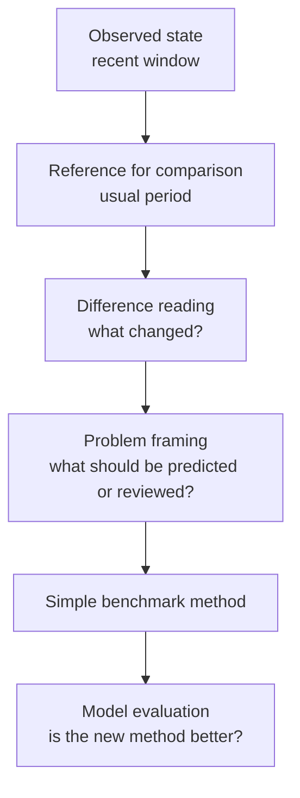

# P3-7.3 기준선 비교와 기준 모델은 왜 다른데 둘 다 필요한가

> Section ID: `P3-7.3`
> Version: `v2026.07.08`

Part 3을 읽다가 `기준선(baseline)`이라는 말을 익히기 시작하면, 곧 Part 4에서 `기준 모델(baseline model)`이라는 말을 다시 만나게 됩니다. 이름이 비슷해서 같은 뜻처럼 느껴지기 쉽지만, 둘은 서로 다른 종류의 기준입니다. 하나는 `현재 상태를 무엇과 비교할 것인가`를 정하는 참조 기준(reference comparator)에 가깝고, 다른 하나는 `새 방법이 쉬운 출발점보다 얼마나 나은가`를 판단하는 벤치마크(benchmark model)에 가깝습니다. 이 차이를 미리 정리해 두지 않으면 Part 3의 비교 구조와 Part 4의 평가 구조가 한꺼번에 섞여 버립니다.

가장 짧게 말하면, Part 3의 기준선은 `지금 상태를 무엇과 비교할 것인가`를 정하는 기준이고, Part 4의 기준 모델은 `학습한 모델이 정말 나아졌는가`를 정하는 기준입니다. 전자는 기준 시점이나 기준 집단을 두는 비교 구조이고, 후자는 새 방법이 최소한 넘어야 할 성능 출발점을 두는 평가 구조입니다.

| 구분 | 먼저 묻는 질문 | 쓰이는 자리 |
| --- | --- | --- |
| 기준선 비교 | 지금 상태는 평소와 얼마나 다른가 | 비교 리포트, 검토 후보, 해석 경계 |
| 기준 모델 | 지금 학습 결과는 쉬운 출발점보다 얼마나 나은가 | 학습, 평가, 방법 비교 |

즉 하나는 `데이터 비교 기준`이고, 다른 하나는 `모델 평가 기준`입니다. 같은 `baseline`이라는 단어를 쓰더라도, 앞은 `reference point for comparison`, 뒤는 `benchmark for model usefulness`에 더 가깝습니다.

## 왜 Part 3에서 먼저 기준선을 다루는가

Part 3에서는 아직 모델을 평가하지 않습니다. 여기서 먼저 필요한 것은 최근 구간과 평소 구간을 같은 단위로 비교해, 변화가 있는지 없는지를 읽는 일입니다. 그래서 기준선은 최근 평균, 변동성, 패턴, 구간 차이 같은 열을 만들기 위한 비교 전제로 등장합니다.

예를 들어 최근 20건의 평균 유량이 2.1이고 기준선 구간 평균이 2.45라면, 우리는 먼저 `-0.35의 차이`를 읽습니다. 이 차이는 아직 모델 성능이 아니라, 상태 비교 결과입니다. 이런 비교는 BLS 용어의 `base period`처럼 다른 시점과 비교하기 위한 참조 시점(reference period)을 둔다는 일반 원리와 더 가깝습니다.

| Part 3에서 먼저 보는 것 | 여기서 아직 하지 않는 것 |
| --- | --- |
| 최근 구간 vs 평소 구간 차이 | 학습 성능 비교 |
| 차이값, 변동성 차이, 패턴 차이 | 정확도, 재현율, 손실 비교 |
| 검토 필요 신호 | 모델 후보 간 점수 경쟁 |

이 단계를 먼저 거쳐야 `무엇을 예측 문제로 만들 수 있는가`와 `무엇은 비교 리포트로 남겨야 하는가`를 정할 수 있습니다.

기준 모델은 Part 4에서 다시 등장하지만, 여기서 길게 펼칠 대상은 아닙니다. 지금 필요한 구분은 `최근 vs 평소`를 비교하는 기준선과, 나중에 `새 모델 vs 쉬운 출발점`을 비교하는 기준 모델이 서로 다른 층위의 기준이라는 점뿐입니다. Google의 머신러닝 용어집은 baseline을 다른 모델 성능을 비교하는 기준점으로 설명하고, 예측 교재들도 간단한 예측 방법을 새 방법이 넘어야 할 benchmark로 둡니다. 따라서 Part 4의 기준 모델은 Part 3의 기준선과 이름은 비슷해도 역할이 다릅니다.

| 구분 | 현재 Section에서 붙잡을 핵심 |
| --- | --- |
| 기준선 비교 | 평소 구조를 함께 두고 지금 상태의 차이를 읽는다 |
| 기준 모델 | 뒤 Part에서 학습 모델이 쉬운 출발점보다 나은지 비교한다 |

따라서 Part 3의 기준선 비교가 먼저 있어야 무엇을 문제로 삼을지 정할 수 있고, 그다음에야 뒤 Part에서 모델 평가 기준이 붙습니다. 같은 `baseline`이라는 단어가 나오더라도, 앞은 데이터 비교 단계이고 뒤는 모델 평가 단계라는 점만 분명히 구분해 두면 충분합니다.

## 자주 생기는 오해

가장 흔한 오해는 두 가지입니다.

첫째, Part 3에서 기준선 비교를 했으니 이미 `baseline`을 다 배운 것처럼 느끼는 경우입니다. 하지만 Part 4의 기준 모델은 전혀 다른 층위의 개념입니다.

둘째, 기준 모델만 중요하다고 보고 Part 3의 기준선 비교를 대충 넘기는 경우입니다. 그러면 애초에 무엇이 변화였는지, 무엇이 예측 문제로 올라갈 수 있었는지의 근거가 약해집니다.

| 오해 | 더 정확한 정리 |
| --- | --- |
| 기준선과 기준 모델은 같은 말이다 | 하나는 데이터 비교, 다른 하나는 모델 평가다 |
| 기준 모델만 있으면 앞 비교 구조는 덜 중요하다 | 무엇을 문제로 삼을지 정하는 근거는 여전히 Part 3 기준선 비교에 있다 |

## 일반화된 상위 프레임으로 다시 보면

이 구분을 특정 도메인 표현으로만 외우지 않으려면, 더 넓은 프레임으로 다시 보는 편이 안전합니다.

| 상위 프레임 | Part 3에서의 대응 | Part 4에서의 대응 |
| --- | --- | --- |
| 참조 기준(reference for comparison) | 최근 상태를 평소와 비교하는 기준선 | 해당 없음 |
| 벤치마크(benchmark for methods) | 해당 없음 | 새 모델이 최소한 넘어야 할 기준 모델 |

이렇게 보면 두 기준이 왜 둘 다 필요한지도 더 분명해집니다. 먼저 참조 기준이 있어야 `무엇이 달라졌는가`를 말할 수 있고, 그다음 벤치마크가 있어야 `새 방법이 충분히 나아졌는가`를 말할 수 있습니다. 앞 질문 없이 뒤 질문만 세우면, 모델은 평가할 수 있어도 정작 무엇을 문제로 만들었는지의 근거가 약해집니다.

이 흐름은 `baseline`이라는 한 단어가 같은 자리에서 반복되는 것이 아니라, 먼저 비교를 위한 참조가 나오고 그다음 방법 평가를 위한 벤치마크가 나온다는 순서를 보여 줍니다. 따라서 Part 3의 기준선은 `변화를 읽는 기준`, Part 4의 기준 모델은 `방법을 평가하는 기준`으로 읽어야 문맥이 맞습니다.

## 근거가 본문 주장과 어떻게 연결되는가

외부 근거를 붙일 때 중요한 점은 단어가 같다는 사실이 아니라, `기준이 어떤 질문에 답하도록 쓰이는가`입니다. 이 절의 핵심 주장도 그 수준에서만 일반화해야 안전합니다.

| 본문의 핵심 주장 | 일반화 관점에서 필요한 근거 | 현재 붙인 근거의 역할 |
| --- | --- | --- |
| Part 3의 기준선은 비교를 위한 참조 기준이다 | 기준 시점이나 기준 구간을 두고 다른 상태와 비교하는 일반 원리 | BLS의 `base period` 설명이 비교용 reference 개념을 뒷받침한다 |
| Part 4의 기준 모델은 방법 평가를 위한 벤치마크다 | 새 방법이 최소한 넘어야 할 간단한 기준 방법의 존재 | Google ML Glossary의 baseline, FPP3의 simple methods benchmark 설명이 이를 뒷받침한다 |
| 두 기준은 같은 단어를 써도 같은 역할이 아니다 | 비교 질문과 평가 질문이 구분된다는 상위 프레임 | 세 출처를 함께 보면 reference와 benchmark가 서로 다른 질문에 놓인다는 점이 드러난다 |

이 표가 말하는 범위는 제한적입니다. 여기서 주장하는 것은 `모든 분야에서 baseline이 반드시 이 두 뜻으로만 쓰인다`는 강한 일반화가 아닙니다. 대신 이 책의 Part 3과 Part 4에서 등장하는 두 표현을 초심자가 헷갈리지 않도록, 널리 쓰이는 비교 기준과 벤치마크의 구분 위에 올려 설명할 수 있다는 점만 확보합니다.

## 이 절에서 일반화하지 않는 것

다음과 같은 주장은 여기서 굳이 밀어붙이지 않습니다.

- `baseline`은 언제나 기준 시점 또는 기준 모델 둘 중 하나다
- 모든 데이터 비교 문제는 곧바로 모델 평가로 이어진다
- 간단한 기준 모델은 어느 도메인에서나 같은 방식으로 정해진다

이 절은 단어의 보편 정의를 만들려는 Section이 아니라, Part 3의 비교 구조와 Part 4의 평가 구조가 서로 다른 질문을 다룬다는 점을 분리해 주는 Section입니다. 그래서 일반화도 `비교용 참조`와 `평가용 벤치마크`라는 상위 프레임까지만 사용합니다.

## 짧은 점검

- 왜 Part 3의 기준선은 `최근 vs 평소` 비교이고, Part 4의 기준 모델은 `새 모델 vs 쉬운 출발점` 비교인지 설명할 수 있는가
- 기준선 비교 없이 바로 기준 모델 이야기로 넘어가면 무엇이 흐려지는지 말할 수 있는가
- 같은 `baseline`이라는 단어가 나와도 데이터 비교 층위와 모델 평가 층위를 구분할 수 있는가

## 언제 이 관점을 먼저 떠올려야 하는가

- `baseline`이라는 단어가 같은 뜻처럼 느껴질 때 Part 3 기준선과 Part 4 기준 모델의 질문 차이를 먼저 떠올립니다.
- 기준선 비교를 끝냈다고 해서 곧바로 모델 평가 기준까지 같은 개념으로 넘겨 읽으려 할 때 이 절로 돌아옵니다.
- Part 4를 읽기 전에 왜 Part 3의 비교 구조가 여전히 필요한지 다시 확인할 때 이 절이 기준이 됩니다.

## 출처와 참고 자료

- U.S. Bureau of Labor Statistics, `Base period`. 기준 시점은 다른 시점과 비교하기 위한 reference로 설명되며, Part 3의 기준선 비교를 일반 비교 기준 관점에서 이해하는 근거가 됩니다. [https://www.bls.gov/bls/glossary.htm](https://www.bls.gov/bls/glossary.htm){: target="_blank" rel="noopener noreferrer" } / 확인일: 2026-07-08
- Google for Developers, `Machine Learning Glossary`의 `baseline`. baseline을 다른 모델 성능을 비교하는 reference point로 설명하므로, Part 4의 기준 모델을 `모델 평가 기준`으로 구분하는 근거가 됩니다. [https://developers.google.com/machine-learning/glossary](https://developers.google.com/machine-learning/glossary){: target="_blank" rel="noopener noreferrer" } / 확인일: 2026-07-08
- Rob J Hyndman, George Athanasopoulos, *Forecasting: Principles and Practice (3rd ed)*, `5.2 Some simple forecasting methods`. 간단한 방법을 benchmark로 두고 새 방법이 그보다 나은지 비교해야 한다고 설명하므로, 기준 모델의 일반적 역할을 보강하는 근거가 됩니다. [https://otexts.com/fpp3/simple-methods.html](https://otexts.com/fpp3/simple-methods.html){: target="_blank" rel="noopener noreferrer" } / 확인일: 2026-07-08
