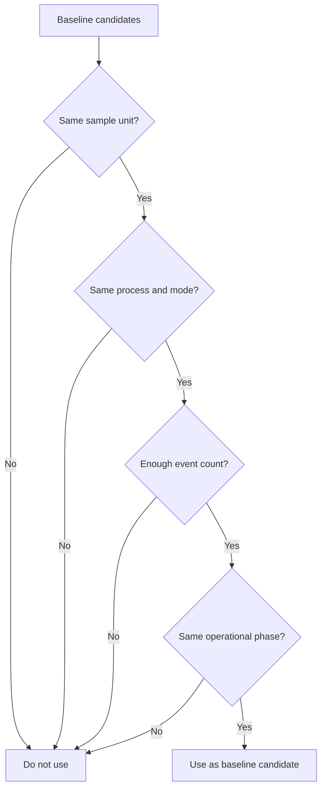

# P3-7.4 기준선은 어떤 구간과 조건으로 잡아야 하는가

> Section ID: `P3-7.4`
> Version: `v2026.07.08`

기준선이 필요하다는 말을 이해한 뒤에는 곧바로 다음 질문이 나옵니다. `그러면 무엇을 평소로 잡아야 하는가?` 바로 이 지점에서 다시 막히기 쉽습니다. 최근 구간과 비교할 과거 구간을 아무렇게나 모으면, 비교표는 만들어져도 해석은 쉽게 흔들립니다. 그래서 기준선 비교 구조를 읽는 장에서는 `무엇과 비교할 것인가` 다음에 `그 기준선을 어떤 조건으로 잡을 것인가`까지 함께 고정해야 합니다.

기준선은 `과거 데이터 아무 묶음`이 아니라, `지금 보고 있는 샘플과 같은 종류의 조건에서 만들어진 비교 구간`이어야 합니다. 같은 동작 유형인지, 같은 운전 모드인지, 같은 구간 길이인지, 최소한 비슷한 운영 조건인지가 맞지 않으면 차이값은 생겨도 그 차이가 무엇을 뜻하는지 말하기 어려워집니다.

| 잘못 잡은 기준선 | 왜 문제가 되는가 |
| --- | --- |
| 다른 공정 유형을 섞은 과거 평균 | 원래 다른 구조를 변화처럼 읽게 된다 |
| 최근 3건만으로 만든 평소값 | 기준선 자체가 너무 쉽게 흔들린다 |
| 동작 길이가 크게 다른 사례를 함께 묶은 기준선 | 같은 특징 열이라도 해석 기준이 달라진다 |
| 유지보수 직후와 이전 상태를 한데 묶은 기준선 | 운영 상태 변화와 구조 변화가 섞여 버린다 |

즉 기준선은 단순히 `오래된 평균`이 아닙니다. 기준선은 현재 샘플을 어디에 비춰 읽을지 정하는 비교 상대입니다. 그래서 현재 샘플과 비교 가능한 조건을 먼저 맞추는 일이 중요합니다.

## 일반화된 기준선 설정 순서

이 절을 특정 공정 예시로만 읽지 않으려면, 기준선 선택을 조금 더 일반화된 순서로 묶어 둘 필요가 있습니다. 가장 간단한 순서는 다음 세 단계입니다.

1. 먼저 `무엇을 무엇과 비교하려는가`를 문장으로 정한다.
2. 그 질문에 맞는 `비교 가능한 기준 구간`만 남긴다.
3. 그 기준을 `고정할지`, `최근 구간에 맞춰 갱신할지`를 정한다.

이 순서를 표로 줄이면 다음과 같습니다.

| 단계 | 먼저 정해야 할 것 | 여기서 피하려는 오류 |
| --- | --- | --- |
| 비교 질문 정하기 | 지금 상태를 과거 어느 상태와 비교할 것인가 | 질문이 없는데 평균부터 고르는 오류 |
| 비교 가능한 후보만 남기기 | 같은 샘플 단위, 같은 조건, 같은 운영 단계인가 | 다른 집단 차이를 변화처럼 읽는 오류 |
| 기준 유지 방식 정하기 | 고정 기준으로 둘지, 최근 평소 기준으로 갱신할지 | 기준이 너무 자주 바뀌거나 너무 오래 굳는 오류 |

이 세 단계는 강한 방법론 이름을 붙일 필요가 없습니다. 핵심은 `기준선도 비교 설계의 일부`라는 점입니다. 먼저 비교 질문이 있어야 기준 구간을 고를 수 있고, 비교 가능한 후보를 남긴 뒤에야 그 기준을 얼마나 오래 유지할지 판단할 수 있습니다.

## 먼저 맞춰야 하는 조건

기준선을 만들 때는 아래 네 가지를 먼저 확인하는 편이 안전합니다.

1. 같은 샘플 단위인가
2. 같은 공정 유형이나 운전 모드인가
3. 비교할 만큼 표본 수가 있는가
4. 운영상 상태가 크게 바뀌기 전 구간인가

이 네 가지를 표로 줄이면 다음과 같습니다.

| 먼저 맞출 조건 | 왜 필요한가 |
| --- | --- |
| 샘플 단위 일치 | 동작 1회와 시점별 행을 섞으면 차이값 해석이 깨지기 때문 |
| 공정/조건 일치 | 원래 다른 집단 차이를 변화처럼 읽지 않기 위해 |
| 표본 수 확보 | 기준선 자체가 지나치게 흔들리지 않게 하기 위해 |
| 운영 상태 일치 | 설비 교체, 정책 변경, 유지보수 전후를 함부로 섞지 않기 위해 |

이 기준은 복잡한 통계 기법을 먼저 배우자는 뜻이 아닙니다. 이 단계에서는 `무엇이 같은 집단인가`를 먼저 맞추는 것만으로도 비교 오류를 크게 줄일 수 있습니다.

NIST의 관리도 설명은 공정이 통제 상태에 도달했다고 보려면 `presumably the same essential conditions` 아래에서 얻은 표본이 필요하다고 적습니다. 이 절에서 말하는 `같은 샘플 단위`, `같은 공정/운전 조건`, `같은 운영 상태`는 그 표현을 현재 책의 데이터 비교 문맥으로 풀어 쓴 것입니다. 즉 여기서의 일반화는 `같은 조건 아래에서 비교 가능한 기준을 만든다`는 수준까지만 사용합니다.

## 고정 기준선과 최근 평소 기준선

자주 묻는 질문은 또 있습니다. `기준선은 오래된 대표값 하나로 고정해야 하는가, 아니면 최근 평소 구간으로 계속 바꿔야 하는가?` Part 3에서는 둘 중 하나만 정답으로 두지 않습니다. 대신 어떤 질문을 하려는지에 따라 더 자연스러운 선택이 달라진다고 봅니다.

| 기준선 형태 | 더 잘 맞는 질문 | 주의할 점 |
| --- | --- | --- |
| 고정 기준선 | 특정 기준 시점 대비 얼마나 달라졌는가 | 현재 운영이 이미 바뀌었으면 너무 오래된 기준이 될 수 있다 |
| 최근 평소 기준선 | 최근 흐름 안에서 지금만 달라졌는가 | 너무 짧게 잡으면 기준선이 불안정해진다 |

예를 들어 설비 교정 직후의 안정 구간을 대표 기준으로 오래 두고 싶다면 고정 기준선이 자연스러울 수 있습니다. 반대로 운영 환경이 조금씩 변하는 시스템에서는 최근 평소 구간을 기준선으로 두는 편이 더 현실적일 수 있습니다. 중요한 점은 어떤 방식을 쓰든 `지금 무엇과 비교하고 있는가`를 문장으로 설명할 수 있어야 한다는 사실입니다.

이 선택도 일반화해서 보면 `참조 기준을 유지할 것인가, 굴릴 것인가`의 문제입니다. BLS의 `base period`는 비교를 위한 기준 시점을 두는 일반 원리를 보여 주고, FPP3의 rolling forecasting origin은 시간이 앞으로 갈수록 기준이 되는 과거 구간도 함께 이동할 수 있다는 점을 보여 줍니다. 현재 Section에서는 이 둘을 그대로 가져다 쓰기보다, `질문이 기준 유지 방식을 결정한다`는 수준으로만 연결해 두면 충분합니다.

## 같은 평균보다 같은 조건이 먼저다

기준선을 고를 때 흔한 실수는 평균이 비슷해 보이는 사례를 그냥 함께 묶는 것입니다. 하지만 평균이 비슷하다고 해서 같은 비교 집단이라고 말할 수는 없습니다. 공정 유형이 다르거나 동작 길이가 다르거나 운영 모드가 다르면, 같은 평균도 전혀 다른 구조를 뜻할 수 있습니다.

| 지금 보고 있는 샘플 | 기준선에 더 가까운 후보 | 덜 적절한 후보 |
| --- | --- | --- |
| `type-A` 동작 1회 요약 표 | 과거 `type-A` 동작 요약 표 묶음 | `type-B`와 `type-C`를 섞은 전체 평균 |
| 최근 20건 집계 표 | 같은 조건의 과거 20건 안팎 집계 표 | 건수 3건짜리 작은 묶음 |
| 유지보수 이후 동작 | 유지보수 이후의 안정 구간 | 유지보수 이전 장기 평균 |

이 표의 핵심은 `숫자가 비슷해 보이는가`보다 `같은 비교 조건인가`를 먼저 보라는 점입니다.

## 작은 도식으로 보기

이 도식은 기준선 선택이 평균값 하나를 고르는 일이 아니라, 비교 조건을 단계별로 거르는 판단이라는 점을 보여 줍니다. 즉 이 절의 중심은 후보 표를 출력하는 것보다 `같은 샘플 단위`, `같은 공정 조건`, `충분한 표본 수`, `같은 운영 상태`를 차례로 맞춰 가는 선택 구조를 붙잡는 데 있습니다.

## 근거가 본문 주장과 어떻게 연결되는가

외부 근거를 붙일 때는 `기준선`이라는 단어 자체보다, 기준이 어떤 역할을 맡는지 연결하는 편이 안전합니다.

| 본문의 핵심 주장 | 일반화 관점에서 필요한 근거 | 현재 붙일 수 있는 근거의 역할 |
| --- | --- | --- |
| 기준선은 비교를 위한 참조 구간이어야 한다 | baseline 또는 base period가 비교용 기준점이라는 설명 | NCI의 baseline 정의와 BLS의 base period 정의가 이 점을 뒷받침한다 |
| 기준선 후보는 같은 조건 아래에서 골라야 한다 | 같은 essential conditions 아래의 표본으로 기준을 잡아야 한다는 설명 | NIST의 관리도 설명이 비교 가능한 기준 구간의 필요성을 뒷받침한다 |
| 기준선은 질문에 따라 고정하거나 최근 구간으로 갱신할 수 있다 | 시간이 흐르며 기준이 이동하는 비교 구조도 가능하다는 설명 | FPP3의 rolling forecasting origin은 `기준이 고정만 되는 것은 아니다`라는 점을 보여 주는 유사 개념이다 |

여기서 마지막 줄은 직접 등치가 아니라 유사 개념 수준의 연결입니다. 즉 FPP3는 예측 평가 문맥의 rolling origin을 설명하지만, 이 책에서는 그 생각을 빌려 `최근 평소 기준선`이 왜 자연스러운 선택일 수 있는지를 독자에게 설명하는 데만 사용합니다.

## 이 절에서 일반화하지 않는 것

다음과 같은 주장은 여기서 단정하지 않습니다.

- 기준선은 언제나 최근 구간으로 계속 갱신해야 한다
- 표본 수 기준은 어느 도메인에서나 같은 숫자로 정해진다
- 같은 평균이면 비교 가능한 기준선이라고 볼 수 있다

이 절의 목적은 보편적인 수치 규칙을 만드는 것이 아니라, 비교 가능한 기준선을 잡기 위해 어떤 질문과 조건을 먼저 확인해야 하는지 정리하는 데 있습니다.

## 왜 이것이 Part 4와 Part 5에도 영향을 주는가

기준선이 잘못 잡히면 Part 3의 비교 리포트만 흔들리는 것이 아닙니다. `검토 필요`, `주의`, `정상/이상 후보` 같은 후속 라벨 후보도 쉽게 흔들립니다. 그러면 Part 4로 넘길 목표 라벨 후보가 약해지고, Part 5에서 더 긴 시계열 입력을 쓰더라도 여전히 `무엇이 평소와 다른가`에 대한 기준이 흐려집니다.

즉 기준선 선택은 해석 단계의 작은 취향 문제가 아니라, 뒤의 예측 문제와 시계열 입력 해석까지 함께 흔들 수 있는 전제입니다.

## 짧은 점검

- 기준선을 `과거 데이터 아무 묶음`으로 잡으면 왜 비교표 해석이 흔들리는가
- 같은 평균보다 같은 공정 조건을 먼저 맞춰야 하는 이유를 설명할 수 있는가
- 고정 기준선과 최근 평소 기준선이 각각 어떤 질문에 더 잘 맞는지 말할 수 있는가
- 기준선 선택이 왜 뒤의 라벨 후보 품질과 입력 해석에도 영향을 주는지 설명할 수 있는가

## 언제 이 관점을 먼저 떠올려야 하는가

- `무엇과 비교할 것인가` 다음에 `그 기준선을 어떤 조건으로 잡을 것인가`가 막힐 때 이 절을 먼저 떠올립니다.
- 평균이 비슷한 과거 사례를 그냥 섞어 기준선으로 두려 할 때 공정 조건, 표본 수, 운영 상태를 먼저 맞춰야 한다는 점을 다시 확인합니다.
- 뒤에서 검토 라벨 후보나 예측 문제로 넘길 때도 기준선 선택이 이미 흔들리고 있지 않은지 점검할 때 이 절이 기준이 됩니다.

## 출처와 참고 자료

- U.S. Bureau of Labor Statistics, `Base period`. 기준 시점은 다른 시점과 비교하기 위한 reference라고 설명하므로, 기준선을 비교용 참조 구간으로 읽는 일반 근거가 됩니다. [https://www.bls.gov/bls/glossary.htm](https://www.bls.gov/bls/glossary.htm){: target="_blank" rel="noopener noreferrer" } / 확인일: 2026-07-08
- National Cancer Institute, `baseline`. baseline을 초기 측정값이자 시간에 따른 변화를 보기 위한 비교 기준으로 설명하므로, `지금 상태를 무엇에 비춰 읽을 것인가`라는 Section 질문을 일반화하는 데 도움이 됩니다. [https://www.cancer.gov/publications/dictionaries/cancer-terms/def/baseline](https://www.cancer.gov/publications/dictionaries/cancer-terms/def/baseline){: target="_blank" rel="noopener noreferrer" } / 확인일: 2026-07-08
- NIST/SEMATECH e-Handbook of Statistical Methods, `What are Variables Control Charts?`. 같은 essential conditions 아래에서 충분한 예비 표본으로 기준을 잡아야 한다는 설명과, 기준을 자주 바꾸면 비교 효용이 약해진다는 설명이 있어, 비교 가능한 기준 구간과 기준 유지 정책을 정하는 일반 근거가 됩니다. [https://www.itl.nist.gov/div898/handbook/pmc/section3/pmc32.htm](https://www.itl.nist.gov/div898/handbook/pmc/section3/pmc32.htm){: target="_blank" rel="noopener noreferrer" } / 확인일: 2026-07-08
- Rob J Hyndman, George Athanasopoulos, *Forecasting: Principles and Practice (3rd ed)*, `5.10 Time series cross-validation`. rolling forecasting origin은 과거 관측만으로 기준 구간을 순차적으로 이동시키는 유사 개념을 보여 주며, 최근 평소 기준선의 직관을 설명하는 보조 근거로 사용할 수 있습니다. [https://otexts.com/fpp3/tscv.html](https://otexts.com/fpp3/tscv.html){: target="_blank" rel="noopener noreferrer" } / 확인일: 2026-07-08
