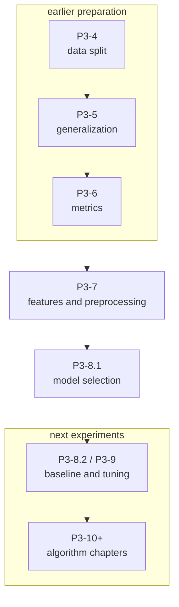
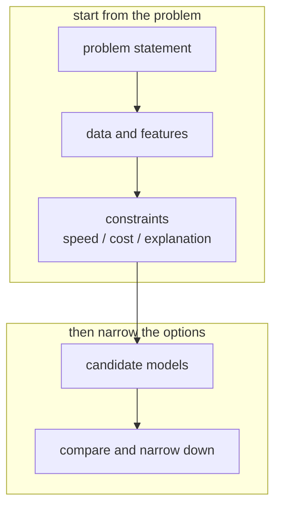
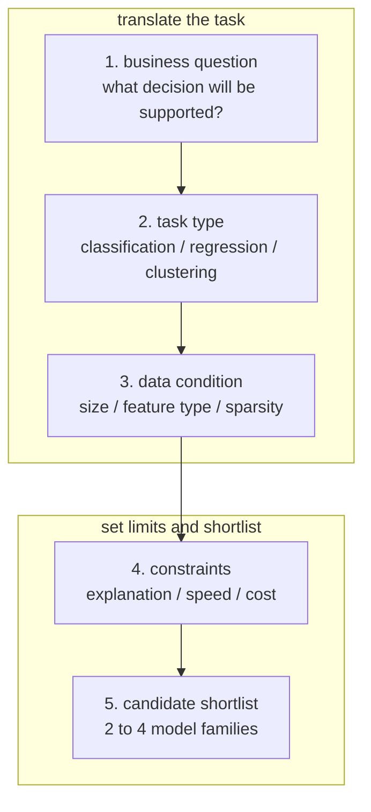

# P3-8.1 모델 선택(model selection)

P3-7에서는 어떤 입력을 남기고, 그 입력을 어떤 표현으로 바꿀지 봤습니다. 이제 다음 질문으로 넘어갑니다.

`그 입력을 어떤 종류의 모델에게 맡길 것인가?`

이 질문이 바로 모델 선택(model selection)의 출발점입니다.

초심자는 종종 모델 선택을 `가장 유명한 알고리즘을 고르는 일`처럼 이해합니다. 하지만 실제로는 반대에 가깝습니다. 모델 선택은 문제의 형태, 데이터의 성질, 설명 가능성, 계산 비용, 운영 조건을 함께 보고 후보를 좁히는 일입니다.

학술 문맥에서도 모델 선택(model selection)은 주변적인 선택이 아닙니다. 통계(statistics)와 머신러닝(machine learning)에서는 관측된 데이터와 목적 함수(objective) 아래에서 여러 후보 모형(model candidates) 가운데 어떤 모형을 채택할지 판단하는 문제가 독립된 주제로 다뤄집니다. 즉, 모델 선택은 `알고리즘 이름을 고르는 취향 문제`가 아니라 `주어진 문제와 제약에 대해 어떤 가설 구조를 먼저 시험할 것인가`를 정하는 단계라고 볼 수 있습니다.

초심자 기준으로는 이 표현을 다음처럼 더 쉽게 바꿀 수 있습니다.

`모델 선택은 문제를 풀기 위해 시험해 볼 모델 후보군을 세우고, 그 후보군을 비교 가능한 형태로 좁혀 가는 일이다.`

## 이 절의 범위

이 절은 다음 질문에 답합니다.

- 모델 선택(model selection)은 무엇을 고르는 일인가?
- 왜 모델을 하나만 외우는 방식으로는 실무 문제를 다루기 어려운가?
- 문제 유형과 데이터 조건에 따라 어떤 모델 계열을 먼저 떠올릴 수 있는가?
- 성능 외에 어떤 기준이 모델 선택에 들어오는가?

이 절은 다음 내용은 깊게 다루지 않습니다.

- 교차검증(cross-validation) 절차의 세부 수식
- 정보 기준(AIC, BIC) 같은 통계적 모형 선택 이론
- AutoML이나 대규모 탐색 시스템의 구현

그 내용은 뒤의 기준 모델(baseline), 튜닝, 알고리즘 절과 연결해서 다시 볼 수 있습니다.

## 이 절의 목표

- 모델 선택을 `후보 모델 집합에서 문제에 맞는 선택지를 좁히는 일`로 설명할 수 있습니다.
- 문제 유형, 데이터 크기, 특징 표현, 해석 가능성, 속도 요구가 모델 선택에 영향을 준다는 점을 말할 수 있습니다.
- 하나의 정답 모델을 찾기보다 `합리적인 후보군(candidate set)`을 세우는 사고를 사용할 수 있습니다.
- 뒤 절의 기준 모델(baseline), 하이퍼파라미터(hyperparameter), 알고리즘 입문과 어떻게 이어지는지 설명할 수 있습니다.

## 이 절이 커리큘럼에서 필요한 이유

Part 3은 지금까지 다음 흐름으로 왔습니다.

- P3-4: 데이터를 어떻게 나눌 것인가
- P3-5: 일반화가 왜 어려운가
- P3-6: 무엇을 기준으로 평가할 것인가
- P3-7: 어떤 입력을 남기고, 어떤 표현으로 바꿀 것인가

여기까지 정리하면 이제야 비로소 `모델을 고를 조건`이 생깁니다.

즉, 모델 선택은 앞 절들을 다 본 뒤에야 제대로 다룰 수 있는 절입니다. 데이터 분리 없이 모델을 고르면 평가가 흔들리고, 평가 기준 없이 모델을 고르면 무엇이 더 좋은지 판단할 수 없고, 특징과 전처리 없이 모델을 고르면 입력과 맞지 않는 선택을 하게 됩니다.

따라서 이 절은 커리큘럼상 다음 역할을 합니다.

| 커리큘럼 위치 | 모델 선택 절의 역할 |
| --- | --- |
| 특징/전처리 뒤 | 어떤 입력 표현에 어떤 모델이 맞는지 생각하게 함 |
| 기준 모델 전 | 비교 시작점을 세우기 위한 후보군 정리 |
| 알고리즘 입문 전 | 뒤에서 배울 알고리즘들을 어디에 써야 하는지 큰 지도를 제공 |

즉, 이 절은 `알고리즘 백과사전`이 아니라 `알고리즘 지형도` 역할을 합니다.

커리큘럼적으로 보면 이 절은 Part 3의 흐름이 `데이터를 공정하게 다루는 단계`에서 `실제로 어떤 실험을 시작할 것인가`로 넘어가는 경계이기도 합니다.

- P3-4에서는 데이터를 어떻게 나눌지 봤습니다.
- P3-5에서는 일반화와 과적합을 봤습니다.
- P3-6에서는 무엇을 기준으로 평가할지 봤습니다.
- P3-7에서는 어떤 입력을 남기고 어떻게 표현할지 봤습니다.

그 다음에야 비로소 다음 질문이 성립합니다.

`이제 어떤 모델 계열을 후보로 올려야 하는가?`

즉, 모델 선택은 앞 절들의 결과를 한곳에 모아 `실험 설계의 첫 선택지`로 바꾸는 절입니다. 그래서 이 절은 뒤의 P3-8.2 기준 모델(baseline), P3-9 하이퍼파라미터 튜닝(hyperparameter tuning), P3-10 이후 알고리즘 입문 절의 입구 역할을 합니다.

이 커리큘럼 위치를 흐름으로 그리면 다음과 같습니다.



이 도식의 핵심은, 모델 선택이 갑자기 나타나는 절이 아니라 앞선 판단을 모아 다음 실험을 설계하는 절이라는 점입니다.

## 모델 선택은 무엇을 고르는 일인가

학술적으로 모델 선택(model selection)은 후보 모델들 가운데 목적에 맞는 선택을 하는 문제입니다. 단, 여기서 목적은 하나가 아닐 수 있습니다.

- 예측 성능이 좋은가?
- 과적합을 덜 만드는가?
- 계산 비용이 감당 가능한가?
- 설명이 쉬운가?
- 운영 환경에서 배포 가능한가?

즉, 모델 선택은 단지 `정확도 높은 모델 찾기`보다 넓은 문제입니다.

조금 더 이론적으로 말하면, 여기서 선택 대상은 단순히 프로그램 이름이 아니라 가설 공간(hypothesis space)의 한 부분입니다. 선형 모델을 먼저 볼지, 트리 계열을 먼저 볼지, 거리 기반 모델을 먼저 볼지는 결국 `데이터에서 어떤 구조를 읽어 보려는가`와 연결됩니다. 이 절에서는 이 수학적 세부를 파고들지 않고, 초심자가 그 차이를 `후보군의 성격 차이` 정도로 구분할 수 있게 만드는 데 집중합니다.

초심자 기준에서는 다음처럼 이해하면 충분합니다.

`모델 선택은 문제와 제약에 맞는 모델 후보를 좁혀 가는 일이다.`

## 왜 하나의 모델만 외우면 안 되는가

같은 데이터셋이라도 질문이 달라지면 적합한 모델이 달라질 수 있습니다.

예를 들어 고객 데이터를 가지고도 다음처럼 전혀 다른 문제가 나올 수 있습니다.

| 같은 데이터 | 다른 질문 | 모델 선택 관점 |
| --- | --- | --- |
| 고객 활동 기록 | 다음 달 이탈할까? | 분류(classification) 후보 |
| 고객 활동 기록 | 다음 달 매출은 얼마일까? | 회귀(regression) 후보 |
| 고객 활동 기록 | 비슷한 고객끼리 묶을 수 있을까? | 군집화(clustering) 후보 |

즉, 모델 선택은 데이터셋 이름보다 `무슨 예측 또는 판단을 하려는가`에서 먼저 출발합니다.

## 모델 선택 전에 먼저 묻는 네 가지 질문

초심자에게는 알고리즘 이름보다 질문 순서가 더 중요합니다.

### 1. 문제 유형이 무엇인가

가장 먼저 물어야 할 것은 문제 유형입니다.

- 분류(classification)인가
- 회귀(regression)인가
- 군집화(clustering)인가
- 순위(ranking)나 추천(recommendation)에 가까운가

문제 유형이 달라지면 후보 모델군 자체가 달라집니다.

### 2. 데이터가 얼마나 많고 어떤 형태인가

두 번째는 데이터의 크기와 표현입니다.

- 샘플 수가 많은가 적은가
- 특징 수가 많은가 적은가
- 숫자형이 중심인가 문자열/범주형이 많은가
- 희소(sparse)한가 조밀(dense)한가

예를 들어 샘플은 적고 특징은 많은 경우와, 샘플이 아주 많고 특징도 단순한 경우는 모델 선택 감각이 달라질 수 있습니다.

### 3. 설명 가능성이 중요한가

어떤 문제는 결과를 잘 맞히는 것만으로 부족합니다.

- 왜 이런 판단이 나왔는지 설명해야 하는가
- 규제나 감사가 있는가
- 사람이 함께 검토해야 하는가

이런 경우에는 복잡한 모델보다 해석 가능한 모델이 더 나은 출발점일 수 있습니다.

### 4. 속도와 운영 제약이 큰가

실시간 응답이 필요한가, 추론 비용이 제한되는가, 메모리나 배포 환경이 좁은가도 중요합니다.

아무리 성능이 좋아도 서비스 응답 시간이 너무 길거나 운영 비용이 감당되지 않으면 좋은 선택이 아닐 수 있습니다.

## 모델 선택은 후보군을 세우는 일이다

초심자는 종종 이렇게 묻습니다.

`그래서 어떤 모델이 정답인가?`

하지만 모델 선택의 실제 출발점은 하나의 정답 모델보다 `첫 후보군(shortlist)`을 만드는 일에 더 가깝습니다.



이 도식의 핵심은, 모델이 먼저가 아니라 문제와 제약이 먼저라는 점입니다.

실무 흐름으로 조금 더 펼치면 다음처럼 읽을 수 있습니다.



이 도식은 모델 선택을 `알고리즘 검색`이 아니라 `업무 질문을 실험 후보군으로 번역하는 과정`으로 보여 줍니다.

## 문제 유형별로 먼저 떠올릴 수 있는 후보군

입문 단계에서는 모든 알고리즘을 다 비교하려 하지 말고, 문제 유형별로 먼저 떠올릴 수 있는 후보군을 만드는 편이 좋습니다.

| 문제 유형 | 먼저 떠올릴 수 있는 후보군 |
| --- | --- |
| 분류 | 로지스틱 회귀, 결정트리, k-NN, SVM |
| 회귀 | 선형회귀, 결정트리 회귀, 랜덤포레스트 회귀 |
| 군집화 | k-means, DBSCAN 같은 비지도 후보 |

이 표는 정답표가 아니라 `탐색 시작점`입니다.

뒤 장에서 이 후보들을 차례로 다루게 됩니다.

- P3-10 선형회귀
- P3-11 로지스틱 회귀
- P3-12 k-NN
- P3-13 SVM
- P3-14 결정트리
- P3-15 랜덤포레스트

즉, 이 절은 뒤 알고리즘 절의 입구 역할을 합니다.

## 데이터 조건이 후보군을 어떻게 바꾸는가

문제 유형이 같아도 데이터 조건이 다르면 선택 감각이 바뀝니다.

| 데이터 조건 | 먼저 생각할 변화 |
| --- | --- |
| 특징이 적고 설명이 중요함 | 선형 모델, 작은 트리 같은 단순 모델부터 시작 |
| 거리 개념이 중요함 | k-NN, SVM 같은 후보를 더 의식 |
| 비선형 경계가 많아 보임 | 트리 계열, 커널 기반 방법을 후보에 넣음 |
| 범주형 값이 많음 | 전처리 부담과 모델 적합성을 함께 검토 |
| 실시간 응답이 중요함 | 추론이 빠른 모델을 우선 검토 |

즉, 모델 선택은 알고리즘 자체의 우열이 아니라 `문제와 데이터 조건의 조합`을 읽는 일입니다.

## 설명 가능성과 운영 조건도 선택 기준이다

같은 성능이라도 현장에서는 다음 같은 이유로 다른 선택이 나올 수 있습니다.

| 기준 | 더 단순한 모델이 유리할 수 있는 이유 |
| --- | --- |
| 설명 가능성 | 결과를 설명하고 검토하기 쉽다 |
| 디버깅 | 이상한 예측이 나왔을 때 추적이 쉽다 |
| 운영 비용 | 추론 비용과 메모리 사용량이 작을 수 있다 |
| 배포 단순성 | 파이프라인과 모델 구조가 단순해 관리가 쉽다 |

즉, 모델 선택은 성능표 한 줄로 끝나지 않습니다.

## 작은 예시로 모델 후보를 세워 보기

다음과 같은 문제를 생각해 보겠습니다.

| 조건 | 내용 |
| --- | --- |
| 문제 | 고객 이탈 예측 |
| 입력 | 최근 방문 수, 문의 수, 결제 금액, 회원 등급 |
| 목표 | 다음 달 이탈 여부 분류 |
| 제약 | 결과 설명이 어느 정도 가능해야 함 |
| 운영 | 하루 배치 예측, 실시간은 아님 |

이 경우 초심자 수준에서 다음처럼 후보군을 세울 수 있습니다.

| 후보 | 왜 후보인가 |
| --- | --- |
| 로지스틱 회귀 | 해석과 기준선 설정에 좋다 |
| 결정트리 | 비선형 규칙을 직관적으로 볼 수 있다 |
| 랜덤포레스트 | 더 안정적인 성능 후보가 될 수 있다 |

반대로 처음부터 매우 복잡한 모델 하나만 고정하는 것은, 비교 기준을 잃게 만들 수 있습니다.

## Python 예제로 후보군을 표로 정리해 보기

아래 예제는 모델을 학습하는 코드가 아니라, 문제 조건에 따라 어떤 후보를 먼저 떠올릴 수 있는지 정리하는 아주 단순한 사고 도구입니다.

```python
problem = {
    "task_type": "classification",
    "need_explanation": True,
    "real_time": False,
    "distance_sensitive_features": False,
    "nonlinear_pattern_expected": True,
}

candidates = []

if problem["task_type"] == "classification":
    candidates.append(("logistic_regression", "clear baseline and easier interpretation"))
    candidates.append(("decision_tree", "simple nonlinear rules"))

if problem["nonlinear_pattern_expected"]:
    candidates.append(("random_forest", "stronger nonlinear candidate"))

if problem["distance_sensitive_features"]:
    candidates.append(("knn", "distance-based comparison"))
    candidates.append(("svm", "margin-based boundary"))

print("candidate shortlist:")
for name, reason in candidates:
    print("-", name, "->", reason)
```

실행 결과는 다음과 같습니다.

```text
candidate shortlist:
- logistic_regression -> clear baseline and easier interpretation
- decision_tree -> simple nonlinear rules
- random_forest -> stronger nonlinear candidate
```

이 예제의 목적은 자동 선택이 아닙니다. `문제 조건을 읽고 후보를 줄이는 사고`를 보여 주는 데 있습니다.

## 이 절에서 기억할 관점

- 모델 선택은 하나의 정답 알고리즘을 찍는 일이 아니다.
- 문제 유형, 데이터 조건, 설명 가능성, 운영 제약을 함께 본다.
- 실제 출발점은 하나의 모델보다 합리적인 후보군(shortlist)이다.
- 뒤 절의 기준 모델(baseline)과 알고리즘 절은 이 후보군을 비교하고 좁히는 단계다.

## 체크리스트

- 지금 문제는 분류인가, 회귀인가, 군집화인가?
- 입력 표현과 데이터 규모를 고려했는가?
- 설명 가능성과 운영 제약을 기준에 넣었는가?
- 후보군을 두세 개 이상 세우고 비교할 준비가 되어 있는가?
- 아직 기준 모델(baseline) 없이 복잡한 모델 하나만 붙잡고 있지 않은가?

## 다음 절과의 연결

다음 절 P3-8.2 기준 모델(baseline)에서는 지금 만든 후보군 가운데 왜 `가장 단순한 비교 시작점`이 먼저 필요한지 보게 됩니다. 그리고 P3-9에서는 그 후보들을 어떻게 조정하고 비교할지, P3-10 이후에서는 각 후보가 실제로 어떤 성격을 가지는지 더 구체적으로 보게 됩니다.

## 출처와 참고 자료

- Jie Ding, Vahid Tarokh, Yuhong Yang, `Model Selection Techniques -- An Overview`, arXiv, 2018, 확인 날짜: 2026-06-26. [https://arxiv.org/abs/1810.09583](https://arxiv.org/abs/1810.09583){: target="_blank" rel="noopener noreferrer" }
- Sebastian Raschka, `Model Evaluation, Model Selection, and Algorithm Selection in Machine Learning`, arXiv, 2018, 확인 날짜: 2026-06-26. [https://arxiv.org/abs/1811.12808](https://arxiv.org/abs/1811.12808){: target="_blank" rel="noopener noreferrer" }
