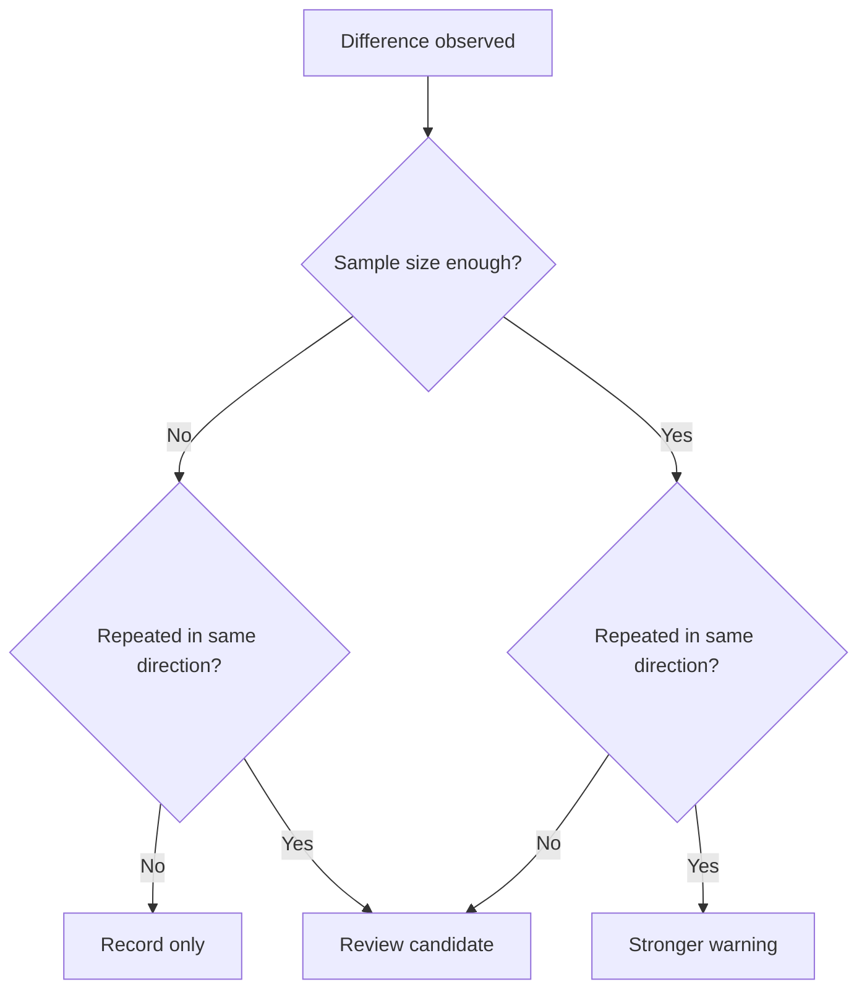

# P3-8.1 해석 강도는 무엇으로 조절하는가

> Section ID: `P3-8.1`
> Version: `v2026.07.10`

비교표가 있다고 해서 모든 차이를 같은 강도로 읽을 수 있는 것은 아닙니다. 특히 운영 데이터에서는 표본 수가 적고, 같은 변화가 반복되는지 여부가 불분명할 수 있습니다. 그래서 해석 단계에서는 `무엇이 달라졌는가`만이 아니라 `그 차이를 얼마나 믿을 수 있는가`도 함께 봐야 합니다.

표본 수가 적으면 평균, 변동성, 대표 패턴 같은 값이 쉽게 흔들립니다. 예를 들어 최근 2건의 평균과 기준선 차이 0.3은 인상적으로 보일 수 있습니다. 하지만 최근 20건의 평균과 기준선 차이 0.3과는 무게가 다릅니다. 수치가 같아도, 그 차이가 몇 건에서 나온 것인지에 따라 해석의 강도는 달라져야 합니다.

여기서 중요한 것은 `데이터가 적으면 아무 말도 하지 말아야 한다`가 아닙니다. 더 정확한 표현은 `데이터가 적을수록 덜 확신하며 말해야 한다`입니다. 즉 해석을 멈추는 것이 아니라, 해석의 강도를 조절해야 합니다.

반복성도 같은 이유로 중요합니다. 한 번 크게 튄 변화와, 여러 번 조금씩 같은 방향으로 움직이는 변화는 운영상 의미가 다를 수 있습니다. 때로는 단발성 급락보다 최근 여러 구간에서 반복적으로 나타나는 약한 하락이 더 중요합니다. 운영자가 보고 싶은 것은 종종 `한 번의 특이한 사례`보다 `상태가 달라지고 있는 징후`이기 때문입니다.

즉 해석에는 최소 두 축이 함께 들어갑니다. 하나는 `얼마나 많이 관측되었는가`이고, 다른 하나는 `같은 방향 변화가 얼마나 반복되었는가`입니다. 표본 수만 보면 놓치는 신호가 있고, 반복성만 보면 우연을 과대해석할 위험이 있습니다. 그래서 운영 데이터에서는 두 축을 함께 놓고 읽는 습관이 중요합니다.

| 상황 | 해석할 때 조심할 점 |
| --- | --- |
| 표본 수가 적고 반복도 약함 | 우연일 가능성을 더 크게 본다 |
| 표본 수가 적지만 같은 방향 변화가 반복됨 | 강한 결론은 보류하되 주의 깊게 본다 |
| 표본 수가 충분하고 반복도 있음 | 더 신뢰할 만한 변화 신호로 읽을 수 있다 |

이 표를 조금 더 실무적으로 바꾸면 다음과 같은 문장으로 이어집니다.

- 표본 수가 적고 반복도 약하면: 기록은 남기되 경고 강도는 낮춘다.
- 표본 수가 적지만 반복되면: 자동 확정보다 사람 검토 후보로 올린다.
- 표본 수와 반복성이 모두 충분하면: 더 강한 경고나 후속 분석으로 넘길 수 있다.

여기서는 `이럴 때는 아직 세게 말하지 않는다`는 기준을 함께 두어 해석 강도를 조절합니다. 같은 `diff`라도 운영 문장이 달라지는 이유를 독자가 바로 볼 수 있어야 이후의 경고, 검토 큐(review queue), 평가(evaluation) 설명도 덜 흔들립니다.

| 관측 상태 | 아직 세게 말하지 않는 문장 | 더 안전한 문장 |
| --- | --- | --- |
| 최근 2건만 다름 | 상태가 확실히 바뀌었다 | 최근 소수 사례에서 차이가 보여 추가 관찰이 필요하다 |
| 반복성 약함 | 원인이 분명하다 | 반복 신호가 약해 원인 확정은 보류한다 |
| 표본 수와 반복성 모두 중간 수준 | 곧바로 자동 경보로 확정한다 | 검토 우선순위를 높이되 확정 진단은 보류한다 |

여기서 중요한 점은 `판단을 멈추는가`보다 `판단의 강도를 어떻게 조절하는가`입니다. 이 관점이 있어야 뒤에서 경고 임계값, 검토 큐(review queue), 평가(evaluation)를 설명할 때도 독자가 왜 둔감함이 필요한지 이해할 수 있습니다.

짧은 Python 예시로 보면, 같은 차이값이라도 왜 다른 해석 강도로 가는지 더 직접 확인할 수 있습니다.

문제 상황: 최근 평균과 기준선 평균의 차이는 모두 `-0.3`인데, 표본 수와 반복성은 서로 다른 세 구간이 있습니다.

입력(input): 구간별 `event_count`, `diff`, `same_direction_count`

기대 출력(output): 같은 `diff`라도 `record_only`, `review_candidate`, `stronger_warning`처럼 다른 해석 강도로 갈리는 표

확인할 개념: 해석 강도는 차이값 하나가 아니라 표본 수와 반복성을 함께 보고 정한다

```python
import pandas as pd

cases = pd.DataFrame(
    [
        {"window_id": "few-and-weak", "event_count": 2, "diff": -0.3, "same_direction_count": 1},
        {"window_id": "few-but-repeated", "event_count": 4, "diff": -0.3, "same_direction_count": 4},
        {"window_id": "enough-and-repeated", "event_count": 20, "diff": -0.3, "same_direction_count": 17},
    ]
)

cases["repeat_ratio"] = cases["same_direction_count"] / cases["event_count"]


def interpretation_level(row):
    if row["event_count"] < 3 and row["repeat_ratio"] < 0.5:
        return "record_only"
    if row["event_count"] < 10 or row["repeat_ratio"] < 0.7:
        return "review_candidate"
    return "stronger_warning"


cases["interpretation_level"] = cases.apply(interpretation_level, axis=1)

print(cases[["window_id", "diff", "event_count", "repeat_ratio", "interpretation_level"]])
```

예상 출력:

```text
             window_id  diff  event_count  repeat_ratio interpretation_level
0         few-and-weak  -0.3            2          0.50          record_only
1     few-but-repeated  -0.3            4          1.00     review_candidate
2  enough-and-repeated  -0.3           20          0.85      stronger_warning
```

이 예제에서 중요한 점은 세 구간의 `diff`가 모두 같다는 사실입니다. 달라지는 것은 `event_count`와 `repeat_ratio`, 그리고 그 둘이 합쳐 만든 해석 강도입니다. 첫 번째는 차이는 보여도 표본 수가 너무 적어 기록 수준에 가깝고, 두 번째는 표본 수는 아직 적지만 반복성이 뚜렷해 검토 후보로 올릴 만합니다. 세 번째는 표본 수와 반복성이 함께 충분하므로 더 강한 변화 신호로 읽을 수 있습니다.

이렇게 해석 강도를 조절하면 무엇을 얻는지도 분명합니다. 첫째, 표본 수가 약한 신호를 곧바로 강한 경고로 올리지 않아 과잉 경보를 줄일 수 있습니다. 둘째, 반복성이 있는 약한 신호는 그냥 버리지 않고 `검토 후보`로 남겨 사람의 확인 자원을 더 아껴 쓸 수 있습니다. 셋째, 표본 수와 반복성이 함께 충분한 경우에만 더 강한 경고를 붙이므로, 같은 `diff`라도 `기록`, `검토`, `강한 경고`가 왜 갈리는지 나중에 다시 설명하기 쉬워집니다.

즉 이 절의 핵심은 `차이값을 계산하는 법`보다 `같은 차이를 어떤 문장 강도로 옮길 것인가`를 정하는 데 있습니다. Python 예제도 바로 그 판단 사다리를 작은 표 하나로 보여 주는 쪽이 더 적합합니다.

이 판단을 더 짧게 줄이면 다음처럼 정리할 수 있습니다.

| 관측 조건 | 더 자연스러운 해석 강도 |
| --- | --- |
| 표본 수 적음 + 반복 약함 | 기록 수준에 가깝게 남긴다 |
| 표본 수 적음 + 반복 있음 | 검토 후보로 올린다 |
| 표본 수 충분 + 반복 있음 | 더 강한 변화 신호로 읽을 수 있다 |

이 표의 핵심은 해석을 멈추자는 뜻이 아니라, 같은 차이라도 관측 조건에 따라 말하는 강도를 조절해야 한다는 점입니다.

## 작은 도식으로 보기


```mermaid
flowchart TD
    A[Difference observed] --> B{Sample size enough?}
    B -- No --> C{Repeated in same direction?}
    C -- No --> D[Record only]
    C -- Yes --> E[Review candidate]
    B -- Yes --> F{Repeated in same direction?}
    F -- No --> E
    F -- Yes --> G[Stronger warning]
```

이 절은 특정 운영 도메인의 `감`을 말하는 것이 아니라, `증거 강도(evidence strength)`를 어떻게 읽을 것인가의 문제로 다시 묶을 수 있습니다.


따라서 `차이가 있는가` 하나만 보는 것이 아니라, `그 차이를 어느 강도로 말할 수 있는가`를 함께 정해야 합니다.

## 출처와 참고 자료

- NIST/SEMATECH e-Handbook of Statistical Methods, `What are Variables Control Charts?`. 현재 성능을 과거 성능과 비교하는 구조와, 같은 본질 조건 아래에서 얻은 표본이 필요하다는 설명을 제공하므로, 차이값만이 아니라 표본 수와 반복성을 함께 보고 해석 강도를 조절해야 한다는 이 절의 일반 근거가 됩니다. [https://www.itl.nist.gov/div898/handbook/pmc/section3/pmc32.htm](https://www.itl.nist.gov/div898/handbook/pmc/section3/pmc32.htm){: target="_blank" rel="noopener noreferrer" } / 확인일: 2026-07-08
- U.S. Bureau of Labor Statistics, `Base period`. 비교는 참조 시점과의 관계에서 읽어야 한다는 일반 reference 개념을 제공하므로, 같은 diff도 관측 조건에 따라 다르게 말해야 한다는 이 절의 설명을 보강합니다. [https://www.bls.gov/bls/glossary.htm](https://www.bls.gov/bls/glossary.htm){: target="_blank" rel="noopener noreferrer" } / 확인일: 2026-07-08
