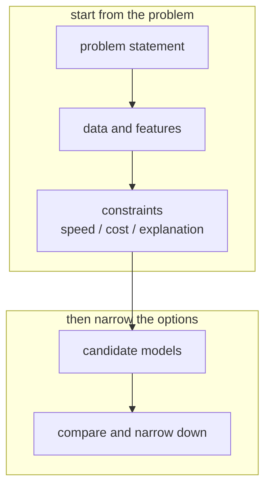
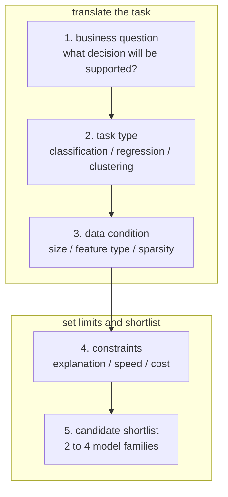

# P3-8.1 모델 선택(model selection)

P3-7에서는 어떤 입력을 남기고, 그 입력을 어떤 표현으로 바꿀지 봤습니다. 이제 다음 질문으로 넘어갑니다.

그 입력을 어떤 종류의 모델에게 맡길 것인가?

이 질문이 바로 모델 선택(model selection)의 출발점입니다.

종종 모델 선택을 `가장 유명한 알고리즘을 고르는 일`처럼 이해합니다. 하지만 실제로는 반대에 가깝습니다. 모델 선택은 문제의 형태, 데이터의 성질, 설명 가능성, 계산 비용, 운영 조건을 함께 보고 후보를 좁히는 일입니다.

학술 문맥에서도 모델 선택(model selection)은 주변적인 선택이 아닙니다. 통계(statistics)와 머신러닝(machine learning)에서는 관측된 데이터와 목적 함수(objective) 아래에서 여러 후보 모형(model candidates) 가운데 어떤 모형을 채택할지 판단하는 문제가 독립된 주제로 다뤄집니다. 즉, 모델 선택은 `알고리즘 이름을 고르는 취향 문제`가 아니라 `주어진 문제와 제약에 대해 어떤 가설 구조를 먼저 시험할 것인가`를 정하는 단계라고 볼 수 있습니다.

여기서는 이 표현을 다음처럼 더 쉽게 바꿀 수 있습니다.

모델 선택은 문제를 풀기 위해 시험해 볼 모델 후보군을 세우고, 그 후보군을 비교 가능한 형태로 좁혀 가는 일이다.

독자에게는 다음 표가 가장 빠른 출발점이 될 수 있습니다.

| 지금 보는 문제 | 독자용 첫 질문 | 처음 떠올릴 후보군 |
| --- | --- | --- |
| 분류 | `둘 이상 class를 나누는가?` | 로지스틱 회귀, 결정트리, k-NN |
| 회귀 | `연속값을 맞히는가?` | 선형회귀, 트리 회귀 |
| 군집화 | `라벨 없이 묶음을 찾는가?` | k-means, DBSCAN |

이 표의 목적은 정답을 찍는 것이 아니라, 독자가 문제를 보고 `어느 서랍을 먼저 열어야 하는가`를 알게 하는 것입니다.

## 이 절의 범위

이 절은 다음 질문에 답합니다.

- 모델 선택(model selection)은 무엇을 고르는 일인가?
- 왜 모델을 하나만 외우는 방식으로는 실무 문제를 다루기 어려운가?
- 문제 유형과 데이터 조건에 따라 어떤 모델 계열을 먼저 떠올릴 수 있는가?
- 성능 외에 어떤 기준이 모델 선택에 들어오는가?

이 절은 다음 내용은 깊게 다루지 않습니다.

- 교차검증(cross-validation) 절차의 세부 수식
- 정보 기준(AIC, BIC) 같은 통계적 모형 선택 이론
- AutoML이나 대규모 탐색 시스템의 구현

교차검증의 기본 역할은 P3-4.2와 P3-9.2에서 다시 연결하고, 정보 기준, AutoML, 대규모 탐색 시스템은 P3-9.3 보충학습에서 `고급 모델 선택과 자동화` 관점으로 따로 정리합니다.

## 이 절의 목표

- 모델 선택을 `후보 모델 집합에서 문제에 맞는 선택지를 좁히는 일`로 설명할 수 있습니다.
- 문제 유형, 데이터 크기, 특징 표현, 해석 가능성, 속도 요구가 모델 선택에 영향을 준다는 점을 말할 수 있습니다.
- 하나의 정답 모델을 찾기보다 `합리적인 후보군(candidate set)`을 세우는 사고를 사용할 수 있습니다.
- 뒤 절의 기준 모델(baseline), 하이퍼파라미터(hyperparameter), 알고리즘 입문과 어떻게 이어지는지 설명할 수 있습니다.

## 학습 배경

Part 3은 지금까지 다음 흐름으로 왔습니다.

- P3-4: 데이터를 어떻게 나눌 것인가
- P3-5: 일반화가 왜 어려운가
- P3-6: 무엇을 기준으로 평가할 것인가
- P3-7: 어떤 입력을 남기고, 어떤 표현으로 바꿀 것인가

여기까지 정리하면 이제야 비로소 `모델을 고를 조건`이 생깁니다.

즉, 모델 선택은 앞 절들을 다 본 뒤에야 제대로 다룰 수 있는 절입니다. 데이터 분리 없이 모델을 고르면 평가가 흔들리고, 평가 기준 없이 모델을 고르면 무엇이 더 좋은지 판단할 수 없고, 특징과 전처리 없이 모델을 고르면 입력과 맞지 않는 선택을 하게 됩니다.

따라서 이 절은 커리큘럼상 다음 역할을 합니다.

| 커리큘럼 위치 | 모델 선택 절의 역할 |
| --- | --- |
| 특징/전처리 뒤 | 어떤 입력 표현에 어떤 모델이 맞는지 생각하게 함 |
| 기준 모델 전 | 비교 시작점을 세우기 위한 후보군 정리 |
| 알고리즘 입문 전 | 뒤에서 배울 알고리즘들을 어디에 써야 하는지 큰 지도를 제공 |

즉, 이 절은 `알고리즘 백과사전`이 아니라 `알고리즘 지형도` 역할을 합니다.

커리큘럼적으로 보면 이 절은 Part 3의 흐름이 `데이터를 공정하게 다루는 단계`에서 `실제로 어떤 실험을 시작할 것인가`로 넘어가는 경계이기도 합니다.

- P3-4에서는 데이터를 어떻게 나눌지 봤습니다.
- P3-5에서는 일반화와 과적합을 봤습니다.
- P3-6에서는 무엇을 기준으로 평가할지 봤습니다.
- P3-7에서는 어떤 입력을 남기고 어떻게 표현할지 봤습니다.

그 다음에야 비로소 다음 질문이 성립합니다.

`이제 어떤 모델 계열을 후보로 올려야 하는가?`

즉, 모델 선택은 앞 절들의 결과를 한곳에 모아 `실험 설계의 첫 선택지`로 바꾸는 절입니다. 그래서 이 절은 뒤의 P3-8.2 기준 모델(baseline), P3-9 하이퍼파라미터 튜닝(hyperparameter tuning), P3-10 이후 알고리즘 입문 절의 입구 역할을 합니다.

즉, 모델 선택은 갑자기 나타나는 절이 아니라, 데이터 분리, 일반화, 평가 기준, 특징 설계를 모아 다음 실험을 설계하는 절입니다. 그 다음에는 baseline과 튜닝으로 비교 구조를 만들고, 뒤의 알고리즘 장으로 들어가게 됩니다.

이때 P3-6에서 본 평가 기준을 그대로 끌고 와야 합니다. 후보군을 세울 때는 `누가 점수가 가장 높을까`만 묻지 않고, `어떤 오류 유형을 줄여야 하는가`, `혼동 행렬에서 어느 칸을 특히 줄여야 하는가`, `나중에 baseline과 비교했을 때 어떤 개선을 기대하는가`를 함께 적어 두는 편이 안전합니다. 그래야 뒤의 baseline 비교와 튜닝 결과가 단순 점수 경쟁이 아니라 `오류 구조를 얼마나 바꿨는가`로 읽힙니다.

독자가 후보군을 메모할 때도 같은 기준을 바로 남겨 두면 좋습니다.

| 지금 적어 둘 항목 | 왜 여기서 같이 적어야 하는가 |
| --- | --- |
| 첫 후보 모델 2~4개 | 한 모델만 붙잡고 바로 튜닝하는 실수를 줄이기 위해서입니다. |
| 가장 단순한 baseline | 뒤 절에서 무엇을 먼저 이겨야 하는지 미리 분명히 하기 위해서입니다. |
| 먼저 볼 평가 지표 | accuracy, MAE처럼 겉점수 하나만 보고 판단하지 않기 위해서입니다. |
| 확인할 오류 장면 | 혼동 행렬의 문제 칸이나 큰 오차 구간을 바로 추적하기 위해서입니다. |

즉, 모델 선택 메모는 `후보 이름 목록`으로 끝내지 말고 `baseline과 오류 해석의 출발점`까지 같이 적는 것이 좋습니다.

처음 읽을 때는 아래 세 줄만 바로 잡아도 충분합니다.

| 지금 이 절에서 먼저 못 박을 것 | 바로 뒤 절에서 이어서 볼 것 | 실제 비교에서 끝까지 남겨야 할 것 |
| --- | --- | --- |
| 첫 후보 모델 2~4개를 세운다 | baseline을 두고 무엇을 먼저 이겨야 하는지 본다 | 혼동 행렬의 문제 칸, 큰 오차 구간, 대표 오류 사례 |
| 문제를 보고 어떤 후보군 서랍을 먼저 열지 정한다 | 점수 상승이 실제 개선인지 비교한다 | 다음 실험에서 어떤 실패를 더 줄일지 적는다 |

## 주요 학습내용

### 모델 선택은 무엇을 고르는 일인가

학술적으로 모델 선택(model selection)은 후보 모델들 가운데 목적에 맞는 선택을 하는 문제입니다. 단, 여기서 목적은 하나가 아닐 수 있습니다.

- 예측 성능이 좋은가?
- 과적합을 덜 만드는가?
- 계산 비용이 감당 가능한가?
- 설명이 쉬운가?
- 운영 환경에서 배포 가능한가?

즉, 모델 선택은 단지 `정확도 높은 모델 찾기`보다 넓은 문제입니다.

조금 더 이론적으로 말하면, 여기서 선택 대상은 단순히 프로그램 이름이 아니라 가설 공간(hypothesis space)의 한 부분입니다. 선형 모델을 먼저 볼지, 트리 계열을 먼저 볼지, 거리 기반 모델을 먼저 볼지는 결국 `데이터에서 어떤 구조를 읽어 보려는가`와 연결됩니다. 이 절에서는 이 수학적 세부를 파고들지 않고, 독자가 그 차이를 `후보군의 성격 차이` 정도로 구분할 수 있게 만드는 데 집중합니다.

다음처럼 이해하면 충분합니다.

`모델 선택은 문제와 제약에 맞는 모델 후보를 좁혀 가는 일이다.`

### 왜 하나의 모델만 외우면 안 되는가

같은 데이터셋이라도 질문이 달라지면 적합한 모델이 달라질 수 있습니다.

예를 들어 고객 데이터를 가지고도 다음처럼 전혀 다른 문제가 나올 수 있습니다.

| 같은 데이터 | 다른 질문 | 모델 선택 관점 |
| --- | --- | --- |
| 고객 활동 기록 | 다음 달 이탈할까? | 분류(classification) 후보 |
| 고객 활동 기록 | 다음 달 매출은 얼마일까? | 회귀(regression) 후보 |
| 고객 활동 기록 | 비슷한 고객끼리 묶을 수 있을까? | 군집화(clustering) 후보 |

즉, 모델 선택은 데이터셋 이름보다 `무슨 예측 또는 판단을 하려는가`에서 먼저 출발합니다.

독자가 자주 하는 잘못된 출발도 함께 정리할 필요가 있습니다.

- 유명한 알고리즘부터 고른다.
- 이미 써 본 라이브러리부터 고른다.
- 가장 복잡해 보이는 모델부터 고른다.

이 세 가지는 모두 `문제보다 도구를 먼저 보는 출발`입니다. 모델 선택은 반대로, 문제를 먼저 보고 도구를 나중에 좁혀 가는 절차입니다.

### 모델 선택 전에 먼저 묻는 네 가지 질문

독자에게는 알고리즘 이름보다 질문 순서가 더 중요합니다.

#### 1. 문제 유형이 무엇인가

가장 먼저 물어야 할 것은 문제 유형입니다.

- 분류(classification)인가
- 회귀(regression)인가
- 군집화(clustering)인가
- 순위(ranking)나 추천(recommendation)에 가까운가

문제 유형이 달라지면 후보 모델군 자체가 달라집니다.

#### 2. 데이터가 얼마나 많고 어떤 형태인가

두 번째는 데이터의 크기와 표현입니다.

- 샘플 수가 많은가 적은가
- 특징 수가 많은가 적은가
- 숫자형이 중심인가 문자열/범주형이 많은가
- 희소(sparse)한가 조밀(dense)한가

예를 들어 샘플은 적고 특징은 많은 경우와, 샘플이 아주 많고 특징도 단순한 경우는 모델 선택 감각이 달라질 수 있습니다.

#### 3. 설명 가능성이 중요한가

어떤 문제는 결과를 잘 맞히는 것만으로 부족합니다.

- 왜 이런 판단이 나왔는지 설명해야 하는가
- 규제나 감사가 있는가
- 사람이 함께 검토해야 하는가

이런 경우에는 복잡한 모델보다 해석 가능한 모델이 더 나은 출발점일 수 있습니다.

#### 4. 속도와 운영 제약이 큰가

실시간 응답이 필요한가, 추론 비용이 제한되는가, 메모리나 배포 환경이 좁은가도 중요합니다.

아무리 성능이 좋아도 서비스 응답 시간이 너무 길거나 운영 비용이 감당되지 않으면 좋은 선택이 아닐 수 있습니다.

### 모델 선택은 후보군을 세우는 일이다

종종 이렇게 묻습니다.

`그래서 어떤 모델이 정답인가?`

하지만 모델 선택의 실제 출발점은 하나의 정답 모델보다 `첫 후보군(shortlist)`을 만드는 일에 더 가깝습니다.


```mermaid
flowchart TD
  subgraph R1["start from the problem"]
    direction LR
    A["problem statement"]
    B["data and features"]
    C["constraints<br/>speed / cost / explanation"]
  end

  subgraph R2["then narrow the options"]
    direction LR
    D["candidate models"]
    E["compare and narrow down"]
  end

  A --> B --> C
  C --> D --> E
```

이 도식의 핵심은, 모델이 먼저가 아니라 문제와 제약이 먼저라는 점입니다.

실무 흐름으로 조금 더 펼치면 다음처럼 읽을 수 있습니다.


```mermaid
flowchart TD
  subgraph Q1["translate the task"]
    direction LR
    A["1. business question<br/>what decision will be supported?"]
    B["2. task type<br/>classification / regression / clustering"]
    C["3. data condition<br/>size / feature type / sparsity"]
  end

  subgraph Q2["set limits and shortlist"]
    direction LR
    D["4. constraints<br/>explanation / speed / cost"]
    E["5. candidate shortlist<br/>2 to 4 model families"]
  end

  A --> B --> C
  C --> D --> E
```

이 도식은 모델 선택을 `알고리즘 검색`이 아니라 `업무 질문을 실험 후보군으로 번역하는 과정`으로 보여 줍니다.

### 문제 유형별로 먼저 떠올릴 수 있는 후보군

입문 단계에서는 모든 알고리즘을 다 비교하려 하지 말고, 문제 유형별로 먼저 떠올릴 수 있는 후보군을 만드는 편이 좋습니다.

| 문제 유형 | 먼저 떠올릴 수 있는 후보군 |
| --- | --- |
| 분류 | 로지스틱 회귀, 결정트리, k-NN, SVM |
| 회귀 | 선형회귀, 결정트리 회귀, 랜덤포레스트 회귀 |
| 군집화 | k-means, DBSCAN 같은 비지도 후보 |

이 표는 정답표가 아니라 `탐색 시작점`입니다.

바로 다음 절의 baseline과 연결해 읽으면 다음처럼 더 분명해집니다.

| 문제 장면 | 첫 후보군 예 | 같이 적어 둘 baseline | 먼저 볼 오류 또는 비교 포인트 |
| --- | --- | --- | --- |
| 고객 이탈 분류 | 로지스틱 회귀, 결정트리, 랜덤포레스트 | 항상 `비이탈` 예측 | 이탈 고객을 놓치는 칸, recall 변화 |
| 집값 회귀 | 선형회귀, 트리 회귀, 랜덤포레스트 회귀 | 평균 집값 예측 | 큰 금액 오차 구간, MAE와 RMSE 차이 |
| 고객 세그먼트 군집화 | k-means, DBSCAN | 없음, 대신 단순 규칙 분할과 해석 비교 | 군집 안 조밀도, 군집 간 분리도 |

이 표의 목적은 `무슨 모델을 고를까`에서 멈추지 않고, `무엇과 비교하고 어떤 실패를 먼저 볼까`까지 한 번에 적게 만드는 데 있습니다.

뒤 장에서 이 후보들을 차례로 다루게 됩니다.

- P3-10 선형회귀
- P3-11 로지스틱 회귀
- P3-12 k-NN
- P3-13 SVM
- P3-14 결정트리
- P3-15 랜덤포레스트

즉, 이 절은 P3-10부터 P3-19까지 이어지는 알고리즘 절의 입구 역할을 합니다.

## 세부 학습내용

### 데이터 조건이 후보군을 어떻게 바꾸는가

문제 유형이 같아도 데이터 조건이 다르면 선택 감각이 바뀝니다.

| 데이터 조건 | 먼저 생각할 변화 |
| --- | --- |
| 특징이 적고 설명이 중요함 | 선형 모델, 작은 트리 같은 단순 모델부터 시작 |
| 거리 개념이 중요함 | k-NN, SVM 같은 후보를 더 의식 |
| 비선형 경계가 많아 보임 | 트리 계열, 커널 기반 방법을 후보에 넣음 |
| 범주형 값이 많음 | 전처리 부담과 모델 적합성을 함께 검토 |
| 실시간 응답이 중요함 | 추론이 빠른 모델을 우선 검토 |

즉, 모델 선택은 알고리즘 자체의 우열이 아니라 `문제와 데이터 조건의 조합`을 읽는 일입니다.

이 문장을 독자용으로 더 줄이면 다음처럼 말할 수 있습니다.

`모델 선택은 좋은 알고리즘 찾기가 아니라, 지금 문제에 덜 어울리는 후보를 먼저 빼 가는 일이다.`

### 설명 가능성과 운영 조건도 선택 기준이다

같은 성능이라도 현장에서는 다음 같은 이유로 다른 선택이 나올 수 있습니다.

| 기준 | 더 단순한 모델이 유리할 수 있는 이유 |
| --- | --- |
| 설명 가능성 | 결과를 설명하고 검토하기 쉽다 |
| 디버깅 | 이상한 예측이 나왔을 때 추적이 쉽다 |
| 운영 비용 | 추론 비용과 메모리 사용량이 작을 수 있다 |
| 배포 단순성 | 파이프라인과 모델 구조가 단순해 관리가 쉽다 |

즉, 모델 선택은 성능표 한 줄로 끝나지 않습니다.

## 사례로 보기

### 사례 1. 같은 이탈 예측이라도 첫 후보군이 달라질 수 있다

구독 서비스 팀이 고객 이탈 예측을 준비하고 있습니다. 사람이 먼저 보던 기준은 `최근 방문 수`, `문의 횟수`, `결제 실패 여부`, `요금제 변경 기록` 같은 행동 신호였습니다.

처음 회의에서는 누군가는 `요즘 강한 모델부터 쓰자`고 하고, 다른 사람은 `설명이 쉬운 모델이 필요하다`고 말합니다. 데이터는 표 형식이고, 하루 한 번 배치로 예측하면 되며, 운영팀은 왜 특정 고객이 위험하다고 나왔는지 어느 정도 설명을 원합니다. 이런 조건을 보면 처음부터 하나의 정답 모델을 고르기보다, 설명 가능한 선형 모델과 규칙 기반 모델, 그리고 더 강한 비선형 후보를 함께 올리는 편이 자연스럽습니다.

이 장면에서 모델 선택은 `유명한 알고리즘 고르기`가 아니라 `문제와 제약을 후보군으로 번역하기`가 됩니다. 분류 문제인지, 표 데이터인지, 설명이 필요한지, 실시간 추론이 아닌지 같은 조건이 후보군을 좁히는 기준이 됩니다. 그래서 로지스틱 회귀, 결정트리, 랜덤포레스트처럼 성격이 다른 두세 개 모델을 먼저 세우는 것이 더 합리적입니다.

확인 가능한 결과는 후보군 표와 비교 실험에서 드러납니다. 어떤 모델이 설명 가능성을 주고, 어떤 모델이 비선형 패턴을 더 잘 다루며, 어떤 모델이 운영 비용까지 감당 가능한지 나란히 비교하면 왜 `후보군 설계`가 모델 선택의 첫 단계인지 설명할 수 있습니다.

## 사례 및 예시

### 작은 예시로 모델 후보를 세워 보기

다음과 같은 문제를 생각해 보겠습니다.

| 조건 | 내용 |
| --- | --- |
| 문제 | 고객 이탈 예측 |
| 입력 | 최근 방문 수, 문의 수, 결제 금액, 회원 등급 |
| 목표 | 다음 달 이탈 여부 분류 |
| 제약 | 결과 설명이 어느 정도 가능해야 함 |
| 운영 | 하루 배치 예측, 실시간은 아님 |

이 경우 입문 수준에서 다음처럼 후보군을 세울 수 있습니다.

| 후보 | 왜 후보인가 |
| --- | --- |
| 로지스틱 회귀 | 해석과 기준선 설정에 좋다 |
| 결정트리 | 비선형 규칙을 직관적으로 볼 수 있다 |
| 랜덤포레스트 | 더 안정적인 성능 후보가 될 수 있다 |

반대로 처음부터 매우 복잡한 모델 하나만 고정하는 것은, 비교 기준을 잃게 만들 수 있습니다.

## 연습 및 예제

### Python 예제로 후보군을 표로 정리해 보기

아래 예제는 모델을 학습하는 코드가 아니라, 문제 조건에 따라 어떤 후보를 먼저 떠올릴 수 있는지 정리하는 아주 단순한 사고 도구입니다.

문제 상황:

- 모델 선택은 알고리즘 이름을 외우는 일보다 문제 조건을 보고 후보군을 먼저 좁히는 일에 가깝다

입력(input):

- 문제 조건을 담은 딕셔너리 `problem`

출력(output):

- 조건에 따라 추린 모델 후보 목록

확인할 개념:

- 후보군은 과제 유형, 해석 필요성, 비선형성 기대 같은 조건에서 출발해 정리할 수 있다
- 초기 후보군을 표처럼 정리하면 이후 비교와 baseline 설정이 쉬워진다

```python
problem = {
    "task_type": "classification",
    "need_explanation": True,
    "real_time": False,
    "distance_sensitive_features": False,
    "nonlinear_pattern_expected": True,
}

candidates = []

if problem["task_type"] == "classification":
    candidates.append(("logistic_regression", "clear baseline and easier interpretation"))
    candidates.append(("decision_tree", "simple nonlinear rules"))

if problem["nonlinear_pattern_expected"]:
    candidates.append(("random_forest", "stronger nonlinear candidate"))

if problem["distance_sensitive_features"]:
    candidates.append(("knn", "distance-based comparison"))
    candidates.append(("svm", "margin-based boundary"))

print("candidate shortlist:")
for name, reason in candidates:
    print("-", name, "->", reason)
```

실행 결과는 다음과 같습니다.

```text
candidate shortlist:
- logistic_regression -> clear baseline and easier interpretation
- decision_tree -> simple nonlinear rules
- random_forest -> stronger nonlinear candidate
```

이 예제의 목적은 자동 선택이 아닙니다. `문제 조건을 읽고 후보를 줄이는 사고`를 보여 주는 데 있습니다.

독자가 여기서 읽어야 할 핵심은 다음 세 가지입니다.

- 후보군은 보통 하나가 아니라 두세 개 이상으로 시작합니다.
- `설명 가능성`, `비선형성`, `거리 개념` 같은 단어가 후보를 줄이는 기준이 됩니다.
- 모델 선택은 아직 승자를 정하는 단계가 아니라, 비교 가능한 출전 명단을 만드는 단계입니다.

## 이 절에서 기억할 관점

- 모델 선택은 하나의 정답 알고리즘을 찍는 일이 아니다.
- 문제 유형, 데이터 조건, 설명 가능성, 운영 제약을 함께 본다.
- 실제 출발점은 하나의 모델보다 합리적인 후보군(shortlist)이다.
- 뒤 절의 기준 모델(baseline)과 알고리즘 절은 이 후보군을 비교하고 좁히는 단계다.

## 체크리스트

- 지금 문제는 분류인가, 회귀인가, 군집화인가?
- 입력 표현과 데이터 규모를 고려했는가?
- 설명 가능성과 운영 제약을 기준에 넣었는가?
- 후보군을 두세 개 이상 세우고 비교할 준비가 되어 있는가?
- 아직 기준 모델(baseline) 없이 복잡한 모델 하나만 붙잡고 있지 않은가?

## 다음 절과의 연결

다음 절 P3-8.2 기준 모델(baseline)에서는 지금 만든 후보군 가운데 왜 `가장 단순한 비교 시작점`이 먼저 필요한지 보게 됩니다. 그리고 P3-9에서는 그 후보들을 어떻게 조정하고 비교할지, P3-10 이후에서는 각 후보가 실제로 어떤 성격을 가지는지 더 구체적으로 보게 됩니다.

## 출처와 참고 자료

- Jie Ding, Vahid Tarokh, Yuhong Yang, `Model Selection Techniques -- An Overview`, arXiv, 2018, 확인 날짜: 2026-06-26. [https://arxiv.org/abs/1810.09583](https://arxiv.org/abs/1810.09583){: target="_blank" rel="noopener noreferrer" }
- Sebastian Raschka, `Model Evaluation, Model Selection, and Algorithm Selection in Machine Learning`, arXiv, 2018, 확인 날짜: 2026-06-26. [https://arxiv.org/abs/1811.12808](https://arxiv.org/abs/1811.12808){: target="_blank" rel="noopener noreferrer" }
