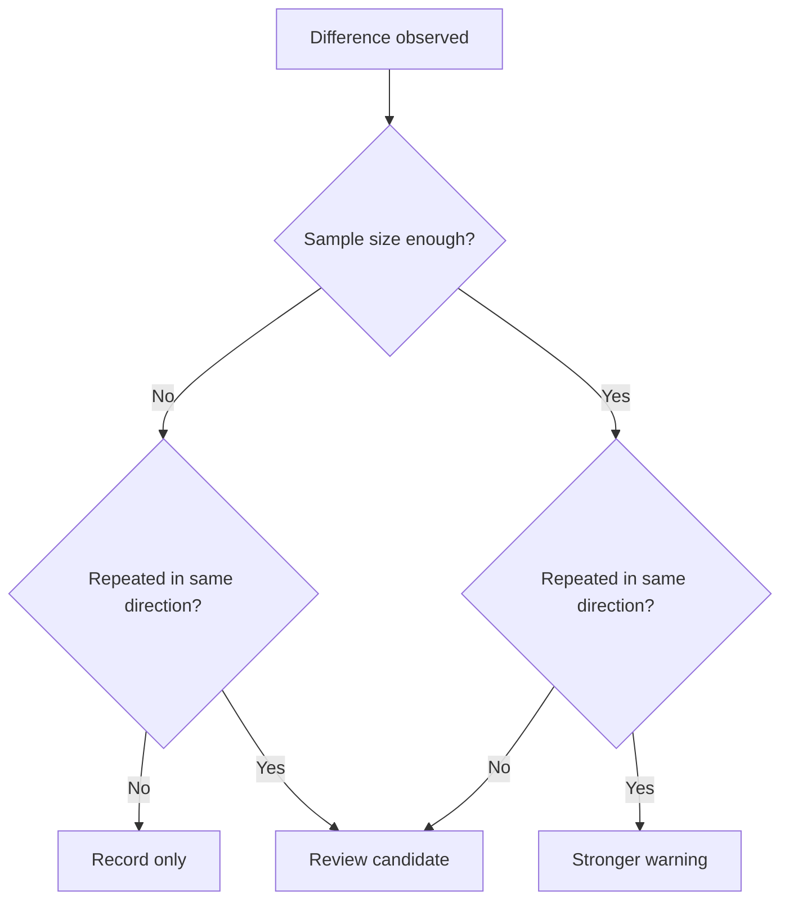

# P3-8.1 해석 강도는 무엇으로 조절하는가

> Section ID: `P3-8.1`
> Version: `v2026.07.08`

지금까지 우리는 샘플 단위, 요약 표, 특징, 기준선 비교 구조를 만들었습니다. 하지만 비교표가 있다고 해서 모든 차이를 같은 강도로 읽을 수 있는 것은 아닙니다. 특히 운영 데이터에서는 표본 수가 적고, 같은 변화가 반복되는지 여부가 불분명할 수 있습니다. 그래서 해석 단계에서는 `무엇이 달라졌는가`만이 아니라 `그 차이를 얼마나 믿을 수 있는가`도 함께 봐야 합니다. Part 3의 마무리 구간은 바로 이 해석 강도를 조절하는 기준에서 시작합니다.

표본 수가 적으면 평균, 변동성, 대표 패턴 같은 값이 쉽게 흔들립니다. 예를 들어 최근 2건의 평균과 기준선 차이 0.3은 인상적으로 보일 수 있습니다. 하지만 최근 20건의 평균과 기준선 차이 0.3과는 무게가 다릅니다. 수치가 같아도, 그 차이가 몇 건에서 나온 것인지에 따라 해석의 강도는 달라져야 합니다.

여기서 중요한 것은 `데이터가 적으면 아무 말도 하지 말아야 한다`가 아닙니다. 더 정확한 표현은 `데이터가 적을수록 덜 확신하며 말해야 한다`입니다. 즉 해석을 멈추는 것이 아니라, 해석의 강도를 조절해야 합니다.

반복성도 같은 이유로 중요합니다. 한 번 크게 튄 변화와, 여러 번 조금씩 같은 방향으로 움직이는 변화는 운영상 의미가 다를 수 있습니다. 때로는 단발성 급락보다 최근 여러 구간에서 반복적으로 나타나는 약한 하락이 더 중요합니다. 운영자가 보고 싶은 것은 종종 `한 번의 특이한 사례`보다 `상태가 달라지고 있는 징후`이기 때문입니다.

즉 해석에는 최소 두 축이 함께 들어갑니다. 하나는 `얼마나 많이 관측되었는가`이고, 다른 하나는 `같은 방향 변화가 얼마나 반복되었는가`입니다. 표본 수만 보면 놓치는 신호가 있고, 반복성만 보면 우연을 과대해석할 위험이 있습니다. 그래서 운영 데이터에서는 두 축을 함께 놓고 읽는 습관이 중요합니다.

| 상황 | 해석할 때 조심할 점 |
| --- | --- |
| 표본 수가 적고 반복도 약함 | 우연일 가능성을 더 크게 본다 |
| 표본 수가 적지만 같은 방향 변화가 반복됨 | 강한 결론은 보류하되 주의 깊게 본다 |
| 표본 수가 충분하고 반복도 있음 | 더 신뢰할 만한 변화 신호로 읽을 수 있다 |

이 표를 조금 더 실무적으로 바꾸면 다음과 같은 문장으로 이어집니다.

- 표본 수가 적고 반복도 약하면: 기록은 남기되 경고 강도는 낮춘다.
- 표본 수가 적지만 반복되면: 자동 확정보다 사람 검토 후보로 올린다.
- 표본 수와 반복성이 모두 충분하면: 더 강한 경고나 후속 분석으로 넘길 수 있다.

여기서는 `이럴 때는 아직 세게 말하지 않는다`는 기준을 함께 두어 해석 강도를 조절합니다.

| 관측 상태 | 아직 세게 말하지 않는 문장 | 더 안전한 문장 |
| --- | --- | --- |
| 최근 2건만 다름 | 상태가 확실히 바뀌었다 | 최근 소수 사례에서 차이가 보여 추가 관찰이 필요하다 |
| 반복성 약함 | 원인이 분명하다 | 반복 신호가 약해 원인 확정은 보류한다 |
| 표본 수와 반복성 모두 중간 수준 | 곧바로 자동 경보로 확정한다 | 검토 우선순위를 높이되 확정 진단은 보류한다 |

여기서 중요한 점은 `판단을 멈추는가`보다 `판단의 강도를 어떻게 조절하는가`입니다. 이 관점이 있어야 뒤에서 경고 임계값, 검토 큐(review queue), 평가(evaluation)를 설명할 때도 독자가 왜 둔감함이 필요한지 이해할 수 있습니다.

짧은 숫자 예시로 보면 왜 같은 차이도 다르게 읽어야 하는지 더 분명합니다.

```python
import pandas as pd

cases = pd.DataFrame(
    [
        {"window_id": "small-sample", "event_count": 2, "recent_mean": 2.10, "baseline_mean": 2.40},
        {"window_id": "large-sample", "event_count": 20, "recent_mean": 2.10, "baseline_mean": 2.40},
    ]
)
cases["diff"] = cases["recent_mean"] - cases["baseline_mean"]

print(cases)
```

예상 출력:

```text
1) same diff, different sample size
       window_id  event_count  recent_mean  baseline_mean  diff
0   small-sample            2         2.10            2.4  -0.3
1   large-sample           20         2.10            2.4  -0.3
```

두 경우의 차이값은 모두 `-0.3`입니다. 하지만 이 예제의 목적은 `같은 diff라도 표본 수가 다르면 해석 강도는 달라진다`는 점을 먼저 확인하는 데 있습니다. 첫 번째는 2건, 두 번째는 20건에서 나온 값이므로, 숫자가 같아도 같은 문장으로 말할 수 없습니다. 즉 여기서 `event_count`는 부가 정보가 아니라 해석 강도를 바꾸는 조건입니다.

반복성도 비슷하게 볼 수 있습니다.

```python
repeatability = pd.DataFrame(
    [
        {"window_id": "single-drop", "direction_signals": [-1, 0, 0, 0]},
        {"window_id": "repeated-drop", "direction_signals": [-1, -1, -1, -1]},
    ]
)
repeatability["repeatability_score"] = repeatability["direction_signals"].apply(sum)

print("2) same direction scale, different repeatability")
print(repeatability[["window_id", "repeatability_score"]])
```

예상 출력:

```text
2) same direction scale, different repeatability
        window_id  repeatability_score
0     single-drop                   -1
1   repeated-drop                   -4
```

이 예제의 목적은 반복성 축을 따로 보여 주는 데 있습니다. 한 번의 하락과 반복적 하락은 같은 변화 신호가 아니므로, 해석 강도도 같을 수 없습니다. 따라서 이 절의 두 코드는 각각 `표본 수 축`과 `반복성 축`을 따로 확인하는 예제로 읽어야 합니다.

이 두 예제는 다음 순서로 연결됩니다.

1. 차이값이 같아도 표본 수가 다르면 표현 강도가 달라져야 함을 본다.
2. 표본 수가 비슷해도 반복 방향이 다르면 같은 종류의 변화로 읽지 않는다는 점을 본다.
3. 마지막에야 `기록`, `검토 후보`, `강한 경고` 중 어디까지 말할지 정한다.

두 예시를 합쳐 읽으면 더 분명해집니다. `-0.3` 차이가 있다고 해서 곧바로 같은 수준의 경고를 내릴 수는 없습니다. 그 차이가 2건에서 나왔는지 20건에서 나왔는지, 그리고 최근 여러 구간에서 같은 방향으로 반복되었는지를 같이 봐야 합니다. 즉 해석은 숫자 하나를 읽는 일이 아니라, 숫자가 놓인 관측 조건을 함께 읽는 일입니다.

이 판단을 더 짧게 줄이면 다음처럼 정리할 수 있습니다.

| 관측 조건 | 더 자연스러운 해석 강도 |
| --- | --- |
| 표본 수 적음 + 반복 약함 | 기록 수준에 가깝게 남긴다 |
| 표본 수 적음 + 반복 있음 | 검토 후보로 올린다 |
| 표본 수 충분 + 반복 있음 | 더 강한 변화 신호로 읽을 수 있다 |

이 표의 핵심은 해석을 멈추자는 뜻이 아니라, 같은 차이라도 관측 조건에 따라 말하는 강도를 조절해야 한다는 점입니다.

## 작은 도식으로 보기


```mermaid
flowchart TD
    A[Difference observed] --> B{Sample size enough?}
    B -- No --> C{Repeated in same direction?}
    C -- No --> D[Record only]
    C -- Yes --> E[Review candidate]
    B -- Yes --> F{Repeated in same direction?}
    F -- No --> E
    F -- Yes --> G[Stronger warning]
```

## 짧은 점검

- 같은 `diff`라도 표본 수가 다르면 왜 같은 문장으로 말하면 안 되는가
- 반복성이 약한 변화와 반복되는 변화는 왜 운영상 의미가 다를 수 있는가
- `기록`, `검토 후보`, `강한 경고`를 왜 같은 강도로 쓰지 않는가
- 해석 강도를 낮춘다는 말을 이 절의 예시로 설명할 수 있는가

핵심은 `표본 수가 적을수록 차이는 더 조심스럽게 읽어야 한다`는 점과 `반복되는 변화는 단발성 변화와 다른 의미를 가질 수 있다`는 점입니다. 다음 절에서는 이 기준을 바탕으로, 왜 변화 신호와 원인 확정을 같은 문장으로 말하면 안 되는지 더 분명히 다룹니다.

## 언제 이 관점을 먼저 떠올려야 하는가

- 같은 차이값이라도 표본 수와 반복성에 따라 말하는 강도를 다르게 해야 할 때 해석 강도 조절 관점을 먼저 떠올립니다.
- `기록`, `검토 후보`, `강한 경고`를 어떤 관측 조건에서 구분해야 하는지 점검할 때 이 절로 돌아옵니다.
- 해석을 멈추는 것이 아니라 덜 확신하며 말해야 한다는 원칙을 다시 확인할 때 이 절이 기준이 됩니다.
